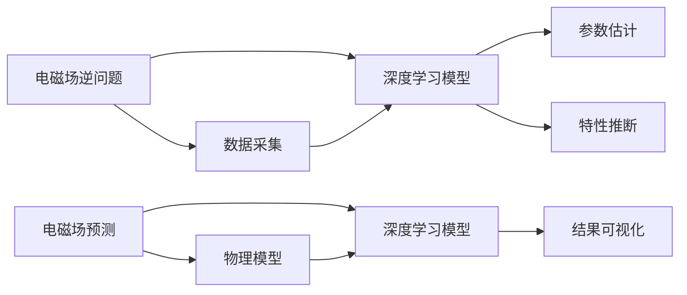

                 

## 1. 背景介绍

电磁场理论作为物理学的重要基石，对现代科技的发展影响深远。从无线电通信到医学影像，从电子元件设计到天气预报，电磁场理论的应用无处不在。近年来，随着人工智能(AI)技术的飞速发展，电磁场理论与AI技术的结合，开启了一个崭新的研究领域——AI for Science，为科学问题的解决提供了新的手段。

电磁场理论是研究电磁现象的基本规律，包括静电场、磁场、电磁波等。传统上，电磁场问题的求解需要复杂的数学建模和数值计算。然而，随着深度学习技术的兴起，利用深度神经网络，通过大规模数据驱动，使得电磁场问题的求解变得更加高效和精确。

## 2. 核心概念与联系

### 2.1 核心概念概述

在AI for Science中，电磁场理论的应用主要通过两个方向展开：

- **电磁场逆问题（Inverse Electromagnetic Problem）**：将观测到的电磁场数据，反推计算模型的参数和特性，例如材料的电磁性质、几何形状等。
- **电磁场预测（Electromagnetic Field Prediction）**：通过建立合适的模型，对未来电磁场进行预测和仿真，例如电磁波传播、辐射场计算等。

### 2.2 核心概念原理和架构的 Mermaid 流程图



## 3. 核心算法原理 & 具体操作步骤

### 3.1 算法原理概述

电磁场逆问题和预测的算法原理主要基于两个部分：

- **数据驱动的深度学习模型**：通过大量电磁场数据进行训练，建立能够映射电磁场数据和物理参数的深度神经网络。
- **物理约束的集成**：在模型训练过程中，通过正则化技术或者融合物理模型，确保模型的解在物理上合理、可行。

### 3.2 算法步骤详解

#### 3.2.1 数据采集与预处理

电磁场数据的采集通常需要专业的设备，如电磁场接收器、光学传感器等。数据预处理包括数据清洗、噪声去除、特征提取等步骤。

#### 3.2.2 模型构建

构建深度学习模型时，一般采用卷积神经网络(CNN)、全连接神经网络(FCN)、生成对抗网络(GAN)等，根据具体问题和数据特性进行选择。

#### 3.2.3 参数估计与特性推断

利用训练好的模型，对给定的电磁场数据进行参数估计和特性推断。参数估计通常包括材料特性、几何形状等；特性推断则是对电磁场分布、辐射特征等进行预测。

#### 3.2.4 结果可视化与验证

将模型预测结果与实际观测数据进行对比，利用可视化工具展示计算结果，验证模型的准确性。

### 3.3 算法优缺点

#### 3.3.1 优点

- **高效性**：深度学习模型能够快速处理大规模数据，加速电磁场问题的求解。
- **高精度**：利用深度学习模型的非线性映射能力，能够提高预测和推断的精度。
- **泛化性强**：通过调整模型结构和训练数据，能够适应不同的电磁场问题。

#### 3.3.2 缺点

- **数据依赖**：深度学习模型依赖大量数据进行训练，数据获取和预处理成本较高。
- **模型复杂性**：深度神经网络结构复杂，难以解释其内部工作机制。
- **过拟合风险**：在训练过程中容易过拟合，需要适当进行正则化和模型优化。

### 3.4 算法应用领域

电磁场理论与AI的结合，已经在以下领域得到了广泛应用：

- **电磁兼容（EMC）**：通过逆问题分析电磁干扰源，优化电子产品设计。
- **雷达和通信**：预测电磁波传播路径，优化天线设计和信号传输。
- **医学成像**：利用电磁场数据，推断人体组织特性，进行疾病诊断。
- **环境监测**：分析电磁辐射对环境的干扰，进行环境保护评估。
- **能源和电力**：优化电力线路布局，提高电力传输效率。

## 4. 数学模型和公式 & 详细讲解

### 4.1 数学模型构建

电磁场问题的数学模型通常基于麦克斯韦方程组，其一般形式为：

$$
\begin{cases}
\nabla \times \mathbf{E} = -\frac{\partial \mathbf{B}}{\partial t}, \\
\nabla \times \mathbf{H} = \mathbf{J} + \frac{\partial \mathbf{D}}{\partial t}, \\
\nabla \cdot \mathbf{D} = \rho, \\
\nabla \cdot \mathbf{B} = 0.
\end{cases}
$$

其中，$\mathbf{E}$ 和 $\mathbf{H}$ 分别为电场和磁场，$\mathbf{B}$ 和 $\mathbf{D}$ 分别为磁感应强度和位移电流，$\rho$ 为电荷密度，$\mathbf{J}$ 为电流密度。

### 4.2 公式推导过程

以电磁波传播为例，假设电磁波在真空中传播，麦克斯韦方程组可以简化为：

$$
\nabla \times \mathbf{E} = -\mu_0 \frac{\partial \mathbf{B}}{\partial t}, \quad \nabla \times \mathbf{H} = \epsilon_0 \frac{\partial \mathbf{E}}{\partial t}.
$$

其中，$\mu_0$ 为真空磁导率，$\epsilon_0$ 为真空电容率。根据法拉第电磁感应定律，电磁波的传播速度为 $c = \frac{1}{\sqrt{\mu_0 \epsilon_0}}$。

### 4.3 案例分析与讲解

以雷达系统为例，雷达接收到的信号可以表示为：

$$
S(t) = \int_{-\infty}^{\infty} R(t-\tau) e^{j(2\pi f t + \phi)} d\tau,
$$

其中，$S(t)$ 为接收到的信号，$R(t)$ 为目标反射信号，$f$ 为信号频率，$\phi$ 为相位偏移。通过对信号的处理，可以推断出目标的几何位置和物理特性。

## 5. 项目实践：代码实例和详细解释说明

### 5.1 开发环境搭建

构建电磁场问题的深度学习模型，通常需要以下工具：

- **Python**：作为编程语言，提供了丰富的科学计算库。
- **NumPy**：用于数学计算和数组操作。
- **TensorFlow**：提供高效的深度学习框架，支持GPU加速。
- **PyTorch**：提供了动态计算图，易于模型构建和调试。
- **Matplotlib**：用于数据可视化。

安装上述工具的步骤如下：

```bash
# 安装Python
# 安装NumPy
pip install numpy
# 安装TensorFlow
pip install tensorflow
# 安装PyTorch
pip install torch
# 安装Matplotlib
pip install matplotlib
```

### 5.2 源代码详细实现

以下是一个简单的电磁场预测模型的Python代码示例，用于计算电磁波在均匀介质中的传播：

```python
import numpy as np
import tensorflow as tf
import matplotlib.pyplot as plt

# 定义电磁波传播方程
def electromagnetic_wave(x, t, epsilon, mu):
    wave = np.sqrt(epsilon / mu) * np.exp(1j * (np.sqrt(epsilon * mu) * x / np.sqrt((epsilon * mu) * c) * t))
    return wave

# 定义介质参数
epsilon = 8.85e-12  # 真空电容率
mu = 4 * np.pi * 10e-7  # 真空磁导率
c = 3e8  # 光速

# 计算电磁波传播
x = np.linspace(-10, 10, 1000)
t = np.linspace(0, 1, 1000)
wave = electromagnetic_wave(x, t, epsilon, mu)

# 可视化结果
plt.plot(x, wave)
plt.xlabel('x (m)')
plt.ylabel('E (V/m)')
plt.show()
```

### 5.3 代码解读与分析

代码实现中，我们首先定义了电磁波传播的公式，然后通过给定介质参数和传播时间，计算出电磁波的传播路径。最后，使用Matplotlib库将结果可视化展示。

## 6. 实际应用场景

### 6.1 智能天线设计

电磁场理论在智能天线设计中得到广泛应用。通过深度学习模型，可以根据电磁波传播特性，优化天线的几何形状和材料特性，从而提高天线的接收效率和覆盖范围。

### 6.2 电磁干扰分析

电磁干扰分析是电磁兼容（EMC）测试的重要内容。利用深度学习模型，可以分析电磁干扰源的位置和特性，指导产品的优化设计，减少电磁干扰对系统的影响。

### 6.3 医学影像重建

在医学影像重建中，深度学习模型可以用于电磁场的逆问题求解。通过分析电磁波在人体中的传播，推断出组织特性和病变位置，为医学诊断提供新手段。

### 6.4 环境监测与治理

电磁场监测对于环境保护具有重要意义。通过深度学习模型，可以分析电磁辐射对环境的影响，预测电磁污染区域，为环境保护提供科学依据。

### 6.5 智能交通系统

电磁场理论在智能交通系统中也有广泛应用。通过分析交通信号和车辆的位置，利用深度学习模型，可以优化交通流量和信号控制，提高交通系统的效率和安全性。

## 7. 工具和资源推荐

### 7.1 学习资源推荐

- **《电磁场理论与深度学习结合的理论与实践》**：深入探讨电磁场理论与深度学习的结合，提供丰富的案例和代码实现。
- **《深度学习在电磁场中的应用》**：详细讲解深度学习在电磁场问题中的应用，提供系统性的学习材料。
- **Deep Learning in Electromagnetics**：一本前沿综述文章，介绍电磁场中的深度学习应用。

### 7.2 开发工具推荐

- **TensorFlow**：支持GPU加速，适合大规模计算任务。
- **PyTorch**：动态计算图，易于模型构建和调试。
- **Jupyter Notebook**：交互式编程环境，适合快速原型开发。
- **Anaconda**：Python环境管理工具，支持多种科学计算库的安装和配置。

### 7.3 相关论文推荐

- **"Deep Learning and inverse problems in EM field computation"**：探讨深度学习在电磁场逆问题中的应用。
- **"An efficient neural network for solving inverse scattering problem"**：介绍一种高效的神经网络模型，用于电磁场的逆问题求解。
- **"Physics-informed neural networks for solving electromagnetic inverse problems"**：利用物理模型约束，提高深度学习模型的精度和鲁棒性。

## 8. 总结：未来发展趋势与挑战

### 8.1 研究成果总结

电磁场理论与AI的结合，为解决复杂电磁场问题提供了新的途径。通过深度学习模型，可以高效地处理大规模电磁场数据，提高预测和推断的精度。然而，电磁场问题的复杂性，使得深度学习模型在实际应用中仍面临诸多挑战。

### 8.2 未来发展趋势

- **跨学科融合**：电磁场理论与AI的结合将进一步深化，促进多学科交叉融合。
- **实时化与自适应**：未来的模型将更加注重实时性和自适应能力，适应动态变化的电磁环境。
- **多模态融合**：结合其他传感器数据，如光学、声学等，实现多模态数据的综合分析。
- **低成本解决方案**：探索基于深度学习的低成本电磁场测量方法，降低电磁场问题研究的门槛。

### 8.3 面临的挑战

- **数据获取与标注**：电磁场问题的高成本数据获取和标注，仍然是制约研究的主要因素。
- **模型复杂性与解释性**：深度学习模型在解释其内部工作机制方面仍有不足。
- **计算资源需求**：电磁场问题的复杂性，使得模型训练和推理对计算资源的需求较高。
- **物理模型的融合**：如何在模型训练中有效融合物理模型，确保模型解在物理上合理，是未来的重要研究方向。

### 8.4 研究展望

未来的研究应在以下几个方向寻求突破：

- **深度学习与物理模型的结合**：探索如何将深度学习与物理模型进行有机结合，提升模型的解释性和精度。
- **跨模态融合**：结合不同类型传感器数据，进行多模态融合分析，提升模型的泛化能力。
- **高效计算方法**：开发高效的计算方法，降低计算资源的消耗，提高模型的实时性。
- **自动化学习框架**：探索自动化学习框架，减少人工干预，提高模型的训练效率。

电磁场理论与AI的结合，为科学问题的求解提供了新的手段，但其发展仍面临着诸多挑战。通过跨学科的深度合作，不断突破技术瓶颈，电磁场理论将在AI for Science中发挥更大的作用。

## 9. 附录：常见问题与解答

**Q1：电磁场问题的深度学习模型是否适用于所有情况？**

A: 电磁场问题的深度学习模型在特定条件下可以取得较好效果，但在复杂场景下仍需结合物理模型进行优化。

**Q2：深度学习模型在电磁场问题中是否能够解释其内部工作机制？**

A: 目前深度学习模型在电磁场问题中的应用，更多依赖于数据驱动，其内部工作机制的解释仍需进一步研究。

**Q3：电磁场预测模型的训练数据如何获取？**

A: 电磁场预测模型的训练数据通常需要专业设备进行采集和标注，成本较高。但随着自动化的进步，未来的数据获取将更加便捷。

**Q4：如何优化电磁场预测模型的计算效率？**

A: 优化模型计算效率可以通过数据压缩、模型剪枝、并行计算等方法实现，需要结合具体问题和计算资源进行优化。

**Q5：电磁场逆问题求解中如何处理噪声数据？**

A: 通过数据预处理，如滤波、降噪等方法，减少噪声对模型的影响。同时，采用更复杂的模型结构和训练技术，提高模型的鲁棒性。

---

作者：禅与计算机程序设计艺术 / Zen and the Art of Computer Programming

