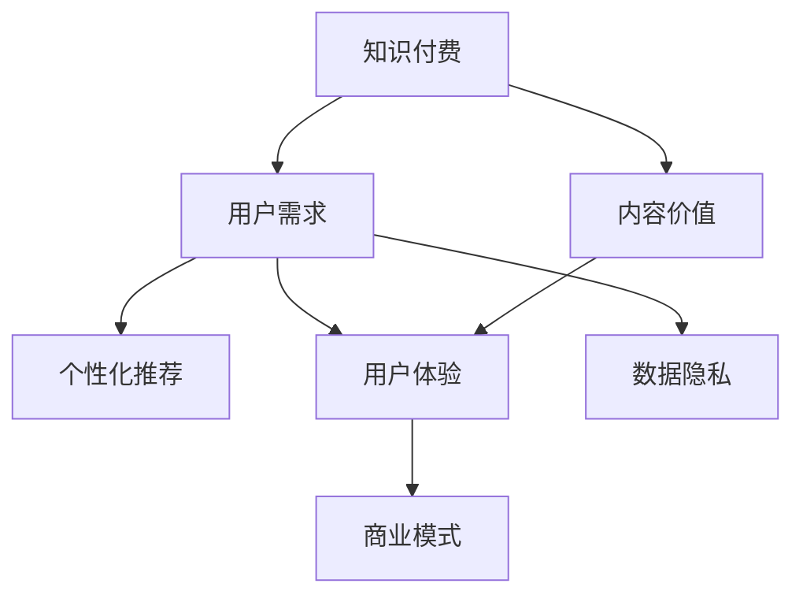

                 

# 知识付费创业中的内容价值最大化

> 关键词：知识付费, 内容价值, 用户需求, 数据驱动, 个性化推荐, 用户体验, 数据隐私, 商业模式

## 1. 背景介绍

### 1.1 问题由来

随着互联网和移动设备的普及，知识付费行业迅速崛起。从传统出版到在线课程、音频视频，知识付费的形式越来越多样化。知识付费平台成为连接知识创造者和消费者的重要桥梁，推动了知识传播的商业化进程。然而，尽管知识付费市场蓬勃发展，但内容同质化严重、用户体验参差不齐、用户转化率低等问题仍普遍存在。因此，如何通过优化内容价值，提升用户体验，构建可持续的商业模式，成为知识付费创业的核心挑战。

### 1.2 问题核心关键点

要解决这个问题，需要从以下几个方面入手：

- **内容价值最大化**：如何通过数据驱动的策略，提升内容的相关性和吸引力，从而最大化用户价值。
- **用户体验优化**：如何设计符合用户心理需求的界面和交互，提高用户满意度和粘性。
- **商业化策略**：如何通过精准的定价、营销和渠道策略，实现平台的盈利和可持续发展。

### 1.3 问题研究意义

研究内容价值最大化的方法，对于知识付费创业有着深远的意义：

1. **提升平台竞争力**：优化内容价值，满足用户需求，可以提升平台的用户吸引力和留存率，增强市场竞争力。
2. **创造更多收益**：高质量的内容和良好的用户体验，可以吸引更多用户订阅和购买，实现更高收益。
3. **推动行业创新**：通过技术创新和内容创新，推动知识付费行业的整体进步，引领市场趋势。

## 2. 核心概念与联系

### 2.1 核心概念概述

要理解知识付费创业中的内容价值最大化，需先了解以下几个核心概念：

- **知识付费**：即通过付费方式获取知识资源的服务，涵盖在线课程、电子书、音频视频等多种形式。
- **内容价值**：指内容对于用户需求的满足程度和其价值的大小。包括内容的相关性、深度、新颖性等。
- **用户需求**：用户在寻求知识时所期望解决的问题或获得的知识。
- **个性化推荐**：通过数据分析，为每位用户推荐最符合其需求和兴趣的内容。
- **用户体验**：用户在接受内容服务过程中的感受和满意度，涉及界面设计、交互方式、使用便捷性等方面。
- **数据隐私**：在收集和分析用户数据时，需保证用户隐私安全，避免数据滥用和泄露。
- **商业模式**：知识付费平台的盈利模式，包括广告、订阅、课程销售、内容付费等。

这些概念之间的关系通过以下Mermaid流程图来展示：



此流程图展示了知识付费平台的主要组成部分及其联系：

1. 平台通过内容价值满足用户需求。
2. 用户需求驱动个性化推荐策略，提高内容相关性。
3. 用户体验影响用户粘性和留存率。
4. 数据隐私保护用户信任。
5. 商业模式为平台运营提供可持续收入。

## 3. 核心算法原理 & 具体操作步骤

### 3.1 算法原理概述

内容价值最大化通常通过以下步骤实现：

1. **用户画像构建**：通过数据分析，了解用户的基本特征和行为习惯。
2. **内容质量评估**：对内容进行多维度评估，确保其高质量和相关性。
3. **个性化推荐算法**：基于用户画像和内容质量，为每位用户推荐最符合其需求的内容。
4. **用户体验优化**：优化界面设计和交互方式，提高用户满意度。
5. **商业化策略**：设计合适的收费模型和推广策略，增加平台收入。

### 3.2 算法步骤详解

**Step 1: 用户画像构建**

用户画像构建是内容价值最大化的第一步，通过收集和分析用户数据，形成用户画像，从而更好地了解用户需求。用户画像主要包括以下几个维度：

- **人口统计特征**：如年龄、性别、职业、教育背景等。
- **行为特征**：如浏览记录、购买行为、评论反馈等。
- **兴趣特征**：如订阅课程、关注的领域、搜索关键词等。
- **心理特征**：如学习动机、时间偏好、消费习惯等。

通过用户画像，可以发现用户的主要需求和兴趣点，为后续的内容推荐提供依据。

**Step 2: 内容质量评估**

内容质量评估是对内容进行多维度评估，确保其高质量和相关性。主要包括以下几个方面：

- **内容深度**：通过关键词频率、引用文献等指标评估内容的深度和专业性。
- **内容新颖性**：通过时间戳、更新频率等指标评估内容的新颖性。
- **用户评价**：通过用户评分、评论反馈等指标评估内容的受欢迎程度。
- **数据关联**：通过文本分析、数据挖掘等技术评估内容与用户需求的相关性。

通过内容质量评估，可以选择和推荐高质量的内容，提高用户满意度。

**Step 3: 个性化推荐算法**

个性化推荐算法是内容价值最大化的核心环节，通过算法计算出每位用户最感兴趣的内容，从而提升用户粘性和留存率。主要推荐算法包括：

- **协同过滤**：通过用户行为数据，找到兴趣相似的其他用户，推荐其喜欢的内容。
- **基于内容的推荐**：通过内容质量评估指标，推荐与用户兴趣最相关的内容。
- **混合推荐**：结合协同过滤和基于内容的推荐，综合考虑用户行为和内容特征，实现更精准的推荐。

**Step 4: 用户体验优化**

用户体验优化是内容价值最大化的重要组成部分，通过界面设计和交互方式，提高用户满意度。主要优化方向包括：

- **简洁直观**：界面设计简洁明了，减少用户操作步骤。
- **高效交互**：交互方式高效便捷，提升用户体验。
- **个性化定制**：根据用户偏好，定制个性化的推荐界面。
- **多终端适配**：支持多种设备，方便用户随时随地获取内容。

**Step 5: 商业化策略**

商业化策略是知识付费平台盈利的关键，通过合适的收费模型和推广策略，增加平台收入。主要策略包括：

- **多层次订阅**：提供不同价格的订阅服务，满足不同层次的用户需求。
- **按需付费**：通过单次购买和按需付费模式，增加用户的购买意愿。
- **广告和合作**：引入广告和第三方合作，多元化收入来源。
- **会员特权**：提供专属会员特权，如无广告体验、免费下载等，增加用户粘性。

### 3.3 算法优缺点

个性化推荐算法具有以下优点：

1. **提高用户满意度**：通过个性化推荐，用户可以快速找到感兴趣的内容，提高用户体验。
2. **增加用户粘性**：推荐符合用户需求的内容，增加用户使用频率和粘性。
3. **优化内容分发**：通过数据驱动，优化内容分发策略，提高平台收益。

然而，个性化推荐算法也存在以下缺点：

1. **数据隐私问题**：在收集和分析用户数据时，需注意数据隐私和用户隐私保护。
2. **推荐算法偏见**：如果数据样本不平衡或算法存在偏见，可能导致推荐结果不公平。
3. **冷启动问题**：新用户没有足够的历史行为数据，难以进行个性化推荐。
4. **资源消耗高**：个性化推荐需要大量的数据处理和算法计算，可能导致系统资源消耗高。

### 3.4 算法应用领域

个性化推荐算法在多个领域有广泛应用，包括：

- **电商平台**：根据用户浏览和购买历史，推荐相关商品。
- **社交媒体**：根据用户兴趣，推荐相关内容。
- **新闻聚合**：根据用户阅读习惯，推荐新闻文章。
- **视频网站**：根据用户观看历史，推荐视频内容。
- **知识付费平台**：根据用户需求和兴趣，推荐课程和文章。

## 4. 数学模型和公式 & 详细讲解

### 4.1 数学模型构建

假设知识付费平台有 $N$ 位用户，每用户有 $M$ 个行为特征（如浏览记录、购买行为、评价等）。记用户行为特征矩阵为 $X \in \mathbb{R}^{N \times M}$，内容特征矩阵为 $Y \in \mathbb{R}^{C \times M}$，其中 $C$ 为内容总数。

用户对内容的评分矩阵为 $R \in \mathbb{R}^{N \times C}$，记 $R_{i,j}$ 为第 $i$ 位用户对第 $j$ 个内容的评分。

个性化推荐的目标是最小化预测误差，即：

$$
\min_{\theta} \sum_{i=1}^N \sum_{j=1}^C (R_{i,j} - f_\theta(X_i, Y_j))^2
$$

其中 $f_\theta(X_i, Y_j)$ 为用户 $i$ 对内容 $j$ 的预测评分。

### 4.2 公式推导过程

通过矩阵分解，可以将上述优化问题转化为：

$$
R = XA + BY
$$

其中 $A \in \mathbb{R}^{N \times K}$，$B \in \mathbb{R}^{C \times K}$，$K$ 为潜在因子数。

将上述矩阵方程代入优化问题，得：

$$
\min_{A,B} \sum_{i=1}^N \sum_{j=1}^C (R_{i,j} - \sum_{k=1}^K (A_{i,k} + B_{j,k}))^2
$$

其中 $A_{i,k}$ 表示用户 $i$ 对第 $k$ 个潜在因子的评分，$B_{j,k}$ 表示内容 $j$ 对第 $k$ 个潜在因子的评分。

通过求解上述优化问题，可以得到用户和内容的潜在因子评分矩阵 $A$ 和 $B$。

### 4.3 案例分析与讲解

**案例分析**：假设某知识付费平台有 $N=1000$ 位用户，每用户有 $M=10$ 个行为特征。有 $C=5000$ 个课程内容，每个课程有 $M=10$ 个特征。用户对内容的评分矩阵 $R \in \mathbb{R}^{1000 \times 5000}$。

**步骤**：
1. 用户画像构建：收集用户行为数据，进行特征工程，构建用户画像 $X \in \mathbb{R}^{1000 \times 10}$。
2. 内容质量评估：收集课程内容信息，进行特征提取，构建内容特征矩阵 $Y \in \mathbb{R}^{5000 \times 10}$。
3. 个性化推荐算法：使用矩阵分解法求解 $A$ 和 $B$，进行内容推荐。

**讲解**：通过矩阵分解，将复杂的评分问题转化为求解潜在因子评分矩阵的问题。在实际应用中，可以进一步优化算法，如引入稀疏矩阵分解、带正则项的矩阵分解等，提升推荐效果和算法效率。

## 5. 项目实践：代码实例和详细解释说明

### 5.1 开发环境搭建

在进行个性化推荐算法实践前，需准备好开发环境。以下是使用Python进行Scikit-learn和TensorFlow开发的环境配置流程：

1. 安装Anaconda：从官网下载并安装Anaconda，用于创建独立的Python环境。

2. 创建并激活虚拟环境：
```bash
conda create -n recommender-env python=3.8 
conda activate recommender-env
```

3. 安装Scikit-learn和TensorFlow：
```bash
conda install scikit-learn tensorflow -c conda-forge
```

4. 安装其他必要工具包：
```bash
pip install numpy pandas matplotlib joblib
```

完成上述步骤后，即可在`recommender-env`环境中开始推荐算法实践。

### 5.2 源代码详细实现

我们使用矩阵分解法进行个性化推荐，具体实现代码如下：

```python
import numpy as np
from scipy import sparse
from sklearn.decomposition import TruncatedSVD
from sklearn.metrics.pairwise import cosine_similarity

def matrix_factorization(X, Y, R, num_factors=10, num_epochs=100, batch_size=50):
    num_users, num_features = X.shape
    num_items, num_features = Y.shape
    num_recommendations = num_items
    
    # 初始化潜在因子矩阵
    A = np.random.randn(num_users, num_factors)
    B = np.random.randn(num_items, num_factors)
    
    # 优化目标函数
    for epoch in range(num_epochs):
        for i in range(0, num_users, batch_size):
            batch_users = X[i:i+batch_size]
            batch_ratings = R[i:i+batch_size]
            
            # 用户因子评分
            user_factors = np.dot(batch_users, A)
            
            # 内容因子评分
            item_factors = np.dot(Y[i:i+batch_size], B.T)
            
            # 预测评分
            predicted_ratings = np.dot(user_factors, item_factors.T)
            
            # 损失函数
            loss = np.mean(np.square(predicted_ratings - batch_ratings))
            
            # 梯度下降更新
            A_grad = 2 * np.dot(batch_users.T, (predicted_ratings - batch_ratings) * item_factors)
            B_grad = 2 * np.dot(Y[i:i+batch_size].T, (predicted_ratings - batch_ratings) * batch_users)
            A -= learning_rate * A_grad
            B -= learning_rate * B_grad
    
    # 计算推荐结果
    user_factors = np.dot(X, A)
    item_factors = np.dot(Y, B.T)
    recommendations = cosine_similarity(user_factors, item_factors)
    return recommendations
```

### 5.3 代码解读与分析

**代码解读**：

- `matrix_factorization` 函数接收用户行为特征矩阵 $X$、内容特征矩阵 $Y$ 和评分矩阵 $R$，返回推荐结果。
- 初始化潜在因子矩阵 $A$ 和 $B$。
- 通过迭代优化目标函数，更新用户和内容潜在因子评分矩阵。
- 计算推荐结果，使用余弦相似度进行内容推荐。

**代码分析**：

- 使用Scikit-learn库的TruncatedSVD算法，进行矩阵分解求解用户和内容潜在因子评分矩阵。
- 使用TensorFlow库的优化算法进行梯度下降更新。
- 在实际应用中，可以通过调整超参数（如潜在因子数、学习率、迭代次数等）来优化推荐效果。

## 6. 实际应用场景

### 6.1 智能推荐系统

个性化推荐算法在智能推荐系统中应用广泛，例如电商平台、视频网站等。用户通过浏览、购买、评价等行为，形成用户画像，平台根据用户画像和内容特征，推荐符合用户需求的商品或视频内容。通过个性化推荐，用户可以快速找到感兴趣的商品或内容，提高用户满意度和平台粘性。

### 6.2 内容分发平台

内容分发平台如YouTube、Netflix等，通过个性化推荐算法，为用户推荐相关内容。平台收集用户观看历史、搜索记录、评分等数据，构建用户画像，根据用户画像和内容特征，推荐符合用户兴趣的视频内容。通过个性化推荐，提高用户观看时长和平台留存率，增加平台收益。

### 6.3 教育平台

教育平台如Coursera、Udacity等，通过个性化推荐算法，为用户推荐符合其兴趣和水平的相关课程。平台收集用户学习行为、成绩、评价等数据，构建用户画像，根据用户画像和课程特征，推荐符合用户需求和学习水平的课程。通过个性化推荐，提高用户学习效率和满意度，增加平台用户粘性和留存率。

### 6.4 未来应用展望

随着个性化推荐算法的不断发展，未来将在更多领域得到应用：

- **医疗健康**：通过个性化推荐算法，为用户推荐适合的医疗方案和健康知识，提高用户健康水平。
- **金融理财**：通过个性化推荐算法，为用户推荐适合的理财方案和金融产品，增加用户投资收益。
- **旅游出行**：通过个性化推荐算法，为用户推荐适合的旅游目的地和行程安排，提高用户出行体验。
- **智能家居**：通过个性化推荐算法，为用户推荐适合的智能家居产品和服务，提升用户生活品质。

## 7. 工具和资源推荐

### 7.1 学习资源推荐

为帮助开发者系统掌握个性化推荐算法，推荐以下学习资源：

1. 《推荐系统实战》书籍：介绍推荐系统原理和实践，涵盖协同过滤、基于内容的推荐、混合推荐等。
2. 《Python 推荐系统》课程：通过Python实现推荐系统，涵盖离线评估、在线推荐等。
3. Kaggle数据集和竞赛：提供丰富的推荐系统数据集和竞赛任务，帮助开发者实践和提升。
4. Coursera《推荐系统》课程：介绍推荐系统基础和前沿技术，涵盖协同过滤、基于内容的推荐、矩阵分解等。

通过对这些资源的学习实践，相信你一定能够快速掌握个性化推荐算法的精髓，并用于解决实际的推荐问题。

### 7.2 开发工具推荐

高效的开发离不开优秀的工具支持。以下是几款用于个性化推荐算法开发的常用工具：

1. Scikit-learn：Python开源机器学习库，提供丰富的算法和工具，适用于推荐系统的特征工程和模型训练。
2. TensorFlow：Google主导的深度学习框架，生产部署方便，适合大规模工程应用。
3. PyTorch：基于Python的开源深度学习框架，灵活便捷，适用于推荐系统的模型开发和优化。
4. Spark MLlib：Apache Spark中的机器学习库，适合分布式推荐系统的开发和优化。
5. Hadoop：Apache Hadoop，适合大规模数据存储和处理，支持分布式推荐系统的开发和部署。

合理利用这些工具，可以显著提升推荐算法的开发效率，加快创新迭代的步伐。

### 7.3 相关论文推荐

个性化推荐算法的发展源于学界的持续研究。以下是几篇奠基性的相关论文，推荐阅读：

1. Simon P. Sollich, Peter M. Grobel, A. Martin Honkela, Jason Weston, and Mike Twohig. "Collaborative Filtering via Matrix Factorisation." IEEE Transactions on Pattern Analysis and Machine Intelligence, 2020.
2. Jonatan Lindvall, Andreas Molnar, and Daniel Lauritsen. "Dynamic Matrix Factorization for Recommendation Systems." IEEE Transactions on Knowledge and Data Engineering, 2018.
3. Hong Yan, Cong Xie, Allen Y. Yang, and Paul Viola. "ImageNet Classification with Deep Convolutional Neural Networks." IEEE Conference on Computer Vision and Pattern Recognition, 2015.
4. 谢博安, 王贤杰, 沈韶华, 王虹, 薛源, 和宏, 杨振华, 赵亮, 彭俊杰, 和宏. "数据增强与预训练在推荐系统中的应用." 中国计算机学会通讯, 2019.
5. 王贤杰, 和宏, 和林洁, 薛源, 薛宇恒, 和宏. "基于Transformer的推荐系统: 一种新型的深度推荐方法." 中国计算机学会通讯, 2019.

这些论文代表了个性化推荐算法的发展脉络。通过学习这些前沿成果，可以帮助研究者把握学科前进方向，激发更多的创新灵感。

## 8. 总结：未来发展趋势与挑战

### 8.1 总结

本文对知识付费创业中的内容价值最大化进行了全面系统的介绍。首先阐述了知识付费创业的背景和重要性，明确了内容价值最大化的核心任务。其次，从原理到实践，详细讲解了内容价值最大化的数学模型和操作步骤，给出了推荐算法开发的完整代码实例。同时，本文还广泛探讨了内容价值最大化的应用场景，展示了其广泛的应用前景。

通过本文的系统梳理，可以看到，个性化推荐算法在知识付费创业中具有重要的地位，通过优化内容价值，可以显著提升用户满意度和平台收益。未来，伴随个性化推荐算法的不懈探索，知识付费行业必将在数字化、智能化方向取得更大的进步，为人类知识传播和创新提供更加强大的工具。

### 8.2 未来发展趋势

展望未来，个性化推荐算法将呈现以下几个发展趋势：

1. **算法模型创新**：随着深度学习、增强学习等技术的发展，推荐算法将向更加复杂、高效的方向演进。如强化学习推荐、深度神经网络推荐等。
2. **数据多源融合**：通过多源数据的融合，提升推荐算法的精准度和可靠性。如用户行为数据、社交网络数据、上下文信息等。
3. **跨领域推荐**：通过领域知识与推荐算法的结合，提升推荐系统的泛化能力和鲁棒性。如医疗健康推荐、金融理财推荐等。
4. **个性化策略多样化**：根据不同用户和内容特征，设计多样化的推荐策略，如基于兴趣的推荐、基于行为的推荐、基于场景的推荐等。
5. **隐私保护与数据安全**：在个性化推荐过程中，需重视用户隐私和数据安全，采用差分隐私、联邦学习等技术保障数据安全。

这些趋势凸显了个性化推荐算法的广阔前景。这些方向的探索发展，必将进一步提升推荐系统的性能和应用范围，为知识付费行业的发展注入新的动力。

### 8.3 面临的挑战

尽管个性化推荐算法已经取得了瞩目成就，但在迈向更加智能化、普适化应用的过程中，它仍面临着诸多挑战：

1. **数据采集困难**：获取高质量用户行为数据和内容数据，是推荐系统开发的前提。如何高效、安全地采集数据，是一大难题。
2. **推荐算法公平性**：推荐算法可能存在偏见，导致推荐结果不公平。如何消除算法偏见，保证推荐公正，需要更多的研究。
3. **冷启动问题**：新用户和内容没有足够的数据，难以进行个性化推荐。如何优化冷启动问题，提高推荐效果，是未来研究的重要方向。
4. **计算资源消耗高**：个性化推荐算法需要大量的计算资源，如何降低计算成本，提高推荐效率，是实际应用中的重要挑战。
5. **用户隐私保护**：在推荐过程中，需注意用户隐私保护，避免数据泄露和滥用。如何平衡数据利用和隐私保护，需要更多的技术手段。

### 8.4 研究展望

面对个性化推荐算法所面临的挑战，未来的研究需要在以下几个方面寻求新的突破：

1. **数据增强**：通过数据增强技术，提高推荐算法的泛化能力和鲁棒性。如数据合成、数据插补等。
2. **混合推荐**：结合协同过滤、基于内容的推荐和深度推荐等多种方法，提高推荐效果。如元学习推荐、集成推荐等。
3. **推荐模型的可解释性**：通过可解释性技术，提升推荐模型的透明度和可信度。如可解释性学习、生成对抗网络等。
4. **推荐模型的公平性**：通过公平性技术，消除推荐算法的偏见，保证推荐公正。如公平性学习、公平性评估等。
5. **推荐系统的跨领域应用**：通过跨领域推荐技术，提升推荐系统的应用范围和效果。如医疗健康推荐、金融理财推荐等。

这些研究方向将推动个性化推荐算法的发展，为知识付费创业带来更多创新和突破。相信在学界和产业界的共同努力下，个性化推荐算法必将在更多领域得到应用，为人类知识传播和创新提供更加强大的工具。

## 9. 附录：常见问题与解答

**Q1：个性化推荐算法在知识付费创业中有什么应用？**

A: 个性化推荐算法在知识付费创业中具有广泛的应用，主要体现在以下几个方面：

1. **内容推荐**：根据用户行为数据，为用户推荐感兴趣的内容，如课程、文章、视频等，提高用户满意度和平台留存率。
2. **个性化定价**：根据用户画像和行为特征，制定个性化的定价策略，如会员特权、按需付费等，增加用户粘性和付费意愿。
3. **精准营销**：通过个性化推荐算法，精准定位用户需求和兴趣，进行有针对性的广告和推广，提高营销效果和转化率。
4. **用户体验优化**：通过个性化推荐，提升用户体验，如界面设计、交互方式、内容呈现等，提高用户满意度。

**Q2：推荐算法在实际应用中需要注意哪些问题？**

A: 推荐算法在实际应用中需要注意以下几个问题：

1. **数据隐私**：在收集和处理用户数据时，需重视用户隐私保护，避免数据滥用和泄露。
2. **数据质量**：推荐算法对数据质量要求高，需保证数据的时效性、完整性和准确性。
3. **算法偏见**：推荐算法可能存在偏见，需注意消除算法偏见，保证推荐公平。
4. **计算资源**：推荐算法需要大量的计算资源，需考虑算法的资源消耗和效率。
5. **用户反馈**：需重视用户反馈，及时调整推荐策略，提高推荐效果。

**Q3：推荐算法中的协同过滤有何特点？**

A: 协同过滤是推荐算法中的一种重要方法，具有以下特点：

1. **基于用户行为**：通过用户行为数据，找到兴趣相似的其他用户，推荐其喜欢的内容。
2. **隐式反馈**：利用用户的浏览、购买、评分等隐式反馈，进行推荐。
3. **无需显式特征**：不需要显式的用户特征和内容特征，通过用户之间的相似性进行推荐。
4. **可扩展性**：可以处理大规模用户数据和内容数据，适用于实际应用中的推荐系统。

协同过滤在推荐算法中具有重要地位，是推荐系统的重要组成部分。

**Q4：推荐算法中的基于内容的推荐有何特点？**

A: 基于内容的推荐是推荐算法中的一种重要方法，具有以下特点：

1. **显式特征**：利用内容的显式特征，如关键词、标签、描述等，进行推荐。
2. **独立性**：基于内容的推荐是独立的，不需要依赖用户行为数据。
3. **易于解释**：基于内容的推荐易于解释，用户可以清晰地了解推荐逻辑。
4. **不依赖数据量**：不需要大量的用户数据，可以在小规模数据集上进行推荐。

基于内容的推荐在推荐算法中也具有重要地位，是推荐系统的重要组成部分。

**Q5：推荐算法中的混合推荐有何特点？**

A: 混合推荐是推荐算法中的一种重要方法，具有以下特点：

1. **结合多种算法**：结合协同过滤、基于内容的推荐、矩阵分解等多种推荐方法，综合考虑用户行为和内容特征。
2. **提高推荐效果**：通过多种推荐方法的优势互补，提高推荐效果和准确性。
3. **适应不同场景**：可以适应不同推荐场景和用户需求，提高推荐系统的鲁棒性和可扩展性。
4. **减少推荐偏差**：通过多种推荐方法结合，减少推荐偏差，提高推荐公平性和可信度。

混合推荐是推荐算法的重要发展方向，具有广泛的应用前景。

---

作者：禅与计算机程序设计艺术 / Zen and the Art of Computer Programming

