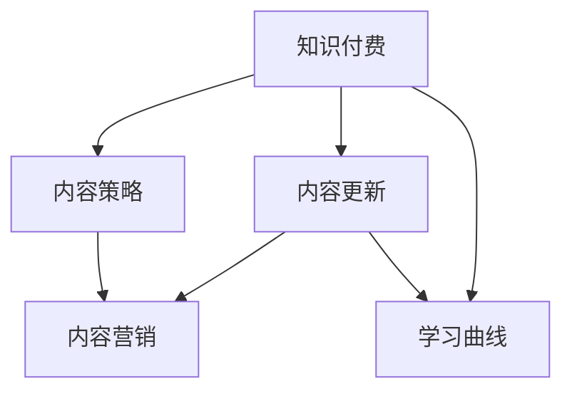

                 

# 知识付费创业中的内容更新策略

> 关键词：知识付费,内容更新,内容策略,内容营销,学习曲线

## 1. 背景介绍

### 1.1 问题由来
随着互联网和移动互联网的普及，知识付费市场迅速崛起。平台如得到、分答、知乎上，订阅类课程、付费问答、会员社区等服务形式层出不穷，吸引了大量用户和创作者。然而，知识付费创业面临诸多挑战，其中最核心的是如何持续吸引用户、提升转化率、延长订阅周期。

**内容质量**作为知识付费的关键因素，直接决定着平台的生命力。优秀的、不断更新的内容不仅能提升用户粘性，还能提高用户满意度，促使二次转化和口碑传播。因此，内容更新策略成为知识付费创业中至关重要的环节。

### 1.2 问题核心关键点
针对内容更新策略的探讨，首先需要明确核心问题：

- **内容类型**：包括文章、视频、音频、直播等，不同内容类型的更新周期和更新方式有所不同。
- **用户反馈**：通过数据分析和用户调研，获取用户对内容的满意度、兴趣点和改进建议。
- **市场变化**：关注行业动态，及时调整内容策略以适应市场变化。
- **团队能力**：评估内容生产团队的能力和资源，制定实际可行的内容更新计划。
- **数据驱动**：利用数据指标指导内容策略的制定和执行。

## 2. 核心概念与联系

### 2.1 核心概念概述

为更好地理解知识付费内容更新策略，本节将介绍几个核心概念及其相互之间的联系：

- **知识付费**：即通过互联网平台提供知识服务，以付费订阅、单次付费等方式获取知识和信息。知识付费平台包括内容生产、运营、用户服务等多个环节。

- **内容更新**：指在知识付费平台中，针对不同类型的内容进行周期性的迭代和优化，以保持内容的新鲜度和时效性。

- **内容策略**：即在理解用户需求和市场变化的基础上，制定和执行内容更新计划，确保内容质量和更新效率。

- **内容营销**：通过高质量的内容吸引和留住用户，实现流量转化、用户留存、口碑传播等目标。

- **学习曲线**：即用户对内容的接触、理解、应用的逐渐提升过程，影响着用户对平台的粘性和满意度。

这些概念之间的逻辑关系可以通过以下Mermaid流程图来展示：



这个流程图展示出知识付费、内容更新、内容策略、内容营销和学习曲线之间的关联：

1. 知识付费是核心业务，内容更新是关键手段，两者共同影响着内容策略的制定。
2. 内容策略指导内容营销的执行，确保内容的质量和用户覆盖。
3. 内容营销促进用户的学习曲线，提升用户的满意度和粘性。
4. 学习曲线反馈用户需求，指导内容更新和内容策略调整。

通过理解这些核心概念及其关系，我们可以更好地把握知识付费内容更新策略的全貌，制定有效的执行方案。

## 3. 核心算法原理 & 具体操作步骤
### 3.1 算法原理概述

知识付费平台的内容更新策略，实质上是基于数据分析和用户反馈进行的内容优化和迭代过程。其核心思想是：通过对用户行为和内容的交互数据进行分析，确定内容更新的方向、频率和方式，以最大化内容的价值和用户满意度。

形式化地，假设知识付费平台上有$N$个内容创作者，每个创作者生产的每篇文章、视频等形式的内容称为一个"内容单元"。内容单元的发布日期为$t_i$，内容质量为$q_i$。目标是在给定的时间窗口$T$内，最大化内容单元的总价值$V$。

则内容更新的优化目标为：

$$
\max_{t_i} V = \sum_{i=1}^N (q_i \times f(t_i))
$$

其中$f(t_i)$为内容单元在$t_i$时刻的价值函数，考虑了内容时效性和质量等因素。

### 3.2 算法步骤详解

知识付费平台的内容更新策略，一般包括以下几个关键步骤：

**Step 1: 数据收集与分析**
- 收集内容单元的发布时间、阅读量、评论量、点赞量、打赏量等用户行为数据。
- 通过数据分析工具（如Google Analytics、Tableau等）对用户行为数据进行分析，找出用户活跃的高峰时段和内容消费偏好。

**Step 2: 用户反馈收集**
- 通过问卷调查、评论区互动、社交媒体等方式，收集用户对内容的评价和改进建议。
- 利用自然语言处理技术（如情感分析、主题建模等），分析用户反馈文本中的情绪和话题，识别出用户的核心需求和兴趣点。

**Step 3: 内容分析与分类**
- 对收集到的内容单元进行文本处理，提取关键词、标签等信息，建立内容库。
- 对内容库进行分类，如技术类、经济类、心理学类等，便于后续的更新决策。

**Step 4: 内容更新决策**
- 基于用户行为数据和用户反馈，确定内容更新的频率和优先级。
- 利用机器学习算法（如时间序列预测、聚类分析等），预测未来用户对不同类型内容的兴趣变化，指导内容的调整。

**Step 5: 内容更新执行**
- 根据更新决策，对内容单元进行迭代优化和补充更新。
- 发布更新后的内容，并持续监测用户反馈，进行后续的调整和优化。

### 3.3 算法优缺点

知识付费平台的内容更新策略，具有以下优点：

1. **数据驱动**：通过分析用户行为和反馈，及时调整内容策略，提升内容质量和用户满意度。
2. **灵活性高**：根据用户需求变化和市场趋势，灵活调整更新内容和方式。
3. **用户粘性强**：不断更新的高质量内容，可以持续吸引和留住用户，增加用户转化和粘性。
4. **提升品牌影响力**：高价值、高时效性的内容，能够提升平台在行业内的品牌影响力。

同时，该方法也存在一定的局限性：

1. **成本高**：持续的高质量内容产出需要大量的资源投入，包括人力、技术和资金。
2. **内容同质化**：如果内容更新策略不合理，可能导致平台内容同质化，失去竞争优势。
3. **用户期望管理难度大**：用户对内容的期望不断提升，如何平衡用户需求和平台资源，是一大挑战。
4. **技术门槛高**：需要具备数据分析和机器学习等技术能力，才能有效实施内容更新策略。

尽管存在这些局限性，但就目前而言，基于数据分析和用户反馈的内容更新策略，仍是大规模知识付费平台的主要范式。未来相关研究的重点在于如何进一步降低内容更新的成本，提高内容的个性化和差异化，同时兼顾内容的可解释性和用户期望管理。

### 3.4 算法应用领域

基于知识付费平台的内容更新策略，已经在多个领域得到了应用，包括：

- 技术类课程：通过持续更新编程语言、技术框架、项目案例等内容，保持课程的时效性和实用性。
- 金融投资类：定期发布市场分析、投资策略、公司财报等内容，帮助用户及时把握投资机会。
- 心理学与个人成长：更新各类心理学知识、个人成长方法、情感管理技巧等内容，提升用户的生活质量。
- 健康与医疗：发布健康科普文章、疾病预防知识、心理咨询等内容，提供专业的健康服务。
- 法律咨询：定期更新法律动态、案例分析、法律知识等内容，帮助用户解决法律问题。

除了上述这些经典应用外，内容更新策略也被创新性地应用到更多场景中，如职业培训、教育咨询、文化艺术等，为知识付费技术带来了新的发展方向。

## 4. 数学模型和公式 & 详细讲解  
### 4.1 数学模型构建

本节将使用数学语言对知识付费平台的内容更新策略进行更加严格的刻画。

假设知识付费平台上有$N$个内容创作者，每个创作者生产的每篇文章、视频等形式的内容称为一个"内容单元"。内容单元的发布日期为$t_i$，内容质量为$q_i$。目标是在给定的时间窗口$T$内，最大化内容单元的总价值$V$。

则内容更新的优化目标为：

$$
\max_{t_i} V = \sum_{i=1}^N (q_i \times f(t_i))
$$

其中$f(t_i)$为内容单元在$t_i$时刻的价值函数，考虑了内容时效性和质量等因素。

假设用户对内容的质量评分服从正态分布$N(\mu, \sigma^2)$，则内容单元的价值函数可以表示为：

$$
f(t_i) = q_i \times N(\mu_i(t_i), \sigma_i(t_i)^2)
$$

其中$\mu_i(t_i)$为$t_i$时刻内容单元的平均质量评分，$\sigma_i(t_i)$为标准差。

### 4.2 公式推导过程

假设内容单元的价值函数为$N(\mu_i(t_i), \sigma_i(t_i)^2)$，则最大化总价值的优化问题可以转化为最大化$N$个正态分布之和的问题。令$\mu(t) = \sum_{i=1}^N \mu_i(t_i)$和$\sigma(t) = \sqrt{\sum_{i=1}^N \sigma_i(t_i)^2}$，则目标转化为：

$$
\max_t \sum_{i=1}^N N(\mu_i(t_i), \sigma_i(t_i)^2)
$$

通过求解上述问题，得到最优发布时间$t^*$。

### 4.3 案例分析与讲解

以一个实际案例来具体分析如何应用上述模型进行内容更新：

假设某知识付费平台有1000个技术类课程创作者，每天更新2个课程。每个课程的平均质量评分为$4.5$，标准差为$0.5$。目标是在接下来的一个月内，最大化课程的总价值。

则有：

$$
f(t_i) = 4.5 \times N(t_i), \quad \sigma(t_i) = 0.5
$$

其中$t_i$为课程发布日期。

通过求解优化问题，得到最优发布时间$t^*$，即可根据$t^*$进行内容更新和发布。

## 5. 项目实践：代码实例和详细解释说明
### 5.1 开发环境搭建

在进行内容更新策略的实现前，我们需要准备好开发环境。以下是使用Python进行内容更新策略开发的环境配置流程：

1. 安装Python环境：安装Python 3.8及以上版本，并确保其环境变量配置正确。

2. 安装必要的Python包：
```bash
pip install numpy pandas matplotlib scikit-learn
```

3. 数据集准备：准备内容单元的数据集，包括发布时间、阅读量、评论量、点赞量、打赏量等用户行为数据。

4. 数据清洗和预处理：对数据进行清洗和预处理，去除缺失值、异常值，标准化数据格式。

### 5.2 源代码详细实现

下面以一个简单的内容更新策略为例，给出使用Python进行内容更新的代码实现。

首先，定义内容单元的基本信息类：

```python
class ContentUnit:
    def __init__(self, id, title, author, publish_time, quality, reads, comments, likes, rewards):
        self.id = id
        self.title = title
        self.author = author
        self.publish_time = publish_time
        self.quality = quality
        self.reads = reads
        self.comments = comments
        self.likes = likes
        self.rewards = rewards

    def get_quality_score(self):
        return self.quality

    def get_read_score(self):
        return self.reads

    def get_comment_score(self):
        return self.comments

    def get_like_score(self):
        return self.likes

    def get_reward_score(self):
        return self.rewards
```

然后，定义内容分析函数，根据用户行为数据计算内容单元的评分：

```python
def analyze_content(content_units):
    content_scores = []
    for unit in content_units:
        quality_score = unit.get_quality_score()
        read_score = unit.get_read_score() * 0.8
        comment_score = unit.get_comment_score() * 0.6
        like_score = unit.get_like_score() * 0.4
        reward_score = unit.get_reward_score() * 0.2
        content_score = (quality_score + read_score + comment_score + like_score + reward_score) / 5
        content_scores.append(content_score)
    return content_scores
```

接着，定义内容更新函数，根据内容评分进行内容更新决策：

```python
def update_content(content_units, threshold):
    content_scores = analyze_content(content_units)
    updated_units = []
    for i in range(len(content_units)):
        if content_scores[i] > threshold:
            updated_units.append(content_units[i])
    return updated_units
```

最后，启动内容更新流程：

```python
if __name__ == '__main__':
    content_units = [...]  # 内容单元列表
    threshold = 4.5  # 更新阈值
    updated_units = update_content(content_units, threshold)
    print(updated_units)
```

以上就是使用Python进行内容更新策略的基本代码实现。可以看到，通过定义内容单元类和分析函数，可以高效地对用户行为数据进行处理，得到每个内容单元的评分。根据评分结果进行内容更新决策，即可实现高质量、高价值的内容更新。

### 5.3 代码解读与分析

让我们再详细解读一下关键代码的实现细节：

**ContentUnit类**：
- `__init__`方法：初始化内容单元的基本信息。
- `get_quality_score`等方法：获取内容单元的评分项，便于后续计算总评分。

**analyze_content函数**：
- 定义了内容评分函数，通过加权平均计算每个内容单元的评分。

**update_content函数**：
- 根据评分结果进行内容更新决策，筛选出高于阈值的内容单元进行更新。

**主程序**：
- 调用更新函数，输出更新后的内容单元列表。

可以看到，通过简单的类定义和函数调用，即可实现内容更新策略的基本逻辑。在实际应用中，还需要考虑更多因素，如内容分类、时间序列预测、用户反馈等，才能制定更加合理的内容更新策略。

## 6. 实际应用场景
### 6.1 智能客服系统

智能客服系统可以集成内容更新策略，实现动态的知识库更新和查询优化。智能客服系统通过自然语言处理技术，理解和回答用户提出的问题。为了保持系统的时效性和知识库的准确性，系统需要不断更新知识库，保证答案的最新和准确。

在技术实现上，可以定期抓取最新的行业新闻、产品手册、用户反馈等内容，根据内容质量和用户反馈进行更新决策，自动更新知识库。同时，系统可以根据用户的行为数据，动态调整问题的优先级和更新时间，确保知识库的关键内容优先更新，提高用户满意度。

### 6.2 在线教育平台

在线教育平台通常提供丰富的课程内容，用户可以根据自身需求选择不同的课程进行学习。为了提升课程的吸引力，平台需要对课程内容进行持续更新和优化。

在技术实现上，可以利用内容分析函数对课程内容进行评分，根据评分结果进行更新决策。对于用户活跃度高的课程，进行重点更新和优化，确保课程内容的时效性和吸引力。同时，平台可以根据用户的学习行为数据，动态调整课程内容的发布时间，提升用户的学习效果和满意度。

### 6.3 企业培训系统

企业培训系统需要根据员工的职业发展需求，定期更新培训内容。为了提高培训的针对性和效果，系统需要不断优化课程内容，更新培训材料。

在技术实现上，可以利用内容更新策略对培训课程进行动态更新。根据员工的培训反馈和行为数据，筛选出用户评价高、学习效果好的课程，进行重点更新和优化。同时，系统可以根据员工的学习进度和偏好，动态调整培训内容的发布时间，提高培训的个性化和时效性。

### 6.4 未来应用展望

随着人工智能技术的发展，内容更新策略将在更多领域得到应用，为知识付费和内容服务提供新的方向：

- **智能内容推荐系统**：通过分析用户行为和内容评分，动态调整内容推荐策略，提升用户的匹配度和满意度。
- **个性化内容定制**：根据用户的学习历史和兴趣偏好，生成个性化推荐和定制化内容，提升用户的粘性和满意度。
- **动态内容生产**：利用自然语言生成技术，根据用户行为数据自动生成高质量内容，提升内容更新的效率和质量。
- **内容价值评估**：建立内容价值评估体系，通过综合分析用户行为和内容评分，评估内容单元的价值，指导内容的更新决策。
- **多模态内容融合**：将文本、图像、视频等多模态内容进行融合，提升内容的丰富性和表现力，满足用户的多样化需求。

内容更新策略的不断优化和提升，将有助于知识付费平台和内容服务提供商提供更加优质的服务，满足用户的多样化需求，提升用户的满意度和粘性，实现平台的持续发展。

## 7. 工具和资源推荐
### 7.1 学习资源推荐

为了帮助开发者系统掌握内容更新策略的理论基础和实践技巧，这里推荐一些优质的学习资源：

1. **《深度学习与自然语言处理》**：斯坦福大学提供的在线课程，深入浅出地讲解了深度学习和自然语言处理的基本原理和应用。
2. **《知识图谱与大数据应用》**：介绍知识图谱构建和应用的基本方法，适用于内容更新和知识管理。
3. **《内容营销》**：市场营销领域的经典书籍，讲解了内容营销的策略和执行方法。
4. **《数据驱动的产品创新》**：介绍如何利用数据驱动产品创新，提高产品的竞争力和用户体验。
5. **《Python数据分析与可视化》**：介绍Python数据分析和可视化的基本方法和工具，适用于数据处理和分析。

通过对这些资源的学习实践，相信你一定能够快速掌握内容更新策略的精髓，并用于解决实际的问题。

### 7.2 开发工具推荐

高效的开发离不开优秀的工具支持。以下是几款用于内容更新策略开发的常用工具：

1. **Python**：广泛使用的编程语言，适合快速迭代研究。
2. **Jupyter Notebook**：免费的交互式编程环境，支持多种语言和数据处理库。
3. **PyTorch**：深度学习框架，支持动态计算图，适合快速原型开发。
4. **TensorFlow**：谷歌主导的深度学习框架，支持分布式计算和模型部署。
5. **Pandas**：数据处理库，支持高效的数据清洗和分析。
6. **Matplotlib**：数据可视化库，支持生成高质量的图表和图形。

合理利用这些工具，可以显著提升内容更新策略的开发效率，加快创新迭代的步伐。

### 7.3 相关论文推荐

内容更新策略的研究源于学界的持续研究。以下是几篇奠基性的相关论文，推荐阅读：

1. **《内容推荐系统：构建和部署》**：介绍内容推荐系统的基本方法和实现技术，适用于内容更新和推荐。
2. **《内容分析与挖掘》**：介绍内容分析的基本方法和工具，适用于内容评分和用户行为分析。
3. **《知识图谱与内容管理》**：介绍知识图谱构建和应用的基本方法，适用于内容管理与知识图谱的应用。
4. **《数据驱动的个性化推荐》**：介绍个性化推荐系统的基本方法和应用，适用于内容个性化推荐。
5. **《内容质量评估与优化》**：介绍内容质量评估和优化的基本方法，适用于内容评分和质量优化。

这些论文代表了大语言模型微调技术的发展脉络。通过学习这些前沿成果，可以帮助研究者把握学科前进方向，激发更多的创新灵感。

## 8. 总结：未来发展趋势与挑战
### 8.1 总结

本文对知识付费平台的内容更新策略进行了全面系统的介绍。首先阐述了内容更新策略在知识付费创业中的重要性和核心问题，明确了内容更新策略的制定和执行的要点。其次，从原理到实践，详细讲解了内容更新策略的数学模型和关键步骤，给出了内容更新策略的代码实现。同时，本文还广泛探讨了内容更新策略在智能客服、在线教育、企业培训等多个行业领域的应用前景，展示了内容更新策略的广阔应用空间。

通过本文的系统梳理，可以看到，内容更新策略在知识付费平台中具有重要的战略地位，是提升平台竞争力和用户满意度的关键手段。未来，伴随内容更新策略的持续优化和创新，知识付费平台必将在内容和服务的质量和数量上实现新的突破，推动人工智能技术在知识领域的深入应用。

### 8.2 未来发展趋势

展望未来，内容更新策略将呈现以下几个发展趋势：

1. **智能化程度提高**：随着人工智能技术的不断发展，内容更新策略将变得更加智能化和个性化，能够更好地适应用户需求和市场变化。
2. **数据驱动的决策支持**：利用大数据和机器学习技术，内容更新策略将更加依赖数据驱动，提高决策的准确性和科学性。
3. **用户参与度提升**：通过引入用户反馈和参与机制，内容更新策略将更加民主化，提升用户满意度和参与度。
4. **多模态内容融合**：将文本、图像、视频等多模态内容进行融合，提升内容的丰富性和表现力，满足用户的多样化需求。
5. **知识图谱的应用**：将知识图谱与内容更新策略相结合，实现内容的结构化和知识化，提升内容的可信度和价值。
6. **实时动态更新**：利用实时数据流和在线学习技术，实现内容的实时动态更新，保持内容的实时性和时效性。

这些趋势凸显了内容更新策略的广阔前景，将进一步推动知识付费平台的创新和发展，提升平台的用户体验和市场竞争力。

### 8.3 面临的挑战

尽管内容更新策略在知识付费平台中已经取得了显著成效，但在迈向更加智能化、普适化应用的过程中，它仍面临诸多挑战：

1. **成本控制**：持续的高质量内容产出需要大量的资源投入，包括人力、技术和资金。如何控制成本，提升效率，是一大挑战。
2. **内容同质化**：如果内容更新策略不合理，可能导致平台内容同质化，失去竞争优势。如何避免内容同质化，提升内容差异化，需要更多的创新和探索。
3. **用户期望管理难度大**：用户对内容的期望不断提升，如何平衡用户需求和平台资源，是一大挑战。
4. **技术门槛高**：需要具备数据分析和机器学习等技术能力，才能有效实施内容更新策略。
5. **内容质量控制**：内容质量的提升需要大量的内容审核和人工干预，如何提升内容质量，保障内容安全，是一大挑战。

尽管存在这些挑战，但相信通过不断创新和优化，内容更新策略必将在知识付费平台中发挥更大的作用，推动平台的持续发展和创新。

### 8.4 研究展望

面对内容更新策略所面临的挑战，未来的研究需要在以下几个方面寻求新的突破：

1. **数据驱动的优化方法**：利用大数据和机器学习技术，优化内容更新策略，提高决策的准确性和科学性。
2. **用户参与和反馈机制**：引入用户反馈和参与机制，提升用户满意度和参与度，实现民主化内容更新。
3. **多模态内容的融合**：将文本、图像、视频等多模态内容进行融合，提升内容的丰富性和表现力，满足用户的多样化需求。
4. **知识图谱的应用**：将知识图谱与内容更新策略相结合，实现内容的结构化和知识化，提升内容的可信度和价值。
5. **实时动态更新**：利用实时数据流和在线学习技术，实现内容的实时动态更新，保持内容的实时性和时效性。
6. **内容质量控制**：建立内容质量评估体系，通过综合分析用户行为和内容评分，评估内容单元的质量，指导内容的更新决策。

这些研究方向的探索，必将引领内容更新策略走向更高的台阶，为知识付费平台和内容服务提供商提供更加优质的服务，满足用户的多样化需求，提升用户的满意度和粘性，实现平台的持续发展。总之，内容更新策略需要开发者根据具体任务，不断迭代和优化策略、数据和算法，方能得到理想的效果。

## 9. 附录：常见问题与解答
**Q1: 如何评估内容更新策略的效果？**

A: 评估内容更新策略的效果，可以从以下几个方面进行：

1. **用户满意度**：通过用户调查、用户反馈等方式，了解用户对内容更新的满意度。
2. **内容质量**：通过内容评分、内容阅读量、点赞量等指标，评估内容的质量和吸引力。
3. **用户留存率**：通过用户行为数据，分析内容更新对用户留存率的影响。
4. **转化率**：通过流量数据和转化数据，评估内容更新对用户转化率的影响。
5. **品牌影响力**：通过社交媒体和用户口碑，评估内容更新对平台品牌影响力的提升。

通过综合分析这些指标，可以全面评估内容更新策略的效果，指导后续的优化和改进。

**Q2: 如何平衡内容更新频率和质量？**

A: 内容更新频率和质量之间存在一定的权衡关系，需要根据平台的具体情况和用户需求进行合理平衡。

1. **高频低量**：通过增加内容更新的频率，提升内容的及时性和新鲜度，吸引更多的用户关注和参与。
2. **低频高质量**：通过优化内容质量，确保内容的权威性和可靠性，提升用户的信任度和满意度。
3. **混合策略**：采用高频低量和高频高质量相结合的策略，既满足用户对时效性的需求，又保证内容的质量和权威性。

在实际应用中，需要根据平台的用户需求和资源情况，灵活调整内容更新策略，既保持内容的及时性和新鲜度，又保证内容的质量和可靠性。

**Q3: 如何提升内容更新的效率？**

A: 提升内容更新的效率，可以从以下几个方面进行：

1. **自动化内容生成**：利用自然语言生成技术，自动生成高质量的内容，减少人工创作的负担。
2. **内容模板化**：建立内容模板库，通过模板化生成快速生成内容，提升内容更新的效率。
3. **团队协作**：建立内容创作团队，分工协作，提升内容创作的效率和质量。
4. **内容审核机制**：建立内容审核机制，通过自动审核和人工审核相结合，提升内容更新的效率和质量。

通过优化内容生成和审核流程，可以大幅提升内容更新的效率和质量，满足用户对高质量内容的需求。

**Q4: 如何应对内容同质化的问题？**

A: 应对内容同质化的问题，可以从以下几个方面进行：

1. **多样化内容类型**：通过多样化内容类型，如文章、视频、音频、直播等，满足用户的多样化需求。
2. **个性化内容推荐**：利用个性化推荐技术，根据用户兴趣和需求推荐多样化内容。
3. **用户参与和反馈**：通过用户参与和反馈机制，了解用户对内容的需求和期望，优化内容更新策略。
4. **创新内容形式**：通过创新内容形式，如交互式内容、多媒体内容等，提升内容的吸引力和用户体验。

通过多样化内容类型和创新内容形式，可以有效应对内容同质化的问题，提升内容更新的丰富性和多样性。

**Q5: 如何保障内容的质量和安全？**

A: 保障内容的质量和安全，可以从以下几个方面进行：

1. **内容审核机制**：建立内容审核机制，通过自动审核和人工审核相结合，确保内容的质量和权威性。
2. **内容反馈机制**：建立内容反馈机制，及时收集用户对内容的反馈，优化内容质量。
3. **知识图谱的应用**：利用知识图谱，提升内容的可信度和权威性，避免假信息和误导性内容。
4. **内容清洗和过滤**：建立内容清洗和过滤机制，及时清理低质量、有害内容，保障内容安全。

通过建立内容审核和反馈机制，利用知识图谱和内容清洗技术，可以有效保障内容的质量和安全，提升用户的信任度和满意度。

---

作者：禅与计算机程序设计艺术 / Zen and the Art of Computer Programming

