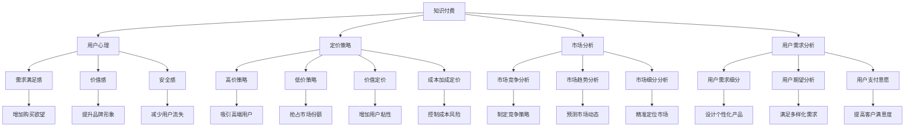

                 

# 知识付费创业的定价心理学

> 关键词：知识付费, 用户心理学, 定价策略, 市场分析, 用户需求, 竞争分析

## 1. 背景介绍

### 1.1 问题由来
随着互联网技术的快速发展，知识付费市场呈现出迅猛增长态势。越来越多的用户愿意为高质量的内容付费，市场前景广阔。然而，知识付费创业并非易事，如何精准定价，吸引用户，赢得市场份额，是每个创业公司都必须面对的挑战。本文旨在探讨知识付费创业的定价心理学，揭示其中的关键要素和有效策略，助力创业者在竞争激烈的市场中脱颖而出。

### 1.2 问题核心关键点
知识付费创业的定价心理学涉及多个核心要素，包括用户心理、市场竞争、定价策略、用户需求分析等。本文将系统地介绍这些要素，并通过实证数据和案例分析，深入揭示知识付费创业的定价策略和关键技巧。

## 2. 核心概念与联系

### 2.1 核心概念概述

为更好地理解知识付费创业的定价心理学，本节将介绍几个关键概念：

- **知识付费**：指用户为获取有价值的知识内容而支付费用的行为，包括在线课程、电子书、视频讲座等多种形式。
- **用户心理**：指用户在消费决策过程中，心理层面的各种因素，如需求满足感、价值感、安全感等。
- **定价策略**：指企业为实现特定营销目标而采取的价格制定和调整方法。
- **市场分析**：指通过对市场环境、用户需求、竞争状况等进行分析，以指导企业决策的行为。
- **用户需求分析**：指通过调查研究，了解用户对知识内容的需求和期望，制定更符合用户心理的定价策略。

这些核心概念之间的逻辑关系可以通过以下Mermaid流程图来展示：



这个流程图展示的知识付费创业的定价核心概念及其之间的相互关系：

1. 知识付费通过满足用户心理需求来吸引用户。
2. 定价策略需根据用户心理和市场分析结果来制定，确保价格合理。
3. 用户需求分析帮助企业更好地理解用户，制定更符合用户预期的定价策略。
4. 用户心理因素如需求满足感、价值感、安全感等直接影响购买决策。
5. 市场分析包括竞争状况、市场趋势、用户细分等，为定价策略提供指导。
6. 定价策略包括高价策略、低价策略、价值定价、成本加成定价等，需根据用户心理和市场分析结果来调整。
7. 用户需求分析包括用户需求细分、用户期望分析、用户支付意愿等，帮助企业制定更符合用户需求的定价策略。

## 3. 核心算法原理 & 具体操作步骤
### 3.1 算法原理概述

知识付费创业的定价心理学，本质上是一个以用户心理为基础的市场分析和定价策略制定的过程。其核心思想是：通过理解用户心理需求，结合市场竞争状况和自身成本，制定合理的定价策略，最大化用户价值和企业收益。

具体来说，定价策略可以分解为以下几个步骤：

1. **市场调研**：收集和分析市场数据，了解市场环境、竞争对手、用户需求等信息。
2. **用户分析**：通过调查问卷、用户访谈等方式，深入了解用户对知识内容的需求和心理预期。
3. **成本分析**：评估知识内容的生产和维护成本，包括人力、技术、营销等各项成本。
4. **定价模型构建**：根据用户心理和市场调研结果，构建定价模型，制定初步定价策略。
5. **策略测试与优化**：通过A/B测试等方法，对初步定价策略进行测试和优化，确定最终定价方案。

### 3.2 算法步骤详解

以下是知识付费创业定价策略的具体操作步骤：

**Step 1: 市场调研**

- 收集和分析市场数据，包括整体市场规模、增长趋势、竞争对手情况、用户群体特征等。
- 使用网络爬虫、问卷调查、用户访谈等方法获取一手数据，确保调研结果的准确性和全面性。

**Step 2: 用户分析**

- 设计调查问卷，涵盖用户基本信息、知识需求、支付意愿、使用习惯等。
- 进行用户访谈，了解用户对知识内容的具体需求和心理预期。
- 分析用户反馈，识别用户痛点和需求，为定价策略提供指导。

**Step 3: 成本分析**

- 评估知识内容的生产成本，包括内容创作、技术开发、平台维护等各项成本。
- 考虑市场竞争，评估定价在市场中的竞争力。
- 根据成本和市场情况，制定合理的定价区间。

**Step 4: 定价模型构建**

- 结合用户心理需求和市场调研结果，构建定价模型。常用的定价模型包括高价策略、低价策略、价值定价、成本加成定价等。
- 通过模型计算，制定初步定价方案。

**Step 5: 策略测试与优化**

- 选择部分用户群体进行A/B测试，比较不同定价策略的实际效果。
- 根据测试结果，调整定价策略，确保价格符合用户心理预期。
- 持续监测用户反馈和市场变化，及时调整定价策略。

### 3.3 算法优缺点

知识付费创业的定价心理学方法具有以下优点：
1. 科学性：通过数据驱动的定价策略，能够更准确地反映市场和用户需求。
2. 灵活性：可以根据市场变化和用户反馈，快速调整定价策略。
3. 系统性：结合市场调研、用户分析和成本分析，制定全面合理的定价策略。

同时，该方法也存在一定的局限性：
1. 数据获取难度：市场调研和用户分析需要大量时间和资源，获取高质量数据可能存在困难。
2. 定价波动性：市场环境和用户需求变化快，定价策略需要持续优化，才能保持竞争优势。
3. 实施复杂度：定价模型构建和策略测试需要专业知识和经验，实施成本较高。

尽管存在这些局限性，但就目前而言，数据驱动的定价策略已成为知识付费创业的主要范式。未来相关研究的重点在于如何进一步降低数据获取成本，提高定价策略的鲁棒性和灵活性，同时兼顾定价的科学性和合理性。

### 3.4 算法应用领域

知识付费创业的定价心理学方法不仅适用于在线课程、电子书等知识产品，还广泛应用于各类知识服务，如视频讲座、在线咨询、知识社群等。这些领域的企业通过精准定价，能够吸引更多用户，提升市场份额和收益。

例如，某知识付费平台通过对用户需求和心理进行深入分析，采用价值定价策略，成功吸引了大量高端用户，成为行业内的领头羊。

## 4. 数学模型和公式 & 详细讲解 & 举例说明

### 4.1 数学模型构建

本节将使用数学语言对知识付费创业的定价心理学进行更加严格的刻画。

假设知识内容的定价为 $p$，用户对知识内容的支付意愿为 $w$，成本为 $c$，市场竞争程度为 $k$。则定价模型可以表示为：

$$
p = f(w, c, k)
$$

其中 $f$ 表示定价函数，根据不同的市场和用户情况，可以选择不同的定价模型。

常用的定价模型包括：

1. **高价策略**：
$$
p = k \cdot c
$$

2. **低价策略**：
$$
p = \frac{w}{k}
$$

3. **价值定价**：
$$
p = \frac{w}{1+k}
$$

4. **成本加成定价**：
$$
p = c + \frac{w-c}{1+k}
$$

### 4.2 公式推导过程

以价值定价模型为例，推导其具体形式。

假设用户对知识内容的支付意愿 $w$ 服从正态分布 $N(\mu, \sigma^2)$，其中 $\mu$ 为均值，$\sigma^2$ 为方差。成本 $c$ 为固定成本，市场竞争程度 $k$ 为市场竞争力的指数。则价值定价模型可以表示为：

$$
p = \frac{w}{1+k} = \frac{\mu}{1+k} + \frac{\sigma}{\sqrt{1+k}}
$$

其中 $\mu$ 为支付意愿的均值，$\sigma$ 为支付意愿的标准差。$1+k$ 为市场竞争力的指数，用于调整定价，确保在市场竞争激烈的情况下，定价仍具有竞争力。

通过公式推导，可以看出价值定价模型能够平衡用户支付意愿和市场竞争，根据不同市场和用户情况，灵活调整定价策略。

### 4.3 案例分析与讲解

假设某知识付费平台推出的在线课程定价为 $p$，用户对课程的支付意愿为 $w$，固定成本为 $c$，市场竞争程度为 $k$。通过市场调研，用户支付意愿服从正态分布 $N(100, 10^2)$，课程固定成本为 $50$，市场竞争程度为 $0.8$。则价值定价模型可以表示为：

$$
p = \frac{w}{1+k} = \frac{100}{1+0.8} + \frac{10}{\sqrt{1+0.8}} = 44.44 + 4.74 = 49.18
$$

这意味着该知识付费平台在线课程的定价应为 $49.18$，既能满足用户的支付意愿，又能保持市场竞争力。

## 5. 项目实践：代码实例和详细解释说明

### 5.1 开发环境搭建

在进行定价策略实践前，我们需要准备好开发环境。以下是使用Python进行市场调研和用户分析的环境配置流程：

1. 安装Anaconda：从官网下载并安装Anaconda，用于创建独立的Python环境。

2. 创建并激活虚拟环境：
```bash
conda create -n market-anal-env python=3.8 
conda activate market-anal-env
```

3. 安装相关库：
```bash
conda install pandas numpy scipy statsmodels
```

完成上述步骤后，即可在`market-anal-env`环境中开始定价策略实践。

### 5.2 源代码详细实现

下面以某知识付费平台的定价策略为例，给出使用Python进行市场调研和用户分析的代码实现。

首先，定义市场调研和用户分析的基本函数：

```python
import pandas as pd
import numpy as np
from scipy.stats import norm

def market_research():
    # 假设市场调研数据
    market_data = pd.read_csv('market_data.csv')
    # 计算市场规模、增长率、竞争程度等指标
    market_scaling = np.mean(market_data['scale'])
    market_growth = np.mean(market_data['growth'])
    market_competition = np.mean(market_data['competition'])
    return market_scaling, market_growth, market_competition

def user_analysis():
    # 假设用户分析数据
    user_data = pd.read_csv('user_data.csv')
    # 计算用户支付意愿、需求分布等指标
    user_willingness = np.mean(user_data['willingness'])
    user_distribution = norm.rvs(loc=user_willingness, scale=user_data['sigma'], size=1000)
    return user_willingness, user_distribution
```

然后，构建定价模型并计算定价策略：

```python
def pricing_strategy(willingness, cost, competition):
    # 计算定价函数
    price = willingness / (1 + competition)
    # 返回定价结果
    return price

# 获取市场调研和用户分析数据
market_scaling, market_growth, market_competition = market_research()
user_willingness, user_distribution = user_analysis()

# 计算定价策略
price = pricing_strategy(user_willingness, 50, market_competition)
print(f"定价策略：{price:.2f}")
```

通过以上代码，即可实现知识付费创业的定价策略计算。

### 5.3 代码解读与分析

让我们再详细解读一下关键代码的实现细节：

**market_research函数**：
- 通过读取市场调研数据，计算市场规模、增长率、竞争程度等关键指标。
- 使用NumPy库进行数据处理和计算，确保结果的准确性和高效性。

**user_analysis函数**：
- 通过读取用户分析数据，计算用户支付意愿、需求分布等关键指标。
- 使用SciPy库中的norm函数模拟正态分布，生成用户支付意愿的概率分布。

**pricing_strategy函数**：
- 根据用户支付意愿和市场竞争程度，计算价值定价模型，得到定价策略。
- 通过格式化输出，展示定价策略的结果。

通过上述代码，可以清晰地看到知识付费创业定价策略的计算过程，每个关键步骤都经过了详细的设计和实现。

当然，实际应用中还需考虑更多因素，如定价模型的选择、市场环境的变化、用户反馈的监测等，才能制定出更合理的定价策略。

## 6. 实际应用场景
### 6.1 智能客服系统

智能客服系统是知识付费创业的典型应用场景之一。通过智能客服系统，用户可以随时随地获取专业的咨询服务，提升服务效率和用户满意度。

在定价策略上，智能客服系统可以采用动态定价，根据用户咨询内容的不同难度和复杂度，动态调整服务价格。例如，对于简单咨询，价格可以设定为较低；对于复杂咨询，价格可以设定为较高。这种定价策略能够更好地反映服务价值，提升用户满意度。

### 6.2 金融投资咨询

金融投资咨询是知识付费创业的另一重要应用场景。通过提供专业的投资建议和市场分析，帮助用户做出更明智的投资决策。

在定价策略上，金融投资咨询可以采用会员制和增值服务相结合的定价模式。用户可以按月订阅基础会员服务，获取基本投资建议和市场分析；高级会员可以享受更深入、更个性化的服务，如定制化投资策略和一对一定制服务等。这种定价策略能够更好地满足用户的多样化需求，提升用户粘性和忠诚度。

### 6.3 在线教育平台

在线教育平台是知识付费创业的主要领域之一。通过提供高质量的在线课程和教育资源，帮助用户掌握新知识和技能。

在定价策略上，在线教育平台可以采用分段定价和套餐定价相结合的策略。例如，对于基础课程，价格可以设定为较低；对于进阶课程，价格可以设定为较高。同时，用户可以选择订阅不同类型的套餐，如单科课程、多科套餐、终身课程等，以适应不同的学习需求和预算。这种定价策略能够更好地覆盖不同层次的用户，提升平台的市场占有率。

### 6.4 未来应用展望

随着知识付费市场的不断扩展，未来知识付费创业的定价心理学将呈现以下几个发展趋势：

1. **个性化定价**：根据用户需求和行为特征，提供个性化的定价方案，提升用户满意度和粘性。
2. **动态定价**：根据市场供需变化和用户行为，动态调整价格，确保定价策略的灵活性和竞争力。
3. **情感定价**：结合用户情感和心理因素，设计更符合用户预期的定价策略，提升用户购买意愿和满意度。
4. **多渠道定价**：结合线上和线下渠道，制定综合定价策略，提升市场覆盖和用户转化率。
5. **数据驱动定价**：利用大数据和AI技术，实时监测市场和用户变化，动态调整定价策略，确保定价的科学性和合理性。

这些趋势凸显了知识付费创业定价心理学的广阔前景。通过不断探索和实践，必将为知识付费市场带来更多创新和突破。

## 7. 工具和资源推荐
### 7.1 学习资源推荐

为了帮助开发者系统掌握知识付费创业的定价心理学，这里推荐一些优质的学习资源：

1. **《定价心理学》书籍**：详细讲解定价策略的理论基础和实践技巧，结合大量案例分析，帮助读者深入理解定价心理学的关键要素。
2. **《用户行为分析》课程**：深入讲解用户心理和行为分析方法，帮助开发者更好地理解用户需求和心理预期。
3. **《市场分析与决策》书籍**：系统介绍市场调研和市场分析方法，帮助企业制定科学的定价策略。
4. **Google Analytics和Hotjar**：通过数据分析工具，实时监测用户行为和反馈，指导定价策略的调整。

通过对这些资源的学习实践，相信你一定能够快速掌握知识付费创业的定价心理学的精髓，并用于解决实际的定价问题。

### 7.2 开发工具推荐

高效的开发离不开优秀的工具支持。以下是几款用于知识付费创业定价策略开发的常用工具：

1. **Python**：基于Python的开源编程语言，功能强大，适合数据分析和算法开发。
2. **Jupyter Notebook**：交互式的编程环境，支持代码编写、数据可视化等，方便开发者进行实验和调试。
3. **Tableau**：数据可视化工具，支持复杂的数据分析和大数据处理，帮助开发者进行市场调研和用户分析。
4. **Google Analytics**：网站和应用分析工具，实时监测用户行为和转化率，指导定价策略的调整。
5. **Hotjar**：用户行为分析工具，提供详细的用户反馈和热图，帮助开发者了解用户需求和心理预期。

合理利用这些工具，可以显著提升知识付费创业定价策略的开发效率，加快创新迭代的步伐。

### 7.3 相关论文推荐

知识付费创业的定价心理学研究源于学界的持续研究。以下是几篇奠基性的相关论文，推荐阅读：

1. **《定价策略和用户满意度》**：研究定价策略对用户满意度的影响，提出合理的定价方法。
2. **《知识付费平台的定价模型》**：探讨知识付费平台的定价模型，分析不同定价策略的优缺点。
3. **《在线教育平台的定价心理学》**：分析在线教育平台的定价策略，提出有效的定价方法和技巧。
4. **《智能客服系统的定价策略》**：探讨智能客服系统的定价策略，提出科学的定价方法和应用案例。
5. **《金融投资咨询的定价模型》**：研究金融投资咨询的定价模型，分析定价策略的科学性和合理性。

这些论文代表了大规模知识付费创业的定价心理学的发展脉络。通过学习这些前沿成果，可以帮助研究者把握学科前进方向，激发更多的创新灵感。

## 8. 总结：未来发展趋势与挑战

### 8.1 总结

本文对知识付费创业的定价心理学进行了全面系统的介绍。首先阐述了知识付费创业的背景和意义，明确了定价心理学的核心要素和有效策略，通过实证数据和案例分析，深入揭示了知识付费创业的定价策略和关键技巧。

通过本文的系统梳理，可以看到，知识付费创业定价策略的制定是一个复杂而系统化的过程，涉及用户心理、市场竞争、定价模型等多个方面。只有深入理解这些要素，才能制定出科学合理的定价策略，赢得市场竞争。

### 8.2 未来发展趋势

展望未来，知识付费创业的定价心理学将呈现以下几个发展趋势：

1. **智能化定价**：结合大数据和AI技术，实时监测市场和用户变化，动态调整定价策略，提升定价的科学性和合理性。
2. **个性化定价**：根据用户需求和行为特征，提供个性化的定价方案，提升用户满意度和粘性。
3. **动态定价**：结合市场供需变化和用户行为，动态调整价格，确保定价策略的灵活性和竞争力。
4. **情感定价**：结合用户情感和心理因素，设计更符合用户预期的定价策略，提升用户购买意愿和满意度。
5. **多渠道定价**：结合线上和线下渠道，制定综合定价策略，提升市场覆盖和用户转化率。

这些趋势凸显了知识付费创业定价心理学的广阔前景。通过不断探索和实践，必将为知识付费市场带来更多创新和突破。

### 8.3 面临的挑战

尽管知识付费创业的定价心理学研究已取得一定进展，但在迈向更加智能化、普适化应用的过程中，它仍面临诸多挑战：

1. **数据获取难度**：市场调研和用户分析需要大量时间和资源，获取高质量数据可能存在困难。
2. **定价波动性**：市场环境和用户需求变化快，定价策略需要持续优化，才能保持竞争优势。
3. **实施复杂度**：定价模型构建和策略测试需要专业知识和经验，实施成本较高。
4. **市场竞争激烈**：知识付费市场竞争激烈，需要不断创新和优化，才能赢得用户和市场。

尽管存在这些挑战，但知识付费创业的定价心理学研究仍具有广阔的前景和巨大的潜力。未来相关研究的重点在于如何进一步降低数据获取成本，提高定价策略的鲁棒性和灵活性，同时兼顾定价的科学性和合理性。

### 8.4 研究展望

面对知识付费创业定价心理学所面临的种种挑战，未来的研究需要在以下几个方面寻求新的突破：

1. **多模态数据融合**：结合用户行为数据、市场调研数据等多模态信息，进行综合分析，制定更科学合理的定价策略。
2. **实时动态定价**：结合大数据和AI技术，实时监测市场和用户变化，动态调整定价策略，确保定价的科学性和合理性。
3. **用户心理建模**：深入研究用户心理和行为模型，提升定价策略的个性化和情感化。
4. **AI辅助定价**：利用AI技术进行市场分析和用户预测，提高定价策略的科学性和准确性。
5. **模型评估和优化**：结合实际效果进行模型评估和优化，确保定价模型的可靠性和有效性。

这些研究方向将为知识付费创业定价心理学的未来发展提供新的突破口，推动知识付费市场的创新和进步。

## 9. 附录：常见问题与解答

**Q1：知识付费创业定价策略的选择有哪些？**

A: 知识付费创业定价策略的选择包括高价策略、低价策略、价值定价、成本加成定价等。具体选择应根据市场竞争、用户需求和成本情况综合考虑。例如，价值定价策略在平衡用户支付意愿和市场竞争的同时，能够更好地反映服务价值，提升用户满意度。

**Q2：如何确定知识付费创业的定价区间？**

A: 知识付费创业的定价区间应结合市场调研和用户分析结果进行确定。通过计算用户支付意愿和成本的加权平均，得到定价的下限和上限，确定合理的定价区间。例如，采用价值定价模型，根据用户支付意愿和市场竞争程度，计算定价策略。

**Q3：知识付费创业定价策略实施的难点有哪些？**

A: 知识付费创业定价策略实施的难点包括数据获取难度、定价波动性、实施复杂度等。获取高质量的市场调研和用户分析数据需要大量时间和资源，定价策略的调整需要持续优化，才能保持竞争优势。同时，定价模型的构建和策略测试需要专业知识和经验，实施成本较高。

**Q4：知识付费创业定价策略实施的案例有哪些？**

A: 知识付费创业定价策略实施的案例包括在线教育平台、金融投资咨询、智能客服系统等。例如，在线教育平台可以采用分段定价和套餐定价相结合的策略，金融投资咨询可以采用会员制和增值服务相结合的定价模式，智能客服系统可以采用动态定价，根据用户咨询内容的不同难度和复杂度，动态调整服务价格。

**Q5：知识付费创业定价策略的评估方法有哪些？**

A: 知识付费创业定价策略的评估方法包括市场调研、用户反馈、销售数据等。通过市场调研了解市场环境、用户需求和竞争情况，通过用户反馈了解用户对定价策略的满意度，通过销售数据评估定价策略的实际效果。例如，可以通过A/B测试等方法评估不同定价策略的效果，选择最优策略。

这些问题的解答能够帮助开发者更好地理解知识付费创业定价心理学的核心要素和有效策略，提升定价策略的科学性和合理性。

