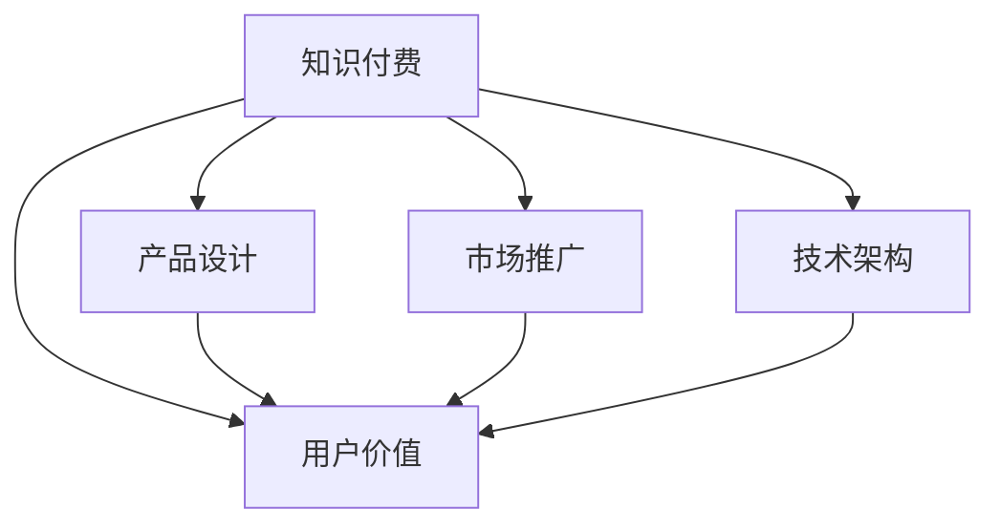

                 

# 知识付费创业的用户价值 Maximization

> 关键词：知识付费, 用户价值, 创业, 产品设计, 市场推广, 技术架构

## 1. 背景介绍

### 1.1 问题由来

在移动互联网和数字经济的推动下，知识付费市场迅速崛起，成为互联网经济的重要组成部分。根据艾媒咨询数据显示，中国知识付费市场规模已经从2015年的不到10亿元增长至2020年的288亿元，年复合增长率高达109.6%。特别是在教育、职业发展、心理健康等细分领域，知识付费呈现出蓬勃发展的态势。

然而，尽管市场规模迅速增长，但知识付费平台的用户留存率和付费率仍然较低。根据QuestMobile数据，付费用户在知识付费APP中占比不到10%，平台流失率高，且用户活跃度不高。这说明当前知识付费产品仍存在较大改进空间。

### 1.2 问题核心关键点

在知识付费创业中，用户价值的最大化是其成功的关键。用户价值的最大化不仅包括用户获取知识带来的价值，还包括用户对平台的粘性和忠诚度。如何准确把握用户需求，提升用户体验，建立品牌信任，是知识付费创业中需要重点关注的课题。

在知识付费产品的构建中，需要从用户价值的角度出发，系统思考产品设计、内容制作、营销推广、平台技术等各环节，确保每个环节都为用户带来明确的价值感，从而提升用户的购买意愿和平台满意度。

### 1.3 问题研究意义

理解知识付费创业中用户价值最大化的关键点，对于优化知识付费产品的设计，提升用户粘性和满意度，增加用户付费意愿，具有重要的指导意义。该研究可以为企业提供具体的操作指导，帮助企业提升市场竞争力，在激烈的市场竞争中脱颖而出。

## 2. 核心概念与联系

### 2.1 核心概念概述

为更好地理解知识付费创业中用户价值最大化的方法，本节将介绍几个核心概念：

- **知识付费（Knowledge Pricing）**：指通过在线平台，将专业知识、技能、经验等以付费形式提供给用户。用户通过订阅、单次购买等方式获取特定内容。

- **用户价值（User Value）**：指用户在使用产品过程中所获得的效用和满足感，包括知识获取、社交互动、身份认同等。

- **创业（Entrepreneurship）**：指创立新企业、开发新产品、创造新模式的过程。创业不仅关注盈利，更重视用户体验和市场价值。

- **产品设计（Product Design）**：指根据用户需求和使用场景，设计和优化产品的功能、界面、交互等，确保产品能够最大化满足用户需求。

- **市场推广（Market Promotion）**：指通过各类渠道和手段，将产品信息传达给目标用户，吸引其关注和使用，最终实现销售转化。

- **技术架构（Technical Architecture）**：指产品的底层技术支持架构，包括系统架构、数据架构、安全架构等，确保产品稳定、可靠、高效地运行。

这些核心概念之间的逻辑关系可以通过以下Mermaid流程图来展示：



这个流程图展示了知识付费创业中的各个关键环节及其与用户价值的关联：

1. **知识付费**：产品的基础内容来源。
2. **产品设计**：用户价值的主要载体，通过合理的产品设计最大化用户价值。
3. **市场推广**：吸引目标用户，增加产品曝光率和用户粘性。
4. **技术架构**：支撑产品运行的技术基础，确保用户体验和技术稳定性。
5. **用户价值**：核心目标，通过上述各个环节不断优化和提升。

## 3. 核心算法原理 & 具体操作步骤
### 3.1 算法原理概述

在知识付费创业中，最大化用户价值需要基于数据驱动和用户行为分析，采用算法优化产品设计、市场推广和用户管理。具体来说，可以分为以下三个关键步骤：

1. **数据采集与处理**：通过各类渠道收集用户行为数据，包括购买记录、浏览历史、互动反馈等，为后续分析提供基础数据。

2. **用户行为分析**：利用机器学习、统计学等方法，对用户行为数据进行建模和预测，识别用户需求、兴趣和行为模式。

3. **产品优化与推广**：根据用户行为分析结果，设计优化产品功能，制定针对性的市场推广策略，实现用户价值的最大化。

### 3.2 算法步骤详解

**Step 1: 数据采集与处理**

1. **数据源选择**：选择适合的知识付费平台，获取用户数据，如点击率、购买记录、互动评论等。

2. **数据预处理**：对原始数据进行清洗、去重、标准化处理，确保数据的准确性和一致性。

3. **数据存储与管理**：使用分布式存储技术，如Hadoop、Spark等，对大量用户数据进行高效存储和处理。

**Step 2: 用户行为分析**

1. **特征提取**：从用户行为数据中提取关键特征，如购买频率、互动次数、内容偏好等。

2. **用户建模**：使用聚类、分类等算法，对用户进行细分和建模，识别高价值用户群。

3. **预测建模**：利用回归、分类等机器学习模型，预测用户行为，如购买意愿、流失风险等。

**Step 3: 产品优化与推广**

1. **功能设计**：根据用户行为分析结果，优化产品功能，增加用户粘性和满意度。

2. **个性化推荐**：通过推荐系统，向用户推荐符合其兴趣的内容，提升用户活跃度和留存率。

3. **市场推广**：通过多渠道推广，吸引新用户，提升平台曝光率和用户增长率。

### 3.3 算法优缺点

知识付费创业中基于数据驱动的算法优化方法具有以下优点：

1. **数据驱动**：通过对大量用户数据进行分析，能够更准确地把握用户需求和行为模式。

2. **实时优化**：算法可以实时响应用户行为变化，进行动态调整，提升用户体验和满意度。

3. **科学决策**：通过数据驱动的决策，减少了主观判断的偏差，提高了决策的科学性和准确性。

然而，该方法也存在一些局限性：

1. **数据质量**：数据的准确性和完整性直接影响算法效果，低质量数据可能导致分析结果偏差。

2. **隐私问题**：在数据采集和处理过程中，需要注意用户隐私保护，避免数据泄露和滥用。

3. **算法复杂性**：算法模型复杂，需要较高的技术门槛和计算资源。

4. **业务理解**：算法需要结合业务背景进行优化，如果对业务理解不足，可能导致算法效果不理想。

### 3.4 算法应用领域

基于数据驱动的算法优化方法在知识付费创业中有着广泛的应用，特别是在以下几个领域：

1. **个性化推荐系统**：通过对用户行为数据的分析，实现内容个性化推荐，提升用户满意度和留存率。

2. **用户流失预测**：利用机器学习模型，预测用户流失风险，制定针对性的挽留策略。

3. **内容优化**：通过用户行为分析，优化内容质量和推荐策略，提升内容吸引力。

4. **广告投放**：通过数据分析，优化广告投放策略，提升广告投放效果和用户转化率。

5. **市场细分**：通过用户建模，实现市场细分，针对不同用户群体制定差异化营销策略。

## 4. 数学模型和公式 & 详细讲解 & 举例说明（备注：数学公式请使用latex格式，latex嵌入文中独立段落使用 $$，段落内使用 $)
### 4.1 数学模型构建

在知识付费创业中，用户价值最大化的主要目标是最大化用户满意度和留存率。因此，可以将用户价值表示为以下数学模型：

$$
V = \sum_{i=1}^N w_i U_i
$$

其中，$V$ 为用户总价值，$U_i$ 为用户$i$的满意度，$w_i$ 为用户$i$的权重。满意度$U_i$ 可以进一步拆分为知识获取价值$K_i$和社交互动价值$S_i$，即：

$$
U_i = K_i + S_i
$$

知识获取价值$K_i$ 可以表示为：

$$
K_i = f(K_i, C_i, T_i)
$$

其中，$K_i$ 为用户$i$的知识获取价值，$C_i$ 为用户$i$的内容质量，$T_i$ 为用户$i$的内容时间。社交互动价值$S_i$ 可以表示为：

$$
S_i = g(S_i, I_i, F_i)
$$

其中，$S_i$ 为用户$i$的社交互动价值，$I_i$ 为用户$i$的互动频次，$F_i$ 为用户$i$的互动质量。

### 4.2 公式推导过程

以个性化推荐系统为例，利用协同过滤算法（Collaborative Filtering）进行推荐，推导推荐模型的计算公式：

设用户$i$对内容$j$的评分向量为$R_i$，内容$j$的特征向量为$I_j$，用户$i$的特征向量为$U_i$，则协同过滤推荐模型的计算公式为：

$$
\hat{R}_{ij} = U_i^T K^{-1} I_j
$$

其中，$K$ 为相似度矩阵，$K^{-1}$ 为其逆矩阵。

### 4.3 案例分析与讲解

以知识付费平台知乎为例，分析如何利用数据驱动的算法优化产品功能，提升用户价值。

1. **数据采集与处理**：通过知乎API获取用户浏览历史、收藏文章、点赞评论等数据。

2. **用户行为分析**：使用协同过滤算法，对用户进行内容推荐。通过用户互动数据，识别高价值用户群。

3. **产品优化与推广**：根据用户行为分析结果，优化推荐算法，增加内容多样性，提升用户满意度。利用知乎广告系统，向高价值用户群投放定制广告，提升平台曝光率和用户增长率。

## 5. 项目实践：代码实例和详细解释说明
### 5.1 开发环境搭建

在进行知识付费产品的开发和优化前，我们需要准备好开发环境。以下是使用Python进行知识付费系统开发的环境配置流程：

1. 安装Anaconda：从官网下载并安装Anaconda，用于创建独立的Python环境。

2. 创建并激活虚拟环境：
```bash
conda create -n knowledge-env python=3.8 
conda activate knowledge-env
```

3. 安装所需库：
```bash
pip install numpy pandas scikit-learn spacy tensorflow transformers
```

4. 安装模型评估工具：
```bash
pip install scikit-learn
```

完成上述步骤后，即可在`knowledge-env`环境中开始知识付费产品的开发。

### 5.2 源代码详细实现

这里我们以知乎推荐系统为例，给出使用Transformers库对BERT模型进行个性化推荐代码的实现。

首先，定义推荐函数：

```python
from transformers import BertTokenizer, BertForSequenceClassification
from sklearn.metrics import accuracy_score
import torch
from tqdm import tqdm

def recommend(user_ids, item_ids, model, tokenizer):
    device = torch.device("cuda" if torch.cuda.is_available() else "cpu")
    model.to(device)
    tokenizer = BertTokenizer.from_pretrained('bert-base-uncased')
    
    # 构建输入数据
    input_ids = []
    attention_masks = []
    for user_id, item_id in zip(user_ids, item_ids):
        question = f"Who is {user_id} interested in?"
        context = f"The {item_id} is an expert in {user_id}'s field."
        inputs = tokenizer(question, context, max_length=512, padding='max_length', truncation=True)
        input_ids.append(inputs['input_ids'])
        attention_masks.append(inputs['attention_mask'])
        
    # 前向传播
    inputs = torch.tensor(input_ids).to(device)
    attention_masks = torch.tensor(attention_masks).to(device)
    with torch.no_grad():
        logits = model(inputs, attention_masks=attention_masks)[0]
    
    # 输出结果
    probs = logits.softmax(dim=1)
    recommendations = [(item_id, probs[i].item()) for i, item_id in enumerate(item_ids)]
    return recommendations
```

然后，定义用户行为数据处理函数：

```python
def process_user_data(user_data, item_data):
    user_ids = [item['user_id'] for item in user_data]
    item_ids = [item['item_id'] for item in item_data]
    return user_ids, item_ids
```

最后，启动推荐系统：

```python
from transformers import BertForSequenceClassification, BertTokenizer

# 加载模型
model = BertForSequenceClassification.from_pretrained('bert-base-uncased', num_labels=2)

# 处理用户行为数据
user_data = # 用户行为数据
item_data = # 物品数据

# 推荐系统
user_ids, item_ids = process_user_data(user_data, item_data)
recommendations = recommend(user_ids, item_ids, model, tokenizer)

# 输出推荐结果
for item_id, prob in recommendations:
    print(f"Recommendation for user {user_ids[0]}: {item_id} with probability {prob:.4f}")
```

以上就是使用PyTorch和Transformers库对BERT模型进行个性化推荐系统的完整代码实现。可以看到，Transformer库的强大封装使得模型的构建和优化变得简单高效。

### 5.3 代码解读与分析

让我们再详细解读一下关键代码的实现细节：

**recommend函数**：
- 加载模型和分词器。
- 构建输入数据，包括问题描述和上下文信息。
- 使用前向传播计算模型输出，得到每个物品的概率分布。
- 根据概率分布排序，返回推荐列表。

**process_user_data函数**：
- 从用户行为数据和物品数据中提取用户ID和物品ID。
- 返回提取结果，用于推荐函数的调用。

**主程序**：
- 加载模型和分词器。
- 处理用户行为数据和物品数据。
- 调用推荐函数进行推荐，并输出推荐结果。

可以看到，该代码实现虽然简洁，但涵盖了知识付费推荐系统的核心功能，包括数据处理、模型加载、前向传播和结果输出等。通过不断优化和调整，可以实现更精准的个性化推荐，提升用户满意度和平台价值。

## 6. 实际应用场景
### 6.1 智能客服系统

智能客服系统在知识付费中也有广泛应用。用户通过智能客服系统查询相关内容，提升学习效率。智能客服系统利用知识图谱和推荐算法，快速响应用户查询，提供个性化的内容推荐。

以知乎为例，知乎智能客服系统通过用户输入的查询语句，构建知识图谱，查询相关内容，并向用户推荐相关回答。在知识图谱构建过程中，利用协同过滤算法对相关内容进行推荐，提升用户查询体验。

### 6.2 在线课程平台

在线课程平台通过知识付费的方式，向用户提供各类课程和资料。利用个性化推荐系统，提升课程推荐效果，增加用户粘性和满意度。

以Coursera为例，Coursera平台通过用户行为数据，构建推荐模型，实现个性化课程推荐。根据用户浏览、购买、评价等行为，推荐相关课程，提升用户学习体验。

### 6.3 内容聚合平台

内容聚合平台通过知识付费的方式，向用户提供各类优质内容。利用个性化推荐系统，提升内容推荐效果，增加用户粘性和满意度。

以今日头条为例，今日头条平台通过用户行为数据，构建推荐模型，实现个性化内容推荐。根据用户浏览、点击、互动等行为，推荐相关内容，提升用户阅读体验。

### 6.4 未来应用展望

随着知识付费市场的不断成熟，基于数据驱动的算法优化方法将在知识付费创业中发挥更大作用。未来，知识付费产品将更加注重用户体验和用户价值最大化，实现精细化的运营和管理。

在知识付费产品的发展中，以下趋势值得关注：

1. **实时推荐系统**：利用实时数据，实现动态推荐，提升用户满意度。

2. **多模态推荐**：结合图像、视频、语音等多模态数据，提升推荐效果。

3. **用户行为预测**：利用机器学习模型，预测用户行为，制定针对性的策略。

4. **个性化学习路径**：根据用户学习进度和兴趣，生成个性化学习路径，提升学习效果。

5. **AI辅助客服**：利用AI技术，提升智能客服系统的响应速度和准确性。

6. **社区互动**：建立社区平台，促进用户之间的互动和分享，提升用户粘性。

## 7. 工具和资源推荐
### 7.1 学习资源推荐

为了帮助开发者系统掌握知识付费创业中的用户价值最大化方法，这里推荐一些优质的学习资源：

1. 《人工智能与商业》系列博文：由AI商业化专家撰写，深入浅出地介绍了AI技术在商业中的应用，包括知识付费领域。

2. 《NLP实战教程》课程：由知名NLP专家开设，涵盖自然语言处理的基本概念和实战技巧，适合NLP从业者学习。

3. 《知识付费平台运营指南》书籍：系统介绍了知识付费平台的运营和管理，包括用户价值最大化的方法和策略。

4. Udacity《人工智能与商业应用》课程：涵盖AI技术在商业中的应用，包括知识付费领域。

5. Coursera《机器学习与商业应用》课程：涵盖机器学习的基本概念和应用案例，适合商业从业者学习。

通过对这些资源的学习实践，相信你一定能够快速掌握知识付费创业中的用户价值最大化方法，并用于解决实际的商业问题。

### 7.2 开发工具推荐

高效的开发离不开优秀的工具支持。以下是几款用于知识付费产品开发的常用工具：

1. Jupyter Notebook：免费、开源的交互式笔记本环境，支持Python、R等多种编程语言，适合数据处理和模型调试。

2. Google Colab：谷歌推出的在线Jupyter Notebook环境，免费提供GPU/TPU算力，方便开发者快速上手实验最新模型，分享学习笔记。

3. PyTorch：基于Python的开源深度学习框架，灵活动态的计算图，适合快速迭代研究。

4. TensorFlow：由Google主导开发的开源深度学习框架，生产部署方便，适合大规模工程应用。

5. Weights & Biases：模型训练的实验跟踪工具，可以记录和可视化模型训练过程中的各项指标，方便对比和调优。

6. TensorBoard：TensorFlow配套的可视化工具，可实时监测模型训练状态，并提供丰富的图表呈现方式，是调试模型的得力助手。

合理利用这些工具，可以显著提升知识付费产品的开发效率，加快创新迭代的步伐。

### 7.3 相关论文推荐

知识付费创业中用户价值最大化的研究源于学界的持续研究。以下是几篇奠基性的相关论文，推荐阅读：

1. 《知识付费用户行为分析与个性化推荐》：介绍知识付费平台的用户行为分析方法和个性化推荐技术。

2. 《深度学习在知识付费中的应用》：探讨深度学习在知识付费中的应用，包括推荐系统、广告投放等。

3. 《基于协同过滤的知识推荐算法研究》：研究协同过滤推荐算法在知识付费平台中的应用。

4. 《多模态推荐系统研究综述》：介绍多模态推荐系统的理论和方法，为知识付费推荐提供参考。

5. 《基于深度学习的用户行为预测模型》：探讨深度学习在用户行为预测中的应用，包括流失预测、互动预测等。

这些论文代表了大规模知识付费应用中用户价值最大化的研究方向，通过学习这些前沿成果，可以帮助研究者把握学科前进方向，激发更多的创新灵感。

## 8. 总结：未来发展趋势与挑战
### 8.1 总结

本文对知识付费创业中用户价值最大化的方法进行了全面系统的介绍。首先阐述了知识付费创业的背景和重要性，明确了用户价值最大化的关键点。其次，从原理到实践，详细讲解了数据驱动的算法优化方法，包括数据采集与处理、用户行为分析、产品优化与推广等步骤，并给出了具体代码实例。同时，本文还探讨了知识付费产品在实际应用中的场景，展示了数据驱动方法的具体应用。

通过本文的系统梳理，可以看到，知识付费创业中用户价值最大化的方法是通过数据驱动的算法优化实现的。通过优化产品设计、提升推荐效果、增加用户粘性等手段，可以最大限度地提升用户价值，实现平台的商业成功。

### 8.2 未来发展趋势

展望未来，知识付费创业中用户价值最大化的方法将呈现以下几个发展趋势：

1. **个性化推荐系统**：利用实时数据和机器学习算法，实现动态推荐，提升用户满意度。

2. **多模态推荐**：结合图像、视频、语音等多模态数据，提升推荐效果。

3. **用户行为预测**：利用机器学习模型，预测用户行为，制定针对性的策略。

4. **个性化学习路径**：根据用户学习进度和兴趣，生成个性化学习路径，提升学习效果。

5. **AI辅助客服**：利用AI技术，提升智能客服系统的响应速度和准确性。

6. **社区互动**：建立社区平台，促进用户之间的互动和分享，提升用户粘性。

这些趋势凸显了知识付费产品的发展方向，将为用户带来更丰富、更精准、更个性化的知识服务，实现商业成功。

### 8.3 面临的挑战

尽管知识付费创业中用户价值最大化的方法已经取得了显著进展，但在迈向更加智能化、普适化应用的过程中，它仍面临着诸多挑战：

1. **数据质量**：数据的准确性和完整性直接影响算法效果，低质量数据可能导致分析结果偏差。

2. **隐私问题**：在数据采集和处理过程中，需要注意用户隐私保护，避免数据泄露和滥用。

3. **技术门槛**：算法需要结合业务背景进行优化，如果对业务理解不足，可能导致算法效果不理想。

4. **资源消耗**：大规模数据处理和模型训练需要较高的计算资源，可能面临算力瓶颈。

5. **算法复杂性**：算法模型复杂，需要较高的技术门槛和计算资源。

### 8.4 研究展望

面对知识付费创业中用户价值最大化所面临的挑战，未来的研究需要在以下几个方面寻求新的突破：

1. **无监督和半监督学习**：摆脱对大规模标注数据的依赖，利用无监督和半监督学习方法，最大限度利用非结构化数据。

2. **多模态融合**：结合图像、视频、语音等多模态数据，提升推荐效果。

3. **跨领域迁移学习**：在不同领域间进行迁移学习，提升模型泛化性和跨领域适应能力。

4. **轻量化模型**：开发轻量化模型，提高推理速度和计算效率。

5. **增强学习**：利用增强学习，提升推荐系统的自适应性和智能性。

6. **用户隐私保护**：在数据采集和处理过程中，强化隐私保护，确保用户数据安全。

这些研究方向将引领知识付费创业中用户价值最大化方法的不断演进，为构建更加智能化、普适化的知识付费平台提供新的技术支持。

## 9. 附录：常见问题与解答

**Q1：知识付费创业中如何提升用户粘性？**

A: 提升用户粘性是知识付费创业中用户价值最大化的重要一环。以下是一些具体方法：

1. **个性化推荐**：利用推荐算法，向用户推荐符合其兴趣和需求的内容，提升用户满意度和留存率。

2. **内容更新**：定期更新和优化内容，保持内容新鲜和高质量，吸引用户持续关注。

3. **社区互动**：建立社区平台，促进用户之间的互动和分享，增加用户粘性。

4. **用户反馈**：通过用户反馈，及时了解用户需求和痛点，优化产品功能。

5. **用户激励**：设置用户激励机制，如积分、优惠券等，鼓励用户持续使用平台。

**Q2：如何评估知识付费创业中的用户价值？**

A: 评估知识付费创业中的用户价值需要综合考虑多个指标：

1. **用户活跃度**：通过用户登录频率、使用时长等指标，评估用户活跃度。

2. **用户满意度**：通过用户反馈、评价等指标，评估用户对平台的满意度和体验。

3. **用户留存率**：通过用户留存率指标，评估用户对平台的忠诚度和粘性。

4. **付费转化率**：通过用户付费行为和转化率指标，评估平台的商业价值。

5. **内容质量**：通过内容质量和用户互动等指标，评估平台内容的吸引力和互动性。

6. **运营效率**：通过平台运营效率和成本控制等指标，评估平台的运营效果和盈利能力。

通过综合评估这些指标，可以全面了解平台的运营状态和用户价值，为优化产品设计和运营策略提供参考。

**Q3：知识付费创业中如何提升用户推荐效果？**

A: 提升知识付费创业中的用户推荐效果需要从以下几个方面入手：

1. **数据质量**：提高数据的准确性和完整性，避免数据噪声和偏差。

2. **算法优化**：选择和优化推荐算法，如协同过滤、深度学习等，提升推荐效果。

3. **用户行为分析**：深入分析用户行为数据，识别用户需求和兴趣，提供精准推荐。

4. **多模态融合**：结合图像、视频、语音等多模态数据，提升推荐效果。

5. **实时优化**：利用实时数据，实现动态推荐，提升用户满意度。

6. **个性化路径**：根据用户学习进度和兴趣，生成个性化学习路径，提升学习效果。

**Q4：如何构建知识付费平台的用户行为分析系统？**

A: 构建知识付费平台的用户行为分析系统需要从以下几个方面入手：

1. **数据采集**：通过平台API和第三方数据源，采集用户行为数据，如浏览历史、购买记录、互动反馈等。

2. **数据预处理**：对原始数据进行清洗、去重、标准化处理，确保数据的准确性和一致性。

3. **用户建模**：利用聚类、分类等算法，对用户进行细分和建模，识别高价值用户群。

4. **推荐算法**：选择和优化推荐算法，如协同过滤、深度学习等，实现个性化推荐。

5. **实验评估**：利用A/B测试等方法，评估推荐算法的效果，持续优化和改进。

**Q5：如何实现知识付费平台的智能客服系统？**

A: 实现知识付费平台的智能客服系统需要从以下几个方面入手：

1. **知识图谱构建**：利用知识图谱技术，构建平台知识库，存储各类知识点和知识关系。

2. **意图识别**：通过自然语言处理技术，识别用户输入的意图和需求。

3. **内容推荐**：根据用户意图和知识图谱，推荐相关内容，提升用户查询体验。

4. **多轮对话**：利用对话管理技术，实现多轮对话，提高对话流畅性和用户满意度。

5. **人工干预**：设置人工干预机制，在无法准确识别和推荐时，转接人工客服，确保服务质量。

**Q6：如何优化知识付费平台的个性化推荐系统？**

A: 优化知识付费平台的个性化推荐系统需要从以下几个方面入手：

1. **数据采集**：通过平台API和第三方数据源，采集用户行为数据，如浏览历史、购买记录、互动反馈等。

2. **数据预处理**：对原始数据进行清洗、去重、标准化处理，确保数据的准确性和一致性。

3. **用户建模**：利用聚类、分类等算法，对用户进行细分和建模，识别高价值用户群。

4. **推荐算法**：选择和优化推荐算法，如协同过滤、深度学习等，实现个性化推荐。

5. **实验评估**：利用A/B测试等方法，评估推荐算法的效果，持续优化和改进。

**Q7：如何构建知识付费平台的内容推荐系统？**

A: 构建知识付费平台的内容推荐系统需要从以下几个方面入手：

1. **数据采集**：通过平台API和第三方数据源，采集用户行为数据，如浏览历史、购买记录、互动反馈等。

2. **数据预处理**：对原始数据进行清洗、去重、标准化处理，确保数据的准确性和一致性。

3. **用户建模**：利用聚类、分类等算法，对用户进行细分和建模，识别高价值用户群。

4. **推荐算法**：选择和优化推荐算法，如协同过滤、深度学习等，实现个性化推荐。

5. **实验评估**：利用A/B测试等方法，评估推荐算法的效果，持续优化和改进。

---

作者：禅与计算机程序设计艺术 / Zen and the Art of Computer Programming

