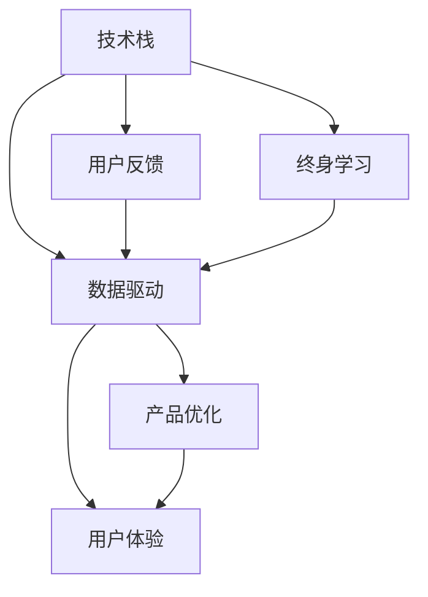

                 

# 知识付费创业者的自我提升策略

## 1. 背景介绍

随着知识经济时代的到来，知识付费成为了连接知识生产者和消费者的新型商业模式。知识付费创业者的成功不仅取决于市场定位和商业模式创新，更在于个人知识和技能的持续提升。本文旨在为知识付费创业者提供一套系统的自我提升策略，帮助他们站在技术前沿，把握市场脉搏，实现商业成功。

## 2. 核心概念与联系

### 2.1 核心概念概述

知识付费创业者的自我提升，本质上是个人知识技能与市场需求之间匹配度的不断优化。本节将介绍几个关键概念及其相互联系：

- **知识付费（Knowledge-based Subscription Service）**：通过向消费者提供付费的、高质量的、专有化的知识产品或服务，满足其个性化学习需求的一种商业模式。
- **技术栈（Technology Stack）**：知识付费创业所需的技术工具集，包括编程语言、框架、库等，支持应用开发、数据分析、用户交互等功能。
- **数据驱动（Data-driven）**：利用数据进行产品设计和优化的策略，提升用户体验和业务效率。
- **用户反馈（User Feedback）**：收集用户对产品、服务的评价和建议，作为持续改进的依据。
- **终身学习（Lifelong Learning）**：强调个人持续学习，不断更新知识和技能，以适应快速变化的技术和市场环境。

这些核心概念之间存在复杂的互动关系。技术栈的建设依赖于数据驱动和用户反馈，而终身学习则是持续优化技术栈和满足用户需求的基础。

### 2.2 核心概念原理和架构的 Mermaid 流程图



这个流程图展示了一系列概念间的相互关系：

1. **技术栈建设**：是基础，需要依赖数据驱动和用户反馈进行不断优化。
2. **数据驱动**：通过收集、分析用户数据，指导技术栈的构建和优化。
3. **用户反馈**：直接反映用户体验，对技术栈和产品优化有重要指导意义。
4. **终身学习**：是个人和团队不断进步的动力，支撑技术栈和产品持续优化。
5. **产品优化和用户体验**：最终目的是提升用户满意度，形成正向循环。

## 3. 核心算法原理 & 具体操作步骤

### 3.1 算法原理概述

知识付费创业者的自我提升，可以通过以下算法原理和具体操作步骤实现：

1. **技术栈优化算法**：通过用户反馈和数据分析，动态调整技术栈的构成和优化路径，提升应用性能和用户体验。
2. **用户行为分析算法**：基于用户的行为数据，分析其学习偏好和需求，指导内容设计和推荐策略。
3. **个性化推荐算法**：结合用户历史行为和实时反馈，动态调整推荐策略，实现精准推荐。
4. **用户留存率提升算法**：通过改进产品功能和使用体验，提高用户粘性和留存率。
5. **终身学习路径规划**：根据个人兴趣和职业目标，规划学习和技能提升路径，确保知识和技能的持续增长。

### 3.2 算法步骤详解

**Step 1: 技术栈评估与构建**

- 收集用户使用数据，分析技术栈存在的问题和瓶颈。
- 根据数据反馈和业务需求，选择合适的技术栈组件。
- 建立技术栈的优化路线图，设定阶段性目标。

**Step 2: 用户行为数据分析**

- 收集用户行为数据，包括点击、观看、购买、评价等行为。
- 使用数据挖掘和机器学习算法，分析用户的行为模式和需求。
- 基于分析结果，优化产品设计和内容策略。

**Step 3: 个性化推荐模型训练**

- 收集用户的历史行为和偏好数据。
- 使用协同过滤、内容推荐等算法，构建个性化推荐模型。
- 对模型进行训练和验证，优化推荐效果。

**Step 4: 用户留存率提升策略**

- 分析用户流失的原因，如内容质量、使用体验等。
- 优化产品功能和用户体验，如增加互动性、个性化定制等。
- 定期推送个性化内容，保持用户兴趣和参与度。

**Step 5: 终身学习路径规划**

- 根据个人职业目标和兴趣，设定学习和技能提升路径。
- 选择合适的在线课程、书籍、社区等资源，进行系统学习。
- 定期回顾和评估学习成果，调整学习计划。

### 3.3 算法优缺点

**优点**：
1. **数据驱动**：利用大数据分析指导决策，提升效率和精准度。
2. **个性化推荐**：实现精准内容推送，提升用户满意度和粘性。
3. **技术栈优化**：动态调整技术工具，提升应用性能和用户体验。
4. **终身学习**：帮助个人不断更新知识和技能，适应快速变化的市场环境。

**缺点**：
1. **数据隐私**：数据收集和分析可能涉及用户隐私，需严格遵守法律法规。
2. **算法复杂性**：算法实现和优化可能涉及较高的技术门槛。
3. **资源投入**：技术栈优化和个性化推荐需要持续的资源投入。
4. **用户行为多样性**：用户行为复杂多变，难以精准预测和应对。

### 3.4 算法应用领域

这些算法原理和技术步骤，广泛应用于知识付费创业的各个环节：

- **应用开发**：通过技术栈优化提升应用性能，如前端、后端、数据库等。
- **内容推荐**：实现个性化内容推荐，提升用户粘性和留存率。
- **用户体验设计**：通过数据分析和用户反馈优化产品设计，提高用户体验。
- **营销和销售**：基于用户行为数据，制定精准营销策略，提升转化率和营收。

## 4. 数学模型和公式 & 详细讲解 & 举例说明

### 4.1 数学模型构建

知识付费创业者的自我提升，涉及多个子问题，可以构建不同的数学模型进行分析和优化。以下是几个关键模型的构建：

1. **技术栈优化模型**：
   - 目标：最大化应用性能和用户体验。
   - 输入：用户反馈数据、系统性能指标等。
   - 输出：技术栈组件的优先级、更新路线图。
   - 公式：

   $$
   \text{OptimizeStack} = \max_{C_i} \sum_{i=1}^n f_i(C_i)
   $$

   其中 $C_i$ 为技术栈组件，$f_i$ 为性能评价函数。

2. **用户行为分析模型**：
   - 目标：分析用户行为模式，指导内容设计和推荐策略。
   - 输入：用户行为数据。
   - 输出：用户行为特征、偏好等。
   - 公式：

   $$
   \text{UserAnalysis} = \{ F_k \} = \text{DataMining}(D)
   $$

   其中 $D$ 为用户行为数据集，$F_k$ 为特征集。

3. **个性化推荐模型**：
   - 目标：实现精准内容推荐，提升用户满意度。
   - 输入：用户历史行为、实时反馈等。
   - 输出：推荐列表、评分等。
   - 公式：

   $$
   \text{PersonalizedRecommendation} = R = P \times C \times F
   $$

   其中 $P$ 为用户行为矩阵，$C$ 为内容特征矩阵，$F$ 为特征权重矩阵。

### 4.2 公式推导过程

以个性化推荐模型为例，具体推导过程如下：

1. 用户行为矩阵 $P$ 的构建：
   - 将用户点击、观看、购买等行为转换为0/1矩阵，表示用户对内容的偏好。
   - 公式：

   $$
   P_{ui} = 
   \begin{cases} 
   1 & \text{用户 } u \text{ 对内容 } i \text{ 有行为} \\
   0 & \text{用户 } u \text{ 对内容 } i \text{ 无行为} 
   \end{cases}
   $$

2. 内容特征矩阵 $C$ 的构建：
   - 对内容进行特征提取，如关键词、作者、评分等。
   - 公式：

   $$
   C_j = \{ F_{j1}, F_{j2}, ..., F_{jm} \}
   $$

3. 特征权重矩阵 $F$ 的构建：
   - 根据用户行为数据，计算每个特征的重要性权重。
   - 公式：

   $$
   F_{kj} = w_k \times \text{WeightingFunction}(D)
   $$

   其中 $w_k$ 为特征 $k$ 的权重，$\text{WeightingFunction}$ 为权重计算函数。

4. 个性化推荐公式的推导：
   - 结合用户行为矩阵 $P$、内容特征矩阵 $C$ 和特征权重矩阵 $F$，计算推荐列表 $R$。
   - 公式：

   $$
   R_{iu} = \sum_{j=1}^m P_{ui} \times C_{uj} \times F_{kj}
   $$

   其中 $R_{iu}$ 表示用户 $u$ 对内容 $i$ 的推荐评分。

### 4.3 案例分析与讲解

假设某知识付费平台通过数据分析发现，用户对某一类专业课程的评分和购买意愿明显高于其他课程。平台根据这一发现，优化技术栈，增加专业课程的推荐权重，提升用户体验。同时，平台进一步分析用户行为数据，发现用户更倾向于选择短小精悍、实用性强的课程。基于此，平台优化推荐算法，增加这类课程的推荐频率，并引入交互式学习功能，提升用户参与度。

## 5. 项目实践：代码实例和详细解释说明

### 5.1 开发环境搭建

在进行项目实践前，我们需要准备好开发环境。以下是使用Python进行PyTorch开发的环境配置流程：

1. 安装Anaconda：从官网下载并安装Anaconda，用于创建独立的Python环境。

2. 创建并激活虚拟环境：
```bash
conda create -n pytorch-env python=3.8 
conda activate pytorch-env
```

3. 安装PyTorch：根据CUDA版本，从官网获取对应的安装命令。例如：
```bash
conda install pytorch torchvision torchaudio cudatoolkit=11.1 -c pytorch -c conda-forge
```

4. 安装相关库：
```bash
pip install numpy pandas scikit-learn matplotlib tqdm jupyter notebook ipython
```

完成上述步骤后，即可在`pytorch-env`环境中开始项目实践。

### 5.2 源代码详细实现

这里我们以个性化推荐系统为例，给出使用PyTorch和Transformers库对推荐模型进行训练和优化的代码实现。

首先，定义推荐系统的基本组件：

```python
import torch
from torch import nn
from transformers import AutoTokenizer, AutoModel

class RecommendationModel(nn.Module):
    def __init__(self, embedding_dim, hidden_dim, vocab_size, num_classes):
        super(RecommendationModel, self).__init__()
        self.encoder = AutoModel.from_pretrained('bert-base-uncased', output_hidden_states=True)
        self.tokenizer = AutoTokenizer.from_pretrained('bert-base-uncased')
        self.fc1 = nn.Linear(embedding_dim, hidden_dim)
        self.fc2 = nn.Linear(hidden_dim, num_classes)
        self.softmax = nn.Softmax(dim=1)
        
    def forward(self, input_ids, attention_mask):
        outputs = self.encoder(input_ids, attention_mask=attention_mask)
        hidden_states = outputs[1]  # 获取最后一个隐藏状态
        hidden_states = self.fc1(hidden_states)
        hidden_states = self.fc2(hidden_states)
        logits = self.softmax(hidden_states)
        return logits
```

然后，定义模型训练和评估函数：

```python
from torch.utils.data import DataLoader
from sklearn.metrics import accuracy_score, precision_recall_fscore_support

def train_model(model, train_dataset, val_dataset, epochs, batch_size, learning_rate):
    device = torch.device('cuda' if torch.cuda.is_available() else 'cpu')
    model.to(device)
    optimizer = torch.optim.Adam(model.parameters(), lr=learning_rate)
    criterion = nn.CrossEntropyLoss()
    
    for epoch in range(epochs):
        model.train()
        train_loss = 0
        train_correct = 0
        for data in DataLoader(train_dataset, batch_size=batch_size, shuffle=True):
            input_ids, labels = data['input_ids'].to(device), data['labels'].to(device)
            attention_mask = input_ids.ne(-100).long()
            optimizer.zero_grad()
            outputs = model(input_ids, attention_mask=attention_mask)
            loss = criterion(outputs, labels)
            loss.backward()
            optimizer.step()
            train_loss += loss.item()
            train_correct += (outputs.argmax(dim=1) == labels).sum().item()
        train_loss /= len(train_dataset)
        train_acc = train_correct / len(train_dataset)
        
        model.eval()
        val_loss = 0
        val_correct = 0
        with torch.no_grad():
            for data in DataLoader(val_dataset, batch_size=batch_size, shuffle=False):
                input_ids, labels = data['input_ids'].to(device), data['labels'].to(device)
                attention_mask = input_ids.ne(-100).long()
                outputs = model(input_ids, attention_mask=attention_mask)
                loss = criterion(outputs, labels)
                val_loss += loss.item()
                val_correct += (outputs.argmax(dim=1) == labels).sum().item()
        val_loss /= len(val_dataset)
        val_acc = val_correct / len(val_dataset)
        
        print(f"Epoch {epoch+1}, Train Loss: {train_loss:.4f}, Train Acc: {train_acc:.4f}, Val Loss: {val_loss:.4f}, Val Acc: {val_acc:.4f}")
```

最后，启动训练流程：

```python
train_dataset = ...
val_dataset = ...
epochs = 10
batch_size = 16
learning_rate = 1e-5

model = RecommendationModel(embedding_dim=768, hidden_dim=128, vocab_size=30000, num_classes=10)
train_model(model, train_dataset, val_dataset, epochs=epochs, batch_size=batch_size, learning_rate=learning_rate)
```

以上就是使用PyTorch和Transformers库构建个性化推荐系统的完整代码实现。代码中，我们使用了预训练的BERT模型作为特征提取器，通过线性层进行预测，并使用交叉熵损失函数进行训练。

### 5.3 代码解读与分析

让我们再详细解读一下关键代码的实现细节：

**RecommendationModel类**：
- `__init__`方法：初始化模型的组件，包括BERT模型和全连接层。
- `forward`方法：定义模型前向传播过程，提取BERT的最后一个隐藏状态，并经过两层线性层和Softmax进行输出。

**train_model函数**：
- 使用DataLoader对数据集进行批次化加载，准备训练和验证过程。
- 在训练过程中，使用Adam优化器更新模型参数，计算训练损失和准确率。
- 在验证过程中，计算验证损失和准确率，评估模型性能。
- 在每个epoch结束时，打印训练和验证的损失和准确率。

**模型部署**：
- 模型训练完成后，可以在实际应用中进行部署。
- 部署过程包括模型加载、推理、用户交互等环节，确保模型的实时性和高效性。

## 6. 实际应用场景

### 6.1 智能教育平台

智能教育平台通过知识付费模式，为学生提供个性化的学习资源和个性化推荐服务，极大地提升了学习效率和体验。平台通过大数据分析，结合用户行为数据和历史学习记录，为每个学生量身定制学习路径和推荐课程。通过动态调整推荐算法，平台能够不断优化学习体验，提升学生粘性和满意度。

### 6.2 职业培训平台

职业培训平台面向职场人士提供各类职业技能培训课程，通过知识付费模式，实现资源高效利用和知识传播。平台通过分析用户的学习进度、评价和反馈，动态调整课程推荐策略，确保用户能够获得符合其职业发展需求的优质课程。同时，平台还引入虚拟助教、在线答疑等交互式功能，提升学习效果。

### 6.3 企业培训系统

企业培训系统通过知识付费模式，为员工提供在线培训课程，支持企业内部知识共享和技能提升。系统通过数据分析，识别出员工的学习需求和职业目标，制定个性化的培训计划和推荐课程。通过持续优化推荐算法和培训内容，系统能够提升员工的技能水平和企业的知识储备，推动企业创新和发展。

### 6.4 未来应用展望

随着知识付费模式的普及和技术水平的提升，未来的知识付费创业将呈现以下发展趋势：

1. **智能化升级**：平台将更加依赖人工智能和大数据技术，实现智能推荐和内容生成。通过深度学习模型和自然语言处理技术，平台能够为用户提供更加精准、个性化的推荐服务。

2. **垂直细分**：知识付费平台将更加细分，覆盖更多垂直领域，如金融、医疗、法律等。平台将根据特定领域的知识和技能需求，提供更专业、更有价值的课程内容。

3. **多模态融合**：未来的知识付费平台将结合多种媒体形式，如视频、音频、互动问答等，提升用户体验和参与度。平台还将引入AR/VR等新技术，增强学习互动性。

4. **元宇宙应用**：知识付费平台将拓展到虚拟现实和元宇宙领域，为用户提供沉浸式学习体验。平台将利用区块链、虚拟现实等技术，构建虚拟社区和交互平台，推动知识传播和社交网络的深度融合。

## 7. 工具和资源推荐

### 7.1 学习资源推荐

为了帮助知识付费创业者系统掌握相关技术，以下是一些优质的学习资源：

1. **Coursera**：提供全球顶尖大学和机构的在线课程，涵盖机器学习、数据科学、计算机科学等多个领域。
2. **Udacity**：提供工程和数据科学领域的实践课程，注重项目实战和技能提升。
3. **Kaggle**：数据科学竞赛平台，提供海量数据集和挑战任务，帮助用户提升数据处理和模型优化能力。
4. **PyTorch官方文档**：提供全面深入的PyTorch教程和示例，帮助开发者高效构建深度学习模型。
5. **Transformers官方文档**：提供最新的预训练模型和微调方法，帮助用户快速上手自然语言处理任务。

### 7.2 开发工具推荐

高效的开发离不开优秀的工具支持。以下是几款用于知识付费开发的常用工具：

1. **Jupyter Notebook**：交互式Python开发环境，支持代码块和可视化输出，方便研究和原型开发。
2. **Git**：版本控制系统，支持代码版本管理，便于团队协作和代码部署。
3. **Docker**：容器化技术，提供隔离和可移植的开发环境，方便模型训练和部署。
4. **AWS SageMaker**：云服务平台，提供完善的机器学习和深度学习基础设施，支持模型训练、部署和监控。
5. **Google Cloud Platform**：云服务平台，提供丰富的数据处理和机器学习工具，支持大规模数据处理和模型训练。

### 7.3 相关论文推荐

知识付费创业者的自我提升，需要不断学习和借鉴最新的研究成果。以下是几篇奠基性的相关论文，推荐阅读：

1. **《Deep Learning for Recommendation Systems》**：介绍深度学习在推荐系统中的应用，包括协同过滤、内容推荐等。
2. **《A Survey on Data Mining Techniques for Recommender Systems》**：综述推荐系统中的数据挖掘技术，如关联规则、聚类等。
3. **《Online Learning and Online Decision Making》**：讨论在线学习和在线决策的优化方法，适用于实时推荐系统。
4. **《Personalized Learning in Online Education》**：探讨在线教育中的个性化学习策略，适用于智能教育平台。
5. **《Blockchain-based Data Analytics》**：介绍区块链技术在数据管理中的应用，适用于知识付费平台的数据安全管理。

## 8. 总结：未来发展趋势与挑战

### 8.1 研究成果总结

本文系统介绍了知识付费创业者如何进行自我提升，涵盖技术栈优化、用户行为分析、个性化推荐、用户留存率提升和终身学习路径规划等多个方面。通过系统化的技术框架和实际案例，帮助创业者掌握知识付费技术，提升产品和服务质量，实现商业成功。

### 8.2 未来发展趋势

展望未来，知识付费行业将呈现以下几个发展趋势：

1. **技术进步**：深度学习、自然语言处理等技术的不断发展，将进一步提升推荐系统和个性化学习的精度和效果。
2. **多模态融合**：结合视频、音频、交互式内容等，提升用户参与度和体验。
3. **用户中心化**：更加注重用户需求和反馈，通过持续优化产品和服务，提升用户满意度和粘性。
4. **行业细分**：覆盖更多垂直领域，提供更专业、更有价值的知识服务。
5. **元宇宙应用**：拓展到虚拟现实和元宇宙领域，提供沉浸式学习体验。

### 8.3 面临的挑战

尽管知识付费行业发展迅速，但仍然面临一些挑战：

1. **用户隐私**：数据收集和分析可能涉及用户隐私，需严格遵守法律法规。
2. **技术门槛**：深度学习和大数据分析技术复杂，需要持续学习和培训。
3. **内容质量**：高质量课程内容的制作和筛选需要投入大量资源。
4. **用户体验**：用户界面和交互设计需要不断优化，提升用户体验。
5. **市场竞争**：知识付费行业竞争激烈，需不断创新和优化产品和服务。

### 8.4 研究展望

未来的知识付费研究将聚焦于以下几个方向：

1. **隐私保护**：研究如何在知识付费中保护用户隐私，确保数据安全和用户信任。
2. **个性化推荐**：探索更加智能、高效的推荐算法，提升推荐精度和用户体验。
3. **多模态学习**：结合多种媒体形式，提升用户参与度和学习效果。
4. **用户参与度提升**：研究如何通过交互式学习、虚拟助教等手段，提升用户粘性和参与度。
5. **学习效果评估**：建立科学的学习效果评估体系，客观评估知识付费平台的学习效果和用户满意度。

## 9. 附录：常见问题与解答

**Q1：知识付费创业是否需要高投入？**

A: 知识付费创业需要一定的资金投入，主要用于课程制作、平台建设和市场推广。但通过精益创业和用户反馈，可以在最小化成本的前提下不断优化产品和服务，实现快速迭代和成长。

**Q2：如何选择合适的知识付费平台？**

A: 选择知识付费平台时，需考虑平台的品牌知名度、课程质量、用户体验和技术支持等多个因素。同时，需关注平台的盈利模式和可持续性，确保平台的长期发展。

**Q3：知识付费创业的收益如何？**

A: 知识付费创业的收益主要来自于课程销售、广告和会员服务等多个渠道。通过精准的课程推荐和个性化学习路径，可以提升用户付费意愿和满意度，实现较高的收益。

**Q4：知识付费创业的难点是什么？**

A: 知识付费创业的难点在于内容质量、用户获取和市场竞争。需不断提升课程制作质量，优化用户体验，同时进行市场推广和用户运营，以实现产品突破和市场成功。

**Q5：知识付费创业的未来方向是什么？**

A: 知识付费创业的未来方向在于智能化升级、多模态融合、垂直细分和元宇宙应用。通过技术创新和市场优化，知识付费将迎来更广阔的发展空间和更多的应用场景。

---

作者：禅与计算机程序设计艺术 / Zen and the Art of Computer Programming

