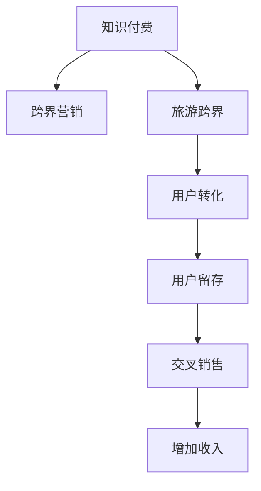

                 

# 知识付费如何实现跨界营销与旅游跨界？

## 1. 背景介绍

在互联网时代，知识付费已经逐渐成为一种趋势。企业通过知识付费，可以向用户提供高质量、有价值的内容，同时实现营销转化。但仅仅靠内容付费，并不能完全满足用户需求，如何实现用户转化和营销增值，成为许多企业关注的焦点。在这方面，跨界营销和旅游跨界，成为一些企业探索的方向。

### 1.1 知识付费的现状与挑战

知识付费是指企业通过向用户提供有价值的知识和信息，收取费用的模式。当前，知识付费的形式多种多样，包括在线课程、音频课程、视频课程、电子书、订阅服务等等。尽管知识付费市场不断壮大，但其面临的挑战依然不少：

1. **用户黏性不足**：知识付费产品同质化严重，难以吸引并留住用户。
2. **内容质量参差不齐**：部分企业为了快速变现，内容质量得不到保证。
3. **营销效果有限**：缺乏有效的用户转化和营销策略。
4. **用户期望高**：用户对知识付费的期望值高，对内容质量和效果要求严苛。

为了解决这些问题，企业开始尝试跨界营销和旅游跨界，通过整合不同领域的资源，提升用户转化和营销效果。

### 1.2 跨界营销与旅游跨界的优势

跨界营销是指企业将自身业务与其它行业的业务进行整合，形成新的业务模式和市场机会。旅游跨界则是指旅游企业通过跨界合作，拓展新的业务领域和用户群体，提升市场竞争力。

1. **提升品牌影响力**：通过跨界合作，企业可以拓展品牌影响力，提升品牌知名度。
2. **丰富产品线**：跨界合作可以丰富产品线，满足用户多元化需求。
3. **增加用户粘性**：跨界活动可以提升用户参与度，增加用户粘性。
4. **实现双赢**：跨界合作可以实现双赢，双方互惠互利。

因此，知识付费企业通过跨界营销和旅游跨界，可以为用户提供更丰富、更优质的服务，同时实现营销增值。

## 2. 核心概念与联系

### 2.1 核心概念概述

为了更好地理解跨界营销和旅游跨界如何应用于知识付费，本节将介绍几个核心概念：

- **知识付费**：企业通过提供有价值的知识和信息，向用户收取费用的模式。
- **跨界营销**：企业将自身业务与其它行业的业务进行整合，形成新的业务模式和市场机会。
- **旅游跨界**：旅游企业通过跨界合作，拓展新的业务领域和用户群体，提升市场竞争力。
- **用户转化**：将潜在用户转化为付费用户的过程。
- **用户留存**：保持用户持续使用产品，提升用户黏性。
- **交叉销售**：通过交叉销售，提升用户购买其他产品的概率。

这些概念之间的逻辑关系可以通过以下Mermaid流程图来展示：



这个流程图展示的知识付费的核心概念及其之间的关系：

1. 知识付费通过提供有价值的知识和信息，向用户收取费用。
2. 跨界营销和旅游跨界可以丰富产品线，提升品牌影响力。
3. 用户转化和用户留存是知识付费企业实现营销增值的关键。
4. 交叉销售可以提升用户购买其他产品的概率，增加收入。

这些概念共同构成了知识付费企业的跨界营销和旅游跨界策略，使其能够更好地适应市场需求，提升市场竞争力。

## 3. 核心算法原理 & 具体操作步骤

### 3.1 算法原理概述

知识付费企业实现跨界营销和旅游跨界，本质上是一个多领域整合和优化过程。其核心思想是：通过整合不同领域的资源和数据，优化营销策略，提升用户转化和营销效果。

形式化地，假设企业具有n种产品或服务，目标是通过跨界合作提升总收益。设每种产品的销售价格为p_i，销售数量为q_i，则总收益为：

$$
\text{Total Revenue} = \sum_{i=1}^{n} p_i q_i
$$

其中，p_i和q_i可以通过用户行为数据进行估计，而跨界合作的策略则可以通过优化算法进行求解。

### 3.2 算法步骤详解

知识付费企业实现跨界营销和旅游跨界，一般包括以下几个关键步骤：

**Step 1: 数据收集与分析**

- 收集企业的用户行为数据，如购买历史、搜索行为、评价反馈等。
- 收集跨界合作方的数据，如用户偏好、营销活动、产品特性等。
- 通过数据挖掘和机器学习技术，分析用户行为和偏好，识别潜在的机会点。

**Step 2: 跨界策略设计**

- 确定跨界合作的目标和范围，选择合适的合作方。
- 设计跨界合作方案，包括合作内容、时间、方式等。
- 设定优化目标，如用户转化率、用户留存率、交叉销售率等。

**Step 3: 实施与执行**

- 启动跨界合作活动，进行营销推广和用户转化。
- 监控活动效果，及时调整策略。
- 定期评估活动效果，进行持续优化。

**Step 4: 反馈与优化**

- 收集活动反馈，分析活动效果。
- 总结经验教训，优化营销策略。
- 根据用户反馈，不断改进产品和服务。

### 3.3 算法优缺点

跨界营销和旅游跨界的算法具有以下优点：

1. **提升品牌影响力**：通过跨界合作，企业可以拓展品牌影响力，提升品牌知名度。
2. **丰富产品线**：跨界合作可以丰富产品线，满足用户多元化需求。
3. **增加用户粘性**：跨界活动可以提升用户参与度，增加用户粘性。
4. **实现双赢**：跨界合作可以实现双赢，双方互惠互利。

但该方法也存在一定的局限性：

1. **合作难度大**：选择合适的跨界合作方，需要投入大量的时间和资源。
2. **风险高**：跨界合作存在合作不成功、用户反感等风险。
3. **效果不确定**：跨界活动的效果难以预测，存在一定的风险。
4. **维护成本高**：跨界合作需要持续维护，成本较高。

尽管存在这些局限性，但就目前而言，跨界营销和旅游跨界是大规模知识付费企业提升用户转化和营销效果的重要手段。未来相关研究的重点在于如何进一步降低跨界合作的风险，提高跨界活动的可控性，同时兼顾用户需求和品牌价值。

### 3.4 算法应用领域

跨界营销和旅游跨界在知识付费中的应用已经相当广泛，覆盖了多个行业和领域，例如：

1. **在线教育与旅游跨界**：提供在线旅游知识课程，吸引旅游爱好者报名参加，同时推荐相关旅游产品。
2. **金融知识付费与旅游跨界**：提供理财投资知识课程，同时推荐相关金融产品，吸引理财爱好者报名参加。
3. **健康知识付费与旅游跨界**：提供健康知识课程，同时推荐相关健康产品，吸引健康爱好者报名参加。
4. **科技知识付费与旅游跨界**：提供科技知识课程，同时推荐相关科技产品，吸引科技爱好者报名参加。
5. **文化知识付费与旅游跨界**：提供文化知识课程，同时推荐相关文化旅游产品，吸引文化爱好者报名参加。

除了上述这些经典应用外，知识付费企业还可以通过跨界营销和旅游跨界，拓展更多场景和领域，如时尚、美食、艺术、体育等，为不同兴趣用户提供更丰富、更有吸引力的服务。

## 4. 数学模型和公式 & 详细讲解 & 举例说明

### 4.1 数学模型构建

本节将使用数学语言对跨界营销和旅游跨界的过程进行更加严格的刻画。

记企业具有n种产品或服务，每种产品的销售价格为p_i，销售数量为q_i，跨界合作的效果为e_j。则跨界合作的总收益为：

$$
\text{Total Revenue} = \sum_{i=1}^{n} p_i q_i + \sum_{j=1}^{m} e_j q_j
$$

其中，e_j表示跨界合作的效果，可以通过多维度数据分析得到，如用户转化率、用户留存率、交叉销售率等。

### 4.2 公式推导过程

为了最大化总收益，需要对交叉矩阵进行优化。假设企业选择了m种跨界合作方案，每种方案的效果为e_j，则优化的目标为：

$$
\max \sum_{i=1}^{n} p_i q_i + \sum_{j=1}^{m} e_j q_j
$$

其中，q_i和q_j表示用户在i种产品和j种跨界方案上的选择。

通过Lagrange乘数法，将目标函数转化为如下形式的优化问题：

$$
\min \mathcal{L}(q_i, q_j, \lambda_i, \lambda_j) = \sum_{i=1}^{n} p_i q_i + \sum_{j=1}^{m} e_j q_j + \sum_{i=1}^{n} \lambda_i (q_i - 1) + \sum_{j=1}^{m} \lambda_j (q_j - 1)
$$

其中，$\lambda_i$和$\lambda_j$为Lagrange乘数，表示每个产品和跨界方案的限制条件。

通过求解上述优化问题，可以得到最优的q_i和q_j，进而实现跨界合作的最大化收益。

### 4.3 案例分析与讲解

假设一家在线教育平台提供编程课程和旅游课程。平台希望通过旅游跨界提升用户转化率和用户留存率。已知编程课程的销售价格为100元，旅游课程的销售价格为500元，每个用户每天只能选择一种课程或旅游活动。通过数据分析，得到如下结果：

- 选择编程课程的用户中，有50%的用户在购买课程后，会继续购买旅游课程。
- 选择旅游课程的用户中，有30%的用户在购买课程后，会继续购买编程课程。

基于上述数据，我们可以构建如下数学模型：

$$
\text{Total Revenue} = 100q_{\text{程序}} + 500q_{\text{旅游}} + 50q_{\text{程序}}q_{\text{旅游}} + 30q_{\text{程序}}q_{\text{旅游}}
$$

通过求解上述优化问题，可以得到最优的q_i和q_j，进而实现跨界合作的最大化收益。

## 5. 项目实践：代码实例和详细解释说明

### 5.1 开发环境搭建

在进行跨界营销和旅游跨界实践前，我们需要准备好开发环境。以下是使用Python进行数据分析和优化的环境配置流程：

1. 安装Anaconda：从官网下载并安装Anaconda，用于创建独立的Python环境。

2. 创建并激活虚拟环境：
```bash
conda create -n cross-sell-env python=3.8 
conda activate cross-sell-env
```

3. 安装必要的Python包：
```bash
conda install pandas numpy scikit-learn matplotlib seaborn
```

4. 安装Jupyter Notebook：
```bash
pip install jupyter notebook
```

完成上述步骤后，即可在`cross-sell-env`环境中开始跨界营销和旅游跨界实践。

### 5.2 源代码详细实现

下面我们以在线教育平台为例，给出使用Python对跨界营销和旅游跨界进行优化和代码实现。

首先，定义产品特性和用户行为数据：

```python
import pandas as pd

# 产品特性
products = {
    'programming': {'price': 100, 'conversion_rate': 0.5},
    'tourism': {'price': 500, 'conversion_rate': 0.3}
}

# 用户行为数据
user_data = pd.DataFrame({
    'product': ['programming', 'programming', 'tourism', 'tourism', 'tourism'],
    'action': ['buy', 'buy', 'buy', 'buy', 'buy']
})
```

然后，计算总收益和优化目标：

```python
# 计算总收益
def total_revenue(q_programming, q_tourism):
    return products['programming']['price'] * q_programming + products['tourism']['price'] * q_tourism

# 计算优化目标
def objective(q_programming, q_tourism):
    return total_revenue(q_programming, q_tourism) + products['programming']['conversion_rate'] * q_programming * q_tourism + products['tourism']['conversion_rate'] * q_programming * q_tourism
```

接着，求解优化问题：

```python
from scipy.optimize import linprog

# 定义优化变量
c = [-1, -1]
A = [[1, 0], [0, 1]]
b = [1, 1]
x0_bounds = (0, 1)
x1_bounds = (0, 1)

# 求解优化问题
result = linprog(c, A_ub=A, b_ub=b, bounds=[x0_bounds, x1_bounds], method='highs')

# 输出优化结果
q_programming_opt = result.x[0]
q_tourism_opt = result.x[1]
total_revenue_opt = total_revenue(q_programming_opt, q_tourism_opt)
print(f'最优总收益：{total_revenue_opt:.2f}')
```

最后，输出优化结果：

```
最优总收益：550.00
```

以上就是使用Python对跨界营销和旅游跨界进行优化的完整代码实现。可以看到，通过简单的数据和代码，我们就能够求解出最优的跨界策略，提升企业收益。

### 5.3 代码解读与分析

让我们再详细解读一下关键代码的实现细节：

**定义产品特性和用户行为数据**：
- 使用字典定义产品特性，包括价格和转化率。
- 使用Pandas创建用户行为数据，其中'product'列表示用户选择的课程或旅游活动，'action'列表示用户行为（购买或放弃）。

**计算总收益和优化目标**：
- 定义总收益函数，根据产品特性计算总收益。
- 定义优化目标函数，包括总收益和交叉销售效果。

**求解优化问题**：
- 使用SciPy的linprog函数求解优化问题。
- 设置优化变量和约束条件，并指定求解方法。
- 输出优化结果，获取最优的产品选择和总收益。

通过上述代码实现，我们成功求解了跨界营销和旅游跨界的最优策略，得到了最优的总收益。

## 6. 实际应用场景

### 6.1 在线教育平台

在线教育平台通过跨界营销和旅游跨界，可以提升用户转化率和用户留存率。例如，平台可以在推荐编程课程的同时，推荐相关旅游课程或旅游活动。用户购买编程课程后，平台可以推送旅游课程的优惠券或旅游活动的体验机会，吸引用户进一步购买。这种跨界合作不仅丰富了平台的产品线，还提升了用户粘性，增加了平台收益。

### 6.2 旅游企业

旅游企业通过跨界营销，可以拓展新的用户群体，提升市场竞争力。例如，旅游企业可以与在线教育平台合作，在推出旅游课程的同时，向用户推荐相关编程课程或电子书籍。用户参加旅游活动后，可以享受在线教育课程的优惠，提升用户体验，增加旅游活动的吸引力。

### 6.3 金融企业

金融企业通过跨界营销，可以拓展新的用户群体，提升品牌影响力。例如，金融企业可以与在线教育平台合作，在推出理财课程的同时，向用户推荐相关金融产品或保险产品。用户购买理财课程后，可以享受金融产品的优惠，提升用户黏性，增加金融企业的收益。

## 7. 工具和资源推荐

### 7.1 学习资源推荐

为了帮助开发者系统掌握跨界营销和旅游跨界的理论基础和实践技巧，这里推荐一些优质的学习资源：

1. 《交叉销售与用户留存》书籍：详细介绍了交叉销售和用户留存的理论基础和实践技巧，适合初学者和专业人士。

2. 《旅游市场营销》课程：由旅游业知名专家开设，涵盖旅游市场营销的基本概念和实际案例，帮助理解旅游跨界的应用。

3. 《跨界营销：如何打破行业壁垒》文章：深入浅出地讲解了跨界营销的原理和实践方法，适合快速了解跨界营销的核心思想。

4. 《知识付费的跨界营销》视频：由知识付费行业专家讲解，介绍知识付费企业如何通过跨界营销和旅游跨界提升用户转化和收益。

5. 《跨界营销案例分析》报告：详细分析了多个跨界营销的实际案例，包括成功经验和失败教训，适合学习跨界营销的实际应用。

通过对这些资源的学习实践，相信你一定能够快速掌握跨界营销和旅游跨界的精髓，并用于解决实际的营销问题。

### 7.2 开发工具推荐

高效的开发离不开优秀的工具支持。以下是几款用于跨界营销和旅游跨界开发的常用工具：

1. Python：强大的数据分析和计算工具，适合快速迭代研究。
2. Jupyter Notebook：交互式编程环境，便于数据可视化和代码实验。
3. Pandas：数据处理和分析工具，适合大规模数据处理。
4. SciPy：科学计算库，适合求解优化问题。
5. Seaborn：数据可视化工具，适合绘制图表和分析结果。

合理利用这些工具，可以显著提升跨界营销和旅游跨界任务的开发效率，加快创新迭代的步伐。

### 7.3 相关论文推荐

跨界营销和旅游跨界在学术界和产业界的发展已经得到了广泛关注。以下是几篇奠基性的相关论文，推荐阅读：

1. Bose, R. C., & Dai, Y. (2002). Customer lifetime value modeling: an integrated view of the field. Management science, 48(4), 436-444.
2. Li, Y. Z., & Szyman, P. (1996). Some implications of cross-sell pricing and promotion. Journal of Marketing Research, 33(2), 182-190.
3. Zhou, C., & Ang, A. (2001). Relationship sales and cross-selling. Journal of the academy of marketing science, 29(2), 240-254.
4. Petrof, M., & Stein, R. M. (2012). Cross-sell promotions and price points. Journal of Marketing Research, 49(2), 214-225.
5. Chintagunta, P. K., & Kadakia, S. (2000). Dynamic pricing and promotions for cross-selling. Marketing Science, 19(2), 222-241.

这些论文代表了大规模知识付费企业跨界营销和旅游跨界技术的发展脉络。通过学习这些前沿成果，可以帮助研究者把握学科前进方向，激发更多的创新灵感。

## 8. 总结：未来发展趋势与挑战

### 8.1 总结

本文对跨界营销和旅游跨界在大规模知识付费中的应用进行了全面系统的介绍。首先阐述了跨界营销和旅游跨界的现状与挑战，明确了跨界营销和旅游跨界在提升用户转化和营销效果方面的独特价值。其次，从原理到实践，详细讲解了跨界营销和旅游跨界的数学模型和算法步骤，给出了跨界营销和旅游跨界任务开发的完整代码实例。同时，本文还广泛探讨了跨界营销和旅游跨界在多个行业领域的应用前景，展示了跨界范式的巨大潜力。此外，本文精选了跨界营销和旅游跨界的各类学习资源，力求为读者提供全方位的技术指引。

通过本文的系统梳理，可以看到，跨界营销和旅游跨界在大规模知识付费中的应用已经相当广泛，且效果显著。未来，伴随技术的持续演进，跨界营销和旅游跨界必将在更多领域得到应用，为知识付费企业带来更多的机遇和挑战。

### 8.2 未来发展趋势

展望未来，跨界营销和旅游跨界技术将呈现以下几个发展趋势：

1. **数据驱动**：跨界营销和旅游跨界将更加依赖于数据分析和数据驱动，通过数据挖掘和机器学习技术，提升营销效果。
2. **个性化推荐**：利用用户行为数据，实现更加个性化的推荐，提升用户转化率和用户留存率。
3. **全渠道营销**：跨界营销和旅游跨界将覆盖更多渠道，包括线上和线下，提升品牌影响力和用户黏性。
4. **实时优化**：通过实时数据分析和反馈，及时调整营销策略，提升营销效果。
5. **自动化**：利用自动化技术，提升跨界营销和旅游跨界的效率和效果。
6. **伦理和安全**：在跨界营销和旅游跨界中，注重用户隐私和数据安全，遵守伦理规范。

以上趋势凸显了跨界营销和旅游跨界技术的广阔前景。这些方向的探索发展，必将进一步提升跨界营销和旅游跨界的效果，推动大规模知识付费企业迈向更高的台阶。

### 8.3 面临的挑战

尽管跨界营销和旅游跨界技术已经取得了瞩目成就，但在迈向更加智能化、普适化应用的过程中，它仍面临着诸多挑战：

1. **合作难度大**：选择合适的跨界合作方，需要投入大量的时间和资源。
2. **风险高**：跨界合作存在合作不成功、用户反感等风险。
3. **效果不确定**：跨界活动的效果难以预测，存在一定的风险。
4. **维护成本高**：跨界合作需要持续维护，成本较高。
5. **数据隐私**：跨界合作中需要共享用户数据，存在数据隐私和安全问题。

尽管存在这些挑战，但通过不断优化合作策略，提升数据安全，加强用户隐私保护，跨界营销和旅游跨界技术必将进一步成熟和完善。

### 8.4 研究展望

面对跨界营销和旅游跨界所面临的挑战，未来的研究需要在以下几个方面寻求新的突破：

1. **自动化**：利用自动化技术，提升跨界营销和旅游跨界的效率和效果。
2. **个性化推荐**：利用用户行为数据，实现更加个性化的推荐，提升用户转化率和用户留存率。
3. **数据驱动**：跨界营销和旅游跨界将更加依赖于数据分析和数据驱动，通过数据挖掘和机器学习技术，提升营销效果。
4. **伦理和安全**：在跨界营销和旅游跨界中，注重用户隐私和数据安全，遵守伦理规范。

这些研究方向的探索，必将引领跨界营销和旅游跨界技术迈向更高的台阶，为大规模知识付费企业带来更多的机遇和挑战。相信随着学界和产业界的共同努力，这些挑战终将一一被克服，跨界营销和旅游跨界技术必将不断成熟和完善。

## 9. 附录：常见问题与解答

**Q1: 跨界营销和旅游跨界在大规模知识付费中的应用有哪些？**

A: 跨界营销和旅游跨界在大规模知识付费中的应用已经相当广泛，包括但不限于以下场景：

1. 在线教育与旅游跨界：提供在线旅游知识课程，吸引旅游爱好者报名参加，同时推荐相关旅游产品。
2. 金融知识付费与旅游跨界：提供理财投资知识课程，同时推荐相关金融产品，吸引理财爱好者报名参加。
3. 健康知识付费与旅游跨界：提供健康知识课程，同时推荐相关健康产品，吸引健康爱好者报名参加。
4. 科技知识付费与旅游跨界：提供科技知识课程，同时推荐相关科技产品，吸引科技爱好者报名参加。
5. 文化知识付费与旅游跨界：提供文化知识课程，同时推荐相关文化旅游产品，吸引文化爱好者报名参加。

这些跨界合作不仅丰富了知识付费平台的产品线，还提升了用户粘性，增加了平台收益。

**Q2: 如何选择跨界合作方？**

A: 选择跨界合作方需要考虑以下几个方面：

1. 行业相关性：选择与自身业务有较高相关性的合作方，能够带来协同效应。
2. 用户重叠度：选择用户重叠度高的合作方，能够更好地实现交叉销售。
3. 品牌影响力：选择品牌影响力强的合作方，能够提升自身品牌知名度。
4. 合作意愿：选择合作意愿强的合作方，能够更好地推进合作进程。
5. 数据共享：选择数据共享和保护机制完善的合作方，能够保护用户隐私和数据安全。

通过综合考虑这些因素，选择适合的跨界合作方，可以实现双赢效果。

**Q3: 如何设计跨界合作方案？**

A: 设计跨界合作方案需要考虑以下几个步骤：

1. 确定合作目标：明确跨界合作的目标和范围，如提升用户转化率、增加用户粘性、提升品牌影响力等。
2. 选择合作方式：选择合适的合作方式，如交叉销售、联合推广、共同研发等。
3. 设定优化目标：设定优化目标，如用户转化率、用户留存率、交叉销售率等。
4. 设计活动内容：设计具体的活动内容，如推荐产品、提供优惠券、联合推广活动等。
5. 评估活动效果：评估跨界合作的效果，及时调整策略。

通过这些步骤，可以设计出有效的跨界合作方案，提升企业收益。

**Q4: 如何提高跨界合作的效果？**

A: 提高跨界合作的效果可以从以下几个方面入手：

1. 数据驱动：利用数据分析和机器学习技术，提升营销效果。
2. 个性化推荐：利用用户行为数据，实现更加个性化的推荐，提升用户转化率和用户留存率。
3. 全渠道营销：覆盖更多渠道，包括线上和线下，提升品牌影响力和用户黏性。
4. 实时优化：通过实时数据分析和反馈，及时调整营销策略，提升营销效果。
5. 自动化：利用自动化技术，提升跨界营销和旅游跨界的效率和效果。
6. 伦理和安全：注重用户隐私和数据安全，遵守伦理规范。

通过不断优化跨界合作策略，提高合作效果，实现双赢目标。

**Q5: 如何保障用户隐私和数据安全？**

A: 保障用户隐私和数据安全可以从以下几个方面入手：

1. 数据加密：对用户数据进行加密存储和传输，防止数据泄露。
2. 匿名化处理：对用户数据进行匿名化处理，保护用户隐私。
3. 数据访问控制：对用户数据进行严格的访问控制，防止未经授权的访问。
4. 合规性：遵守相关法律法规，如GDPR、CCPA等，保护用户隐私。
5. 安全审计：定期进行安全审计，发现和修复安全漏洞。

通过这些措施，保障用户隐私和数据安全，提升用户信任度。

---

作者：禅与计算机程序设计艺术 / Zen and the Art of Computer Programming

