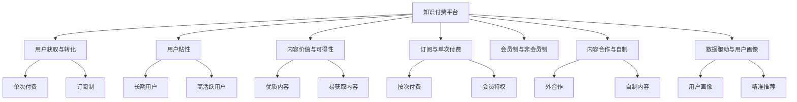

                 

# 知识付费平台要选择适合的商业模式发展

## 1. 背景介绍

在互联网经济的快速发展背景下，知识付费平台应运而生。它们通过整合优质的知识资源，为学习者提供专业、系统的教育内容，帮助用户快速提升专业技能和知识水平，满足日益增长的知识需求。但同时，由于行业起步较晚，市场竞争激烈，知识付费平台的商业模式选择和发展路径成为了关键问题。

## 2. 核心概念与联系

### 2.1 核心概念概述

为更好地理解知识付费平台的商业模式选择，本节将介绍几个密切相关的核心概念：

- **知识付费平台**：利用互联网技术，提供知识资源付费服务的在线平台，包括线上直播、视频课程、付费文档等。
- **用户获取与转化**：平台获取用户的渠道和策略，以及将潜在用户转化为付费用户的转化率。
- **用户粘性**：用户对平台的长期使用依赖度和活跃度，直接关系到平台长期盈利能力。
- **内容价值与可得性**：知识内容的质量和用户获取难度，影响用户付费意愿。
- **订阅与单次付费**：根据不同内容模块或特定场景，采用灵活多样的付费方式，如年费、月费、单次购买等。
- **会员制与非会员制**：平台是否提供会员特权或额外优惠，以区分不同用户群体。
- **内容合作与自制**：平台通过与其他机构合作或自制内容进行内容聚合，满足不同用户需求。
- **数据驱动与用户画像**：利用用户行为数据进行用户画像和精准推荐，提升用户满意度和留存率。

这些核心概念之间的逻辑关系可以通过以下Mermaid流程图来展示：



这个流程图展示了一系列核心概念以及它们之间的关系：

1. 知识付费平台通过多种方式获取用户，并转化为付费用户。
2. 用户的粘性直接影响平台收益。
3. 优质内容是用户付费的关键驱动因素。
4. 平台通过订阅和单次付费等方式进行灵活的定价策略。
5. 会员制和非会员制提供不同层次的服务和特权。
6. 内容合作与自制结合满足多样需求。
7. 数据驱动帮助平台实现精准用户画像和推荐。

这些概念共同构成了知识付费平台的商业模式选择与优化框架，有助于平台在竞争激烈的市场中占据有利位置。

## 3. 核心算法原理 & 具体操作步骤
### 3.1 算法原理概述

知识付费平台的商业模式选择，本质上是一个基于市场分析和用户行为研究的优化决策过程。其核心思想是：通过科学合理的定价策略、内容合作模式和用户运营策略，最大化平台的用户获取、留存和收入。

形式化地，假设知识付费平台的目标是最大化长期利润，设 $U$ 为用户，$P$ 为定价策略，$C$ 为内容合作模式，$O$ 为运营策略，则平台的目标优化函数为：

$$
\max_{P,C,O} \int_{U} \pi(U,P,C,O) dU
$$

其中 $\pi(U,P,C,O)$ 表示平台与用户的交互收益，包括订阅收入、广告收入、增值服务等，$U$ 为用户群体的集合。

### 3.2 算法步骤详解

知识付费平台的选择和发展步骤如下：

**Step 1: 市场调研与用户需求分析**
- 分析目标用户群体的特征和需求，如年龄、职业、兴趣爱好等。
- 评估市场竞争格局，识别差异化竞争策略。
- 调研同行业其他平台的用户体验和付费模式。

**Step 2: 内容策略设计与整合**
- 确定平台的核心内容方向和类型，如职业技能培训、文化教育、技术开发等。
- 选择合适的合作机构和专家，进行内容生产与质量控制。
- 整合内容资源，形成平台独特的知识体系和课程体系。

**Step 3: 定价策略优化**
- 设计灵活多样的付费模式，如按次付费、订阅制、会员特权等。
- 采用动态定价策略，根据市场需求和用户反馈进行调整。
- 评估不同定价策略对用户获取和转化率的影响，进行优化。

**Step 4: 用户运营与留存策略**
- 引入数据驱动的用户画像分析，实现精准推荐和个性化服务。
- 设计丰富的活动和优惠，提高用户粘性和活跃度。
- 优化用户体验和内容质量，提升用户满意度。

**Step 5: 持续优化与迭代**
- 根据用户反馈和市场变化，持续调整和优化策略。
- 引入新技术和新工具，提升平台的技术和服务水平。
- 进行盈利模型和用户路径的复盘与迭代，形成闭环。

### 3.3 算法优缺点

知识付费平台的商业模式选择具有以下优点：
1. 灵活多样：根据不同用户需求和市场反馈，可以灵活调整定价和内容策略。
2. 数据驱动：通过用户行为数据进行精确分析和推荐，提升用户粘性和转化率。
3. 资源整合：通过内容合作与自制结合，形成差异化内容优势。
4. 用户粘性：持续优化用户体验和内容质量，形成长期用户依赖。

同时，该模式也存在一定的局限性：
1. 高运营成本：平台需要持续投入内容生产和用户运营，成本较高。
2. 竞争激烈：众多平台参与，用户选择多样，平台获取和留存用户难度较大。
3. 内容质量风险：依赖外部合作机构，内容质量和更新速度难以保障。
4. 用户付费意愿：用户对付费内容价值认知不一，转化率受市场教育和用户行为影响较大。
5. 商业模式探索：适合面向B端市场的平台，对C端市场，需要进一步探索有效的盈利模型。

尽管存在这些局限性，但就目前而言，知识付费平台的商业模型在教育市场仍是大势所趋，受到诸多投资者的青睐。未来相关研究的重点在于如何进一步降低运营成本，提高用户粘性，拓展盈利模式，优化用户体验，以形成更具竞争力的知识付费平台。

### 3.4 算法应用领域

知识付费平台的商业模式选择不仅适用于教育行业，还广泛应用于其他垂直领域，如金融、医疗、技术培训等。以下是几个典型应用场景：

- **金融知识付费**：提供专业的投资理财、金融分析等课程，满足金融从业者和管理者的知识需求。
- **医疗健康付费**：整合医学知识库和专家课程，提供医疗急救、疾病预防等专业健康知识。
- **技术开发付费**：提供软件开发、数据科学等技术培训课程，帮助开发者快速提升技能。
- **企业培训付费**：为企业提供定制化培训课程，提升员工职业技能和工作效率。
- **文化娱乐付费**：提供艺术欣赏、历史人文等课程，丰富用户精神生活。

这些领域内知识付费平台的成功运营，展示了商业模式的广泛适用性。通过将优质内容资源与灵活的定价和运营策略相结合，平台能够有效满足用户需求，提升用户价值，实现商业化运营。

## 4. 数学模型和公式 & 详细讲解
### 4.1 数学模型构建

本节将使用数学语言对知识付费平台的商业模式选择进行更加严格的刻画。

假设知识付费平台的目标是最大化长期利润，设 $U$ 为用户，$P$ 为定价策略，$C$ 为内容合作模式，$O$ 为运营策略，则平台的目标优化函数为：

$$
\max_{P,C,O} \int_{U} \pi(U,P,C,O) dU
$$

其中 $\pi(U,P,C,O)$ 表示平台与用户的交互收益，包括订阅收入、广告收入、增值服务等，$U$ 为用户群体的集合。

### 4.2 公式推导过程

以下我们以单次付费模式为例，推导定价策略的影响。

假设用户群体 $U$ 的概率密度函数为 $f(u)$，用户每次使用平台内容的期望收益为 $R(u)$，定价策略 $P(u)$ 为：

$$
P(u) = \begin{cases}
p_0 & \text{if } u \in U_0 \\
p_1 & \text{if } u \in U_1 
\end{cases}
$$

其中 $U_0$ 和 $U_1$ 分别表示高价值用户和低价值用户群体，$p_0$ 和 $p_1$ 为两种定价水平。假设用户的概率分布为 $f(u)$，则平台期望收入为：

$$
\mathbb{E}[R(U)] = \int_{U} P(u)R(u)f(u)du
$$

对于不同定价策略，期望收入的公式如下：

- 对高价值用户 $U_0$：
$$
\mathbb{E}[R(U_0)] = p_0 \int_{U_0} R(u)f(u)du
$$
- 对低价值用户 $U_1$：
$$
\mathbb{E}[R(U_1)] = p_1 \int_{U_1} R(u)f(u)du
$$

通过最大化期望收益，可以求得最优定价策略 $p_0$ 和 $p_1$：

$$
p_0 = \max_{p_0} \mathbb{E}[R(U_0)] \\
p_1 = \max_{p_1} \mathbb{E}[R(U_1)]
$$

通过求解上述优化问题，可以确定最优定价策略，从而提升平台收益。

### 4.3 案例分析与讲解

我们以在线教育平台为例，具体分析定价策略的优化过程。

假设平台的用户群体分为两类：高价值用户（如企业员工、学生等）和低价值用户（如公众、自由职业者等）。根据平台的数据分析，高价值用户的年订阅收入为 $10,000$ 元，低价值用户为 $1,000$ 元。平台定价策略如下：

- 对高价值用户，年订阅价格为 $10,000$ 元。
- 对低价值用户，首次订阅价格为 $9,000$ 元，之后每月订阅价格为 $100$ 元。

根据上述数据，平台可以计算期望收入和最优定价：

- 高价值用户：
$$
\mathbb{E}[R(U_0)] = 10,000 \times \int_{U_0} f(u)du = 10,000
$$
- 低价值用户：
$$
\mathbb{E}[R(U_1)] = 1,000 \times \int_{U_1} f(u)du = 1,000
$$

因此，最优定价策略为：

$$
p_0 = 10,000 \\
p_1 = 1,000
$$

这样，平台既保证了高价值用户的稳定收益，又吸引了低价值用户的首次订阅，实现了最优定价。

## 5. 项目实践：代码实例和详细解释说明
### 5.1 开发环境搭建

在进行商业模式选择与优化实践前，我们需要准备好开发环境。以下是使用Python进行数据分析与建模的环境配置流程：

1. 安装Anaconda：从官网下载并安装Anaconda，用于创建独立的Python环境。

2. 创建并激活虚拟环境：
```bash
conda create -n pydata-env python=3.8 
conda activate pydata-env
```

3. 安装必要的工具包：
```bash
conda install pandas numpy scipy matplotlib seaborn sklearn
```

4. 安装Jupyter Notebook：
```bash
pip install jupyter notebook
```

5. 安装相关数据分析工具：
```bash
conda install statsmodels statsmodels-regressx
```

完成上述步骤后，即可在`pydata-env`环境中开始商业模式优化实践。

### 5.2 源代码详细实现

下面是使用Python和Pandas库进行数据分析和优化建模的代码实现。

首先，加载和处理用户数据：

```python
import pandas as pd

# 加载用户数据
users = pd.read_csv('users.csv')

# 用户分类
users['category'] = users['income'].apply(lambda x: 'low' if x < 10000 else 'high')

# 统计高价值和低价值用户比例
print(users['category'].value_counts())
```

然后，根据用户分类和定价策略，计算期望收益：

```python
# 高价值用户期望收益
high_value_income = users[users['category'] == 'high']['income'].mean()
high_value_price = 10000

# 低价值用户期望收益
low_value_income = users[users['category'] == 'low']['income'].mean()
low_value_price = 9000

# 计算期望收入
expected_income = high_value_income * high_value_price + low_value_income * low_value_price
print(expected_income)
```

最后，根据计算结果，确定最优定价策略：

```python
# 输出最优定价策略
print('最优定价策略：')
print(f'高价值用户：{high_value_price} 元/年')
print(f'低价值用户：{low_value_price} 元/首订阅')
```

以上就是使用Python和Pandas库进行知识付费平台定价策略优化的代码实现。可以看到，通过简单的数据分析和计算，可以得出最优的定价策略。

### 5.3 代码解读与分析

让我们再详细解读一下关键代码的实现细节：

**用户数据处理**：
- 使用Pandas加载用户数据，并进行基本的用户分类和统计。
- 计算高价值和低价值用户的平均收入，作为期望收益的输入。

**期望收入计算**：
- 根据用户分类和定价策略，计算不同用户的期望收益。
- 通过简单加权求和，得到平台的期望收入。

**最优定价策略确定**：
- 根据期望收入的计算结果，确定最优的定价策略。
- 输出结果供决策者参考。

## 6. 实际应用场景
### 6.1 教育行业

知识付费平台在教育行业的应用，为用户提供了系统、专业的学习资源，满足了不同学习需求。以在线教育平台为例，通过优化定价策略和内容合作模式，平台能够实现用户的高粘性和长期收益。

在技术实现上，平台可以定期收集用户反馈和行为数据，使用数据分析工具对用户进行细分，识别高价值用户群体。然后，针对不同用户群体设计灵活多样的定价策略，如学生优惠、企业订阅等，同时优化课程内容和推荐算法，提高用户满意度和留存率。

### 6.2 医疗健康

知识付费平台在医疗健康领域，通过整合优质医疗资源，提供专业的健康知识和医疗服务，满足用户的健康需求。平台可以与医院、医学院等机构合作，提供丰富的医疗知识库和专家课程，帮助用户提升健康管理能力。

在定价策略上，平台可以采用会员制和非会员制相结合的方式。高价值的医疗从业者或企业可以订阅高级会员，享受定制化服务；普通用户则可以通过单次付费或月度订阅获取基础医疗知识。平台还可以根据用户行为数据进行精准推荐，提供个性化的健康管理方案，提升用户粘性。

### 6.3 技术开发

技术开发领域是知识付费平台的重要应用场景。平台通过整合软件开发、数据科学等专业资源，为开发者提供系统化的技术培训，帮助其快速提升技能。

在定价策略上，平台可以采用项目制和课程制相结合的方式。项目制的培训课程费用相对较高，适合有一定基础的开发者；课程制的培训课程费用相对较低，适合初学者。平台还可以提供企业定制化培训，满足不同企业的技术需求。

### 6.4 未来应用展望

随着知识付费平台的发展，其商业模式将更加多样化、精细化。未来，平台可以探索更多的应用场景，如在线办公、智能家居等，为用户提供更全面的知识服务。

在技术上，知识付费平台将更加注重数据驱动和个性化推荐，通过大数据分析和机器学习技术，实现更精准的用户画像和内容匹配，提升用户体验和留存率。

在商业策略上，平台可以探索多样化的盈利模式，如广告收入、企业订阅、增值服务等，实现收入多元化。同时，平台还可以通过内容付费和知识变现，推动知识创作者和平台共同成长。

## 7. 工具和资源推荐
### 7.1 学习资源推荐

为了帮助开发者系统掌握知识付费平台的商业模式选择，这里推荐一些优质的学习资源：

1. **《知识付费行业分析与策略》课程**：由知识付费领域专家授课，涵盖行业背景、用户需求、竞争策略等多个方面。

2. **《数据科学与商业分析》书籍**：介绍数据驱动的商业模式优化方法，结合实际案例进行详细讲解。

3. **《人工智能商业化》论文**：探讨人工智能技术在知识付费平台中的应用，提供深度分析。

4. **《知识付费平台实战指南》书籍**：提供知识付费平台开发和管理的最佳实践，帮助企业快速上线。

5. **《数据分析与商业决策》课程**：介绍数据分析的基本方法和工具，结合商业案例进行讲解。

通过对这些资源的学习实践，相信你一定能够快速掌握知识付费平台的商业模式选择和优化技巧，并用于解决实际的商业模式问题。

### 7.2 开发工具推荐

高效的开发离不开优秀的工具支持。以下是几款用于知识付费平台开发的常用工具：

1. **Jupyter Notebook**：开源的交互式编程环境，支持多种编程语言，方便数据建模和可视化分析。

2. **Pandas**：Python的数据分析库，提供了丰富的数据处理和分析工具。

3. **NumPy**：Python的科学计算库，提供了高效的数组操作和数值计算。

4. **Scikit-learn**：Python的机器学习库，提供了丰富的机器学习算法和工具。

5. **TensorFlow**：Google的深度学习框架，支持大规模分布式计算，适合复杂的模型训练和优化。

6. **Keras**：基于TensorFlow的高层API，简化深度学习模型的开发和训练。

合理利用这些工具，可以显著提升知识付费平台的开发效率，加快创新迭代的步伐。

### 7.3 相关论文推荐

知识付费平台的发展得益于学界的持续研究。以下是几篇奠基性的相关论文，推荐阅读：

1. **《知识付费平台的市场分析与用户行为研究》**：分析知识付费平台的市场竞争格局和用户行为模式。

2. **《数据驱动的用户画像与推荐算法》**：探讨数据驱动的个性化推荐策略，提升用户粘性和转化率。

3. **《知识付费平台的内容策略与合作模式》**：分析知识付费平台的内容策略和内容合作模式，提供优化建议。

4. **《知识付费平台的定价策略优化》**：通过数学模型和数据分析方法，探讨定价策略的优化方法。

5. **《知识付费平台的用户获取与转化策略》**：研究用户获取与转化策略，提升平台的用户获取能力和转化率。

这些论文代表了大语言模型微调技术的发展脉络。通过学习这些前沿成果，可以帮助研究者把握学科前进方向，激发更多的创新灵感。

## 8. 总结：未来发展趋势与挑战
### 8.1 总结

本文对知识付费平台的商业模式选择进行了全面系统的介绍。首先阐述了知识付费平台发展的背景和意义，明确了商业模式选择对于平台长期盈利和市场竞争的重要性。其次，从原理到实践，详细讲解了商业模式的数学模型和优化策略，给出了商业模式优化的代码实例。同时，本文还广泛探讨了商业模式在多个行业领域的应用前景，展示了知识付费平台巨大的发展潜力。此外，本文精选了商业模式的相关学习资源，力求为读者提供全方位的技术指引。

通过本文的系统梳理，可以看到，知识付费平台的商业模式选择不仅适用于教育行业，还广泛应用于其他垂直领域，具有广泛的适用性。随着数据驱动和人工智能技术的不断进步，知识付费平台的商业模式将更加多样化和精细化，为用户带来更优质的知识服务体验。

### 8.2 未来发展趋势

展望未来，知识付费平台的商业模式将呈现以下几个发展趋势：

1. **数据驱动与个性化推荐**：通过大数据分析和机器学习技术，实现更精准的用户画像和内容匹配，提升用户体验和留存率。
2. **多样化盈利模式**：结合广告收入、企业订阅、增值服务等多种盈利模式，实现收入多元化。
3. **技术创新与融合**：引入人工智能、区块链等前沿技术，提升平台的智能化和安全性。
4. **全球化与本地化**：拓展国际市场，结合本地化需求，提供多样化的知识服务。
5. **教育与企业结合**：提供企业定制化培训和教育资源，促进企业发展与人才培养。
6. **内容创作与变现**：推动知识创作者与平台的共同成长，实现内容付费和知识变现。

这些趋势凸显了知识付费平台的发展方向，为平台带来更广阔的市场前景和技术创新空间。

### 8.3 面临的挑战

尽管知识付费平台的商业模式选择已经取得了一定的成效，但在迈向更加智能化、普适化应用的过程中，它仍面临着诸多挑战：

1. **内容质量和更新**：高质量内容的生产和持续更新，需要耗费大量人力和资源，平台需建立有效的内容管理机制。
2. **用户获取与转化**：高价值用户的获取和低价值用户的转化，需要精细化的用户运营策略和高效的推广手段。
3. **市场竞争**：众多平台的竞争加剧，平台需不断创新，提升自身的市场竞争力。
4. **用户粘性和留存**：用户对内容的长期依赖性不足，平台需通过不断的优化和创新，提升用户粘性。
5. **盈利模型**：需探索更加多样化和可持续的盈利模型，避免过度依赖单一收入来源。
6. **技术实现**：平台需提升技术实力，确保系统的稳定性和安全性。

正视知识付费平台面临的这些挑战，积极应对并寻求突破，将是大平台在竞争中立足的关键。相信随着学界和产业界的共同努力，这些挑战终将一一被克服，知识付费平台必将在全球市场发挥更大的作用。

### 8.4 研究展望

面对知识付费平台所面临的挑战，未来的研究需要在以下几个方面寻求新的突破：

1. **多模态内容融合**：结合视觉、听觉等多模态内容，提供更丰富、更具吸引力的知识服务。
2. **智能推荐系统**：引入人工智能技术，实现更精准的用户推荐和内容匹配。
3. **个性化学习路径**：根据用户的学习行为和知识结构，定制个性化的学习路径。
4. **知识图谱与本体论**：建立知识图谱和本体论框架，提供结构化、系统化的知识服务。
5. **区块链与版权保护**：引入区块链技术，实现知识版权的智能化管理和保护。
6. **社区与交互平台**：构建知识社区和交互平台，增强用户参与感和互动性。

这些研究方向的探索，必将引领知识付费平台向更加智能化、普适化的方向发展，为用户提供更优质的知识服务体验。

## 9. 附录：常见问题与解答
**Q1: 知识付费平台如何选择合适的定价策略？**

A: 选择合适的定价策略需要综合考虑平台的用户群体、内容价值、市场竞争等因素。一般而言，可以采用以下几种定价策略：

1. **单次付费**：适用于内容独立性强、价值高的课程或项目。用户一次支付即可获取完整内容，无需额外订阅费用。
2. **订阅制**：适用于需要定期获取内容或享受会员特权的服务。用户按月或按年支付订阅费用，享受平台提供的持续服务。
3. **按需付费**：适用于内容碎片化、用户按需获取的课程或服务。用户可根据需要选择部分内容付费，灵活性强。
4. **会员特权**：适用于提供特定服务或优惠的会员套餐。会员享受优先购买、专属课程等特权，提升用户粘性和满意度。

在选择定价策略时，需根据平台的用户需求、内容价值和市场竞争情况进行综合评估，选择最适合的策略。

**Q2: 知识付费平台如何提高用户粘性？**

A: 提高用户粘性是知识付费平台的重要目标，可以从以下几个方面入手：

1. **内容质量**：提供高质量、有价值的内容，满足用户需求，提升用户满意度。
2. **个性化推荐**：利用用户行为数据进行精准推荐，提升用户对平台的依赖性。
3. **交互体验**：优化平台的用户界面和交互设计，提升用户体验。
4. **社区与互动**：构建知识社区和用户互动平台，增强用户参与感和归属感。
5. **会员服务**：提供会员特权和专属优惠，提升用户粘性和留存率。
6. **用户反馈**：及时收集用户反馈，不断优化平台服务。

通过综合这些策略，平台可以显著提升用户粘性，实现长期盈利。

**Q3: 知识付费平台如何拓展市场？**

A: 拓展市场需要综合考虑平台的用户定位、市场竞争、推广策略等因素。以下是几种常见的方法：

1. **多平台战略**：在多个平台上进行推广，扩大平台的覆盖面和用户规模。
2. **内容营销**：通过优质的内容营销吸引用户，提升平台的品牌影响力和用户粘性。
3. **合作推广**：与知名机构、媒体等进行合作推广，借助外部资源提升平台的知名度和影响力。
4. **用户推荐**：通过用户推荐机制，利用用户口碑传播，实现低成本的市场拓展。
5. **本地化运营**：根据不同市场的用户需求和习惯，进行本地化运营和推广。

通过综合运用这些策略，平台可以在市场竞争中占据有利位置，实现快速扩展。

---

作者：禅与计算机程序设计艺术 / Zen and the Art of Computer Programming

