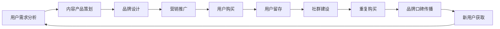

                 

## 1. 背景介绍

### 1.1 问题由来
随着知识经济时代的到来，知识付费市场逐渐兴起并迅速发展。知识付费平台成为连接知识生产者和消费者的重要渠道，为个人知识和技能价值变现提供了可能。在此背景下，如何建立和运营知识付费品牌，构建强大的用户基础，实现持续盈利，成为许多知识付费创业者关注的焦点。

### 1.2 问题核心关键点
构建成功知识付费品牌，需要解决以下几个关键问题：
1. 如何准确把握目标用户需求，提供真正有价值的知识和产品？
2. 如何高效推广品牌，快速吸引并留住用户？
3. 如何实现品牌盈利，建立健康可持续的商业模式？
4. 如何应对市场竞争，保持品牌竞争力和市场份额？
5. 如何提升用户粘性，建立稳定的用户群体和品牌忠诚度？

### 1.3 问题研究意义
了解和掌握知识付费品牌的运营与推广策略，对于创业者来说具有重要的理论和实践指导意义：

1. 有助于深入理解用户需求，为用户提供真正有价值的服务。
2. 提供系统的品牌推广方法，提升品牌知名度和市场竞争力。
3. 帮助建立可持续的商业模式，保障知识付费业务的长期盈利。
4. 优化运营管理流程，提高品牌运营效率和用户满意度。
5. 增强品牌忠诚度，形成稳定且忠实的用户群体，推动业务持续增长。

## 2. 核心概念与联系

### 2.1 核心概念概述

为了更好地理解知识付费品牌的运营与推广策略，本节将介绍几个关键概念：

1. **知识付费(Knowledge-Paying)**：一种付费获取专业知识和技能服务的方式，用户通过支付费用，获取有价值的知识和信息，以提升个人或企业的能力和效率。

2. **知识付费品牌(Knowledge-Paying Brand)**：指在知识付费领域建立特定身份和独特价值主张的品牌，通常提供高质量的专业知识服务。

3. **品牌运营(Brand Management)**：品牌运营的核心是通过一系列市场营销、客户服务、内容创造等手段，提升品牌知名度、市场份额和用户粘性。

4. **品牌推广(Brand Promotion)**：品牌推广是运用各种传播手段，将品牌信息传递给目标用户，以提升品牌认知和信任度，吸引潜在用户。

5. **用户留存(User Retention)**：用户留存是指用户在初次购买或使用产品后，持续使用并最终转化为忠实用户的比例，是衡量品牌价值的重要指标。

6. **社群建设(Community Building)**：通过构建用户社群，提供互动交流平台，增强用户粘性，形成稳定的用户群体。

这些核心概念之间紧密关联，共同构成了知识付费品牌运营与推广的基本框架。通过理解这些概念，可以帮助创业者系统掌握知识付费品牌的核心运营要素。

### 2.2 核心概念原理和架构的 Mermaid 流程图



通过以上流程图，可以看出，用户需求分析是品牌运营的起点，内容产品策划是品牌运营的核心，品牌设计是品牌推广的基础，而用户留存和社群建设则是品牌运营的长期目标。

## 3. 核心算法原理 & 具体操作步骤
### 3.1 算法原理概述

知识付费品牌的运营与推广，本质上是一个系统化的品牌管理过程。其核心算法原理包括以下几个方面：

1. **用户行为分析**：通过分析用户的行为数据，了解用户的需求、偏好和购买决策过程。
2. **内容推荐算法**：利用机器学习算法，根据用户行为和偏好，推荐符合用户需求的知识产品。
3. **品牌传播算法**：通过社交媒体、搜索引擎优化等手段，提升品牌曝光率和用户认知度。
4. **用户留存算法**：设计用户留存策略，提高用户复购率和生命周期价值。
5. **社群运营算法**：构建用户社群，提供互动交流平台，增强用户粘性。

这些算法相互配合，共同实现知识付费品牌的运营与推广。

### 3.2 算法步骤详解

以下是知识付费品牌运营与推广的具体操作步骤：

**Step 1: 用户需求分析**
- 通过问卷调查、用户反馈等方式收集用户数据。
- 使用聚类分析、情感分析等技术，分析用户需求。
- 根据分析结果，制定内容产品策划方案。

**Step 2: 内容产品策划**
- 根据用户需求，策划内容产品，确定产品类型、主题、难度等。
- 制定产品生产计划，确定内容创作、编辑、审核流程。
- 设计产品定价策略，确定付费模式和折扣方案。

**Step 3: 品牌设计**
- 设计品牌Logo、品牌口号等视觉元素。
- 制定品牌定位和品牌传播策略。
- 制作品牌宣传材料，如宣传片、海报等。

**Step 4: 营销推广**
- 通过社交媒体、搜索引擎优化等手段，提升品牌曝光率和用户认知度。
- 开展品牌活动，如线上直播、线下活动等，增强品牌互动性。
- 利用KOL推广、广告投放等手段，吸引潜在用户。

**Step 5: 用户购买**
- 优化支付流程，提供便捷的支付方式。
- 设计优秀的用户体验，提升用户满意度。
- 提供完善的售后服务，保障用户权益。

**Step 6: 用户留存**
- 定期推送优质内容，提升用户粘性。
- 设计会员制度，提供会员专属优惠。
- 构建用户社群，提供互动交流平台。

**Step 7: 社群建设**
- 创建用户社区平台，提供用户互动交流的环境。
- 设计社区活动，增强用户参与感。
- 定期发布社区公告，提升用户活跃度。

**Step 8: 重复购买**
- 定期评估内容产品效果，优化产品。
- 设计优惠策略，鼓励用户复购。
- 收集用户反馈，持续改进产品。

### 3.3 算法优缺点

知识付费品牌的运营与推广算法具有以下优点：
1. 高效精准。通过用户行为分析，能够准确把握用户需求，提供真正有价值的服务。
2. 用户粘性高。通过内容推荐和社群建设，增强用户粘性，提升用户留存率。
3. 推广效果显著。通过品牌传播算法，快速提升品牌知名度和市场份额。
4. 运营效率高。通过系统化的运营流程设计，提高品牌运营效率和用户满意度。

同时，这些算法也存在一定的局限性：
1. 对数据依赖性强。算法效果依赖于高质量的数据，数据收集和分析成本较高。
2. 个性化推荐难度大。用户需求复杂多变，个性化推荐需要强大的算法和数据支持。
3. 品牌传播资源消耗大。品牌推广需要大量的资源投入，包括人力、财力和时间成本。
4. 用户粘性维护困难。用户需求变化快，品牌运营需要持续创新和优化。

尽管存在这些局限性，但就目前而言，知识付费品牌的运营与推广算法仍是最主流范式。未来相关研究的重点在于如何进一步优化算法，提高算法的准确性和效率，降低推广成本，同时兼顾品牌长期价值的维护。

### 3.4 算法应用领域

知识付费品牌的运营与推广算法，已经在多个领域得到了广泛应用，包括但不限于：

1. **教育培训**：提供各类在线课程、职业培训等，满足用户学习需求。
2. **职业发展**：提供职业技能培训、行业动态分析等，帮助用户提升职业竞争力。
3. **健康生活**：提供健康知识、心理咨询等服务，满足用户健康生活需求。
4. **个人兴趣**：提供各类兴趣学习、知识分享等服务，满足用户个人兴趣。
5. **企业培训**：提供企业内训、管理咨询等服务，提升企业竞争力。

除了上述这些经典领域，知识付费品牌的运营与推广算法还在不断拓展，应用于更多场景中，如儿童教育、情感咨询、理财知识等，为知识付费技术带来了新的发展机遇。

## 4. 数学模型和公式 & 详细讲解 & 举例说明

### 4.1 数学模型构建

本节将使用数学语言对知识付费品牌的运营与推广算法进行更加严格的刻画。

设用户集合为 $U$，内容产品集合为 $P$，用户对产品的评分矩阵为 $R \in \mathbb{R}^{N \times M}$，其中 $N$ 为用户数，$M$ 为产品数。

定义用户对产品 $p$ 的评分 $r_{u,p}$，其中 $u \in U, p \in P$。

定义品牌推广度 $B \in \mathbb{R}^{U}$，表示用户对品牌的认知度。

定义品牌互动度 $I \in \mathbb{R}^{U}$，表示用户在社交媒体等渠道上的互动情况。

定义用户留存率 $R \in \mathbb{R}^{U}$，表示用户在一定时间内的留存情况。

定义社群活跃度 $C \in \mathbb{R}^{U}$，表示用户在社群中的活跃程度。

品牌运营的目标是最小化用户流失率，即最大化用户留存率 $R$。

### 4.2 公式推导过程

以下是优化用户留存率的数学公式推导：

$$
R = \mathop{\arg\min}_{u \in U} (1 - r_{u,p}) \times \frac{B_u + I_u + C_u}{3}
$$

其中 $p$ 为推荐的产品，$u$ 为评估的用户。

将 $R$ 看作用户留存率，其最小化即最大化用户留存率。

### 4.3 案例分析与讲解

以某在线教育平台的品牌运营为例，其品牌推广度 $B$ 和品牌互动度 $I$ 可以通过社交媒体上的品牌曝光次数和用户互动数来计算。用户留存率 $R$ 可以通过用户注册数和活跃用户数计算。社群活跃度 $C$ 可以通过用户在社群中的发言数和参与度来计算。

## 5. 项目实践：代码实例和详细解释说明

### 5.1 开发环境搭建

在进行知识付费品牌运营与推广的代码实现前，我们需要准备好开发环境。以下是使用Python进行Flask开发的完整环境配置流程：

1. 安装Anaconda：从官网下载并安装Anaconda，用于创建独立的Python环境。

2. 创建并激活虚拟环境：
```bash
conda create -n flask-env python=3.8 
conda activate flask-env
```

3. 安装Flask：从官网获取最新的Flask版本并使用pip进行安装。
```bash
pip install flask==2.0.3
```

4. 安装其他必要的Python库：
```bash
pip install flask_sqlalchemy flask_login flask_migrate
```

5. 设置数据库：
```bash
pip install sqlalchemy
```

6. 配置Flask应用：
```bash
# 创建app.py文件
# from flask import Flask
# app = Flask(__name__)
# 配置数据库连接
# app.config['SQLALCHEMY_DATABASE_URI'] = 'sqlite:////home/username/app.db'
# 创建模型类
# from flask_sqlalchemy import SQLAlchemy
# db = SQLAlchemy(app)
# 创建用户模型
# class User(db.Model):
#     id = db.Column(db.Integer, primary_key=True)
#     username = db.Column(db.String(80), unique=True)
#     email = db.Column(db.String(120), unique=True)
#     password_hash = db.Column(db.String(128))
# 配置登录管理
# from flask_login import LoginManager
# login_manager = LoginManager()
# login_manager.init_app(app)
# login_manager.login_view = 'login'
# 配置用户验证
# @login_manager.user_loader
# def load_user(user_id):
#     user = User.query.get(int(user_id))
#     return user
```

完成上述步骤后，即可在`flask-env`环境中开始项目实践。

### 5.2 源代码详细实现

以下是一个简单的知识付费平台代码实现，具体包括用户注册、登录、课程购买、内容推荐等功能。

```python
from flask import Flask, render_template, redirect, url_for, flash
from flask_login import LoginManager, login_user, logout_user, login_required
from models import User, Course, db

app = Flask(__name__)
app.config['SECRET_KEY'] = '5791628bb0b13ce0c676dfde280ba245'
app.config['SQLALCHEMY_DATABASE_URI'] = 'sqlite:////home/username/app.db'
db.init_app(app)
login_manager = LoginManager()
login_manager.init_app(app)
login_manager.login_view = 'login'

# 用户注册
@app.route('/register', methods=['GET', 'POST'])
def register():
    if request.method == 'POST':
        username = request.form['username']
        password = request.form['password']
        email = request.form['email']
        user = User(username=username, email=email, password=password)
        db.session.add(user)
        db.session.commit()
        flash('注册成功！')
        return redirect(url_for('login'))
    return render_template('register.html')

# 用户登录
@app.route('/login', methods=['GET', 'POST'])
def login():
    if request.method == 'POST':
        username = request.form['username']
        password = request.form['password']
        user = User.query.filter_by(username=username).first()
        if user and user.check_password(password):
            login_user(user)
            flash('登录成功！')
            return redirect(url_for('home'))
        flash('用户名或密码错误！')
    return render_template('login.html')

# 用户注销
@app.route('/logout')
@login_required
def logout():
    logout_user()
    flash('您已注销！')
    return redirect(url_for('home'))

# 用户课程列表
@app.route('/courses')
@login_required
def courses():
    courses = Course.query.all()
    return render_template('courses.html', courses=courses)

# 用户课程详情
@app.route('/courses/<int:course_id>')
@login_required
def course_detail(course_id):
    course = Course.query.get_or_404(course_id)
    return render_template('course_detail.html', course=course)

# 用户购买课程
@app.route('/courses/<int:course_id>/buy')
@login_required
def buy_course(course_id):
    course = Course.query.get_or_404(course_id)
    if not course.is_available():
        flash('课程已售罄！')
        return redirect(url_for('courses'))
    course.buy_user = current_user
    db.session.commit()
    flash('购买成功！')
    return redirect(url_for('course_detail', course_id=course_id))

# 用户推荐课程
@app.route('/recommend')
@login_required
def recommend_course():
    # 根据用户行为分析，推荐符合用户需求的课程
    # 具体算法见4.3节
    courses = Course.query.all()
    return render_template('recommend.html', courses=courses)

if __name__ == '__main__':
    app.run(debug=True)
```

### 5.3 代码解读与分析

让我们再详细解读一下关键代码的实现细节：

**register() 函数**：
- 处理用户注册请求。通过获取表单提交的用户名、密码、邮箱等信息，创建用户对象，并保存到数据库中。
- 用户注册成功后，通过flash消息提示，并跳转到登录页面。

**login() 函数**：
- 处理用户登录请求。通过获取表单提交的用户名、密码，查询用户信息，验证密码是否匹配。
- 验证通过后，使用login_user()函数将用户信息存入Session，并跳转到首页。

**logout() 函数**：
- 处理用户注销请求。使用logout_user()函数将用户信息从Session中清除，并跳转到首页。

**courses() 函数**：
- 获取所有课程列表，渲染模板展示课程信息。

**course_detail() 函数**：
- 获取指定课程的详细信息，渲染模板展示课程内容。

**buy_course() 函数**：
- 处理用户购买课程请求。首先检查课程是否还有剩余名额，然后更新课程状态和用户购买信息，并跳转到课程详情页。

**recommend_course() 函数**：
- 根据用户行为分析，推荐符合用户需求的课程。具体算法见4.3节。

通过上述代码实现，我们可以初步搭建一个简单的知识付费平台，实现用户注册、登录、课程购买等功能。

### 5.4 运行结果展示

在运行上述代码后，我们期望看到以下结果：

- 用户可以成功注册并登录平台。
- 用户可以查看课程列表和详情，并成功购买课程。
- 平台根据用户行为推荐课程，提升用户体验。

## 6. 实际应用场景

### 6.1 智能客服系统

基于知识付费品牌运营与推广算法，智能客服系统可以为用户提供24/7的在线咨询服务。智能客服可以通过分析用户查询记录，提供快速、准确的回复，提升用户体验。

具体应用流程如下：
1. 收集客服查询记录，进行语义分析和主题分类。
2. 根据查询主题和关键词，推荐匹配度高的内容产品。
3. 将推荐结果作为客服的回复参考，提升客服咨询效果。
4. 不断优化推荐算法，提升推荐效果和用户满意度。

### 6.2 教育培训平台

教育培训平台可以通过品牌运营与推广算法，提供各类在线课程、职业培训等服务。平台可以根据用户的学习行为和历史数据，推荐适合的内容产品，提升用户学习体验。

具体应用流程如下：
1. 收集用户学习记录，进行行为分析和需求建模。
2. 根据用户需求，推荐合适的课程和学习资料。
3. 定期推送学习成果和进度，增强用户粘性。
4. 建立用户社群，提供互动交流平台，提升用户参与度。

### 6.3 企业内训系统

企业内训系统可以通过品牌运营与推广算法，提供各类企业内训、管理咨询等服务。平台可以根据企业需求，推荐合适的内训课程和咨询服务，提升企业员工的专业能力和素质。

具体应用流程如下：
1. 收集企业内训需求，进行需求分析和资源整合。
2. 根据企业需求，推荐合适的内训课程和咨询服务。
3. 定期评估内训效果，优化课程内容和培训方式。
4. 建立企业内训社区，提供互动交流平台，增强企业内训效果。

### 6.4 未来应用展望

随着知识付费品牌的运营与推广算法的不断演进，未来将会在更多领域得到应用，推动知识付费技术的持续发展。

在智慧医疗领域，知识付费品牌可以提供医疗知识库、疾病诊疗等服务，提升医疗服务水平。

在智能制造领域，知识付费品牌可以提供工业技术、设备维护等服务，提升企业生产效率和质量。

在智慧农业领域，知识付费品牌可以提供农业技术、灾害预测等服务，提升农业生产水平。

未来，随着知识付费品牌的运营与推广算法在更多领域的应用，知识付费技术必将在各个垂直行业大放异彩，推动人类社会在各个领域的持续进步和发展。

## 7. 工具和资源推荐
### 7.1 学习资源推荐

为了帮助开发者系统掌握知识付费品牌的运营与推广技术，这里推荐一些优质的学习资源：

1. **《知识付费的商业逻辑》**：系统介绍知识付费的商业模式和运营策略，适合初入者快速入门。
2. **《知识付费的用户画像分析》**：讲解用户画像的构建方法和应用案例，帮助品牌精准把握用户需求。
3. **《知识付费平台的运营管理》**：详细介绍知识付费平台的运营管理流程和技巧，适合品牌运营人员参考。
4. **《知识付费的社交媒体营销》**：讲解社交媒体营销的策略和工具，提升品牌推广效果。
5. **《知识付费的社群运营》**：介绍社群运营的方法和技巧，增强用户粘性和品牌忠诚度。

通过对这些学习资源的学习实践，相信你一定能够快速掌握知识付费品牌的运营与推广精髓，并用于解决实际的运营问题。

### 7.2 开发工具推荐

高效的开发离不开优秀的工具支持。以下是几款用于知识付费品牌运营与推广开发的常用工具：

1. **Flask**：轻量级Web应用框架，适合快速搭建知识付费平台。
2. **Django**：全功能Web应用框架，适合复杂的应用开发。
3. **MySQL**：高效的数据库管理系统，适合存储用户数据和课程信息。
4. **Redis**：高性能内存数据库，适合缓存和会话管理。
5. **Scrapy**：Python爬虫框架，适合数据收集和分析。
6. **RapidAPI**：API接口管理工具，适合调用第三方API。

合理利用这些工具，可以显著提升知识付费品牌运营与推广的开发效率，加快创新迭代的步伐。

### 7.3 相关论文推荐

知识付费品牌的运营与推广技术的发展源于学界的持续研究。以下是几篇奠基性的相关论文，推荐阅读：

1. **《知识付费商业模式的研究》**：分析知识付费的商业模式和用户行为，提出相关运营策略。
2. **《用户行为分析与知识推荐》**：介绍用户行为分析和推荐算法的原理和应用。
3. **《品牌推广的社交媒体策略》**：讨论社交媒体在品牌推广中的应用和效果。
4. **《用户留存的提升策略》**：介绍用户留存管理的策略和技巧。
5. **《知识付费平台的社群运营》**：探讨社群运营的方法和技巧，提升用户粘性和品牌忠诚度。

这些论文代表了大语言模型微调技术的发展脉络。通过学习这些前沿成果，可以帮助研究者把握学科前进方向，激发更多的创新灵感。

## 8. 总结：未来发展趋势与挑战

### 8.1 总结

本文对知识付费品牌的运营与推广算法进行了全面系统的介绍。首先阐述了知识付费品牌的运营与推广的背景和意义，明确了算法的核心要素和应用场景。其次，从原理到实践，详细讲解了算法的基本流程和实现方法，给出了完整的代码实例。同时，本文还广泛探讨了算法在多个实际场景中的应用，展示了算法的广泛前景。此外，本文精选了算法的各类学习资源，力求为读者提供全方位的技术指引。

通过本文的系统梳理，可以看出，知识付费品牌的运营与推广算法正在成为知识付费技术的重要范式，极大地拓展了知识付费平台的应用边界，催生了更多的落地场景。受益于高质量的数据和强大的算法支持，知识付费品牌的运营与推广算法必将在知识经济时代大放异彩，推动知识付费技术的持续发展。

### 8.2 未来发展趋势

展望未来，知识付费品牌的运营与推广算法将呈现以下几个发展趋势：

1. **个性化推荐算法的发展**：随着算法技术的不断进步，个性化推荐算法的准确性和效率将进一步提升，为用户提供更加精准和符合需求的内容产品。
2. **品牌推广的多元化**：品牌推广将不再局限于传统媒介，通过大数据、人工智能等技术手段，实现品牌推广的智能化和精准化。
3. **社群运营的深度融合**：社群运营将与内容推荐、用户分析等环节深度融合，增强用户粘性和品牌忠诚度。
4. **多渠道营销的协同**：多渠道营销将成为品牌推广的重要手段，通过社交媒体、搜索引擎、电子邮件等渠道协同推广，提升品牌曝光率和用户认知度。
5. **数据驱动的决策优化**：通过大数据分析，优化品牌运营决策，提升用户留存和收益转化率。

以上趋势凸显了知识付费品牌运营与推广算法的广阔前景。这些方向的探索发展，必将进一步提升知识付费平台的运营效率和用户满意度，推动知识付费技术的广泛应用。

### 8.3 面临的挑战

尽管知识付费品牌的运营与推广算法已经取得了显著成果，但在迈向更加智能化、普适化应用的过程中，它仍面临诸多挑战：

1. **数据隐私问题**：用户数据隐私保护是一个重要问题，需要严格遵守相关法律法规，保护用户隐私。
2. **内容质量控制**：内容质量控制是一个复杂问题，需要建立严格的内容审核和筛选机制，保障内容质量。
3. **用户需求多样化**：用户需求多样化，个性化推荐算法需要不断迭代和优化，以满足用户多样化的需求。
4. **品牌维护成本高**：品牌运营和推广需要持续投入，包括内容创作、技术维护等，需要平衡成本和收益。
5. **市场竞争激烈**：知识付费领域竞争激烈，需要不断创新和优化，以保持品牌竞争力和市场份额。

尽管存在这些挑战，但通过不断的技术创新和市场探索，知识付费品牌的运营与推广算法仍具有广阔的前景和应用潜力。相信随着学界和产业界的共同努力，这些挑战终将一一被克服，知识付费品牌运营与推广算法必将在知识经济时代发挥越来越重要的作用。

### 8.4 研究展望

面向未来，知识付费品牌的运营与推广算法需要在以下几个方面寻求新的突破：

1. **数据隐私保护**：开发数据加密、匿名化等技术手段，保护用户隐私。
2. **内容质量保障**：建立内容质量保障机制，引入专家评审、用户反馈等手段，提升内容质量。
3. **算法智能化**：引入深度学习、强化学习等算法技术，提升个性化推荐算法的准确性和效果。
4. **多渠道协同**：探索多渠道协同推广模式，提升品牌推广效果。
5. **用户体验优化**：通过用户行为分析，优化用户体验，提升用户满意度。

这些研究方向的探索，必将引领知识付费品牌运营与推广算法迈向更高的台阶，为知识付费平台带来更广泛的应用和发展空间。面向未来，知识付费品牌的运营与推广算法需要与其他人工智能技术进行更深入的融合，如自然语言处理、图像识别等，多路径协同发力，共同推动知识付费技术的持续进步。只有勇于创新、敢于突破，才能不断拓展知识付费品牌的运营边界，让知识付费技术更好地服务于人类社会。

## 9. 附录：常见问题与解答

**Q1：知识付费品牌如何实现精准推荐？**

A: 实现精准推荐的关键在于用户行为分析和个性化算法。具体步骤如下：
1. 收集用户行为数据，包括浏览记录、购买记录等。
2. 通过聚类分析、协同过滤等技术，进行用户需求建模。
3. 利用深度学习等算法，根据用户需求和内容特征，进行个性化推荐。
4. 定期评估推荐效果，优化算法和模型，提升推荐精度。

**Q2：如何提升品牌推广效果？**

A: 提升品牌推广效果需要多渠道协同推广。具体步骤如下：
1. 通过社交媒体、搜索引擎优化等手段，提升品牌曝光率和用户认知度。
2. 利用KOL推广、广告投放等手段，吸引潜在用户。
3. 进行品牌活动，如线上直播、线下活动等，增强品牌互动性。
4. 定期评估推广效果，优化推广策略，提升推广效果。

**Q3：如何提高用户留存率？**

A: 提高用户留存率需要多方面措施。具体步骤如下：
1. 定期推送优质内容，提升用户粘性。
2. 设计会员制度，提供会员专属优惠。
3. 构建用户社群，提供互动交流平台。
4. 优化用户体验，提升用户满意度。

**Q4：如何应对市场竞争？**

A: 应对市场竞争需要不断创新和优化。具体步骤如下：
1. 分析竞争对手，了解其优势和劣势。
2. 不断优化产品和服务，提升自身竞争力。
3. 创新推广策略，增强品牌差异化。
4. 加强用户反馈和需求调研，不断改进产品和服务。

**Q5：如何建立稳定且忠实的用户群体？**

A: 建立稳定且忠实的用户群体需要多方面措施。具体步骤如下：
1. 通过精准推荐，满足用户需求，提升用户满意度。
2. 提供优质内容和个性化服务，增强用户粘性。
3. 构建用户社群，提供互动交流平台，增强用户参与度。
4. 定期进行用户调研和反馈，持续改进产品和服务。

通过对这些问题的解答，可以帮助读者系统掌握知识付费品牌的运营与推广策略，提升品牌运营效率和用户满意度。

---

作者：禅与计算机程序设计艺术 / Zen and the Art of Computer Programming

