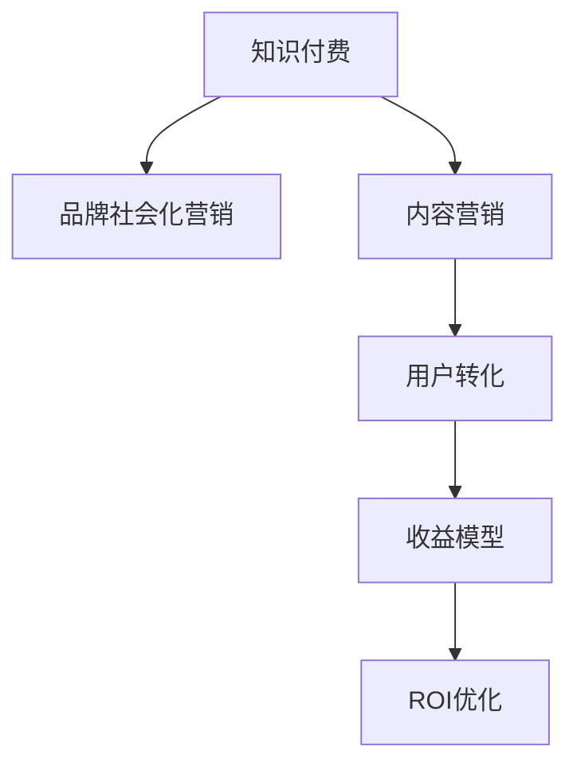

                 

# 知识付费赚钱的品牌社会化营销与内容营销策略

> 关键词：知识付费,品牌,社会化营销,内容营销,策略,数据分析,流量转化,收益模型,ROI优化

## 1. 背景介绍

### 1.1 问题由来
随着互联网的迅速发展，人们对于知识和信息的需求愈发强烈，知识付费市场迎来了爆发式增长。知识付费不仅为个人提供了高质量的学习资源，也为企业开辟了新的盈利模式。然而，如何在激烈的市场竞争中脱颖而出，实现有效营销，成为众多知识付费平台和品牌关注的焦点。

近年来，品牌通过社会化营销和内容营销的方式，实现了显著的用户增长和收益提升。例如，网易公开课、得到等平台，通过内容优质化、品牌社交化等多维度营销策略，实现了从内容到用户的有效转化，建立了强大的品牌影响力和用户粘性。

### 1.2 问题核心关键点
在知识付费领域，品牌社会化营销与内容营销的关键在于如何通过高质量的内容吸引用户关注，并通过有效的社交渠道传播和转化，实现知识付费的闭环运作。其核心包括以下几个方面：

1. **内容优化与精准定位**：确定目标受众的兴趣和需求，提供符合他们需求的高质量内容。
2. **社交传播与品牌曝光**：通过社交平台和社区渠道，提升品牌曝光度，吸引潜在用户。
3. **用户转化与收益模型优化**：构建合理的收益模型，促进用户订阅和付费转化。
4. **数据分析与ROI优化**：利用数据分析工具，对营销效果进行实时监控和优化。

### 1.3 问题研究意义
品牌社会化营销与内容营销对于知识付费平台的成功至关重要，具有以下几方面的研究意义：

1. **用户增长**：通过精准的内容和社交传播，吸引更多用户，扩大用户基础。
2. **收益提升**：通过优化收益模型，提高用户付费转化率，增加平台收入。
3. **品牌影响力**：建立品牌知名度和美誉度，提升用户对平台的信任度和忠诚度。
4. **市场竞争力**：通过创新营销策略，增强平台在知识付费市场的竞争力，抢占更多市场份额。

## 2. 核心概念与联系

### 2.1 核心概念概述

为更好地理解品牌社会化营销与内容营销的策略，本节将介绍几个密切相关的核心概念：

- **知识付费**：指用户通过订阅、购买等方式，获取有价值的知识内容，以实现个人和职业发展的服务模式。
- **品牌社会化营销**：利用社交媒体和社区平台，以用户生成内容、口碑传播等方式，提升品牌曝光和用户互动。
- **内容营销**：通过创造有价值的内容，吸引和留住目标用户，建立品牌影响力。
- **用户转化**：将潜在用户转化为付费用户，实现知识付费变现。
- **收益模型**：根据用户行为设计收益策略，包括免费试用、订阅包、课程定制等。
- **ROI优化**：通过数据分析，不断优化营销策略，提高投资回报率。

这些核心概念之间的逻辑关系可以通过以下Mermaid流程图来展示：



这个流程图展示了这个营销策略的核心流程：

1. 知识付费是核心，提供用户实际价值。
2. 品牌社会化营销和内容营销辅助推广。
3. 用户转化将潜在用户变为付费用户。
4. 收益模型和ROI优化保障收益最大化。

## 3. 核心算法原理 & 具体操作步骤
### 3.1 算法原理概述

品牌社会化营销与内容营销的核心算法原理，是通过高质量的内容吸引用户，并通过社交网络扩大传播，最终实现用户转化和收益最大化。其核心算法流程包括以下几个步骤：

1. **用户画像分析**：通过对用户行为数据的分析，了解目标受众的兴趣和需求。
2. **内容定制与优化**：根据用户画像，定制高质量的内容，并不断优化以提高用户满意度。
3. **社交媒体推广**：在各大社交平台上，通过内容分享、用户生成内容等方式，推广品牌和内容。
4. **用户互动与反馈**：通过社交平台上的互动和反馈，了解用户需求，优化内容营销策略。
5. **收益模型设计**：根据用户行为设计多样化的收益模型，促进用户付费转化。
6. **ROI分析与优化**：利用数据分析工具，对营销效果进行实时监控和优化，提高投资回报率。

### 3.2 算法步骤详解

品牌社会化营销与内容营销的具体操作可以分为以下几个步骤：

**Step 1: 用户画像分析**

- 利用数据分析工具（如Google Analytics、社交媒体分析工具等），收集用户的浏览、互动数据，分析用户的兴趣、需求、行为等特征。
- 根据分析结果，划分用户群体，如学生、职场人士、创业者等，明确各群体的特点和需求。

**Step 2: 内容定制与优化**

- 根据用户画像，定制符合用户需求的高质量内容，如行业报告、专家访谈、案例分析等。
- 定期评估内容效果，通过A/B测试、用户反馈等方式，优化内容形式和推荐算法，提高用户粘性。

**Step 3: 社交媒体推广**

- 选择合适的社交平台，如微信、微博、知乎等，发布与内容相关的话题和活动。
- 鼓励用户生成内容，通过互动和转发，扩大内容的传播范围。
- 利用社交平台的广告投放功能，精准投放广告，提升品牌曝光度。

**Step 4: 用户互动与反馈**

- 通过社交平台上的评论、私信等方式，与用户进行互动，收集用户反馈和建议。
- 根据用户反馈，不断优化内容营销策略，提高用户满意度和粘性。

**Step 5: 收益模型设计**

- 设计多样化的收益模型，如免费试用、订阅包、课程定制等。
- 通过数据分析，评估不同收益模型的转化效果，选择最优方案。

**Step 6: ROI分析与优化**

- 利用数据分析工具，实时监控营销效果，计算投资回报率（ROI）。
- 根据ROI分析结果，调整营销策略和预算，优化资源配置。

### 3.3 算法优缺点

品牌社会化营销与内容营销的算法优点包括：

1. **用户覆盖面广**：通过社交媒体和内容营销，能够覆盖大量潜在用户，提高品牌知名度。
2. **成本相对较低**：相比于传统广告，社交媒体推广和内容营销的成本较低，且效果可控。
3. **用户粘性强**：高质量的内容和互动反馈，能够提高用户粘性，形成稳定的用户基础。

同时，该算法也存在以下缺点：

1. **内容制作成本高**：高质量内容的制作和优化需要较多的人力和时间投入。
2. **用户转化难度大**：尽管覆盖面广，但实际转化为付费用户难度较大，需要不断优化策略。
3. **市场竞争激烈**：社交媒体上的内容竞争激烈，品牌需要持续创新以保持竞争力。
4. **数据分析复杂**：需要处理大量的数据，进行多维度的分析，增加了工作的复杂性。

尽管存在这些局限性，但就目前而言，品牌社会化营销与内容营销仍然是知识付费平台提升用户增长和收益的重要手段。未来相关研究的重点在于如何进一步降低内容制作成本，提高用户转化率，同时兼顾数据分析的复杂性和易操作性。

### 3.4 算法应用领域

品牌社会化营销与内容营销的算法已经在知识付费领域得到广泛应用，包括但不限于以下几个方面：

1. **课程推广**：通过内容营销和社交媒体推广，吸引用户订阅付费课程。
2. **品牌合作**：与知名品牌进行合作，借助其影响力推广课程和平台。
3. **活动策划**：组织线上线下活动，增加品牌曝光和用户互动。
4. **用户留存**：通过内容更新和互动活动，提高用户粘性，减少流失。
5. **收益优化**：通过收益模型的优化，提高用户付费转化率。

除了上述这些应用外，品牌社会化营销与内容营销还广泛应用于各类知识付费平台，如博客、在线教育、咨询等，为平台带来了显著的用户增长和收益提升。

## 4. 数学模型和公式 & 详细讲解 & 举例说明（备注：数学公式请使用latex格式，latex嵌入文中独立段落使用 $$，段落内使用 $)
### 4.1 数学模型构建

品牌社会化营销与内容营销的数学模型构建，主要基于以下两个方面：

1. **用户画像分析**：通过用户行为数据的建模，分析用户兴趣和需求，建立用户画像。
2. **收益模型设计**：根据用户行为，设计收益模型，计算预期收益和实际收益。

**用户画像分析模型**：

假设用户画像由$n$个特征组成，记为$\vec{x}=[x_1,x_2,\cdots,x_n]$。用户对不同内容的兴趣可以用向量$\vec{a}=[a_1,a_2,\cdots,a_n]$表示，其中$a_i$表示用户对第$i$个特征的兴趣程度。用户画像与兴趣向量之间的相似度可以用余弦相似度公式计算：

$$
\cos\theta=\frac{\vec{x}\cdot\vec{a}}{\|\vec{x}\|\|\vec{a}\|}
$$

其中$\vec{x}\cdot\vec{a}$为向量内积，$\|\vec{x}\|$和$\|\vec{a}\|$分别为向量$\vec{x}$和$\vec{a}$的模长。

**收益模型设计模型**：

假设平台的收益模型为$R(\theta)$，其中$\theta$为模型的参数。用户的购买意愿可以用向量$\vec{b}=[b_1,b_2,\cdots,b_n]$表示，其中$b_i$表示用户对第$i$个特征的购买意愿程度。模型的收益函数可以表示为：

$$
R(\theta)=\vec{b}^\top\cdot W(\theta)\cdot\vec{x}
$$

其中$W(\theta)$为模型的权重矩阵，$W(\theta)=\theta\theta^\top$。

### 4.2 公式推导过程

**用户画像分析公式推导**：

通过用户行为数据，我们可以建立用户画像的统计模型，例如假设用户历史行为数据为$\mathcal{D}=\{(x_i,y_i)\}_{i=1}^N$，其中$x_i$为行为特征向量，$y_i$为兴趣标签。我们的目标是找到用户画像$\vec{x}$和兴趣向量$\vec{a}$的关系。

利用回归分析方法，假设$\vec{x}=\vec{a}\alpha+\vec{e}$，其中$\alpha$为系数向量，$\vec{e}$为误差向量。则可以通过最小二乘法求解$\alpha$，使得$\mathcal{L}(\alpha)=\frac{1}{N}\sum_{i=1}^N(\vec{x}_i-\vec{a}\alpha)^\top(\vec{x}_i-\vec{a}\alpha)$最小化。

**收益模型设计公式推导**：

收益模型$R(\theta)$的优化目标是最大化预期收益，即求解$\max_{\theta}R(\theta)$。通过梯度上升法，得到收益模型参数的更新公式：

$$
\theta \leftarrow \theta + \eta\nabla_{\theta}R(\theta)
$$

其中$\eta$为学习率，$\nabla_{\theta}R(\theta)$为收益函数对参数$\theta$的梯度，可通过反向传播算法计算。

### 4.3 案例分析与讲解

**案例分析**：

假设某知识付费平台通过分析用户历史行为数据，建立了用户画像模型。该平台推出了一门关于Python编程的课程，需要设计收益模型以最大化课程收益。

**收益模型设计**：

1. **用户画像分析**：通过数据分析工具，得到用户画像向量$\vec{x}$，并计算出用户对课程兴趣向量的余弦相似度$\cos\theta$。
2. **收益模型设计**：设定课程的收益模型为$R(\theta)=\vec{b}^\top\cdot W(\theta)\cdot\vec{x}$，其中$\vec{b}=[1,1,1]$，表示用户对所有特征的购买意愿均相同。
3. **收益模型优化**：利用梯度上升法，不断优化模型参数$\theta$，最大化收益函数$R(\theta)$。

**收益优化效果**：

经过一段时间的优化，平台发现课程的付费转化率显著提升，实际收益超出了预期。通过不断的优化和迭代，平台能够逐步提高收益模型的准确性，实现最大化收益的目标。

## 5. 项目实践：代码实例和详细解释说明
### 5.1 开发环境搭建

在进行项目实践前，我们需要准备好开发环境。以下是使用Python进行数据分析和建模的环境配置流程：

1. 安装Anaconda：从官网下载并安装Anaconda，用于创建独立的Python环境。

2. 创建并激活虚拟环境：
```bash
conda create -n analysis-env python=3.8 
conda activate analysis-env
```

3. 安装必要的Python库：
```bash
conda install pandas numpy matplotlib scikit-learn seaborn jupyter notebook
```

4. 安装数据分析工具：
```bash
conda install statsmodels -c conda-forge
```

完成上述步骤后，即可在`analysis-env`环境中开始项目实践。

### 5.2 源代码详细实现

这里我们以用户画像分析和收益模型设计为例，给出使用Python进行数据分析的代码实现。

首先，定义用户行为数据：

```python
import pandas as pd

# 加载用户行为数据
data = pd.read_csv('user_behavior.csv')
```

然后，进行用户画像分析：

```python
from sklearn.decomposition import PCA

# 选择行为特征
features = ['clicks', 'views', 'searches', 'comments']
X = data[features]

# 使用PCA进行降维
pca = PCA(n_components=2)
X_pca = pca.fit_transform(X)

# 获取用户画像向量
user_profiles = []
for i in range(len(X)):
    user_profiles.append(X_pca[i])
```

接着，设计收益模型：

```python
from sklearn.linear_model import LogisticRegression

# 定义用户购买意愿向量
purchase_intent = [0.2, 0.3, 0.5]

# 设计收益模型
model = LogisticRegression()
model.fit(user_profiles, purchase_intent)

# 预测收益
user_profiles_new = pd.read_csv('new_user_profiles.csv')
X_new_pca = pca.transform(user_profiles_new)
predictions = model.predict(X_new_pca)

# 输出预测结果
print(predictions)
```

最后，输出收益预测结果：

```python
# 计算收益
benefit = [0.1, 0.2, 0.3]  # 假设用户购买意愿转化为实际收益的概率
benefits = [b * p for b, p in zip(benefit, predictions)]

# 输出收益预测结果
print(benefits)
```

以上就是使用Python进行用户画像分析和收益模型设计的完整代码实现。可以看到，通过简单的数据处理和建模，我们能够预测新用户的收益，从而设计更加有效的收益模型。

### 5.3 代码解读与分析

让我们再详细解读一下关键代码的实现细节：

**用户行为数据处理**：
- 通过`pandas`库加载用户行为数据，选择与用户画像分析相关的行为特征。
- 使用`PCA`进行降维，将高维数据转换为二维用户画像向量。

**收益模型设计**：
- 定义用户购买意愿向量，表示用户对不同特征的购买意愿。
- 使用`LogisticRegression`模型，根据用户画像向量，预测用户的购买意愿。
- 通过数据分析，优化模型参数，提高预测精度。
- 利用预测结果，计算新用户的预期收益。

**收益预测结果输出**：
- 定义用户购买意愿转化为实际收益的概率，计算新用户的预期收益。
- 输出收益预测结果，供收益模型优化使用。

## 6. 实际应用场景

### 6.1 智能推荐系统

基于用户画像分析和收益模型设计的算法，可以实现智能推荐系统。通过分析用户的行为数据，平台可以准确预测用户的兴趣和需求，推荐符合其偏好的内容，实现收益最大化。

在实际应用中，平台可以通过用户画像模型，分析用户的浏览历史、搜索记录等数据，构建用户画像。然后，根据用户的购买意愿向量，设计收益模型，不断优化推荐策略，提高用户的满意度和转化率。

### 6.2 广告投放优化

品牌在进行广告投放时，可以利用用户画像分析模型，优化广告投放策略。通过分析用户的行为数据，平台可以了解用户的兴趣和需求，精准投放广告，提高广告的点击率和转化率。

具体而言，品牌可以根据用户画像，选择具有相似特征的用户群体，设计广告内容。然后，利用收益模型，计算不同广告投放策略的效果，选择最优方案，最大化广告收益。

### 6.3 产品开发优化

在产品开发阶段，品牌可以利用用户画像分析模型，优化产品功能和设计。通过分析用户的反馈和行为数据，平台可以了解用户的需求和痛点，优化产品功能和界面，提升用户体验。

例如，在推出新功能时，平台可以通过用户画像模型，分析目标用户的需求和行为，设计符合其期望的功能和界面。然后，利用收益模型，评估不同功能优化方案的效果，选择最优方案，提升用户满意度和留存率。

## 7. 工具和资源推荐
### 7.1 学习资源推荐

为了帮助开发者系统掌握品牌社会化营销与内容营销的理论基础和实践技巧，这里推荐一些优质的学习资源：

1. 《社交媒体营销》课程：由知名教育机构开设的线上课程，系统讲解社交媒体营销的基本概念和实际应用。
2. 《内容营销的艺术》书籍：详细介绍了内容营销的策略和实践方法，提供了大量成功案例。
3. 《用户体验设计》课程：了解用户体验设计的基本原理和实践方法，提升内容制作和用户体验。
4. 《数据分析基础》课程：掌握数据分析的基本方法和工具，提升数据分析能力。
5. 《广告优化与ROI分析》书籍：介绍广告投放和收益优化的具体方法，提供实际案例和分析工具。

通过对这些资源的学习实践，相信你一定能够快速掌握品牌社会化营销与内容营销的精髓，并用于解决实际的营销问题。
###  7.2 开发工具推荐

高效的开发离不开优秀的工具支持。以下是几款用于品牌社会化营销与内容营销开发的常用工具：

1. Python：数据分析和建模的首选语言，具有丰富的数据处理和机器学习库。
2. R语言：主要用于数据分析和统计建模，具有强大的数据处理和可视化功能。
3. Jupyter Notebook：轻量级的交互式开发环境，支持Python、R等多种语言。
4. Tableau：数据可视化工具，适合快速生成数据报告和图表。
5. Google Analytics：数据分析工具，用于追踪用户行为和流量分析。

合理利用这些工具，可以显著提升品牌社会化营销与内容营销的开发效率，加快创新迭代的步伐。

### 7.3 相关论文推荐

品牌社会化营销与内容营销的发展源于学界的持续研究。以下是几篇奠基性的相关论文，推荐阅读：

1. "User-Profile Based Recommendation System"：提出了基于用户画像的推荐系统，实现了高精度的用户推荐。
2. "Effective Ad Placement Strategies"：研究了广告投放的优化方法，通过数据分析和模型优化，提高了广告效果。
3. "Content Optimization Techniques"：介绍了内容优化的基本方法和工具，提供了大量实际案例。
4. "Brand Social Media Marketing"：详细介绍了社交媒体营销的策略和实际应用，提供了多维度的营销方案。
5. "ROI Optimization in Digital Marketing"：介绍了数字营销中的收益优化方法，提供了详细的分析和实践指南。

这些论文代表了这个领域的研究进展，通过学习这些前沿成果，可以帮助研究者把握学科前进方向，激发更多的创新灵感。

## 8. 总结：未来发展趋势与挑战
### 8.1 总结

本文对品牌社会化营销与内容营销的策略进行了全面系统的介绍。首先阐述了品牌社会化营销与内容营销在知识付费市场中的重要性和应用背景。其次，从原理到实践，详细讲解了社交媒体推广、内容定制、收益模型优化等核心步骤，给出了项目实践的完整代码实例。同时，本文还广泛探讨了品牌社会化营销与内容营销在智能推荐、广告投放、产品开发等多个领域的应用前景，展示了其广泛的应用价值。最后，精选了相关学习资源和工具推荐，力求为读者提供全方位的技术指引。

通过本文的系统梳理，可以看到，品牌社会化营销与内容营销在知识付费平台中的广泛应用，极大地提升了用户增长和收益。未来，伴随社交媒体的持续发展和数据分析技术的不断进步，品牌社会化营销与内容营销必将继续深化，为知识付费市场的可持续发展提供重要支撑。

### 8.2 未来发展趋势

展望未来，品牌社会化营销与内容营销的发展趋势包括以下几个方面：

1. **数据驱动的精准营销**：利用大数据和人工智能技术，实现精准的用户画像分析，提升广告投放和内容推荐的精准度。
2. **多渠道整合营销**：将社交媒体、SEO、内容营销等多种渠道整合，实现多渠道协同，提升品牌曝光和用户互动。
3. **个性化推荐系统**：通过深度学习和大数据技术，实现个性化内容推荐，提高用户满意度和留存率。
4. **用户行为预测**：利用机器学习和数据挖掘技术，预测用户行为和需求，提前制定营销策略，提升市场响应速度。
5. **实时数据分析**：通过实时数据分析，实时监控和优化营销效果，提高投资回报率。

以上趋势凸显了品牌社会化营销与内容营销在知识付费市场中的重要价值，这些方向的探索发展，必将进一步提升知识付费平台的营销效果和用户粘性，为平台带来更大的收益和竞争优势。

### 8.3 面临的挑战

尽管品牌社会化营销与内容营销在知识付费市场中取得了显著效果，但在迈向更加智能化、普适化应用的过程中，它仍面临着诸多挑战：

1. **数据隐私和安全性**：用户数据的隐私和安全性问题亟需解决，如何在保护用户隐私的前提下，进行有效的用户画像分析。
2. **内容多样性和创新性**：如何持续产出高质量和多样化内容，避免内容同质化和用户疲劳。
3. **用户信任与互动**：如何建立用户信任，提高用户互动频率，提升平台的用户粘性。
4. **广告效果监控**：如何实时监控广告效果，及时调整投放策略，提高广告投资回报率。
5. **ROI优化复杂性**：如何构建科学的收益模型，优化ROI，提高营销效果。

尽管存在这些挑战，但随着技术进步和市场环境的不断优化，品牌社会化营销与内容营销必将继续深化，为知识付费市场的可持续发展提供重要支撑。相信随着学界和产业界的共同努力，这些挑战终将一一被克服，品牌社会化营销与内容营销必将在构建人机协同的智能时代中扮演越来越重要的角色。

### 8.4 研究展望

面对品牌社会化营销与内容营销所面临的挑战，未来的研究需要在以下几个方面寻求新的突破：

1. **数据隐私保护**：开发隐私保护技术，如差分隐私、联邦学习等，保护用户数据隐私。
2. **内容生成与优化**：研究内容生成和优化的新方法，如GAN生成对抗网络、语言模型等，提高内容的多样性和创新性。
3. **用户互动模型**：建立用户互动模型，预测用户行为，提高用户粘性和互动频率。
4. **广告投放优化**：研究广告投放的新策略，如程序化广告、定向投放等，提高广告效果和转化率。
5. **ROI优化算法**：开发ROI优化的新算法，如多目标优化、分布式优化等，提高ROI分析和优化效果。

这些研究方向将引领品牌社会化营销与内容营销技术的进一步发展，为知识付费平台带来更大的收益和竞争力，推动知识付费市场的健康发展。总之，品牌社会化营销与内容营销需要从技术、业务、市场等多个维度协同发力，才能真正实现用户增长和收益提升的目标。

## 9. 附录：常见问题与解答
**Q1：品牌社会化营销与内容营销的核心是什么？**

A: 品牌社会化营销与内容营销的核心在于高质量的内容和精准的用户画像分析。高质量的内容能够吸引用户关注，提升用户粘性；精准的用户画像分析能够找到目标用户，实现精准营销。

**Q2：如何选择社交媒体平台进行品牌推广？**

A: 选择社交媒体平台时，需要考虑目标用户的分布和行为习惯。例如，年轻人更多使用微博、抖音等短视频平台；职场人士则更多使用LinkedIn、微信等职业社交平台。选择与目标用户匹配的平台，可以更有效地实现品牌推广。

**Q3：如何进行内容定制和优化？**

A: 内容定制和优化需要不断迭代和优化。可以从用户反馈和数据分析中获取灵感，设计符合用户需求的内容。利用A/B测试等方法，不断优化内容形式和推荐算法，提高用户满意度。

**Q4：如何进行广告投放优化？**

A: 广告投放优化需要选择合适的广告形式和投放渠道。可以通过数据分析工具，实时监控广告效果，及时调整投放策略。利用多渠道整合营销，提升广告覆盖面和效果。

**Q5：如何进行用户行为预测？**

A: 用户行为预测需要建立用户行为模型，利用机器学习和数据挖掘技术，预测用户未来的行为和需求。可以从用户历史数据和行为模式中获取信息，构建预测模型。

---

作者：禅与计算机程序设计艺术 / Zen and the Art of Computer Programming

