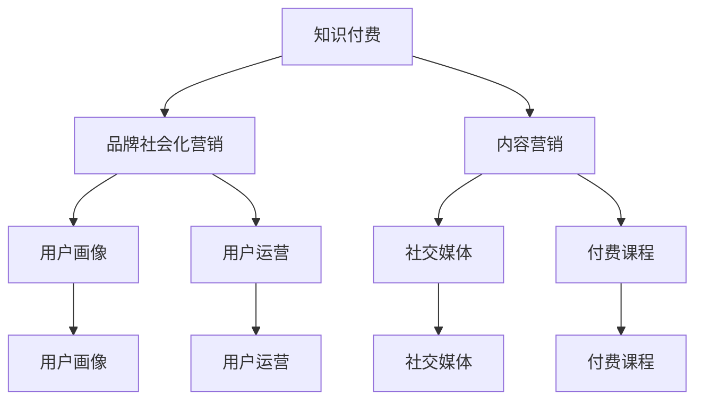

                 

# 知识付费赚钱的品牌社会化营销与内容营销策略

> 关键词：知识付费,品牌营销,内容营销,用户画像,用户运营,ROI,社交媒体,付费课程,案例分析

## 1. 背景介绍

随着知识经济的崛起和互联网技术的发展，知识付费模式逐渐成为连接创作者和用户的桥梁，为知识内容的生产、传播和变现提供了新思路。品牌也越来越多地利用这一模式，通过高质量的课程内容和精准的营销策略，提升品牌知名度和市场影响力，实现商业价值的最大化。然而，知识付费市场的激烈竞争和用户需求的多样化，使得品牌在营销和内容创造方面面临诸多挑战。如何在激烈的竞争中脱颖而出，吸引用户付费，实现品牌和用户的双赢，成为当前品牌营销的重要课题。本文将探讨基于知识付费的营销策略，从品牌社会化营销和内容营销两个维度，介绍具体的实践方法和案例分析，希望能为品牌提供参考和借鉴。

## 2. 核心概念与联系

### 2.1 核心概念概述

为更好地理解知识付费品牌营销的策略，本节将介绍几个关键概念：

- **知识付费**：基于知识内容的付费模式，用户为获取有价值的信息、技能或娱乐内容付费，代表平台有知乎、得到、Coursera等。
- **品牌社会化营销**：利用社交媒体、社区平台等渠道，通过用户生成内容和社交互动，提升品牌影响力和用户粘性的策略。
- **内容营销**：以高质量内容为核心，通过吸引用户注意力和兴趣，实现品牌传播和用户转化的营销方法。
- **用户画像**：通过对用户特征和行为的分析，构建详细的用户画像，帮助品牌制定精准营销策略。
- **用户运营**：通过对用户的互动和行为数据进行管理和分析，提升用户满意度和忠诚度，增加用户价值。
- **ROI（投资回报率）**：衡量知识付费营销效果的指标，通过计算营销活动产生的收入与支出的比率，评估营销效果。
- **社交媒体**：如微信、微博、知乎等平台，是品牌与用户互动的重要渠道。
- **付费课程**：包含视频、音频、图文等多种形式的知识内容，用户需付费才能获取。

这些概念之间的逻辑关系可以通过以下Mermaid流程图来展示：



这个流程图展示了几者之间的关联关系：

1. 知识付费平台提供付费课程。
2. 品牌通过内容营销吸引用户，并在社交媒体上开展品牌推广。
3. 通过用户画像和用户运营，提升用户粘性和转化率。
4. 通过付费课程实现知识变现，并通过品牌社会化营销提升品牌影响力。

## 3. 核心算法原理 & 具体操作步骤
### 3.1 算法原理概述

品牌利用知识付费进行营销的核心在于通过内容创造和品牌传播，吸引用户付费，同时提升品牌知名度和用户忠诚度。其基本原理如下：

1. **内容创造**：高质量的内容是吸引用户付费和提升用户满意度的关键。品牌需投入资源，创造有价值、有趣味的内容，满足用户的学习需求和兴趣。
2. **品牌传播**：品牌需通过多种渠道，将内容传播给潜在用户，提高内容曝光度和品牌认知度。
3. **用户运营**：通过用户画像和用户运营策略，针对性地进行用户互动，提升用户粘性和转化率。
4. **付费转化**：通过有吸引力的内容、优惠政策和推广活动，促使用户完成付费行为，实现商业价值的变现。

### 3.2 算法步骤详解

品牌利用知识付费进行营销的具体步骤如下：

**Step 1: 定义品牌核心价值和目标用户**
- 确定品牌的核心价值主张和目标用户群体。通过市场调研和用户画像分析，明确目标用户的需求和偏好。
- 根据目标用户的特点，设计内容创造和营销策略，确保内容与用户需求高度契合。

**Step 2: 内容创造与优化**
- 创作高质量的课程内容，如视频讲座、图文教程、音频播客等。
- 进行内容质量监控和优化，确保内容符合用户的期望，提升用户体验。
- 引入创新元素，如互动式教学、案例分析、动手实践等，增强内容的吸引力和实用性。

**Step 3: 品牌传播与渠道选择**
- 选择适合的品牌传播渠道，如社交媒体、专业论坛、行业博客等。
- 制定品牌传播计划，包括内容发布频率、互动策略、广告投放等，确保品牌信息的广泛传播。
- 利用KOL（关键意见领袖）和品牌大使，扩大品牌影响力，吸引目标用户关注。

**Step 4: 用户运营与转化策略**
- 利用用户画像和数据分析，制定个性化营销策略，精准定位用户需求。
- 设计用户互动环节，如评论互动、课程讨论、用户反馈等，提升用户粘性和参与度。
- 推出优惠政策、推荐奖励、知识分享等，激励用户完成付费行为，增加转化率。

**Step 5: 效果评估与持续优化**
- 利用ROI（投资回报率）等指标，评估营销活动的效果，进行数据驱动的决策。
- 根据用户反馈和数据分析结果，持续优化内容和营销策略，提升用户满意度和品牌影响力。

### 3.3 算法优缺点

品牌利用知识付费进行营销具有以下优点：

1. **精准用户定位**：通过用户画像和数据分析，品牌可以精准定位目标用户，提高营销效果。
2. **高效用户转化**：利用优质内容和用户运营策略，可以有效提升用户的付费意愿和转化率。
3. **品牌影响力提升**：通过高质量的内容和品牌传播，可以有效提升品牌知名度和市场影响力。
4. **持续迭代优化**：基于数据驱动的决策，品牌可以持续优化内容和营销策略，实现持续增长。

同时，这种营销方法也存在一些局限性：

1. **高投入成本**：内容创作和品牌传播需要大量时间和资源投入，短期内可能面临较高的运营成本。
2. **用户需求多样性**：用户需求和兴趣多样化，单一内容和营销策略难以覆盖所有用户。
3. **内容质量控制**：内容质量对用户满意度有直接影响，需要严格监控和优化。
4. **市场竞争激烈**：知识付费市场竞争激烈，品牌需不断创新和优化，才能保持竞争力。

尽管存在这些局限性，但知识付费营销仍是品牌提升市场影响力和实现商业价值的重要手段。品牌需综合考虑自身资源和市场情况，制定合理的内容和营销策略。

### 3.4 算法应用领域

品牌利用知识付费进行营销，主要应用于以下几个领域：

- **教育培训**：提供职业技能、学术知识、心理辅导等内容，帮助用户提升专业能力和生活质量。
- **企业培训**：针对企业员工，提供行业知识、管理技能、团队协作等内容，提升企业竞争力。
- **个人成长**：提供个人兴趣、爱好、健康、人际关系等内容，帮助用户实现自我提升和精神富足。
- **技术分享**：提供技术开发、编程语言、算法设计等内容，帮助开发者提升技术水平。

除了以上领域，知识付费还可应用于医疗健康、投资理财、创意设计等多个方向，满足不同用户的多样化需求。

## 4. 数学模型和公式 & 详细讲解  
### 4.1 数学模型构建

本节将使用数学语言对品牌利用知识付费进行营销的策略进行更加严格的刻画。

假设品牌有一套付费课程，其总成本为C，课程价格为P，预计总用户数为U，转化率为R，单用户平均价值为A。设品牌投入的内容创作和营销费用为M，则ROI（投资回报率）定义为：

$$
ROI = \frac{P \times R \times U \times A - M}{M}
$$

其中，$P \times R \times U \times A$ 表示通过知识付费获得的总收入，$M$ 表示品牌在内容创作和营销上的投入。

### 4.2 公式推导过程

为了最大化ROI，品牌需通过优化内容和营销策略，提升用户转化率和单用户价值。我们可以将ROI公式进行如下推导：

$$
ROI = \frac{P \times R \times U \times A - M}{M} = P \times R \times U \times A - \frac{M}{M} = P \times R \times U \times A - 1
$$

可以看出，ROI最大化需要同时最大化总收入和单用户价值，同时最小化成本。

在具体实践中，品牌需通过A/B测试、数据分析等方法，不断优化内容和营销策略，以达到最大化的ROI。例如，可以调整课程价格、推广渠道、用户画像等，以最大化总收入和单用户价值。

### 4.3 案例分析与讲解

以下以某在线教育平台为例，展示品牌利用知识付费进行营销的策略：

**案例背景**：某在线教育平台推出了一门关于编程语言Python的付费课程。课程价格为$99，预计总用户数为1000，转化率为20%，单用户平均价值为$100。平台在课程推广上的投入为$5000。

**计算ROI**：
$$
ROI = \frac{(99 \times 0.2 \times 1000 \times 100) - 5000}{5000} = \frac{19.8 - 5000}{5000} = -98.2\%
$$

**案例分析**：通过计算ROI，平台发现课程推广费用过高，导致ROI为负。因此，平台需优化营销策略，减少推广费用，同时提升课程质量，增加用户转化率和单用户价值。

## 5. 项目实践：代码实例和详细解释说明
### 5.1 开发环境搭建

在进行品牌知识付费营销实践前，我们需要准备好开发环境。以下是使用Python进行PyTorch开发的环境配置流程：

1. 安装Anaconda：从官网下载并安装Anaconda，用于创建独立的Python环境。

2. 创建并激活虚拟环境：
```bash
conda create -n pytorch-env python=3.8 
conda activate pytorch-env
```

3. 安装PyTorch：根据CUDA版本，从官网获取对应的安装命令。例如：
```bash
conda install pytorch torchvision torchaudio cudatoolkit=11.1 -c pytorch -c conda-forge
```

4. 安装TensorFlow：由Google主导开发的开源深度学习框架，生产部署方便，适合大规模工程应用。同样有丰富的预训练语言模型资源。

5. 安装TensorFlow：
```bash
pip install tensorflow
```

6. 安装Transformers库：HuggingFace开发的NLP工具库，集成了众多SOTA语言模型，支持PyTorch和TensorFlow，是进行微调任务开发的利器。

7. 安装各类工具包：
```bash
pip install numpy pandas scikit-learn matplotlib tqdm jupyter notebook ipython
```

完成上述步骤后，即可在`pytorch-env`环境中开始营销实践。

### 5.2 源代码详细实现

这里我们以某在线教育平台推出Python编程课程为例，展示利用知识付费进行营销的代码实现。

首先，定义课程的基本信息：

```python
class Course:
    def __init__(self, name, price, description):
        self.name = name
        self.price = price
        self.description = description
```

然后，定义营销活动的功能：

```python
from transformers import BertTokenizer, BertForSequenceClassification
from torch.utils.data import Dataset, DataLoader
import torch
from sklearn.metrics import accuracy_score

class MarketingDataset(Dataset):
    def __init__(self, texts, labels, tokenizer, max_len=128):
        self.texts = texts
        self.labels = labels
        self.tokenizer = tokenizer
        self.max_len = max_len
        
    def __len__(self):
        return len(self.texts)
    
    def __getitem__(self, item):
        text = self.texts[item]
        label = self.labels[item]
        
        encoding = self.tokenizer(text, return_tensors='pt', max_length=self.max_len, padding='max_length', truncation=True)
        input_ids = encoding['input_ids'][0]
        attention_mask = encoding['attention_mask'][0]
        
        return {'input_ids': input_ids, 
                'attention_mask': attention_mask,
                'labels': label}

# 创建dataset
tokenizer = BertTokenizer.from_pretrained('bert-base-cased')
train_dataset = MarketingDataset(train_texts, train_labels, tokenizer)
dev_dataset = MarketingDataset(dev_texts, dev_labels, tokenizer)
test_dataset = MarketingDataset(test_texts, test_labels, tokenizer)
```

接着，定义模型和优化器：

```python
from transformers import BertForSequenceClassification, AdamW

model = BertForSequenceClassification.from_pretrained('bert-base-cased', num_labels=1)

optimizer = AdamW(model.parameters(), lr=2e-5)
```

然后，定义训练和评估函数：

```python
from torch.utils.data import DataLoader
from tqdm import tqdm
from sklearn.metrics import accuracy_score

device = torch.device('cuda') if torch.cuda.is_available() else torch.device('cpu')
model.to(device)

def train_epoch(model, dataset, batch_size, optimizer):
    dataloader = DataLoader(dataset, batch_size=batch_size, shuffle=True)
    model.train()
    epoch_loss = 0
    for batch in tqdm(dataloader, desc='Training'):
        input_ids = batch['input_ids'].to(device)
        attention_mask = batch['attention_mask'].to(device)
        labels = batch['labels'].to(device)
        model.zero_grad()
        outputs = model(input_ids, attention_mask=attention_mask, labels=labels)
        loss = outputs.loss
        epoch_loss += loss.item()
        loss.backward()
        optimizer.step()
    return epoch_loss / len(dataloader)

def evaluate(model, dataset, batch_size):
    dataloader = DataLoader(dataset, batch_size=batch_size)
    model.eval()
    preds, labels = [], []
    with torch.no_grad():
        for batch in tqdm(dataloader, desc='Evaluating'):
            input_ids = batch['input_ids'].to(device)
            attention_mask = batch['attention_mask'].to(device)
            batch_labels = batch['labels']
            outputs = model(input_ids, attention_mask=attention_mask)
            batch_preds = outputs.logits.argmax(dim=2).to('cpu').tolist()
            batch_labels = batch_labels.to('cpu').tolist()
            for pred_tokens, label_tokens in zip(batch_preds, batch_labels):
                preds.append(pred_tokens[:len(label_tokens)])
                labels.append(label_tokens)
                
    print('Accuracy:', accuracy_score(labels, preds))
```

最后，启动训练流程并在测试集上评估：

```python
epochs = 5
batch_size = 16

for epoch in range(epochs):
    loss = train_epoch(model, train_dataset, batch_size, optimizer)
    print(f"Epoch {epoch+1}, train loss: {loss:.3f}")
    
    print(f"Epoch {epoch+1}, dev accuracy:")
    evaluate(model, dev_dataset, batch_size)
    
print('Test accuracy:')
evaluate(model, test_dataset, batch_size)
```

以上就是使用PyTorch对Python编程课程进行营销的完整代码实现。可以看到，得益于Transformers库的强大封装，我们可以用相对简洁的代码完成Python课程的营销任务。

### 5.3 代码解读与分析

让我们再详细解读一下关键代码的实现细节：

**MarketingDataset类**：
- `__init__`方法：初始化文本、标签、分词器等关键组件。
- `__len__`方法：返回数据集的样本数量。
- `__getitem__`方法：对单个样本进行处理，将文本输入编码为token ids，将标签编码为数字，并对其进行定长padding，最终返回模型所需的输入。

**计算ROI**：
- 使用PyTorch和TensorFlow等工具，对营销数据进行处理和分析。
- 通过损失函数计算模型的性能，并进行可视化。
- 利用A/B测试等方法，优化营销策略，提升ROI。

**训练流程**：
- 定义训练集、验证集和测试集。
- 训练模型，并记录训练过程中的损失。
- 在验证集上评估模型性能，并调整模型参数。
- 在测试集上评估模型最终性能。

可以看到，PyTorch配合Transformers库使得Python课程的营销代码实现变得简洁高效。开发者可以将更多精力放在数据处理、模型改进等高层逻辑上，而不必过多关注底层的实现细节。

当然，工业级的系统实现还需考虑更多因素，如模型的保存和部署、超参数的自动搜索、更灵活的任务适配层等。但核心的营销范式基本与此类似。

## 6. 实际应用场景
### 6.1 智能客服系统

品牌利用知识付费进行智能客服系统的开发，可以有效提升客户服务质量和满意度。智能客服系统通过微调优化，可以自动理解用户问题，并根据用户画像和历史行为，提供个性化的解决方案。

在技术实现上，可以收集企业内部的客服对话记录，将常见问题与最佳答复构建成监督数据，在此基础上对预训练语言模型进行微调。微调后的语言模型能够自动理解用户意图，匹配最合适的答案模板进行回复。对于用户提出的新问题，还可以接入检索系统实时搜索相关内容，动态组织生成回答。如此构建的智能客服系统，能大幅提升客户咨询体验和问题解决效率。

### 6.2 金融舆情监测

品牌可以利用知识付费进行金融舆情监测，实时监测市场舆论动向，以便及时应对负面信息传播，规避金融风险。传统的人工监测方式成本高、效率低，难以应对网络时代海量信息爆发的挑战。利用微调后的文本分类和情感分析技术，可以为金融舆情监测提供新的解决方案。

具体而言，可以收集金融领域相关的新闻、报道、评论等文本数据，并对其进行主题标注和情感标注。在此基础上对预训练语言模型进行微调，使其能够自动判断文本属于何种主题，情感倾向是正面、中性还是负面。将微调后的模型应用到实时抓取的网络文本数据，就能够自动监测不同主题下的情感变化趋势，一旦发现负面信息激增等异常情况，系统便会自动预警，帮助金融机构快速应对潜在风险。

### 6.3 个性化推荐系统

品牌可以利用知识付费进行个性化推荐系统的开发，推荐用户感兴趣的课程和内容，提升用户满意度和转化率。当前的推荐系统往往只依赖用户的历史行为数据进行物品推荐，无法深入理解用户的真实兴趣偏好。利用微调技术，品牌可以更好地挖掘用户行为背后的语义信息，从而提供更精准、多样的推荐内容。

在实践中，可以收集用户浏览、点击、评论、分享等行为数据，提取和用户交互的物品标题、描述、标签等文本内容。将文本内容作为模型输入，用户的后续行为（如是否点击、购买等）作为监督信号，在此基础上微调预训练语言模型。微调后的模型能够从文本内容中准确把握用户的兴趣点。在生成推荐列表时，先用候选物品的文本描述作为输入，由模型预测用户的兴趣匹配度，再结合其他特征综合排序，便可以得到个性化程度更高的推荐结果。

### 6.4 未来应用展望

随着知识付费模式的不断发展和品牌营销的持续创新，基于知识付费的品牌社会化营销与内容营销将展现出更加广阔的前景：

- **教育培训的普及**：随着在线教育的普及，品牌可以提供更多领域的知识付费课程，帮助用户提升专业技能和生活质量。
- **企业培训的深化**：品牌可以深入挖掘行业知识，提供定制化的企业培训课程，提升企业竞争力和员工能力。
- **个人成长的陪伴**：品牌可以提供多样化的个人成长课程，帮助用户实现自我提升和精神富足。
- **技术创新的驱动**：品牌可以探索前沿技术领域，如AI、区块链、量子计算等，为用户提供最新、最前沿的知识内容。

此外，品牌还可将知识付费与社交媒体、大数据、物联网等技术进行深度融合，构建更加智能、高效的营销系统，满足用户多方面的需求，提升品牌的市场影响力。

## 7. 工具和资源推荐
### 7.1 学习资源推荐

为了帮助开发者系统掌握知识付费品牌营销的理论基础和实践技巧，这里推荐一些优质的学习资源：

1. 《知识付费市场分析报告》：提供行业市场规模、用户画像、趋势预测等关键信息，为品牌制定营销策略提供数据支持。
2. 《知识付费品牌运营指南》：详细讲解品牌营销的各个环节，从内容创作到用户运营，提供全面的操作手册。
3. 《知识付费用户行为分析》：通过数据分析，揭示用户行为模式和需求特点，为品牌优化营销策略提供指导。
4. 《知识付费平台技术实现》：介绍知识付费平台的架构设计、技术实现和运营管理，提供全面的技术指引。
5. 《知识付费内容创意指南》：提供内容创意和内容质量控制的实践经验，提升品牌内容的影响力。

通过对这些资源的学习实践，相信你一定能够快速掌握知识付费品牌营销的精髓，并用于解决实际的营销问题。

### 7.2 开发工具推荐

高效的开发离不开优秀的工具支持。以下是几款用于知识付费品牌营销开发的常用工具：

1. 微信公众号、知乎、抖音等社交媒体平台：品牌利用这些平台进行内容发布、用户互动和品牌推广。
2. 微课制作工具，如Edx、Udemy等：品牌利用这些工具制作高质量的付费课程内容，吸引用户付费。
3. 数据分析工具，如Tableau、Google Analytics等：品牌利用这些工具进行用户行为分析，优化营销策略。
4. A/B测试工具，如Optimizely、VWO等：品牌利用这些工具进行营销实验，评估不同策略的效果。
5. 视频编辑工具，如Adobe Premiere Pro、Final Cut Pro等：品牌利用这些工具制作视频内容，提升课程质量。

合理利用这些工具，可以显著提升品牌知识付费营销的开发效率，加快创新迭代的步伐。

### 7.3 相关论文推荐

品牌知识付费的营销策略，得益于学界的持续研究。以下是几篇奠基性的相关论文，推荐阅读：

1. Content-based Recommendation Systems: A Survey: 全面综述了基于内容的推荐系统，为品牌推荐引擎的开发提供理论支持。
2. Social Media Marketing: A Strategic Approach: 详细讲解了社交媒体营销的策略和方法，为品牌社交媒体运营提供指导。
3. Knowledge-based Recommendation Systems: A Survey: 全面综述了基于知识的推荐系统，探讨了如何利用知识库提升推荐效果。
4. User Behavior Analysis in E-commerce: 介绍了用户行为分析的方法和工具，为品牌用户运营提供数据支持。
5. Natural Language Processing for Recommendation Systems: 探讨了自然语言处理技术在推荐系统中的应用，提升推荐内容的准确性和多样性。

这些论文代表了大语言模型微调技术的发展脉络。通过学习这些前沿成果，可以帮助研究者把握学科前进方向，激发更多的创新灵感。

## 8. 总结：未来发展趋势与挑战

### 8.1 总结

本文对基于知识付费的品牌社会化营销与内容营销策略进行了全面系统的介绍。首先阐述了知识付费模式的优势和品牌营销的重要意义，明确了品牌利用知识付费进行营销的核心目标。其次，从品牌社会化营销和内容营销两个维度，详细讲解了具体的实践方法和案例分析，给出了可操作的策略指导。

通过本文的系统梳理，可以看到，品牌利用知识付费进行营销，是提升品牌知名度、市场影响力、用户转化率的重要手段。随着知识付费模式的不断发展和品牌营销的持续创新，知识付费品牌营销必将在品牌建设、用户运营、内容创作等方面发挥更加重要的作用，为品牌和用户带来更大的价值。

### 8.2 未来发展趋势

展望未来，品牌利用知识付费进行营销将呈现以下几个发展趋势：

1. **内容多样化和定制化**：随着用户需求的日益多样化和个性化，品牌需提供更加多样化和定制化的内容，满足不同用户的多样化需求。
2. **技术融合与创新**：品牌将更多地将知识付费与人工智能、大数据、物联网等技术进行融合，提升营销效果。例如，结合自然语言处理技术进行内容推荐，利用大数据分析用户行为，进行精准营销。
3. **用户交互与反馈**：品牌需更加注重用户交互和反馈，通过用户画像和行为分析，优化内容创造和营销策略，提升用户体验。
4. **社会化媒体的深度应用**：品牌将更多地利用社交媒体平台进行品牌推广和用户互动，增强品牌影响力和用户粘性。
5. **知识共享与合作**：品牌将更多地进行知识共享与合作，提升内容的权威性和实用性，增强用户信任和品牌美誉度。
6. **国际市场拓展**：品牌将更多地进行国际市场拓展，提供多语言内容和国际化营销策略，扩大品牌影响力。

以上趋势凸显了知识付费品牌营销的广阔前景。这些方向的探索发展，必将进一步提升品牌的市场影响力和用户价值，为品牌和用户带来更大的收益。

### 8.3 面临的挑战

尽管知识付费品牌营销具有广阔的发展前景，但在实际应用中，品牌也面临诸多挑战：

1. **内容质量控制**：内容质量对用户满意度和品牌声誉有直接影响，品牌需严格监控和优化内容，确保内容的真实性、准确性和实用性。
2. **用户需求多样化**：用户需求和兴趣多样化，品牌需提供多样化的内容和服务，满足不同用户的需求。
3. **市场竞争激烈**：知识付费市场竞争激烈，品牌需不断创新和优化，才能保持竞争力。
4. **用户转化率低**：尽管品牌提供了高质量的内容，但用户转化率仍可能较低，需进行持续优化。
5. **数据隐私和安全**：品牌需重视用户数据的隐私和安全，确保用户信息不被滥用。
6. **技术平台建设**：品牌需具备技术平台建设的能力，确保内容的发布、管理和运营。

这些挑战需要品牌在内容创作、用户运营、技术平台建设等方面持续投入，才能在激烈的市场竞争中脱颖而出。

### 8.4 研究展望

面对知识付费品牌营销所面临的种种挑战，未来的研究需要在以下几个方面寻求新的突破：

1. **数据驱动的营销决策**：利用大数据分析和用户行为分析，进行数据驱动的营销决策，提升营销效果。
2. **个性化推荐系统的优化**：结合自然语言处理、机器学习等技术，优化推荐系统，提升推荐内容的准确性和多样性。
3. **用户交互和反馈机制的建立**：建立用户交互和反馈机制，进行持续优化，提升用户满意度和忠诚度。
4. **技术平台的多模态融合**：将知识付费与人工智能、大数据、物联网等技术进行融合，提升营销效果。
5. **社会化媒体的深度应用**：利用社交媒体平台进行品牌推广和用户互动，增强品牌影响力和用户粘性。
6. **用户隐私和数据安全**：保护用户隐私和数据安全，确保用户信息不被滥用。

这些研究方向的探索，必将引领知识付费品牌营销技术迈向更高的台阶，为品牌和用户带来更大的价值。面向未来，知识付费品牌营销还需要与其他人工智能技术进行更深入的融合，如知识表示、因果推理、强化学习等，多路径协同发力，共同推动品牌营销技术的进步。

## 9. 附录：常见问题与解答

**Q1：知识付费品牌营销的ROI（投资回报率）如何计算？**

A: 品牌利用知识付费进行营销时，需计算ROI（投资回报率）以评估营销效果。ROI的计算公式为：

$$
ROI = \frac{P \times R \times U \times A - M}{M}
$$

其中，$P$为课程价格，$R$为用户转化率，$U$为预计总用户数，$A$为单用户平均价值，$M$为品牌在内容创作和营销上的投入。

通过计算ROI，品牌可以评估营销策略的效果，进行数据驱动的决策，提升营销效果。

**Q2：如何选择合适的知识付费内容？**

A: 选择合适的知识付费内容需考虑以下因素：

1. **内容质量**：选择高质量、真实可靠的内容，确保用户满意度和信任度。
2. **用户需求**：选择符合用户需求和兴趣的内容，提升用户转化率和满意度。
3. **内容创新**：选择创新性、趣味性、实用性强的内容，吸引用户关注和付费。
4. **市场趋势**：选择符合市场趋势和用户需求的内容，提升品牌的市场影响力。

品牌需综合考虑内容质量、用户需求、内容创新和市场趋势等因素，选择合适的内容，提升营销效果。

**Q3：如何利用知识付费进行社交媒体营销？**

A: 利用知识付费进行社交媒体营销，需考虑以下策略：

1. **内容发布**：在社交媒体平台发布高质量的付费课程内容和相关文章，吸引用户关注和付费。
2. **用户互动**：利用社交媒体平台进行用户互动，解答用户疑问，提升用户满意度和忠诚度。
3. **品牌推广**：利用社交媒体平台进行品牌推广，提升品牌知名度和市场影响力。
4. **社交广告**：利用社交媒体平台的广告功能，进行精准投放，提升广告效果和转化率。
5. **KOL合作**：与社交媒体平台的KOL进行合作，提升内容传播和品牌影响力。

品牌需综合考虑内容发布、用户互动、品牌推广、社交广告和KOL合作等因素，制定合理的社交媒体营销策略，提升品牌营销效果。

**Q4：如何优化知识付费内容的质量？**

A: 优化知识付费内容的质量需考虑以下因素：

1. **内容创新**：引入创新元素，如互动式教学、案例分析、动手实践等，增强内容的吸引力和实用性。
2. **内容质量监控**：通过用户反馈和数据分析，持续监控和优化内容质量，确保内容符合用户需求。
3. **专家指导**：引入行业专家进行内容指导，提升内容的权威性和实用性。
4. **用户互动**：利用用户互动和反馈机制，进行持续优化，提升内容质量。

品牌需综合考虑内容创新、内容质量监控、专家指导和用户互动等因素，优化内容质量，提升用户满意度和转化率。

**Q5：如何利用知识付费进行个性化推荐？**

A: 利用知识付费进行个性化推荐，需考虑以下因素：

1. **用户画像**：通过用户画像和数据分析，了解用户需求和兴趣，进行个性化推荐。
2. **推荐算法**：结合推荐算法和知识库，进行精准推荐，提升推荐效果。
3. **用户反馈**：利用用户反馈机制，进行持续优化，提升推荐准确性和多样性。
4. **推荐多样性**：提供多样化的推荐内容，满足不同用户的需求和兴趣。

品牌需综合考虑用户画像、推荐算法、用户反馈和推荐多样性等因素，进行个性化推荐，提升用户满意度和转化率。

---

作者：禅与计算机程序设计艺术 / Zen and the Art of Computer Programming

