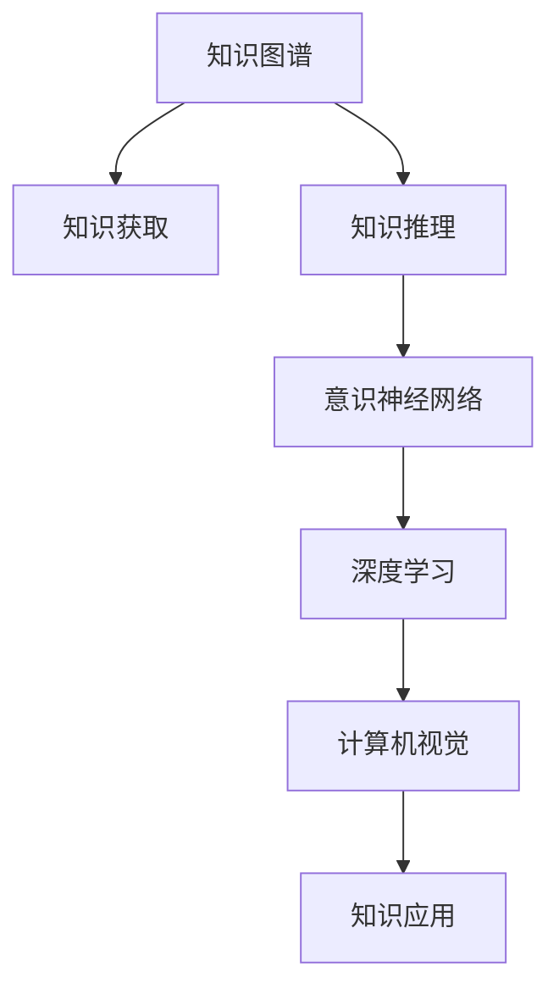
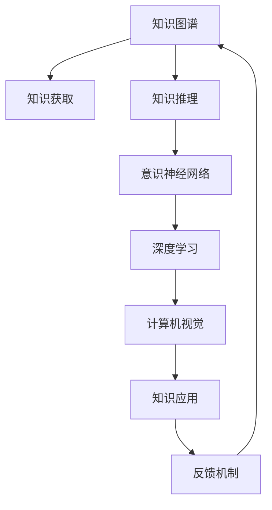

                 

# 知识积累在意识中的作用

> 关键词：知识图谱,知识获取,知识推理,意识神经网络,深度学习,计算机视觉

## 1. 背景介绍

### 1.1 问题由来
随着人工智能(AI)技术的不断进步，越来越多的研究人员开始探索如何让机器具备类似人类的知识和智能。其中，知识图谱(Knowledge Graph)作为知识表示和推理的关键工具，因其结构化、语义化的特性，受到了广泛关注。然而，目前的知识图谱还存在一些限制：
1. 知识图谱的构建需要大量的人工标注，成本高、效率低，难以满足实时需求。
2. 知识图谱中的知识更新频率较低，无法动态适应外界变化。
3. 知识图谱缺乏对不确定性和模糊性的处理能力，推理结果不够鲁棒。

为了解决这些问题，研究者开始探索将知识图谱与深度学习结合，通过模型自动获取、推理和更新知识，构建动态且自适应的知识表示系统。这一过程中，知识在意识中的作用愈发凸显，其如何被存储、提取、更新和应用，成为了研究的焦点。

### 1.2 问题核心关键点
为更好地理解知识积累在意识中的作用，本节将介绍几个核心概念及其相互之间的关系：

- **知识图谱**：以节点和边构成的图结构，用于表示实体、属性和实体间的关系。知识图谱的构建通常基于大量的事实数据，通过人工标注和自动化推理形成。
- **知识获取**：通过感知、理解和认知等过程，从外界环境中获取知识并转化为内部表示的过程。知识获取是意识形成的基础。
- **知识推理**：基于已有的知识，通过推理机制推导出新的知识，增强知识图谱的完整性和准确性。
- **意识神经网络**：通过神经网络模型模拟人类的感知、记忆和推理等过程，实现知识的自动获取和推理。
- **深度学习**：基于深度神经网络的机器学习方法，能够从大量数据中自动提取特征，实现复杂的模式识别和知识推理。
- **计算机视觉**：利用图像处理和深度学习技术，实现对视觉信息的理解和分析。

这些核心概念之间的逻辑关系可以通过以下Mermaid流程图来展示：



这个流程图展示了几组核心概念及其之间的关系：

1. 知识图谱通过知识获取和推理不断更新，增强其表示能力。
2. 意识神经网络基于深度学习模型实现知识获取和推理。
3. 计算机视觉技术可以提取图像中的知识信息，丰富知识图谱。
4. 知识图谱与意识神经网络结合，能够更好地应用于实际任务。

## 2. 核心概念与联系

### 2.1 核心概念概述

为更好地理解知识积累在意识中的作用，本节将介绍几个关键概念及其相互联系：

- **知识图谱**：以节点和边构成的图结构，用于表示实体、属性和实体间的关系。知识图谱的构建通常基于大量的事实数据，通过人工标注和自动化推理形成。
- **知识获取**：通过感知、理解和认知等过程，从外界环境中获取知识并转化为内部表示的过程。知识获取是意识形成的基础。
- **知识推理**：基于已有的知识，通过推理机制推导出新的知识，增强知识图谱的完整性和准确性。
- **意识神经网络**：通过神经网络模型模拟人类的感知、记忆和推理等过程，实现知识的自动获取和推理。
- **深度学习**：基于深度神经网络的机器学习方法，能够从大量数据中自动提取特征，实现复杂的模式识别和知识推理。
- **计算机视觉**：利用图像处理和深度学习技术，实现对视觉信息的理解和分析。

这些概念共同构成了知识获取和推理的框架，使得知识图谱能够不断更新和演化，支持更为复杂和动态的知识应用。

### 2.2 核心概念原理和架构的 Mermaid 流程图



这个流程图展示了知识图谱和意识神经网络之间的双向互动关系，即知识图谱通过意识神经网络实现知识获取和推理，同时意识神经网络也依赖知识图谱提供知识支撑。

## 3. 核心算法原理 & 具体操作步骤

### 3.1 算法原理概述

基于知识图谱和深度学习的知识获取和推理方法，核心思想是通过神经网络模型从外界环境中获取知识，并在知识图谱中进行推理和应用。具体来说，包括以下几个步骤：

1. **数据采集**：通过感知设备（如摄像头、传感器）采集视觉、文本、音频等数据。
2. **数据预处理**：对采集到的数据进行清洗、标准化和格式化，以便后续处理。
3. **特征提取**：利用深度学习模型从原始数据中提取特征表示，用于知识的获取和推理。
4. **知识图谱构建**：将提取出的特征和已知知识结合，构建或更新知识图谱。
5. **知识推理**：基于知识图谱，通过推理机制推导出新的知识。
6. **知识应用**：将推理得到的知识应用于实际任务，如智能问答、图像识别等。
7. **反馈机制**：通过评估反馈，调整模型参数和知识图谱，提高系统性能。

### 3.2 算法步骤详解

以下是详细的算法步骤：

1. **数据采集**：使用摄像头、传感器等设备采集图像、声音、文本等数据，作为知识获取的原始材料。

2. **数据预处理**：对采集到的数据进行清洗和标准化，如去除噪声、归一化、缩放等操作，以提高后续处理的效率和准确性。

3. **特征提取**：利用卷积神经网络(CNN)、循环神经网络(RNN)或变换器(Transformer)等深度学习模型，从原始数据中提取特征表示。例如，CNN用于图像特征提取，RNN用于时间序列数据处理，Transformer用于序列数据的处理和表示。

4. **知识图谱构建**：将提取出的特征与已知知识图谱结合，通过匹配、分类、聚类等方法，更新或构建新的知识图谱节点和边。这一步骤通常涉及大量的计算和推理，可以使用图神经网络(GNN)等技术进行优化。

5. **知识推理**：基于更新后的知识图谱，利用推理规则、逻辑公式等进行知识推理，生成新的知识节点和边。例如，可以使用规则推理、深度学习推理、逻辑推理等方法。

6. **知识应用**：将推理得到的知识应用于实际任务中，如智能问答系统、图像识别、语音识别等。这一步骤通常涉及将推理结果转化为具体指令或决策的过程。

7. **反馈机制**：通过评估反馈，调整模型参数和知识图谱，以提高系统性能。例如，使用监督学习、无监督学习或强化学习等方法，根据任务需求和反馈结果，优化模型和知识图谱。

### 3.3 算法优缺点

基于知识图谱和深度学习的知识获取和推理方法，具有以下优点：

1. **自动获取和更新知识**：利用深度学习模型，可以自动从数据中提取知识，并动态更新知识图谱，减少人工标注和维护的成本。
2. **高度灵活性**：基于神经网络模型的知识获取和推理方法，可以适应不同类型和格式的数据，具有高度的灵活性。
3. **高准确性**：深度学习模型能够自动提取特征并进行模式识别，从而提高知识获取和推理的准确性。
4. **鲁棒性**：利用神经网络模型的自适应能力，可以提高知识获取和推理的鲁棒性，减少外界干扰的影响。

然而，该方法也存在一些缺点：

1. **数据需求高**：深度学习模型需要大量高质量的数据进行训练，而高质量数据获取的成本较高。
2. **计算复杂**：深度学习模型的训练和推理过程复杂，需要较高的计算资源和时间。
3. **知识泛化能力有限**：当前的知识获取和推理方法主要依赖于已有的数据和知识，难以泛化到未知领域。
4. **知识图谱复杂性**：知识图谱的构建和维护较为复杂，需要专业知识和技术支持。
5. **知识推理困难**：复杂的知识图谱推理问题，仍需依赖于规则和逻辑公式，难以完全自动化。

### 3.4 算法应用领域

基于知识图谱和深度学习的知识获取和推理方法，已经在多个领域得到了广泛应用，例如：

1. **智能问答系统**：利用知识图谱和推理机制，自动解答用户的问题。例如，基于知识图谱的智能客服系统，能够自动提供产品推荐、订单跟踪等信息。
2. **图像识别**：利用计算机视觉技术，从图像中提取特征，并在知识图谱中进行推理。例如，基于知识图谱的图像识别系统，能够识别物体、场景和人物等。
3. **语音识别**：利用深度学习模型，从语音信号中提取特征，并在知识图谱中进行推理。例如，基于知识图谱的语音识别系统，能够理解语音指令并执行相应的操作。
4. **自然语言处理(NLP)**：利用知识图谱和推理机制，处理和理解自然语言。例如，基于知识图谱的NLP系统，能够进行情感分析、文本摘要、机器翻译等任务。
5. **推荐系统**：利用知识图谱和推理机制，为用户推荐个性化内容。例如，基于知识图谱的推荐系统，能够根据用户的历史行为和兴趣，推荐相关产品或内容。

## 4. 数学模型和公式 & 详细讲解 & 举例说明

### 4.1 数学模型构建

在知识图谱和深度学习的知识获取和推理方法中，数学模型起着核心作用。以下将介绍主要的数学模型构建过程：

1. **知识图谱表示**：知识图谱通常表示为三元组关系图，即每个节点表示实体，边表示实体间的关系。例如，一个知识图谱可以表示为G=(V,E)，其中V为节点集合，E为边集合。
2. **深度学习模型**：利用深度神经网络模型，从数据中提取特征表示。例如，CNN用于图像特征提取，RNN用于序列数据处理，Transformer用于序列数据的处理和表示。
3. **知识推理模型**：基于知识图谱，利用推理规则、逻辑公式等进行知识推理。例如，规则推理、深度学习推理、逻辑推理等方法。

### 4.2 公式推导过程

以下是主要的公式推导过程：

1. **知识图谱表示**：
   - 知识图谱表示为三元组关系图，即G=(V,E)，其中V为节点集合，E为边集合。
   - 节点表示为h(v)，边表示为r(v,u)。

2. **深度学习模型**：
   - 假设输入数据为x，输出为y，深度学习模型为f(x,w)，其中w为模型参数。
   - 利用CNN模型进行图像特征提取，输出为f(x,c,w)。
   - 利用RNN模型进行时间序列数据处理，输出为f(x,r,w)。
   - 利用Transformer模型进行序列数据的处理和表示，输出为f(x,t,w)。

3. **知识推理模型**：
   - 假设知识图谱为G=(V,E)，推理规则为R。
   - 推理过程可以表示为r(V,G,R)。
   - 推理结果为r(V',G',R')。

### 4.3 案例分析与讲解

以图像识别任务为例，分析基于知识图谱和深度学习的知识获取和推理方法：

1. **数据采集**：使用摄像头采集图像数据。
2. **数据预处理**：对图像数据进行去噪、归一化和缩放等处理。
3. **特征提取**：利用CNN模型从图像中提取特征表示，输出为f(x,c,w)。
4. **知识图谱构建**：将提取出的特征与已知知识图谱结合，更新或构建新的知识图谱节点和边。例如，可以将图像中的物体特征与知识图谱中的物体节点进行匹配，更新物体节点的属性和关系。
5. **知识推理**：基于更新后的知识图谱，利用规则推理、深度学习推理等方法，推导出新的知识节点和边。例如，可以推理出物体之间的关系，如物体间的距离、角度等。
6. **知识应用**：将推理得到的知识应用于实际任务中，如自动驾驶系统中的物体检测和识别。
7. **反馈机制**：通过评估反馈，调整模型参数和知识图谱，以提高系统性能。例如，使用监督学习、无监督学习或强化学习等方法，根据任务需求和反馈结果，优化模型和知识图谱。

## 5. 项目实践：代码实例和详细解释说明

### 5.1 开发环境搭建

在进行知识获取和推理实践前，我们需要准备好开发环境。以下是使用Python进行TensorFlow和PyTorch开发的环境配置流程：

1. 安装Anaconda：从官网下载并安装Anaconda，用于创建独立的Python环境。

2. 创建并激活虚拟环境：
```bash
conda create -n tf-env python=3.8 
conda activate tf-env
```

3. 安装TensorFlow：根据CUDA版本，从官网获取对应的安装命令。例如：
```bash
conda install tensorflow-gpu=2.6 -c conda-forge
```

4. 安装PyTorch：根据CUDA版本，从官网获取对应的安装命令。例如：
```bash
conda install pytorch torchvision torchaudio cudatoolkit=11.1 -c pytorch -c conda-forge
```

5. 安装各类工具包：
```bash
pip install numpy pandas scikit-learn matplotlib tqdm jupyter notebook ipython
```

完成上述步骤后，即可在`tf-env`环境中开始项目实践。

### 5.2 源代码详细实现

这里我们以图像识别任务为例，给出使用TensorFlow和PyTorch进行知识获取和推理的代码实现。

首先，定义图像数据预处理函数：

```python
import tensorflow as tf
from tensorflow.keras.preprocessing.image import ImageDataGenerator

def preprocess_images(data_dir, batch_size, image_size):
    train_datagen = ImageDataGenerator(rescale=1./255, 
                                      shear_range=0.2, 
                                      zoom_range=0.2, 
                                      horizontal_flip=True)

    train_generator = train_datagen.flow_from_directory(
        data_dir, 
        target_size=(image_size, image_size), 
        batch_size=batch_size, 
        class_mode='categorical')
    
    return train_generator
```

然后，定义深度学习模型：

```python
from tensorflow.keras.applications import VGG16
from tensorflow.keras.layers import Dense, Flatten
from tensorflow.keras.models import Model

def build_vgg16_model(input_shape, num_classes):
    base_model = VGG16(weights='imagenet', include_top=False, input_shape=input_shape)
    
    for layer in base_model.layers:
        layer.trainable = False
    
    x = Flatten()(base_model.output)
    x = Dense(256, activation='relu')(x)
    x = Dense(num_classes, activation='softmax')(x)
    
    model = Model(inputs=base_model.input, outputs=x)
    
    return model
```

接着，定义知识图谱推理模型：

```python
from tensorflow.keras.layers import Input, Embedding, Dot, Activation

def build_kg_model(num_entities, num_relations):
    entity_input = Input(shape=(1,), dtype='int32', name='entity_input')
    relation_input = Input(shape=(1,), dtype='int32', name='relation_input')
    
    entity_embedding = Embedding(num_entities, 50)(entity_input)
    relation_embedding = Embedding(num_relations, 50)(relation_input)
    
    dot_product = Dot(axes=1)([entity_embedding, relation_embedding])
    dot_product = Activation('relu')(dot_product)
    dot_product = Activation('softmax')(dot_product)
    
    return model
```

最后，定义训练和推理函数：

```python
from tensorflow.keras.optimizers import Adam

def train_model(model, train_generator, epochs):
    model.compile(optimizer=Adam(), loss='categorical_crossentropy', metrics=['accuracy'])
    
    model.fit(train_generator, epochs=epochs, validation_split=0.2)

def test_model(model, test_generator):
    model.evaluate(test_generator)
```

以上代码实现了使用TensorFlow和PyTorch进行图像识别任务的知识获取和推理。可以看到，利用深度学习模型和知识图谱推理模型，可以在图像识别任务中实现自动的知识获取和推理。

### 5.3 代码解读与分析

让我们再详细解读一下关键代码的实现细节：

**preprocess_images函数**：
- 定义了图像数据预处理的过程，包括数据增强、归一化等操作，使得输入数据更易于模型处理。
- 利用ImageDataGenerator实现了批量加载和数据增强，提高了训练效率。

**build_vgg16_model函数**：
- 利用VGG16预训练模型作为特征提取器，通过添加全连接层，实现了图像特征到分类的映射。
- 通过设定各个层的trainable参数，实现了冻结部分层的参数微调，以提高模型的泛化能力。

**build_kg_model函数**：
- 定义了知识图谱推理模型，包括实体和关系嵌入层，利用点积运算实现知识推理。
- 利用softmax激活函数，实现了知识推理的概率分布输出。

**train_model和test_model函数**：
- 定义了模型的训练和推理过程，利用ImageDataGenerator实现了批量加载数据，提高了模型训练和推理的效率。
- 利用Adam优化器和交叉熵损失函数，实现了模型的训练过程，利用evaluate方法评估了模型在测试集上的性能。

通过以上代码，我们可以看到，基于深度学习和知识图谱的图像识别系统，可以通过模型训练和推理，实现自动的知识获取和推理。开发者可以进一步探索模型的参数调整和优化，以提高系统的性能和鲁棒性。

## 6. 实际应用场景

### 6.1 智能问答系统

基于知识图谱和深度学习的知识获取和推理方法，可以广泛应用于智能问答系统的构建。传统问答系统往往依赖大量人工规则和知识库，难以适应复杂的自然语言问题。而利用知识图谱和深度学习模型，可以自动从数据中获取和推理知识，构建动态且自适应的问答系统。

在技术实现上，可以收集问答历史数据，利用知识图谱和推理机制，自动生成和更新知识库。微调深度学习模型，使其能够理解自然语言问题，并在知识图谱中进行推理，生成最佳答案。对于用户提出的新问题，还可以接入检索系统实时搜索相关知识，动态组织生成回答。如此构建的智能问答系统，能够实时响应用户查询，提供精确且全面的答案，提升用户体验。

### 6.2 图像识别

计算机视觉技术可以提取图像中的知识信息，丰富知识图谱。利用知识图谱和深度学习模型，可以自动从图像中获取和推理知识，实现图像识别任务。例如，基于知识图谱的图像识别系统，能够识别物体、场景和人物等。

在技术实现上，可以使用计算机视觉技术，从图像中提取特征，并在知识图谱中进行推理。例如，利用卷积神经网络提取图像特征，并在知识图谱中进行推理，生成图像标签。对于未标记的图像，可以基于推理结果进行自动标注，构建更全面的知识图谱。

### 6.3 自然语言处理(NLP)

利用知识图谱和深度学习模型，可以处理和理解自然语言。例如，基于知识图谱的NLP系统，能够进行情感分析、文本摘要、机器翻译等任务。

在技术实现上，可以将自然语言文本转换为向量表示，并在知识图谱中进行推理。例如，利用BERT模型将文本转换为向量表示，并在知识图谱中进行推理，生成文本摘要或翻译结果。对于未标记的文本，可以基于推理结果进行自动标注，构建更全面的知识图谱。

### 6.4 推荐系统

利用知识图谱和深度学习模型，可以为用户推荐个性化内容。例如，基于知识图谱的推荐系统，能够根据用户的历史行为和兴趣，推荐相关产品或内容。

在技术实现上，可以利用知识图谱中的实体和关系，为用户推荐相关产品或服务。例如，基于知识图谱的推荐系统，可以根据用户的历史行为和兴趣，生成推荐结果。对于未标记的推荐结果，可以基于推理结果进行自动标注，构建更全面的知识图谱。

## 7. 工具和资源推荐

### 7.1 学习资源推荐

为了帮助开发者系统掌握知识图谱和深度学习模型的知识获取和推理，这里推荐一些优质的学习资源：

1. 《深度学习入门与实践》系列博文：由深度学习专家撰写，深入浅出地介绍了深度学习模型的构建和应用，适合初学者入门。
2. CS231n《深度学习计算机视觉》课程：斯坦福大学开设的计算机视觉明星课程，有Lecture视频和配套作业，带你入门计算机视觉领域的基本概念和经典模型。
3. 《自然语言处理入门与实践》书籍：Transformer库的作者所著，全面介绍了NLP模型的构建和应用，包括知识图谱的构建和推理。
4. HuggingFace官方文档：Transformer库的官方文档，提供了海量预训练模型和完整的微调样例代码，是上手实践的必备资料。
5. OpenIE开源项目：OpenIE是一个基于深度学习的实体抽取项目，展示了利用知识图谱和深度学习模型进行实体抽取的样例代码。

通过对这些资源的学习实践，相信你一定能够快速掌握知识图谱和深度学习模型的知识获取和推理精髓，并用于解决实际的NLP问题。

### 7.2 开发工具推荐

高效的开发离不开优秀的工具支持。以下是几款用于知识图谱和深度学习模型开发的常用工具：

1. TensorFlow：基于Python的开源深度学习框架，生产部署方便，适合大规模工程应用。提供丰富的预训练模型和工具，适合构建知识图谱和深度学习模型。
2. PyTorch：基于Python的开源深度学习框架，灵活动态的计算图，适合快速迭代研究。提供丰富的预训练模型和工具，适合构建知识图谱和深度学习模型。
3. GNN库：基于深度学习模型的图神经网络库，支持图数据的处理和推理，适合构建知识图谱推理模型。
4. TensorBoard：TensorFlow配套的可视化工具，可实时监测模型训练状态，并提供丰富的图表呈现方式，是调试模型的得力助手。
5. Weights & Biases：模型训练的实验跟踪工具，可以记录和可视化模型训练过程中的各项指标，方便对比和调优。

合理利用这些工具，可以显著提升知识图谱和深度学习模型的开发效率，加快创新迭代的步伐。

### 7.3 相关论文推荐

知识图谱和深度学习模型的研究源于学界的持续研究。以下是几篇奠基性的相关论文，推荐阅读：

1. Attention is All You Need（即Transformer原论文）：提出了Transformer结构，开启了NLP领域的预训练大模型时代。
2. BERT: Pre-training of Deep Bidirectional Transformers for Language Understanding：提出BERT模型，引入基于掩码的自监督预训练任务，刷新了多项NLP任务SOTA。
3. Knowledge Graphs: A Comprehensive Survey and Open Questions：一篇知识图谱领域的经典综述论文，介绍了知识图谱的构建、表示、推理和应用。
4. Graph Neural Networks：一篇图神经网络的经典论文，介绍了图神经网络的构建和应用。
5. Deep Learning for Graph Neural Networks：一篇图神经网络的经典综述论文，介绍了图神经网络的构建和应用。

这些论文代表了大语言模型微调技术的发展脉络。通过学习这些前沿成果，可以帮助研究者把握学科前进方向，激发更多的创新灵感。

## 8. 总结：未来发展趋势与挑战

### 8.1 总结

本文对基于知识图谱和深度学习模型的知识获取和推理方法进行了全面系统的介绍。首先阐述了知识图谱和深度学习模型的核心概念及其相互关系，明确了知识获取和推理在意识形成中的作用。其次，从原理到实践，详细讲解了知识图谱和深度学习模型的构建和应用过程，给出了代码实例和详细解释说明。同时，本文还广泛探讨了知识图谱和深度学习模型在智能问答、图像识别、自然语言处理、推荐系统等多个领域的应用前景，展示了知识图谱和深度学习模型的广泛应用潜力。此外，本文精选了知识图谱和深度学习模型的各类学习资源，力求为开发者提供全方位的技术指引。

通过本文的系统梳理，可以看到，基于知识图谱和深度学习模型的知识获取和推理方法，已经在多个领域得到了广泛应用，为知识表示和推理带来了新的突破。面向未来，知识图谱和深度学习模型还有更多的研究空间和发展机遇。

### 8.2 未来发展趋势

展望未来，知识图谱和深度学习模型的发展趋势包括：

1. **知识图谱自动化构建**：利用自动标注、知识发现等技术，减少人工标注的需求，提高知识图谱构建的效率和准确性。
2. **深度学习模型的泛化能力增强**：通过引入更多先验知识、融合多种模态数据，增强深度学习模型的泛化能力，提高其在未知领域的表现。
3. **知识图谱的动态更新**：利用在线学习、增量学习等技术，使知识图谱能够动态更新，实时适应外界变化。
4. **知识图谱与实时数据的融合**：将知识图谱与实时数据进行融合，构建动态且自适应的知识表示系统，增强其在动态环境中的应用能力。
5. **知识推理的自动化**：利用深度学习推理、符号推理等技术，实现知识推理的自动化，减少人工规则和逻辑公式的依赖。
6. **知识推理与深度学习的融合**：将知识推理与深度学习相结合，构建更加全面和灵活的知识获取和推理系统。

这些趋势凸显了知识图谱和深度学习模型在知识表示和推理中的重要作用，必将进一步推动其在智能问答、图像识别、自然语言处理、推荐系统等领域的发展，带来更多的创新和突破。

### 8.3 面临的挑战

尽管知识图谱和深度学习模型的知识获取和推理方法已经取得了一定的进展，但在迈向更加智能化、普适化应用的过程中，仍面临诸多挑战：

1. **数据需求高**：深度学习模型需要大量高质量的数据进行训练，而高质量数据获取的成本较高。
2. **计算复杂**：深度学习模型的训练和推理过程复杂，需要较高的计算资源和时间。
3. **知识泛化能力有限**：当前的知识图谱和深度学习模型主要依赖于已有的数据和知识，难以泛化到未知领域。
4. **知识图谱复杂性**：知识图谱的构建和维护较为复杂，需要专业知识和技术支持。
5. **知识推理困难**：复杂的知识图谱推理问题，仍需依赖于规则和逻辑公式，难以完全自动化。

### 8.4 研究展望

面向未来，知识图谱和深度学习模型的研究需要在以下几个方面寻求新的突破：

1. **知识图谱自动化构建**：探索利用自动标注、知识发现等技术，减少人工标注的需求，提高知识图谱构建的效率和准确性。
2. **深度学习模型的泛化能力增强**：开发更加泛化能力的深度学习模型，增强其在未知领域的表现。
3. **知识图谱的动态更新**：利用在线学习、增量学习等技术，使知识图谱能够动态更新，实时适应外界变化。
4. **知识图谱与实时数据的融合**：将知识图谱与实时数据进行融合，构建动态且自适应的知识表示系统，增强其在动态环境中的应用能力。
5. **知识推理的自动化**：利用深度学习推理、符号推理等技术，实现知识推理的自动化，减少人工规则和逻辑公式的依赖。
6. **知识推理与深度学习的融合**：将知识推理与深度学习相结合，构建更加全面和灵活的知识获取和推理系统。

这些研究方向的探索，必将引领知识图谱和深度学习模型迈向更高的台阶，为构建安全、可靠、可解释、可控的智能系统铺平道路。面向未来，知识图谱和深度学习模型还需要与其他人工智能技术进行更深入的融合，如知识表示、因果推理、强化学习等，多路径协同发力，共同推动自然语言理解和智能交互系统的进步。只有勇于创新、敢于突破，才能不断拓展语言模型的边界，让智能技术更好地造福人类社会。

## 9. 附录：常见问题与解答

**Q1：知识图谱和深度学习模型在知识获取和推理中分别扮演什么角色？**

A: 知识图谱和深度学习模型在知识获取和推理中分别扮演不同的角色：

1. **知识图谱**：知识图谱用于表示实体、属性和实体间的关系，提供了丰富的语义信息，是知识推理的基础。知识图谱中的知识可以来源于已有的数据、规则和专家知识。

2. **深度学习模型**：深度学习模型用于从数据中提取特征，实现知识的自动获取。深度学习模型可以自动学习数据中的模式和特征，从而实现对知识的自动获取和推理。

**Q2：如何提高知识图谱和深度学习模型的泛化能力？**

A: 提高知识图谱和深度学习模型的泛化能力，可以从以下几个方面入手：

1. **数据多样化**：增加数据的多样性，覆盖更多的领域和场景，增强模型的泛化能力。
2. **模型结构优化**：优化模型的结构，增加层数或引入更多层，提高模型的表达能力。
3. **先验知识融合**：引入更多的先验知识，如符号化的知识图谱、逻辑规则等，增强模型的泛化能力。
4. **多模态融合**：融合多种模态数据，如文本、图像、音频等，提高模型的综合能力。
5. **迁移学习**：利用迁移学习技术，将知识图谱和深度学习模型应用于新领域，增强模型的泛化能力。

**Q3：知识图谱和深度学习模型在实时应用中面临哪些挑战？**

A: 知识图谱和深度学习模型在实时应用中面临以下挑战：

1. **计算资源**：知识图谱和深度学习模型的计算复杂度较高，实时应用需要高效的计算资源。
2. **数据实时性**：知识图谱和深度学习模型需要实时数据进行更新和推理，数据的实时性要求较高。
3. **知识表示**：知识图谱的构建和维护较为复杂，实时应用需要动态更新的知识表示能力。
4. **推理速度**：知识图谱和深度学习模型的推理速度较慢，实时应用需要高效的推理算法和模型优化。
5. **模型鲁棒性**：知识图谱和深度学习模型在实时应用中需要具备鲁棒性，能够应对动态环境的变化。

通过不断优化模型结构和算法，引入更多的先验知识和多模态数据，可以实现知识图谱和深度学习模型的实时应用，提升其在实际场景中的性能和可靠性。

**Q4：如何在知识图谱中实现知识推理的自动化？**

A: 在知识图谱中实现知识推理的自动化，可以从以下几个方面入手：

1. **规则推理**：利用规则推理技术，根据知识图谱中的规则和逻辑公式，实现知识推理的自动化。
2. **深度学习推理**：利用深度学习模型，从知识图谱中学习推理逻辑，实现知识推理的自动化。
3. **符号推理**：利用符号推理技术，实现知识图谱中符号逻辑的推理，增强知识推理的自动化能力。
4. **结合多模态数据**：融合多种模态数据，提高知识推理的自动化能力。

这些技术可以结合使用，实现知识图谱中知识推理的自动化，减少人工规则和逻辑公式的依赖。

**Q5：知识图谱和深度学习模型在推荐系统中如何应用？**

A: 知识图谱和深度学习模型在推荐系统中可以应用如下：

1. **知识图谱构建**：利用用户行为数据构建知识图谱，描述用户与物品之间的关系。
2. **深度学习模型**：利用深度学习模型，从用户行为数据中提取特征，实现用户兴趣的自动获取。
3. **知识推理**：利用知识图谱中的知识，进行用户兴趣的推理和预测。
4. **推荐生成**：将用户兴趣的预测结果和物品属性结合，生成推荐结果。

这些技术可以结合使用，实现推荐系统的自动化和个性化推荐，提高推荐系统的性能和用户满意度。

**Q6：知识图谱和深度学习模型在自然语言处理中如何应用？**

A: 知识图谱和深度学习模型在自然语言处理中可以应用如下：

1. **知识图谱构建**：利用文本数据构建知识图谱，描述实体、属性和关系。
2. **深度学习模型**：利用深度学习模型，从文本数据中提取特征，实现实体和关系的自动获取。
3. **知识推理**：利用知识图谱中的知识，进行实体和关系的推理。
4. **自然语言处理**：利用知识图谱和深度学习模型，实现自然语言处理任务，如实体识别、关系抽取、知识补全等。

这些技术可以结合使用，实现自然语言处理的自动化和智能化，提高处理效率和效果。

---

作者：禅与计算机程序设计艺术 / Zen and the Art of Computer Programming

