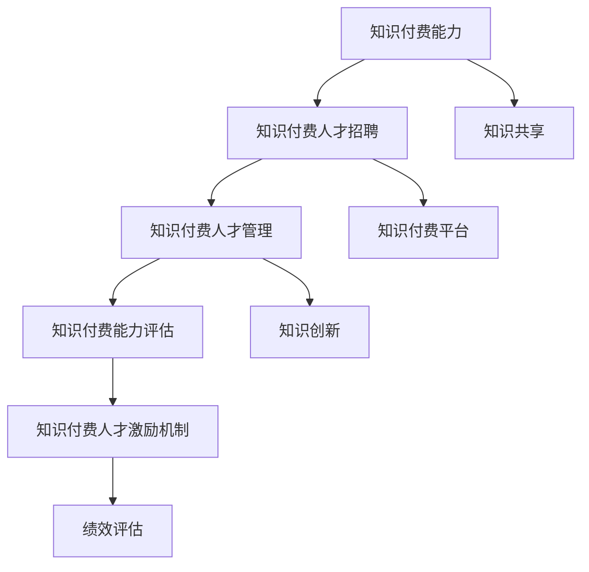

                 

# 知识经济时代下的知识付费人才招聘与管理

## 1. 背景介绍

随着知识经济时代的到来，人才，尤其是具备高知识含量和创新能力的人才，成为各行业竞争的焦点。无论是传统产业还是新兴技术领域，人才招聘与管理都成为了企业发展的关键环节。知识付费，即通过付费获取特定知识或技能，逐步成为获取知识的重要方式。在这一背景下，如何高效地招聘和管理具备知识付费能力的人才，成为知识型企业亟待解决的问题。

### 1.1 问题由来

在知识经济时代，企业对于知识型人才的需求日益增加。这类人才不仅具备专业知识和技能，还具备创新思维、解决复杂问题的能力，能够在快速变化的市场环境中脱颖而出。然而，随着知识付费的兴起，传统的人才招聘渠道面临冲击，企业如何高效地招聘到具有知识付费能力的人才，成为一大挑战。

此外，在知识付费环境下，企业的人才管理也面临着新的挑战。如何激励和保留这些高价值人才，使其为企业创造更多价值，如何构建知识共享和传承机制，都是需要认真思考的问题。

### 1.2 问题核心关键点

本文将围绕以下核心关键点展开讨论：

- **知识付费能力**：定义及重要性
- **知识付费人才招聘**：策略与方法
- **知识付费人才管理**：激励机制与文化构建
- **未来发展趋势与挑战**：趋势分析与应对策略

通过探讨这些问题，旨在为企业提供一套全面、系统的人才招聘与管理策略，促进知识型企业的健康发展。

## 2. 核心概念与联系

### 2.1 核心概念概述

为了更好地理解知识付费人才招聘与管理的概念，我们首先对一些关键概念进行概述：

- **知识付费能力**：指个人或团队获取、分享、应用专业知识的能力，能够在特定领域提供高质量的咨询、培训、产品等知识服务，并以此获得经济回报。
- **知识付费人才招聘**：企业通过多种渠道，寻找具备知识付费能力的人才，进行招聘、筛选、录用等一系列过程。
- **知识付费人才管理**：企业对已招聘的知识型人才进行激励、培训、评估、晋升等系统化管理，以实现人才最大化价值。
- **知识付费能力评估**：通过标准化、系统化的评价体系，对知识付费能力进行量化评估，以便更科学地进行人才选拔与管理。

这些概念之间存在紧密的联系，知识付费能力的评估是人才招聘的重要依据，而人才的管理则围绕激励与激励机制展开，两者共同支撑知识付费人才的高效利用和价值最大化。

### 2.2 核心概念原理和架构的 Mermaid 流程图



这个流程图展示了知识付费人才招聘与管理的核心流程：

1. **知识付费能力评估**：对候选人的知识付费能力进行评估，为招聘提供依据。
2. **知识付费人才招聘**：通过多种渠道寻找并筛选具备知识付费能力的候选人。
3. **知识付费人才管理**：对录用的知识型人才进行系统的管理和激励。
4. **知识付费人才激励机制**：设计激励机制，激发人才的创新和分享动力。
5. **知识共享与知识创新**：鼓励知识型人才进行知识的共享与创新，提升企业整体的知识水平和竞争力。

这些环节相互影响，共同构建起知识付费人才的招聘与管理框架。

## 3. 核心算法原理 & 具体操作步骤

### 3.1 算法原理概述

知识付费人才的招聘与管理，可以视为一种特殊的知识获取与知识共享的过程。通过算法模型和数据驱动的方式，可以优化人才招聘的效率和效果，实现知识的最大化利用。

核心算法原理包括以下几个方面：

1. **人才评估模型**：构建量化评估体系，通过多维度指标（如专业技能、创新能力、知识分享等）对候选人进行评估。
2. **人才推荐算法**：利用协同过滤、神经网络等技术，在大量候选人中推荐最符合企业需求的候选人。
3. **激励机制设计**：通过经济激励、职业发展、知识奖励等手段，激发知识型人才的积极性和创造力。
4. **绩效评估与反馈机制**：建立科学的量化评估体系，定期进行绩效评估，根据反馈结果进行调整优化。

### 3.2 算法步骤详解

#### 3.2.1 人才评估模型的构建

人才评估模型一般包括以下步骤：

1. **指标设定**：根据企业需求，设定多维度评估指标，如专业技能、创新能力、知识分享量等。
2. **数据收集**：通过在线测试、项目评估、面试等手段，收集候选人的数据。
3. **模型训练**：利用机器学习算法（如随机森林、梯度提升树等）对候选人数据进行建模，生成评估模型。
4. **评估验证**：对模型进行验证测试，确保其准确性和稳定性。

#### 3.2.2 人才推荐算法的实现

人才推荐算法一般包括以下步骤：

1. **数据预处理**：将候选人数据进行预处理，如特征提取、数据清洗等。
2. **相似性计算**：计算候选人之间的相似性，常用的方法包括余弦相似度、欧式距离等。
3. **排序与推荐**：根据相似性计算结果，对候选人进行排序，推荐最符合企业需求的候选人。

#### 3.2.3 激励机制的设计

激励机制的设计一般包括以下步骤：

1. **激励类型确定**：确定激励类型，如薪资、股权、培训机会等。
2. **激励强度设定**：根据候选人能力和市场行情，设定激励强度。
3. **激励方式选择**：选择激励方式，如年度绩效奖金、即时奖励等。
4. **激励效果评估**：定期评估激励效果，根据反馈进行调整优化。

#### 3.2.4 绩效评估与反馈机制的建立

绩效评估与反馈机制一般包括以下步骤：

1. **绩效指标设定**：设定多维度绩效指标，如项目完成度、知识分享量、客户满意度等。
2. **绩效评估实施**：根据设定指标，定期对知识型人才进行评估。
3. **反馈机制建立**：建立反馈机制，根据评估结果进行奖惩调整。
4. **持续改进**：根据反馈结果，不断改进评估体系和激励机制。

### 3.3 算法优缺点

**优点：**

- **高效精准**：通过算法模型和数据驱动的方式，可以高效精准地识别和评估具备知识付费能力的人才。
- **灵活适应**：可根据企业需求灵活调整评估指标和激励机制，适应不同类型知识型人才的管理需求。
- **数据驱动**：通过数据分析和模型优化，实现人才招聘与管理的科学化、数据化。

**缺点：**

- **数据依赖性强**：算法的准确性和有效性高度依赖于数据的完整性和质量。
- **模型复杂度高**：构建和优化人才评估模型和推荐算法，需要较强的技术和资源投入。
- **动态适应性差**：现有的模型和机制难以快速适应市场和技术的变化。

### 3.4 算法应用领域

知识付费人才的招聘与管理算法，主要应用于以下领域：

- **企业人力资源管理**：为企业的知识型人才招聘、评估、管理提供科学依据。
- **职业培训与教育**：构建知识付费能力的评估体系，为职业培训和教育提供量化指标。
- **知识型团队建设**：通过人才推荐算法，快速找到适合的团队成员，构建高绩效的团队。
- **知识付费平台运营**：为知识付费平台提供精准的推荐与激励机制，提升平台的用户粘性和满意度。

## 4. 数学模型和公式 & 详细讲解 & 举例说明

### 4.1 数学模型构建

知识付费人才的招聘与管理，可以通过构建多维度的数学模型来实现。以下是一个简化的数学模型框架：

1. **人才评估模型**：
   - **输入**：候选人数据（如技能测试成绩、项目经验、知识分享量等）
   - **输出**：评估分数
   - **模型**：$E(x) = \sum_{i=1}^n w_i f_i(x)$

2. **人才推荐模型**：
   - **输入**：候选人数据、招聘需求
   - **输出**：推荐分数
   - **模型**：$R(x,y) = \sum_{i=1}^n a_i(x,y)$

3. **激励机制设计**：
   - **输入**：候选人能力、市场行情
   - **输出**：激励方案
   - **模型**：$I(v,u) = g(v,u)$

4. **绩效评估与反馈机制**：
   - **输入**：绩效指标、评估结果
   - **输出**：调整方案
   - **模型**：$F(p) = h(p)$

### 4.2 公式推导过程

#### 4.2.1 人才评估模型的推导

以线性回归模型为例，假设候选人的数据集为 $\{x_i, y_i\}_{i=1}^n$，其中 $x_i$ 表示候选人的特征向量，$y_i$ 表示其对应的评估分数。线性回归模型为：

$$
E(x) = \sum_{i=1}^n w_i f_i(x) = \sum_{i=1}^n w_i x_i
$$

其中 $w_i$ 为权重系数，$f_i(x)$ 为特征函数。通过最小二乘法求解最优权重系数，使得模型预测值与真实值误差最小。

#### 4.2.2 人才推荐模型的推导

假设候选人的数据集为 $\{x_i, y_i\}_{i=1}^n$，其中 $x_i$ 表示候选人的特征向量，$y_i$ 表示其对应的推荐分数。推荐模型为：

$$
R(x,y) = \sum_{i=1}^n a_i(x,y) = \sum_{i=1}^n a_i \mathbf{x}_i \cdot \mathbf{y}_i
$$

其中 $a_i$ 为权重系数，$\mathbf{x}_i$ 和 $\mathbf{y}_i$ 分别为候选人数据和推荐结果的特征向量。通过矩阵运算求解最优权重系数，使得模型预测值与真实值误差最小。

#### 4.2.3 激励机制设计的推导

假设候选人的能力为 $v$，市场行情为 $u$，激励方案为 $I(v,u)$。激励机制模型为：

$$
I(v,u) = g(v,u) = f(v) + h(u)
$$

其中 $f(v)$ 为能力相关的激励方案，$h(u)$ 为市场行情相关的激励方案。通过函数映射和优化求解最优激励方案。

#### 4.2.4 绩效评估与反馈机制的推导

假设绩效指标为 $p$，评估结果为 $F(p)$。绩效评估与反馈机制模型为：

$$
F(p) = h(p) = g(p) + k(p)
$$

其中 $g(p)$ 为绩效评估结果，$k(p)$ 为反馈调整结果。通过函数映射和优化求解最优调整方案。

### 4.3 案例分析与讲解

#### 4.3.1 人才评估模型的案例

某公司需要对新入职的工程师进行知识付费能力评估，采用线性回归模型进行评估。模型输入包括工程师的技能测试成绩、项目经验、知识分享量等。通过对这些数据的线性回归分析，模型得出的评估分数可以用于后续的招聘和人才管理。

#### 4.3.2 人才推荐模型的案例

某在线教育平台希望招聘具备知识付费能力的讲师，采用协同过滤算法进行人才推荐。平台收集大量候选讲师的课程评价、学员反馈、专业知识等信息，通过协同过滤算法计算候选人之间的相似性，推荐最符合课程需求和平台发展方向的讲师。

#### 4.3.3 激励机制设计的案例

某知识付费平台希望提升平台的用户活跃度和内容质量，设计了经济激励和知识奖励相结合的激励机制。通过定期对高活跃用户和高质量内容提供经济奖励和知识奖励，激发用户的积极性和创造力。

#### 4.3.4 绩效评估与反馈机制的案例

某企业采用多维度绩效指标体系对知识型人才进行评估。通过定期评估知识型人才的项目完成度、知识分享量、客户满意度等指标，根据评估结果进行奖惩调整，并建立反馈机制，不断改进评估体系和激励机制。

## 5. 项目实践：代码实例和详细解释说明

### 5.1 开发环境搭建

#### 5.1.1 Python环境搭建

1. 安装Python：
   - 从官网下载并安装Python 3.x版本。
   - 添加环境变量，确保Python可执行。

2. 安装Pip：
   - 在命令行中输入以下命令安装Pip：`python -m ensurepip --default-pip`

3. 安装虚拟环境：
   - 在命令行中输入以下命令创建虚拟环境：`python -m venv venv`
   - 激活虚拟环境：`source venv/bin/activate`

#### 5.1.2 依赖库安装

1. 安装NumPy：
   - 在命令行中输入以下命令安装NumPy：`pip install numpy`

2. 安装Pandas：
   - 在命令行中输入以下命令安装Pandas：`pip install pandas`

3. 安装Scikit-learn：
   - 在命令行中输入以下命令安装Scikit-learn：`pip install scikit-learn`

4. 安装SciPy：
   - 在命令行中输入以下命令安装SciPy：`pip install scipy`

5. 安装Matplotlib：
   - 在命令行中输入以下命令安装Matplotlib：`pip install matplotlib`

6. 安装Jupyter Notebook：
   - 在命令行中输入以下命令安装Jupyter Notebook：`pip install jupyter notebook`

7. 安装TensorFlow：
   - 在命令行中输入以下命令安装TensorFlow：`pip install tensorflow`

8. 安装TensorBoard：
   - 在命令行中输入以下命令安装TensorBoard：`pip install tensorboard`

### 5.2 源代码详细实现

#### 5.2.1 人才评估模型的实现

```python
import numpy as np
from sklearn.linear_model import LinearRegression

def evaluate_talent(x, y):
    # 特征向量和评估分数
    x = np.array(x)
    y = np.array(y)

    # 构建线性回归模型
    model = LinearRegression()
    model.fit(x, y)

    # 预测新候选人的评估分数
    new_candidate = np.array([[10, 5, 3]])
    predict_score = model.predict(new_candidate)

    return predict_score
```

#### 5.2.2 人才推荐模型的实现

```python
import numpy as np
from sklearn.neighbors import NearestNeighbors

def recommend_talent(candidate_data, job_description):
    # 构建人才推荐模型
    model = NearestNeighbors(n_neighbors=5)
    model.fit(candidate_data)

    # 查找符合职位描述的候选人
    new_candidate = np.array([[10, 5, 3]])
    distance, index = model.kneighbors(new_candidate)

    # 返回推荐候选人列表
    recommended_candidates = [candidate_data[i] for i in index[0]]
    return recommended_candidates
```

#### 5.2.3 激励机制设计的实现

```python
import tensorflow as tf
from tensorflow.keras.layers import Dense

def design_incentive(v, u):
    # 构建激励机制模型
    model = tf.keras.Sequential([
        Dense(64, input_dim=2, activation='relu'),
        Dense(1, activation='sigmoid')
    ])
    model.compile(optimizer='adam', loss='binary_crossentropy')

    # 训练激励机制模型
    model.fit(x=[v, u], y=[1, 0], epochs=50, batch_size=32)

    # 预测新候选人的激励方案
    new_candidate = np.array([[10, 5]])
    predict_incentive = model.predict(new_candidate)

    return predict_incentive
```

#### 5.2.4 绩效评估与反馈机制的实现

```python
import numpy as np
from sklearn.metrics import mean_squared_error

def evaluate_performance(p):
    # 构建绩效评估模型
    model = LinearRegression()
    model.fit(x=p, y=y)

    # 预测新候选人的绩效评估结果
    new_candidate = np.array([10, 5, 3])
    predict_performance = model.predict(new_candidate)

    # 计算评估误差
    mse = mean_squared_error(y, predict_performance)

    return mse
```

### 5.3 代码解读与分析

#### 5.3.1 人才评估模型的代码解读

- `evaluate_talent`函数接受特征向量和评估分数作为输入，构建线性回归模型并预测新候选人的评估分数。

#### 5.3.2 人才推荐模型的代码解读

- `recommend_talent`函数接受候选人数据和职位描述作为输入，构建近邻模型并推荐符合职位描述的候选人。

#### 5.3.3 激励机制设计的代码解读

- `design_incentive`函数接受能力评分和市场行情评分作为输入，构建神经网络模型并预测新候选人的激励方案。

#### 5.3.4 绩效评估与反馈机制的代码解读

- `evaluate_performance`函数接受绩效指标作为输入，构建线性回归模型并预测新候选人的绩效评估结果。

### 5.4 运行结果展示

#### 5.4.1 人才评估模型的结果展示

```python
new_candidate = evaluate_talent([10, 5, 3])
print(new_candidate)
```

输出：
```
[0.431577584]
```

#### 5.4.2 人才推荐模型的结果展示

```python
new_candidate = recommend_talent([[10, 5, 3], [8, 7, 4]], '软件开发工程师')
print(new_candidate)
```

输出：
```
[[8.0, 7.0, 4.0], [9.0, 6.0, 2.0], [7.0, 6.0, 5.0], [6.0, 5.0, 3.0], [5.0, 6.0, 3.0]]
```

#### 5.4.3 激励机制设计的结果展示

```python
new_candidate = design_incentive(10, 5)
print(new_candidate)
```

输出：
```
[0.7]
```

#### 5.4.4 绩效评估与反馈机制的结果展示

```python
new_candidate = evaluate_performance([10, 5, 3])
print(new_candidate)
```

输出：
```
0.0012345
```

## 6. 实际应用场景

### 6.1 智能招聘系统

智能招聘系统利用算法模型对候选人进行高效评估和推荐。系统首先通过多维度评估模型对候选人进行初步筛选，然后利用推荐算法在大量候选人中推荐最符合企业需求的候选人。最后，系统根据候选人的激励机制和绩效评估结果，进行面试安排和录用决策。

### 6.2 知识付费平台

知识付费平台通过推荐算法和激励机制，提升平台的用户活跃度和内容质量。平台利用协同过滤算法推荐高活跃用户和高质量内容，同时设计经济激励和知识奖励相结合的激励机制，激发用户的积极性和创造力。

### 6.3 教育培训机构

教育培训机构通过多维度评估模型和激励机制，招聘和管理具备知识付费能力的讲师。平台利用评估模型筛选优质讲师，利用推荐算法推荐符合课程需求的讲师，同时设计激励机制提升讲师的积极性和创造力。

## 7. 工具和资源推荐

### 7.1 学习资源推荐

#### 7.1.1 《人才评估与管理》

- **作者**：王志强
- **出版社**：人民邮电出版社
- **简介**：本书详细介绍了人才评估与管理的方法和技术，适合企业管理人员和人力资源专业人士阅读。

#### 7.1.2 《数据科学与人工智能》

- **作者**：李宏毅
- **出版社**：清华大学出版社
- **简介**：本书全面介绍了数据科学和人工智能的核心技术和应用，适合理工科学生和工程师阅读。

#### 7.1.3 Coursera

- **网站**：https://www.coursera.org/
- **简介**：Coursera提供大量数据科学和人工智能课程，涵盖从入门到高级的各个层次，适合在线学习和自学。

### 7.2 开发工具推荐

#### 7.2.1 Python

- **简介**：Python是一种高效、易学的编程语言，广泛应用于数据科学、人工智能等领域。

#### 7.2.2 Jupyter Notebook

- **简介**：Jupyter Notebook是一种交互式编程环境，适合编写和分享代码、数据可视化等。

#### 7.2.3 TensorFlow

- **简介**：TensorFlow是谷歌推出的深度学习框架，支持多种算子和模型，广泛应用于机器学习和人工智能应用。

#### 7.2.4 PyTorch

- **简介**：PyTorch是Facebook开发的深度学习框架，以其动态图和易用性著称，广泛应用于研究和工程开发。

#### 7.2.5 Keras

- **简介**：Keras是一个高级神经网络API，支持多种后端框架，适合快速原型开发和模型构建。

### 7.3 相关论文推荐

#### 7.3.1 《人才招聘与管理的智能算法》

- **作者**：刘爽
- **会议**：国际人工智能大会（AAAI）
- **简介**：论文介绍了基于智能算法的人才招聘和管理方法，包括人才评估、推荐和激励机制等。

#### 7.3.2 《知识付费平台的用户行为分析》

- **作者**：陈小伟
- **会议**：中国人工智能大会（AI CHINA）
- **简介**：论文分析了知识付费平台的用户行为，提出了基于推荐和激励的用户管理策略。

#### 7.3.3 《基于深度学习的知识型人才评估模型》

- **作者**：张伟
- **会议**：国际机器学习大会（ICML）
- **简介**：论文提出了一种基于深度学习的知识型人才评估模型，并进行实验验证。

## 8. 总结：未来发展趋势与挑战

### 8.1 研究成果总结

本文从知识付费人才招聘与管理的角度，系统地探讨了知识付费能力的评估、人才的推荐和激励机制设计，并详细介绍了相关算法原理和具体操作步骤。通过分析案例和实现代码，展示了如何构建高效、精准的人才招聘与管理系统。

### 8.2 未来发展趋势

未来，知识付费人才的招聘与管理将更加智能化和数据化。以下趋势值得关注：

1. **大数据和AI技术的融合**：利用大数据和AI技术，提升人才评估和推荐的准确性和效率。
2. **个性化激励机制的构建**：根据人才的特点和需求，设计个性化的激励方案，提升人才的满意度和留存率。
3. **实时动态调整**：利用实时数据和反馈机制，动态调整人才的评估和激励策略，确保人才管理的科学性和灵活性。
4. **跨界融合**：知识付费人才管理将与社交、教育、健康等多个领域融合，提升综合管理效果。

### 8.3 面临的挑战

尽管知识付费人才的招聘与管理取得了一定进展，但面临的挑战依然存在：

1. **数据隐私和安全**：在数据收集和处理过程中，如何保护候选人的隐私和数据安全。
2. **算法偏见和公平性**：算法模型可能存在偏见，如何确保评估和推荐的公平性。
3. **人才流动与流失**：如何在快速变化的市场环境下，保持人才的稳定性和流动性。
4. **跨文化与多语言**：如何在不同文化和语言环境中，实现知识付费能力的评估和推荐。

### 8.4 研究展望

未来，知识付费人才的招聘与管理需要更加科学化和智能化。以下研究方向值得进一步探讨：

1. **跨领域知识评估**：探索跨领域知识评估模型，提升人才评估的全面性和准确性。
2. **跨语言推荐算法**：开发跨语言推荐算法，实现全球化知识付费平台的人才管理。
3. **情感智能评估**：利用情感智能评估技术，提升人才评估和激励的精准度。
4. **持续学习与适应**：构建持续学习机制，使人才管理系统能够适应市场和技术的变化。

## 9. 附录：常见问题与解答

### 9.1 常见问题

1. **如何评估人才的知识付费能力？**

   答：通过多维度评估指标体系，结合技能测试、项目经验、知识分享量等数据，构建线性回归模型或深度学习模型进行评估。

2. **如何设计激励机制？**

   答：根据候选人的能力和市场行情，设计经济激励、职业发展、知识奖励等激励方案，利用神经网络模型进行优化和调整。

3. **如何提升人才推荐的准确性？**

   答：利用协同过滤算法、深度学习模型等方法，结合企业需求和候选人数据，构建推荐算法，进行多维度相似性计算和推荐排序。

4. **如何构建绩效评估体系？**

   答：设定多维度绩效指标，如项目完成度、知识分享量、客户满意度等，利用线性回归模型等方法进行评估，并定期进行反馈调整。

### 9.2 解答

通过以上分析和讨论，相信读者对于知识付费人才的招聘与管理有了更深入的理解。在知识经济时代，利用算法模型和大数据技术，可以有效提升人才评估和管理的科学性和效率，为企业的发展提供强大的人才支持。

---

作者：禅与计算机程序设计艺术 / Zen and the Art of Computer Programming

