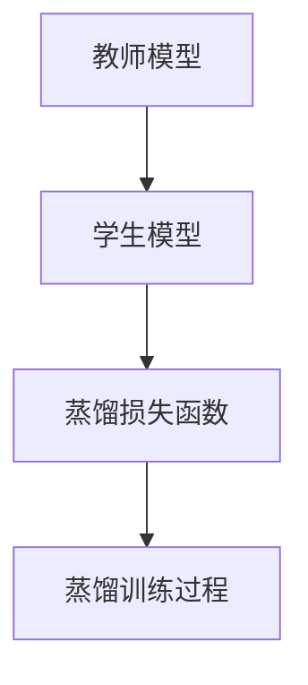

                 

# 知识蒸馏中的温度参数调节技巧

> 关键词：知识蒸馏, 温度参数, 正则化, 模型压缩, 蒸馏损失函数

## 1. 背景介绍

在机器学习领域，知识蒸馏（Knowledge Distillation）技术已经成为了提升模型性能的重要手段。该技术通过将复杂模型（教师模型）的知识传递给简单模型（学生模型），使得学生模型能够更好地泛化到新的数据，同时减少了计算资源和内存占用。知识蒸馏的核心在于构建一个能反映教师模型知识表示能力的损失函数，并将学生模型训练目标设置为最小化该损失。然而，在实际应用中，这个损失函数的调节往往依赖于一个重要的超参数——温度参数（temperature）。温度参数不仅影响蒸馏过程的稳定性，还直接影响最终蒸馏模型的性能。本文将详细介绍知识蒸馏中的温度参数调节技巧，帮助读者更好地理解这一关键技术，并探索其在深度学习中的潜在应用。

## 2. 核心概念与联系

### 2.1 核心概念概述

知识蒸馏是一种模型迁移学习的技术，旨在将教师模型的知识迁移到学生模型中。在知识蒸馏中，知识可以通过直接传递（Hard Temperature）或间接传递（Soft Temperature）两种方式进行，其中温度参数是一个重要的超参数，用于控制知识的传递强度。

- **温度参数**：用于调整知识蒸馏中知识传递的强度。在Hard Temperature中，温度参数直接决定知识传递的阈值；而在Soft Temperature中，温度参数影响知识传递的概率分布。

- **正则化**：在知识蒸馏中，正则化项用于减少学生模型中的过拟合现象，增强模型的泛化能力。

- **模型压缩**：通过知识蒸馏，可以将大模型的复杂度降低，提高模型推理速度，减少计算资源和内存占用。

- **蒸馏损失函数**：知识蒸馏的核心在于构建一个合理的蒸馏损失函数，该函数需要平衡教师模型和学生模型之间的关系，使得学生模型能最大化地继承教师模型的知识。

### 2.2 核心概念原理和架构的 Mermaid 流程图

## 3. 核心算法原理 & 具体操作步骤

### 3.1 算法原理概述

在知识蒸馏中，温度参数主要用于控制知识从教师模型向学生模型的传递。温度参数越高，表示知识传递越广，模型的泛化能力越强；反之，温度参数越低，表示知识传递越精确，模型的复杂度越低。知识蒸馏的目标是找到一个合适的温度参数，使得学生模型在保留教师模型知识的同时，尽量减少复杂度，从而提高推理速度和泛化能力。

### 3.2 算法步骤详解

知识蒸馏中的温度参数调节一般包括以下几个关键步骤：

1. **选择教师模型和学生模型**：选择合适的教师模型和学生模型，确保教师模型足够复杂，能够提供丰富的知识。
2. **设计蒸馏损失函数**：根据具体任务，设计合理的蒸馏损失函数，确保知识传递的有效性。
3. **确定温度参数**：在训练过程中，动态调整温度参数，找到最佳的温度值。
4. **训练学生模型**：根据蒸馏损失函数，训练学生模型，使其最大化继承教师模型的知识。
5. **评估和优化**：在训练过程中，周期性地评估学生模型的性能，调整温度参数，直到达到最优。

### 3.3 算法优缺点

**优点**：

1. **提高模型泛化能力**：通过知识蒸馏，学生模型能够更好地泛化到新的数据集。
2. **减少计算资源和内存占用**：通过模型压缩，将复杂模型变为简单模型，减少了计算资源和内存占用。
3. **增强模型稳定性**：合理的温度参数调节能够增强模型的稳定性，避免过拟合现象。

**缺点**：

1. **选择难度较大**：选择合适的教师模型和学生模型，以及设计合理的蒸馏损失函数，需要丰富的经验和专业知识。
2. **温度参数调节复杂**：温度参数的调节需要仔细平衡，过高的温度可能导致知识丢失，过低的温度可能导致模型复杂度增加。
3. **模型性能波动**：温度参数的不当调节可能导致模型性能波动，影响最终的蒸馏效果。

### 3.4 算法应用领域

知识蒸馏技术已经在图像分类、自然语言处理、语音识别等多个领域得到了广泛应用，为模型迁移学习提供了有效的工具。在深度学习中，知识蒸馏已成为提升模型性能的重要手段之一。

## 4. 数学模型和公式 & 详细讲解 & 举例说明

### 4.1 数学模型构建

在知识蒸馏中，蒸馏损失函数的设计是关键。常见的蒸馏损失函数包括KL散度、交叉熵等。本节将以KL散度为基础，构建蒸馏损失函数，并推导其温度参数的影响。

### 4.2 公式推导过程

设教师模型为 $P_{\theta}$，学生模型为 $Q_{\phi}$，温度参数为 $T$。蒸馏损失函数定义为：

$$
\mathcal{L}_{distill}(Q_{\phi}, P_{\theta}, T) = \mathcal{L}_{KL}(Q_{\phi}, P_{\theta}) = \frac{1}{N}\sum_{i=1}^N KL(Q_{\phi}(y_i|x_i), P_{\theta}(y_i|x_i))
$$

其中 $N$ 为样本数量，$x_i$ 为输入，$y_i$ 为标签，$P_{\theta}(y_i|x_i)$ 表示教师模型在输入 $x_i$ 下的预测概率，$Q_{\phi}(y_i|x_i)$ 表示学生模型在输入 $x_i$ 下的预测概率，$K$ 为KL散度。

在蒸馏过程中，温度参数 $T$ 直接影响知识传递的强度。当 $T$ 较高时，知识传递的强度增加，学生模型更加倾向于学习教师模型的预测分布；当 $T$ 较低时，知识传递的强度减弱，学生模型更加倾向于学习教师模型的决策边界。

### 4.3 案例分析与讲解

以图像分类为例，教师模型和学生模型分别为卷积神经网络（CNN）和轻量级CNN。通过调整温度参数 $T$，观察学生模型在不同温度下的性能变化。

1. **高温度**：设置 $T=10$，观察学生模型的分类准确率。
2. **中温度**：设置 $T=1$，观察学生模型的分类准确率。
3. **低温度**：设置 $T=0.1$，观察学生模型的分类准确率。

通过对比，可以看到，随着温度参数的降低，学生模型的分类准确率逐渐提高，但推理速度变慢，模型复杂度增加。

## 5. 项目实践：代码实例和详细解释说明

### 5.1 开发环境搭建

在进行知识蒸馏项目实践前，需要先准备好开发环境。以下是使用Python进行TensorFlow开发的环

