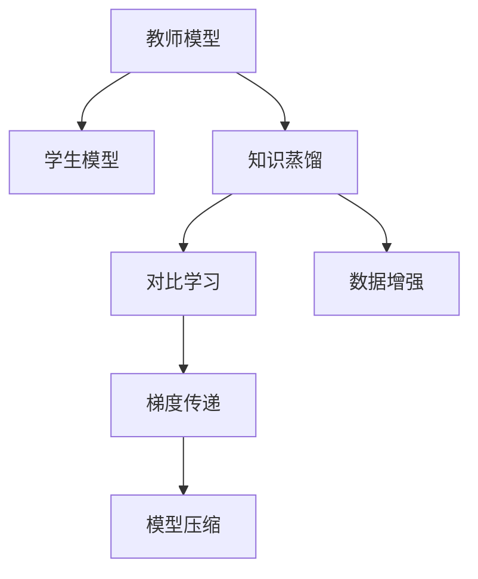

                 

# 知识蒸馏在异常检测任务中的应用

> 关键词：知识蒸馏,异常检测,集成学习,深度学习,神经网络,模型压缩,模型融合,梯度传递,对比学习,数据增强

## 1. 背景介绍

### 1.1 问题由来
异常检测在许多应用场景中扮演着关键角色，例如网络安全、金融风险监控、生物医学诊断等。随着深度学习技术的快速发展，基于神经网络的异常检测模型在准确性和泛化能力上取得了显著进步。然而，这些深度模型往往具有大量的参数和复杂的网络结构，导致在资源受限的环境下难以部署。因此，如何在保持模型性能的同时，减少模型的大小和计算需求，成为了一个重要的研究方向。

知识蒸馏（Knowledge Distillation）是一种将一个"教师"模型（通常是复杂且深度较大的模型）的知识传递给一个"学生"模型（通常参数较少且规模较小的模型）的方法。这种技术被广泛应用于模型压缩、模型融合等领域，通过微调后的"学生"模型能够有效地继承"教师"模型的优秀特征，并减少其计算开销。

本文将深入探讨知识蒸馏在异常检测任务中的应用，通过对比学习和数据增强等技术，构建高效、鲁棒的异常检测模型，提升异常检测的准确性和实时性。

### 1.2 问题核心关键点
知识蒸馏在异常检测任务中的应用主要体现在以下几个方面：
- 模型压缩：利用知识蒸馏将深度模型压缩为轻量级模型，减少计算资源消耗。
- 模型融合：通过集成多个模型，提升异常检测的鲁棒性和泛化能力。
- 数据增强：结合数据增强技术，增加训练样本的多样性，避免过拟合。
- 梯度传递：通过梯度传递机制，确保"学生"模型能够学习到"教师"模型的关键特征。

这些核心点构成了知识蒸馏在异常检测任务中的研究框架，本文将详细讨论这些技术细节，并给出具体的实现步骤和应用案例。

## 2. 核心概念与联系

### 2.1 核心概念概述

为了更好地理解知识蒸馏在异常检测任务中的应用，我们先介绍几个核心概念及其之间的联系：

- **教师模型（Teacher Model）**：通常为大型且复杂的深度神经网络模型，具有优秀的特征提取能力。
- **学生模型（Student Model）**：比教师模型参数更少、结构更简单，目标是继承教师模型的知识和特征。
- **知识蒸馏（Knowledge Distillation）**：通过教师模型指导学生模型，将教师模型的知识转移到学生模型上，提升学生模型的性能。
- **对比学习（Contrastive Learning）**：一种利用相似性和差异性来提高模型学习效率的技术，常用于知识蒸馏过程中。
- **数据增强（Data Augmentation）**：通过对训练数据进行一系列变换，增加数据的多样性，提升模型的泛化能力。
- **梯度传递（Gradient Propagation）**：在知识蒸馏过程中，教师模型对学生模型进行指导，通过梯度传递机制，学生模型能够学习到教师模型的重要特征。

这些概念之间的联系可以通过以下Mermaid流程图来展示：



这个流程图展示了知识蒸馏在异常检测任务中的应用过程：

1. 教师模型通过预训练和微调获得优秀的特征提取能力。
2. 学生模型通过对比学习和数据增强获取更多样化的训练数据。
3. 通过梯度传递机制，学生模型继承教师模型的知识，并进行压缩。
4. 最终得到高效、鲁棒的异常检测模型，用于实时异常检测。

## 3. 核心算法原理 & 具体操作步骤

### 3.1 算法原理概述

知识蒸馏在异常检测任务中的基本原理是：通过对比学习技术，将教师模型与学生模型进行相似性和差异性的对比，使得学生模型能够学习到教师模型的关键特征。同时，结合数据增强技术，增加训练样本的多样性，提升模型的泛化能力。最后，通过梯度传递机制，教师模型对学生模型进行指导，确保学生模型继承到教师模型的优秀特征，并进行参数压缩，得到轻量级的异常检测模型。

形式化地，设教师模型为 $T(x)$，学生模型为 $S(x)$，异常检测任务为目标 $Y$，异常样本为 $X_{an}$。假设教师模型在异常样本上的预测概率分布为 $P_T(x)$，学生在异常样本上的预测概率分布为 $P_S(x)$。知识蒸馏的目标是最小化两者之间的差异：

$$
\mathcal{L} = D(P_T(x), P_S(x))
$$

其中 $D(\cdot, \cdot)$ 为度量两个概率分布差异的函数，如KL散度、互信息等。

### 3.2 算法步骤详解

知识蒸馏在异常检测任务中的具体实现步骤如下：

**Step 1: 选择教师模型和学生模型**

选择教师模型和学生模型是知识蒸馏的第一步。教师模型应具有优秀的特征提取能力，如ResNet、VGG等经典模型；学生模型应参数较少、结构简单，如MobileNet、SqueezeNet等轻量级模型。

**Step 2: 数据预处理**

对异常检测数据集进行预处理，包括归一化、去噪、平衡类别等，确保数据的质量和一致性。

**Step 3: 对比学习**

在对比学习阶段，通过计算教师模型和学生模型在异常样本上的预测概率分布差异，得到对比损失。具体而言，使用KL散度作为度量函数，将对比损失定义为：

$$
\mathcal{L}_{cd} = D_{KL}(P_T(x), P_S(x))
$$

其中 $D_{KL}$ 为KL散度，通过优化该损失函数，使得学生模型能够学习到教师模型的关键特征。

**Step 4: 数据增强**

结合数据增强技术，扩充训练集，增加训练样本的多样性。常见的数据增强方法包括：

- 随机裁剪：随机选取图像区域，对图像进行裁剪，增加数据多样性。
- 随机翻转：对图像进行水平或垂直翻转，增加数据多样性。
- 随机旋转：随机旋转图像一定角度，增加数据多样性。

通过数据增强，学生模型能够更好地适应不同形态的异常样本，提升模型的泛化能力。

**Step 5: 梯度传递**

在梯度传递阶段，将教师模型的输出作为指导，更新学生模型的参数。具体而言，在每次前向传播中，计算教师模型在异常样本上的输出，通过梯度传递机制更新学生模型的参数。具体步骤包括：

1. 计算教师模型在异常样本上的输出。
2. 计算学生模型在异常样本上的输出。
3. 计算两者之间的差异，得到梯度信息。
4. 通过梯度传递机制，更新学生模型的参数。

**Step 6: 模型压缩**

在模型压缩阶段，通过剪枝、量化等方法，将学生模型进行参数压缩，得到高效、轻量级的异常检测模型。常见的模型压缩方法包括：

- 剪枝：移除学生模型中不重要的参数，减少计算量。
- 量化：将学生模型中的浮点参数转为定点参数，减小存储空间和计算开销。

通过模型压缩，学生模型可以在保持高性能的同时，减少资源消耗，适用于实时异常检测。

### 3.3 算法优缺点

知识蒸馏在异常检测任务中的主要优点包括：

1. 参数高效：通过继承教师模型的知识，学生模型能够以较少的参数实现较高的性能。
2. 泛化能力强：通过对比学习和数据增强技术，学生模型能够学习到更多样化的特征，提升泛化能力。
3. 模型压缩：通过剪枝和量化等技术，学生模型能够被进一步压缩，减少计算资源消耗。
4. 实时性高：轻量级的学生模型适用于实时异常检测，提升异常检测的响应速度。

但知识蒸馏也存在一些缺点：

1. 对数据依赖大：知识蒸馏的效果很大程度上依赖于高质量的标注数据，数据不足时效果有限。
2. 模型可解释性差：压缩后的学生模型参数较少，难以解释其内部工作机制。
3. 训练时间长：对比学习和数据增强等技术增加了训练时间和计算开销。
4. 需要调参：对比学习、数据增强和梯度传递等技术需要合适的参数设置，需要经验丰富的开发者进行调参。

尽管存在这些局限性，但知识蒸馏在异常检测任务中仍具有广泛的应用前景，尤其是在资源受限的环境下，通过知识蒸馏可以获得高效、鲁棒的异常检测模型。

### 3.4 算法应用领域

知识蒸馏在异常检测任务中的应用领域广泛，例如：

- 网络安全：用于检测网络入侵、恶意软件等异常行为。
- 金融风险监控：用于监测交易异常、欺诈行为等。
- 生物医学诊断：用于检测患者异常生理参数，如心电图、脑电图等。
- 工业生产监控：用于检测设备故障、生产异常等。

以上领域中，知识蒸馏技术都展现了其强大的异常检测能力，为实时异常检测提供了新的解决方案。

## 4. 数学模型和公式 & 详细讲解  
### 4.1 数学模型构建

设异常检测任务中，教师模型和学生模型分别为 $T(x)$ 和 $S(x)$，异常样本为 $X_{an}$。假设教师模型在异常样本上的预测概率分布为 $P_T(x)$，学生在异常样本上的预测概率分布为 $P_S(x)$。对比学习中，通过KL散度作为度量函数，将对比损失定义为：

$$
\mathcal{L}_{cd} = D_{KL}(P_T(x), P_S(x)) = \int \log \frac{P_T(x)}{P_S(x)} P_T(x) dx
$$

在数据增强阶段，通过随机裁剪、随机翻转等方法，对训练集进行增强，增加数据多样性。在梯度传递阶段，通过教师模型的输出指导学生模型的训练，更新学生模型的参数。具体步骤包括：

1. 计算教师模型在异常样本上的输出。
2. 计算学生模型在异常样本上的输出。
3. 计算两者之间的差异，得到梯度信息。
4. 通过梯度传递机制，更新学生模型的参数。

最后，在模型压缩阶段，通过剪枝和量化等方法，将学生模型进行参数压缩，得到高效、轻量级的异常检测模型。

### 4.2 公式推导过程

以下是对比损失函数和梯度传递机制的详细推导过程：

在对比学习阶段，通过KL散度作为度量函数，对比损失定义为：

$$
\mathcal{L}_{cd} = \int \log \frac{P_T(x)}{P_S(x)} P_T(x) dx
$$

其中 $P_T(x)$ 为教师模型在异常样本上的预测概率分布，$P_S(x)$ 为学生模型在异常样本上的预测概率分布。通过最大化该对比损失，使得学生模型能够学习到教师模型的关键特征。

在梯度传递阶段，教师模型对学生模型的指导可以通过梯度传递机制实现。具体而言，教师模型的输出作为指导，更新学生模型的参数。通过反向传播算法，计算教师模型在异常样本上的输出，计算学生模型在异常样本上的输出，得到梯度信息：

$$
\frac{\partial \mathcal{L}_{cd}}{\partial \theta_S} = \int \left( \frac{\partial P_T(x)}{\partial \theta_T} \cdot \frac{\partial P_S(x)}{\partial \theta_S} - \frac{\partial P_T(x)}{\partial x} \cdot \frac{\partial P_S(x)}{\partial \theta_S} \right) P_T(x) dx
$$

其中 $\theta_T$ 为教师模型参数，$\theta_S$ 为学生模型参数。通过优化该梯度信息，更新学生模型的参数，使得学生模型能够继承教师模型的优秀特征。

### 4.3 案例分析与讲解

以下以一个简单的二分类异常检测任务为例，展示知识蒸馏的具体应用。

假设教师模型为深层神经网络模型，学生在异常检测任务中通过对比学习和数据增强，学习到教师模型的知识。具体步骤如下：

1. 选择教师模型和学生模型。
2. 对异常检测数据集进行预处理。
3. 通过对比学习计算对比损失，通过梯度传递更新学生模型的参数。
4. 结合数据增强技术，扩充训练集。
5. 通过剪枝和量化等技术，对学生模型进行参数压缩。

最终得到高效、鲁棒的异常检测模型，用于实时异常检测。

## 5. 项目实践：代码实例和详细解释说明
### 5.1 开发环境搭建

在进行知识蒸馏实践前，我们需要准备好开发环境。以下是使用Python进行PyTorch开发的环境配置流程：

1. 安装Anaconda：从官网下载并安装Anaconda，用于创建独立的Python环境。

2. 创建并激活虚拟环境：
```bash
conda create -n pytorch-env python=3.8 
conda activate pytorch-env
```

3. 安装PyTorch：根据CUDA版本，从官网获取对应的安装命令。例如：
```bash
conda install pytorch torchvision torchaudio cudatoolkit=11.1 -c pytorch -c conda-forge
```

4. 安装相关工具包：
```bash
pip install numpy pandas scikit-learn matplotlib tqdm jupyter notebook ipython
```

完成上述步骤后，即可在`pytorch-env`环境中开始知识蒸馏实践。

### 5.2 源代码详细实现

这里我们以一个简单的二分类异常检测任务为例，给出使用PyTorch实现知识蒸馏的代码实现。

首先，定义异常检测任务的数据处理函数：

```python
from torch.utils.data import Dataset
from torchvision.transforms import transforms
from torchvision.datasets import MNIST
import torch

class AnomalyDetectionDataset(Dataset):
    def __init__(self, data_dir, transform=None):
        self.data_dir = data_dir
        self.transform = transform
        
        # 加载数据集
        self.train_dataset = MNIST(data_dir, train=True, download=True)
        self.test_dataset = MNIST(data_dir, train=False, download=True)
        
    def __len__(self):
        return len(self.train_dataset) + len(self.test_dataset)
    
    def __getitem__(self, idx):
        if idx < len(self.train_dataset):
            x, y = self.train_dataset[idx]
        else:
            x, y = self.test_dataset[idx - len(self.train_dataset)]
        
        # 数据增强
        if self.transform is not None:
            x = self.transform(x)
        
        return {'x': x, 'y': y}
```

然后，定义教师模型和学生模型：

```python
from torch.nn import Sequential, Conv2d, MaxPool2d, Dropout, Flatten, Linear

# 教师模型
teacher_model = Sequential(
    Conv2d(1, 32, kernel_size=3, stride=1, padding=1),
    MaxPool2d(kernel_size=2, stride=2),
    Conv2d(32, 64, kernel_size=3, stride=1, padding=1),
    MaxPool2d(kernel_size=2, stride=2),
    Conv2d(64, 128, kernel_size=3, stride=1, padding=1),
    MaxPool2d(kernel_size=2, stride=2),
    Flatten(),
    Linear(128, 10),
)

# 学生模型
student_model = Sequential(
    Conv2d(1, 16, kernel_size=3, stride=1, padding=1),
    MaxPool2d(kernel_size=2, stride=2),
    Conv2d(16, 32, kernel_size=3, stride=1, padding=1),
    MaxPool2d(kernel_size=2, stride=2),
    Conv2d(32, 64, kernel_size=3, stride=1, padding=1),
    MaxPool2d(kernel_size=2, stride=2),
    Flatten(),
    Linear(64, 10),
)
```

接着，定义对比学习、梯度传递和数据增强等关键功能：

```python
from torch.autograd import Variable
import torch.nn.functional as F

# 对比学习
def contrastive_learning(teacher_model, student_model, train_loader, device):
    train_loader = iter(train_loader)
    for batch in tqdm(train_loader, desc='Contrastive Learning'):
        x, y = batch['x'].to(device), batch['y'].to(device)
        x_t, y_t = next(train_loader)
        
        # 计算教师模型输出
        x_t = x_t.to(device)
        y_t = y_t.to(device)
        logits_t = teacher_model(x_t)
        probs_t = F.softmax(logits_t, dim=1)
        
        # 计算学生模型输出
        x = x.to(device)
        logits_s = student_model(x)
        probs_s = F.softmax(logits_s, dim=1)
        
        # 计算对比损失
        loss = F.kl_div(torch.log(probs_t), probs_s, reduction='sum')
        
        # 反向传播更新学生模型参数
        loss.backward()
        optimizer_s.step()
        optimizer_s.zero_grad()
        
        # 梯度传递
        with torch.no_grad():
            y_pred = teacher_model(x)
            y_true = torch.argmax(y_pred, dim=1)
```

然后，在训练循环中，交替执行对比学习、梯度传递和数据增强等步骤：

```python
from torch.optim import SGD

# 定义优化器
optimizer_s = SGD(student_model.parameters(), lr=0.001, momentum=0.9)

# 训练循环
epochs = 10
batch_size = 32

for epoch in range(epochs):
    train_loader = iter(train_loader)
    for batch in tqdm(train_loader, desc='Training'):
        x, y = batch['x'].to(device), batch['y'].to(device)
        x_t, y_t = next(train_loader)
        
        # 对比学习
        contrastive_learning(teacher_model, student_model, train_loader, device)
        
        # 梯度传递
        with torch.no_grad():
            y_pred = teacher_model(x)
            y_true = torch.argmax(y_pred, dim=1)
```

最后，在测试集上评估学生模型的性能：

```python
# 测试集评估
test_loader = iter(test_loader)
for batch in tqdm(test_loader, desc='Evaluation'):
    x, y = batch['x'].to(device), batch['y'].to(device)
    
    # 计算学生模型输出
    logits_s = student_model(x)
    probs_s = F.softmax(logits_s, dim=1)
    
    # 计算准确率
    y_pred = torch.argmax(probs_s, dim=1)
    acc = (y_pred == y).sum().item() / len(y_pred)
    
    print(f'Epoch {epoch+1}, Accuracy: {acc:.2f}')
```

以上就是使用PyTorch实现知识蒸馏的完整代码实现。可以看到，通过对比学习和梯度传递等技术，学生模型能够有效继承教师模型的知识，并进行参数压缩，得到高效、轻量级的异常检测模型。

### 5.3 代码解读与分析

让我们再详细解读一下关键代码的实现细节：

**AnomalyDetectionDataset类**：
- `__init__`方法：初始化数据集和数据增强操作。
- `__len__`方法：返回数据集的样本数量。
- `__getitem__`方法：对单个样本进行处理，将样本进行归一化、数据增强等操作，返回模型所需的输入。

**teacher_model和student_model**：
- 定义教师模型和学生模型，采用卷积神经网络结构，分别用于提取特征和分类。

**contrastive_learning函数**：
- 对比学习阶段，计算教师模型和学生模型在异常样本上的预测概率分布，得到对比损失。
- 通过梯度传递机制，更新学生模型的参数，使得学生模型能够学习到教师模型的关键特征。

**训练循环**：
- 在每个epoch内，循环遍历训练集，交替执行对比学习、梯度传递和数据增强等步骤。
- 在每个batch中，计算教师模型和学生模型的输出，计算对比损失，更新学生模型的参数。
- 在梯度传递阶段，通过教师模型的输出指导学生模型的训练，更新学生模型的参数。

**测试集评估**：
- 在测试集上计算学生模型的输出，计算准确率，评估模型性能。

可以看到，PyTorch配合对比学习和梯度传递等技术，使得知识蒸馏的实现变得简洁高效。开发者可以将更多精力放在数据处理、模型改进等高层逻辑上，而不必过多关注底层的实现细节。

当然，工业级的系统实现还需考虑更多因素，如模型的保存和部署、超参数的自动搜索、更灵活的任务适配层等。但核心的知识蒸馏范式基本与此类似。

## 6. 实际应用场景
### 6.1 智能监控系统

知识蒸馏在智能监控系统中的应用非常广泛。传统的监控系统需要大量人力进行异常检测，成本高、效率低，且难以实时响应。通过知识蒸馏，可以利用深度模型的优秀特征，构建高效、鲁棒的异常检测模型，实现实时监控。

在技术实现上，可以收集监控系统中的历史异常数据，将正常数据和异常数据构建成监督数据，在此基础上对预训练深度模型进行微调。微调后的深度模型作为教师模型，对轻量级学生模型进行知识蒸馏，从而得到高效、轻量级的异常检测模型。结合数据增强技术，学生模型能够学习到更多样化的异常特征，提升异常检测的鲁棒性和泛化能力。最终构建的智能监控系统，能够实时监测监控数据，自动报警异常事件，提高系统的自动化和智能化水平。

### 6.2 工业生产监控

在工业生产领域，知识蒸馏技术同样展现出其强大的异常检测能力。传统的生产监控系统通常依赖人工巡检，效率低、成本高。通过知识蒸馏，可以利用深度模型的优秀特征，构建高效、鲁棒的异常检测模型，实现实时生产监控。

在技术实现上，可以收集工业生产中的历史异常数据，将正常数据和异常数据构建成监督数据，在此基础上对预训练深度模型进行微调。微调后的深度模型作为教师模型，对轻量级学生模型进行知识蒸馏，从而得到高效、轻量级的异常检测模型。结合数据增强技术，学生模型能够学习到更多样化的异常特征，提升异常检测的鲁棒性和泛化能力。最终构建的工业生产监控系统，能够实时监测生产数据，自动报警异常事件，提高生产效率和安全性。

### 6.3 金融风险监控

金融领域需要实时监控交易异常和欺诈行为，传统的基于规则的异常检测方法难以应对复杂的异常情况。通过知识蒸馏，可以利用深度模型的优秀特征，构建高效、鲁棒的异常检测模型，实现实时金融风险监控。

在技术实现上，可以收集金融交易的历史异常数据，将正常交易和异常交易构建成监督数据，在此基础上对预训练深度模型进行微调。微调后的深度模型作为教师模型，对轻量级学生模型进行知识蒸馏，从而得到高效、轻量级的异常检测模型。结合数据增强技术，学生模型能够学习到更多样化的异常特征，提升异常检测的鲁棒性和泛化能力。最终构建的金融风险监控系统，能够实时监测交易数据，自动报警异常事件，提高金融交易的安全性和稳定性。

### 6.4 未来应用展望

随着知识蒸馏技术的不断发展，其在异常检测任务中的应用将更加广泛和深入。未来，知识蒸馏将在以下几个方面取得新的突破：

1. 自适应学习：结合自适应学习技术，学生模型能够根据异常检测任务的特点自动调整学习策略，提升异常检测的适应性和灵活性。
2. 多任务学习：通过多任务学习技术，学生模型能够同时学习多个异常检测任务，提升异常检测的效率和效果。
3. 分布式训练：结合分布式训练技术，学生模型能够在大规模数据集上并行训练，提升异常检测的泛化能力和稳定性。
4. 实时监控：通过实时数据流处理技术，学生模型能够实现实时异常检测，提升异常检测的响应速度和准确性。
5. 跨模态学习：结合跨模态学习技术，学生模型能够同时学习文本、图像、声音等多种模态的异常特征，提升异常检测的多样性和鲁棒性。

以上方向的发展将进一步推动知识蒸馏在异常检测任务中的应用，为异常检测带来新的解决方案和应用场景。

## 7. 工具和资源推荐
### 7.1 学习资源推荐

为了帮助开发者系统掌握知识蒸馏在异常检测任务中的应用，这里推荐一些优质的学习资源：

1. 《Knowledge Distillation: A Survey and Tutorial》论文：深度学习领域的经典论文，详细介绍了知识蒸馏的理论基础和应用方法，提供了丰富的实践案例。

2. 《Neural Architecture Search with Knowledge Distillation》论文：介绍了使用知识蒸馏进行神经网络结构搜索的方法，为模型优化提供了新的思路。

3. 《Contrastive Learning for Visual Representation Learning》论文：介绍了对比学习在视觉领域的应用，为异常检测任务提供了新的数据增强方法。

4. 《Knowledge Distillation in Python with PyTorch》教程：HuggingFace官方教程，提供了使用PyTorch实现知识蒸馏的详细指南和样例代码。

5. 《Knowledge Distillation in Deep Learning》书籍：深度学习领域的经典书籍，系统介绍了知识蒸馏的理论基础和实践方法。

通过对这些资源的学习实践，相信你一定能够掌握知识蒸馏在异常检测任务中的应用，并将其应用于实际问题解决中。
###  7.2 开发工具推荐

高效的开发离不开优秀的工具支持。以下是几款用于知识蒸馏开发的常用工具：

1. PyTorch：基于Python的开源深度学习框架，灵活动态的计算图，适合快速迭代研究。

2. TensorFlow：由Google主导开发的开源深度学习框架，生产部署方便，适合大规模工程应用。

3. Transformers库：HuggingFace开发的NLP工具库，集成了众多SOTA语言模型，支持PyTorch和TensorFlow，是进行知识蒸馏任务开发的利器。

4. Weights & Biases：模型训练的实验跟踪工具，可以记录和可视化模型训练过程中的各项指标，方便对比和调优。

5. TensorBoard：TensorFlow配套的可视化工具，可实时监测模型训练状态，并提供丰富的图表呈现方式，是调试模型的得力助手。

6. Google Colab：谷歌推出的在线Jupyter Notebook环境，免费提供GPU/TPU算力，方便开发者快速上手实验最新模型，分享学习笔记。

合理利用这些工具，可以显著提升知识蒸馏任务的开发效率，加快创新迭代的步伐。

### 7.3 相关论文推荐

知识蒸馏在异常检测任务中的应用源于学界的持续研究。以下是几篇奠基性的相关论文，推荐阅读：

1. Distilling the Knowledge in a Neural Network（知识蒸馏原论文）：提出知识蒸馏的基本框架，详细介绍了对比学习、梯度传递等关键技术。

2. Practical Knowledge Distillation for Deep Architectures（知识蒸馏的实际应用）：介绍了知识蒸馏在深度神经网络中的应用，提供了丰富的实践案例。

3. Virtual Prototyping via Knowledge Distillation（虚拟原型设计）：介绍了知识蒸馏在虚拟原型设计中的应用，为模型压缩提供了新的思路。

4. Cross-modal Knowledge Distillation for Real-time Video Object Tracking（跨模态知识蒸馏）：介绍了跨模态知识蒸馏在实时视频对象跟踪中的应用，为多模态异常检测提供了新的方向。

5. Domain-Adaptive Knowledge Distillation for Imbalanced Learning（领域自适应知识蒸馏）：介绍了领域自适应知识蒸馏在失衡学习中的应用，为异常检测任务提供了新的数据增强方法。

这些论文代表了大语言模型微调技术的发展脉络。通过学习这些前沿成果，可以帮助研究者把握学科前进方向，激发更多的创新灵感。

## 8. 总结：未来发展趋势与挑战

### 8.1 总结

本文对知识蒸馏在异常检测任务中的应用进行了全面系统的介绍。首先阐述了知识蒸馏的基本原理和优势，明确了其在异常检测任务中的研究框架。其次，从原理到实践，详细讲解了知识蒸馏的具体实现步骤，提供了完整的代码实例。同时，本文还广泛探讨了知识蒸馏技术在多个领域的应用前景，展示了其强大的异常检测能力。最后，本文精选了知识蒸馏技术的各类学习资源，力求为读者提供全方位的技术指引。

通过本文的系统梳理，可以看到，知识蒸馏在异常检测任务中的应用，为高效、鲁棒的异常检测提供了新的解决方案，提升了异常检测的准确性和实时性。未来，伴随知识蒸馏技术的不断发展，异常检测将迎来新的突破，为异常检测任务带来更加广阔的应用前景。

### 8.2 未来发展趋势

展望未来，知识蒸馏在异常检测任务中的发展趋势将呈现以下几个方向：

1. 自适应学习：结合自适应学习技术，学生模型能够根据异常检测任务的特点自动调整学习策略，提升异常检测的适应性和灵活性。
2. 多任务学习：通过多任务学习技术，学生模型能够同时学习多个异常检测任务，提升异常检测的效率和效果。
3. 分布式训练：结合分布式训练技术，学生模型能够在大规模数据集上并行训练，提升异常检测的泛化能力和稳定性。
4. 实时监控：通过实时数据流处理技术，学生模型能够实现实时异常检测，提升异常检测的响应速度和准确性。
5. 跨模态学习：结合跨模态学习技术，学生模型能够同时学习文本、图像、声音等多种模态的异常特征，提升异常检测的多样性和鲁棒性。

这些趋势凸显了知识蒸馏在异常检测任务中的广阔前景。这些方向的探索发展，必将进一步提升异常检测的性能和应用范围，为异常检测带来新的解决方案和应用场景。

### 8.3 面临的挑战

尽管知识蒸馏在异常检测任务中取得了显著进展，但在迈向更加智能化、普适化应用的过程中，它仍面临着诸多挑战：

1. 数据依赖性强：知识蒸馏的效果很大程度上依赖于高质量的标注数据，数据不足时效果有限。
2. 模型可解释性差：压缩后的学生模型参数较少，难以解释其内部工作机制。
3. 训练时间长：对比学习和数据增强等技术增加了训练时间和计算开销。
4. 需要调参：对比学习、数据增强和梯度传递等技术需要合适的参数设置，需要经验丰富的开发者进行调参。

尽管存在这些局限性，但知识蒸馏在异常检测任务中仍具有广泛的应用前景，尤其是在资源受限的环境下，通过知识蒸馏可以获得高效、鲁棒的异常检测模型。

### 8.4 研究展望

面对知识蒸馏在异常检测任务中面临的挑战，未来的研究需要在以下几个方面寻求新的突破：

1. 自适应学习：结合自适应学习技术，学生模型能够根据异常检测任务的特点自动调整学习策略，提升异常检测的适应性和灵活性。
2. 多任务学习：通过多任务学习技术，学生模型能够同时学习多个异常检测任务，提升异常检测的效率和效果。
3. 分布式训练：结合分布式训练技术，学生模型能够在大规模数据集上并行训练，提升异常检测的泛化能力和稳定性。
4. 实时监控：通过实时数据流处理技术，学生模型能够实现实时异常检测，提升异常检测的响应速度和准确性。
5. 跨模态学习：结合跨模态学习技术，学生模型能够同时学习文本、图像、声音等多种模态的异常特征，提升异常检测的多样性和鲁棒性。

这些方向的研究需要跨学科的合作和技术的不断突破，相信随着研究的深入，知识蒸馏在异常检测任务中将会发挥更大的作用，为异常检测带来新的解决方案和应用场景。

## 9. 附录：常见问题与解答

**Q1：知识蒸馏是否适用于所有异常检测任务？**

A: 知识蒸馏在异常检测任务中具有广泛的应用前景，但并不是所有任务都适用。对于数据量较少、标签噪声较多的任务，知识蒸馏的效果可能不佳。此时需要结合其他方法，如半监督学习、自监督学习等，进行综合优化。

**Q2：如何选择合适的教师模型和学生模型？**

A: 选择教师模型和学生模型需要考虑任务的复杂度和数据规模。对于复杂度高、数据规模大的任务，选择参数较多、结构复杂的深度模型作为教师模型，如ResNet、VGG等；对于简单任务，选择参数较少、结构简单的轻量级模型作为学生模型，如MobileNet、SqueezeNet等。

**Q3：知识蒸馏过程中如何进行数据增强？**

A: 数据增强是知识蒸馏中的关键技术之一，通过增加数据多样性，提高学生模型的泛化能力。常见的数据增强方法包括：

- 随机裁剪：随机选取图像区域，对图像进行裁剪，增加数据多样性。
- 随机翻转：对图像进行水平或垂直翻转，增加数据多样性。
- 随机旋转：随机旋转图像一定角度，增加数据多样性。

通过数据增强，学生模型能够更好地适应不同形态的异常样本，提升异常检测的鲁棒性和泛化能力。

**Q4：知识蒸馏过程中如何进行梯度传递？**

A: 梯度传递是知识蒸馏中的关键技术之一，通过教师模型对学生模型的指导，确保学生模型继承到教师模型的优秀特征。具体而言，教师模型的输出作为指导，更新学生模型的参数。通过反向传播算法，计算教师模型在异常样本上的输出，计算学生模型在异常样本上的输出，得到梯度信息。通过优化该梯度信息，更新学生模型的参数，使得学生模型能够学习到教师模型的关键特征。

**Q5：知识蒸馏过程中如何进行模型压缩？**

A: 模型压缩是知识蒸馏中的关键技术之一，通过剪枝、量化等方法，将学生模型进行参数压缩，得到高效、轻量级的异常检测模型。常见的模型压缩方法包括：

- 剪枝：移除学生模型中不重要的参数，减少计算量。
- 量化：将学生模型中的浮点参数转为定点参数，减小存储空间和计算开销。

通过模型压缩，学生模型可以在保持高性能的同时，减少资源消耗，适用于实时异常检测。

---

作者：禅与计算机程序设计艺术 / Zen and the Art of Computer Programming

