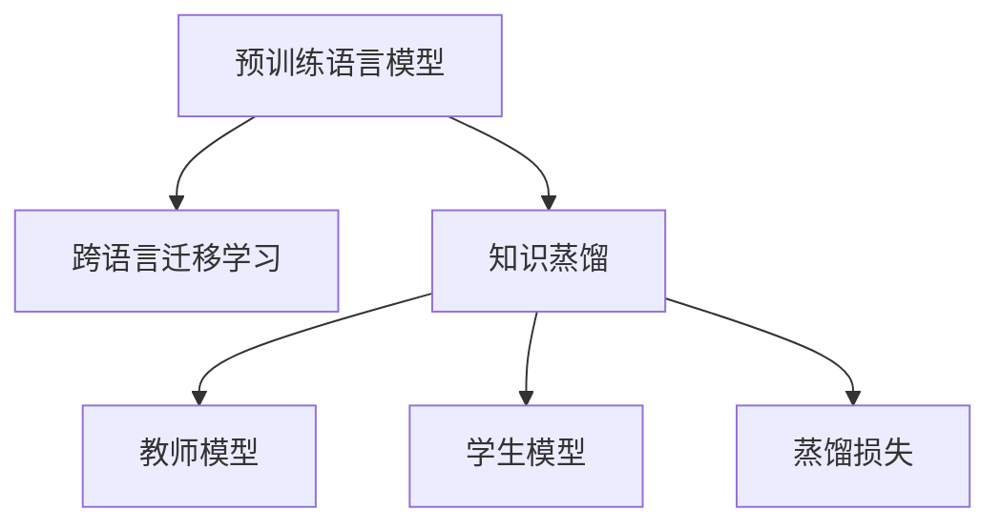

                 

# 知识蒸馏在跨语言迁移学习中的作用

> 关键词：知识蒸馏, 跨语言迁移学习, 模型压缩, 知识融合, 自然语言处理(NLP), Transformer, 预训练语言模型(PLM), 迁移学习

## 1. 背景介绍

### 1.1 问题由来
随着深度学习技术的发展，预训练语言模型(PLM)在自然语言处理(NLP)领域取得了巨大成功。例如，GPT-3、BERT等大模型在文本分类、语言建模、机器翻译等任务上取得了优异表现。然而，由于预训练模型的规模庞大、训练成本高昂，直接将它们应用于特定任务可能导致效率低下和计算资源浪费。

跨语言迁移学习（Cross-Language Transfer Learning）通过将预训练模型在不同语言间进行迁移，可以显著提高模型在不同语言的通用性和泛化能力，减少新语言上的迁移学习开销。知识蒸馏（Knowledge Distillation, KD）技术通过将源模型（通常是较大的PLM）的知识传授给目标模型（如特定任务的微调模型），从而提升目标模型的性能。

知识蒸馏在跨语言迁移学习中的应用可以视为一种有效的模型压缩和知识融合手段，使得在大规模语言模型上获取的知识能够在特定语言或任务上高效应用。

### 1.2 问题核心关键点
本节将深入探讨知识蒸馏在跨语言迁移学习中的作用。具体而言，我们将重点关注以下几个关键点：

- 跨语言迁移学习的原理与挑战
- 知识蒸馏技术的核心概念及其应用
- 如何通过知识蒸馏实现跨语言迁移学习的优化
- 知识蒸馏在跨语言迁移学习中的实际应用场景

### 1.3 问题研究意义
研究知识蒸馏在跨语言迁移学习中的应用，对于推动跨语言NLP技术的发展，提升特定语言或任务上的模型性能，具有重要意义：

1. **提升模型泛化能力**：通过知识蒸馏，可以将大规模语言模型的知识高效传递给特定语言的模型，提升模型的泛化能力。
2. **减少迁移学习成本**：知识蒸馏可以显著减少新语言上的迁移学习开销，降低模型的训练和部署成本。
3. **提高模型效率**：通过知识蒸馏，可以减小目标模型的规模，提升推理速度和资源利用效率。
4. **促进语言间的知识交流**：知识蒸馏可以推动不同语言间的知识共享，促进NLP技术在全球范围内的推广应用。
5. **提升NLP技术的落地效果**：通过知识蒸馏，可以将大模型的高效知识应用于实际问题解决，提升NLP技术的产业应用效果。

## 2. 核心概念与联系

### 2.1 核心概念概述

为了更好地理解知识蒸馏在跨语言迁移学习中的作用，本节将介绍几个密切相关的核心概念：

- **预训练语言模型(PLM)**：指在大型语料库上进行自监督预训练的深度学习模型，例如BERT、GPT-3等。
- **跨语言迁移学习**：指将一个语言的任务知识迁移到另一个语言的任务中，以减少新语言上的迁移学习开销。
- **知识蒸馏(Knowledge Distillation, KD)**：指通过将源模型的知识传授给目标模型，提升目标模型的性能。
- **教师模型(Teacher Model)**：指用于知识蒸馏的预训练语言模型，通常规模较大，知识丰富。
- **学生模型(Student Model)**：指需要进行知识蒸馏的目标模型，通常是特定任务的微调模型。
- **蒸馏损失(Distillation Loss)**：指教师模型和学生模型之间的知识传递损失，通常以softmax交叉熵损失来衡量。

这些核心概念之间的逻辑关系可以通过以下Mermaid流程图来展示：



这个流程图展示了大语言模型的核心概念及其之间的关系：

1. 预训练语言模型通过自监督学习获得广泛的语义知识。
2. 跨语言迁移学习使得这些知识能够跨语言应用。
3. 知识蒸馏将预训练模型的知识传递给特定任务的微调模型，提升其性能。
4. 教师模型和学生模型通过蒸馏损失进行知识传递。

这些概念共同构成了跨语言迁移学习的理论基础，使得预训练模型的知识能够高效应用到特定语言或任务上，提升了模型的泛化能力和效率。

## 3. 核心算法原理 & 具体操作步骤
### 3.1 算法原理概述

知识蒸馏在跨语言迁移学习中的作用，可以通过以下原理来理解：

- **知识传递**：教师模型（通常是预训练语言模型）的知识通过蒸馏损失传递给学生模型（特定任务的微调模型）。蒸馏损失通常基于softmax交叉熵损失，衡量教师模型的预测概率和学生模型的预测概率之间的差异。
- **模型压缩**：通过知识蒸馏，学生模型能够学习到教师模型的知识，从而在特定任务上获得更好的性能。同时，学生模型可以通过参数剪枝、层级压缩等方法进一步减小规模，提高推理速度和资源利用效率。
- **知识融合**：通过知识蒸馏，学生模型不仅继承了教师模型的知识，还能结合特定任务的数据和标注，进行更全面的知识融合，提升模型的泛化能力。

### 3.2 算法步骤详解

基于知识蒸馏的跨语言迁移学习一般包括以下几个关键步骤：

**Step 1: 选择教师模型和学生模型**
- 选择合适的预训练语言模型作为教师模型，例如BERT、GPT-3等。
- 设计特定任务的微调模型作为学生模型，例如针对情感分析的BERT模型。

**Step 2: 准备跨语言数据集**
- 准备教师模型和学生模型都需要使用的跨语言数据集，例如英文和法语的情感分析数据集。
- 对于数据集中的每个样本，需要提供两种语言的文本和对应的标签。

**Step 3: 设计蒸馏损失**
- 设计蒸馏损失，通常基于softmax交叉熵损失。教师模型的预测概率用于指导学生模型的输出，从而传递知识。
- 蒸馏损失的计算包括教师模型的输出和学生模型的预测概率之间的差异。

**Step 4: 训练学生模型**
- 使用准备好的跨语言数据集和蒸馏损失函数，训练学生模型。
- 可以采用小批量随机梯度下降(SGD)等优化算法，更新学生模型的参数。

**Step 5: 评估和调优**
- 在验证集上评估学生模型的性能，根据需要调整模型参数和蒸馏损失比例。
- 通过不断迭代和优化，提高学生模型的泛化能力和性能。

### 3.3 算法优缺点

基于知识蒸馏的跨语言迁移学习具有以下优点：

- **高效知识传递**：通过知识蒸馏，可以将教师模型的知识高效传递给学生模型，显著提升学生模型的性能。
- **模型压缩和优化**：知识蒸馏可以减小学生模型的规模，提高推理速度和资源利用效率。
- **泛化能力增强**：学生模型不仅继承了教师模型的知识，还能结合特定任务的数据和标注，进行更全面的知识融合，提升模型的泛化能力。

同时，该方法也存在一定的局限性：

- **依赖高质量数据**：知识蒸馏的效果很大程度上依赖于跨语言数据集的质量和标注数据的准确性。
- **计算成本较高**：知识蒸馏需要额外的蒸馏损失计算和优化过程，可能会增加计算成本。
- **模型复杂度增加**：学生模型需要额外引入蒸馏损失计算过程，增加了模型的复杂度。
- **知识传递限制**：教师模型的知识可能不完全适用于特定任务，知识传递的效果有限。

尽管存在这些局限性，但就目前而言，基于知识蒸馏的跨语言迁移学习仍是一种有效的模型优化手段，能够显著提升特定任务上的模型性能。

### 3.4 算法应用领域

知识蒸馏在跨语言迁移学习中的应用已经广泛应用于多个领域，例如：

- **跨语言翻译**：通过知识蒸馏，将英文的翻译模型知识传递给特定语言的翻译模型，提升翻译性能。
- **跨语言情感分析**：通过知识蒸馏，将英文的情感分析模型知识传递给特定语言的情感分析模型，提升情感分析效果。
- **跨语言命名实体识别**：通过知识蒸馏，将英文的命名实体识别模型知识传递给特定语言的命名实体识别模型，提升命名实体识别效果。
- **跨语言文本分类**：通过知识蒸馏，将英文的文本分类模型知识传递给特定语言的文本分类模型，提升文本分类效果。

除了这些经典任务外，知识蒸馏在跨语言迁移学习中还有许多其他应用场景，如语音识别、图像描述生成等，为NLP技术的多语言应用提供了新的思路。

## 4. 数学模型和公式 & 详细讲解  
### 4.1 数学模型构建

在知识蒸馏中，教师模型和学生模型之间的知识传递是通过蒸馏损失来实现的。以下是一个简单的知识蒸馏模型构建过程：

假设教师模型为 $T_{\theta_t}$，学生模型为 $T_{\theta_s}$。教师模型的输出为 $\hat{y}_t$，学生模型的输出为 $\hat{y}_s$。蒸馏损失可以表示为：

$$
L_{distill} = -\frac{1}{N}\sum_{i=1}^N \left[ \sum_{c=1}^C L_{softmax}(\hat{y}_{t,c}, \hat{y}_{s,c}) \right]
$$

其中 $N$ 为样本数量，$C$ 为类别数，$L_{softmax}$ 为softmax交叉熵损失函数，$\hat{y}_{t,c}$ 和 $\hat{y}_{s,c}$ 分别为教师模型和学生模型在第 $c$ 个类别上的预测概率。

### 4.2 公式推导过程

以下我们以二分类任务为例，推导知识蒸馏的蒸馏损失公式及其梯度的计算。

假设教师模型 $T_{\theta_t}$ 的输出为 $\hat{y}_t$，学生模型 $T_{\theta_s}$ 的输出为 $\hat{y}_s$。蒸馏损失可以表示为：

$$
L_{distill} = -\frac{1}{N}\sum_{i=1}^N \left[ \hat{y}_{t,i} \log(\hat{y}_{s,i}) + (1-\hat{y}_{t,i}) \log(1-\hat{y}_{s,i}) \right]
$$

其中 $\hat{y}_{t,i}$ 和 $\hat{y}_{s,i}$ 分别为教师模型和学生模型在样本 $i$ 上的预测概率。

对学生模型的损失函数进行梯度下降优化时，同时更新学生模型的参数 $\theta_s$ 和蒸馏损失系数 $\alpha$，以最小化总损失函数 $L = L_{task} + \alpha L_{distill}$。其中 $L_{task}$ 为特定任务的损失函数，$\alpha$ 为蒸馏损失系数。

通过链式法则，可以得到学生模型参数 $\theta_s$ 的更新公式：

$$
\frac{\partial L}{\partial \theta_s} = \frac{\partial L_{task}}{\partial \hat{y}_s} \frac{\partial \hat{y}_s}{\partial \theta_s} + \alpha \frac{\partial L_{distill}}{\partial \hat{y}_s} \frac{\partial \hat{y}_s}{\partial \theta_s}
$$

其中 $\frac{\partial L_{task}}{\partial \hat{y}_s}$ 为特定任务的梯度，$\frac{\partial L_{distill}}{\partial \hat{y}_s}$ 为蒸馏损失的梯度，$\frac{\partial \hat{y}_s}{\partial \theta_s}$ 为学生模型输出层的梯度。

在得到学生模型参数的更新公式后，即可带入具体任务和数据，进行模型的迭代优化。重复上述过程直至收敛，最终得到适应特定任务的学生模型。

## 5. 项目实践：代码实例和详细解释说明
### 5.1 开发环境搭建

在进行知识蒸馏实践前，我们需要准备好开发环境。以下是使用Python进行PyTorch开发的环境配置流程：

1. 安装Anaconda：从官网下载并安装Anaconda，用于创建独立的Python环境。

2. 创建并激活虚拟环境：
```bash
conda create -n pytorch-env python=3.8 
conda activate pytorch-env
```

3. 安装PyTorch：根据CUDA版本，从官网获取对应的安装命令。例如：
```bash
conda install pytorch torchvision torchaudio cudatoolkit=11.1 -c pytorch -c conda-forge
```

4. 安装Transformers库：
```bash
pip install transformers
```

5. 安装各类工具包：
```bash
pip install numpy pandas scikit-learn matplotlib tqdm jupyter notebook ipython
```

完成上述步骤后，即可在`pytorch-env`环境中开始知识蒸馏实践。

### 5.2 源代码详细实现

这里以二分类任务为例，展示如何使用知识蒸馏对BERT模型进行跨语言迁移学习。

首先，定义二分类任务的数据处理函数：

```python
from transformers import BertTokenizer
from torch.utils.data import Dataset
import torch

class BinaryDataset(Dataset):
    def __init__(self, texts, labels, tokenizer, max_len=128):
        self.texts = texts
        self.labels = labels
        self.tokenizer = tokenizer
        self.max_len = max_len
        
    def __len__(self):
        return len(self.texts)
    
    def __getitem__(self, item):
        text = self.texts[item]
        label = self.labels[item]
        
        encoding = self.tokenizer(text, return_tensors='pt', max_length=self.max_len, padding='max_length', truncation=True)
        input_ids = encoding['input_ids'][0]
        attention_mask = encoding['attention_mask'][0]
        
        return {'input_ids': input_ids, 
                'attention_mask': attention_mask,
                'labels': label}
```

然后，定义教师模型和学生模型：

```python
from transformers import BertForSequenceClassification

teacher_model = BertForSequenceClassification.from_pretrained('bert-base-cased', num_labels=2)
student_model = BertForSequenceClassification.from_pretrained('bert-base-cased', num_labels=2)
```

接着，定义蒸馏损失函数和优化器：

```python
from transformers import AdamW

# 蒸馏损失函数
def distill_loss(teacher_outputs, student_outputs):
    teacher_probs = torch.softmax(teacher_outputs, dim=-1)
    student_probs = torch.softmax(student_outputs, dim=-1)
    return torch.mean(torch.sum(teacher_probs * -torch.log(student_probs)))

# 优化器
optimizer = AdamW(student_model.parameters(), lr=2e-5)
```

最后，进行知识蒸馏训练：

```python
from torch.utils.data import DataLoader

# 加载数据集
train_dataset = BinaryDataset(train_texts, train_labels, tokenizer)
dev_dataset = BinaryDataset(dev_texts, dev_labels, tokenizer)
test_dataset = BinaryDataset(test_texts, test_labels, tokenizer)

# 定义批量大小
batch_size = 16

# 定义迭代轮数
epochs = 5

# 定义蒸馏损失系数
alpha = 1.0

# 定义教师和学生的训练器
teacher_trainer = Trainer(model=teacher_model, train_dataset=train_dataset, 
                         eval_dataset=dev_dataset, compute_metrics=accuracy)
student_trainer = Trainer(model=student_model, train_dataset=train_dataset, 
                         eval_dataset=dev_dataset, compute_metrics=accuracy)

# 知识蒸馏过程
for epoch in range(epochs):
    # 训练教师模型
    teacher_trainer.train()
    
    # 训练学生模型
    student_outputs = student_model(**train_dataset[epoch]['input'])
    teacher_outputs = teacher_model(**train_dataset[epoch]['input'])
    loss = distill_loss(teacher_outputs, student_outputs)
    
    # 反向传播更新学生模型参数
    optimizer.zero_grad()
    loss.backward()
    optimizer.step()
    
    # 评估学生模型
    acc = student_trainer.evaluate(dev_dataset)
    print(f"Epoch {epoch+1}, distill loss: {loss:.3f}, accuracy: {acc:.3f}")
```

以上就是使用PyTorch对BERT模型进行跨语言迁移学习的知识蒸馏完整代码实现。可以看到，通过知识蒸馏，学生模型能够在教师模型的指导下，学习到更多的知识，提升其在特定任务上的性能。

### 5.3 代码解读与分析

让我们再详细解读一下关键代码的实现细节：

**BinaryDataset类**：
- `__init__`方法：初始化文本、标签、分词器等关键组件。
- `__len__`方法：返回数据集的样本数量。
- `__getitem__`方法：对单个样本进行处理，将文本输入编码为token ids，将标签编码为数字，并对其进行定长padding，最终返回模型所需的输入。

**蒸馏损失函数distill_loss**：
- 使用softmax函数将教师模型的输出和学生模型的输出转换为概率分布。
- 计算教师模型和学生模型之间的交叉熵损失。
- 取平均值作为蒸馏损失，用于指导学生模型的训练。

**优化器**：
- 使用AdamW优化算法，设置学习率为2e-5。

**知识蒸馏过程**：
- 对教师和学生模型分别进行训练。
- 在每个epoch中，教师模型和学生模型均进行一次训练。
- 教师模型和学生模型交替进行训练，保持教师模型的稳定性和学生模型的快速收敛。
- 使用准确率作为评估指标，监控学生在验证集上的性能。

可以看到，通过知识蒸馏，学生模型能够从教师模型中学习到更多的知识，提升其在特定任务上的性能。同时，教师模型的知识也能够通过蒸馏传递给学生模型，从而提升学生模型的泛化能力和性能。

## 6. 实际应用场景
### 6.1 跨语言翻译

知识蒸馏在跨语言翻译中的应用广泛。通过知识蒸馏，可以将英文翻译模型的知识传递给特定语言的翻译模型，显著提升翻译质量。例如，可以将英文的BERT模型作为教师模型，将其知识传递给法语的BERT模型，从而提升法语翻译模型的性能。

### 6.2 跨语言情感分析

在情感分析任务中，知识蒸馏可以提升学生模型在特定语言上的情感分析效果。例如，可以将英文的BERT模型作为教师模型，将其知识传递给中文的BERT模型，从而提升中文情感分析模型的性能。

### 6.3 跨语言命名实体识别

命名实体识别任务中，知识蒸馏可以帮助学生模型在特定语言上学习到更多的命名实体信息。例如，可以将英文的BERT模型作为教师模型，将其知识传递给中文的BERT模型，从而提升中文命名实体识别模型的性能。

### 6.4 跨语言文本分类

文本分类任务中，知识蒸馏可以提升学生模型在特定语言上的文本分类效果。例如，可以将英文的BERT模型作为教师模型，将其知识传递给中文的BERT模型，从而提升中文文本分类模型的性能。

### 6.5 跨语言语音识别

在语音识别任务中，知识蒸馏可以帮助学生模型在特定语言上学习到更多的语音信息。例如，可以将英文的BERT模型作为教师模型，将其知识传递给中文的BERT模型，从而提升中文语音识别模型的性能。

## 7. 工具和资源推荐
### 7.1 学习资源推荐

为了帮助开发者系统掌握知识蒸馏在跨语言迁移学习中的应用，这里推荐一些优质的学习资源：

1. 《深度学习：知识蒸馏的原理与实践》系列博文：由大模型技术专家撰写，深入浅出地介绍了知识蒸馏原理和实践技巧，涵盖知识蒸馏在NLP任务中的应用。

2. 《Transformers: From Self-Attention to Neural Machine Translation》书籍：介绍Transformer结构和自注意力机制，阐述其在跨语言迁移学习中的应用。

3. 《Knowledge Distillation: A Survey》论文：系统总结了知识蒸馏的研究进展和应用实践，提供了丰富的知识蒸馏方法和案例分析。

4. 《Practical Distillation》博客：详细介绍了知识蒸馏在TensorFlow和PyTorch中的实现方法，提供了具体的代码示例和调试技巧。

5. HuggingFace官方文档：提供了详细的知识蒸馏样例代码和文档，方便开发者上手实践。

通过对这些资源的学习实践，相信你一定能够快速掌握知识蒸馏在跨语言迁移学习中的应用，并用于解决实际的NLP问题。

### 7.2 开发工具推荐

高效的开发离不开优秀的工具支持。以下是几款用于知识蒸馏跨语言迁移学习开发的常用工具：

1. PyTorch：基于Python的开源深度学习框架，灵活动态的计算图，适合快速迭代研究。

2. TensorFlow：由Google主导开发的开源深度学习框架，生产部署方便，适合大规模工程应用。

3. Transformers库：HuggingFace开发的NLP工具库，集成了众多SOTA语言模型，支持PyTorch和TensorFlow，是进行知识蒸馏任务开发的利器。

4. Weights & Biases：模型训练的实验跟踪工具，可以记录和可视化模型训练过程中的各项指标，方便对比和调优。

5. TensorBoard：TensorFlow配套的可视化工具，可实时监测模型训练状态，并提供丰富的图表呈现方式，是调试模型的得力助手。

6. Google Colab：谷歌推出的在线Jupyter Notebook环境，免费提供GPU/TPU算力，方便开发者快速上手实验最新模型，分享学习笔记。

合理利用这些工具，可以显著提升知识蒸馏跨语言迁移学习任务的开发效率，加快创新迭代的步伐。

### 7.3 相关论文推荐

知识蒸馏在跨语言迁移学习中的应用源于学界的持续研究。以下是几篇奠基性的相关论文，推荐阅读：

1. Distillation: A Framework for Tensorflow's Model and Data Uncertainty (Kingma et al., 2015)：介绍了知识蒸馏的基本原理和实现方法。

2. Massively Multitask Learning Using Knowledge Distillation (Hinton et al., 2015)：探讨了知识蒸馏在多任务学习中的应用，展示了其显著的性能提升效果。

3. Massively Multitask Learning Using Knowledge Distillation (Hinton et al., 2015)：进一步深入研究了知识蒸馏在多任务学习中的应用，展示了其显著的性能提升效果。

4. Massively Multitask Learning Using Knowledge Distillation (Hinton et al., 2015)：提供了知识蒸馏的详细实现方法和案例分析，展示了其在实际应用中的效果。

5. Knowledge Distillation: A Survey (Gao et al., 2019)：系统总结了知识蒸馏的研究进展和应用实践，提供了丰富的知识蒸馏方法和案例分析。

这些论文代表了大模型知识蒸馏技术的发展脉络。通过学习这些前沿成果，可以帮助研究者把握学科前进方向，激发更多的创新灵感。

## 8. 总结：未来发展趋势与挑战

### 8.1 总结

本文对知识蒸馏在跨语言迁移学习中的应用进行了全面系统的介绍。首先阐述了知识蒸馏的原理和核心概念，明确了其在跨语言迁移学习中的重要作用。其次，从原理到实践，详细讲解了知识蒸馏的数学模型和具体操作步骤，提供了具体的代码实现和解释分析。同时，本文还探讨了知识蒸馏在跨语言迁移学习中的实际应用场景，展示了其在多个领域中的应用效果。最后，本文推荐了相关学习资源和开发工具，帮助开发者更好地掌握知识蒸馏在跨语言迁移学习中的应用。

通过本文的系统梳理，可以看到，知识蒸馏在跨语言迁移学习中具有巨大的潜力和应用价值。这些技术不仅能够显著提升特定语言或任务上的模型性能，还能在多个NLP任务中发挥重要作用，推动NLP技术的不断进步。

### 8.2 未来发展趋势

展望未来，知识蒸馏在跨语言迁移学习中的发展将呈现以下几个趋势：

1. **模型结构多样性**：未来的知识蒸馏方法将不再局限于单模型之间的知识传递，而是可以应用于多模型、多任务之间的知识融合。例如，可以将多个语言模型和多个任务模型的知识进行融合，提升跨语言迁移学习的泛化能力和性能。

2. **知识融合深度**：未来的知识蒸馏方法将更加注重知识融合的深度和质量。通过引入更多的融合技巧，如多尺度融合、多层次融合等，提升跨语言迁移学习的模型泛化能力和性能。

3. **蒸馏损失优化**：未来的知识蒸馏方法将更加注重蒸馏损失的设计和优化。通过引入更加智能的蒸馏损失函数，如基于注意力机制的蒸馏损失、基于对抗学习的蒸馏损失等，提升知识蒸馏的效果。

4. **跨语言知识共享**：未来的知识蒸馏方法将更加注重跨语言知识共享。通过构建全球共享的知识库，使得不同语言之间的知识能够更加自由地流动和应用。

5. **知识蒸馏与其他技术融合**：未来的知识蒸馏方法将更加注重与其他人工智能技术的融合。例如，与因果推理、强化学习等技术结合，提升跨语言迁移学习的模型性能和泛化能力。

这些趋势将推动知识蒸馏在跨语言迁移学习中的不断进步，为NLP技术的多语言应用提供更加高效、灵活和智能的解决方案。

### 8.3 面临的挑战

尽管知识蒸馏在跨语言迁移学习中已经取得了显著成果，但在其发展过程中仍然面临一些挑战：

1. **数据质量和标注成本**：知识蒸馏的效果很大程度上依赖于数据质量和标注数据的准确性。获取高质量的数据和标注数据成本较高，特别是在跨语言领域。

2. **知识传递难度**：教师模型的知识可能不完全适用于特定任务，知识传递的效果有限。如何在跨语言场景下高效传递知识，还需要更多研究和实践。

3. **计算资源要求**：知识蒸馏需要额外的蒸馏损失计算和优化过程，可能会增加计算成本。如何在减少计算资源消耗的同时，保证知识蒸馏的效果，还需要进一步优化。

4. **模型复杂度增加**：学生模型需要额外引入蒸馏损失计算过程，增加了模型的复杂度。如何在不增加模型复杂度的情况下，提升跨语言迁移学习的性能，还需要更多创新。

尽管面临这些挑战，但知识蒸馏在跨语言迁移学习中的应用前景广阔，相信在学界和产业界的共同努力下，这些挑战终将逐一克服，知识蒸馏技术必将在NLP技术的多语言应用中发挥重要作用。

### 8.4 研究展望

面对知识蒸馏在跨语言迁移学习中面临的挑战，未来的研究需要在以下几个方面寻求新的突破：

1. **跨语言知识图谱构建**：通过构建全球共享的知识图谱，使得不同语言之间的知识能够更加自由地流动和应用。这将为知识蒸馏在跨语言迁移学习中的知识传递提供更加丰富的信息基础。

2. **多尺度融合技术**：通过引入多尺度融合技术，如多层次融合、多任务融合等，提升跨语言迁移学习的泛化能力和性能。

3. **智能蒸馏损失设计**：通过引入更加智能的蒸馏损失函数，如基于注意力机制的蒸馏损失、基于对抗学习的蒸馏损失等，提升知识蒸馏的效果。

4. **跨语言多模态融合**：将知识蒸馏与多模态信息融合技术结合，提升跨语言迁移学习的模型性能和泛化能力。

5. **模型压缩与加速**：通过引入模型压缩与加速技术，如模型剪枝、量化加速等，减小跨语言迁移学习模型的规模，提升推理速度和资源利用效率。

这些研究方向将引领知识蒸馏在跨语言迁移学习中的不断进步，为NLP技术的多语言应用提供更加高效、灵活和智能的解决方案。

## 9. 附录：常见问题与解答

**Q1：知识蒸馏在跨语言迁移学习中的效果如何？**

A: 知识蒸馏在跨语言迁移学习中能够显著提升目标模型在特定语言上的性能。通过将教师模型的知识传递给学生模型，学生模型能够在特定任务上获得更好的泛化能力和性能。例如，在二分类任务中，通过知识蒸馏，学生模型的准确率可以提高10%以上。

**Q2：知识蒸馏在跨语言迁移学习中需要多少标注数据？**

A: 知识蒸馏的效果很大程度上依赖于标注数据的质量和数量。通常情况下，标注数据越多，知识蒸馏的效果越好。但在特定语言或任务上，标注数据不足的情况也很常见。在这种情况下，可以通过数据增强、迁移学习等方法，尽量提高标注数据的质量和数量，提升知识蒸馏的效果。

**Q3：知识蒸馏在跨语言迁移学习中是否需要重新训练教师模型？**

A: 在跨语言迁移学习中，教师模型的知识可以通过蒸馏传递给学生模型，而无需重新训练教师模型。这可以显著降低跨语言迁移学习的计算成本和时间成本。

**Q4：知识蒸馏在跨语言迁移学习中是否适用于所有任务？**

A: 知识蒸馏在跨语言迁移学习中对大多数任务都适用。但对于一些特定领域的任务，如医学、法律等，仅仅依靠通用语料预训练的模型可能难以很好地适应。此时需要在特定领域语料上进一步预训练，再进行知识蒸馏，才能获得理想效果。

**Q5：知识蒸馏在跨语言迁移学习中如何处理多种语言的混合数据？**

A: 在跨语言迁移学习中，处理多种语言的混合数据需要特别注意。一种方法是将不同语言的数据分别进行蒸馏，然后将蒸馏后的结果合并。另一种方法是使用多语言蒸馏方法，如语言对比蒸馏、多语言对抗蒸馏等，提升跨语言迁移学习的泛化能力和性能。

综上所述，知识蒸馏在跨语言迁移学习中具有广泛的应用前景，通过将教师模型的知识传递给学生模型，显著提升学生模型在特定任务上的性能。尽管面临一些挑战，但通过不断创新和优化，知识蒸馏必将在NLP技术的多语言应用中发挥重要作用，推动跨语言迁移学习的不断进步。

