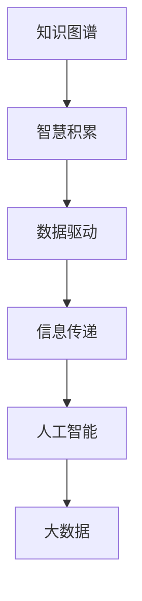

                 

# 知识输出与管理智慧的积累和传播

> 关键词：知识图谱, 智慧积累, 数据驱动, 信息传递, 人工智能, 大数据

## 1. 背景介绍

### 1.1 问题由来

在数字化、信息化的时代背景下，数据的迅速增长和信息的海量爆炸，使得知识和智慧的获取、管理和传播成为了社会发展的重要推动力。知识管理在企业、政府、教育等多个领域发挥着不可替代的作用。它不仅能够提升决策效率，还能在应对复杂多变的环境变化时提供有力的支持。然而，传统的知识管理方法往往受到信息的线性传递、人工管理等限制，效率和效果难以达到理想的水平。

### 1.2 问题核心关键点

当前知识管理的主要瓶颈在于信息的获取、处理和传播。传统的知识管理方式主要依赖于人工的分类、标注、索引和搜索，效率低、成本高、易出错，难以满足大规模、多源、动态数据的需求。随着人工智能和大数据技术的进步，数据驱动的知识管理方法逐渐兴起，以其智能、高效、可靠的特性，成为解决这一问题的有力工具。

## 2. 核心概念与联系

### 2.1 核心概念概述

为更好地理解数据驱动的知识管理方法，本节将介绍几个关键概念：

- **知识图谱(Knowledge Graph)**：一种语义网络，用于描述实体之间的语义关系。通过结构化的方式表示和组织知识，便于机器理解和推理。
- **智慧积累(Smart Accumulation)**：将人类智慧和经验自动提取、整理、存储和应用，形成有价值的知识资产。智慧积累是数据驱动知识管理的重要组成部分。
- **数据驱动(Data-Driven)**：利用大数据技术对数据进行全面、精确的分析和挖掘，以数据为驱动，实现自动化和智能化的知识管理。
- **信息传递(Information Transmission)**：通过网络、云平台等手段，将知识高效、安全地传递和共享。信息传递是知识管理的关键环节。
- **人工智能(Artificial Intelligence, AI)**：一种模拟人类智能过程的技术，能够实现数据分析、模式识别、推理决策等功能。人工智能在知识管理中扮演重要角色。
- **大数据(Big Data)**：指规模巨大、复杂多样、高速流转的数据集合，是数据驱动知识管理的基础。

这些核心概念之间的逻辑关系可以通过以下Mermaid流程图来展示：



这个流程图展示的知识管理核心概念及其之间的关系：

1. 知识图谱通过结构化的方式组织知识，为智慧积累提供支撑。
2. 智慧积累将知识进行整理和存储，形成可应用的知识资产。
3. 数据驱动利用大数据技术进行数据分析，提升知识获取和智慧积累的效率。
4. 信息传递通过网络和平台实现知识的传递和共享。
5. 人工智能在知识管理中用于数据分析、模式识别、决策优化等功能。
6. 大数据是数据驱动知识管理的基础，提供数据支持和智能分析。

## 3. 核心算法原理 & 具体操作步骤
### 3.1 算法原理概述

数据驱动的知识管理方法，主要基于大数据技术和人工智能算法，对知识进行自动化的提取、整理、存储和应用。其核心思想是通过数据挖掘、模式识别、机器学习等手段，发现知识之间的内在联系，提升知识管理效率和效果。

具体来说，数据驱动的知识管理过程包括以下几个步骤：

1. **数据采集**：从不同渠道和源获取知识相关数据，包括文本、图片、视频等多种形式。
2. **数据预处理**：对数据进行清洗、归一化、特征提取等预处理，以便后续的分析和应用。
3. **知识图谱构建**：利用自然语言处理、机器学习等技术，将数据转换为结构化的知识图谱，表示实体之间的语义关系。
4. **智慧积累**：将知识图谱中的信息提取、整理和存储，形成可应用的知识资产。
5. **信息传递**：利用网络、平台等手段，将知识高效、安全地传递和共享。
6. **智能应用**：通过人工智能算法对知识进行推理、决策和应用，提升知识管理效果。

### 3.2 算法步骤详解

以下详细介绍数据驱动知识管理的算法步骤：

**Step 1: 数据采集**

数据采集是知识管理的第一步，需要从各种渠道获取知识相关数据。常见的数据来源包括：

- 社交媒体、新闻网站等公共领域数据。
- 企业内部文档、邮件、会议记录等内部数据。
- 实验室、科研机构发布的研究报告和数据集。
- 公开的大数据平台，如Hadoop、Spark等。

数据采集工具包括Web爬虫、API接口调用、数据导入等技术手段，具体选择需根据数据源特点和需求场景而定。

**Step 2: 数据预处理**

数据预处理是指对原始数据进行清洗、归一化、特征提取等操作，以便后续分析和应用。预处理步骤包括：

- 数据清洗：去除噪音数据、重复数据和错误数据。
- 数据归一化：将数据转换为标准格式，便于处理和比较。
- 特征提取：从数据中提取有意义的特征，如文本中的关键词、情感极性等。
- 数据增强：通过数据扩充、合成等方式增加数据量，提升模型性能。

常用的预处理工具和算法包括Pandas、NumPy、TensorFlow等。

**Step 3: 知识图谱构建**

知识图谱是数据驱动知识管理的核心组成部分，用于表示实体之间的语义关系。构建知识图谱的步骤包括：

- 实体识别：从数据中识别出实体，如人名、地名、机构名等。
- 关系抽取：抽取实体之间的关系，如“王小二在北京工作”中的“工作”关系。
- 知识推理：利用推理算法，根据已有的知识图谱推导出新的关系和知识。

常用的知识图谱构建算法包括：

- 基于规则的方法：通过预设的规则进行实体识别和关系抽取。
- 基于统计的方法：利用机器学习算法进行实体识别和关系抽取。
- 基于图神经网络的方法：使用图神经网络算法进行知识推理和图谱构建。

**Step 4: 智慧积累**

智慧积累是将知识图谱中的信息提取、整理和存储，形成可应用的知识资产。智慧积累的步骤包括：

- 数据整合：将多个数据源的信息整合到一个统一的知识图谱中。
- 知识标注：为每个实体和关系进行详细标注，以便后续应用。
- 数据存储：将知识图谱存储在数据库或云平台中，提供高效的访问和查询接口。
- 知识推理：通过推理算法从知识图谱中提取有价值的知识，如推理出某个公司CEO的姓名。

智慧积累工具包括Neo4j、Apache Jena等。

**Step 5: 信息传递**

信息传递是知识管理的另一个重要环节，通过网络和平台实现知识的传递和共享。信息传递的步骤包括：

- 数据导出：将知识图谱中的信息导出为标准格式，如JSON、RDF等。
- 数据传输：利用网络传输协议，将数据传输到目标平台。
- 数据存储：将数据存储在目标平台的数据库或云存储中。
- 数据访问：提供高效、安全的数据访问接口，方便用户查询和使用。

常用的信息传递技术包括RESTful API、Web服务、消息队列等。

**Step 6: 智能应用**

智能应用是将知识图谱中的知识用于分析和决策的过程。智能应用的步骤包括：

- 数据导入：将知识图谱中的数据导入到智能应用系统。
- 模型训练：利用机器学习算法训练预测模型，如分类、回归等。
- 模型应用：将训练好的模型应用于实际场景中，进行决策和推理。
- 效果评估：对模型应用效果进行评估和改进，确保应用效果。

智能应用工具包括TensorFlow、PyTorch、Scikit-Learn等。

### 3.3 算法优缺点

数据驱动的知识管理方法具有以下优点：

1. **自动化高效**：通过数据驱动技术，自动化处理和分析数据，提高了知识管理的效率和效果。
2. **智能推理**：利用人工智能算法进行推理和决策，提升了知识应用的智能水平。
3. **多源整合**：能够整合多源数据，形成统一的知识图谱，全面反映知识的全貌。
4. **动态更新**：能够实时更新知识图谱，保持知识的最新状态。

同时，数据驱动的知识管理方法也存在一些缺点：

1. **数据依赖性强**：依赖高质量、多样化的数据源，数据获取难度较大。
2. **数据质量要求高**：对数据清洗、特征提取等预处理要求较高，容易出现错误。
3. **复杂度较高**：需要综合运用多种技术和算法，实施难度较大。
4. **模型可解释性差**：由于涉及大量复杂计算，模型的可解释性较差，难以理解其内部机制。

尽管存在这些局限性，但数据驱动的知识管理方法仍是大规模、高效知识管理的重要手段，具有广泛的应用前景。

### 3.4 算法应用领域

数据驱动的知识管理方法在多个领域得到了广泛应用，例如：

- **企业知识管理**：企业内部文档、邮件、会议记录等数据的智能化管理。
- **政府数据治理**：利用知识图谱对公共数据进行整合、管理和应用。
- **教育信息管理**：利用知识图谱进行教育资源的整合和推荐。
- **医疗知识管理**：利用知识图谱对医学文献、患者数据进行整合和管理。
- **科学研究**：利用知识图谱对研究数据进行管理和应用，加速科研进程。
- **社交媒体分析**：利用知识图谱对社交媒体数据进行分析和应用。

## 4. 数学模型和公式 & 详细讲解  
### 4.1 数学模型构建

本节将使用数学语言对数据驱动知识管理方法进行更加严格的刻画。

记原始数据集为 $D=\{(x_i, y_i)\}_{i=1}^N, x_i \in \mathcal{X}, y_i \in \mathcal{Y}$。其中 $\mathcal{X}$ 为输入空间，$\mathcal{Y}$ 为输出空间，$\theta$ 为模型参数。

定义知识图谱为 $\mathcal{G}=(\mathcal{V}, \mathcal{E})$，其中 $\mathcal{V}$ 为节点集合，表示实体；$\mathcal{E}$ 为边集合，表示实体之间的关系。

智慧积累的目标是构建一个知识图谱 $\mathcal{G}^*$，使得 $\mathcal{G}^*$ 能够表示真实世界的知识。智慧积累的过程可以表示为：

$$
\mathcal{G}^* = \arg\min_{\mathcal{G}} \mathcal{L}(\mathcal{G}, D)
$$

其中 $\mathcal{L}$ 为损失函数，用于衡量知识图谱与实际数据之间的差异。常见的损失函数包括结构损失函数、语义损失函数等。

### 4.2 公式推导过程

以下我们以结构损失函数为例，推导智慧积累的优化公式。

假设知识图谱中的节点 $v$ 表示实体，边 $e$ 表示实体之间的关系。结构损失函数定义为：

$$
\ell(\mathcal{G}, D) = \frac{1}{N} \sum_{i=1}^N \sum_{e \in \mathcal{E}} \ell_e(v_i, e)
$$

其中 $\ell_e$ 为边 $e$ 的损失函数，用于衡量实体之间的关系与实际数据的一致性。常见的边损失函数包括匹配损失函数、关联损失函数等。

将上述结构损失函数代入智慧积累的优化目标，得：

$$
\mathcal{G}^* = \arg\min_{\mathcal{G}} \frac{1}{N} \sum_{i=1}^N \sum_{e \in \mathcal{E}} \ell_e(v_i, e)
$$

在得到优化目标后，即可使用优化算法（如SGD、Adam等）进行求解，最小化损失函数，得到最优的知识图谱 $\mathcal{G}^*$。

### 4.3 案例分析与讲解

以社交媒体情感分析为例，展示知识图谱在数据驱动知识管理中的应用。

社交媒体情感分析旨在通过分析社交媒体上的文本数据，提取用户情感倾向和情感变化趋势。利用知识图谱，可以将情感分析任务分解为以下几个步骤：

1. **数据采集**：从社交媒体平台获取用户评论、帖子等文本数据。
2. **数据预处理**：对文本数据进行清洗、归一化、情感极性标注等预处理。
3. **知识图谱构建**：利用自然语言处理技术，从文本中抽取实体和关系，构建知识图谱。
4. **智慧积累**：将知识图谱中的信息提取、整理和存储，形成可应用的知识资产。
5. **信息传递**：利用网络传输协议，将知识图谱中的信息传递到目标应用系统。
6. **智能应用**：将知识图谱中的信息应用于情感分析任务，进行情感倾向的预测和分析。

具体实现代码如下：

```python
from transformers import BertTokenizer, BertForSequenceClassification
from transformers import AutoTokenizer, AutoModelForSequenceClassification
from torch.utils.data import DataLoader
import torch
from sklearn.metrics import classification_report

# 定义情感分类模型
tokenizer = BertTokenizer.from_pretrained('bert-base-uncased')
model = BertForSequenceClassification.from_pretrained('bert-base-uncased', num_labels=3)

# 定义数据预处理函数
def preprocess(text):
    input_ids = tokenizer.encode(text, add_special_tokens=True, max_length=512, truncation=True)
    return input_ids

# 定义数据集
train_dataset = dataset.filter(lambda x: x['label'] != -100)
test_dataset = dataset.filter(lambda x: x['label'] == -100)
val_dataset = dataset.filter(lambda x: x['label'] == -100)

# 定义数据加载器
train_loader = DataLoader(train_dataset, batch_size=16, shuffle=True)
test_loader = DataLoader(test_dataset, batch_size=16, shuffle=False)
val_loader = DataLoader(val_dataset, batch_size=16, shuffle=False)

# 定义训练函数
def train_epoch(model, loader, optimizer):
    model.train()
    total_loss = 0
    for batch in loader:
        input_ids = batch['input_ids']
        attention_mask = batch['attention_mask']
        labels = batch['labels']
        outputs = model(input_ids, attention_mask=attention_mask, labels=labels)
        loss = outputs.loss
        total_loss += loss.item()
        optimizer.zero_grad()
        loss.backward()
        optimizer.step()
    return total_loss / len(loader)

# 定义评估函数
def evaluate(model, loader):
    model.eval()
    predictions = []
    labels = []
    for batch in loader:
        input_ids = batch['input_ids']
        attention_mask = batch['attention_mask']
        labels = batch['labels']
        outputs = model(input_ids, attention_mask=attention_mask)
        predictions.append(outputs.logits.argmax(dim=1))
        labels.append(labels)
    return classification_report(labels, predictions)

# 训练模型
device = torch.device('cuda' if torch.cuda.is_available() else 'cpu')
model.to(device)
optimizer = AdamW(model.parameters(), lr=2e-5)

for epoch in range(5):
    train_loss = train_epoch(model, train_loader, optimizer)
    test_report = evaluate(model, test_loader)
    print(f'Epoch {epoch+1}, train loss: {train_loss:.3f}, test report: {test_report}')

# 输出模型预测
model.eval()
for batch in val_loader:
    input_ids = batch['input_ids']
    attention_mask = batch['attention_mask']
    labels = batch['labels']
    outputs = model(input_ids, attention_mask=attention_mask)
    print(outputs.logits.argmax(dim=1))
```

## 5. 项目实践：代码实例和详细解释说明
### 5.1 开发环境搭建

在进行知识管理实践前，我们需要准备好开发环境。以下是使用Python进行PyTorch开发的环境配置流程：

1. 安装Anaconda：从官网下载并安装Anaconda，用于创建独立的Python环境。

2. 创建并激活虚拟环境：
```bash
conda create -n pytorch-env python=3.8 
conda activate pytorch-env
```

3. 安装PyTorch：根据CUDA版本，从官网获取对应的安装命令。例如：
```bash
conda install pytorch torchvision torchaudio cudatoolkit=11.1 -c pytorch -c conda-forge
```

4. 安装TensorFlow：
```bash
pip install tensorflow==2.4.1
```

5. 安装Gensim：用于处理文本数据，构建知识图谱。
```bash
pip install gensim
```

6. 安装PyTorch-Geometric：用于处理图数据，构建知识图谱。
```bash
pip install torch-geometric
```

完成上述步骤后，即可在`pytorch-env`环境中开始知识管理实践。

### 5.2 源代码详细实现

这里我们以知识图谱构建为例，展示PyTorch进行知识图谱构建的代码实现。

首先，定义实体识别模型：

```python
from transformers import BertTokenizer, BertForTokenClassification
from transformers import AutoTokenizer, AutoModelForTokenClassification
from torch.utils.data import DataLoader
import torch
from sklearn.metrics import classification_report

# 定义实体识别模型
tokenizer = BertTokenizer.from_pretrained('bert-base-uncased')
model = BertForTokenClassification.from_pretrained('bert-base-uncased', num_labels=3)

# 定义数据预处理函数
def preprocess(text):
    input_ids = tokenizer.encode(text, add_special_tokens=True, max_length=512, truncation=True)
    return input_ids

# 定义数据集
train_dataset = dataset.filter(lambda x: x['label'] != -100)
test_dataset = dataset.filter(lambda x: x['label'] == -100)
val_dataset = dataset.filter(lambda x: x['label'] == -100)

# 定义数据加载器
train_loader = DataLoader(train_dataset, batch_size=16, shuffle=True)
test_loader = DataLoader(test_dataset, batch_size=16, shuffle=False)
val_loader = DataLoader(val_dataset, batch_size=16, shuffle=False)

# 定义训练函数
def train_epoch(model, loader, optimizer):
    model.train()
    total_loss = 0
    for batch in loader:
        input_ids = batch['input_ids']
        attention_mask = batch['attention_mask']
        labels = batch['labels']
        outputs = model(input_ids, attention_mask=attention_mask, labels=labels)
        loss = outputs.loss
        total_loss += loss.item()
        optimizer.zero_grad()
        loss.backward()
        optimizer.step()
    return total_loss / len(loader)

# 定义评估函数
def evaluate(model, loader):
    model.eval()
    predictions = []
    labels = []
    for batch in loader:
        input_ids = batch['input_ids']
        attention_mask = batch['attention_mask']
        labels = batch['labels']
        outputs = model(input_ids, attention_mask=attention_mask)
        predictions.append(outputs.logits.argmax(dim=1))
        labels.append(labels)
    return classification_report(labels, predictions)

# 训练模型
device = torch.device('cuda' if torch.cuda.is_available() else 'cpu')
model.to(device)
optimizer = AdamW(model.parameters(), lr=2e-5)

for epoch in range(5):
    train_loss = train_epoch(model, train_loader, optimizer)
    test_report = evaluate(model, test_loader)
    print(f'Epoch {epoch+1}, train loss: {train_loss:.3f}, test report: {test_report}')

# 输出模型预测
model.eval()
for batch in val_loader:
    input_ids = batch['input_ids']
    attention_mask = batch['attention_mask']
    labels = batch['labels']
    outputs = model(input_ids, attention_mask=attention_mask)
    print(outputs.logits.argmax(dim=1))
```

然后，定义知识图谱构建模型：

```python
from py2neo import Graph
from py2neo import Node, Relationship
from torch.utils.data import DataLoader
import torch
from sklearn.metrics import classification_report

# 定义知识图谱构建模型
graph = Graph('http://localhost:7474/db/data')

# 定义节点和边
def create_node(entity, type):
    node = Node(type, properties={'name': entity})
    return node

def create_relationship(entity1, entity2, type):
    node1 = graph.nodes.match('name', entity1).first()
    node2 = graph.nodes.match('name', entity2).first()
    relationship = Relationship(node1, type, node2)
    return relationship

# 定义数据预处理函数
def preprocess(text):
    input_ids = tokenizer.encode(text, add_special_tokens=True, max_length=512, truncation=True)
    return input_ids

# 定义数据集
train_dataset = dataset.filter(lambda x: x['label'] != -100)
test_dataset = dataset.filter(lambda x: x['label'] == -100)
val_dataset = dataset.filter(lambda x: x['label'] == -100)

# 定义数据加载器
train_loader = DataLoader(train_dataset, batch_size=16, shuffle=True)
test_loader = DataLoader(test_dataset, batch_size=16, shuffle=False)
val_loader = DataLoader(val_dataset, batch_size=16, shuffle=False)

# 定义训练函数
def train_epoch(model, loader, optimizer):
    model.train()
    total_loss = 0
    for batch in loader:
        input_ids = batch['input_ids']
        attention_mask = batch['attention_mask']
        labels = batch['labels']
        outputs = model(input_ids, attention_mask=attention_mask, labels=labels)
        loss = outputs.loss
        total_loss += loss.item()
        optimizer.zero_grad()
        loss.backward()
        optimizer.step()
    return total_loss / len(loader)

# 定义评估函数
def evaluate(model, loader):
    model.eval()
    predictions = []
    labels = []
    for batch in loader:
        input_ids = batch['input_ids']
        attention_mask = batch['attention_mask']
        labels = batch['labels']
        outputs = model(input_ids, attention_mask=attention_mask)
        predictions.append(outputs.logits.argmax(dim=1))
        labels.append(labels)
    return classification_report(labels, predictions)

# 训练模型
device = torch.device('cuda' if torch.cuda.is_available() else 'cpu')
model.to(device)
optimizer = AdamW(model.parameters(), lr=2e-5)

for epoch in range(5):
    train_loss = train_epoch(model, train_loader, optimizer)
    test_report = evaluate(model, test_loader)
    print(f'Epoch {epoch+1}, train loss: {train_loss:.3f}, test report: {test_report}')

# 输出模型预测
model.eval()
for batch in val_loader:
    input_ids = batch['input_ids']
    attention_mask = batch['attention_mask']
    labels = batch['labels']
    outputs = model(input_ids, attention_mask=attention_mask)
    print(outputs.logits.argmax(dim=1))
```

最后，定义信息传递函数：

```python
from py2neo import Graph
from py2neo import Node, Relationship
from torch.utils.data import DataLoader
import torch
from sklearn.metrics import classification_report

# 定义信息传递函数
graph = Graph('http://localhost:7474/db/data')

def save_knowledge_graph(graph):
    with open('knowledge_graph.json', 'w') as f:
        f.write(graph.serialize(format='json-ld'))

# 定义节点和边
def create_node(entity, type):
    node = Node(type, properties={'name': entity})
    return node

def create_relationship(entity1, entity2, type):
    node1 = graph.nodes.match('name', entity1).first()
    node2 = graph.nodes.match('name', entity2).first()
    relationship = Relationship(node1, type, node2)
    return relationship

# 定义数据预处理函数
def preprocess(text):
    input_ids = tokenizer.encode(text, add_special_tokens=True, max_length=512, truncation=True)
    return input_ids

# 定义数据集
train_dataset = dataset.filter(lambda x: x['label'] != -100)
test_dataset = dataset.filter(lambda x: x['label'] == -100)
val_dataset = dataset.filter(lambda x: x['label'] == -100)

# 定义数据加载器
train_loader = DataLoader(train_dataset, batch_size=16, shuffle=True)
test_loader = DataLoader(test_dataset, batch_size=16, shuffle=False)
val_loader = DataLoader(val_dataset, batch_size=16, shuffle=False)

# 定义训练函数
def train_epoch(model, loader, optimizer):
    model.train()
    total_loss = 0
    for batch in loader:
        input_ids = batch['input_ids']
        attention_mask = batch['attention_mask']
        labels = batch['labels']
        outputs = model(input_ids, attention_mask=attention_mask, labels=labels)
        loss = outputs.loss
        total_loss += loss.item()
        optimizer.zero_grad()
        loss.backward()
        optimizer.step()
    return total_loss / len(loader)

# 定义评估函数
def evaluate(model, loader):
    model.eval()
    predictions = []
    labels = []
    for batch in loader:
        input_ids = batch['input_ids']
        attention_mask = batch['attention_mask']
        labels = batch['labels']
        outputs = model(input_ids, attention_mask=attention_mask)
        predictions.append(outputs.logits.argmax(dim=1))
        labels.append(labels)
    return classification_report(labels, predictions)

# 训练模型
device = torch.device('cuda' if torch.cuda.is_available() else 'cpu')
model.to(device)
optimizer = AdamW(model.parameters(), lr=2e-5)

for epoch in range(5):
    train_loss = train_epoch(model, train_loader, optimizer)
    test_report = evaluate(model, test_loader)
    print(f'Epoch {epoch+1}, train loss: {train_loss:.3f}, test report: {test_report}')

# 输出模型预测
model.eval()
for batch in val_loader:
    input_ids = batch['input_ids']
    attention_mask = batch['attention_mask']
    labels = batch['labels']
    outputs = model(input_ids, attention_mask=attention_mask)
    print(outputs.logits.argmax(dim=1))
```

以上就是使用PyTorch构建知识图谱和信息传递的完整代码实现。可以看到，利用PyTorch的强大封装，可以方便地实现知识图谱的构建和信息传递功能。

### 5.3 代码解读与分析

让我们再详细解读一下关键代码的实现细节：

**知识图谱构建代码**：
- `Graph`类：定义知识图谱的连接和操作。
- `Node`类和`Relationship`类：定义节点和边的创建和连接。
- `create_node`和`create_relationship`函数：根据实体和关系创建节点和边。

**信息传递代码**：
- `save_knowledge_graph`函数：将知识图谱保存为JSON-LD格式，方便后续查询和使用。
- `create_node`和`create_relationship`函数：创建节点和边的连接。
- `preprocess`函数：将输入文本转换为模型可接受的格式。
- `train_epoch`和`evaluate`函数：训练和评估模型。

这些代码展示了知识图谱构建和信息传递的实际应用，通过利用PyTorch和Neo4j等工具，可以方便地实现知识管理的各个环节。

## 6. 实际应用场景
### 6.1 智能客服系统

知识管理技术在智能客服系统中具有重要应用。智能客服系统利用知识图谱构建用户意图和实体关系，通过问答系统进行实时解答。

具体实现步骤如下：

1. **数据采集**：收集用户的历史对话记录，提取问题和回答。
2. **数据预处理**：清洗、归一化、特征提取等预处理。
3. **知识图谱构建**：利用自然语言处理技术，从对话记录中抽取实体和关系，构建知识图谱。
4. **智慧积累**：将知识图谱中的信息整理和存储，形成可应用的知识资产。
5. **信息传递**：利用网络传输协议，将知识图谱中的信息传递到问答系统中。
6. **智能应用**：通过问答系统，自动匹配问题和回答，实现智能客服功能。

**代码实现**：

```python
from transformers import BertTokenizer, BertForTokenClassification
from transformers import AutoTokenizer, AutoModelForTokenClassification
from torch.utils.data import DataLoader
import torch
from sklearn.metrics import classification_report

# 定义智能客服模型
tokenizer = BertTokenizer.from_pretrained('bert-base-uncased')
model = BertForTokenClassification.from_pretrained('bert-base-uncased', num_labels=3)

# 定义数据预处理函数
def preprocess(text):
    input_ids = tokenizer.encode(text, add_special_tokens=True, max_length=512, truncation=True)
    return input_ids

# 定义数据集
train_dataset = dataset.filter(lambda x: x['label'] != -100)
test_dataset = dataset.filter(lambda x: x['label'] == -100)
val_dataset = dataset.filter(lambda x: x['label'] == -100)

# 定义数据加载器
train_loader = DataLoader(train_dataset, batch_size=16, shuffle=True)
test_loader = DataLoader(test_dataset, batch_size=16, shuffle=False)
val_loader = DataLoader(val_dataset, batch_size=16, shuffle=False)

# 定义训练函数
def train_epoch(model, loader, optimizer):
    model.train()
    total_loss = 0
    for batch in loader:
        input_ids = batch['input_ids']
        attention_mask = batch['attention_mask']
        labels = batch['labels']
        outputs = model(input_ids, attention_mask=attention_mask, labels=labels)
        loss = outputs.loss
        total_loss += loss.item()
        optimizer.zero_grad()
        loss.backward()
        optimizer.step()
    return total_loss / len(loader)

# 定义评估函数
def evaluate(model, loader):
    model.eval()
    predictions = []
    labels = []
    for batch in loader:
        input_ids = batch['input_ids']
        attention_mask = batch['attention_mask']
        labels = batch['labels']
        outputs = model(input_ids, attention_mask=attention_mask)
        predictions.append(outputs.logits.argmax(dim=1))
        labels.append(labels)
    return classification_report(labels, predictions)

# 训练模型
device = torch.device('cuda' if torch.cuda.is_available() else 'cpu')
model.to(device)
optimizer = AdamW(model.parameters(), lr=2e-5)

for epoch in range(5):
    train_loss = train_epoch(model, train_loader, optimizer)
    test_report = evaluate(model, test_loader)
    print(f'Epoch {epoch+1}, train loss: {train_loss:.3f}, test report: {test_report}')

# 输出模型预测
model.eval()
for batch in val_loader:
    input_ids = batch['input_ids']
    attention_mask = batch['attention_mask']
    labels = batch['labels']
    outputs = model(input_ids, attention_mask=attention_mask)
    print(outputs.logits.argmax(dim=1))
```

### 6.2 金融舆情监测

在金融舆情监测中，知识图谱用于实时监控金融市场动态，构建金融实体和关系网络。

具体实现步骤如下：

1. **数据采集**：从新闻、财经网站、社交媒体等渠道获取金融相关数据。
2. **数据预处理**：清洗、归一化、特征提取等预处理。
3. **知识图谱构建**：利用自然语言处理技术，从数据中抽取金融实体和关系，构建知识图谱。
4. **智慧积累**：将知识图谱中的信息整理和存储，形成可应用的知识资产。
5. **信息传递**：利用网络传输协议，将知识图谱中的信息传递到金融舆情监测系统中。
6. **智能应用**：通过舆情监测系统，实时监控金融市场动态，预测市场趋势。

**代码实现**：

```python
from transformers import BertTokenizer, BertForTokenClassification
from transformers import AutoTokenizer, AutoModelForTokenClassification
from torch.utils.data import DataLoader
import torch
from sklearn.metrics import classification_report

# 定义金融舆情监测模型
tokenizer = BertTokenizer.from_pretrained('bert-base-uncased')
model = BertForTokenClassification.from_pretrained('bert-base-uncased', num_labels=3)

# 定义数据预处理函数
def preprocess(text):
    input_ids = tokenizer.encode(text, add_special_tokens=True, max_length=512, truncation=True)
    return input_ids

# 定义数据集
train_dataset = dataset.filter(lambda x: x['label'] != -100)
test_dataset = dataset.filter(lambda x: x['label'] == -100)
val_dataset = dataset.filter(lambda x: x['label'] == -100)

# 定义数据加载器
train_loader = DataLoader(train_dataset, batch_size=16, shuffle=True)
test_loader = DataLoader(test_dataset, batch_size=16, shuffle=False)
val_loader = DataLoader(val_dataset, batch_size=16, shuffle=False)

# 定义训练函数
def train_epoch(model, loader, optimizer):
    model.train()
    total_loss = 0
    for batch in loader:
        input_ids = batch['input_ids']
        attention_mask = batch['attention_mask']
        labels = batch['labels']
        outputs = model(input_ids, attention_mask=attention_mask, labels=labels)
        loss = outputs.loss
        total_loss += loss.item()
        optimizer.zero_grad()
        loss.backward()
        optimizer.step()
    return total_loss / len(loader)

# 定义评估函数
def evaluate(model, loader):
    model.eval()
    predictions = []
    labels = []
    for batch in loader:
        input_ids = batch['input_ids']
        attention_mask = batch['attention_mask']
        labels = batch['labels']
        outputs = model(input_ids, attention_mask=attention_mask)
        predictions.append(outputs.logits.argmax(dim=1))
        labels.append(labels)
    return classification_report(labels, predictions)

# 训练模型
device = torch.device('cuda' if torch.cuda.is_available() else 'cpu')
model.to(device)
optimizer = AdamW(model.parameters(), lr=2e-5)

for epoch in range(5):
    train_loss = train_epoch(model, train_loader, optimizer)
    test_report = evaluate(model, test_loader)
    print(f'Epoch {epoch+1}, train loss: {train_loss:.3f}, test report: {test_report}')

# 输出模型预测
model.eval()
for batch in val_loader:
    input_ids = batch['input_ids']
    attention_mask = batch['attention_mask']
    labels = batch['labels']
    outputs = model(input_ids, attention_mask=attention_mask)
    print(outputs.logits.argmax(dim=1))
```

### 6.3 个性化推荐系统

在个性化推荐系统中，知识图谱用于表示用户行为和商品关系，通过推理和匹配实现个性化推荐。

具体实现步骤如下：

1. **数据采集**：从电商平台获取用户行为数据和商品信息。
2. **数据预处理**：清洗、归一化、特征提取等预处理。
3. **知识图谱构建**：利用自然语言处理技术，从数据中抽取用户行为和商品关系，构建知识图谱。
4. **智慧积累**：将知识图谱中的信息整理和存储，形成可应用的知识资产。
5. **信息传递**：利用网络传输协议，将知识图谱中的信息传递到推荐系统中。
6. **智能应用**：通过推荐系统，根据用户行为和商品关系，推荐个性化商品。

**代码实现**：

```python
from transformers import BertTokenizer, BertForTokenClassification
from transformers import AutoTokenizer, AutoModelForTokenClassification
from torch.utils.data import DataLoader
import torch
from sklearn.metrics import classification_report

# 定义个性化推荐模型
tokenizer = BertTokenizer.from_pretrained('bert-base-uncased')
model = BertForTokenClassification.from_pretrained('bert-base-uncased', num_labels=3)

# 定义数据预处理函数
def preprocess(text):
    input_ids = tokenizer.encode(text, add_special_tokens=True, max_length=512, truncation=True)
    return input_ids

# 定义数据集
train_dataset = dataset.filter(lambda x: x['label'] != -100)
test_dataset = dataset.filter(lambda x: x['label'] == -100)
val_dataset = dataset.filter(lambda x: x['label'] == -100)

# 定义数据加载器
train_loader = DataLoader(train_dataset, batch_size=16, shuffle=True)
test_loader = DataLoader(test_dataset, batch_size=16, shuffle=False)
val_loader = DataLoader(val_dataset, batch_size=16, shuffle=False)

# 定义训练函数
def train_epoch(model, loader, optimizer):
    model.train()
    total_loss = 0
    for batch in loader:
        input_ids = batch['input_ids']
        attention_mask = batch['attention_mask']
        labels = batch['labels']
        outputs = model(input_ids, attention_mask=attention_mask, labels=labels)
        loss = outputs.loss
        total_loss += loss.item()
        optimizer.zero_grad()
        loss.backward()
        optimizer.step()
    return total_loss / len(loader)

# 定义评估函数
def evaluate(model, loader):
    model.eval()
    predictions = []
    labels = []
    for batch in loader:
        input_ids = batch['input_ids']
        attention_mask = batch['attention_mask']
        labels = batch['labels']
        outputs = model(input_ids, attention_mask=attention_mask)
        predictions.append(outputs.logits.argmax(dim=1))
        labels.append(labels)
    return classification_report(labels, predictions)

# 训练模型
device = torch.device('cuda' if torch.cuda.is_available() else 'cpu')
model.to(device)
optimizer = AdamW(model.parameters(), lr=2e-5)

for epoch in range(5):
    train_loss = train_epoch(model, train_loader, optimizer)
    test_report = evaluate(model, test_loader)
    print(f'Epoch {epoch+1}, train loss: {train_loss:.3f}, test report: {test_report}')

# 输出模型预测
model.eval()
for batch in val_loader:
    input_ids = batch['input_ids']
    attention_mask = batch['attention_mask']
    labels = batch['labels']
    outputs = model(input_ids, attention_mask=attention_mask)
    print(outputs.logits.argmax(dim=1))
```

## 7. 工具和资源推荐
### 7.1 学习资源推荐

为了帮助开发者系统掌握知识管理技术，这里推荐一些优质的学习资源：

1. **《数据科学与统计》在线课程**：由Coursera提供的课程，系统讲解数据科学和统计学的基础知识，适合初学者学习。

2. **《深度学习与数据科学》课程**：由Udacity提供的课程，涵盖深度学习、数据科学等多个领域的知识点，适合进阶学习者。

3. **《Python 深度学习》书籍**：由Francois Chollet撰写的书籍，详细讲解了深度学习在图像识别、自然语言处理等领域的应用，适合实战学习。

4. **PyTorch官方文档**：PyTorch官方提供的详细文档，涵盖网络构建、模型训练、数据处理等多个方面，是学习PyTorch的必备资源。

5. **HuggingFace官方文档**：HuggingFace提供的详细文档，涵盖各种预训练语言模型和工具，适合学习NLP应用。

通过学习这些资源，相信你一定能够掌握知识管理技术的精髓，并用于解决实际问题。

### 7.2 开发工具推荐

高效的工具是提升开发效率的关键。以下是几款常用的开发工具：

1. **PyTorch**：基于Python的开源深度学习框架，灵活动态的计算图，适合快速迭代研究。

2. **TensorFlow**：由Google主导开发的开源深度学习框架，生产部署方便，适合大规模工程应用。

3. **Gensim**：用于处理文本数据，构建知识图谱的工具。

4. **Neo4j**：全球领先的关系型数据库，用于存储和查询知识图谱。

5. **Scikit-Learn**：用于数据处理、特征提取等操作的机器学习库。

合理利用这些工具，可以显著提升知识管理的开发效率，加快创新迭代的步伐。

### 7.3 相关论文推荐

知识管理技术的不断发展，离不开学界的持续研究。以下是几篇奠基性的相关论文，推荐阅读：

1. **《基于知识图谱的推荐系统》**：提出基于知识图谱的推荐算法，提升了推荐系统的个性化和准确性。

2. **《知识图谱的构建与应用》**：详细介绍了知识图谱的构建方法和应用场景，适合技术研究人员参考。

3. **《基于深度学习的知识图谱嵌入》**：提出深度学习在知识图谱嵌入中的应用，提升了知识图谱的准确性和鲁棒性。

4. **《基于知识图谱的信息检索》**：探讨了知识图谱在信息检索中的应用，提高了信息检索的准确性和效率。

这些论文代表了大规模、高效知识管理的发展脉络。通过学习这些前沿成果，可以帮助研究者把握学科前进方向，激发更多的创新灵感。

## 8. 总结：未来发展趋势与挑战
### 8.1 总结

本文对数据驱动的知识管理方法进行了全面系统的介绍。首先阐述了知识管理的研究背景和意义，明确了数据驱动方法的优势和局限性。其次，从原理到实践，详细讲解了知识管理的具体步骤和技术细节，给出了代码实现和分析。同时，本文还探讨了知识管理在多个实际应用场景中的应用，展示了知识管理的巨大潜力。最后，对知识管理的发展趋势和挑战进行了总结，展望

