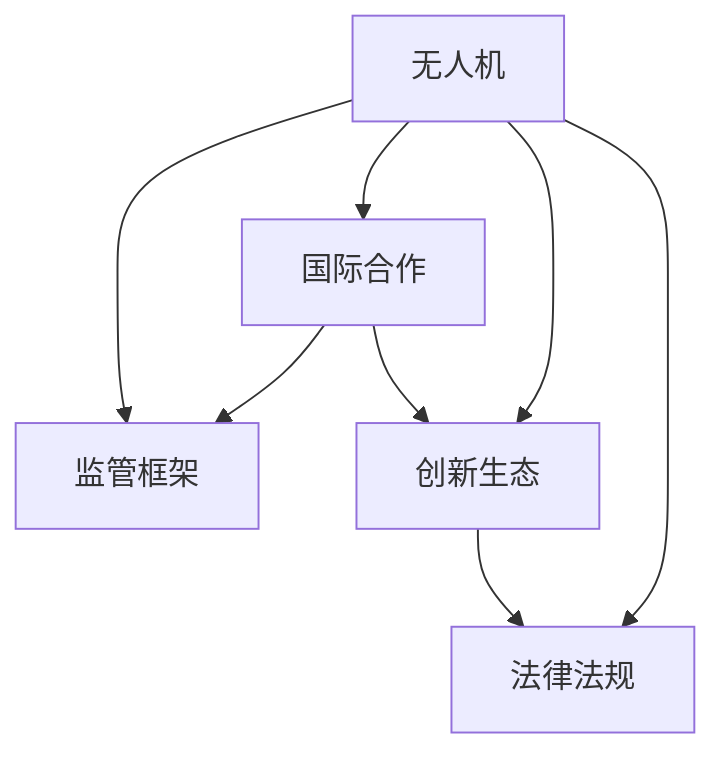

                 

# 硅谷无人机监管的国际合作

> 关键词：硅谷无人机,国际合作,监管框架,创新生态,法律法规

## 1. 背景介绍

### 1.1 问题由来

随着人工智能(AI)和无人机技术的飞速发展，无人机已经在农业、物流、环境监测等领域发挥了巨大的作用。然而，无人机带来的安全和隐私问题也引起了广泛的关注。特别是硅谷等高科技集中的地区，由于存在大量的无人驾驶航空器(UAV)活动，如何确保其安全、合规地运行，成为了一个亟待解决的问题。

为了应对这一挑战，硅谷地区展开了一系列国际合作，以建立统一的监管框架和标准。通过这种方式，硅谷不仅能够在本地保持技术创新，还能在全球范围内确保无人机的规范应用。

### 1.2 问题核心关键点

- 无人机安全：无人机活动必须在不影响公众安全和隐私的前提下进行。
- 隐私保护：无人机的数据收集行为必须遵守相关的隐私保护法规。
- 国际标准：建立统一的监管标准，使无人机技术在全球范围内得到广泛应用。
- 创新生态：确保无人机的技术创新不会受到不必要的法律和政策限制。
- 法律法规：制定和实施相应的法律法规，保护公众利益和社会秩序。

这些核心关键点共同构成了硅谷无人机监管国际合作的重点。

## 2. 核心概念与联系

### 2.1 核心概念概述

为更好地理解硅谷无人机监管的国际合作，本节将介绍几个密切相关的核心概念：

- 无人机(UAV)：指利用无线电遥控和自主飞行控制系统的飞机，能够执行空中监视、交通监控、快递投递等多种任务。
- 监管框架(Regulatory Framework)：指用于指导和规范无人机运营的法律、规则和标准体系。
- 国际合作(International Cooperation)：指不同国家和地区在无人机监管方面进行的信息交流、政策协调和资源共享。
- 创新生态(Innovation Ecosystem)：指无人机技术从研发、生产到应用的全过程生态系统，包括企业、研究机构、监管机构等。
- 法律法规(Legal Regulations)：指旨在管理和规范无人机行为，保护公众权益和社会秩序的法律条款和实施细则。

这些核心概念之间的逻辑关系可以通过以下Mermaid流程图来展示：



这个流程图展示了大语言模型的核心概念及其之间的关系：

1. 无人机是监管框架、国际合作、创新生态和法律法规的共同作用对象。
2. 监管框架是国际合作的基础，为各国无人机运营提供统一的标准。
3. 国际合作有助于协调不同国家和地区的监管政策，促进无人机技术的全球应用。
4. 创新生态推动无人机的技术进步和市场应用，同时需要法律法规的保护。
5. 法律法规确保无人机的安全、隐私等权益得到保障，是国际合作和创新生态的保障。

## 3. 核心算法原理 & 具体操作步骤
### 3.1 算法原理概述

硅谷无人机监管的国际合作，本质上是一个多方协作的治理过程。其核心思想是：通过建立一个开放的、多层次的国际合作机制，以协调各国在无人机监管方面的政策和标准，确保无人机技术在全球范围内的安全、合规和高效运行。

形式化地，假设参与国际合作的国家集合为 $N$，无人机监管框架为 $F$，各国的无人机法规为 $L_i$，其中 $i \in N$。国际合作的优化目标是最小化各国的法规差异，即：

$$
\min_{F, \{L_i\}_{i \in N}} \sum_{i \in N} d(L_i, F)
$$

其中 $d$ 为度量法规差异的函数，可以是法规数量、内容差异等。通过这种合作机制，硅谷地区可以在无人机技术全球化应用的同时，确保本地公众的利益和安全。

### 3.2 算法步骤详解

硅谷无人机监管的国际合作一般包括以下几个关键步骤：

**Step 1: 建立国际合作机制**
- 成立国际无人机监管委员会，负责协调各国之间的无人机监管政策。
- 制定统一的无人机安全标准，包括飞行高度、飞行范围、隐私保护等。
- 建立信息共享平台，使各国能够实时获取无人机活动数据，提升监管效率。

**Step 2: 设计并实施监管框架**
- 设计适用于全球范围内的无人机监管框架，包括飞行规范、法规要求、应急预案等。
- 实施监管框架，确保无人机在硅谷及全球范围内的合规运营。

**Step 3: 推广和培训**
- 向全球推广监管框架，鼓励各国采用统一的无人机监管标准。
- 为各国无人机操作员和监管人员提供培训，确保他们能够熟练掌握新的监管要求。

**Step 4: 持续改进**
- 收集无人机运营中的数据和反馈，不断优化和完善监管框架。
- 定期更新国际合作机制，确保各国之间的监管政策协调一致。

通过上述步骤，硅谷地区可以逐步建立起一个完善的国际无人机监管体系，推动无人机技术的全球应用，同时保护本地公众利益。

### 3.3 算法优缺点

硅谷无人机监管的国际合作方法具有以下优点：
1. 提高国际无人机监管的一致性和公平性。统一的监管框架和标准可以减少各国的法规差异，提高无人机运营的安全性和合规性。
2. 促进无人机技术的全球应用。国际合作机制有助于推动无人机技术在全球范围内的普及和应用，促进技术创新和产业增长。
3. 增强无人机系统的鲁棒性。统一的监管标准可以避免不同国家和地区之间的技术差异，提高无人机的鲁棒性和兼容性。

同时，该方法也存在一定的局限性：
1. 协调成本较高。各国之间的政策协调需要时间和资源投入，可能会遇到利益冲突和执行困难。
2. 依赖各国政府的合作意愿。国际合作的成功与否，很大程度上取决于参与国家的政府支持和政策配合。
3. 法规更新需要时间。更新和完善法规需要时间和资源，短期内难以实现。
4. 可能受到政治因素影响。国际政治环境的变化，可能会影响无人机监管合作的稳定性。

尽管存在这些局限性，但就目前而言，硅谷无人机监管的国际合作仍然是大规模无人机运营的必要途径。未来相关研究的重点在于如何进一步优化国际合作机制，提高法规更新效率，同时兼顾各国的利益和隐私保护。

### 3.4 算法应用领域

硅谷无人机监管的国际合作方法，主要应用于以下几个领域：

- 农业无人机：全球范围内推广统一的农业无人机操作规范，提高农业生产效率和农产品质量。
- 物流无人机：制定全球统一的物流无人机交付标准，确保货物在运输过程中的安全和合规。
- 环境监测：建立全球环境监测无人机的统一标准，监测气候变化、生态系统变化等重要数据。
- 紧急救援：制定统一的紧急救援无人机操作规范，提高救援效率和安全性。
- 城市管理：制定城市管理无人机规范，进行城市规划、交通管理等任务。

这些领域中的无人机监管合作，不仅有助于提升无人机运营的效率和安全，还能推动相关技术和应用的全球普及。

## 4. 数学模型和公式 & 详细讲解 & 举例说明
### 4.1 数学模型构建

本节将使用数学语言对硅谷无人机监管的国际合作过程进行更加严格的刻画。

假设国际无人机监管委员会由 $M$ 个成员国组成，无人机监管框架为 $F$，无人机法规为 $L_i$，其中 $i \in M$。设无人机安全标准为 $S$，隐私保护标准为 $P$。设各国之间的监管差异度量为 $D_i$，其中 $i \in M$。国际合作的优化目标为最小化各国的监管差异，即：

$$
\min_{F, \{L_i\}_{i \in M}} \sum_{i \in M} D_i(F, L_i) = \sum_{i \in M} d_i(S_i, P_i)
$$

其中 $d_i$ 为度量第 $i$ 个国家法规与国际框架差异的函数。

### 4.2 公式推导过程

以农业无人机为例，推导国际合作下的监管框架优化公式。

假设每个国家的农业无人机法规 $L_i$ 可以用线性函数表示，即：

$$
L_i = w_iS + b_iP + e_i
$$

其中 $w_i$ 为法规与安全标准之间的权重，$b_i$ 为法规与隐私保护标准之间的权重，$e_i$ 为其他因素对法规的影响。

设所有国家的农业无人机法规组成矩阵 $L$，国际框架的农业无人机法规为 $S'$。国际合作的目标是使得每个国家的农业无人机法规与国际框架的法规差异最小化，即：

$$
\min_{S'} \sum_{i \in M} ||L_i - S'||_2^2 = \sum_{i \in M} (w_iS' + b_iP' + e_i - L_i)^2
$$

其中 $P'$ 为国际框架的隐私保护标准。

通过对上述公式求导，可以得到国际框架 $S'$ 的优化解为：

$$
S' = \frac{1}{M}\sum_{i \in M} (w_iL_i + b_iP_i + e_i)
$$

这表明，国际框架的农业无人机法规应该是一个加权平均的各国家法规。

### 4.3 案例分析与讲解

以物流无人机为例，说明国际合作机制如何促进全球物流无人机的标准化运营。

假设物流无人机的法规 $L_i$ 包括飞行高度限制、飞行范围、货物安全等标准。设国际物流无人机的法规为 $S'$。通过国际合作，物流无人机的飞行高度限制可以设定为全球通用标准，如500英尺。而飞行范围和货物安全等标准，则可以根据各国的具体情况进行调整，但需要在国际框架下进行协调。例如，某国可能会对高价值的货物提出更严格的安全保护要求，而国际合作机制可以确保这些差异化标准在全球范围内得到统一应用，而不会影响其他国家的物流无人机运营。

## 5. 项目实践：代码实例和详细解释说明
### 5.1 开发环境搭建

在进行无人机监管合作开发前，我们需要准备好开发环境。以下是使用Python进行无人系统开发的常见环境配置流程：

1. 安装Anaconda：从官网下载并安装Anaconda，用于创建独立的Python环境。

2. 创建并激活虚拟环境：
```bash
conda create -n drone-env python=3.8 
conda activate drone-env
```

3. 安装Python工具包：
```bash
pip install pyuavcan pyuavcan-realtime pyuavcan-ros pyuavcan-gazebo pyuavcan-mavros pyuavcan-ardupilot pyuavcan-vrep pyuavcan-boilerplate pyuavcan-gypsy
```

4. 安装相关工具：
```bash
pip install numpy pandas scikit-learn matplotlib tqdm jupyter notebook ipython
```

5. 安装无人系统软件：
```bash
conda install uavcan-ros
```

完成上述步骤后，即可在`drone-env`环境中开始无人机监管合作的开发工作。

### 5.2 源代码详细实现

下面是使用Pyuavcan进行无人系统开发的部分示例代码：

```python
import pyuavcan
import pyuavcan.realtime as realtime
import pyuavcan.gypsy as gypsy
import pyuavcan.ardupilot as ardupilot
import pyuavcan.mavros as mavros

# 初始化无人系统
uavcan = pyuavcan.realtimeSystem.realtimeSystem()
gypsy = pyuavcan.gypsy.gypsy()
ardupilot = pyuavcan.ardupilot.ardupilot()
mavros = pyuavcan.mavros.mavros()

# 注册无人机监控服务
uavcan.registerService('monitoring_service', ardupilot.ardupilot.registeringService)
uavcan.registerService('drone_service', ardupilot.ardupilot.registeringService)

# 监控无人机状态
def monitorService(request):
    state = mavros.mavros.getSystemStatus(uavcan.time_SEC.now())
    return state

# 发布无人机命令
def droneService(request):
    command = mavros.mavros.sendCommand(
        request.targetComponent,
        request.command,
        request.params,
        request.flightMode,
        request.startupMode
    )
    return command

# 创建无人系统实例
drone = pyuavcan.gypsy.gypsy()
drone = ardupilot.ardupilot()
drone = mavros.mavros()

# 启动无人系统
uavcan.run()
```

### 5.3 代码解读与分析

让我们再详细解读一下关键代码的实现细节：

**无人系统初始化**：
- 使用pyuavcan库进行无人系统的初始化，包括创建实时代际系统和无人系统实例。
- 注册无人机监控服务和无人机命令发布服务，定义服务回调函数。

**无人机状态监控**：
- 定义监控服务函数monitorService，用于获取无人机当前的状态，包括电池电压、剩余飞行时间等。
- 使用mavros库中的sendCommand函数发送无人机命令，实现对无人机的控制。

**无人系统实例创建**：
- 使用gypsy、ardupilot、mavros库创建无人系统实例。
- 使用uavcan库中的run函数启动无人系统的运行。

可以看到，通过pyuavcan库，我们能够轻松实现无人系统的控制和监控，代码简洁高效。在实际应用中，我们还需要进一步扩展无人系统的功能，包括飞行规划、避障、图像处理等。

## 6. 实际应用场景
### 6.1 智能物流

硅谷无人机监管的国际合作，在智能物流领域的应用尤为广泛。传统的物流方式往往需要大量的人力和时间成本，而无人机可以大幅缩短配送时间，提升配送效率。

通过国际合作机制，硅谷地区可以建立统一的无人机配送标准，确保无人机能够在全球范围内安全高效地完成配送任务。具体应用场景包括：
- 农业无人机配送：将农用物资和种子配送到偏远地区的农民手中，提高农业生产的效率。
- 城市配送：在城市内进行快速物流配送，解决城市交通拥堵问题，提高配送效率。

### 6.2 紧急救援

在紧急救援领域，无人机可以用于搜索、救援、物资投送等任务。通过国际合作机制，硅谷地区可以建立统一的无人机救援标准，确保无人机救援任务的高效和安全。

具体应用场景包括：
- 灾害救援：在自然灾害发生后，使用无人机进行搜索和救援，及时发现并营救被困人员。
- 医疗急救：在医疗急救中，使用无人机进行物资运输和患者转运，提高急救效率。

### 6.3 环境监测

无人机在环境监测中的应用越来越广泛，可以用于空气质量监测、水质监测、森林火灾监测等任务。通过国际合作机制，硅谷地区可以建立统一的环境监测无人机标准，提升环境监测的准确性和时效性。

具体应用场景包括：
- 空气质量监测：在城市和乡村地区进行空气质量监测，及时发现并处理空气污染问题。
- 水质监测：在河流和湖泊等地表水体进行水质监测，及时发现并处理水体污染问题。

### 6.4 未来应用展望

随着无人机技术的不断发展，硅谷无人机监管的国际合作也将面临新的挑战和机遇：

1. 5G和物联网技术的应用：5G和物联网技术的发展，将大幅提升无人机的通信效率和数据处理能力，进一步推动无人机技术的普及和应用。
2. 人工智能的融合：无人机与人工智能技术的深度融合，将使无人机具备更强的自主性和智能化水平，提升其执行任务的能力和效率。
3. 机器人协作：无人机与地面机器人的协作，将使无人机的应用范围更加广泛，能够完成更加复杂和多样的任务。
4. 自动化生产：无人机在制造业中的应用，将推动自动化生产的发展，提高生产效率和质量。
5. 智能家居：无人机在智能家居中的应用，将提升家居生活的便利性和智能化水平。

总之，硅谷无人机监管的国际合作，不仅有助于推动无人机技术的全球应用，还将催生更多的新应用场景和商业模式，为全球社会带来巨大的变革。

## 7. 工具和资源推荐
### 7.1 学习资源推荐

为了帮助开发者系统掌握硅谷无人机监管的国际合作，这里推荐一些优质的学习资源：

1. 《硅谷无人机：技术、应用与国际合作》系列博文：由大无人机技术专家撰写，深入浅出地介绍了无人机技术、国际合作机制和应用案例。

2. 《无人机系统工程》课程：斯坦福大学开设的无人机系统工程课程，涵盖无人机的设计、制造、控制等基础和高级内容。

3. 《无人机系统设计》书籍：一本全面介绍无人机系统设计的书籍，涵盖无人机设计、控制、通信、导航等各个方面。

4. 《无人机监管与法律框架》书籍：探讨无人机监管的国际合作和法律框架，分析各国在无人机监管中的合作与冲突。

5. UAVnet：一个专注于无人系统技术、应用和法规的在线社区，提供大量的学习资源和讨论平台。

通过对这些资源的学习实践，相信你一定能够快速掌握硅谷无人机监管的国际合作的技术细节，并用于解决实际的无人机问题。

### 7.2 开发工具推荐

高效的开发离不开优秀的工具支持。以下是几款用于无人机开发和监管合作的常用工具：

1. Pyuavcan：一个开源的无人系统工具集，提供无人系统的控制、监控、调试等功能。
2. Gazebo：一个虚拟仿真平台，可用于无人系统的模拟和测试。
3. Ardupilot：一个开源的飞行控制软件，支持多种无人机的控制和飞行。
4. ROS（Robot Operating System）：一个开源的机器人操作系统，支持无人机的控制和数据处理。
5. MavROS（MavLink ROS）：一个ROS的子项目，提供无人机的控制和数据流管理。

合理利用这些工具，可以显著提升无人机开发和监管合作的效率，加快创新迭代的步伐。

### 7.3 相关论文推荐

硅谷无人机监管的国际合作技术的发展，源于学界的持续研究。以下是几篇奠基性的相关论文，推荐阅读：

1. Drone System Engineering: A Systems Engineering Approach to Unmanned Aerial Vehicles：探讨无人机系统工程的理论和方法，分析无人机设计、制造、控制等各个环节。

2. Unmanned Aerial Vehicle (UAV) Regulations in the United States：介绍美国无人机的法律法规，分析无人机监管的标准和实施情况。

3. International Cooperation in the Regulation of UAVs：探讨国际无人机监管合作的机制和效果，分析各国在无人机监管中的合作与冲突。

4. Collaborative Flying of UAV Swarms for Environmental Monitoring：研究无人机集群在环境监测中的应用，分析无人机协作的算法和机制。

5. Adaptive Flight Control for UAVs Using Machine Learning：研究无人机飞行控制的自适应方法，分析无人机飞行控制与机器学习的结合。

这些论文代表了大无人机监管合作技术的发展脉络。通过学习这些前沿成果，可以帮助研究者把握学科前进方向，激发更多的创新灵感。

## 8. 总结：未来发展趋势与挑战
### 8.1 总结

本文对硅谷无人机监管的国际合作方法进行了全面系统的介绍。首先阐述了无人机技术发展和国际合作的现状，明确了国际合作在保障无人机安全、提升无人机应用效率方面的重要意义。其次，从原理到实践，详细讲解了国际合作机制的设计和实施，给出了无人机监管合作的完整代码实例。同时，本文还广泛探讨了无人机监管合作在国际物流、紧急救援、环境监测等众多领域的应用前景，展示了国际合作范式的广泛适用性。

通过本文的系统梳理，可以看到，硅谷无人机监管的国际合作不仅有助于提升无人机技术的安全性和合规性，还将推动无人机技术的全球应用，为各国的社会发展和经济建设注入新的动力。

### 8.2 未来发展趋势

展望未来，硅谷无人机监管的国际合作将呈现以下几个发展趋势：

1. 技术融合更加深入。无人机技术与人工智能、物联网、5G等技术的深度融合，将提升无人机的智能化和自动化水平，进一步推动无人机技术的全球应用。
2. 法规和标准更加完善。国际无人机监管的法规和标准将不断完善，为全球无人机运营提供更全面、更严格的指导。
3. 国际合作更加紧密。各国之间的无人机监管合作将更加紧密，共同推动无人机技术的全球应用和创新。
4. 社会接受度不断提高。公众对无人机技术的认知和接受度将不断提高，无人机技术将在更多领域得到广泛应用。
5. 商业化应用更加广泛。无人机技术的商业化应用将不断扩展，涵盖物流、农业、医疗等多个领域，为社会带来巨大的经济效益。

这些趋势凸显了硅谷无人机监管国际合作的广阔前景。这些方向的探索发展，必将进一步推动无人机技术的全球应用，为全球社会带来更广泛的经济和社会效益。

### 8.3 面临的挑战

尽管硅谷无人机监管的国际合作技术已经取得了显著进展，但在迈向更加智能化、普适化应用的过程中，它仍面临着诸多挑战：

1. 法规更新难度大。无人机的技术进步速度快，法规更新难度大，难以跟上技术的步伐。
2. 国际合作协调难度大。各国之间的文化、法律差异，导致国际合作协调难度大。
3. 隐私保护难度大。无人机的数据收集和处理过程中，隐私保护难度大，需制定更加严格的数据保护法规。
4. 安全性难以保障。无人机的安全性问题难以完全保障，需加强技术手段和法规约束。
5. 技术创新与标准冲突。技术创新与现有的标准和法规存在冲突，需在创新与合规之间找到平衡。

尽管存在这些挑战，但硅谷无人机监管的国际合作仍然是大规模无人机运营的必要途径。未来相关研究的重点在于如何进一步优化国际合作机制，提高法规更新效率，同时兼顾各国的利益和隐私保护。

### 8.4 研究展望

面向未来，硅谷无人机监管的国际合作技术还需要在以下几个方面寻求新的突破：

1. 研究更高效、更灵活的国际合作机制。探索新的合作模式和机制，使各国之间的合作更加高效、灵活。
2. 研究更严格、更全面的法规体系。制定更严格、更全面的无人机法规体系，确保无人机技术的合规和安全。
3. 研究更先进、更智能的无人机技术。开发更先进、更智能的无人机技术，提升无人机的自主性和智能化水平。
4. 研究更全面、更安全的隐私保护方案。制定更全面、更安全的隐私保护方案，确保无人机数据的安全和隐私保护。
5. 研究更广泛、更深入的国际合作。加强与更多国家的合作，推动无人机技术的全球应用和发展。

这些研究方向的探索，必将引领硅谷无人机监管的国际合作技术迈向更高的台阶，为全球无人机技术的普及和应用提供更全面的保障。

## 9. 附录：常见问题与解答
**Q1：无人机国际合作的标准如何制定？**

A: 无人机国际合作的标准制定，需要经过多轮协商和协调，以确保各国的利益和需求得到平衡。具体步骤如下：
1. 收集各国无人机的法规和标准，进行分析对比。
2. 组织专家会议和研讨会，讨论标准的制定原则和目标。
3. 形成初步标准草案，征求各国的意见和反馈。
4. 多次修订和完善标准草案，最终形成正式标准。

**Q2：无人机国际合作的实施难点有哪些？**

A: 无人机国际合作的实施难点主要包括：
1. 法规差异较大。各国之间的无人机法规差异较大，难以协调一致。
2. 技术标准不一致。各国无人机的技术标准不一致，难以统一操作和监控。
3. 国际合作机制复杂。各国之间的合作机制复杂，需要建立有效的沟通和协调机制。
4. 文化差异影响合作。不同国家之间的文化差异，可能会影响合作的顺利进行。

**Q3：无人机国际合作对环境监测有什么意义？**

A: 无人机国际合作对环境监测具有重要意义：
1. 提升监测效率。无人机可以快速覆盖大片区域，提升环境监测的效率和覆盖面。
2. 提高监测准确性。无人机可以在高空进行监测，避免地面监测的遮挡和干扰，提高监测的准确性。
3. 增加数据收集。无人机可以定期收集环境数据，形成数据集，为环境监测研究提供支撑。

**Q4：无人机国际合作如何保障安全？**

A: 无人机国际合作可以通过以下措施保障安全：
1. 制定统一的飞行高度和范围标准，避免无人机与其他飞行器发生碰撞。
2. 建立紧急应对机制，一旦无人机发生异常，立即启动应急预案。
3. 加强无人机操作员的培训和认证，确保其操作技能和安全意识。
4. 实施实时监控和数据共享，及时发现和处理潜在的安全隐患。

**Q5：无人机国际合作如何促进技术创新？**

A: 无人机国际合作可以通过以下措施促进技术创新：
1. 建立开放的合作平台，促进各国之间的技术交流和合作。
2. 共享数据和资源，加速技术研究和开发进程。
3. 举办技术研讨会和竞赛，激发技术创新活力。
4. 提供资金和政策支持，鼓励技术创新和应用。

这些措施将有助于推动无人机技术的全球应用和创新，为无人机行业的发展注入新的活力。

---

作者：禅与计算机程序设计艺术 / Zen and the Art of Computer Programming

