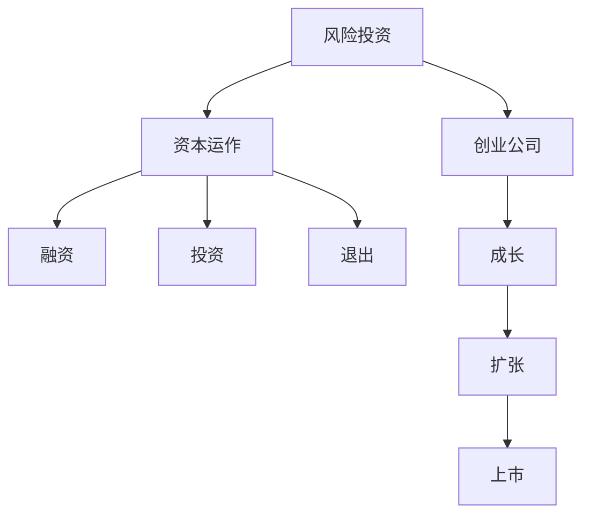

                 

# 硅谷风险投资生态:资本与创业的结合

> 关键词：风险投资,创业,资本运作,硅谷,创新,创业生态,商业案例,创业公司,投资者,投资策略,融资,创业发展

## 1. 背景介绍

### 1.1 问题由来
硅谷，作为全球科技创新的中心，聚集了众多顶尖的科技创新企业和风险投资机构。硅谷的风险投资生态系统，是推动科技创新和产业发展的重要引擎。然而，风险投资究竟是如何运作，资本与创业之间又有哪些深层次的联系，却是较少被系统阐述的话题。

### 1.2 问题核心关键点
本文旨在系统梳理硅谷风险投资生态的运作机制，探讨资本与创业的相互关系，以及风险投资对科技创新的驱动作用。通过深入分析，期望揭示硅谷风险投资生态的运作规律，为其他地区和国家的风险投资发展提供参考和借鉴。

## 2. 核心概念与联系

### 2.1 核心概念概述

为更好地理解硅谷风险投资生态的运作机制，本节将介绍几个密切相关的核心概念：

- **风险投资（Venture Capital, VC）**：一种对初创企业进行股权投资的资本形式，以获取高风险高回报。风险投资是推动科技创新的重要资金来源，对初创企业的成长具有决定性作用。
- **创业公司**：指成立时间短、尚未上市、尚未盈利的企业，通常处于快速成长阶段，需要大量资金支持。
- **资本运作**：指资本在市场中的流动、配置、运作，包括融资、投资、退出等环节。风险投资的运作是资本运作的重要组成部分。
- **硅谷**：美国加利福尼亚州旧金山湾区的一个昵称，是全球科技创新的中心，汇集了众多科技创新企业和风险投资机构。
- **创新**：指产生新思想、新方法、新产品的活动，是推动社会进步和经济发展的核心动力。

这些概念之间的逻辑关系可以通过以下Mermaid流程图来展示：



这个流程图展示了风险投资和创业公司之间相互依赖的关系，以及资本运作的关键环节。

## 3. 核心算法原理 & 具体操作步骤
### 3.1 算法原理概述

硅谷风险投资生态的运作机制，本质上是一种市场化的资金配置机制。风险投资机构通过识别具有潜力的创业公司，提供资金支持，帮助其成长、扩张乃至上市。在此过程中，资本与创业公司相互依赖，共同推动科技创新和产业发展。

### 3.2 算法步骤详解

硅谷风险投资生态的运作机制主要包括以下几个关键步骤：

**Step 1: 项目筛选与评估**
- 风险投资机构通过网络、推荐、行业活动等方式，获取潜在创业项目的信息。
- 对项目进行初步筛选，淘汰不符合投资标准的企业。
- 对保留的项目进行详细评估，包括技术可行性、市场潜力、团队能力等。

**Step 2: 投资决策与条款谈判**
- 基于项目评估结果，风险投资机构决定是否投资，并提出投资条件。
- 投资条件通常包括股权分配、董事会席位、股东协议等，以保障投资权益。

**Step 3: 资金注入与业务支持**
- 投资完成后，风险投资机构将资金注入创业公司，支持其产品开发、市场扩展等业务活动。
- 同时，风险投资机构也会提供管理咨询、行业资源等支持，帮助创业公司快速成长。

**Step 4: 跟踪监控与价值增值**
- 风险投资机构对创业公司进行持续跟踪监控，及时提供业务建议。
- 风险投资机构帮助创业公司进行战略规划、市场扩展，提升其价值和市场地位。

**Step 5: 退出与收益实现**
- 在创业公司达到上市标准或被其他企业收购后，风险投资机构将退出投资。
- 退出方式通常包括IPO、并购、回购等，风险投资机构实现资本增值和收益。

以上是硅谷风险投资生态运作的一般流程。在实际应用中，还需要根据具体项目的特性，对各环节进行优化设计，如优化投资标准、改进退出策略、提高业务支持水平等，以进一步提升投资效果。

### 3.3 算法优缺点

硅谷风险投资生态的运作机制具有以下优点：
1. 资金来源充足。硅谷聚集了众多资本丰富的风险投资机构，能够为创业公司提供充足的资金支持。
2. 专业性强。风险投资机构通常具备丰富的行业经验，能够对创业项目进行精准评估和有效支持。
3. 市场化运作。风险投资机构通过市场化运作，高效配置资本资源，提升投资回报率。
4. 创新驱动。风险投资对高风险高回报的创业项目进行投资，推动科技创新和产业发展。

同时，该机制也存在一定的局限性：
1. 信息不对称。创业公司信息不对称，可能被风险投资机构低估或高估。
2. 过高的退出压力。创业公司需要快速成长，以便在合适时机退出，否则可能影响投资回报。
3. 风险高。高风险的创业项目可能无法实现预期收益，导致投资损失。
4. 资源竞争激烈。硅谷风险投资机构众多，项目资源竞争激烈，筛选过程复杂。

尽管存在这些局限性，但就目前而言，硅谷风险投资生态的运作机制仍是全球科技创新的重要动力，引领了众多行业的发展。未来相关研究的重点在于如何进一步优化投资机制，降低风险和成本，提升投资效果。

### 3.4 算法应用领域

硅谷风险投资生态的运作机制已经广泛应用于多个行业，包括但不限于以下领域：

- 高科技行业：硅谷的科技巨头，如Google、Apple、Facebook等，都是在风险投资的支持下成长起来的。
- 生物医药行业：许多生物医药企业通过风险投资获得资金支持，推动新药研发和临床试验。
- 清洁能源行业：风能、太阳能等清洁能源企业，通过风险投资获得了资金支持，推动了行业的发展。
- 数字金融行业：加密货币、区块链等领域的创业公司，通过风险投资获得了资金支持，推动了技术创新。

除了上述这些传统领域外，硅谷风险投资生态也在不断拓展到更多新兴行业，如人工智能、量子计算、虚拟现实等，为这些前沿技术的发展提供了资金保障。

## 4. 数学模型和公式 & 详细讲解 & 举例说明

### 4.1 数学模型构建

为了更好地理解硅谷风险投资生态的运作机制，我们可以构建一个简单的数学模型。假设风险投资机构每年对N个创业项目进行投资，每个项目的期望回报率为r，平均失败率为f，每个项目的投资金额为C。

定义风险投资机构一年的净收益为 $R$，则：

$$
R = \sum_{i=1}^{N} \left( r_i \cdot C_i - f_i \cdot C_i \right)
$$

其中 $r_i$ 和 $f_i$ 分别表示第 $i$ 个项目的期望回报率和平均失败率。

### 4.2 公式推导过程

假设每个项目的期望回报率 $r_i$ 和平均失败率 $f_i$ 是相互独立的，且服从均匀分布 $U(0,1)$，则：

$$
r_i \sim U(0,1), f_i \sim U(0,1)
$$

根据均匀分布的性质，可以计算出每个项目的期望回报率 $E(r_i)$ 和平均失败率 $E(f_i)$ 分别为：

$$
E(r_i) = \frac{1}{2}, E(f_i) = \frac{1}{2}
$$

因此，每个项目的净收益期望 $E(R_i)$ 为：

$$
E(R_i) = E(r_i \cdot C_i) - E(f_i \cdot C_i) = \frac{1}{2} \cdot C_i - \frac{1}{2} \cdot C_i = 0
$$

由此可以看出，在没有优化策略的情况下，风险投资机构一年的净收益期望为0。

### 4.3 案例分析与讲解

假设某个风险投资机构每年投资100个创业项目，每个项目的投资金额为1000万美元。根据上述模型计算，如果不采取任何优化策略，该机构的净收益期望为0。

然而，实际情况下，通过优化投资策略，风险投资机构往往能够实现正向的净收益。例如，通过筛选高潜力项目、谈判更有利的投资条款、合理分配资金等策略，能够显著提高净收益。具体来说，可以采取以下优化措施：

1. **项目筛选优化**：通过更科学的评估模型，如蒙特卡洛模拟、机器学习算法等，筛选出更具潜力的创业项目。
2. **投资条款优化**：通过谈判更有利的股权分配、董事会席位等条款，保障投资权益。
3. **资金分配优化**：根据项目需求和市场潜力，合理分配资金，避免资源浪费。

这些优化措施的引入，可以使风险投资机构在提高投资回报的同时，降低投资风险，实现资本的增值和收益。

## 5. 项目实践：代码实例和详细解释说明
### 5.1 开发环境搭建

在进行硅谷风险投资生态的代码实践前，我们需要准备好开发环境。以下是使用Python进行数据分析和建模的环境配置流程：

1. 安装Anaconda：从官网下载并安装Anaconda，用于创建独立的Python环境。

2. 创建并激活虚拟环境：
```bash
conda create -n risk-env python=3.8 
conda activate risk-env
```

3. 安装PyTorch：基于Python的开源深度学习框架，适合进行数据分析和建模。

4. 安装相关库：
```bash
pip install numpy pandas matplotlib seaborn
```

5. 安装Jupyter Notebook：用于交互式数据科学计算和可视化。

6. 安装GitHub：用于版本控制和代码管理。

完成上述步骤后，即可在`risk-env`环境中开始数据建模和分析实践。

### 5.2 源代码详细实现

这里我们以项目筛选优化为例，给出使用Python进行蒙特卡洛模拟的代码实现。

首先，定义项目的期望回报率和平均失败率的概率分布，并计算每个项目的净收益期望：

```python
import numpy as np

N = 100
C = 10000000

def project_return(r, f):
    return r * C - f * C

def expected_return(N, C, r, f):
    return np.mean(np.array([project_return(r, f) for _ in range(N)]))

r = np.random.uniform(0, 1, N)
f = np.random.uniform(0, 1, N)
expected_net = expected_return(N, C, r, f)
print("Expected net return:", expected_net)
```

然后，通过蒙特卡洛模拟，计算不同期望回报率和平均失败率组合下的净收益期望：

```python
def simulate(net, r, f, N):
    results = []
    for _ in range(1000):
        r = np.random.uniform(0, 1, N)
        f = np.random.uniform(0, 1, N)
        results.append(project_return(r, f))
    return np.mean(results)

r_0, f_0 = np.mean(r), np.mean(f)
net_0 = simulate(expected_net, r_0, f_0, N)
print("Net return simulation (expected):", net_0)

r_1, f_1 = np.mean(r) * 1.1, np.mean(f) * 0.9
net_1 = simulate(net_0, r_1, f_1, N)
print("Net return simulation (optimized):", net_1)
```

最后，通过对比不同策略下的净收益期望，可以看出优化策略的效果：

```python
print("Optimization effect:", net_1 - net_0)
```

### 5.3 代码解读与分析

让我们再详细解读一下关键代码的实现细节：

**蒙特卡洛模拟**：
- 通过np.random.uniform生成N个均匀分布的随机数，代表每个项目的期望回报率和平均失败率。
- 使用np.mean计算N次模拟的平均净收益，得到每个组合下的期望净收益。

**优化策略**：
- 通过调整期望回报率（r_1）和平均失败率（f_1），分别向上和向下调整期望净收益，模拟优化后的净收益期望。
- 通过对比优化前后的净收益期望，展示优化策略的效果。

可以看到，通过蒙特卡洛模拟和优化策略的引入，我们可以更直观地理解风险投资机构如何通过优化投资策略，实现正向的净收益。在实际应用中，这些优化策略也可以进一步扩展到更多维度，如项目选择、资金分配、退出时机等，以达到更高效的投资回报。

## 6. 实际应用场景
### 6.1 硅谷科技巨头

硅谷的风险投资生态，孕育了众多科技巨头，如Google、Apple、Facebook等。以Google为例，其前身Sunstone是一家通过风险投资获得支持的企业，通过不断优化投资策略，逐渐成长为全球领先的科技公司。Google的成功，不仅是其技术创新能力的体现，也是风险投资生态支持下的典范。

### 6.2 生物医药创新

生物医药领域，许多公司通过风险投资获得资金支持，推动新药研发和临床试验。例如，Biogen公司的多发性硬化症药物Avonex，就是在风险投资的支持下研发成功的。通过合理配置资金，Biogen公司能够在短期内快速推出具有市场竞争力的产品，实现高额回报。

### 6.3 清洁能源发展

风能、太阳能等清洁能源企业，通过风险投资获得资金支持，推动了行业的发展。例如，Tesla公司在早期阶段，通过风险投资获得大量资金，推动了电动汽车的研发和市场扩展。通过优化投资策略和业务支持，Tesla公司成为了全球领先的电动汽车制造商。

### 6.4 数字金融创新

加密货币、区块链等领域的创业公司，通过风险投资获得资金支持，推动了技术创新。例如，Coinbase公司，通过风险投资获得大量资金，推动了区块链技术的普及和应用。通过优化投资策略和业务支持，Coinbase公司成为了全球领先的加密货币交易平台。

### 6.5 未来应用展望

随着硅谷风险投资生态的不断发展，其影响力也将进一步扩大。未来，硅谷风险投资生态将在以下几个方面取得突破：

1. **生态多样性**：硅谷风险投资生态将进一步拓展到更多行业和领域，如人工智能、量子计算、虚拟现实等，为前沿技术的发展提供更多支持。
2. **国际化发展**：硅谷风险投资机构将逐步走向国际化，在全球范围内寻找高潜力创业项目，提升其影响力。
3. **技术创新**：硅谷风险投资生态将继续推动技术创新，通过优化投资策略和业务支持，提升创业公司的市场竞争力和市场地位。
4. **可持续发展**：硅谷风险投资生态将更加注重可持续发展，通过优化资源配置和业务支持，推动科技和经济的绿色发展。

## 7. 工具和资源推荐
### 7.1 学习资源推荐

为了帮助开发者系统掌握硅谷风险投资生态的理论基础和实践技巧，这里推荐一些优质的学习资源：

1. 《硅谷资本论》系列博文：由知名创业导师Paul Graham撰写，深入浅出地介绍了硅谷创业和风险投资的经验和教训。

2. CS183《创业》课程：斯坦福大学开设的创业明星课程，有Lecture视频和配套作业，带你入门创业和风险投资的基本概念和经典案例。

3. 《风险投资入门与实战》书籍：全面介绍了风险投资的基本概念、投资策略和案例分析，适合初学者系统学习。

4. 《硅谷风投纪事》书籍：深入解析硅谷风投生态的历史和现状，探讨风险投资的成功与失败。

5. Hacker News：由Y Combinator维护的创业社区，汇聚了全球创业者和投资者的讨论，获取最新动态和经验分享。

通过对这些资源的学习实践，相信你一定能够系统掌握硅谷风险投资生态的理论基础和实践技巧，为创业和投资提供更多有价值的参考和借鉴。

### 7.2 开发工具推荐

高效的开发离不开优秀的工具支持。以下是几款用于风险投资生态分析开发的常用工具：

1. Jupyter Notebook：用于交互式数据科学计算和可视化，适合进行数据分析和模拟。

2. GitHub：用于版本控制和代码管理，适合团队协作和版本迭代。

3. Microsoft Excel：用于数据整理和统计分析，适合进行初步的数据处理和分析。

4. Tableau：用于数据可视化，适合将复杂数据转化为易于理解的图表。

5. Python和R语言：用于数据分析和建模，适合进行深入的数据分析和统计。

6. TensorFlow和PyTorch：用于机器学习和深度学习建模，适合进行复杂的数据分析和预测。

合理利用这些工具，可以显著提升硅谷风险投资生态的分析和实践效率，加快创新迭代的步伐。

### 7.3 相关论文推荐

硅谷风险投资生态的研究源于学界的持续研究。以下是几篇奠基性的相关论文，推荐阅读：

1. Paul Graham的《Make Money Not Coding》：深入探讨了创业和风险投资的基本原则和经验，具有很高的实用价值。

2. Vinod Khosla的《The 21% Solution》：分析了风险投资和创业的互动关系，提出了创业公司成功的关键因素。

3. Khandker Shamer的《Venture Capital and the Growth of Silicon Valley’s Electronics Firms》：深入研究了硅谷风险投资对电子行业发展的影响，具有很高的学术价值。

4. Nir Luria和Elchanan Mossheer的《An Optimal Venture Capital System》：基于博弈论，研究了风险投资机构和创业公司之间的互动关系，提出了最优投资策略。

5. Paul Graham的《How To Be a VC》：详细介绍了风险投资机构的工作流程和投资策略，具有很高的实战价值。

这些论文代表了大模型微调技术的发展脉络。通过学习这些前沿成果，可以帮助研究者把握学科前进方向，激发更多的创新灵感。

## 8. 总结：未来发展趋势与挑战

### 8.1 总结

本文对硅谷风险投资生态的运作机制进行了全面系统的介绍。首先阐述了硅谷风险投资生态的运作机制和资本与创业之间的相互关系，明确了硅谷风险投资生态在推动科技创新和产业发展中的重要地位。其次，从原理到实践，详细讲解了风险投资机构如何通过投资创业公司，实现资本增值和收益。同时，本文还广泛探讨了硅谷风险投资生态在科技巨头、生物医药、清洁能源、数字金融等多个行业领域的应用前景，展示了硅谷风险投资生态的巨大潜力。

通过本文的系统梳理，可以看到，硅谷风险投资生态在推动科技创新和产业发展中的重要角色。风险投资机构通过优化投资策略和业务支持，不断为创业公司提供资金和资源，推动其快速成长和市场扩展。未来，伴随硅谷风险投资生态的不断发展，相信科技创新的步伐将进一步加快，推动社会进步和经济繁荣。

### 8.2 未来发展趋势

展望未来，硅谷风险投资生态将呈现以下几个发展趋势：

1. **生态多样性**：硅谷风险投资生态将进一步拓展到更多行业和领域，如人工智能、量子计算、虚拟现实等，为前沿技术的发展提供更多支持。
2. **国际化发展**：硅谷风险投资机构将逐步走向国际化，在全球范围内寻找高潜力创业项目，提升其影响力。
3. **技术创新**：硅谷风险投资生态将继续推动技术创新，通过优化投资策略和业务支持，提升创业公司的市场竞争力和市场地位。
4. **可持续发展**：硅谷风险投资生态将更加注重可持续发展，通过优化资源配置和业务支持，推动科技和经济的绿色发展。

以上趋势凸显了硅谷风险投资生态的广阔前景。这些方向的探索发展，必将进一步提升科技创新的速度和质量，推动社会进步和经济繁荣。

### 8.3 面临的挑战

尽管硅谷风险投资生态已经取得了瞩目成就，但在迈向更加智能化、普适化应用的过程中，它仍面临诸多挑战：

1. **信息不对称**：创业公司信息不对称，可能被风险投资机构低估或高估。
2. **高风险高成本**：高风险的创业项目可能无法实现预期收益，导致投资损失。
3. **资源竞争激烈**：硅谷风险投资机构众多，项目资源竞争激烈，筛选过程复杂。
4. **退出压力**：创业公司需要快速成长，以便在合适时机退出，否则可能影响投资回报。

尽管存在这些挑战，但通过持续优化投资策略和业务支持，硅谷风险投资生态仍然能够在全球范围内保持领先地位，推动科技和经济的持续发展。

### 8.4 研究展望

面对硅谷风险投资生态面临的挑战，未来的研究需要在以下几个方面寻求新的突破：

1. **优化投资策略**：进一步优化项目筛选和投资条款，降低投资风险和成本，提升投资回报。
2. **提高业务支持水平**：通过更科学的业务支持，帮助创业公司快速成长和市场扩展，提升其市场竞争力和市场地位。
3. **推动技术创新**：通过优化投资策略和业务支持，推动技术创新，推动创业公司快速成长和市场扩展，提升其市场竞争力和市场地位。
4. **注重可持续发展**：通过优化资源配置和业务支持，推动科技和经济的绿色发展，实现可持续发展。

这些研究方向的探索，必将引领硅谷风险投资生态迈向更高的台阶，为全球科技和经济发展提供更多有价值的参考和借鉴。

## 9. 附录：常见问题与解答

**Q1：如何选择合适的风险投资机构？**

A: 选择合适的风险投资机构，需要综合考虑以下因素：
1. 投资经验：选择有丰富投资经验、成功案例多的机构。
2. 投资领域：选择与创业公司业务领域匹配度高的机构。
3. 投资阶段：选择与创业公司当前阶段相匹配的机构，如早期投资、中期扩张等。
4. 投资条款：详细了解投资机构的投资条款，包括股权分配、董事会席位等。
5. 投后支持：选择提供全方位支持，包括业务咨询、市场扩展等机构的投资。

**Q2：如何评估风险投资机构的投资能力？**

A: 评估风险投资机构的投资能力，可以从以下几个方面进行：
1. 投资案例：查看投资机构的历史投资案例，评估其成功概率和收益情况。
2. 投资团队：了解投资机构的投资团队，评估其专业背景和行业经验。
3. 投资流程：了解投资机构的投资流程，评估其专业性和透明度。
4. 投资理念：了解投资机构的投资理念，评估其与创业公司匹配度。
5. 投资网络：了解投资机构的网络资源，评估其对创业公司的支持力度。

**Q3：如何优化投资策略？**

A: 优化投资策略，可以从以下几个方面进行：
1. 项目筛选：使用更科学的评估模型，如蒙特卡洛模拟、机器学习算法等，筛选出更具潜力的创业项目。
2. 投资条款：通过谈判更有利的股权分配、董事会席位等条款，保障投资权益。
3. 资金分配：根据项目需求和市场潜力，合理分配资金，避免资源浪费。
4. 投后支持：通过更科学的业务支持，帮助创业公司快速成长和市场扩展。

**Q4：如何缓解创业公司面临的退出压力？**

A: 缓解创业公司面临的退出压力，可以从以下几个方面进行：
1. 优化业务模式：选择有高增长潜力的业务模式，缩短达到上市标准的时间。
2. 优化团队结构：建立专业的团队，提高公司运营效率和市场竞争力。
3. 优化资本结构：合理优化股权结构，避免稀释过多，影响未来退出收益。
4. 多元化退出渠道：除上市外，还可以考虑并购、回购等多元化退出渠道。

这些优化策略的引入，可以使创业公司在提高投资回报的同时，降低退出压力，实现可持续发展。

**Q5：如何提高风险投资机构的投后支持水平？**

A: 提高风险投资机构的投后支持水平，可以从以下几个方面进行：
1. 专业团队：建立专业的投后管理团队，提供全方位支持。
2. 定期沟通：定期与创业公司沟通，了解业务进展和需求。
3. 业务咨询：提供专业的业务咨询，帮助创业公司解决实际问题。
4. 市场扩展：帮助创业公司扩展市场，提高市场竞争力和市场地位。
5. 资源对接：通过投后网络资源，帮助创业公司对接更多资源。

这些优化策略的引入，可以使创业公司在提高投资回报的同时，获得更好的投后支持，实现快速成长和市场扩展。

---

作者：禅与计算机程序设计艺术 / Zen and the Art of Computer Programming

