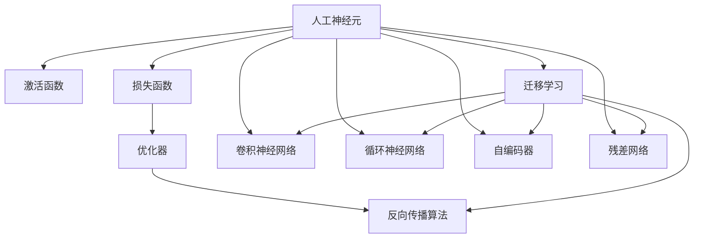

                 

# 神经网络：人工智能的基石

> 关键词：神经网络,深度学习,人工神经元,反向传播算法,激活函数,损失函数,优化器,卷积神经网络,循环神经网络,自编码器,残差网络,迁移学习

## 1. 背景介绍

### 1.1 问题由来
人工智能（AI）作为当今科技领域最热门的话题之一，已经成为各行各业创新的重要驱动力。神经网络，作为人工智能的核心组成部分，是一种模拟人类神经系统结构和功能的计算模型。它通过大量的训练数据和复杂的算法，可以从输入数据中学习到丰富的特征表示，进而对数据进行分类、预测、生成等多种操作。

神经网络的研究起源于20世纪60年代，最早的神经网络模型基于人工神经元，用于解决感知机问题。随着计算资源的日益丰富和算法设计的不断进步，神经网络逐步发展成为深度学习（Deep Learning）技术的代表，广泛应用于计算机视觉、自然语言处理、语音识别、自动驾驶等领域，取得了令人瞩目的成就。

### 1.2 问题核心关键点
神经网络的核心在于通过一系列的线性变换和激活函数，将输入数据映射到更高维度的特征空间中。这一过程可以通过深度学习中的多层神经网络实现，其中每一层都包含多个神经元，每一层输入和输出都是前一层的加权和变换结果。通过不断叠加更多的隐藏层，神经网络可以学习到更加复杂和抽象的特征表示，从而在各种任务上获得优异的性能。

神经网络的核心关键点包括：
- **神经元**：神经网络的基本计算单元，接收输入信号并计算输出。
- **激活函数**：用于引入非线性特性，增加模型的表达能力。
- **损失函数**：用于衡量模型预测输出与真实标签之间的差异，是优化算法的核心。
- **优化器**：用于根据损失函数的梯度信息，更新模型参数，优化模型性能。
- **反向传播算法**：用于计算损失函数对模型参数的梯度，是训练神经网络的主要工具。

## 2. 核心概念与联系

### 2.1 核心概念概述

为更好地理解神经网络的工作原理和优化方向，本节将介绍几个密切相关的核心概念：

- **人工神经元**：神经网络的基本计算单元，接收输入信号并计算输出。每个神经元接收若干输入信号，并经过加权和线性变换，再加上激活函数，得到最终输出。

- **激活函数**：用于引入非线性特性，增加模型的表达能力。常见的激活函数包括Sigmoid、ReLU、Tanh等。

- **损失函数**：用于衡量模型预测输出与真实标签之间的差异，是优化算法的核心。常见的损失函数包括交叉熵损失、均方误差损失等。

- **优化器**：用于根据损失函数的梯度信息，更新模型参数，优化模型性能。常见的优化器包括SGD、Adam、Adagrad等。

- **反向传播算法**：用于计算损失函数对模型参数的梯度，是训练神经网络的主要工具。反向传播算法通过链式法则，将误差从输出层反向传播到输入层，计算每个参数的梯度。

- **卷积神经网络**：一种专门处理图像和信号数据的神经网络，通过卷积层提取局部特征，池化层减小特征图尺寸，最终全连接层输出结果。

- **循环神经网络**：一种专门处理序列数据的神经网络，通过循环层记忆历史信息，适用于文本、音频等序列数据的建模。

- **自编码器**：一种无监督学习算法，通过将输入数据压缩成低维编码，再通过解码器还原，学习到数据的局部结构和特征表示。

- **残差网络**：通过引入残差连接，解决深度网络训练过程中的梯度消失问题，构建更深的网络结构。

- **迁移学习**：通过在不同领域之间的知识迁移，提高模型的泛化能力和适应性，是神经网络应用的重要范式。

这些核心概念之间的逻辑关系可以通过以下Mermaid流程图来展示：



这个流程图展示了大语言模型的核心概念及其之间的关系：

1. 人工神经元通过激活函数、损失函数、优化器、反向传播算法等工具，完成输入数据的计算和模型参数的优化。
2. 卷积神经网络、循环神经网络、自编码器、残差网络等特定类型的神经网络，分别适用于不同的数据类型和任务。
3. 迁移学习通过在不同领域之间的知识迁移，提高模型的泛化能力和适应性。

这些概念共同构成了神经网络的计算框架，使得神经网络能够处理各种复杂的数据类型和任务，成为人工智能技术的重要基石。

## 3. 核心算法原理 & 具体操作步骤

### 3.1 算法原理概述

神经网络的核心算法是反向传播算法，用于计算损失函数对模型参数的梯度，并根据梯度信息进行参数更新，优化模型性能。反向传播算法基于链式法则，将误差从输出层反向传播到输入层，计算每个参数的梯度，最终更新模型参数。

神经网络的训练过程通常包括以下步骤：

1. **初始化**：随机初始化模型参数。
2. **前向传播**：将输入数据输入模型，通过多个神经元的计算，得到模型输出。
3. **计算损失**：将模型输出与真实标签进行对比，计算损失函数。
4. **反向传播**：根据损失函数对模型参数的梯度，进行反向传播计算。
5. **参数更新**：根据梯度信息和优化器策略，更新模型参数。
6. **迭代**：重复上述步骤，直至模型收敛。

神经网络的训练过程通过不断迭代，逐步优化模型参数，使得模型输出逐渐逼近真实标签，从而提高模型性能。

### 3.2 算法步骤详解

神经网络的训练过程主要包括以下几个关键步骤：

**Step 1: 数据预处理**
- 收集和标注训练数据，将数据划分为训练集、验证集和测试集。
- 对数据进行归一化、标准化、特征提取等预处理，方便模型训练。

**Step 2: 搭建神经网络模型**
- 根据任务需求，选择合适的神经网络结构，如全连接网络、卷积网络、循环网络等。
- 定义每一层神经元的数量、激活函数、损失函数等参数。

**Step 3: 初始化模型参数**
- 随机初始化模型参数，通常采用正态分布或均匀分布。
- 定义学习率和优化器，设置合适的超参数。

**Step 4: 前向传播**
- 将训练数据输入模型，通过前向传播计算输出结果。
- 保存中间计算结果，方便后续计算梯度。

**Step 5: 计算损失**
- 将模型输出与真实标签进行对比，计算损失函数。
- 将损失函数反向传播到模型参数，计算梯度。

**Step 6: 反向传播**
- 使用链式法则计算每个参数的梯度。
- 根据梯度信息和优化器策略，更新模型参数。

**Step 7: 迭代训练**
- 重复上述步骤，直至模型收敛或达到预设的迭代次数。
- 在验证集上评估模型性能，避免过拟合。

**Step 8: 模型评估**
- 在测试集上评估模型性能，对比微调前后的精度提升。
- 使用评估结果，进行后续优化或部署。

以上是神经网络训练的一般流程。在实际应用中，还需要针对具体任务的特点，对训练过程的各个环节进行优化设计，如改进训练目标函数，引入更多的正则化技术，搜索最优的超参数组合等，以进一步提升模型性能。

### 3.3 算法优缺点

神经网络具有以下优点：
1. 强大的表达能力。通过叠加多个隐藏层，神经网络可以学习到更加复杂和抽象的特征表示。
2. 良好的泛化能力。神经网络可以处理各种类型的数据，具有较强的泛化能力。
3. 自适应性。神经网络可以自适应地学习新数据，适应不同的数据分布。
4. 灵活的模型结构。神经网络可以构建不同类型的模型，如卷积神经网络、循环神经网络等，适用于不同的数据类型和任务。

同时，神经网络也存在一定的局限性：
1. 训练时间长。神经网络的训练过程需要大量时间和计算资源，训练时间较长。
2. 数据依赖性强。神经网络的性能很大程度上依赖于训练数据的质量和数量。
3. 模型复杂度高。神经网络的参数较多，模型复杂度较高，容易发生过拟合。
4. 可解释性不足。神经网络的内部工作机制较为复杂，难以解释其决策过程。

尽管存在这些局限性，但就目前而言，神经网络仍是大数据和复杂任务处理的重要工具，具有广泛的应用前景。未来相关研究的重点在于如何进一步降低神经网络对训练数据的依赖，提高模型的泛化能力和可解释性，同时兼顾性能和效率等因素。

### 3.4 算法应用领域

神经网络的应用领域非常广泛，涵盖了从计算机视觉、自然语言处理到语音识别、自动驾驶等多个领域。以下是几个典型的应用场景：

**计算机视觉**：神经网络在图像识别、图像分类、目标检测等计算机视觉任务上表现优异。通过卷积神经网络（CNN）等结构，神经网络能够学习到图像中的局部特征，实现高效的图片分类和目标检测。

**自然语言处理**：神经网络在文本分类、机器翻译、情感分析等自然语言处理任务上取得了显著效果。通过循环神经网络（RNN）和长短期记忆网络（LSTM）等结构，神经网络能够处理序列数据，学习到语言的语义和语法特征，实现文本生成、语言建模等任务。

**语音识别**：神经网络在语音识别、语音合成等任务上也有广泛应用。通过卷积神经网络（CNN）和递归神经网络（RNN）等结构，神经网络能够处理时序数据，学习到语音信号中的特征，实现语音识别和合成。

**自动驾驶**：神经网络在自动驾驶中用于图像处理、决策制定等多个环节。通过卷积神经网络（CNN）和循环神经网络（RNN）等结构，神经网络能够处理复杂的视觉和时序信息，实现车辆的自动导航和决策。

除了上述这些经典应用外，神经网络还被创新性地应用到更多场景中，如可控文本生成、常识推理、代码生成、数据增强等，为人工智能技术带来了全新的突破。随着神经网络的不断发展，相信其在更多领域将展现出更大的潜力，推动人工智能技术的进步。

## 4. 数学模型和公式 & 详细讲解 & 举例说明

### 4.1 数学模型构建

本节将使用数学语言对神经网络的工作原理进行更加严格的刻画。

记神经网络模型为 $M_{\theta}(x)$，其中 $\theta$ 为模型参数，$x$ 为输入数据。假设训练数据集为 $D=\{(x_i, y_i)\}_{i=1}^N, x_i \in \mathbb{R}^d, y_i \in \mathbb{R}$。

定义模型 $M_{\theta}(x)$ 在数据样本 $(x,y)$ 上的损失函数为 $\ell(M_{\theta}(x),y)$，则在数据集 $D$ 上的经验风险为：

$$
\mathcal{L}(\theta) = \frac{1}{N} \sum_{i=1}^N \ell(M_{\theta}(x_i),y_i)
$$

训练过程的目标是最小化经验风险，即找到最优参数：

$$
\theta^* = \mathop{\arg\min}_{\theta} \mathcal{L}(\theta)
$$

在实践中，我们通常使用基于梯度的优化算法（如SGD、Adam等）来近似求解上述最优化问题。设 $\eta$ 为学习率，$\lambda$ 为正则化系数，则参数的更新公式为：

$$
\theta \leftarrow \theta - \eta \nabla_{\theta}\mathcal{L}(\theta) - \eta\lambda\theta
$$

其中 $\nabla_{\theta}\mathcal{L}(\theta)$ 为损失函数对参数 $\theta$ 的梯度，可通过反向传播算法高效计算。

### 4.2 公式推导过程

以下我们以二分类任务为例，推导交叉熵损失函数及其梯度的计算公式。

假设模型 $M_{\theta}(x)$ 在输入 $x$ 上的输出为 $\hat{y}=M_{\theta}(x) \in [0,1]$，表示样本属于正类的概率。真实标签 $y \in \{0,1\}$。则二分类交叉熵损失函数定义为：

$$
\ell(M_{\theta}(x),y) = -[y\log \hat{y} + (1-y)\log (1-\hat{y})]
$$

将其代入经验风险公式，得：

$$
\mathcal{L}(\theta) = -\frac{1}{N}\sum_{i=1}^N [y_i\log M_{\theta}(x_i)+(1-y_i)\log(1-M_{\theta}(x_i))]
$$

根据链式法则，损失函数对参数 $\theta_k$ 的梯度为：

$$
\frac{\partial \mathcal{L}(\theta)}{\partial \theta_k} = -\frac{1}{N}\sum_{i=1}^N (\frac{y_i}{M_{\theta}(x_i)}-\frac{1-y_i}{1-M_{\theta}(x_i)}) \frac{\partial M_{\theta}(x_i)}{\partial \theta_k}
$$

其中 $\frac{\partial M_{\theta}(x_i)}{\partial \theta_k}$ 可进一步递归展开，利用自动微分技术完成计算。

在得到损失函数的梯度后，即可带入参数更新公式，完成模型的迭代优化。重复上述过程直至收敛，最终得到适应下游任务的最优模型参数 $\theta^*$。

## 5. 项目实践：代码实例和详细解释说明

### 5.1 开发环境搭建

在进行神经网络项目实践前，我们需要准备好开发环境。以下是使用Python进行TensorFlow开发的环境配置流程：

1. 安装Anaconda：从官网下载并安装Anaconda，用于创建独立的Python环境。

2. 创建并激活虚拟环境：
```bash
conda create -n tf-env python=3.8 
conda activate tf-env
```

3. 安装TensorFlow：根据CUDA版本，从官网获取对应的安装命令。例如：
```bash
conda install tensorflow -c tf -c conda-forge
```

4. 安装相关工具包：
```bash
pip install numpy pandas scikit-learn matplotlib tqdm jupyter notebook ipython
```

完成上述步骤后，即可在`tf-env`环境中开始神经网络实践。

### 5.2 源代码详细实现

下面我们以手写数字识别任务为例，给出使用TensorFlow对卷积神经网络（CNN）模型进行训练的代码实现。

首先，定义CNN模型的数据处理函数：

```python
import tensorflow as tf
from tensorflow.keras.datasets import mnist
from tensorflow.keras.layers import Conv2D, MaxPooling2D, Flatten, Dense
from tensorflow.keras.models import Sequential
import matplotlib.pyplot as plt

(train_images, train_labels), (test_images, test_labels) = mnist.load_data()

train_images = train_images.reshape((60000, 28, 28, 1))
test_images = test_images.reshape((10000, 28, 28, 1))
train_images, test_images = train_images / 255.0, test_images / 255.0

class CNNModel(tf.keras.Model):
    def __init__(self):
        super(CNNModel, self).__init__()
        self.conv1 = Conv2D(32, 3, activation='relu')
        self.pool1 = MaxPooling2D()
        self.conv2 = Conv2D(64, 3, activation='relu')
        self.pool2 = MaxPooling2D()
        self.flatten = Flatten()
        self.d1 = Dense(128, activation='relu')
        self.d2 = Dense(10)

    def call(self, x):
        x = self.conv1(x)
        x = self.pool1(x)
        x = self.conv2(x)
        x = self.pool2(x)
        x = self.flatten(x)
        x = self.d1(x)
        return self.d2(x)

model = CNNModel()

model.compile(optimizer=tf.keras.optimizers.Adam(learning_rate=0.001),
              loss=tf.keras.losses.SparseCategoricalCrossentropy(from_logits=True),
              metrics=['accuracy'])
```

然后，定义训练和评估函数：

```python
def train_epoch(model, dataset, batch_size):
    dataloader = tf.data.Dataset.from_tensor_slices(dataset)
    dataloader = dataloader.shuffle(buffer_size=1024).batch(batch_size)
    model.train(dataloader)

def evaluate(model, dataset, batch_size):
    dataloader = tf.data.Dataset.from_tensor_slices(dataset)
    dataloader = dataloader.batch(batch_size)
    loss, accuracy = model.evaluate(dataloader)
    print(f'Test accuracy: {accuracy}')
```

最后，启动训练流程并在测试集上评估：

```python
epochs = 10
batch_size = 64

for epoch in range(epochs):
    train_epoch(model, (train_images, train_labels), batch_size)
    
    print(f'Epoch {epoch+1}, accuracy: {model.evaluate(test_images, test_labels)[1]}')
    
print('Final accuracy: ', model.evaluate(test_images, test_labels)[1])
```

以上就是使用TensorFlow对CNN模型进行手写数字识别任务训练的完整代码实现。可以看到，得益于TensorFlow的强大封装，我们可以用相对简洁的代码完成CNN模型的加载和训练。

### 5.3 代码解读与分析

让我们再详细解读一下关键代码的实现细节：

**CNNModel类**：
- `__init__`方法：定义了CNN模型的各个层，包括卷积层、池化层、全连接层等。
- `call`方法：实现了模型的前向传播，通过多次卷积、池化和全连接层，最终输出模型结果。

**模型编译和训练**：
- 使用TensorFlow的高级API Keras定义CNN模型，并编译模型。
- 定义了优化器、损失函数和评价指标。
- 在训练过程中，通过TensorFlow的Dataset API对数据进行批次化加载，供模型训练使用。

**训练和评估函数**：
- 使用TensorFlow的Dataset API对数据进行批次化加载，方便模型训练和推理使用。
- 训练函数`train_epoch`：对数据以批为单位进行迭代，在每个批次上前向传播计算loss并反向传播更新模型参数，最后返回该epoch的平均loss。
- 评估函数`evaluate`：在测试集上评估模型性能，输出测试集上的准确率。

**训练流程**：
- 定义总的epoch数和batch size，开始循环迭代
- 每个epoch内，先在训练集上训练，输出训练集上的准确率
- 在测试集上评估，输出测试集上的准确率
- 所有epoch结束后，输出最终的测试集准确率

可以看到，TensorFlow提供了丰富的API，使得神经网络的实现变得更加便捷高效。开发者可以将更多精力放在模型改进和数据处理等高层逻辑上，而不必过多关注底层的实现细节。

当然，工业级的系统实现还需考虑更多因素，如模型的保存和部署、超参数的自动搜索、更灵活的任务适配层等。但核心的神经网络范式基本与此类似。

## 6. 实际应用场景

### 6.1 计算机视觉

神经网络在计算机视觉领域有广泛的应用。以下列举几个典型的应用场景：

**图像分类**：神经网络可以用于图像分类任务，如识别数字、动物、车辆等。通过卷积神经网络（CNN）等结构，神经网络能够学习到图像中的局部特征，实现高效的图片分类。

**目标检测**：神经网络可以用于目标检测任务，如在图片中识别出物体的位置和类别。通过区域卷积神经网络（R-CNN）、YOLO等结构，神经网络能够学习到物体的边界框和类别信息，实现高效的目标检测。

**图像生成**：神经网络可以用于图像生成任务，如生成艺术作品、虚拟角色等。通过生成对抗网络（GAN）等结构，神经网络能够学习到图像的分布特征，生成逼真的图像。

**图像风格转换**：神经网络可以用于图像风格转换任务，如将普通图片转换成艺术风格。通过神经网络，神经网络能够学习到图像的特征表示，实现风格转换。

**物体检测和跟踪**：神经网络可以用于物体检测和跟踪任务，如在视频中检测和跟踪物体的位置。通过卷积神经网络（CNN）等结构，神经网络能够学习到物体的特征表示，实现高效的目标检测和跟踪。

**图像分割**：神经网络可以用于图像分割任务，如将图像分割成不同的区域。通过全卷积神经网络（FCN）等结构，神经网络能够学习到图像的特征表示，实现图像分割。

### 6.2 自然语言处理

神经网络在自然语言处理领域也有广泛的应用。以下列举几个典型的应用场景：

**文本分类**：神经网络可以用于文本分类任务，如情感分析、主题分类、意图识别等。通过循环神经网络（RNN）、长短期记忆网络（LSTM）等结构，神经网络能够学习到文本的语义和语法特征，实现文本分类。

**机器翻译**：神经网络可以用于机器翻译任务，如将一种语言翻译成另一种语言。通过序列到序列模型（Seq2Seq）等结构，神经网络能够学习到源语言和目标语言的对应关系，实现机器翻译。

**文本摘要**：神经网络可以用于文本摘要任务，如将长文本压缩成简短摘要。通过序列到序列模型（Seq2Seq）等结构，神经网络能够学习到文本的摘要生成策略，实现文本摘要。

**问答系统**：神经网络可以用于问答系统任务，如回答自然语言问题。通过序列到序列模型（Seq2Seq）等结构，神经网络能够学习到问题的答案生成策略，实现问答系统。

**命名实体识别**：神经网络可以用于命名实体识别任务，如识别文本中的人名、地名、机构名等特定实体。通过循环神经网络（RNN）、长短期记忆网络（LSTM）等结构，神经网络能够学习到实体的边界和类型，实现命名实体识别。

**情感分析**：神经网络可以用于情感分析任务，如判断文本的情感倾向。通过循环神经网络（RNN）、长短期记忆网络（LSTM）等结构，神经网络能够学习到文本的情感特征，实现情感分析。

### 6.3 未来应用展望

神经网络作为一种通用计算模型，其应用领域将随着技术的发展不断扩展。以下是一些未来可能的应用场景：

**智能家居**：神经网络可以用于智能家居系统，实现语音识别、智能控制等功能。通过语音识别、自然语言处理等技术，神经网络能够理解用户的指令，实现智能家居的自动化和智能化。

**智能医疗**：神经网络可以用于智能医疗系统，实现疾病诊断、治疗方案推荐等功能。通过医学影像分析、病历分析等技术，神经网络能够学习到医学知识，辅助医生进行疾病诊断和治疗方案推荐。

**智能制造**：神经网络可以用于智能制造系统，实现工业生产过程的自动化和智能化。通过图像识别、自然语言处理等技术，神经网络能够实时监测生产过程，实现智能制造。

**智能交通**：神经网络可以用于智能交通系统，实现交通流量预测、自动驾驶等功能。通过图像识别、自然语言处理等技术，神经网络能够实时监测交通状态，实现交通流量的预测和自动驾驶。

**智能金融**：神经网络可以用于智能金融系统，实现风险评估、投资决策等功能。通过金融数据分析、自然语言处理等技术，神经网络能够学习到金融市场特征，辅助金融机构进行风险评估和投资决策。

**智能客服**：神经网络可以用于智能客服系统，实现自然语言理解、自动回答等功能。通过自然语言处理等技术，神经网络能够理解客户的问题，实现自动回答和智能推荐。

**智能教育**：神经网络可以用于智能教育系统，实现个性化推荐、智能评测等功能。通过自然语言处理等技术，神经网络能够理解学生的学习情况，实现个性化推荐和智能评测。

## 7. 工具和资源推荐

### 7.1 学习资源推荐

为了帮助开发者系统掌握神经网络的工作原理和实践技巧，这里推荐一些优质的学习资源：

1. **深度学习框架文档**：如TensorFlow、PyTorch、Keras等框架的官方文档，提供详细的API使用指南和示例代码，适合初学者和高级开发者学习。

2. **经典书籍**：如《深度学习》（Ian Goodfellow等著）、《Python深度学习》（Francois Chollet著）、《神经网络与深度学习》（Michael Nielsen著）等，详细介绍了深度学习的基本概念和算法，是深度学习的经典教材。

3. **在线课程**：如斯坦福大学的CS231n《卷积神经网络》课程、Coursera的《深度学习专项课程》等，提供系统的深度学习课程，适合各种水平的开发者学习。

4. **开源项目**：如TensorFlow、PyTorch、Keras等深度学习框架，提供了丰富的预训练模型和示例代码，适合开发者实践和研究。

5. **社区资源**：如GitHub、Stack Overflow等社区平台，提供了大量的开源代码和问答资源，适合开发者交流和分享。

通过对这些资源的学习实践，相信你一定能够快速掌握神经网络的工作原理和优化方向，并用于解决实际的计算机视觉、自然语言处理等问题。

### 7.2 开发工具推荐

高效的开发离不开优秀的工具支持。以下是几款用于神经网络开发的常用工具：

1. **深度学习框架**：如TensorFlow、PyTorch、Keras等框架，提供丰富的API和示例代码，支持各种神经网络的构建和训练。

2. **数据处理工具**：如Pandas、NumPy、Scikit-Learn等工具，提供高效的数据处理和分析功能，支持数据预处理和特征工程。

3. **可视化工具**：如TensorBoard、Weights & Biases等工具，提供实时监控和可视化功能，方便调试和分析模型性能。

4. **模型压缩工具**：如TensorFlow Lite、ONNX等工具，提供模型压缩和优化功能，减少模型大小和计算资源消耗。

5. **云计算平台**：如AWS、Google Cloud、Microsoft Azure等平台，提供高效的数据存储和计算资源，支持大规模神经网络的训练和推理。

合理利用这些工具，可以显著提升神经网络项目的开发效率，加快创新迭代的步伐。

### 7.3 相关论文推荐

神经网络的研究源于学界的持续研究。以下是几篇奠基性的相关论文，推荐阅读：

1. **多层感知器**（Multilayer Perceptron）：Rumelhart、Hinton和Williams在1986年提出的多层感知器，奠定了神经网络的基础。

2. **反向传播算法**（Backpropagation）：Rumelhart、Hinton和Williams在1986年提出的反向传播算法，是神经网络训练的核心算法。

3. **卷积神经网络**（Convolutional Neural Network）：LeCun、Bengio和Hinton在1998年提出的卷积神经网络，是神经网络在计算机视觉领域的重要突破。

4. **长短期记忆网络**（Long Short-Term Memory）：Hochreiter和Schmidhuber在1997年提出的长短期记忆网络，是神经网络在自然语言处理领域的重要突破。

5. **生成对抗网络**（Generative Adversarial Network）：Goodfellow、Bengio和Mirza在2014年提出的生成对抗网络，是神经网络在图像生成、风格转换等领域的重要突破。

6. **残差网络**（Residual Network）：He等人在2016年提出的残差网络，是神经网络在深度学习领域的突破，解决了深度网络训练过程中的梯度消失问题。

这些论文代表了大神经网络的研究脉络。通过学习这些前沿成果，可以帮助研究者把握学科前进方向，激发更多的创新灵感。

## 8. 总结：未来发展趋势与挑战

### 8.1 总结

本文对神经网络的工作原理和优化方向进行了全面系统的介绍。首先阐述了神经网络的核心概念和基本计算单元，详细讲解了神经网络的前向传播和反向传播过程，以及神经网络的训练和优化方法。其次，从原理到实践，详细讲解了神经网络的任务适配层设计和训练流程，给出了神经网络训练的完整代码实例。同时，本文还广泛探讨了神经网络在计算机视觉、自然语言处理等领域的应用场景，展示了神经网络的强大能力。

通过本文的系统梳理，可以看到，神经网络在计算机视觉、自然语言处理等领域已经展现出巨大的潜力和广泛的应用前景。未来，伴随神经网络算法的不断演进，以及硬件资源的持续提升，神经网络将能够在更多领域实现突破，推动人工智能技术的进步。

### 8.2 未来发展趋势

展望未来，神经网络将呈现以下几个发展趋势：

1. **模型规模继续增大**：随着计算资源的日益丰富和算法设计的不断进步，神经网络的参数量还将持续增长。超大模型的出现将使得神经网络能够学习到更加复杂和抽象的特征表示。

2. **模型结构更加多样化**：神经网络的模型结构将更加多样化和复杂化，如图卷积网络（GCN）、图神经网络（GNN）等，用于处理图结构数据。

3. **自监督学习成为主流**：自监督学习将成为神经网络的重要训练范式，通过数据自身的特征关系，无需标注数据即可进行高效训练。

4. **模型压缩和优化**：为了应对硬件资源的限制，神经网络的模型压缩和优化技术将得到进一步发展，如知识蒸馏、模型剪枝等。

5. **模型融合和协同学习**：神经网络将与其他AI技术进行更深入的融合，如知识表示、因果推理、强化学习等，多路径协同发力，共同推动人工智能技术的进步。

6. **模型鲁棒性和可解释性**：神经网络的鲁棒性和可解释性将成为重要的研究课题，如何在不遗忘原有知识的同时，高效吸收新样本信息，以及赋予模型更强的可解释性，将是重要的研究方向。

以上趋势凸显了神经网络技术的广阔前景。这些方向的探索发展，必将进一步提升神经网络系统的性能和应用范围，为人工智能技术的普及和应用提供坚实的技术基础。

### 8.3 面临的挑战

尽管神经网络技术已经取得了瞩目成就，但在迈向更加智能化、普适化应用的过程中，仍面临诸多挑战：

1. **数据依赖性强**：神经网络的性能很大程度上依赖于训练数据的质量和数量。对于小规模数据集，神经网络可能无法达到理想的效果。

2. **计算资源需求高**：神经网络的训练和推理过程需要大量的计算资源，包括GPU、TPU等高性能设备，成本较高。

3. **过拟合问题**：神经网络容易发生过拟合现象，尤其是在训练数据较少的情况下。如何避免过拟合，提高模型的泛化能力，仍然是一个重要的研究方向。

4. **可解释性不足**：神经网络的内部工作机制较为复杂，难以解释其决策过程，这在很多场景下是一个重大问题。

5. **安全性有待保障**：神经网络可能学习到有偏见、有害的信息，通过微调传递到下游任务，产生误导性、歧视性的输出，给实际应用带来安全隐患。

6. **伦理道德约束**：神经网络的应用过程中需要考虑伦理道德问题，确保输出符合人类价值观和伦理道德。

正视神经网络面临的这些挑战，积极应对并寻求突破，将是大神经网络技术走向成熟的必由之路。相信随着学界和产业界的共同努力，这些挑战终将一一被克服，神经网络必将在构建安全、可靠、可解释、可控的智能系统中扮演越来越重要的角色。

### 8.4 未来突破

面对神经网络面临的种种挑战，未来的研究需要在以下几个方面寻求新的突破：

1. **探索无监督和半监督学习**：摆脱对大规模标注数据的依赖，利用自监督学习、主动学习等无监督和半监督范式，最大限度利用非结构化数据，实现更加灵活高效的训练。

2. **研究参数高效和计算高效的训练方法**：开发更加参数高效和计算高效的训练方法，如知识蒸馏、模型剪枝等，减少计算资源消耗，提高训练效率。

3. **引入因果和对比学习范式**：通过引入因果推断和对比学习思想，增强神经网络的建立稳定因果关系的能力，学习更加普适、鲁棒的语言表征，从而提升模型泛化性和抗干扰能力。

4. **融合先验知识和专家知识**：将符号化的先验知识，如知识图谱、逻辑规则等，与神经网络模型进行巧妙融合，引导神经网络学习更准确、合理的特征表示。

5. **结合因果分析和博弈论工具**：将因果分析方法引入神经网络，识别出模型决策的关键特征，增强输出解释的因果性和逻辑性。借助博弈论工具刻画人机交互过程，主动探索并规避模型的脆弱点，提高系统稳定性。

6. **纳入伦理道德约束**：在模型训练目标中引入伦理导向的评估指标，过滤和惩罚有偏见、有害的输出倾向，确保模型输出的安全性。

这些研究方向的探索，必将引领神经网络技术迈向更高的台阶，为构建安全、可靠、可解释、可控的智能系统铺平道路。面向未来，神经网络技术还需要与其他人工智能技术进行更深入的融合，如知识表示、因果推理、强化学习等，多路径协同发力，共同推动人工智能技术的进步。只有勇于创新、敢于突破，才能不断拓展神经网络的边界，让智能技术更好地造福人类社会。

## 9. 附录：常见问题与解答

**Q1：神经网络与传统机器学习有什么区别？**

A: 神经网络与传统机器学习相比，具有以下几个显著的区别：
1. 数据处理方式不同：神经网络使用前向传播和反向传播算法，通过层与层之间的非线性变换，处理输入数据；传统机器学习使用统计模型，通过假设函数和优化算法，处理输入数据。
2. 模型结构不同：神经网络使用多层神经元，构成复杂的非线性映射；传统机器学习使用线性或多项式回归模型，构成简单的线性变换。
3. 数据依赖性不同：神经网络对数据的要求较高，需要大量标注数据进行训练；传统机器学习对数据的要求较低，可以使用未标注数据进行训练。
4. 可解释性不同：神经网络的黑盒特性，难以解释其内部工作机制；传统机器学习模型，容易理解其内部结构。

尽管神经网络与传统机器学习有区别，但两者都可以用于分类、回归、聚类等任务，只是实现方式和应用场景有所不同。

**Q2：神经网络如何处理缺失值？**

A: 神经网络对缺失值的处理方式有以下几种：
1. 删除缺失值：直接删除包含缺失值的样本，降低数据噪声。
2. 填充缺失值：使用均值、中位数、众数等方法，填充缺失值，使得数据完整。
3. 基于模型的方法：使用KNN、回归、神经网络等模型，预测缺失值，填充完整数据。

在使用神经网络时，填充缺失值是常见的方法，可以通过数据预处理将缺失值处理干净。如果缺失值较多，可以考虑使用基于模型的方法，通过训练模型预测缺失值。

**Q3：神经网络的训练时间和计算资源需求高，如何优化？**

A: 神经网络的训练时间和计算资源需求较高，可以通过以下几种方式进行优化：
1. 模型压缩：使用模型剪枝、知识蒸馏等方法，减少模型参数量和计算资源消耗。
2. 硬件加速：使用GPU、TPU等高性能设备，加速神经网络的训练和推理过程。
3. 分布式训练：使用多机分布式训练，加速神经网络的训练过程，提高训练效率。
4. 数据增强：使用数据增强技术，扩充训练数据集，提高神经网络的泛化能力。
5. 优化算法：选择优化算法，如Adam、Adagrad等，减少训练时间和计算资源消耗。

合理利用这些优化方法，可以显著提升神经网络的训练和推理效率，加速神经网络的应用部署。

**Q4：神经网络是否适用于所有任务？**

A: 神经网络适用于大多数任务，尤其是在处理非线性、高维度数据方面表现优异。但神经网络也有一些局限性：
1. 数据需求高：神经网络需要大量标注数据进行训练，对于一些需要少量标注数据的任务，可能难以取得良好效果。
2. 计算资源需求高：神经网络的训练和推理过程需要大量计算资源，对于一些计算资源有限的任务，可能难以进行训练。
3. 可解释性不足：神经网络的内部工作机制较为复杂，难以解释其决策过程，对于一些需要可解释性的任务，可能不适用。

因此，在选择神经网络时，需要根据具体任务的特点，综合考虑数据需求、计算资源和可解释性等因素，选择最适合的模型。

**Q5：神经网络在部署过程中需要注意哪些问题？**

A: 将神经网络模型部署到实际应用中，还需要考虑以下因素：
1. 模型裁剪：去除不必要的层和参数，减小模型尺寸，加快推理速度。
2. 量化加速：将浮点模型转为定点模型，压缩存储空间，提高计算效率。
3. 服务化封装：将模型封装为标准化服务接口，便于集成调用。
4. 弹性伸缩：根据请求流量动态调整资源配置，平衡服务质量和成本。
5. 监控告警：实时采集系统指标，设置异常告警阈值，确保服务稳定性。
6. 安全防护：采用访问鉴权、数据脱敏等措施，保障数据和模型安全。

合理利用这些优化方法，可以显著提升神经网络的训练和推理效率，加速神经网络的应用部署。

---

作者：禅与计算机程序设计艺术 / Zen and the Art of Computer Programming

