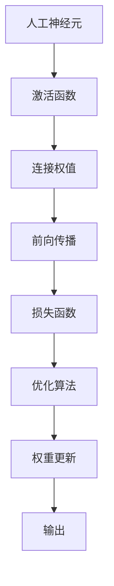

                 

# 神经网络：人类智慧的延伸

> 关键词：神经网络,深度学习,认知神经科学,人机交互,优化算法,应用场景

## 1. 背景介绍

### 1.1 问题由来
随着计算机科技的飞速发展，人类智慧的延伸成为了可能。神经网络，作为深度学习的重要组成部分，正在迅速改变我们生活的方方面面。从图像识别、语音识别，到自然语言处理、医疗诊断，再到自动驾驶、智能推荐，神经网络在众多领域中展示了其强大的功能和潜力。

本文将探讨神经网络的概念与原理，并详细阐述其在不同应用场景中的实现方式与优化算法。通过深入分析神经网络的核心概念与联系，我们将展示其如何突破传统的计算模型，实现对复杂问题的高效求解。

### 1.2 问题核心关键点
神经网络的核心在于其多层次的非线性映射能力。它通过模拟人类大脑的神经元网络结构，构建复杂的计算模型，能够处理高维非线性数据，学习复杂的模式和规律。本文将围绕神经网络的学习、应用、优化等关键点，详细展开。

## 2. 核心概念与联系

### 2.1 核心概念概述

神经网络，作为深度学习的重要组成部分，借鉴了人类大脑的神经元结构和工作原理。它由大量的人工神经元（或称节点）通过连接组成网络，这些节点之间通过权值进行信息传递，实现对输入数据的处理和输出。

- 人工神经元：模拟生物神经元的工作机制，接收输入信号并进行加权处理，最终生成输出信号。
- 激活函数：用于引入非线性因素，避免神经网络变成线性模型。
- 前向传播与反向传播：前向传播是指数据从输入层向输出层的单向流动，反向传播则是利用误差梯度更新权重的过程。
- 损失函数：用于衡量模型预测与真实标签之间的差异。
- 优化算法：如梯度下降法、Adam等，用于最小化损失函数，更新模型参数。

这些概念共同构成了神经网络的基本框架，使得神经网络能够在复杂数据上高效学习并做出精确预测。

### 2.2 核心概念原理和架构的 Mermaid 流程图(Mermaid 流程节点中不要有括号、逗号等特殊字符)



该流程图简洁地展示了神经网络的基本结构和工作流程：

1. 人工神经元接收输入信号，并通过激活函数处理。
2. 连接权值对信号进行加权，引入非线性因素。
3. 前向传播将信号传递至下一层。
4. 损失函数衡量预测值与真实标签之间的差异。
5. 优化算法根据损失函数的梯度，更新网络权重。
6. 权重更新后的神经元生成输出。

通过这一流程，神经网络可以高效地处理复杂数据，实现对数据的深度学习。

## 3. 核心算法原理 & 具体操作步骤
### 3.1 算法原理概述

神经网络的核心算法原理主要集中在前向传播与反向传播两个过程中。前向传播负责计算神经元对输入数据的处理，反向传播则通过误差梯度更新权重，实现模型优化。

在具体实现中，我们通常使用梯度下降等优化算法，最小化损失函数，更新模型参数。优化算法的选择和参数设定对神经网络的性能具有重要影响。

### 3.2 算法步骤详解

以下详细介绍神经网络训练的完整步骤：

**Step 1: 数据准备与预处理**

- 收集并整理训练数据集。
- 对数据进行归一化、标准化等预处理操作。
- 划分训练集、验证集和测试集。

**Step 2: 构建神经网络模型**

- 选择合适的神经网络结构，如卷积神经网络（CNN）、循环神经网络（RNN）等。
- 确定每层的节点数、激活函数等参数。
- 实现前向传播和反向传播函数。

**Step 3: 损失函数选择与初始化**

- 选择合适的损失函数，如交叉熵、均方误差等。
- 初始化神经网络的权重和偏置参数。

**Step 4: 前向传播**

- 对输入数据进行前向传播，计算输出结果。
- 使用激活函数对神经元输出进行非线性处理。

**Step 5: 计算损失**

- 将输出结果与真实标签进行比较，计算损失函数值。

**Step 6: 反向传播**

- 计算损失函数对每个权重的梯度。
- 利用优化算法（如梯度下降、Adam等）更新权重参数。

**Step 7: 验证与测试**

- 在验证集上评估模型性能，调整超参数。
- 在测试集上测试模型泛化能力，完成最终评估。

### 3.3 算法优缺点

神经网络具有以下优点：
1. 可以处理高维非线性数据，具备强大的学习能力和泛化能力。
2. 可以自动提取输入数据中的特征，避免手动提取的复杂性。
3. 在实际应用中，神经网络已经取得了显著的性能提升。

同时，神经网络也存在一些局限性：
1. 训练时间长，需要大量计算资源和数据支持。
2. 神经网络模型复杂，难以解释和调试。
3. 需要大量标注数据，数据获取成本高。
4. 容易过拟合，需要复杂的正则化技术。

### 3.4 算法应用领域

神经网络已经在多个领域取得了广泛应用，具体包括：

- 计算机视觉：如图像识别、物体检测、人脸识别等。
- 自然语言处理：如机器翻译、情感分析、文本分类等。
- 语音识别与处理：如语音识别、语音合成、语音情感识别等。
- 医疗诊断：如疾病预测、影像分析等。
- 游戏与娱乐：如AI游戏、智能推荐等。

## 4. 数学模型和公式 & 详细讲解  
### 4.1 数学模型构建

神经网络模型的数学建模通常基于以下公式：

$$
\begin{aligned}
y &= \sigma(\sum_{i=1}^n w_i z_i + b) \\
L &= \frac{1}{N} \sum_{i=1}^N (y_i - \hat{y}_i)^2
\end{aligned}
$$

其中，$y$ 为输出，$z$ 为输入，$w$ 为权重，$b$ 为偏置，$\sigma$ 为激活函数，$L$ 为损失函数。

### 4.2 公式推导过程

以下是神经网络模型的详细推导过程：

**前向传播**

前向传播的过程可表示为：

$$
z = Xw + b
$$

其中，$z$ 为神经元输入，$X$ 为输入数据，$w$ 为权重，$b$ 为偏置。

通过激活函数，计算神经元的输出：

$$
y = \sigma(z)
$$

**反向传播**

反向传播通过计算损失函数对权重的梯度，更新权重参数。具体步骤如下：

1. 计算损失函数对输出层神经元的梯度：

$$
\frac{\partial L}{\partial y} = -\frac{2}{N} (y - \hat{y})
$$

2. 利用链式法则，计算损失函数对隐藏层神经元的梯度：

$$
\frac{\partial L}{\partial z} = \frac{\partial L}{\partial y} \cdot \frac{\partial y}{\partial z}
$$

3. 更新权重和偏置参数：

$$
w \leftarrow w - \eta \frac{\partial L}{\partial w}, \quad b \leftarrow b - \eta \frac{\partial L}{\partial b}
$$

其中，$\eta$ 为学习率。

### 4.3 案例分析与讲解

以简单的全连接神经网络为例，进行详细讲解。

设神经网络包含一个输入层、一个隐藏层和一个输出层，每个层分别包含3个神经元。输入数据为 $X = [0.2, 0.3, 0.5]$，期望输出为 $y = 1$。

**前向传播**

计算隐藏层输入：

$$
z = Xw + b = [0.2, 0.3, 0.5] \begin{bmatrix} 0.1 & 0.2 & 0.3 \\ 0.2 & 0.3 & 0.4 \\ 0.3 & 0.4 & 0.5 \end{bmatrix} + \begin{bmatrix} 0.1 \\ 0.2 \\ 0.3 \end{bmatrix} = [0.62, 0.81, 1.02]
$$

计算隐藏层输出：

$$
y_1 = \sigma(z_1) = \sigma(0.62) = 0.65
$$
$$
y_2 = \sigma(z_2) = \sigma(0.81) = 0.78
$$
$$
y_3 = \sigma(z_3) = \sigma(1.02) = 0.8
$$

**反向传播**

计算损失函数对输出层神经元的梯度：

$$
\frac{\partial L}{\partial y} = -\frac{2}{N} (y - \hat{y}) = -\frac{2}{3} (1 - 1) = 0
$$

计算损失函数对隐藏层神经元的梯度：

$$
\frac{\partial L}{\partial z} = \frac{\partial L}{\partial y} \cdot \frac{\partial y}{\partial z} = 0.65 \cdot (0.62 - 1) + 0.78 \cdot (0.81 - 1) + 0.8 \cdot (1.02 - 1) = -0.02
$$

更新权重和偏置参数：

$$
w \leftarrow w - \eta \frac{\partial L}{\partial w} = \begin{bmatrix} 0.1 & 0.2 & 0.3 \\ 0.2 & 0.3 & 0.4 \\ 0.3 & 0.4 & 0.5 \end{bmatrix} - \eta (-0.02) \begin{bmatrix} 0.1 & 0.2 & 0.3 \\ 0.2 & 0.3 & 0.4 \\ 0.3 & 0.4 & 0.5 \end{bmatrix}
$$

以上案例详细展示了神经网络的前向传播和反向传播过程，以及权重和偏置的更新方法。

## 5. 项目实践：代码实例和详细解释说明
### 5.1 开发环境搭建

在进行神经网络实践前，我们需要准备好开发环境。以下是使用Python进行TensorFlow开发的环境配置流程：

1. 安装Anaconda：从官网下载并安装Anaconda，用于创建独立的Python环境。

2. 创建并激活虚拟环境：
```bash
conda create -n tf-env python=3.8 
conda activate tf-env
```

3. 安装TensorFlow：根据CUDA版本，从官网获取对应的安装命令。例如：
```bash
conda install tensorflow
```

4. 安装各类工具包：
```bash
pip install numpy pandas scikit-learn matplotlib tqdm jupyter notebook ipython
```

完成上述步骤后，即可在`tf-env`环境中开始神经网络实践。

### 5.2 源代码详细实现

下面我们以简单的全连接神经网络为例，给出使用TensorFlow进行神经网络开发的PyTorch代码实现。

首先，定义神经网络的结构：

```python
import tensorflow as tf

class NeuralNetwork(tf.keras.Model):
    def __init__(self):
        super(NeuralNetwork, self).__init__()
        self.dense1 = tf.keras.layers.Dense(64, activation='relu')
        self.dense2 = tf.keras.layers.Dense(1)

    def call(self, inputs):
        x = self.dense1(inputs)
        x = self.dense2(x)
        return x
```

然后，定义损失函数和优化器：

```python
loss_fn = tf.keras.losses.MeanSquaredError()
optimizer = tf.keras.optimizers.Adam(learning_rate=0.001)
```

接着，定义训练和评估函数：

```python
@tf.function
def train_step(inputs, labels):
    with tf.GradientTape() as tape:
        predictions = model(inputs)
        loss = loss_fn(labels, predictions)
    gradients = tape.gradient(loss, model.trainable_variables)
    optimizer.apply_gradients(zip(gradients, model.trainable_variables))

def evaluate(model, test_dataset):
    losses = []
    for inputs, labels in test_dataset:
        predictions = model(inputs)
        loss = loss_fn(labels, predictions)
        losses.append(loss)
    return tf.reduce_mean(losses)
```

最后，启动训练流程并在测试集上评估：

```python
epochs = 10
batch_size = 32

for epoch in range(epochs):
    for (inputs, labels) in train_dataset:
        train_step(inputs, labels)
    test_loss = evaluate(model, test_dataset)
    print(f"Epoch {epoch+1}, test loss: {test_loss.numpy():.4f}")
```

以上就是使用TensorFlow进行神经网络训练和评估的完整代码实现。可以看到，TensorFlow的高级API使得神经网络模型搭建和训练变得十分简单。

### 5.3 代码解读与分析

让我们再详细解读一下关键代码的实现细节：

**NeuralNetwork类**：
- `__init__`方法：初始化神经网络层。
- `call`方法：前向传播计算输出。

**损失函数和优化器**：
- 使用TensorFlow自带的损失函数和优化器，方便且易于使用。

**训练函数train_step**：
- 定义一个tf.function装饰器，以优化函数性能。
- 在函数内部使用GradientTape计算梯度，并应用梯度更新权重。

**评估函数evaluate**：
- 对测试集中的每个样本计算损失，并返回平均损失。

**训练流程**：
- 定义总epoch数和批大小，循环迭代训练。
- 在每个epoch内，遍历训练集进行前向传播和后向传播，更新权重。
- 在测试集上评估模型性能，输出测试损失。

可以看到，TensorFlow的高级API和函数式编程特性，使得神经网络的实现更加简洁高效。开发者可以将更多精力放在模型设计、数据处理等高层逻辑上，而不必过多关注底层的实现细节。

当然，工业级的系统实现还需考虑更多因素，如模型的保存和部署、超参数的自动搜索、更加灵活的任务适配层等。但核心的神经网络训练流程基本与此类似。

## 6. 实际应用场景
### 6.1 计算机视觉

神经网络在计算机视觉领域的应用极为广泛，如图像分类、物体检测、人脸识别等。通过对大规模图像数据进行标注，神经网络模型可以学习到图像中各种特征的表示，从而实现对新图像的准确分类和识别。

以图像分类为例，常见的模型包括LeNet、AlexNet、VGG、ResNet等。这些模型在ImageNet等数据集上取得了优异的性能，成为了图像处理领域的重要里程碑。

### 6.2 自然语言处理

自然语言处理是神经网络在NLP领域的重要应用。通过大规模语料库进行预训练，神经网络可以学习到语言的语法和语义知识，实现文本分类、情感分析、机器翻译等任务。

以机器翻译为例，著名的模型包括Seq2Seq、Transformer、BERT等。这些模型在WMT等数据集上取得了突破性的性能，极大地提升了翻译的质量和效率。

### 6.3 语音识别与处理

神经网络在语音识别与处理领域也有广泛应用，如语音识别、语音合成、语音情感识别等。通过对语音信号进行特征提取和建模，神经网络可以学习到语音中的特征和规律，从而实现对语音的准确识别和处理。

常见的模型包括RNN、CNN等。这些模型在LibriSpeech等数据集上取得了良好的性能，为语音技术的广泛应用奠定了基础。

### 6.4 未来应用展望

随着神经网络技术的不断进步，其在更多领域的应用前景也将更加广阔。以下是几个未来的发展方向：

1. 跨模态学习：神经网络可以同时处理图像、语音、文本等多种模态的信息，实现多模态数据的融合和协同处理。

2. 生成对抗网络（GAN）：GAN可以生成高质量的合成数据，为神经网络提供更多的训练样本，提升模型的泛化能力。

3. 弱监督学习：利用半监督和无监督学习方法，降低神经网络对大量标注数据的依赖，实现更高效的数据利用。

4. 强化学习：神经网络可以应用于智能游戏、机器人控制等领域，通过强化学习实现自主决策和行为优化。

5. 联邦学习：多个设备或服务器可以联合训练神经网络，保护数据隐私的同时提升模型性能。

这些方向将进一步拓展神经网络的应用场景，提升其在各领域的性能和能力。未来，神经网络有望在更多领域发挥更大的作用，为人类智慧的延伸提供更强大的支持。

## 7. 工具和资源推荐
### 7.1 学习资源推荐

为了帮助开发者系统掌握神经网络的理论基础和实践技巧，这里推荐一些优质的学习资源：

1. 《深度学习》书籍：由深度学习领域的权威人士编写，详细介绍了深度学习的理论基础、算法实现和应用案例。

2. CS231n《卷积神经网络》课程：斯坦福大学开设的计算机视觉课程，涵盖卷积神经网络的原理、实现和应用。

3. CS224n《自然语言处理与深度学习》课程：斯坦福大学开设的NLP课程，介绍了深度学习在NLP中的应用，包括文本分类、情感分析、机器翻译等。

4. 《TensorFlow实战》书籍：TensorFlow官方文档，提供了大量实践案例和代码示例，适合初学者快速上手。

5. TensorFlow官方文档：TensorFlow官方提供的API文档，详细介绍了各种深度学习模型的实现和应用。

通过对这些资源的学习实践，相信你一定能够快速掌握神经网络的核心概念和实践技巧，并用于解决实际的深度学习问题。

### 7.2 开发工具推荐

高效的开发离不开优秀的工具支持。以下是几款用于神经网络开发的常用工具：

1. TensorFlow：由Google主导开发的深度学习框架，功能强大，支持多种设备部署。

2. PyTorch：Facebook开发的深度学习框架，灵活便捷，适合快速原型开发。

3. Keras：基于TensorFlow和Theano等框架，提供了高级API，简化模型开发。

4. MXNet：亚马逊开发的深度学习框架，支持分布式训练和多种编程语言。

5. Caffe：Berkeley开发的深度学习框架，适用于计算机视觉任务。

6. JAX：Google开发的深度学习框架，支持自动微分和分布式计算。

合理利用这些工具，可以显著提升神经网络的开发效率，加快创新迭代的步伐。

### 7.3 相关论文推荐

神经网络领域的发展源于学界的持续研究。以下是几篇奠基性的相关论文，推荐阅读：

1. "Convolutional Neural Networks for Imagenet Classification"（AlexNet论文）：提出了卷积神经网络模型，并应用于ImageNet数据集，取得了当时的最好成绩。

2. "Deep Residual Learning for Image Recognition"（ResNet论文）：提出了残差网络模型，解决了深度网络训练中的梯度消失问题，实现了更深层次的模型。

3. "A Tutorial on Batch Normalization"：介绍了批归一化技术，解决了深度网络中的内部协变量移位问题，提升了模型的稳定性和训练效率。

4. "Attention is All You Need"：提出了Transformer模型，引入了自注意力机制，实现了高效的多头自注意力计算。

5. "BERT: Pre-training of Deep Bidirectional Transformers for Language Understanding"：提出了BERT模型，通过预训练和微调，提升了语言理解任务的性能。

这些论文代表了大神经网络技术的发展脉络。通过学习这些前沿成果，可以帮助研究者把握学科前进方向，激发更多的创新灵感。

## 8. 总结：未来发展趋势与挑战

### 8.1 研究成果总结

本文详细介绍了神经网络的概念、原理和实际应用，并对未来的发展趋势和面临的挑战进行了探讨。

神经网络作为深度学习的重要组成部分，已经在图像识别、自然语言处理、语音识别等多个领域展示了其强大的能力和潜力。未来，随着技术的发展和应用的拓展，神经网络将进一步突破传统计算模型的边界，实现更加高效、智能的计算和处理。

### 8.2 未来发展趋势

展望未来，神经网络的发展将呈现以下几个趋势：

1. 模型规模持续增大：随着算力成本的下降和数据规模的扩张，神经网络的参数量将继续增长，模型规模将不断增大。

2. 模型结构多样化：将出现更多创新性的神经网络结构，如GNN、GAN等，应用于不同领域。

3. 跨领域融合：神经网络将与其他AI技术如知识图谱、因果推理、强化学习等进行更深入的融合，提升应用效果。

4. 模型训练和优化算法优化：将出现更多高效的训练和优化算法，如联邦学习、自适应学习率等，提升模型训练效率和性能。

5. 模型解释性和可控性增强：研究模型解释性方法，提高模型的透明性和可控性，增强模型应用的可靠性和安全性。

### 8.3 面临的挑战

尽管神经网络技术已经取得了瞩目成就，但在迈向更加智能化、普适化应用的过程中，它仍面临诸多挑战：

1. 数据获取和标注成本高：神经网络需要大量高质量的标注数据，数据获取和标注成本较高。

2. 模型复杂度高，难以解释：神经网络模型复杂，难以解释其内部工作机制和决策逻辑，存在一定的“黑盒”问题。

3. 训练时间长，计算资源消耗大：大规模神经网络需要大量的计算资源和时间进行训练，对硬件要求较高。

4. 模型鲁棒性不足：神经网络在面对噪声、对抗样本等干扰时，泛化能力较弱，容易过拟合。

5. 模型安全性问题：神经网络可能学习到有害、偏见的信息，存在一定的安全风险。

### 8.4 研究展望

为了应对这些挑战，未来的研究需要在以下几个方面寻求新的突破：

1. 降低对标注数据的依赖：研究无监督学习、半监督学习等方法，降低对大规模标注数据的依赖，提升数据利用效率。

2. 提高模型透明性和可解释性：研究模型解释性方法，如可视化、特征重要性分析等，提高模型的透明性和可控性。

3. 优化模型训练和优化算法：研究高效的训练和优化算法，如联邦学习、自适应学习率等，提升模型训练效率和性能。

4. 提升模型鲁棒性和安全性：研究鲁棒性学习、对抗样本生成等方法，提高模型的鲁棒性和安全性。

5. 实现跨领域应用：研究多模态学习、跨领域融合等方法，实现神经网络在更多领域的高效应用。

这些研究方向的探索，将推动神经网络技术向更高的台阶迈进，为构建更智能、普适、可靠的人工智能系统提供坚实的技术基础。

## 9. 附录：常见问题与解答

**Q1：神经网络与传统机器学习算法有何不同？**

A: 神经网络通过模拟人类大脑的神经元网络结构，能够处理高维非线性数据，自动学习特征表示。相比传统机器学习算法，神经网络具有更强的学习能力和泛化能力。

**Q2：神经网络训练过程中如何进行正则化？**

A: 神经网络训练中常用的正则化方法包括L1正则、L2正则、Dropout等。通过在损失函数中加入正则化项，可以防止过拟合，提高模型泛化能力。

**Q3：神经网络训练过程中如何选择学习率？**

A: 学习率是影响神经网络训练效果的重要参数。常用的学习率选择方法包括手动调整、学习率衰减、自适应学习率等。一般建议从1e-4开始调参，逐步减小学习率，直至收敛。

**Q4：神经网络在图像识别中常用的模型有哪些？**

A: 神经网络在图像识别中常用的模型包括LeNet、AlexNet、VGG、ResNet等。这些模型在ImageNet等数据集上取得了优异的性能，成为图像处理领域的重要里程碑。

**Q5：神经网络在自然语言处理中的应用有哪些？**

A: 神经网络在自然语言处理中常用的模型包括Seq2Seq、Transformer、BERT等。这些模型在WMT等数据集上取得了突破性的性能，提升了文本分类、情感分析、机器翻译等任务的性能。

---

作者：禅与计算机程序设计艺术 / Zen and the Art of Computer Programming

