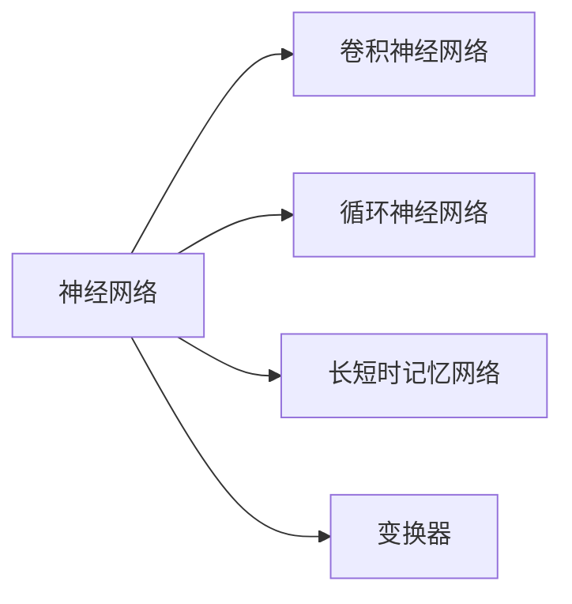

                 

# 神经网络：人类智慧的解放

## 1. 背景介绍

在现代科技的推动下，人工智能(AI)领域取得了前所未有的进展，尤其是神经网络( Neural Networks, NN)的崛起，为人类智慧的解放提供了无限可能。神经网络作为一种模拟人脑结构和功能的计算模型，已广泛应用于计算机视觉、自然语言处理、语音识别、推荐系统、自动驾驶等领域。本文将深入探讨神经网络的原理与算法，探索其在推动人类智慧解放中的关键作用。

### 1.1 问题由来

神经网络的迅速发展，归功于深度学习的突破性进展。深度学习以其强大的模式识别和泛化能力，使得神经网络在处理非结构化数据、复杂模式识别和决策等方面，超越了传统机器学习算法。当前，深度学习成为AI领域的核心，其中神经网络作为其重要组成部分，更是成为推动科技革命的关键引擎。

### 1.2 问题核心关键点

神经网络的核心在于其结构设计、激活函数、优化算法和训练策略。其训练过程通常需要大量的数据和强大的计算能力。但通过合理的模型设计和优化，神经网络可以大幅度提升数据处理和模式识别的能力，从而在复杂任务中表现出色。

神经网络的学术研究已经积累了大量的理论和实践成果。近年来，诸如深度残差网络(ResNet)、卷积神经网络(CNN)、循环神经网络(RNN)、长短时记忆网络(LSTM)、变换器(Transformer)等先进模型，极大地推动了神经网络的应用范围和性能。

## 2. 核心概念与联系

### 2.1 核心概念概述

为了更好地理解神经网络的工作原理和应用，我们将介绍几个关键概念：

- **神经网络**：通过神经元和节点模拟人脑神经元的计算模型，由多层神经元构成，每层神经元之间通过权值连接。
- **深度学习**：基于神经网络的多层结构，通过大量数据训练学习到复杂的特征表示，广泛应用于图像、语音、文本等非结构化数据处理。
- **卷积神经网络**：针对图像处理任务设计的网络结构，通过卷积操作提取图像局部特征，具备平移不变性和参数共享特性。
- **循环神经网络**：处理序列数据的重要模型，通过反馈机制保留序列依赖关系，适用于时间序列预测、语言模型、语音识别等任务。
- **长短时记忆网络**：解决RNN在长序列上梯度消失和爆炸问题，通过门控机制控制信息流，适用于需要长期记忆的任务。
- **变换器**：在语言处理任务中表现突出的模型，通过自注意力机制实现序列信息的交互和融合，具备较强的序列建模能力。

### 2.2 核心概念原理和架构的 Mermaid 流程图



此图展示了神经网络与几种经典子模型的联系，包括卷积神经网络、循环神经网络、长短时记忆网络和变换器。每种模型在特定场景下都有其独特的优势和应用。

## 3. 核心算法原理 & 具体操作步骤

### 3.1 算法原理概述

神经网络的核心原理是前向传播和反向传播。前向传播计算输入数据的输出，反向传播则用于调整神经网络的参数，使输出更接近真实标签。通过反复迭代，神经网络可以不断优化参数，从而提升其预测精度。

### 3.2 算法步骤详解

1. **前向传播**：
   - 输入数据经过多层神经元的逐层计算，生成最终输出。
   - 每层神经元的输出通过激活函数(如ReLU、Sigmoid等)进行非线性变换，增强网络的表达能力。

2. **损失函数计算**：
   - 将神经网络输出与真实标签计算损失值，如均方误差(MSE)、交叉熵(Cross-Entropy)等，衡量模型预测准确度。
   - 常用的损失函数有均方误差、二分类交叉熵、多分类交叉熵等。

3. **反向传播**：
   - 根据损失函数的梯度，反向传播计算每个神经元对最终损失的贡献。
   - 使用链式法则求得每层权重和偏置的梯度，并通过优化算法(如SGD、Adam等)更新模型参数。

4. **参数更新**：
   - 更新神经网络中的权重和偏置，减小损失值。
   - 常用的优化算法包括梯度下降法、随机梯度下降法、动量梯度下降法等。

### 3.3 算法优缺点

神经网络具有以下优点：

- **强大的泛化能力**：通过多层非线性变换，能够学习到复杂的特征表示，适应各种复杂模式。
- **自动特征提取**：神经网络可以自动从数据中提取特征，无需人工干预。
- **可扩展性强**：通过增加层数和神经元数量，可以提升网络的表示能力和性能。

同时，神经网络也存在以下缺点：

- **参数过多**：深度神经网络中的参数数量较多，增加了训练和存储的复杂度。
- **训练时间长**：大模型训练过程耗时较长，需要高性能计算资源。
- **过拟合风险**：在数据量不足的情况下，容易过拟合，影响泛化能力。

### 3.4 算法应用领域

神经网络在计算机视觉、自然语言处理、语音识别、推荐系统等多个领域得到了广泛应用，以下是几个典型例子：

- **计算机视觉**：用于图像分类、目标检测、图像分割等任务，如卷积神经网络(CNN)、YOLO、ResNet等。
- **自然语言处理**：用于文本分类、情感分析、机器翻译、语言模型等，如长短时记忆网络(LSTM)、双向LSTM、变换器(Transformer)等。
- **语音识别**：用于语音识别和语音生成，如循环神经网络(RNN)、卷积神经网络(CNN)等。
- **推荐系统**：用于用户行为预测和物品推荐，如矩阵分解、深度神经网络等。

## 4. 数学模型和公式 & 详细讲解 & 举例说明

### 4.1 数学模型构建

神经网络通常包含多个输入节点、多个隐藏层和多个输出节点。假设一个简单神经网络的模型如下：

$$
y = \sigma(Wx + b)
$$

其中：
- $y$ 表示网络的输出。
- $x$ 表示输入向量。
- $W$ 表示权重矩阵。
- $b$ 表示偏置向量。
- $\sigma$ 表示激活函数。

### 4.2 公式推导过程

**前向传播**：

$$
z_l = W_lx_l + b_l
$$

$$
a_l = \sigma(z_l)
$$

$$
z_{l+1} = W_{l+1}a_l + b_{l+1}
$$

$$
a_{l+1} = \sigma(z_{l+1})
$$

其中，$x_l$ 为第$l$层的输入向量，$a_l$ 为第$l$层的输出向量，$z_l$ 为第$l$层的线性变换结果。

**损失函数计算**：

假设神经网络的输出 $y$ 与真实标签 $t$ 的误差为 $L(y,t)$，常用的损失函数有均方误差和交叉熵：

$$
L(y,t) = \frac{1}{2}\sum_i (y_i - t_i)^2
$$

$$
L(y,t) = -\sum_i t_i\log y_i
$$

**反向传播**：

使用链式法则计算每层神经元对损失函数的梯度：

$$
\frac{\partial L}{\partial a_l} = \frac{\partial L}{\partial z_l} \frac{\partial z_l}{\partial a_l} = \sigma'(z_l)W_l^T
$$

$$
\frac{\partial L}{\partial z_l} = \frac{\partial L}{\partial a_{l+1}}W_{l+1}^T
$$

其中，$\sigma'$ 为激活函数的导数。

### 4.3 案例分析与讲解

以图像分类为例，一个简单的卷积神经网络结构如下：

```mermaid
graph LR
    A[输入层] --> B[卷积层] --> C[池化层] --> D[全连接层] --> E[输出层]
    B -- C -- D -- E
```

假设输入层输入大小为 $28 \times 28$ 的灰度图像，经过3个卷积层和2个全连接层后，输出大小为10（对应10个类别的分类数）。

**前向传播**：

第一层卷积：

$$
z_1 = W_1x_1 + b_1
$$

$$
a_1 = \sigma(z_1)
$$

池化：

$$
z_2 = W_2a_1 + b_2
$$

$$
a_2 = \sigma(z_2)
$$

第二层卷积：

$$
z_3 = W_3a_2 + b_3
$$

$$
a_3 = \sigma(z_3)
$$

池化：

$$
z_4 = W_4a_3 + b_4
$$

$$
a_4 = \sigma(z_4)
$$

全连接层：

$$
z_5 = W_5a_4 + b_5
$$

$$
a_5 = \sigma(z_5)
$$

输出层：

$$
y = W_6a_5 + b_6
$$

**损失函数计算**：

假设使用交叉熵损失函数，定义损失值为 $L$，并计算梯度：

$$
L(y,t) = -\sum_i t_i\log y_i
$$

$$
\frac{\partial L}{\partial y} = -\frac{t}{y}
$$

**反向传播**：

计算 $z_5$ 对 $a_5$ 的梯度：

$$
\frac{\partial L}{\partial a_5} = \frac{\partial L}{\partial y}\frac{\partial y}{\partial z_5}\frac{\partial z_5}{\partial a_5} = \frac{\partial L}{\partial y}\sigma'(z_5)W_6^T
$$

计算 $z_4$ 对 $a_4$ 的梯度：

$$
\frac{\partial L}{\partial a_4} = \frac{\partial L}{\partial a_5}\frac{\partial a_5}{\partial z_5}W_5^T
$$

依次类推，计算每个层的梯度，并使用优化算法更新参数。

## 5. 项目实践：代码实例和详细解释说明

### 5.1 开发环境搭建

搭建神经网络开发环境，通常需要使用Python和深度学习框架，如TensorFlow、PyTorch、Keras等。以下是使用PyTorch搭建环境的详细步骤：

1. 安装Anaconda：从官网下载并安装Anaconda，用于创建独立的Python环境。

2. 创建并激活虚拟环境：
```bash
conda create -n pytorch-env python=3.8 
conda activate pytorch-env
```

3. 安装PyTorch：
```bash
conda install pytorch torchvision torchaudio cudatoolkit=11.1 -c pytorch -c conda-forge
```

4. 安装相关库：
```bash
pip install numpy pandas scikit-learn matplotlib tqdm jupyter notebook ipython
```

### 5.2 源代码详细实现

下面我们以手写数字识别(MNIST)为例，给出使用PyTorch实现卷积神经网络(Convolutional Neural Network, CNN)的完整代码实现。

```python
import torch
import torch.nn as nn
import torch.optim as optim
import torchvision
import torchvision.transforms as transforms
import matplotlib.pyplot as plt

# 定义网络结构
class CNNNet(nn.Module):
    def __init__(self):
        super(CNNNet, self).__init__()
        self.conv1 = nn.Conv2d(1, 32, 3, padding=1)
        self.conv2 = nn.Conv2d(32, 64, 3, padding=1)
        self.pool = nn.MaxPool2d(2, 2)
        self.fc1 = nn.Linear(64 * 7 * 7, 512)
        self.fc2 = nn.Linear(512, 10)
        self.dropout = nn.Dropout(0.2)

    def forward(self, x):
        x = F.relu(self.pool(self.conv1(x)))
        x = F.relu(self.pool(self.conv2(x)))
        x = x.view(-1, 64 * 7 * 7)
        x = self.dropout(x)
        x = F.relu(self.fc1(x))
        x = self.dropout(x)
        x = self.fc2(x)
        return x

# 加载数据集
trainset = torchvision.datasets.MNIST(root='./data', train=True, download=True,
                                     transform=transforms.ToTensor())
trainloader = torch.utils.data.DataLoader(trainset, batch_size=64,
                                         shuffle=True, num_workers=2)

testset = torchvision.datasets.MNIST(root='./data', train=False, download=True,
                                    transform=transforms.ToTensor())
testloader = torch.utils.data.DataLoader(testset, batch_size=64,
                                       shuffle=False, num_workers=2)

# 定义损失函数和优化器
net = CNNNet()
criterion = nn.CrossEntropyLoss()
optimizer = optim.SGD(net.parameters(), lr=0.001, momentum=0.9)

# 训练模型
for epoch in range(10):
    running_loss = 0.0
    for i, data in enumerate(trainloader, 0):
        inputs, labels = data
        optimizer.zero_grad()
        outputs = net(inputs)
        loss = criterion(outputs, labels)
        loss.backward()
        optimizer.step()
        running_loss += loss.item()
        if i % 100 == 99:
            print('[%d, %5d] loss: %.3f' %
                  (epoch + 1, i + 1, running_loss / 100))
            running_loss = 0.0

print('Finished Training')

# 测试模型
correct = 0
total = 0
with torch.no_grad():
    for data in testloader:
        images, labels = data
        outputs = net(images)
        _, predicted = torch.max(outputs.data, 1)
        total += labels.size(0)
        correct += (predicted == labels).sum().item()

print('Accuracy of the network on the 10000 test images: %d %%' % (
    100 * correct / total))
```

### 5.3 代码解读与分析

**CNNNet类**：
- `__init__`方法：初始化卷积层、池化层、全连接层和Dropout等组件。
- `forward`方法：定义前向传播过程。

**数据加载**：
- `trainset`和`testset`：加载训练集和测试集数据。
- `trainloader`和`testloader`：定义数据批次的加载方式。

**模型训练**：
- `optimizer.zero_grad()`：清零优化器的梯度。
- `loss.backward()`：反向传播计算梯度。
- `optimizer.step()`：更新模型参数。

**测试过程**：
- `with torch.no_grad()`：关闭梯度计算，仅进行推理操作。
- `predicted == labels`：比较模型预测结果与真实标签，计算准确率。

## 6. 实际应用场景

### 6.1 自动驾驶

自动驾驶系统需要实时处理来自环境传感器的大量数据，并从中提取有用的信息。神经网络作为自动驾驶的核心组件，用于对象检测、语义分割、路径规划等关键任务。

在自动驾驶中，卷积神经网络用于提取图像特征，循环神经网络用于处理时间序列数据，长短时记忆网络用于记忆长期行为和依赖关系。通过神经网络的前向传播和反向传播，自动驾驶系统可以实时进行决策和规划，保证行车安全。

### 6.2 医疗影像诊断

医疗影像诊断需要识别和分析大量的医学图像，如X光片、CT扫描等。卷积神经网络通过学习医学图像的特征，实现自动分类、分割和标注。

在医疗影像诊断中，卷积神经网络可以识别肿瘤、骨折、肺部结节等异常部位，辅助医生进行诊断。使用神经网络进行图像诊断，可以显著减少医生的工作量，提升诊断的准确性和效率。

### 6.3 智能推荐系统

智能推荐系统通过分析用户行为数据，推荐个性化的商品或内容。神经网络可以处理复杂的多维用户行为数据，实现精准推荐。

在推荐系统中，神经网络用于用户行为预测和物品推荐。通过优化神经网络参数，可以实现更高的推荐精度和覆盖率，提升用户体验。

## 7. 工具和资源推荐

### 7.1 学习资源推荐

为了帮助开发者系统掌握神经网络的理论基础和实践技巧，这里推荐一些优质的学习资源：

1. 《深度学习》（Ian Goodfellow著）：系统介绍了深度学习的原理和应用，适合初学者入门。
2. 《神经网络与深度学习》（Michael Nielsen著）：深入浅出地讲解了神经网络的基本概念和计算模型，适合自学。
3. CS231n《卷积神经网络》课程：斯坦福大学开设的计算机视觉课程，涵盖了CNN的基本原理和实现。
4. CS224n《自然语言处理》课程：斯坦福大学开设的NLP课程，讲解了RNN、LSTM、Transformer等经典模型。
5. UFLDL《深度学习》在线课程：由斯坦福大学提供，免费在线学习资源，适合快速上手。

通过对这些资源的学习实践，相信你一定能够快速掌握神经网络的基本原理和应用技巧，并用于解决实际的NLP问题。

### 7.2 开发工具推荐

高效的开发离不开优秀的工具支持。以下是几款用于神经网络微调开发的常用工具：

1. PyTorch：基于Python的开源深度学习框架，灵活动态的计算图，适合快速迭代研究。
2. TensorFlow：由Google主导开发的开源深度学习框架，生产部署方便，适合大规模工程应用。
3. Keras：基于Python的高层深度学习框架，适合初学者快速构建模型。
4. Weights & Biases：模型训练的实验跟踪工具，可以记录和可视化模型训练过程中的各项指标，方便对比和调优。
5. TensorBoard：TensorFlow配套的可视化工具，可实时监测模型训练状态，并提供丰富的图表呈现方式。

合理利用这些工具，可以显著提升神经网络模型的开发效率，加快创新迭代的步伐。

### 7.3 相关论文推荐

神经网络的研究已经积累了大量的理论和实践成果。以下是几篇奠基性的相关论文，推荐阅读：

1. A Theoretical Framework for Multilayer Perceptrons (MLPs)（Rumelhart、Hinton、Williams, 1986）：提出了多层次感知器的计算模型，奠定了神经网络理论基础。
2. Convolutional Neural Networks for Images, Speech, and Time Series（LeCun、Boser、Denker、Solla、Bengio、Haffner、Jackel, 1998）：展示了卷积神经网络在图像处理上的优异表现。
3. Bidirectional Recurrent Neural Networks (BRNNs)（Hochreiter、Schmidhuber, 1997）：介绍了双向循环神经网络，解决了传统RNN的信息丢失问题。
4. Long Short-Term Memory (LSTM) Networks (Hochreiter、Schmidhuber, 1997）：提出了长短时记忆网络，用于处理长序列数据。
5. Attention is All You Need（Vaswani等人, 2017）：提出了Transformer网络结构，在语言处理任务上取得了突破性进展。

这些论文代表了大规模神经网络研究的发展脉络。通过学习这些前沿成果，可以帮助研究者把握学科前进方向，激发更多的创新灵感。

## 8. 总结：未来发展趋势与挑战

### 8.1 研究成果总结

神经网络作为推动人工智能的重要技术，已经在多个领域取得了卓越的成果。从计算机视觉、自然语言处理到语音识别，神经网络展现了强大的模式识别和泛化能力，极大地提升了智能系统的表现。

### 8.2 未来发展趋势

未来，神经网络将继续在多个领域发挥重要作用。随着技术的发展，神经网络将向更加强大、灵活、高效的方向演进：

1. **模型规模持续增大**：超大规模神经网络将进一步提升数据处理和特征表示能力，应对更复杂的数据结构。
2. **自动化设计**：神经网络的设计将进一步自动化，降低模型设计和调试的门槛。
3. **多模态融合**：神经网络将更多地融合视觉、语音、文本等多种模态数据，提升跨模态推理能力。
4. **分布式训练**：神经网络将更多地利用分布式计算资源，加速训练过程。
5. **迁移学习**：神经网络将通过迁移学习更好地适应不同领域的任务，提升泛化能力。

### 8.3 面临的挑战

尽管神经网络已经取得了显著的进展，但在实际应用中仍然面临一些挑战：

1. **训练耗时**：大模型训练时间较长，需要高性能计算资源。
2. **模型可解释性**：神经网络的决策过程难以解释，缺乏透明度。
3. **数据依赖性**：神经网络对数据的依赖性强，数据不足可能导致过拟合。
4. **计算资源消耗**：神经网络训练和推理的计算资源消耗大。
5. **对抗攻击**：神经网络可能受到对抗样本的攻击，导致误判。

### 8.4 研究展望

面对神经网络所面临的挑战，未来的研究需要在以下几个方面寻求新的突破：

1. **高效训练方法**：研究快速收敛、高效计算的优化算法，减少训练时间和资源消耗。
2. **模型压缩与量化**：通过模型压缩和量化技术，优化模型结构和推理速度。
3. **可解释性提升**：开发可解释的神经网络模型，增强模型的透明性和可靠性。
4. **跨模态融合**：研究多模态数据的融合和交互，提升神经网络的跨模态推理能力。
5. **鲁棒性增强**：研究抗干扰、抗攻击的鲁棒性增强方法，提高模型的安全性和稳定性。

## 9. 附录：常见问题与解答

**Q1：神经网络中的激活函数有何作用？**

A: 激活函数用于增强神经网络的非线性表达能力，避免神经网络退化成线性模型。常用的激活函数包括Sigmoid、ReLU、Tanh等。

**Q2：神经网络的训练过程中为何需要反向传播？**

A: 反向传播用于计算神经网络中每个参数对损失函数的贡献，通过梯度下降等优化算法更新参数。反向传播是神经网络训练的核心步骤。

**Q3：神经网络的优化算法有哪些？**

A: 常见的优化算法包括梯度下降、随机梯度下降、动量梯度下降、Adam等。不同的优化算法适用于不同的场景，选择合适的优化算法对神经网络的训练效果有重要影响。

**Q4：如何避免神经网络过拟合？**

A: 避免过拟合的常用方法包括数据增强、正则化、Dropout等。数据增强通过增加训练数据的多样性，正则化通过限制参数的大小，Dropout通过随机丢弃神经元，减少模型的复杂度。

**Q5：神经网络在实际应用中为何需要预处理？**

A: 神经网络对输入数据的质量和格式有较高要求，预处理可以标准化输入数据，增强模型的稳定性和性能。常用的预处理方式包括归一化、标准化、数据增强等。

通过本文的系统梳理，可以看到，神经网络作为一种强大的计算模型，已经广泛应用于多个领域，推动了人工智能技术的快速发展。未来，随着技术的不断进步，神经网络将继续拓展其应用边界，为人类的智慧解放做出更大的贡献。

