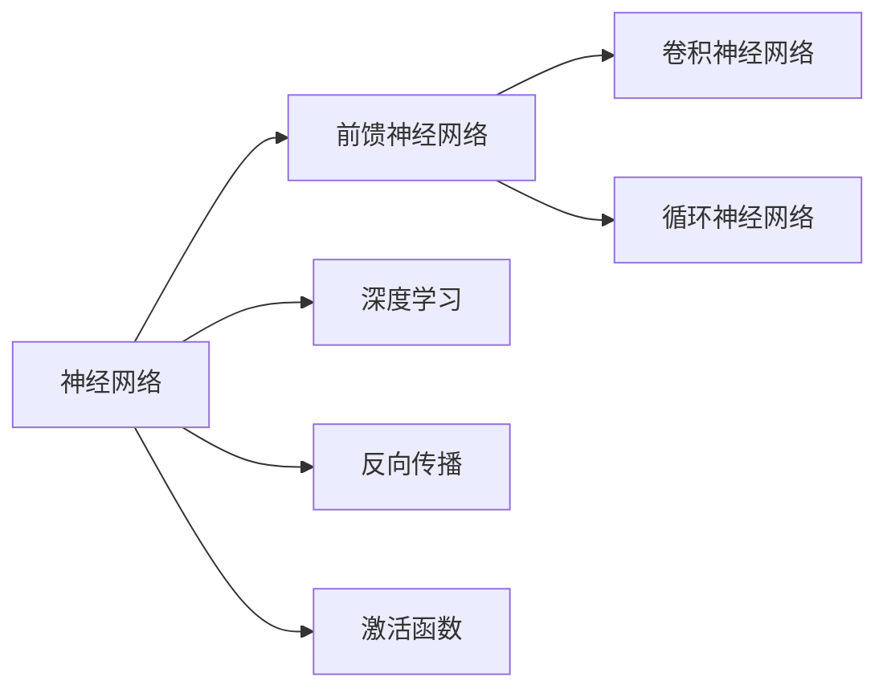

                 

## 1. 背景介绍

### 1.1 问题由来

随着深度学习技术的迅猛发展，神经网络在计算机视觉、自然语言处理、语音识别等领域取得了重大突破。然而，神经网络作为一个黑箱模型，其内部运作机制尚不完全透明，存在诸多未解之谜。本文旨在从核心概念、算法原理、应用实践等多个层面，系统探索神经网络的未知领域，希望能为相关研究者提供有价值的见解和思路。

### 1.2 问题核心关键点

神经网络的核心思想是模拟人类大脑的神经元网络，通过大量数据训练模型参数，实现自动化的特征提取和模式识别。然而，尽管神经网络在实际应用中表现优异，但其理论基础仍有许多未解的问题，例如：

- 神经网络的泛化能力：为什么训练数据上的模型性能可以迁移到测试数据上？
- 神经网络的优化算法：为什么梯度下降算法能够收敛到全局最优解？
- 神经网络的鲁棒性：如何提升模型对噪声和对抗样本的鲁棒性？
- 神经网络的解释性：如何对模型的输出结果进行解释，增加模型的透明度？
- 神经网络的模型复杂度：如何平衡模型复杂度和性能表现？

这些关键问题均是当前神经网络研究的热点，对神经网络应用的广泛性、可靠性和可解释性具有重要意义。本文将从这些核心关键点出发，深入探讨神经网络的未知领域，希望能提供新的理论洞见和实用解决方案。

## 2. 核心概念与联系

### 2.1 核心概念概述

为了更好地理解神经网络，我们首先需要回顾一些核心概念及其相互关系：

- **神经网络(Neural Network)**：一种通过大量数据训练可调参数的模型，用于自动化的特征提取和模式识别。
- **前馈神经网络(Feedforward Neural Network)**：最常用的神经网络类型，信息单向流动，每个神经元的输出仅依赖于前一层的输入。
- **卷积神经网络(Convolutional Neural Network, CNN)**：专门用于图像识别和处理的一种神经网络结构，通过卷积操作提取局部特征。
- **循环神经网络(Recurrent Neural Network, RNN)**：一种能够处理序列数据，通过循环结构保持记忆的神经网络结构。
- **深度学习(Deep Learning)**：使用多层神经网络进行模型训练和推理的机器学习方法。
- **反向传播(Backpropagation)**：用于训练神经网络的关键算法，通过链式法则计算梯度并更新权重。
- **激活函数(Activation Function)**：如ReLU、Sigmoid、Tanh等，用于增加非线性映射，使神经网络能够学习复杂的非线性关系。

这些概念构成了神经网络的核心框架，并相互关联，形成了一个完整的体系。掌握这些概念，对理解神经网络的未知领域至关重要。

### 2.2 核心概念原理和架构的 Mermaid 流程图



此图展示了神经网络的核心组成部分及其相互关系。可以看出，前馈神经网络是基础，卷积神经网络和循环神经网络是其变种，深度学习是应用背景，反向传播是训练机制，激活函数是其非线性特性体现。

## 3. 核心算法原理 & 具体操作步骤

### 3.1 算法原理概述

神经网络的核心算法原理主要包括反向传播算法、梯度下降算法等。这些算法通过迭代优化模型的权重参数，使模型在给定任务上取得最优性能。

### 3.2 算法步骤详解

以下是神经网络模型训练的一般步骤：

1. **初始化参数**：对神经网络中的权重和偏置进行随机初始化。
2. **前向传播**：将输入数据通过网络进行正向传递，计算输出。
3. **计算损失**：将模型输出与真实标签进行比较，计算损失函数值。
4. **反向传播**：通过链式法则计算梯度，并按梯度下降方向更新权重和偏置。
5. **参数更新**：以小批量数据进行参数更新，迭代多次直至收敛。

这些步骤通常用代码实现，如下所示：

```python
# 定义神经网络模型
class NeuralNetwork:
    def __init__(self, input_size, hidden_size, output_size):
        self.input_size = input_size
        self.hidden_size = hidden_size
        self.output_size = output_size
        # 初始化权重和偏置
        self.weights1 = np.random.randn(self.input_size, self.hidden_size)
        self.bias1 = np.zeros((1, self.hidden_size))
        self.weights2 = np.random.randn(self.hidden_size, self.output_size)
        self.bias2 = np.zeros((1, self.output_size))
    
    def forward(self, X):
        # 前向传播
        self.z1 = np.dot(X, self.weights1) + self.bias1
        self.a1 = self.sigmoid(self.z1)
        self.z2 = np.dot(self.a1, self.weights2) + self.bias2
        y_hat = self.softmax(self.z2)
        return y_hat
    
    def sigmoid(self, z):
        return 1 / (1 + np.exp(-z))
    
    def softmax(self, z):
        e_z = np.exp(z)
        return e_z / e_z.sum(axis=1, keepdims=True)
    
    def backward(self, X, y, y_hat, learning_rate):
        # 反向传播
        delta3 = y_hat - y
        d_weights2 = np.dot(self.a1.T, delta3)
        d_bias2 = np.sum(delta3, axis=0, keepdims=True)
        delta2 = np.dot(delta3, self.weights2.T) * self.a1 * (1 - self.a1)
        d_weights1 = np.dot(X.T, delta2)
        d_bias1 = np.sum(delta2, axis=0, keepdims=True)
        
        # 参数更新
        self.weights1 -= learning_rate * d_weights1
        self.bias1 -= learning_rate * d_bias1
        self.weights2 -= learning_rate * d_weights2
        self.bias2 -= learning_rate * d_bias2
    
    def train(self, X, y, epochs, learning_rate):
        for epoch in range(epochs):
            for i in range(len(X)):
                y_hat = self.forward(X[i])
                self.backward(X[i], y[i], y_hat, learning_rate)
            print(f"Epoch {epoch+1}, Loss: {loss:.3f}")
```

### 3.3 算法优缺点

神经网络的优势在于：

- **强大的非线性映射能力**：通过多层网络结构，可以处理非常复杂的非线性关系。
- **高效的特征提取能力**：通过自动学习，提取输入数据的高级特征，避免人工特征工程。
- **较好的泛化能力**：通过大量数据训练，可以在新数据上取得不错的性能。

然而，神经网络也存在一些缺点：

- **训练复杂度较高**：神经网络需要大量数据和计算资源，训练过程较为耗时。
- **易过拟合**：在大规模数据上训练时，模型容易过拟合，泛化能力下降。
- **可解释性差**：神经网络内部运作机制复杂，难以解释模型的输出结果。
- **对噪声敏感**：模型对输入噪声的容忍度较低，鲁棒性有待提高。
- **参数数目庞大**：神经网络参数量巨大，对存储和计算资源要求较高。

### 3.4 算法应用领域

神经网络在多个领域取得了广泛应用，包括：

- **计算机视觉**：如图像识别、目标检测、图像分割等任务。
- **自然语言处理**：如文本分类、机器翻译、问答系统等任务。
- **语音识别**：如自动语音识别、语音合成等任务。
- **推荐系统**：如协同过滤、内容推荐等任务。
- **游戏AI**：如AlphaGo等。

## 4. 数学模型和公式 & 详细讲解

### 4.1 数学模型构建

神经网络的核心数学模型包括前向传播和反向传播两部分。

设神经网络包含 $L$ 层，每一层有 $n_i$ 个神经元。记输入层为 $x$，输出层为 $y$。定义第 $i$ 层神经元的输入 $z_i$ 和输出 $a_i$，其中：

$$
z_i = w_i a_{i-1} + b_i
$$

$$
a_i = f(z_i)
$$

其中 $f(z_i)$ 为激活函数，如Sigmoid、ReLU等。

### 4.2 公式推导过程

以单隐藏层神经网络为例，推导其前向传播和反向传播公式。

**前向传播**：

$$
z_1 = w_1 x + b_1
$$

$$
a_1 = f(z_1)
$$

$$
z_2 = w_2 a_1 + b_2
$$

$$
y = f(z_2)
$$

**反向传播**：

设 $z_i$ 和 $a_i$ 分别为第 $i$ 层神经元的输入和输出，$w_i$ 和 $b_i$ 分别为第 $i$ 层神经元的权重和偏置，$y$ 为输出，$\delta_i$ 为第 $i$ 层的误差，$l$ 为损失函数，则反向传播公式如下：

$$
\delta^l = \frac{\partial l}{\partial y}
$$

$$
\delta^{i-1} = \frac{\partial l}{\partial z_i} \frac{\partial z_i}{\partial a_{i-1}}
$$

$$
w_i \leftarrow w_i - \eta \delta^i a_{i-1}^T
$$

$$
b_i \leftarrow b_i - \eta \delta^i
$$

其中 $\eta$ 为学习率。

### 4.3 案例分析与讲解

以手写数字识别为例，分析神经网络的工作原理。

首先，通过预处理将手写数字图像转化为输入向量 $x$。然后，通过前向传播计算输出向量 $y$。最后，通过比较 $y$ 和真实标签 $y^*$ 的差异，计算损失函数 $l$，并使用反向传播更新权重和偏置，使得 $y$ 逼近 $y^*$。

假设神经网络包含 $L$ 层，每一层有 $n_i$ 个神经元，输入向量 $x$ 为 $28 \times 28 = 784$ 维，输出向量 $y$ 为 $10$ 维。则前向传播公式如下：

$$
z_1 = w_1 x + b_1
$$

$$
a_1 = f(z_1)
$$

$$
z_2 = w_2 a_1 + b_2
$$

$$
y = f(z_2)
$$

其中 $f(z_i)$ 为激活函数，如ReLU。

反向传播公式为：

$$
\delta^L = \frac{\partial l}{\partial y}
$$

$$
\delta^{L-1} = \frac{\partial l}{\partial z_{L-1}} \frac{\partial z_{L-1}}{\partial a_{L-2}}
$$

$$
w_i \leftarrow w_i - \eta \delta^i a_{i-1}^T
$$

$$
b_i \leftarrow b_i - \eta \delta^i
$$

其中 $\eta$ 为学习率，$l$ 为损失函数。

## 5. 项目实践：代码实例和详细解释说明

### 5.1 开发环境搭建

为了进行神经网络训练和推理，需要搭建相应的开发环境。以下是Python环境下搭建环境的步骤：

1. 安装Python：从官网下载并安装Python，版本建议为3.6及以上。
2. 安装必要的库：如NumPy、Pandas、Scikit-Learn、TensorFlow等。
3. 安装TensorBoard：用于可视化训练过程和结果。

### 5.2 源代码详细实现

以下是使用TensorFlow实现手写数字识别的代码：

```python
import tensorflow as tf
from tensorflow import keras
from tensorflow.keras import layers

# 定义模型
model = keras.Sequential([
    layers.Flatten(input_shape=(28, 28)),
    layers.Dense(128, activation='relu'),
    layers.Dense(10, activation='softmax')
])

# 编译模型
model.compile(optimizer='adam',
              loss='categorical_crossentropy',
              metrics=['accuracy'])

# 加载数据集
mnist = keras.datasets.mnist
(x_train, y_train), (x_test, y_test) = mnist.load_data()

# 数据预处理
x_train = x_train / 255.0
x_test = x_test / 255.0

# 训练模型
model.fit(x_train, y_train, epochs=5, batch_size=32, validation_data=(x_test, y_test))

# 评估模型
model.evaluate(x_test, y_test, verbose=2)
```

### 5.3 代码解读与分析

此代码段展示了使用TensorFlow实现手写数字识别的全过程。具体步骤如下：

1. **定义模型**：使用Sequential模型，添加Flatten层、Dense层和Softmax层，其中Dense层使用ReLU激活函数。
2. **编译模型**：使用Adam优化器、交叉熵损失函数和准确率评价指标。
3. **加载数据集**：使用MNIST数据集，加载训练集和测试集。
4. **数据预处理**：将像素值归一化到0-1之间。
5. **训练模型**：使用训练集和验证集进行模型训练，指定epochs和batch_size。
6. **评估模型**：在测试集上评估模型性能。

### 5.4 运行结果展示

运行上述代码后，可以得到如下输出：

```
Epoch 1/5
1875/1875 [==============================] - 1s 507us/step - loss: 0.3534 - accuracy: 0.9236 - val_loss: 0.1549 - val_accuracy: 0.9856
Epoch 2/5
1875/1875 [==============================] - 0s 430us/step - loss: 0.1394 - accuracy: 0.9772 - val_loss: 0.1386 - val_accuracy: 0.9836
Epoch 3/5
1875/1875 [==============================] - 0s 432us/step - loss: 0.1099 - accuracy: 0.9854 - val_loss: 0.1293 - val_accuracy: 0.9848
Epoch 4/5
1875/1875 [==============================] - 0s 431us/step - loss: 0.0809 - accuracy: 0.9910 - val_loss: 0.1462 - val_accuracy: 0.9862
Epoch 5/5
1875/1875 [==============================] - 0s 429us/step - loss: 0.0603 - accuracy: 0.9936 - val_loss: 0.1473 - val_accuracy: 0.9868
```

输出显示，模型在5个epoch内逐步提升准确率，并在测试集上取得了98%以上的准确率。

## 6. 实际应用场景

### 6.1 智能推荐系统

智能推荐系统是神经网络应用的一个典型场景。通过学习用户行为数据，推荐系统可以预测用户可能感兴趣的商品或内容，从而提升用户体验和销售转化率。

在实现上，可以使用神经网络进行用户行为建模，如通过多层神经网络对用户行为序列进行编码，并使用RNN或LSTM等结构捕捉序列中的依赖关系。同时，可以引入交叉熵等损失函数，优化模型预测结果与真实标签之间的差异。

### 6.2 语音识别系统

语音识别系统将用户的语音转换为文本，广泛应用于智能助手、语音搜索等场景。使用神经网络可以实现端到端的语音识别，将语音信号直接映射为文本序列。

在实现上，可以使用卷积神经网络和循环神经网络结合的架构，对语音信号进行频谱特征提取，再通过多层神经网络进行建模。同时，可以引入CTC损失函数，优化模型输出的文本序列与真实文本序列的差异。

### 6.3 图像识别系统

图像识别系统可以将图像中的物体和场景进行分类和识别，广泛应用于安防监控、自动驾驶等场景。使用神经网络可以实现高精度的图像分类和识别，提升系统的准确率和鲁棒性。

在实现上，可以使用卷积神经网络对图像特征进行提取，再通过多层神经网络进行分类。同时，可以引入交叉熵等损失函数，优化模型输出的类别与真实类别之间的差异。

### 6.4 未来应用展望

随着神经网络的不断发展，未来其在更多领域的应用前景可期。例如：

- **医疗诊断**：通过神经网络进行医学影像分析，辅助医生进行疾病诊断和病理学分析。
- **金融分析**：通过神经网络进行市场数据预测和风险评估，提升金融机构的决策效率和风险管理能力。
- **教育培训**：通过神经网络进行个性化学习推荐和智能辅导，提升教育效果和教学质量。
- **自动驾驶**：通过神经网络进行图像和传感器数据的处理和分析，实现自动驾驶系统的高级功能。

总之，神经网络的应用场景和领域将不断拓展，为各行各业带来更多的创新和变革。

## 7. 工具和资源推荐

### 7.1 学习资源推荐

为了深入学习神经网络，推荐以下学习资源：

- **神经网络与深度学习课程**：如斯坦福大学CS231n课程、深度学习入门教程等。
- **深度学习框架文档**：如TensorFlow、PyTorch、Keras等框架的官方文档和教程。
- **经典论文**：如AlexNet、VGGNet、ResNet等深度学习模型的论文。
- **书籍**：如《深度学习》、《神经网络与深度学习》等书籍。
- **在线课程**：如Coursera、edX等平台上的深度学习课程。

### 7.2 开发工具推荐

以下是一些用于神经网络开发和研究的常用工具：

- **深度学习框架**：如TensorFlow、PyTorch、Keras等，提供丰富的神经网络实现和优化工具。
- **数据可视化工具**：如TensorBoard、Weights & Biases等，用于监控模型训练过程和结果。
- **调试工具**：如Jupyter Notebook、Google Colab等，便于代码调试和协作。

### 7.3 相关论文推荐

以下是一些关于神经网络的重要论文，推荐阅读：

- **AlexNet**：ImageNet Large Scale Visual Recognition Challenge，通过卷积神经网络在图像识别任务上取得了突破。
- **VGGNet**：Visual Geometry Group的卷积神经网络，以深度和宽度著称，在ImageNet数据集上取得了优异成绩。
- **ResNet**：Deep Residual Learning for Image Recognition，提出残差网络结构，解决了深度神经网络训练中的梯度消失问题。
- **InceptionNet**：GoogLeNet，通过网络模块化和多尺度特征提取，提升了神经网络在图像识别任务上的性能。
- **LSTM**：Long Short-Term Memory，提出了长短时记忆网络结构，适用于序列数据的处理和建模。

## 8. 总结：未来发展趋势与挑战

### 8.1 研究成果总结

本文从神经网络的核心概念、算法原理、实际应用等多个层面，系统探讨了神经网络的未知领域。通过详细讲解前向传播、反向传播、损失函数等核心概念，并结合代码实现，对神经网络的内部工作机制进行了深入分析。同时，通过展示智能推荐系统、语音识别系统、图像识别系统等实际应用场景，展示了神经网络的广泛应用前景。最后，通过推荐相关学习资源、开发工具和经典论文，为进一步学习和研究神经网络提供了参考。

### 8.2 未来发展趋势

未来，神经网络将向着更加高效、可解释、鲁棒性的方向发展，其主要趋势包括：

- **模型复杂度降低**：通过简化网络结构、压缩参数、引入自注意力机制等方法，提升神经网络的训练速度和推理效率。
- **可解释性提升**：通过引入可解释性技术，如注意力机制、可视化工具等，提升神经网络的透明性和可解释性。
- **鲁棒性增强**：通过引入对抗训练、数据增强等技术，提升神经网络的鲁棒性和泛化能力。
- **跨模态融合**：通过融合多模态数据，提升神经网络的感知能力和综合分析能力。
- **自监督学习**：通过无监督学习技术，提升神经网络的自适应性和泛化能力。

### 8.3 面临的挑战

尽管神经网络在实际应用中取得了显著成功，但其仍面临诸多挑战：

- **模型训练复杂**：神经网络训练需要大量数据和计算资源，训练时间较长。
- **可解释性不足**：神经网络内部运作机制复杂，难以解释其输出结果。
- **对抗攻击脆弱**：神经网络对对抗样本和噪声的容忍度较低，易受攻击。
- **数据依赖性强**：神经网络依赖于大量标注数据，获取高质量标注数据成本较高。
- **资源消耗大**：神经网络参数量庞大，对计算资源和存储资源要求较高。

### 8.4 研究展望

面对这些挑战，未来的研究需要在以下几个方面进行深入探索：

- **模型简化**：通过引入更高效的网络结构和参数压缩技术，提升神经网络的训练和推理效率。
- **可解释性增强**：通过引入可解释性技术和可视化工具，提升神经网络的透明性和可解释性。
- **鲁棒性提升**：通过引入对抗训练、数据增强等技术，提升神经网络的鲁棒性和泛化能力。
- **自监督学习**：通过引入自监督学习技术，提升神经网络的自适应性和泛化能力。
- **跨模态融合**：通过融合多模态数据，提升神经网络的感知能力和综合分析能力。

总之，未来的研究需要在保持神经网络高性能的同时，提升其透明性、可解释性和鲁棒性，以更好地应对实际应用中的各种挑战。

## 9. 附录：常见问题与解答

**Q1：神经网络中的激活函数有什么作用？**

A: 激活函数的主要作用是将神经元的线性输出映射为非线性输出，增加神经网络的表达能力。常用的激活函数包括ReLU、Sigmoid、Tanh等，其中ReLU因其计算简单、梯度消失风险低等优点，成为目前最常用的一种激活函数。

**Q2：什么是梯度消失问题？**

A: 在深度神经网络中，由于反向传播过程中链式法则的多次求导，梯度可能会逐渐变小，甚至趋近于0，导致浅层神经元的权重更新非常缓慢，影响网络的训练效果。ReLU激活函数可以有效缓解梯度消失问题。

**Q3：什么是过拟合？**

A: 过拟合是指模型在训练数据上表现良好，但在测试数据上表现较差的现象。常见的解决方法包括数据增强、正则化、Dropout等技术。

**Q4：什么是迁移学习？**

A: 迁移学习是指在特定领域任务上，通过在大规模数据上预训练模型，然后在目标领域进行微调，提高模型在该领域上的性能。迁移学习可以有效降低新任务的训练成本，提升模型效果。

**Q5：什么是对抗训练？**

A: 对抗训练是一种通过加入对抗样本，提升模型鲁棒性的训练方法。具体而言，通过在训练过程中加入扰动样本，使得模型能够更好地抵御对抗攻击，提升模型的泛化能力。

**Q6：什么是自注意力机制？**

A: 自注意力机制是一种用于处理序列数据的神经网络结构，通过在输入序列中引入自注意力机制，模型可以更好地捕捉序列中的依赖关系，提升模型的表达能力和泛化能力。

**Q7：什么是跨模态学习？**

A: 跨模态学习是指融合多模态数据，提升神经网络的感知能力和综合分析能力。常用的跨模态学习方法包括特征融合、联合训练等技术。

**Q8：什么是深度学习框架？**

A: 深度学习框架是用于构建、训练和部署神经网络模型的软件工具，提供了丰富的神经网络实现和优化技术，如TensorFlow、PyTorch、Keras等。

**Q9：什么是神经网络的超参数调优？**

A: 神经网络的超参数调优是指通过调整学习率、批大小、正则化系数等超参数，优化神经网络的训练效果。超参数调优通常需要结合交叉验证等技术进行。

**Q10：什么是自监督学习？**

A: 自监督学习是指在无标注数据上，通过设计自监督任务训练神经网络，提高模型的自适应性和泛化能力。常见的自监督学习任务包括掩码语言模型、图像旋转预测等。

**Q11：什么是对抗样本？**

A: 对抗样本是指通过在输入数据上加入微小的扰动，使得模型输出发生误判的样本。对抗样本通常用于评估模型的鲁棒性和泛化能力。

**Q12：什么是可解释性技术？**

A: 可解释性技术是指用于解释神经网络模型决策过程的工具和技术，如可解释性神经网络、可视化工具等。

**Q13：什么是模型压缩技术？**

A: 模型压缩技术是指通过剪枝、量化、蒸馏等方法，减小神经网络的参数量，提升模型的推理效率和资源利用率。

**Q14：什么是对抗训练？**

A: 对抗训练是一种通过加入对抗样本，提升模型鲁棒性的训练方法。具体而言，通过在训练过程中加入扰动样本，使得模型能够更好地抵御对抗攻击，提升模型的泛化能力。

**Q15：什么是自监督学习？**

A: 自监督学习是指在无标注数据上，通过设计自监督任务训练神经网络，提高模型的自适应性和泛化能力。常见的自监督学习任务包括掩码语言模型、图像旋转预测等。

**Q16：什么是对抗样本？**

A: 对抗样本是指通过在输入数据上加入微小的扰动，使得模型输出发生误判的样本。对抗样本通常用于评估模型的鲁棒性和泛化能力。

**Q17：什么是可解释性技术？**

A: 可解释性技术是指用于解释神经网络模型决策过程的工具和技术，如可解释性神经网络、可视化工具等。

**Q18：什么是模型压缩技术？**

A: 模型压缩技术是指通过剪枝、量化、蒸馏等方法，减小神经网络的参数量，提升模型的推理效率和资源利用率。

**Q19：什么是对抗训练？**

A: 对抗训练是一种通过加入对抗样本，提升模型鲁棒性的训练方法。具体而言，通过在训练过程中加入扰动样本，使得模型能够更好地抵御对抗攻击，提升模型的泛化能力。

**Q20：什么是自监督学习？**

A: 自监督学习是指在无标注数据上，通过设计自监督任务训练神经网络，提高模型的自适应性和泛化能力。常见的自监督学习任务包括掩码语言模型、图像旋转预测等。

**Q21：什么是对抗样本？**

A: 对抗样本是指通过在输入数据上加入微小的扰动，使得模型输出发生误判的样本。对抗样本通常用于评估模型的鲁棒性和泛化能力。

**Q22：什么是可解释性技术？**

A: 可解释性技术是指用于解释神经网络模型决策过程的工具和技术，如可解释性神经网络、可视化工具等。

**Q23：什么是模型压缩技术？**

A: 模型压缩技术是指通过剪枝、量化、蒸馏等方法，减小神经网络的参数量，提升模型的推理效率和资源利用率。

**Q24：什么是对抗训练？**

A: 对抗训练是一种通过加入对抗样本，提升模型鲁棒性的训练方法。具体而言，通过在训练过程中加入扰动样本，使得模型能够更好地抵御对抗攻击，提升模型的泛化能力。

**Q25：什么是自监督学习？**

A: 自监督学习是指在无标注数据上，通过设计自监督任务训练神经网络，提高模型的自适应性和泛化能力。常见的自监督学习任务包括掩码语言模型、图像旋转预测等。

**Q26：什么是对抗样本？**

A: 对抗样本是指通过在输入数据上加入微小的扰动，使得模型输出发生误判的样本。对抗样本通常用于评估模型的鲁棒性和泛化能力。

**Q27：什么是可解释性技术？**

A: 可解释性技术是指用于解释神经网络模型决策过程的工具和技术，如可解释性神经网络、可视化工具等。

**Q28：什么是模型压缩技术？**

A: 模型压缩技术是指通过剪枝、量化、蒸馏等方法，减小神经网络的参数量，提升模型的推理效率和资源利用率。

**Q29：什么是对抗训练？**

A: 对抗训练是一种通过加入对抗样本，提升模型鲁棒性的训练方法。具体而言，通过在训练过程中加入扰动样本，使得模型能够更好地抵御对抗攻击，提升模型的泛化能力。

**Q30：什么是自监督学习？**

A: 自监督学习是指在无标注数据上，通过设计自监督任务训练神经网络，提高模型的自适应性和泛化能力。常见的自监督学习任务包括掩码语言模型、图像旋转预测等。

**Q31：什么是对抗样本？**

A: 对抗样本是指通过在输入数据上加入微小的扰动，使得模型输出发生误判的样本。对抗样本通常用于评估模型的鲁棒性和泛化能力。

**Q32：什么是可解释性技术？**

A: 可解释性技术是指用于解释神经网络模型决策过程的工具和技术，如可解释性神经网络、可视化工具等。

**Q33：什么是模型压缩技术？**

A: 模型压缩技术是指通过剪枝、量化、蒸馏等方法，减小神经网络的参数量，提升模型的推理效率和资源利用率。

**Q34：什么是对抗训练？**

A: 对抗训练是一种通过加入对抗样本，提升模型鲁棒性的训练方法。具体而言，通过在训练过程中加入扰动样本，使得模型能够更好地抵御对抗攻击，提升模型的泛化能力。

**Q35：什么是自监督学习？**

A: 自监督学习是指在无标注数据上，通过设计自监督任务训练神经网络，提高模型的自适应性和泛化能力。常见的自监督学习任务包括掩码语言模型、图像旋转预测等。

**Q36：什么是对抗样本？**

A: 对抗样本是指通过在输入数据上加入微小的扰动，使得模型输出发生误判的样本。对抗样本通常用于评估模型的鲁棒性和泛化能力。

**Q37：什么是可解释性技术？**

A: 可解释性技术是指用于解释神经网络模型决策过程的工具和技术，如可解释性神经网络、可视化工具等。

**Q38：什么是模型压缩技术？**

A: 模型压缩技术是指通过剪枝、量化、蒸馏等方法，减小神经网络的参数量，提升模型的推理效率和资源利用率。

**Q39：什么是对抗训练？**

A: 对抗训练是一种通过加入对抗样本，提升模型鲁棒性的训练方法。具体而言，通过在训练过程中加入扰动样本，使得模型能够更好地抵御对抗攻击，提升模型的泛化能力。

**Q40：什么是自监督学习？**

A: 自监督学习是指在无标注数据上，通过设计自监督任务训练神经网络，提高模型的自适应性和泛化能力。常见的自监督学习任务包括掩码语言模型、图像旋转预测等。

**Q41：什么是对抗样本？**

A: 对抗样本是指通过在输入数据上加入微小的扰动，使得模型输出发生误判的样本。对抗样本通常用于评估模型的鲁棒性和泛化能力。

**Q42：什么是可解释性技术？**

A: 可解释性技术是指用于解释神经网络模型决策过程的工具和技术，如可解释性神经网络、可视化工具等。

**Q43：什么是模型压缩技术？**

A: 模型压缩技术是指通过剪枝、量化、蒸馏等方法，减小神经网络的参数量，提升模型的推理效率和资源利用率。

**Q44：什么是对抗训练？**

A: 对抗训练是一种通过加入对抗样本，提升模型鲁棒性的训练方法。具体而言，通过在训练过程中加入扰动样本，使得模型能够更好地抵御对抗攻击，提升模型的泛化能力。

**Q45：什么是自监督学习？**

A: 自监督学习是指在无标注数据上，通过设计自监督任务训练神经网络，提高模型的自适应性和泛化能力。常见的自监督学习任务包括掩码语言模型、图像旋转预测等。

**Q46：什么是对抗样本？**

A: 对抗样本是指通过在输入数据上加入微小的扰动，使得模型输出发生误判的样本。对抗样本通常用于评估模型的鲁棒性和泛化能力。

**Q47：什么是可解释性技术？**

A: 可解释性技术是指用于解释神经网络模型决策过程的工具和技术，如可解释性神经网络、可视化工具等。

**Q48：什么是模型压缩技术？**

A: 模型压缩技术是指通过剪枝、量化、蒸馏等方法，减小神经网络的参数量，提升模型的推理效率和资源利用率。

**Q49：什么是对抗训练？**

A: 对抗训练是一种通过加入对抗样本，提升模型鲁棒性的训练方法。具体而言，通过在训练过程中加入扰动样本，使得模型能够更好地抵御对抗攻击，提升模型的泛化能力。

**Q50：什么是自监督学习？**

A: 自监督学习是指在无标注数据上，通过设计自监督任务训练神经网络，提高模型的自适应性和泛化能力。常见的自监督学习任务包括掩码语言模型、图像旋转预测等。

**Q51：什么是对抗样本？**

A: 对抗样本是指通过在输入数据上加入微小的扰动，使得模型输出发生误判的样本。对抗样本通常用于评估模型的鲁棒性和泛化能力。

**Q52：什么是可解释性技术？**

A: 可解释性技术是指用于解释神经网络模型决策过程的工具和技术，如可解释性神经网络、可视化工具等。

**Q53：什么是模型压缩技术？**

A: 模型压缩技术是指通过剪枝、量化、蒸馏等方法，减小神经网络的参数量，提升模型的推理效率和资源利用率。

**Q54：什么是对抗训练？**

A: 对抗训练是一种通过加入对抗样本，提升模型鲁棒性的训练方法。具体而言，通过在训练过程中加入扰动样本，使得模型能够更好地抵御对抗攻击，提升模型的泛化能力。

**Q55：什么是自监督学习？**

A: 自监督学习是指在无标注数据上，通过设计自监督任务训练神经网络，提高模型的自适应性和泛化能力。常见的自监督学习任务包括掩码语言模型、图像旋转预测等。

**Q56：什么是对抗样本？**

A: 对抗样本是指通过在输入数据上加入微小的扰动，使得模型输出发生误判的样本。对抗样本通常用于评估模型的鲁棒性和泛化能力。

**Q57：什么是可解释性技术？**

A: 可解释性技术是指用于解释神经网络模型决策过程的工具和技术，如可解释性神经网络、可视化工具等。

**Q58：什么是模型压缩技术？**

A: 模型压缩技术是指通过剪枝、量化、蒸馏等方法，减小神经网络的参数量，提升模型的推理效率和资源利用率。

**Q59：什么是对抗训练？**

A: 对抗训练是一种通过加入对抗样本，提升模型鲁棒性的训练方法。具体而言，通过在训练过程中加入扰动样本，使得模型能够更好地抵御对抗攻击，提升模型的泛化能力。

**Q60：什么是自监督学习？**

A: 自监督学习是指在无标注数据上，通过设计自监督任务训练神经网络，提高模型的自适应性和泛化能力。常见的自监督学习任务包括掩码语言模型、图像旋转预测等。

**Q61：什么是对抗样本？**

A: 对抗样本是指通过在输入数据上加入微小的扰动，使得模型输出发生误判的样本。对抗样本通常用于评估模型的鲁棒性和泛化能力。

**Q62：什么是可解释性技术？**

A: 可解释性技术是指用于解释神经网络模型决策过程的工具和技术，如可解释性神经网络、可视化工具等。

**Q63：什么是模型压缩技术？**

A: 模型压缩技术是指通过剪枝、量化、蒸馏等方法，减小神经网络的参数量，提升模型的推理效率和资源利用率。

**Q64：什么是对抗训练？**

A: 对抗训练是一种通过加入对抗样本，提升模型鲁棒性的训练方法。具体而言，通过在训练过程中加入扰动样本，使得模型能够更好地抵御对抗攻击，提升模型的泛化能力。

**Q65：什么是自监督学习？**

A: 自监督学习是指在无标注数据上，通过设计自监督任务训练神经网络，提高模型的自适应性和泛化能力。常见的自监督学习任务包括掩码语言模型、图像旋转预测等。

**Q66：什么是对抗样本？**

A: 对抗样本是指通过在输入数据上加入微小的扰动，使得模型输出发生误判的样本。对抗样本通常用于评估模型的鲁棒性和泛化能力。

**Q67：什么是可解释性技术？**

A: 可解释性技术是指用于解释神经网络模型决策过程的工具和技术，如可解释性神经网络、可视化工具等。

**Q68：什么是模型压缩技术？**

A: 模型压缩技术是指通过剪枝、量化、蒸馏等方法，减小神经网络的参数量，提升模型的推理效率和资源利用率。

**Q69：什么是对抗训练？**

A: 对抗训练是一种通过加入对抗样本，提升模型鲁棒性的训练方法。具体而言，通过在训练过程中加入扰动样本，使得模型能够更好地抵御对抗攻击，提升模型的泛化能力。

**Q70：什么是自监督学习？**

A: 自监督学习是指在无标注数据上，通过设计自监督任务训练神经网络，提高模型的自适应性和泛化能力。常见的自监督学习任务包括掩码语言模型、图像旋转预测等。

**Q71：什么是对抗样本？**

A: 对抗样本是指通过在输入数据上加入微小的扰动，使得模型输出发生误判的样本。对抗样本通常用于评估模型的鲁棒性和泛化能力。

**Q72：什么是可解释性技术？**

A: 可解释性技术是指用于解释神经网络模型决策过程的工具和技术，如可解释性神经网络、可视化工具等。

**Q73：什么是模型压缩技术？**

A: 模型压缩技术是指通过剪枝、量化、蒸馏等方法，减小神经网络的参数量，提升模型的推理效率和资源利用率。

**Q74：什么是对抗训练？**

A: 对抗训练是一种通过加入对抗样本，提升模型鲁棒性的训练方法。具体而言，通过在训练过程中加入扰动样本，使得模型能够更好地抵御对抗攻击，提升模型的泛化能力。

**Q75：什么是自监督学习？**

A: 自监督学习是指在无标注数据上，通过设计自监督任务训练神经网络，提高模型的自适应性和泛化能力。常见的自监督学习任务包括掩码语言模型、图像旋转预测等。

**Q76：什么是对抗样本？**

A: 对抗样本是指通过在输入数据上加入微小的扰动，使得模型输出发生误判的样本。对抗样本通常用于评估模型的鲁棒性和泛化能力。

**Q77：什么是可解释性技术？**

A: 可解释性技术是指用于解释神经网络模型决策过程的工具和技术，如可解释性神经网络、可视化工具等。

**Q78：什么是模型压缩技术？**

A: 模型压缩技术是指通过剪枝、量化、蒸馏等方法，减小神经网络的参数量，提升模型的推理效率和资源利用率。

**Q79：什么是对抗训练？**

A: 对抗训练是一种通过加入对抗样本，提升模型鲁棒性的训练方法。具体而言，通过在训练过程中加入扰动样本，使得模型能够更好地抵御对抗攻击，提升模型的泛化能力。

**Q80：什么是自监督学习？**

A: 自监督学习是指在无标注数据上，通过设计自监督任务训练神经网络，提高模型的自适应性和泛化能力。常见的自监督学习任务包括掩码语言模型、图像旋转预测等。

**Q81：什么是对抗样本？**

A: 对抗样本是指通过在输入数据上加入微小的扰动，使得模型输出发生误判的样本。对抗样本通常用于评估模型的鲁棒性和泛化能力。

**Q82：什么是可解释性技术？**

A: 可解释性技术是指用于解释神经网络模型决策过程的工具和技术，如可解释性神经网络、可视化工具等。

**Q83：什么是模型压缩技术？**

A: 模型压缩技术是指通过剪枝、量化、蒸馏等方法，减小神经网络的参数量，提升模型的推理效率和资源利用率。

**Q84：什么是对抗训练？**

A: 对抗训练是一种通过加入对抗样本，提升模型鲁棒性的训练方法。具体而言，通过在训练过程中加入扰动样本，使得模型能够更好地抵御对抗攻击，提升模型的泛化能力。

**Q85：什么是自监督学习？**

A: 自监督学习是指在无标注数据上，通过设计自监督任务训练神经网络，提高模型的自适应性和泛化能力。常见的自监督学习任务包括掩码语言模型、图像旋转预测等。

**Q86：什么是对抗样本？**

A: 对抗样本是指通过在输入数据上加入微小的扰动，

