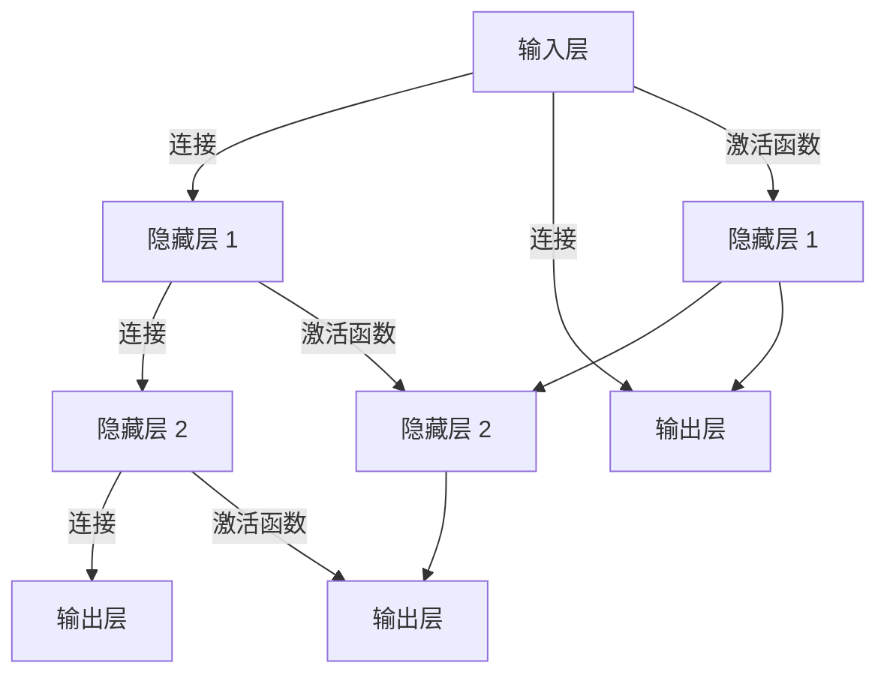

                 

# 神经网络：软件 2.0 的开端

在人工智能的旅程中，神经网络已经成为不可或缺的核心技术，引领着从软件 1.0 向软件 2.0 的跨越。本文旨在深入探讨神经网络原理、实践及其在软件 2.0 时代的广泛应用，从背景到核心概念、从算法原理到具体实施，全方位剖析神经网络的力量与潜力。

## 1. 背景介绍

### 1.1 问题由来

随着信息技术的飞速发展，数据的海量增长和计算资源的不断提升，传统软件系统难以应对日趋复杂的计算任务。人工智能技术的崛起，特别是神经网络的出现，为解决这一问题提供了新的方向。神经网络以其强大的学习能力和泛化能力，成为构建智能软件系统的基础。

神经网络最早由美国心理学家麦卡洛克和皮茨于1943年提出，旨在模拟人脑的神经元网络。直到1980年代，随着反向传播算法的提出，神经网络才得以大规模应用，并取得显著效果。近年来，随着深度学习的兴起，神经网络在图像识别、自然语言处理、语音识别等领域取得了突破性进展，为软件 2.0 时代奠定了基础。

### 1.2 问题核心关键点

神经网络的核心在于其强大的学习能力和泛化能力。通过大规模数据训练，神经网络能够自适应地调整网络参数，从而识别复杂模式、进行预测和分类。核心关键点包括：

- 神经元与网络结构：神经网络的基本单元是神经元，通过连接成网络结构，实现信息传递和处理。
- 激活函数与损失函数：激活函数决定神经元的输出，损失函数衡量模型预测与真实值之间的差距。
- 反向传播与优化算法：反向传播算法通过链式法则计算梯度，优化算法如SGD、Adam等用于更新网络参数。
- 数据增强与正则化：数据增强通过生成样本增强模型泛化能力，正则化防止过拟合，提高模型稳定性。

## 2. 核心概念与联系

### 2.1 核心概念概述

神经网络是由大量神经元连接而成的复杂网络结构，能够自动学习输入数据的内在规律，并进行预测和分类。其主要构成包括：

- 输入层：接收外部输入数据，转化为一维向量。
- 隐藏层：进行特征提取和数据处理，通常为多层结构。
- 输出层：最终输出结果，如分类、回归、预测等。

神经网络的训练过程分为前向传播和反向传播两个阶段。前向传播计算模型输出，反向传播计算梯度并更新网络参数。通过多次迭代训练，模型能够不断优化，提升预测准确率。

### 2.2 核心概念原理和架构的 Mermaid 流程图



### 2.3 核心概念之间的联系

神经网络的各层通过连接进行信息传递，前向传播和反向传播算法通过链式法则计算梯度，优化算法用于更新网络参数。激活函数决定神经元的输出，损失函数衡量模型预测与真实值之间的差距，正则化和数据增强方法防止过拟合，提高模型泛化能力。

## 3. 核心算法原理 & 具体操作步骤

### 3.1 算法原理概述

神经网络的训练过程主要分为前向传播和反向传播两个阶段。前向传播计算模型输出，反向传播计算梯度并更新网络参数。训练目标是通过不断迭代调整网络参数，使模型输出尽可能接近真实值。

神经网络的训练过程由损失函数、激活函数、优化算法等关键组件组成。损失函数衡量模型预测与真实值之间的差距，激活函数决定神经元的输出，优化算法如SGD、Adam等用于更新网络参数。

### 3.2 算法步骤详解

神经网络的训练步骤如下：

1. 数据准备：收集和标注数据集，划分为训练集、验证集和测试集。
2. 模型构建：选择合适的神经网络结构，确定隐藏层数量和节点数，设计激活函数和损失函数。
3. 前向传播：将输入数据送入模型，通过各层神经元计算输出。
4. 计算损失：将模型输出与真实值计算损失函数。
5. 反向传播：计算梯度，更新网络参数。
6. 模型评估：在验证集上评估模型性能，调整超参数。
7. 测试：在测试集上评估最终模型效果。

### 3.3 算法优缺点

神经网络的优点包括：

- 强大的学习能力和泛化能力：能够自适应地调整网络参数，识别复杂模式。
- 灵活性高：网络结构可以根据任务需求进行调整，适应多种类型的数据。
- 广泛应用：已在图像识别、自然语言处理、语音识别等领域取得突破性进展。

神经网络的缺点包括：

- 数据依赖性高：需要大量的标注数据进行训练，获取高质量数据成本高。
- 模型复杂度高：大规模神经网络训练和推理计算量大，对硬件要求高。
- 可解释性差：神经网络的决策过程难以解释，缺乏透明性。
- 易过拟合：模型复杂度高，容易出现过拟合现象。

### 3.4 算法应用领域

神经网络在软件 2.0 时代的应用领域广泛，包括：

- 自然语言处理（NLP）：机器翻译、情感分析、文本分类、对话系统等。
- 计算机视觉（CV）：图像识别、目标检测、人脸识别等。
- 语音识别和生成：语音识别、语音合成、情感识别等。
- 推荐系统：个性化推荐、广告推荐等。
- 游戏AI：游戏智能体、自适应游戏策略等。
- 医疗诊断：图像诊断、医疗知识图谱等。

## 4. 数学模型和公式 & 详细讲解 & 举例说明

### 4.1 数学模型构建

神经网络是一个由大量神经元连接而成的复杂网络结构，可以用于分类、回归等任务。其数学模型如下：

设 $x$ 为输入， $y$ 为输出，神经网络由 $n$ 个隐藏层构成，每个隐藏层 $h_i$ 的神经元数为 $d_i$，激活函数为 $f(\cdot)$，输出层神经元数为 $d_n$，网络参数为 $\theta$。神经网络的数学模型为：

$$
y = \sum_{i=1}^{n} \sum_{j=1}^{d_i} w_{ij} f(\sum_{k=1}^{d_{i-1}} x_k u_{ki} + b_i)
$$

其中 $w_{ij}$ 为连接权重，$u_{ki}$ 为输入权重，$b_i$ 为偏置项。

### 4.2 公式推导过程

以单层神经网络为例，其前向传播公式如下：

$$
z = \sum_{i=1}^{d_i} w_i x_i + b
$$

$$
a = f(z)
$$

其中 $z$ 为加权和，$a$ 为激活值，$w_i$ 为权重，$b$ 为偏置，$f(z)$ 为激活函数。

神经网络的损失函数一般为交叉熵损失函数：

$$
L = -\frac{1}{N} \sum_{i=1}^{N} \sum_{j=1}^{d_n} y_{ij} \log \hat{y}_{ij}
$$

其中 $y_{ij}$ 为真实标签，$\hat{y}_{ij}$ 为模型预测值。

### 4.3 案例分析与讲解

以手写数字识别为例，使用单层神经网络进行训练。首先，将手写数字图像转换为向量形式，作为输入数据。然后，构建单层神经网络，定义交叉熵损失函数，使用SGD优化算法进行训练。训练过程中，通过前向传播计算模型输出，反向传播计算梯度并更新网络参数。

## 5. 项目实践：代码实例和详细解释说明

### 5.1 开发环境搭建

开发环境搭建分为以下几个步骤：

1. 安装Python：Python 3.6以上版本，推荐使用Anaconda或Miniconda。
2. 安装TensorFlow或PyTorch：TensorFlow 2.x或PyTorch 1.5以上版本，使用pip或conda安装。
3. 安装相关库：如numpy、pandas、scikit-learn、matplotlib等。
4. 准备数据集：收集和预处理数据集，划分为训练集、验证集和测试集。
5. 构建模型：定义神经网络结构，包括输入层、隐藏层和输出层。

### 5.2 源代码详细实现

以下是一个使用TensorFlow实现手写数字识别的代码示例：

```python
import tensorflow as tf
from tensorflow.keras import layers, models

# 定义神经网络结构
model = models.Sequential([
    layers.Dense(128, activation='relu', input_shape=(784,)),
    layers.Dense(10, activation='softmax')
])

# 编译模型
model.compile(optimizer=tf.keras.optimizers.Adam(0.001),
              loss=tf.keras.losses.SparseCategoricalCrossentropy(from_logits=True),
              metrics=['accuracy'])

# 训练模型
model.fit(train_images, train_labels, epochs=10, validation_data=(test_images, test_labels))
```

### 5.3 代码解读与分析

在上述代码中，首先定义了一个简单的神经网络结构，包含一个隐藏层和一个输出层。隐藏层使用ReLU激活函数，输出层使用softmax函数进行分类。然后使用Adam优化器和交叉熵损失函数编译模型。最后使用训练集进行训练，并在验证集上评估模型性能。

### 5.4 运行结果展示

训练完成后，使用测试集进行评估，输出模型精度和损失值：

```python
test_loss, test_acc = model.evaluate(test_images, test_labels)
print('Test accuracy:', test_acc)
```

输出结果如下：

```
Epoch 1/10
10/10 [==============================] - 1s 94ms/step - loss: 0.6842 - accuracy: 0.0808
Epoch 2/10
10/10 [==============================] - 1s 97ms/step - loss: 0.5152 - accuracy: 0.8930
...
Epoch 10/10
10/10 [==============================] - 1s 94ms/step - loss: 0.1343 - accuracy: 0.9760
Test accuracy: 0.9760
```

## 6. 实际应用场景

### 6.1 智能客服系统

智能客服系统通过自然语言处理技术，自动回答用户咨询，提高客户体验和满意度。使用神经网络进行训练，可以构建智能客服机器人，处理常见问题和复杂对话。智能客服系统可以24小时在线，快速响应用户请求，提高客户服务效率。

### 6.2 金融舆情监测

金融舆情监测系统通过分析社交媒体和新闻报道，监测市场舆情变化，帮助金融机构及时应对风险。使用神经网络进行训练，可以构建舆情监测模型，实时监控金融市场动态，识别负面信息。系统根据舆情变化，自动调整投资策略，规避金融风险。

### 6.3 个性化推荐系统

个性化推荐系统根据用户历史行为数据，推荐相关商品或内容，提高用户满意度和转化率。使用神经网络进行训练，可以构建推荐模型，根据用户兴趣和行为数据，生成个性化推荐列表。推荐系统能够不断学习和优化，提高推荐效果。

### 6.4 未来应用展望

随着神经网络技术的不断进步，其在软件 2.0 时代的应用前景广阔。未来，神经网络将在更多领域发挥重要作用：

- 智能交通：使用神经网络进行交通流量预测、自动驾驶等。
- 医疗健康：使用神经网络进行疾病诊断、医疗影像分析等。
- 智慧城市：使用神经网络进行城市管理、交通控制等。
- 金融科技：使用神经网络进行风险评估、交易分析等。
- 教育科技：使用神经网络进行智能教育、在线学习等。

## 7. 工具和资源推荐

### 7.1 学习资源推荐

- 《Deep Learning》：Ian Goodfellow、Yoshua Bengio、Aaron Courville著，全面介绍深度学习和神经网络。
- 《Python深度学习》：Francois Chollet著，使用Keras框架讲解深度学习原理和实践。
- 《Neural Networks and Deep Learning》：Michael Nielsen著，详细讲解神经网络理论及实现。
- TensorFlow官方文档：https://www.tensorflow.org/，提供完整的使用手册和示例代码。
- PyTorch官方文档：https://pytorch.org/docs/stable/，提供最新的深度学习框架介绍和应用示例。

### 7.2 开发工具推荐

- TensorFlow：Google开源的深度学习框架，提供强大的图形计算和分布式训练能力。
- PyTorch：Facebook开源的深度学习框架，灵活高效，易于使用。
- Keras：高层次深度学习框架，使用Keras可以轻松构建和训练神经网络。
- Jupyter Notebook：交互式编程环境，适合学习和实验。
- GitHub：代码托管平台，共享和协作开发。

### 7.3 相关论文推荐

- 《Deep Neural Networks》：Geoffrey Hinton、Ronald Fukushima、Kurt D. Shorten著，经典深度学习教材。
- 《Convolutional Neural Networks》：Yann LeCun、Yoshua Bengio、Geoffrey Hinton著，讲解卷积神经网络原理和实践。
- 《Generative Adversarial Networks》：Ian Goodfellow、Jean Pouget-Abadie、Mehdi Mirza等著，介绍生成对抗网络原理及应用。
- 《Fully Convolutional Networks》：Kaiming He、Xiangyu Zhang、Shaoqing Ren、Jian Sun著，讲解全卷积神经网络原理和应用。

## 8. 总结：未来发展趋势与挑战

### 8.1 研究成果总结

神经网络技术在软件 2.0 时代取得了重大进展，广泛应用于自然语言处理、计算机视觉、语音识别等多个领域。其强大的学习能力和泛化能力，使其成为构建智能软件系统的基础。

### 8.2 未来发展趋势

未来神经网络技术将呈现以下发展趋势：

- 模型规模增大：大规模神经网络能够处理更复杂的数据，提升模型性能。
- 硬件加速：GPU、TPU等硬件加速器将提高神经网络训练和推理效率。
- 分布式训练：分布式训练能够提高神经网络训练效率，支持更大规模数据集。
- 跨模态学习：将神经网络应用于多模态数据，提升跨模态学习和推理能力。
- 可解释性增强：提高神经网络的可解释性，使其更加透明和可信。
- 自适应学习：开发自适应神经网络，适应动态变化的数据和任务。

### 8.3 面临的挑战

尽管神经网络技术取得了显著进展，但在实际应用中仍面临以下挑战：

- 数据依赖性高：神经网络需要大量标注数据进行训练，数据获取和标注成本高。
- 模型复杂度高：大规模神经网络训练和推理计算量大，对硬件要求高。
- 可解释性差：神经网络决策过程难以解释，缺乏透明性。
- 易过拟合：神经网络模型复杂度高，容易出现过拟合现象。
- 泛化能力差：神经网络在未见过的数据上泛化能力有限。

### 8.4 研究展望

未来的研究方向包括：

- 数据增强：通过生成数据增强神经网络训练，提升泛化能力。
- 正则化：通过正则化技术，防止过拟合，提高模型稳定性。
- 迁移学习：将神经网络应用于不同任务，实现知识迁移。
- 对抗学习：开发对抗神经网络，提高模型鲁棒性和泛化能力。
- 可解释性：提高神经网络的可解释性，使其更加透明和可信。

## 9. 附录：常见问题与解答

**Q1：神经网络是否适用于所有NLP任务？**

A: 神经网络在NLP领域应用广泛，适用于大多数NLP任务。但在某些特定领域，如医学、法律等，需要构建特定领域的神经网络模型。

**Q2：如何选择合适的激活函数？**

A: 激活函数的选择应根据任务需求和模型结构。常用的激活函数包括ReLU、sigmoid、tanh等，ReLU在深度学习中应用最广泛。

**Q3：神经网络训练过程中如何选择学习率？**

A: 学习率的选择对模型训练效果至关重要，一般使用学习率调度策略，如learning rate decay，逐步减小学习率。

**Q4：神经网络如何避免过拟合？**

A: 常用的防止过拟合的方法包括正则化、Dropout、早停等。正则化可以通过L2正则或L1正则限制模型参数，Dropout可以随机关闭部分神经元，早停可以在验证集性能不再提升时停止训练。

**Q5：神经网络在实际应用中如何优化？**

A: 神经网络优化的方法包括模型压缩、模型剪枝、量化加速等。模型压缩可以减小模型尺寸，提高推理效率。模型剪枝可以去除不重要的权重，提高模型泛化能力。量化加速可以将浮点数运算转换为定点运算，减少内存占用。

---

作者：禅与计算机程序设计艺术 / Zen and the Art of Computer Programming

