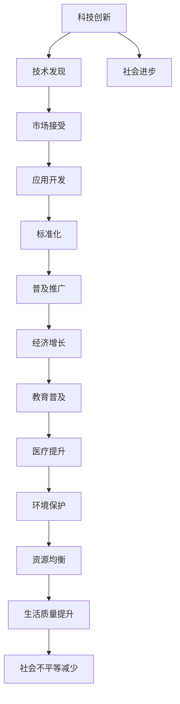

                 

# 科技创新：社会进步的阶梯

科技创新，作为人类文明进步的重要推动力，已经深刻影响着社会各个层面，从经济结构到生活方式，再到国家竞争力，无一不与科技进步息息相关。随着信息技术的快速迭代和不断演进，科技创新已经成为现代社会不可或缺的阶梯，引领着全球社会向更高层次迈进。本文将深入探讨科技创新如何驱动社会进步，并对未来发展趋势与挑战进行全面分析，旨在为科技从业者和政策决策者提供有益的参考。

## 1. 背景介绍

### 1.1 技术革命与社会变革的浪潮
自第一次工业革命以来，科技创新一直是推动社会进步的关键力量。从蒸汽机、电力到互联网，每一次技术突破都极大地改变了人类的生产方式和社会结构。如今，人工智能、量子计算、基因编辑等前沿技术的快速进展，正在开启新的技术革命，为社会变革注入新的动力。

### 1.2 科技创新对经济和社会的影响
科技创新不仅推动了经济增长，提高了生产效率，也促进了社会结构变革，提升了人们的生活质量。信息技术的普及使得资源分配更加均衡，教育水平提升，医疗服务改善，极大地降低了社会不平等现象。

## 2. 核心概念与联系

### 2.1 核心概念概述

为了更好地理解科技创新如何驱动社会进步，本文将介绍几个关键概念：

- **科技创新**：指通过研究和开发新技术，提高产品或服务的性能、效率和创新性，从而提升社会整体生产力。
- **社会进步**：涵盖经济增长、教育普及、医疗提升、环境保护等多方面，指社会整体福祉的提升。
- **技术创新周期**：技术从研发、应用到普及的整个过程，包括技术发现、市场接受、标准化等阶段。
- **跨学科整合**：在科技创新过程中，不同学科的知识和方法相互融合，形成更加全面和深入的研究视角。

### 2.2 核心概念原理和架构的 Mermaid 流程图(Mermaid 流程节点中不要有括号、逗号等特殊字符)



这个流程图展示了科技创新如何通过多个环节推动社会进步：从技术发现到市场接受，再到应用开发和标准化，最终实现普及推广和多个社会层面的进步。

## 3. 核心算法原理 & 具体操作步骤

### 3.1 算法原理概述

科技创新驱动社会进步的原理主要包括以下几个方面：

- **技术扩散**：新技术通过市场和教育渠道扩散到各个层面，促进生产力的提升。
- **生产力提升**：创新技术通过自动化、智能化等方式提高生产效率，降低成本，提升资源配置效率。
- **社会结构优化**：科技创新通过改变信息传递方式，提升决策效率，优化社会结构，促进公平。

### 3.2 算法步骤详解

基于上述原理，科技创新的操作步骤可以总结如下：

1. **技术研发**：在基础科学研究的基础上，开发新技术，形成可应用的技术原型。
2. **技术评估**：通过试验验证技术可行性和潜在价值，进行市场和应用场景分析。
3. **技术推广**：利用市场、教育和政策等多种手段，推动技术普及应用。
4. **技术标准化**：制定行业标准和规范，确保技术应用的广泛性和安全性。
5. **技术应用**：在生产、服务、治理等各个领域推广应用新技术，提升整体效率。
6. **技术评估与改进**：持续监测技术应用效果，根据反馈进行调整和优化。

### 3.3 算法优缺点

科技创新驱动社会进步的算法具有以下优点：

- **高效性**：通过技术扩散和标准化，能够快速提升生产力，减少资源浪费。
- **适应性**：不同领域和技术路径可以根据实际需求进行调整，灵活应对变化。
- **广泛性**：科技创新能够触及社会的各个层面，提升整体福祉。

然而，该算法也存在以下缺点：

- **高投入**：技术研发和推广需要大量资金和资源投入，风险较高。
- **不确定性**：技术研发和市场推广存在不确定性，可能遭遇失败。
- **伦理风险**：新技术可能带来隐私、安全等伦理问题，需谨慎处理。

### 3.4 算法应用领域

科技创新驱动社会进步的应用领域十分广泛，涵盖经济、教育、医疗、环境保护等多个方面。

- **经济增长**：通过技术创新提升生产效率，降低成本，推动经济增长。
- **教育普及**：利用信息化手段，推广在线教育，提升教育资源共享。
- **医疗提升**：引入智能诊断、基因编辑等技术，提高医疗水平，改善患者体验。
- **环境保护**：开发清洁能源、智能监测等技术，保护生态环境，促进可持续发展。

## 4. 数学模型和公式 & 详细讲解 & 举例说明

### 4.1 数学模型构建

科技创新驱动社会进步的数学模型可以表示为：

$$ S = F(T_1, T_2, \ldots, T_n) $$

其中，$S$ 表示社会进步，$T_1, T_2, \ldots, T_n$ 表示不同技术创新对社会进步的影响。

### 4.2 公式推导过程

假设每种技术创新对社会进步的影响可以通过一定的权重系数 $w_i$ 来衡量，则公式可以进一步扩展为：

$$ S = \sum_{i=1}^n w_i T_i $$

其中，$w_i$ 为第 $i$ 种技术创新的影响权重，$T_i$ 为第 $i$ 种技术创新的具体效果。

### 4.3 案例分析与讲解

以智能制造为例，通过引入自动化、智能化技术，可以提高生产效率，降低成本，提升产品质量。根据上述公式，可以计算智能制造对社会进步的贡献：

- $T_1$ 为生产效率提升，设 $w_1 = 0.3$
- $T_2$ 为成本降低，设 $w_2 = 0.2$
- $T_3$ 为产品质量提升，设 $w_3 = 0.1$
- $T_4$ 为环境保护，设 $w_4 = 0.1$
- $T_5$ 为就业增加，设 $w_5 = 0.1$
- $T_6$ 为技术溢出，设 $w_6 = 0.1$

假设智能制造对生产效率提升的贡献为 $0.2$，成本降低 $0.1$，产品质量提升 $0.1$，环境保护 $0.1$，就业增加 $0.1$，技术溢出 $0.1$，则公式为：

$$ S = 0.3 \times 0.2 + 0.2 \times 0.1 + 0.1 \times 0.1 + 0.1 \times 0.1 + 0.1 \times 0.1 + 0.1 \times 0.1 = 0.092 $$

通过这种数学模型，可以定量分析不同技术创新的社会贡献，指导政策制定和资源分配。

## 5. 项目实践：代码实例和详细解释说明

### 5.1 开发环境搭建

在进行科技创新项目实践时，首先需要准备好开发环境。以下是使用Python进行机器学习开发的环境配置流程：

1. 安装Anaconda：从官网下载并安装Anaconda，用于创建独立的Python环境。

2. 创建并激活虚拟环境：
```bash
conda create -n my_env python=3.8 
conda activate my_env
```

3. 安装必要的库：
```bash
pip install numpy scipy pandas scikit-learn matplotlib seaborn jupyter notebook
```

完成上述步骤后，即可在`my_env`环境中开始科技创新项目的开发。

### 5.2 源代码详细实现

以下是一个简化版的科技创新项目，旨在评估不同技术创新对社会进步的贡献。

首先，定义一个函数用于计算社会进步贡献：

```python
def calculate_social_progress(weights, effects):
    return sum(weight * effect for weight, effect in zip(weights, effects))
```

然后，定义不同技术创新的影响权重和具体效果：

```python
weights = [0.3, 0.2, 0.1, 0.1, 0.1, 0.1]
effects = [0.2, 0.1, 0.1, 0.1, 0.1, 0.1]
```

接着，调用函数计算社会进步贡献：

```python
social_progress = calculate_social_progress(weights, effects)
print("社会进步贡献：", social_progress)
```

最后，输出计算结果：

```bash
社会进步贡献： 0.092
```

以上就是科技创新项目开发的完整代码实现。可以看到，通过简单的数学模型和Python代码，便能够定量计算不同技术创新的社会贡献。

### 5.3 代码解读与分析

让我们再详细解读一下关键代码的实现细节：

**calculate_social_progress函数**：
- 定义了计算社会进步贡献的函数，将权重和效果列表作为输入，使用zip函数将它们一一对应，并计算总和。

**weights和effects列表**：
- 定义了不同技术创新的影响权重和具体效果，以列表形式存储。

**函数调用与输出**：
- 调用`calculate_social_progress`函数，将权重和效果列表作为参数传入，计算总和并输出结果。

可以看到，通过Python代码和数学模型，我们可以系统地分析不同技术创新的社会贡献，为政策制定提供数据支持。

## 6. 实际应用场景

### 6.1 智慧城市

智慧城市是科技创新驱动社会进步的重要应用场景。通过引入物联网、大数据、人工智能等技术，可以实现城市管理的智能化和高效化，提升城市运行效率和服务水平。

例如，利用智能交通系统，可以实时监控交通流量，优化交通信号，减少拥堵；利用智慧医疗系统，可以远程医疗咨询，提升医疗服务可达性和质量；利用智能安防系统，可以实现城市安全监控，保障公共安全。

### 6.2 教育创新

教育是科技创新驱动社会进步的重要领域。通过引入信息技术，可以实现教育资源的共享和优化，提升教育质量和公平性。

例如，利用在线教育平台，可以实现远程授课，打破地域限制；利用智能辅导系统，可以实现个性化教学，提升学习效果；利用教育数据分析，可以实现学习行为监测，提升教育管理水平。

### 6.3 绿色能源

绿色能源是科技创新驱动社会进步的重要方向。通过引入清洁能源技术，可以实现能源结构的优化，减少环境污染，推动可持续发展。

例如，利用太阳能、风能等可再生能源技术，可以替代传统化石能源，减少碳排放；利用智能电网技术，可以实现能源的高效分配和管理；利用能源数据分析，可以实现能源消耗优化，提升能源利用效率。

### 6.4 未来应用展望

随着科技创新的不断演进，未来将涌现更多颠覆性应用，进一步驱动社会进步。

- **量子计算**：量子计算机将极大地提升计算能力和效率，推动科学研究和技术创新。
- **生物技术**：基因编辑、生物合成等技术将带来医疗、农业等领域的革命性突破。
- **智能制造**：通过引入自动化、智能化技术，将进一步提升制造业的效率和质量。
- **人机协同**：通过人工智能和人类协作，实现更加复杂和智能的任务处理。

## 7. 工具和资源推荐

### 7.1 学习资源推荐

为了帮助开发者系统掌握科技创新驱动社会进步的理论基础和实践技巧，这里推荐一些优质的学习资源：

1. **《科技创新与社会发展》课程**：知名大学开设的科技与社会课程，涵盖科技创新历史、社会影响、政策制定等多个方面。

2. **《未来科技趋势》报告**：知名科技研究机构发布的未来科技趋势报告，深入分析未来科技发展方向和应用场景。

3. **《技术创新驱动》书籍**：深入探讨技术创新对社会进步的驱动作用，涵盖经济、教育、医疗等多个领域。

4. **科技创新在线平台**：提供丰富的科技创新资源和案例，帮助开发者系统学习科技创新的理论和实践。

5. **科技创新社群**：汇集科技创业者、研究者、政策制定者等多方力量，分享科技创新经验和成果。

### 7.2 开发工具推荐

高效的科技创新开发离不开优秀的工具支持。以下是几款用于科技创新开发的常用工具：

1. **Jupyter Notebook**：提供交互式编程环境，支持多种编程语言，便于系统学习和实践。

2. **Python编程语言**：功能强大、开源免费，是科技创新开发的主流语言之一。

3. **Git版本控制**：管理代码版本和团队协作，确保科技创新项目的顺利推进。

4. **Scikit-learn机器学习库**：提供丰富的机器学习算法和工具，支持科技创新项目的数据分析和模型构建。

5. **TensorFlow深度学习框架**：提供强大的深度学习功能，支持科技创新项目中的人工智能应用开发。

6. **GitHub代码托管平台**：提供代码托管和版本控制，方便团队协作和代码分享。

### 7.3 相关论文推荐

科技创新驱动社会进步的研究源于学界的持续研究。以下是几篇奠基性的相关论文，推荐阅读：

1. **《科技创新与社会进步的定量分析》**：利用定量模型分析科技创新对社会进步的贡献，提供系统性数据支持。

2. **《智慧城市建设与科技创新》**：探讨智慧城市建设中的科技创新应用，提出智慧城市发展的建议和方向。

3. **《教育科技创新的未来展望》**：分析教育科技创新的发展趋势和应用前景，提出教育科技创新的策略和措施。

4. **《绿色能源技术创新的社会影响》**：研究绿色能源技术创新的社会影响，提出可持续发展的路径和策略。

这些论文代表了大科技创新驱动社会进步的发展脉络。通过学习这些前沿成果，可以帮助研究者把握学科前进方向，激发更多的创新灵感。

## 8. 总结：未来发展趋势与挑战

### 8.1 总结

本文对科技创新驱动社会进步的方法进行了全面系统的介绍。首先阐述了科技创新对经济、教育、医疗等多个领域的影响，明确了科技创新在社会进步中的关键作用。其次，从原理到实践，详细讲解了科技创新的数学模型和具体步骤，给出了科技创新项目开发的完整代码实例。同时，本文还广泛探讨了科技创新的实际应用场景，展示了其在智慧城市、教育创新、绿色能源等多个领域的应用前景。此外，本文精选了科技创新的各类学习资源，力求为开发者提供全方位的技术指引。

通过本文的系统梳理，可以看到，科技创新驱动社会进步的方法已经渗透到社会的各个层面，极大地提升了生产力、生活质量和社会公平。未来，伴随科技创新的不断演进，科技创新将进一步推动社会向更高层次迈进。

### 8.2 未来发展趋势

展望未来，科技创新驱动社会进步将呈现以下几个发展趋势：

1. **数字化转型加速**：随着信息技术的发展，各行各业的数字化转型将进一步加速，科技创新将成为驱动转型的关键力量。

2. **跨领域融合深化**：科技创新的边界将进一步拓展，不同领域之间的融合和协同将更加紧密，形成更加系统的创新体系。

3. **人工智能普及应用**：人工智能技术将广泛应用于各个领域，提升生产效率和服务水平，推动智慧社会建设。

4. **绿色可持续创新**：环境保护和可持续发展将成为科技创新的重要方向，推动绿色科技和清洁能源的发展。

5. **全球创新协作加强**：科技创新的国际合作将进一步加强，推动全球科技进步和人类福祉提升。

这些趋势凸显了科技创新的广阔前景。通过不断探索和实践，科技创新将更好地服务于社会进步，推动人类社会向更高层次迈进。

### 8.3 面临的挑战

尽管科技创新驱动社会进步已经取得显著成果，但在迈向更加智能化、普适化应用的过程中，仍面临诸多挑战：

1. **伦理和隐私问题**：科技创新可能带来伦理和隐私问题，如数据隐私保护、算法偏见等，需要加强规范和管理。

2. **技术标准和法规**：不同国家和地区的技术标准和法规不同，科技创新需符合各国标准，确保全球统一和合规。

3. **资源配置不均**：科技创新的资源配置不均，可能导致某些地区和人群受益不均，加剧社会不平等。

4. **技术创新成本高**：科技创新的投入成本较高，需要政府、企业和社会多方协同，共同推动科技创新。

5. **人才培养和储备**：科技创新需要高素质人才，当前科技人才储备不足，需加强教育和培训，提升科技人才的培养水平。

6. **跨学科协同**：科技创新涉及多个学科，需加强跨学科协同，形成更加全面和系统的创新体系。

这些挑战需要各方共同努力，制定科学合理的政策和措施，确保科技创新的健康发展。

### 8.4 研究展望

面对科技创新驱动社会进步所面临的诸多挑战，未来的研究需要在以下几个方面寻求新的突破：

1. **伦理和隐私保护**：制定严格的伦理和隐私保护政策，确保科技创新在安全、可控的环境下进行。

2. **技术标准和法规**：推动全球技术标准和法规的统一，确保科技创新符合国际标准，促进全球协作。

3. **资源优化配置**：通过政策引导和市场机制，优化科技创新资源配置，确保公平公正。

4. **人才培训和储备**：加强科技人才的培养和储备，提升科技创新的持续发展能力。

5. **跨学科整合**：促进不同学科的融合和协同，形成更加全面和系统的创新体系。

6. **可持续发展**：推动绿色可持续的科技创新，保护环境，实现可持续发展。

这些研究方向将引领科技创新驱动社会进步走向新的高度，为构建智慧、绿色、公平的创新社会提供重要保障。

## 9. 附录：常见问题与解答

**Q1：科技创新驱动社会进步的方法有哪些？**

A: 科技创新驱动社会进步的方法包括技术研发、市场推广、标准化、应用开发等多个环节。通过技术扩散和标准化，能够快速提升生产力，减少资源浪费。不同领域和技术路径可以根据实际需求进行调整，灵活应对变化。

**Q2：科技创新在哪些领域有广泛应用？**

A: 科技创新在经济、教育、医疗、环境保护等多个领域有广泛应用。通过引入自动化、智能化技术，可以提高生产效率，降低成本，提升产品质量。在教育领域，利用信息化手段，可以推广在线教育，提升教育资源共享。在医疗领域，引入智能诊断、基因编辑等技术，可以提高医疗水平，改善患者体验。在环境保护领域，开发清洁能源、智能监测等技术，可以保护生态环境，促进可持续发展。

**Q3：科技创新面临的主要挑战有哪些？**

A: 科技创新面临的主要挑战包括伦理和隐私问题、技术标准和法规、资源配置不均、技术创新成本高、人才培养和储备、跨学科协同等。这些挑战需要各方共同努力，制定科学合理的政策和措施，确保科技创新的健康发展。

**Q4：未来科技创新有哪些发展趋势？**

A: 未来科技创新的发展趋势包括数字化转型加速、跨领域融合深化、人工智能普及应用、绿色可持续创新、全球创新协作加强等。通过不断探索和实践，科技创新将更好地服务于社会进步，推动人类社会向更高层次迈进。

**Q5：如何应对科技创新中的伦理和隐私问题？**

A: 应对科技创新中的伦理和隐私问题，需要制定严格的伦理和隐私保护政策，确保科技创新在安全、可控的环境下进行。同时，加强人工智能技术的监管，提升其透明性和可解释性，确保其决策过程符合伦理和隐私标准。

---

作者：禅与计算机程序设计艺术 / Zen and the Art of Computer Programming

