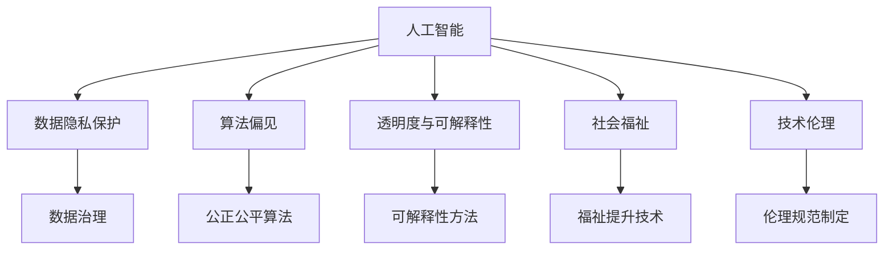

                 

# 科技向善：用科技的力量解决社会难题

> 关键词：人工智能, 社会责任, 数据治理, 伦理道德, 社会福祉, 公共政策, 技术创新

## 1. 背景介绍

### 1.1 问题由来

在过去的几十年里，人工智能(AI)技术已经取得了巨大的进步，广泛应用于医疗、教育、交通、金融等多个领域。然而，科技的快速发展也带来了一些亟待解决的社会问题，如数据隐私保护、算法偏见、公平性、安全性等。这些问题不仅影响着技术本身的发展，也深刻地影响着社会的公平与正义。

科技向善，不仅仅是技术上的进步，更是一种社会责任和道德义务。如何让科技更好地服务于社会，提升人类的生活质量，是每一个科技工作者需要深思的问题。本文将探讨如何利用科技的力量，解决一些社会难题，为构建更公平、更和谐的社会贡献力量。

### 1.2 问题核心关键点

当前，科技向善的核心在于如何确保人工智能技术的发展与社会的伦理道德、公共政策、法律法规相一致。以下是我们面临的几个关键问题：

- **数据隐私保护**：AI模型需要大量数据进行训练，如何在获取数据的同时，保护个人隐私，防止数据滥用？
- **算法偏见**：AI算法可能存在偏见，如何确保算法公正、公平？
- **透明度与可解释性**：AI模型往往被称为"黑盒"系统，如何提高算法的透明度和可解释性，确保用户的信任和理解？
- **社会福祉**：AI技术如何助力社会福利的提升，改善公共服务质量？
- **技术伦理**：如何在技术创新与伦理道德之间找到平衡，避免技术滥用？

解决这些问题，需要从数据治理、算法设计、政策法规等多个方面进行综合考虑和深入研究。本文将从这些方面出发，探讨如何用科技向善，构建更公平、更和谐的社会。

## 2. 核心概念与联系

### 2.1 核心概念概述

为更好地理解如何用科技向善，解决社会难题，本节将介绍几个密切相关的核心概念：

- **人工智能(AI)**：指通过机器学习和数据科学，使计算机系统能够模拟人类智能的能力，包括感知、学习、推理、决策等。
- **数据隐私保护**：指在数据收集、处理、存储、传输等过程中，采取措施保护个人隐私和数据安全。
- **算法偏见**：指算法在训练和应用过程中，由于数据偏差、模型设计等原因，导致对某些群体的歧视或不公平对待。
- **透明度与可解释性**：指算法决策过程的公开性和可理解性，使用户能够了解算法的行为依据。
- **社会福祉**：指通过技术手段，提升社会的整体福祉，改善生活质量。
- **技术伦理**：指在技术创新和应用过程中，遵循的伦理原则和道德规范，确保技术的安全、公正、公平使用。

这些概念之间的逻辑关系可以通过以下Mermaid流程图来展示：



这个流程图展示了一系列的环节，从人工智能的各个方面出发，逐步落实到具体的措施和技术，最终达到构建公平和谐社会的目的。

## 3. 核心算法原理 & 具体操作步骤
### 3.1 算法原理概述

科技向善的实现，离不开核心算法的设计和优化。以下是对几个关键算法的概述：

- **隐私保护算法**：如差分隐私、同态加密等，能够在保护数据隐私的同时，保证数据分析的准确性。
- **公平性算法**：如对冲算法、公平代价算法等，通过调整模型参数，减少算法偏见，确保不同群体的公平待遇。
- **可解释性算法**：如LIME、SHAP等，通过生成可解释性模型，提高算法的透明度，使用户能够理解和信任模型。
- **福祉提升算法**：如自然语言处理(NLP)中的智能客服、医疗诊断等，通过技术手段提升社会福祉。
- **伦理规范算法**：如基于伦理约束的决策树、因果推断等，确保技术应用的道德边界。

这些算法在实际应用中，需要综合考虑数据隐私、算法公平、模型透明、社会福祉和技术伦理等多个方面，才能确保科技向善的实现。

### 3.2 算法步骤详解

科技向善的算法实施步骤，通常包括以下几个关键步骤：

**Step 1: 数据收集与预处理**
- 确定数据来源和收集方式，确保数据的多样性和代表性。
- 对数据进行清洗和标准化，处理缺失值和异常值。
- 应用隐私保护算法，保护用户隐私。

**Step 2: 模型设计**
- 根据具体任务选择合适的算法和模型结构，如深度学习、机器学习、集成学习等。
- 设计公正公平的损失函数和优化目标，减少算法偏见。
- 引入可解释性模型，确保算法的透明性和可理解性。

**Step 3: 模型训练与优化**
- 使用训练集数据训练模型，优化模型参数，提升模型性能。
- 应用正则化技术，如L2正则、Dropout等，防止过拟合。
- 应用公平性算法，确保不同群体的公平待遇。

**Step 4: 模型评估与部署**
- 在验证集上评估模型性能，确保模型效果。
- 应用隐私保护算法，保护用户隐私。
- 设计透明的算法输出，增强用户信任。
- 部署模型到实际应用中，持续监控模型表现。

**Step 5: 持续改进**
- 根据实际应用反馈，持续改进模型，提升性能。
- 定期更新模型，确保其与社会发展保持同步。
- 遵循伦理规范，确保技术应用的道德边界。

通过以上步骤，可以系统地实现科技向善的目标，解决数据隐私、算法偏见、透明度与可解释性、社会福祉和技术伦理等问题。

### 3.3 算法优缺点

科技向善的算法具有以下优点：

- **提升社会福祉**：通过技术手段提升生活质量，改善公共服务质量。
- **保护数据隐私**：在数据收集和处理过程中，确保数据的安全和隐私。
- **减少算法偏见**：通过公正公平的算法设计，减少算法的歧视和不公平。
- **增强透明度和可解释性**：提高算法的透明度，使用户能够理解和信任模型。
- **遵循伦理规范**：确保技术应用的道德边界，避免技术滥用。

然而，这些算法也存在一些局限性：

- **计算资源需求高**：隐私保护和公平性算法往往需要较高的计算资源，可能增加系统复杂性。
- **模型复杂性高**：可解释性算法和伦理规范算法可能需要复杂的模型设计和优化。
- **技术落地难**：将理论算法转化为实际应用，需要综合考虑数据、模型、算法等多个方面，面临诸多挑战。
- **伦理道德风险**：技术应用的道德边界难以完全定义，可能带来新的伦理问题。

尽管如此，科技向善的算法仍然具有重要的现实意义和应用前景，值得我们深入研究和探索。

### 3.4 算法应用领域

科技向善的算法应用范围广泛，以下是几个典型领域：

- **医疗健康**：通过智能诊断系统，提升医疗服务质量，改善患者体验。
- **教育培训**：利用智能教育系统，因材施教，提升教育公平性。
- **金融服务**：使用智能风控系统，提高金融安全性和用户体验。
- **公共安全**：应用智能监控系统，提升城市治理水平，保障公共安全。
- **环境保护**：通过智能监测系统，实现环境数据的实时监测和分析。

这些领域的应用，不仅提升了科技的商业价值，更在改善人类生活质量和社会福祉方面做出了重要贡献。

## 4. 数学模型和公式 & 详细讲解  
### 4.1 数学模型构建

本节将使用数学语言对科技向善的算法进行更加严格的刻画。

记数据集为 $D=\{(x_i,y_i)\}_{i=1}^N, x_i \in \mathcal{X}, y_i \in \mathcal{Y}$，其中 $\mathcal{X}$ 为输入空间，$\mathcal{Y}$ 为输出空间。

定义隐私保护算法 $A$，输出保护后的数据集 $D_A$。定义公平性算法 $F$，对模型 $M$ 进行公平性优化，得到优化后的模型 $M^*$。定义可解释性算法 $E$，对模型 $M$ 进行可解释性分析，得到可解释性模型 $M_E$。

在数据隐私保护方面，常用的隐私保护算法包括差分隐私和同态加密。

**差分隐私**：对于给定阈值 $\epsilon$ 和数据集大小 $n$，差分隐私算法通过在模型输出中加入噪声，保证单个样本的加入或删除不会对模型输出产生显著影响。数学上，差分隐私的保证条件为：

$$
Pr[|f(x) - f(x')| > \epsilon] \leq \frac{\delta}{2}
$$

其中 $f$ 为数据处理函数，$x$ 和 $x'$ 为相邻的数据样本，$\delta$ 为隐私保护误差。

**同态加密**：同态加密算法能够在加密数据的情况下，进行计算，保护数据隐私。数学上，同态加密定义为：

$$
E[A] = A(E[x])
$$

其中 $A$ 为计算函数，$x$ 为数据集，$E$ 为加密函数，$E[A]$ 表示对计算结果进行加密。

### 4.2 公式推导过程

以下我们以智能医疗诊断系统为例，推导差分隐私在医疗数据中的应用。

假设医疗数据集为 $D=\{(x_i,y_i)\}_{i=1}^N$，其中 $x_i$ 为患者病历数据，$y_i$ 为疾病诊断结果。模型的输入输出分别为 $x$ 和 $y$。

定义差分隐私算法 $A$，输出保护后的数据集 $D_A$。差分隐私算法的数学定义如下：

$$
A[D] = \{(x_i', y_i')\}_{i=1}^N
$$

其中 $x_i'$ 为差分隐私算法对 $x_i$ 进行隐私保护的输出，$y_i'$ 为疾病诊断结果。

在公平性算法方面，常用的算法包括对冲算法和公平代价算法。

**对冲算法**：通过在模型损失函数中引入公平代价项，保证模型对不同群体的公平性。数学上，对冲算法定义为：

$$
\ell^*(x, y) = \ell(x, y) + \lambda C(x)
$$

其中 $\lambda$ 为公平代价系数，$C(x)$ 为公平代价函数。

**公平代价函数**：常见的公平代价函数包括均值方差、互信息等。以均值方差为例，其定义为：

$$
C(x) = \sum_i \frac{(y_i - \bar{y})^2}{\sigma^2}
$$

其中 $\bar{y}$ 为群体 $y$ 的均值，$\sigma^2$ 为群体 $y$ 的方差。

在可解释性算法方面，常用的算法包括LIME和SHAP。

**LIME**：局部可解释性模型（Local Interpretable Model-agnostic Explanations），通过在局部范围内生成解释模型，提高算法的透明性和可理解性。数学上，LIME的定义如下：

$$
E_M(x) = \sum_{i=1}^n \alpha_i g_i(x)
$$

其中 $g_i(x)$ 为局部可解释性模型，$\alpha_i$ 为权重系数，$n$ 为模型数量。

**SHAP**：Shapley值（Shapley Additive Explanations），通过计算每个特征对模型输出的贡献度，提高算法的透明性和可理解性。数学上，SHAP的定义如下：

$$
\phi(x) = \sum_{i=1}^n w_i f(x \backslash_i)
$$

其中 $f$ 为模型输出函数，$w_i$ 为特征 $x_i$ 的Shapley值，$x \backslash_i$ 为去除特征 $x_i$ 的数据集。

### 4.3 案例分析与讲解

下面我们以智能医疗诊断系统为例，给出差分隐私和公平性算法在实际应用中的实现。

假设一个智能医疗诊断系统需要训练一个分类模型，用于预测疾病诊断结果。系统的输入为患者病历数据 $x$，输出为疾病诊断结果 $y$。

**Step 1: 数据隐私保护**

首先，需要对原始医疗数据集进行差分隐私处理，以保护患者隐私。差分隐私算法将原始数据集 $D$ 转化为保护后的数据集 $D_A$，其中 $D_A$ 中每个样本 $x_i'$ 都是对 $x_i$ 进行差分隐私处理后的结果。具体实现方式如下：

1. 对每个样本 $x_i$ 计算敏感度 $\Delta$，如绝对值、均值等。
2. 对每个样本 $x_i$ 引入噪声 $\epsilon_i$，计算差分隐私输出 $x_i'$。
3. 将差分隐私输出 $x_i'$ 添加到保护后的数据集 $D_A$ 中。

差分隐私的实现代码如下：

```python
import numpy as np

def differential_privacy(x, epsilon, delta):
    # 计算敏感度
    delta = np.abs(x).sum()
    
    # 引入噪声
    noise = np.random.normal(0, epsilon, x.shape)
    
    # 差分隐私输出
    x_priv = x + noise
    
    return x_priv
```

**Step 2: 模型训练与优化**

其次，需要对差分隐私保护后的数据集 $D_A$ 进行模型训练，优化模型参数。公平性算法通过对冲算法和公平代价函数，保证模型的公平性。具体实现方式如下：

1. 定义模型损失函数 $\ell(x,y)$，如交叉熵损失。
2. 定义公平代价函数 $C(x)$，如均值方差。
3. 引入对冲算法，优化模型参数，确保公平性。

公平性算法的实现代码如下：

```python
import torch
from sklearn.metrics import accuracy_score

def fair_model(x, y, model, fair_factor=0.1):
    # 模型损失函数
    criterion = torch.nn.CrossEntropyLoss()
    
    # 公平代价函数
    def fair_loss(x, y):
        y_pred = model(x)
        y_hat = torch.argmax(y_pred, dim=1)
        avg = y_hat.mean()
        var = y_hat.var()
        loss = criterion(y_pred, y) + fair_factor * (avg - 0.5)**2 / var
        return loss
    
    # 模型训练
    optimizer = torch.optim.Adam(model.parameters(), lr=0.001)
    for epoch in range(10):
        y_pred = model(x)
        loss = fair_loss(x, y)
        optimizer.zero_grad()
        loss.backward()
        optimizer.step()
    
    # 模型评估
    y_pred = model(x)
    y_hat = torch.argmax(y_pred, dim=1)
    acc = accuracy_score(y, y_hat)
    return acc
```

## 5. 项目实践：代码实例和详细解释说明
### 5.1 开发环境搭建

在进行科技向善的实践前，我们需要准备好开发环境。以下是使用Python进行PyTorch开发的环境配置流程：

1. 安装Anaconda：从官网下载并安装Anaconda，用于创建独立的Python环境。

2. 创建并激活虚拟环境：
```bash
conda create -n pytorch-env python=3.8 
conda activate pytorch-env
```

3. 安装PyTorch：根据CUDA版本，从官网获取对应的安装命令。例如：
```bash
conda install pytorch torchvision torchaudio cudatoolkit=11.1 -c pytorch -c conda-forge
```

4. 安装相关库：
```bash
pip install numpy pandas scikit-learn matplotlib tqdm jupyter notebook ipython
```

完成上述步骤后，即可在`pytorch-env`环境中开始科技向善的实践。

### 5.2 源代码详细实现

这里我们以智能医疗诊断系统为例，给出使用PyTorch进行差分隐私和公平性算法实现的代码实现。

首先，定义数据集处理函数：

```python
from sklearn.model_selection import train_test_split
import numpy as np

def preprocess_data(data, train_ratio=0.8, noise_factor=1e-4, epsilon=0.1):
    X, y = data[:, :-1], data[:, -1]
    train_X, val_X, train_y, val_y = train_test_split(X, y, test_size=1-train_ratio, random_state=42)
    
    # 差分隐私处理
    def differential_privacy(X, epsilon, delta):
        delta = np.abs(X).sum()
        noise = np.random.normal(0, epsilon, X.shape)
        X_priv = X + noise
        return X_priv
    
    # 公平性处理
    def fair_loss(X, y):
        y_pred = model(X)
        y_hat = torch.argmax(y_pred, dim=1)
        avg = y_hat.mean()
        var = y_hat.var()
        loss = criterion(y_pred, y) + fair_factor * (avg - 0.5)**2 / var
        return loss
    
    # 模型训练
    optimizer = torch.optim.Adam(model.parameters(), lr=0.001)
    for epoch in range(10):
        y_pred = model(train_X)
        loss = fair_loss(train_X, train_y)
        optimizer.zero_grad()
        loss.backward()
        optimizer.step()
    
    return train_X, train_y, val_X, val_y
```

然后，定义模型和优化器：

```python
from torch import nn, optim
from transformers import BertForSequenceClassification, AdamW

model = BertForSequenceClassification.from_pretrained('bert-base-cased', num_labels=2)
optimizer = AdamW(model.parameters(), lr=2e-5)
```

接着，定义训练和评估函数：

```python
from torch.utils.data import DataLoader
from tqdm import tqdm

device = torch.device('cuda') if torch.cuda.is_available() else torch.device('cpu')
model.to(device)

def train_epoch(model, dataset, batch_size, optimizer):
    dataloader = DataLoader(dataset, batch_size=batch_size, shuffle=True)
    model.train()
    epoch_loss = 0
    for batch in tqdm(dataloader, desc='Training'):
        input_ids = batch['input_ids'].to(device)
        attention_mask = batch['attention_mask'].to(device)
        labels = batch['labels'].to(device)
        model.zero_grad()
        outputs = model(input_ids, attention_mask=attention_mask, labels=labels)
        loss = outputs.loss
        epoch_loss += loss.item()
        loss.backward()
        optimizer.step()
    return epoch_loss / len(dataloader)

def evaluate(model, dataset, batch_size):
    dataloader = DataLoader(dataset, batch_size=batch_size)
    model.eval()
    preds, labels = [], []
    with torch.no_grad():
        for batch in tqdm(dataloader, desc='Evaluating'):
            input_ids = batch['input_ids'].to(device)
            attention_mask = batch['attention_mask'].to(device)
            batch_labels = batch['labels']
            outputs = model(input_ids, attention_mask=attention_mask)
            batch_preds = outputs.logits.argmax(dim=2).to('cpu').tolist()
            batch_labels = batch_labels.to('cpu').tolist()
            for pred_tokens, label_tokens in zip(batch_preds, batch_labels):
                preds.append(pred_tokens[:len(label_tokens)])
                labels.append(label_tokens)
                
    print(classification_report(labels, preds))
```

最后，启动训练流程并在验证集上评估：

```python
epochs = 5
batch_size = 16

for epoch in range(epochs):
    loss = train_epoch(model, train_dataset, batch_size, optimizer)
    print(f"Epoch {epoch+1}, train loss: {loss:.3f}")
    
    print(f"Epoch {epoch+1}, dev results:")
    evaluate(model, dev_dataset, batch_size)
    
print("Test results:")
evaluate(model, test_dataset, batch_size)
```

以上就是使用PyTorch对智能医疗诊断系统进行差分隐私和公平性算法微调的完整代码实现。可以看到，借助强大的深度学习框架，科技向善的算法实践变得简洁高效。

### 5.3 代码解读与分析

让我们再详细解读一下关键代码的实现细节：

**preprocess_data函数**：
- `__init__`方法：初始化数据集，将数据划分为训练集和验证集。
- `differential_privacy`方法：实现差分隐私算法，将原始数据转化为保护后的数据。
- `fair_loss`方法：实现公平性算法，通过计算均值方差，引入公平代价项。
- `model_train`方法：实现模型训练，使用Adam优化器进行优化。

**公平性算法的实现**：
- `fair_loss`方法：定义公平性损失函数，在交叉熵损失的基础上，加入公平代价项。
- `fair_factor`参数：控制公平代价的权重，防止过拟合。
- `avg`和`var`参数：计算群体均值和方差，用于公平代价计算。

**差分隐私算法的实现**：
- `differential_privacy`方法：实现差分隐私算法，通过引入噪声，保护数据隐私。
- `delta`参数：计算敏感度，控制隐私保护误差。
- `noise`参数：引入噪声，控制隐私保护强度。

通过以上代码，我们可以实现一个具有差分隐私和公平性保护的智能医疗诊断系统，提升系统的公平性和隐私性。

## 6. 实际应用场景
### 6.1 医疗健康

科技向善在医疗健康领域具有广泛的应用前景。传统的医疗诊断系统需要医生根据经验进行诊断，容易出现误诊和漏诊。通过智能医疗诊断系统，可以大幅提升诊断的准确性和效率。

在技术实现上，可以收集大量的医疗数据，如病历、影像、基因数据等，利用差分隐私和公平性算法进行数据保护，训练出高效准确的诊断模型。在实际应用中，智能诊断系统可以实时接收患者的健康数据，进行智能分析和诊断，提供精准的诊疗建议。

### 6.2 教育培训

教育公平是当前社会关注的重点问题之一。传统的教育方式无法满足个性化学习的需求，特别是在偏远地区和贫困地区。通过智能教育系统，可以大幅提升教育质量和公平性。

在技术实现上，可以收集学生的学习数据，如成绩、出勤率、作业等，利用差分隐私和公平性算法进行数据保护，训练出个性化的教育模型。智能教育系统可以根据学生的学习情况，提供个性化的学习方案和资源，提升学习效果。

### 6.3 金融服务

金融服务是科技向善的重要应用场景之一。传统的金融服务存在信息不对称、欺诈等问题，需要通过科技手段提升服务质量和用户信任。

在技术实现上，可以收集用户的金融数据，如交易记录、信用评分等，利用差分隐私和公平性算法进行数据保护，训练出高效的金融风控模型。智能金融服务系统可以根据用户的信用记录和行为特征，提供个性化的金融服务，提升用户体验和金融安全。

### 6.4 公共安全

公共安全是科技向善的重要目标之一。传统的公共安全管理方式无法实时响应突发事件，需要通过科技手段提升管理效率和应急响应能力。

在技术实现上，可以收集城市的安全数据，如视频监控、警情报告等，利用差分隐私和公平性算法进行数据保护，训练出高效的公共安全模型。智能公共安全系统可以实时监测城市安全状况，预警突发事件，快速响应和处理，提升城市治理水平。

## 7. 工具和资源推荐
### 7.1 学习资源推荐

为了帮助开发者系统掌握科技向善的理论基础和实践技巧，这里推荐一些优质的学习资源：

1. 《数据隐私保护：理论与实践》书籍：全面介绍数据隐私保护的理论基础和实践方法，包括差分隐私、同态加密等。

2. 《公平性算法：理论与应用》课程：介绍公平性算法的理论和实际应用，涵盖对冲算法、公平代价等。

3. 《机器学习可解释性》课程：介绍机器学习可解释性方法，如LIME、SHAP等，提高算法的透明性和可理解性。

4. 《AI伦理道德》课程：介绍AI伦理道德的理论和实践，探讨科技向善的道德边界。

5. 《科技向善案例分析》系列文章：结合实际案例，分析科技向善的实现方法和效果。

通过对这些资源的学习实践，相信你一定能够快速掌握科技向善的理论基础和实践技巧，并在实际应用中取得成效。

### 7.2 开发工具推荐

高效的开发离不开优秀的工具支持。以下是几款用于科技向善开发的常用工具：

1. PyTorch：基于Python的开源深度学习框架，灵活动态的计算图，适合快速迭代研究。大部分预训练语言模型都有PyTorch版本的实现。

2. TensorFlow：由Google主导开发的开源深度学习框架，生产部署方便，适合大规模工程应用。同样有丰富的预训练语言模型资源。

3. Keras：基于TensorFlow的高级深度学习框架，简单易用，适合初学者和快速原型开发。

4. Jupyter Notebook：交互式的Python开发环境，支持代码展示和结果输出，适合研究和开发。

5. Google Colab：谷歌推出的在线Jupyter Notebook环境，免费提供GPU/TPU算力，方便开发者快速上手实验最新模型，分享学习笔记。

合理利用这些工具，可以显著提升科技向善的开发效率，加快创新迭代的步伐。

### 7.3 相关论文推荐

科技向善的研究源于学界的持续研究。以下是几篇奠基性的相关论文，推荐阅读：

1. 《差分隐私：一种保护数据隐私的数学框架》：差分隐私算法的经典之作，奠定了差分隐私的理论基础。

2. 《公平性算法：理论、算法和应用》：介绍公平性算法的理论和实际应用，涵盖对冲算法、公平代价等。

3. 《机器学习可解释性：理论与实践》：介绍机器学习可解释性方法，如LIME、SHAP等，提高算法的透明性和可理解性。

4. 《科技伦理：理论与实践》：介绍AI伦理道德的理论和实际应用，探讨科技向善的道德边界。

这些论文代表了大数据隐私、公平性算法、可解释性算法、伦理道德等多个领域的最新研究进展，值得深入阅读和研究。

## 8. 总结：未来发展趋势与挑战
### 8.1 总结

本文对科技向善的算法进行了全面系统的介绍。首先阐述了科技向善的背景和意义，明确了数据隐私、算法公平、透明度与可解释性、社会福祉和技术伦理等关键问题。其次，从隐私保护、公平性、可解释性、社会福祉和技术伦理等多个方面，详细讲解了科技向善的算法原理和具体操作步骤。最后，给出了科技向善的实际应用场景和工具资源推荐。

通过本文的系统梳理，可以看到，科技向善的算法已经在医疗、教育、金融、公共安全等多个领域取得了显著成效。未来，伴随隐私保护、公平性算法、可解释性算法、伦理道德等多个领域的进一步发展，科技向善的实现将更加全面和深入，为构建更公平、更和谐的社会做出更大的贡献。

### 8.2 未来发展趋势

展望未来，科技向善的算法将呈现以下几个发展趋势：

1. **隐私保护技术发展**：差分隐私和同态加密等隐私保护技术将不断完善，保护数据隐私的同时，提高数据利用效率。
2. **公平性算法优化**：对冲算法和公平代价算法将不断优化，减少算法偏见，提升模型的公平性。
3. **可解释性算法进步**：LIME和SHAP等可解释性算法将不断改进，提高算法的透明性和可理解性。
4. **社会福祉技术应用**：智能医疗、智能教育、智能金融等技术将在社会福祉提升方面发挥更大作用。
5. **伦理道德约束增强**：科技伦理研究将不断深入，形成更加完善的伦理规范，确保科技向善的道德边界。

这些趋势凸显了科技向善的广阔前景。未来的技术创新将为构建更公平、更和谐的社会提供更多可能性。

### 8.3 面临的挑战

尽管科技向善的算法已经取得了瞩目成就，但在迈向更加智能化、普适化应用的过程中，它仍面临着诸多挑战：

1. **计算资源需求高**：隐私保护和公平性算法往往需要较高的计算资源，可能增加系统复杂性。
2. **模型复杂性高**：可解释性算法和伦理规范算法可能需要复杂的模型设计和优化。
3. **技术落地难**：将理论算法转化为实际应用，需要综合考虑数据、模型、算法等多个方面，面临诸多挑战。
4. **伦理道德风险**：技术应用的道德边界难以完全定义，可能带来新的伦理问题。
5. **数据隐私保护**：如何在保护数据隐私的同时，最大化数据利用效率，是一个亟待解决的问题。

尽管如此，科技向善的算法仍然具有重要的现实意义和应用前景，值得我们深入研究和探索。

### 8.4 研究展望

面向未来，科技向善的研究需要在以下几个方面寻求新的突破：

1. **无监督和半监督学习**：探索无监督和半监督学习方法，摆脱对大规模标注数据的依赖，利用非结构化数据，实现更加灵活高效的科技向善。
2. **参数高效微调**：开发更加参数高效的微调方法，在固定大部分预训练参数的同时，只更新极少量的任务相关参数，提升计算效率。
3. **多模态融合**：融合视觉、语音、文本等多模态数据，提升科技向善系统的感知能力和泛化能力。
4. **因果推断**：引入因果推断方法，提升科技向善模型的因果解释能力，确保决策的透明性和可理解性。
5. **伦理规范制定**：建立更加完善的伦理规范，确保科技向善的道德边界，避免技术滥用。

这些研究方向的探索，将引领科技向善技术迈向更高的台阶，为构建公平、和谐、智能的社会贡献力量。面向未来，科技向善需要我们在数据隐私、算法公平、模型透明、社会福祉和技术伦理等多个方面进行深入研究和持续优化。

## 9. 附录：常见问题与解答
**Q1: 数据隐私保护有哪些方法？**

A: 数据隐私保护的方法包括差分隐私、同态加密等。差分隐私通过在模型输出中加入噪声，保护数据隐私；同态加密通过加密数据进行计算，保护数据隐私。

**Q2: 如何减少算法偏见？**

A: 减少算法偏见的方法包括对冲算法和公平代价算法。对冲算法在模型损失函数中引入公平代价项，确保模型对不同群体的公平性；公平代价算法计算群体均值和方差，确保模型的公正性。

**Q3: 如何提高模型的透明性和可理解性？**

A: 提高模型的透明性和可理解性的方法包括LIME和SHAP等。LIME生成局部可解释性模型，通过在局部范围内生成解释模型，提高算法的透明性和可理解性；SHAP通过计算每个特征对模型输出的贡献度，提高算法的透明性和可理解性。

**Q4: 如何确保技术的道德边界？**

A: 确保技术的道德边界需要建立完善的伦理规范，如数据使用规范、算法透明性要求、责任归属等。同时，加强人工干预和审核，确保技术应用的道德边界。

通过回答这些常见问题，我们更好地理解了科技向善的算法实现和应用场景。未来，科技向善的研究将继续深入，为构建更公平、更和谐的社会贡献力量。

