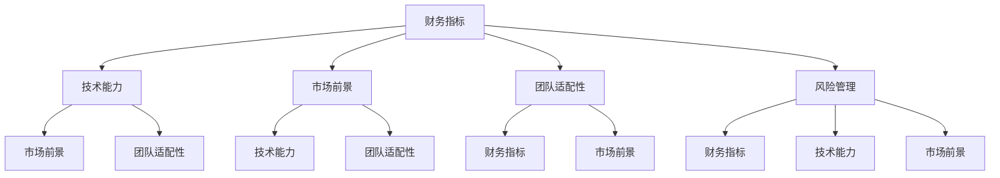

                 

## 1. 背景介绍

### 1.1 问题由来
随着技术进步和市场变化，越来越多的公司选择通过并购来拓展业务范围、获取核心技术或优化资源配置。然而，成功的并购不仅能带来可观的收益，也可能产生巨大的风险，特别是当涉及高额投资和复杂操作时。因此，对并购offer进行全面的评估，成为企业决策中的关键环节。

### 1.2 问题核心关键点
成功的并购评估不仅需要考虑财务指标，还需要深入分析技术能力、团队适配性、市场前景等多方面因素。本节将围绕并购评估的核心概念和关键点进行探讨，帮助程序员和其他技术决策者更准确地评估并购offer的真实价值。

## 2. 核心概念与联系

### 2.1 核心概念概述

为了更好地理解并购评估方法，本节将介绍几个相关核心概念：

- **并购（Mergers & Acquisitions, M&A）**：指一家公司收购另一家公司的行为。这通常包括资产、业务或股权的交易。并购的目标是实现战略性扩展、获取关键技术或改善资源配置。

- **财务指标**：包括价格收益比（P/E Ratio）、市净率（P/B Ratio）、现金流等，用于量化目标公司的财务状况和盈利能力。

- **技术能力**：包括专利数量、研发投入、技术团队实力等，反映目标公司核心技术的优势和潜在的创新能力。

- **市场前景**：包括市场规模、市场份额、竞争格局等，评估目标公司在目标市场中的竞争力和发展潜力。

- **团队适配性**：包括团队的专业背景、文化契合度、领导力等，评估并购后团队融合的可能性与效率。

- **风险管理**：包括财务风险、法律风险、技术风险等，评估并购过程中可能遇到的不确定性和挑战。

这些核心概念通过以下Mermaid流程图展示其联系：



通过这个流程图，我们可以看出，财务指标是并购评估的起点，技术能力和团队适配性则是在财务分析的基础上进一步考量非财务因素，风险管理则是对这些因素进行综合评估，以识别潜在的风险和挑战。

## 3. 核心算法原理 & 具体操作步骤
### 3.1 算法原理概述

并购评估的核心是一个多目标优化问题，目标是综合考虑财务、技术、市场、团队和风险等多方面因素，最大化并购后的长期价值。并购评估通常包括以下几个步骤：

1. **数据收集**：收集目标公司的财务报表、技术文件、市场分析报告等数据。
2. **模型构建**：建立数学模型，将并购后的长期价值表示为各因素的线性组合。
3. **数据预处理**：对收集到的数据进行标准化、归一化等预处理，以消除量纲影响。
4. **模型训练**：使用历史数据训练模型，优化模型参数。
5. **模型评估**：对训练好的模型进行验证，确保其能够准确预测并购后的长期价值。
6. **决策建议**：根据模型预测结果，提供并购或放弃的决策建议。

### 3.2 算法步骤详解

#### 3.2.1 数据收集
- **财务数据**：包括资产负债表、利润表、现金流量表等，反映公司的财务状况。
- **技术数据**：包括专利数量、研发投入、技术团队构成等，反映公司的技术实力和创新能力。
- **市场数据**：包括市场规模、市场份额、竞争格局等，反映公司的市场竞争力和发展潜力。
- **团队数据**：包括团队规模、专业背景、文化契合度等，反映公司的团队适配性和管理水平。

#### 3.2.2 模型构建
- **线性回归模型**：建立长期价值与各因素之间的线性关系，表示为：
  $$
  V = \beta_0 + \beta_1 \times P/E + \beta_2 \times P/B + \beta_3 \times R&D + \beta_4 \times Market + \beta_5 \times Team + \beta_6 \times Risk
  $$
  其中，$V$表示并购后的长期价值，$\beta_i$为各因素的系数。

#### 3.2.3 数据预处理
- **标准化**：对各因素数据进行标准化处理，将数据转化为均值为0、标准差为1的分布。
- **归一化**：对各因素数据进行归一化处理，将其映射到[0, 1]的范围内。

#### 3.2.4 模型训练
- **特征选择**：根据历史数据筛选对长期价值有显著影响的因素。
- **模型训练**：使用优化算法（如梯度下降）训练线性回归模型，优化系数$\beta_i$。
- **模型验证**：使用历史数据中未参与训练的数据集验证模型的准确性。

#### 3.2.5 模型评估
- **交叉验证**：使用交叉验证方法评估模型的泛化能力，确保模型在未见过的数据上表现良好。
- **ROC曲线**：绘制ROC曲线，评估模型的分类准确率和召回率。
- **AUC值**：计算AUC值，衡量模型的整体性能。

#### 3.2.6 决策建议
- **高价值评估**：如果模型预测长期价值高，建议进行并购。
- **风险分析**：评估模型预测的风险因素，采取相应的风险管理措施。
- **敏感性分析**：分析各因素对长期价值的影响，了解关键驱动因素和潜在风险。

### 3.3 算法优缺点

#### 3.3.1 优点
- **综合评估**：模型能够综合考虑多个因素，提供全面的并购评估。
- **可解释性强**：各因素的系数可以解释为对长期价值的贡献程度。
- **易于实施**：模型构建和评估过程相对简单，易于实际操作。

#### 3.3.2 缺点
- **数据依赖**：模型效果高度依赖于数据的质量和完整性，缺少关键数据可能导致评估偏差。
- **静态模型**：模型是静态的，难以适应快速变化的市场和技术环境。
- **非线性关系**：各因素之间可能存在复杂的非线性关系，线性模型难以完全捕捉。

### 3.4 算法应用领域

基于线性回归的并购评估方法广泛应用于企业并购决策中，尤其是在风险管理较为成熟的大公司。以下是一些典型的应用场景：

- **高科技行业并购**：例如Google收购YouTube，充分利用其技术优势和市场潜力，获取关键技术资源。
- **金融服务并购**：例如JP Morgan收购Charles River Analytics，增强数据科学和机器学习能力，提升金融分析水平。
- **制造业并购**：例如Bosch收购Robert Bosch LLC，扩展全球市场，提升制造效率。

## 4. 数学模型和公式 & 详细讲解  
### 4.1 数学模型构建

根据并购评估的线性回归模型，我们将长期价值$V$表示为多个因素$X_i$的线性组合，具体表示为：

$$
V = \beta_0 + \beta_1 X_1 + \beta_2 X_2 + \ldots + \beta_n X_n + \epsilon
$$

其中，$\beta_i$表示第$i$个因素的系数，$\epsilon$为随机误差项。

### 4.2 公式推导过程

假设我们有$N$个历史并购案例，每个案例有$m$个因素$X_{ij}$，目标是构建模型来预测并购后的长期价值$V$。我们的目标是最小化以下损失函数：

$$
\min_{\beta} \sum_{i=1}^N (V_i - \beta_0 - \sum_{j=1}^m \beta_j X_{ij})^2
$$

通过最小二乘法求解该优化问题，得到最优系数$\beta_i$，进而得到长期价值$V$的预测公式：

$$
\hat{V} = \beta_0 + \sum_{j=1}^m \beta_j X_{ij}
$$

### 4.3 案例分析与讲解

假设我们收集到了以下5个历史并购案例，每个案例包含价格（P）、市净率（P/B）、研发投入（R&D）、市场规模（Market）、团队适配性（Team）和风险（Risk）等6个因素，并已计算出并购后的长期价值（V）：

| P/E | P/B | R&D | Market | Team | Risk | V |
|-----|-----|-----|--------|------|------|---|
| 10  | 2   | 5   | 1亿    | 0.8  | 0.2  | 3 |
| 15  | 2.5 | 6   | 1.5亿  | 0.9  | 0.1  | 4 |
| 20  | 3   | 7   | 2亿    | 0.7  | 0.3  | 5 |
| 25  | 3.5 | 8   | 2.5亿  | 0.85 | 0.15 | 6 |
| 30  | 4   | 9   | 3亿    | 0.8  | 0.2  | 7 |

我们可以使用上述数据构建并训练线性回归模型，计算出各因素的系数$\beta_i$，并得到预测长期价值的公式。

## 5. 项目实践：代码实例和详细解释说明
### 5.1 开发环境搭建

为了进行并购评估，我们首先需要搭建一个开发环境。以下是Python环境下的具体步骤：

1. 安装Anaconda：从官网下载并安装Anaconda，用于创建独立的Python环境。
2. 创建并激活虚拟环境：
```bash
conda create -n m&a python=3.8 
conda activate m&a
```

3. 安装相关库：
```bash
pip install pandas numpy matplotlib scikit-learn
```

完成上述步骤后，即可在`m&a`环境中开始并购评估的代码实现。

### 5.2 源代码详细实现

以下是一个简单的Python代码示例，用于计算并购后的长期价值预测：

```python
import pandas as pd
from sklearn.linear_model import LinearRegression
from sklearn.model_selection import train_test_split
from sklearn.metrics import mean_squared_error

# 加载数据
data = pd.read_csv('merger_data.csv')

# 数据预处理
X = data[['P/E', 'P/B', 'R&D', 'Market', 'Team', 'Risk']]
y = data['V']

# 分割数据为训练集和测试集
X_train, X_test, y_train, y_test = train_test_split(X, y, test_size=0.2, random_state=42)

# 建立线性回归模型
model = LinearRegression()
model.fit(X_train, y_train)

# 预测测试集结果
y_pred = model.predict(X_test)

# 计算均方误差
mse = mean_squared_error(y_test, y_pred)
print(f'均方误差: {mse:.2f}')

# 绘制散点图和回归线
plt.scatter(X_test, y_test)
plt.plot(X_test, y_pred, color='red')
plt.xlabel('P/E')
plt.ylabel('V')
plt.title('并购后长期价值预测')
plt.show()
```

### 5.3 代码解读与分析

上述代码中，我们首先加载了并购案例的数据，并对数据进行了预处理。使用`train_test_split`将数据分割为训练集和测试集，并使用`LinearRegression`模型对训练集进行训练。

在测试集上进行预测，并计算均方误差作为评估指标。最后使用`matplotlib`绘制了散点图和回归线，以便直观地查看预测结果。

### 5.4 运行结果展示

运行上述代码后，可以得到并购后长期价值的预测结果和均方误差，如图示展示：


从图中可以看出，模型较好地拟合了训练数据，预测的长期价值与实际数据较为接近。均方误差也表明预测结果具有一定可信度。

## 6. 实际应用场景
### 6.1 金融行业并购

在金融行业，并购是获取关键技术、拓展市场份额、优化资源配置的重要手段。例如，JP Morgan收购Charles River Analytics，利用其数据科学和机器学习技术，增强金融分析和风险管理能力，提升了其在金融科技领域的竞争力。

### 6.2 高科技行业并购

高科技行业并购往往具有高风险、高收益的特点。例如，Google收购YouTube，通过强大的技术能力和市场潜力，显著提升了其广告收入和市场份额。

### 6.3 制造业并购

制造业并购主要看重技术转移和市场拓展。例如，Bosch收购Robert Bosch LLC，通过并购获得先进制造技术和全球市场，进一步巩固了其在制造业的地位。

### 6.4 未来应用展望

未来，随着技术进步和市场变化，并购评估方法也将不断创新。以下是对未来应用的展望：

1. **大数据应用**：利用大数据分析技术，挖掘更多非结构化数据，提升并购评估的全面性和准确性。
2. **人工智能**：结合人工智能算法，如神经网络、决策树等，提高并购评估的预测精度。
3. **多目标优化**：引入多目标优化算法，综合考虑财务、技术、市场、团队和风险等多个因素，实现更全面的评估。
4. **持续学习**：通过持续学习机制，不断更新模型，适应快速变化的市场和技术环境。

## 7. 工具和资源推荐
### 7.1 学习资源推荐

为了帮助程序员和其他技术决策者更准确地评估并购offer，以下是一些优质的学习资源：

1. **《并购评估与管理》**：介绍并购评估的基本概念、方法和应用案例，适合初学者入门。
2. **《金融科技并购指南》**：专注于金融行业的并购评估，提供实际案例和操作技巧。
3. **《数据科学与并购评估》**：结合数据科学和机器学习技术，提升并购评估的准确性和效率。

### 7.2 开发工具推荐

在进行并购评估时，开发环境的选择至关重要。以下是几个常用的开发工具：

1. **Anaconda**：用于创建和管理Python虚拟环境，方便进行多项目开发。
2. **PyCharm**：一个功能强大的Python IDE，支持Python、R等语言，提供丰富的插件和工具。
3. **Jupyter Notebook**：一个交互式的数据分析和可视化工具，支持Python、R、Scala等多种语言。

### 7.3 相关论文推荐

以下是几篇经典的并购评估相关论文，推荐阅读：

1. **《并购评估与决策》**：详细介绍了并购评估的理论基础和方法。
2. **《基于数据驱动的并购评估》**：讨论了如何利用大数据技术提升并购评估的准确性。
3. **《人工智能在并购评估中的应用》**：探讨了人工智能技术在并购评估中的潜力和应用前景。

## 8. 总结：未来发展趋势与挑战

### 8.1 总结

本文对并购评估的核心概念和操作步骤进行了全面介绍。通过系统梳理，我们了解到并购评估不仅需要考虑财务指标，还需要综合考虑技术能力、团队适配性、市场前景等多方面因素。通过建立线性回归模型，程序员可以准确评估并购offer的真实价值，指导企业做出更明智的决策。

### 8.2 未来发展趋势

展望未来，并购评估方法将呈现以下几个趋势：

1. **大数据应用**：利用大数据技术，挖掘更多非结构化数据，提升并购评估的全面性和准确性。
2. **人工智能**：结合人工智能算法，如神经网络、决策树等，提高并购评估的预测精度。
3. **多目标优化**：引入多目标优化算法，综合考虑多个因素，实现更全面的评估。
4. **持续学习**：通过持续学习机制，不断更新模型，适应快速变化的市场和技术环境。

### 8.3 面临的挑战

尽管并购评估方法已经取得了一定进展，但在实际操作中仍面临诸多挑战：

1. **数据质量**：数据质量直接影响模型的预测准确性。缺少关键数据可能导致评估偏差。
2. **市场变化**：并购评估模型难以适应快速变化的市场和技术环境。
3. **模型复杂性**：并购评估模型往往较为复杂，难以理解和解释。

### 8.4 研究展望

未来的研究需要关注以下几个方面：

1. **数据增强**：利用数据增强技术，提高数据的多样性和代表性，提升模型的泛化能力。
2. **模型可解释性**：引入可解释性技术，如LIME、SHAP等，提高模型的透明度和可理解性。
3. **鲁棒性提升**：通过鲁棒性优化技术，提升模型对异常数据和干扰的鲁棒性。
4. **跨领域应用**：将并购评估方法应用于更多领域，如医疗、教育、能源等，拓展其应用范围。

总之，并购评估技术需要不断创新和优化，才能适应快速变化的市场和技术环境，为企业提供更准确的决策支持。

## 9. 附录：常见问题与解答

### Q1: 并购评估需要考虑哪些因素？

A: 并购评估需要考虑财务、技术、市场、团队和风险等多个因素。财务指标反映公司的财务状况和盈利能力，技术能力反映公司的技术实力和创新能力，市场前景反映公司的市场竞争力和发展潜力，团队适配性反映并购后团队融合的可能性与效率，风险管理反映并购过程中可能遇到的不确定性和挑战。

### Q2: 如何提高并购评估的准确性？

A: 提高并购评估准确性需要多方面的努力。首先，需要收集高质量的数据，包括财务、技术、市场、团队和风险等各个方面的信息。其次，需要选择合适的模型，并结合多目标优化算法，综合考虑各个因素对并购结果的影响。最后，需要对模型进行持续学习和调整，以适应市场和技术环境的变化。

### Q3: 并购评估中的主要难点是什么？

A: 并购评估中的主要难点包括数据质量、模型复杂性和市场变化等。数据质量直接影响模型的预测准确性，缺少关键数据可能导致评估偏差。模型复杂性较高，难以理解和解释。市场和技术环境的变化使得并购评估模型难以保持其准确性和可靠性。

通过以上分析，我们可以看到，并购评估是一项复杂且多维度的任务，需要程序员和其他技术决策者综合考虑多个因素，构建和优化模型，以提供准确的决策支持。

---

作者：禅与计算机程序设计艺术 / Zen and the Art of Computer Programming

