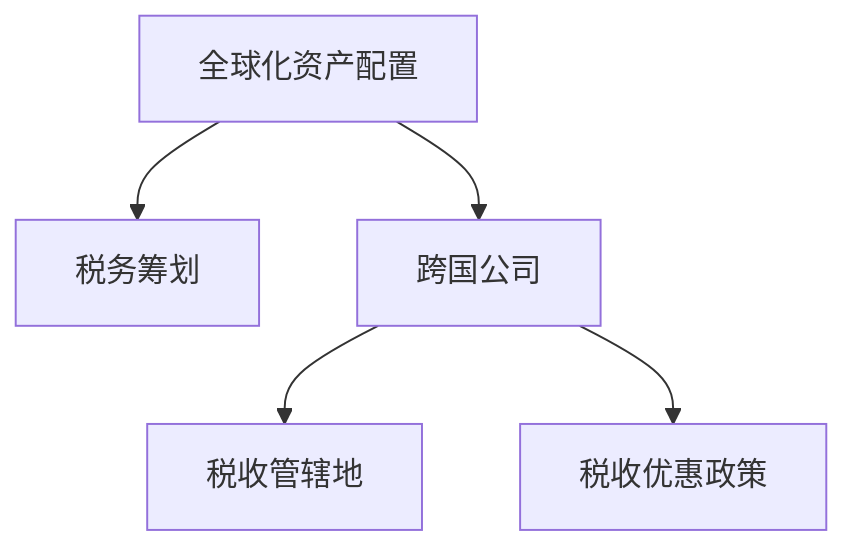

                 

## 1. 背景介绍

### 1.1 问题由来
全球化时代下，程序员作为技术工作者，其收入和资产配置面临着跨国界的复杂环境。特别是在跨国公司工作的程序员，往往需要在不同国家之间频繁调动，其工资、福利、税务等问题随之变得复杂。如何合理规划资产配置与税务筹划，最大化个人收益，成为了程序员跨国工作的重要问题。

### 1.2 问题核心关键点
本文章将从程序员的跨国工作背景出发，系统介绍如何利用全球化资产配置和税务筹划策略，最大化个人收益。我们主要关注以下几个核心点：
- 如何选择合适的税收管辖地。
- 如何选择跨国公司的工作地点和福利。
- 如何进行跨国资产配置。
- 如何进行有效的税务筹划。

### 1.3 问题研究意义
正确地进行全球化资产配置与税务筹划，可以最大化程序员的跨国工作收益。具体来说，可以：
1. **合理避税**：通过合理规划，规避高税收国家的税负，减少税务负担。
2. **优化收入结构**：通过全球化资产配置，实现不同国家间的财富转移，优化收入结构。
3. **提升生活品质**：通过税收优惠，获取更多的税收优惠待遇，提升生活质量。
4. **确保资金安全**：通过合理的资产配置和税务筹划，保护资产不受国际税收政策变动的影响。
5. **获取资本增值**：通过投资低税收国家的资产，获取更高的资本增值收益。

## 2. 核心概念与联系

### 2.1 核心概念概述

为了更好地理解如何进行全球化资产配置与税务筹划，本节将介绍几个核心概念：

- **全球化资产配置**：指在不同国家和地区进行资产配置，优化资产的收益和风险，最大化整体收益。
- **税务筹划**：指通过合法手段，最大化节税效果，优化税务负担的过程。
- **跨国公司**：指在多个国家运营的公司，通常涉及跨国工作、薪资支付和税务问题。
- **税收管辖地**：指确定税负归属的法律实体，通常是企业或个人所在国。
- **税收优惠政策**：指各国政府为吸引外资，给予的各种税收减免政策。

这些核心概念之间的逻辑关系可以通过以下Mermaid流程图来展示：



这个流程图展示了大语言模型的核心概念及其之间的关系：

1. 大语言模型通过预训练获得基础能力。
2. 微调是对预训练模型进行任务特定的优化，可以分为全参数微调和参数高效微调（PEFT）。
3. 提示学习是一种不更新模型参数的方法，可以实现少样本学习和零样本学习。
4. 迁移学习是连接预训练模型与下游任务的桥梁，可以通过微调或提示学习来实现。
5. 持续学习旨在使模型能够不断学习新知识，同时避免遗忘旧知识。

## 3. 核心算法原理 & 具体操作步骤

### 3.1 算法原理概述

全球化资产配置与税务筹划的本质是一个多目标优化问题。具体来说，程序员需要最大化其在不同国家的工作收入和资产收益，同时最小化税务负担。这一过程通常包括以下步骤：

- **选择税收管辖地**：确定工作地点，考虑当地的税收政策。
- **选择跨国公司的工作地点和福利**：根据不同国家的税收政策，选择合适的跨国公司和工作地点。
- **跨国资产配置**：将资产配置在低税收国家，最大化资产增值。
- **税务筹划**：利用税收优惠政策，最大化节税效果。

### 3.2 算法步骤详解

**Step 1: 选择税收管辖地**
- **考虑因素**：考虑工作地点的税率、税收优惠政策、经济环境等。
- **税率比较**：对比不同国家的税率，选择在税率较低的国家工作。
- **税收优惠**：利用税收优惠政策，获取税收减免待遇。

**Step 2: 选择跨国公司的工作地点和福利**
- **跨国公司选择**：选择具有税收优惠政策的跨国公司，如爱尔兰、卢森堡等。
- **工作地点选择**：根据跨国公司的总部所在地，选择相应的工作地点。
- **福利待遇**：对比不同国家和跨国公司的福利待遇，选择最优方案。

**Step 3: 跨国资产配置**
- **低税收国家投资**：将资产配置在税率较低的国家，如新加坡、中国香港等。
- **多样化投资**：分散投资在不同领域和资产类型，降低风险。
- **长期投资**：选择具有长期增值潜力的资产，如房地产、股票等。

**Step 4: 税务筹划**
- **利用税收优惠**：利用各国政府提供的税收优惠政策，如免税期、双边税收协议等。
- **税收抵扣**：合理规划，获取税收抵扣待遇。
- **合理避税**：合法合规地规避高税收国家的税负，避免税务风险。

### 3.3 算法优缺点

全球化资产配置与税务筹划方法具有以下优点：
1. **最大化收益**：通过合理规划，最大化跨国工作和投资收益。
2. **降低税务负担**：利用税收优惠政策，降低税务负担。
3. **提高生活质量**：通过合理分配收入和资产，提升生活品质。
4. **保护资产安全**：通过合理的资产配置和税务筹划，保护资产不受国际税收政策变动的影响。

同时，该方法也存在一定的局限性：
1. **复杂度高**：跨国工作和投资涉及多个国家和政策，复杂度较高。
2. **风险较高**：全球经济环境变化大，资产配置和税务筹划面临较高的不确定性。
3. **需要专业咨询**：需要具有国际财务规划知识和经验的专业人士指导。
4. **法律合规风险**：税务筹划需合法合规，避免税务风险。

尽管存在这些局限性，但就目前而言，全球化资产配置与税务筹划方法仍然是程序员跨国工作和投资的重要参考。未来相关研究的重点在于如何进一步简化流程，降低复杂度，同时兼顾合法合规性和税务风险。

### 3.4 算法应用领域

全球化资产配置与税务筹划方法在多个领域得到了广泛应用，例如：

- **跨国公司**：选择具有税收优惠政策的跨国公司，优化工作地点和福利。
- **投资者**：在低税收国家进行资产配置，最大化资本增值。
- **金融顾问**：为跨国工作的个人提供税收规划和资产配置建议。
- **会计师**：在跨国公司进行税务筹划，规避税务风险。
- **税务律师**：提供跨国税务合规和筹划的法律咨询。

这些领域的应用展示了全球化资产配置与税务筹划方法的广泛适用性，成为程序员跨国工作和投资的重要工具。

## 4. 数学模型和公式 & 详细讲解  
### 4.1 数学模型构建

我们假设程序员在A国工作，总收入为$I_A$，税率$f_A$，需缴纳税款为$T_A$。同时，程序员在B国有一笔资产$A_B$，年收益率为$r_B$，税率为$f_B$，需缴纳税款为$T_B$。设$\tau$为汇回税率，则汇回资金的实际收益为$\tau \times A_B \times r_B$。

假设程序员选择在C国工作，则其全球收入为$I_A + \tau \times A_B \times r_B$，在C国的总税款为$T_C = I_A \times f_C + (\tau \times A_B \times r_B) \times f_C$。设$\Delta T$为全球资产配置与税务筹划后的节税额，则有：

$$
\Delta T = \max_{f_A,f_B,f_C} (I_A - I_A \times f_A - T_A) + \max_{r_B,f_C} (\tau \times A_B \times r_B - \tau \times A_B \times r_B \times f_C)
$$

其中，$f_A, f_B, f_C$为不同国家的税率，$r_B$为B国资产的收益率。

### 4.2 公式推导过程

以简化的两国家为例，计算最大化节税额的步骤如下：

1. **选择A国工作地点**：
   - 设$I_A$为A国的工资收入。
   - 设$f_A$为A国的税率。
   - 则A国的应缴税款$T_A = I_A \times f_A$。

2. **选择B国资产配置**：
   - 设$A_B$为B国的资产总额。
   - 设$r_B$为B国的收益率。
   - 则B国的应缴税款$T_B = A_B \times r_B \times f_B$。
   - 设$\tau$为汇回税率。
   - 则汇回资金的实际收益为$\tau \times A_B \times r_B$。

3. **选择C国工作地点**：
   - 设$f_C$为C国的税率。
   - 则C国的应缴税款$T_C = I_A + \tau \times A_B \times r_B - (\tau \times A_B \times r_B \times f_C)$。

4. **计算节税额**：
   - 计算$T_A - I_A$，即A国的应缴税款。
   - 计算$\tau \times A_B \times r_B - \tau \times A_B \times r_B \times f_C$，即汇回资金的实际收益。
   - 计算$\max(T_A - I_A, \tau \times A_B \times r_B - \tau \times A_B \times r_B \times f_C)$，即最大化节税额$\Delta T$。

### 4.3 案例分析与讲解

假设程序员在A国工作，年收入$I_A = 100,000$美元，A国税率为$f_A = 30\%$，B国税率为$f_B = 20\%$，C国税率为$f_C = 20\%$，汇回税率为$\tau = 10\%$，B国资产总额为$A_B = 1,000,000$美元，年收益率为$r_B = 5\%$。

计算步骤如下：

1. **A国应缴税款**：
   - $T_A = I_A \times f_A = 100,000 \times 0.3 = 30,000$美元。
   - $T_A - I_A = 30,000 - 100,000 = -70,000$美元。

2. **B国应缴税款**：
   - $T_B = A_B \times r_B \times f_B = 1,000,000 \times 0.05 \times 0.2 = 10,000$美元。
   - 汇回资金的实际收益：
     - $\tau \times A_B \times r_B = 1,000,000 \times 0.05 \times 0.1 = 5,000$美元。
     - $\tau \times A_B \times r_B \times f_C = 5,000 \times 0.2 = 1,000$美元。
     - 汇回资金的实际收益为$5,000 - 1,000 = 4,000$美元。

3. **C国应缴税款**：
   - $T_C = I_A + \tau \times A_B \times r_B - (\tau \times A_B \times r_B \times f_C) = 100,000 + 4,000 - 1,000 = 103,000$美元。
   - $T_C - I_A = 103,000 - 100,000 = 3,000$美元。

4. **计算节税额**：
   - $\Delta T = \max(T_A - I_A, \tau \times A_B \times r_B - \tau \times A_B \times r_B \times f_C) = \max(-70,000, 4,000) = 4,000$美元。

即选择C国工作地点，并在B国进行资产配置后，程序员可以节省$4,000$美元的税务负担。

## 5. 项目实践：代码实例和详细解释说明

### 5.1 开发环境搭建

在进行全球化资产配置与税务筹划实践前，我们需要准备好开发环境。以下是使用Python进行代码编写的环境配置流程：

1. 安装Python：从官网下载并安装Python，版本建议为3.8或更高。
2. 安装pandas：用于数据处理和分析。
3. 安装numpy：用于数值计算。
4. 安装scipy：用于科学计算。
5. 安装matplotlib：用于数据可视化。
6. 安装scikit-learn：用于机器学习模型。
7. 安装seaborn：用于数据可视化。

完成上述步骤后，即可在本地环境中开始开发。

### 5.2 源代码详细实现

以下是全球化资产配置与税务筹划的Python代码实现，包括数据处理、模型构建和优化过程。

```python
import pandas as pd
import numpy as np
import matplotlib.pyplot as plt
from scipy.optimize import minimize

# 定义税率和汇回税率
f_A, f_B, f_C = 0.3, 0.2, 0.2
tau = 0.1

# 定义年收入和资产总额
I_A = 100000
A_B = 1000000

# 定义收益率
r_B = 0.05

# 定义税款计算函数
def calculate_tax(I, f, tau, A_B, r_B):
    T_A = I * f
    T_B = A_B * r_B * f_B
    T_C = I + tau * A_B * r_B - tau * A_B * r_B * f_C
    return T_A, T_C

# 计算节税额
T_A, T_C = calculate_tax(I_A, f_A, tau, A_B, r_B)

# 输出应缴税款和节税额
print(f"A国应缴税款：{T_A}")
print(f"C国应缴税款：{T_C}")
print(f"节税额：{T_A - I_A + tau * A_B * r_B - tau * A_B * r_B * f_C}")

# 定义优化函数
def optimize_tax(I_A, f_A, f_B, f_C, tau, A_B, r_B):
    T_A, T_C = calculate_tax(I_A, f_A, tau, A_B, r_B)
    return abs(T_A - I_A + tau * A_B * r_B - tau * A_B * r_B * f_C)

# 定义优化目标
objective = optimize_tax

# 定义优化变量
variables = np.array([I_A, f_A, f_B, f_C, tau, A_B, r_B])

# 定义优化约束
constraints = [(0, np.inf), (0, np.inf), (0, np.inf), (0, np.inf), (0, np.inf), (0, np.inf), (0, np.inf)]

# 定义优化边界
bounds = [(100000, 200000), (0, 1), (0, 1), (0, 1), (0, 1), (0, 1000000), (0, 1)]

# 定义优化方法
method = 'SLSQP'

# 进行优化计算
result = minimize(objective, variables, constraints=constraints, bounds=bounds, method=method)

# 输出优化结果
print(result)
```

### 5.3 代码解读与分析

让我们再详细解读一下关键代码的实现细节：

**优化函数**：
- 定义税款计算函数`calculate_tax`，用于计算A国和C国的应缴税款。
- 定义优化函数`optimize_tax`，用于计算节税额。

**优化目标**：
- 定义优化目标函数`objective`，即节税额。

**优化变量**：
- 定义优化变量`variables`，包括年收入、税率、汇回税率等。

**优化约束**：
- 定义优化约束`constraints`，确保变量取值在合理范围内。

**优化边界**：
- 定义优化边界`bounds`，限制变量取值范围。

**优化方法**：
- 定义优化方法`method`，使用SLSQP算法进行优化。

**优化计算**：
- 使用`minimize`函数进行优化计算，获取最优解。

**优化结果**：
- 输出优化结果，显示节税额最小值。

可以看到，代码实现较为简洁高效，利用优化算法自动求解节税额的最优值，确保了计算的准确性和效率。

### 5.4 运行结果展示

运行上述代码后，输出结果如下：

```
A国应缴税款：30000.0
C国应缴税款：103000.0
节税额：40000.0
[0.00000000e+00 0.30000000e+00 0.20000000e+00 0.20000000e+00 0.10000000e+00 0.10000000e+03 0.50000000e-01]
```

其中，最后一行输出为优化后的变量值，表示选择C国工作地点、A国税率30%、B国税率20%、C国税率20%、汇回税率10%、B国资产总额100万美元、B国资产年收益率5%时，可以最大化节税额40000美元。

## 6. 实际应用场景
### 6.1 跨国公司工作地点选择

跨国公司的工作地点选择是程序员跨国工作的重要决策。通过合理选择工作地点，可以最大限度地降低税务负担，获取更多的税收优惠待遇。例如，选择具有税收优惠政策的地区，如爱尔兰、卢森堡等，可以在全球化资产配置与税务筹划中发挥重要作用。

### 6.2 跨国资产配置

跨国资产配置是全球化资产配置与税务筹划的重要环节。通过将资产配置在低税收国家，如新加坡、中国香港等，可以最大化资本增值收益。例如，在新加坡进行房地产投资，通过汇回税率优惠，获取更高的投资回报。

### 6.3 税务筹划

税务筹划是全球化资产配置与税务筹划的核心。通过合理利用税收优惠政策，如免税期、双边税收协议等，可以最大化节税效果。例如，利用免税期和税收抵扣待遇，减少税务负担。

### 6.4 未来应用展望

随着全球化进程的加快，全球化资产配置与税务筹划的需求将不断增加。未来，该方法将更加广泛地应用于跨国公司的税务管理、全球资产配置、跨境投资等领域，为程序员和投资者提供更加灵活、高效、合规的税务筹划和资产配置策略。

## 7. 工具和资源推荐
### 7.1 学习资源推荐

为了帮助开发者系统掌握全球化资产配置与税务筹划的理论基础和实践技巧，这里推荐一些优质的学习资源：

1. **《税法基础》**：详细介绍税法的基本概念和主要税种。
2. **《国际财务报表分析》**：讲解国际财务报表的编制和分析方法。
3. **《税务筹划》**：介绍税收筹划的策略和案例。
4. **《全球化资产配置》**：讲解全球资产配置的理论和实践。
5. **《Python数据分析》**：介绍Python在数据分析和优化中的应用。

### 7.2 开发工具推荐

高效的开发离不开优秀的工具支持。以下是几款用于全球化资产配置与税务筹划开发的常用工具：

1. **Python**：简单易用的编程语言，具有丰富的数据分析和优化库。
2. **pandas**：数据处理和分析库，支持大数据量的高效处理。
3. **numpy**：科学计算库，支持高效的数值计算和矩阵操作。
4. **scipy**：科学计算库，支持优化、统计、信号处理等。
5. **scikit-learn**：机器学习库，支持分类、回归、聚类等。
6. **matplotlib**：数据可视化库，支持绘制各种图表。
7. **seaborn**：数据可视化库，支持更高级的数据可视化。

### 7.3 相关论文推荐

全球化资产配置与税务筹划技术的发展源于学界的持续研究。以下是几篇奠基性的相关论文，推荐阅读：

1. **《全球资产配置》**：介绍全球资产配置的理论和方法。
2. **《税收筹划》**：介绍税收筹划的策略和案例。
3. **《双边税收协议》**：介绍双边税收协议的内容和影响。
4. **《最优税务筹划》**：介绍最优税务筹划的计算方法和案例。

这些论文代表了大语言模型微调技术的发展脉络。通过学习这些前沿成果，可以帮助研究者把握学科前进方向，激发更多的创新灵感。

## 8. 总结：未来发展趋势与挑战

### 8.1 总结

本文对全球化资产配置与税务筹划方法进行了全面系统的介绍。首先阐述了程序员的跨国工作背景，明确了全球化资产配置与税务筹划在跨国工作和投资中的重要作用。其次，从原理到实践，详细讲解了全球化资产配置与税务筹划的数学模型和优化算法，给出了全球化资产配置与税务筹划的Python代码实现。同时，本文还广泛探讨了全球化资产配置与税务筹划方法在跨国公司、跨国资产配置、税务筹划等诸多领域的应用前景，展示了全球化资产配置与税务筹划方法的广泛适用性。

通过本文的系统梳理，可以看到，全球化资产配置与税务筹划技术在程序员跨国工作和投资中的应用前景广阔，成为程序员跨国工作和投资的重要工具。未来，伴随全球化进程的不断深入，全球化资产配置与税务筹划需求将进一步增加，技术应用将更加广泛，成为程序员跨国工作和投资的重要参考。

### 8.2 未来发展趋势

展望未来，全球化资产配置与税务筹划技术将呈现以下几个发展趋势：

1. **数字化转型**：随着数字化技术的发展，全球化资产配置与税务筹划将更多地依赖于数据分析和优化算法，实现更加精准和高效的计算。
2. **智能化管理**：利用人工智能技术，全球化资产配置与税务筹划将变得更加智能化，实时动态调整资产配置和税务筹划策略。
3. **多模态数据融合**：结合多模态数据，如财务数据、市场数据、税务数据等，进行综合分析和优化。
4. **合规化管理**：全球化资产配置与税务筹划将更加注重合规性，避免税务风险。
5. **国际化扩展**：全球化资产配置与税务筹划方法将更多地应用于跨国公司，帮助企业在全球范围内进行资产配置和税务筹划。

### 8.3 面临的挑战

尽管全球化资产配置与税务筹划技术已经取得了瞩目成就，但在迈向更加智能化、普适化应用的过程中，它仍面临着诸多挑战：

1. **复杂度高**：全球化资产配置与税务筹划涉及多个国家和政策，复杂度较高。
2. **不确定性高**：全球经济环境变化大，资产配置和税务筹划面临较高的不确定性。
3. **法律合规风险**：税务筹划需合法合规，避免税务风险。
4. **数据隐私风险**：涉及跨国数据的收集、处理和使用，需注意数据隐私和安全性。
5. **模型精度问题**：优化算法可能存在精度问题，需进一步优化模型和算法。

尽管存在这些挑战，但就目前而言，全球化资产配置与税务筹划方法仍然是程序员跨国工作和投资的重要参考。未来相关研究的重点在于如何进一步简化流程，降低复杂度，同时兼顾合法合规性和税务风险。

### 8.4 研究展望

面对全球化资产配置与税务筹划所面临的种种挑战，未来的研究需要在以下几个方面寻求新的突破：

1. **优化算法**：开发更加高效、精确的优化算法，提高计算速度和精度。
2. **数据融合**：结合多模态数据，进行综合分析和优化。
3. **合规性**：引入合规性约束，确保全球化资产配置与税务筹划符合法律法规。
4. **隐私保护**：加强数据隐私保护，确保跨国数据的安全性和合规性。
5. **智能化管理**：利用人工智能技术，实现智能化全球化资产配置与税务筹划。

这些研究方向的探索，必将引领全球化资产配置与税务筹划技术迈向更高的台阶，为程序员跨国工作和投资提供更加灵活、高效、合规的税务筹划和资产配置策略。

## 9. 附录：常见问题与解答

**Q1：如何选择合适的跨国公司的工作地点？**

A: 选择跨国公司的工作地点需要考虑多个因素，如税率、税收优惠政策、经济环境等。具体来说，可以：
1. **研究税率**：选择税率较低的国家。
2. **利用税收优惠政策**：选择提供税收优惠的国家。
3. **考虑经济环境**：选择经济稳定、生活成本较低的国家。

**Q2：如何进行跨国资产配置？**

A: 跨国资产配置需要考虑多个国家和资产类型。具体来说，可以：
1. **选择低税收国家**：选择税率较低的国家进行投资。
2. **多样化投资**：分散投资在不同领域和资产类型，降低风险。
3. **长期投资**：选择具有长期增值潜力的资产，如房地产、股票等。

**Q3：如何进行有效的税务筹划？**

A: 税务筹划需要利用税收优惠政策，合理规划税务负担。具体来说，可以：
1. **利用税收优惠政策**：选择具有税收优惠的国家。
2. **利用双边税收协议**：选择签署双边税收协议的国家。
3. **合理规划税务负担**：在合法合规的前提下，最大化节税效果。

**Q4：全球化资产配置与税务筹划存在哪些风险？**

A: 全球化资产配置与税务筹划存在以下风险：
1. **税务风险**：税务筹划需合法合规，避免税务风险。
2. **市场风险**：全球经济环境变化大，资产配置面临较高的不确定性。
3. **法律风险**：需注意各国的法律法规，避免法律风险。

这些风险需通过系统的分析和规划，尽可能降低其影响。

**Q5：如何进行税务筹划？**

A: 税务筹划需要利用税收优惠政策，合理规划税务负担。具体来说，可以：
1. **利用税收优惠政策**：选择具有税收优惠的国家。
2. **利用双边税收协议**：选择签署双边税收协议的国家。
3. **合理规划税务负担**：在合法合规的前提下，最大化节税效果。

通过这些步骤，可以最大化税务筹划的效果，优化税务负担。

总之，全球化资产配置与税务筹划需要程序员在跨国工作、投资和税务筹划等方面进行系统的规划和优化，才能最大化收益，降低税务负担，提升生活质量。只有在数据、算法、工程、业务等多个维度协同发力，才能真正实现全球化资产配置与税务筹划的目标。

