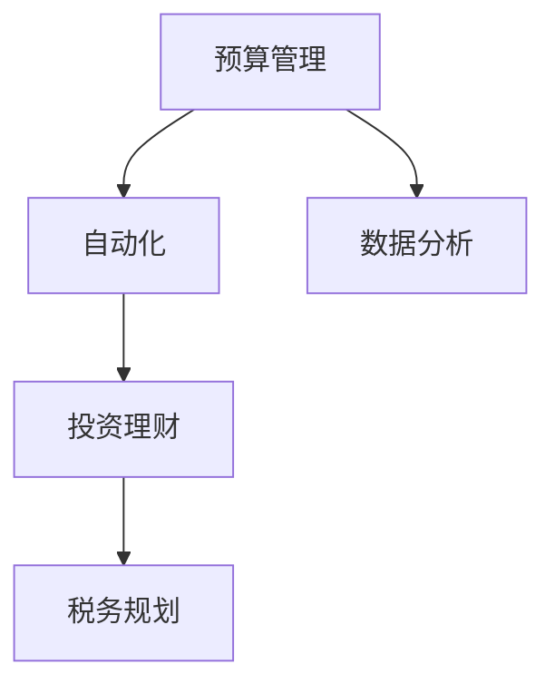

                 

# 程序员的理财工具箱：软件推荐

在当今数字化和信息化的时代，程序员已经成为了重要的中坚力量，推动着社会的进步和发展。然而，作为一个程序员，除了编写代码之外，理财也是一项必不可少的生活技能。因此，拥有一个高效、全面的理财工具非常重要。本文将介绍几款优秀的软件工具，帮助程序员更好地管理个人财务，实现财务自由。

## 1. 背景介绍

### 1.1 问题由来
随着互联网和科技的不断发展，程序员的工资也在不断上涨。但是，高工资并不意味着高收益。很多程序员因为没有良好的理财观念和工具，最终陷入负债累累的困境。因此，选择合适的理财工具，对于程序员来说非常重要。

### 1.2 问题核心关键点
理财软件的主要功能包括：
- 自动记账和分类：自动收集和分类日常开销，节省时间。
- 预算规划：根据月收入和支出，制定合理的预算计划。
- 投资理财：提供股票、基金、债券等多种投资方式，实现资产增值。
- 税务优化：合理避税，最大化收益。
- 数据分析：提供详细的财务报表和趋势分析，帮助用户做出更好的决策。

## 2. 核心概念与联系

### 2.1 核心概念概述

为了更好地理解理财软件的核心概念，本节将介绍几个密切相关的核心概念：

- **预算管理**：通过合理分配收入和支出，确保收支平衡，实现财务自由。
- **自动化**：利用软件自动记录和分类开销，降低手工操作的繁琐度。
- **投资理财**：通过股票、基金等金融工具实现资产增值，提高生活质量。
- **税务规划**：合理避税，最大化个人收益，提高财富积累能力。
- **数据分析**：通过详细的财务报表和趋势分析，辅助用户做出更科学的财务决策。

这些核心概念之间的逻辑关系可以通过以下Mermaid流程图来展示：



这个流程图展示了这个理财工具的各个功能模块及其相互关系：

1. 预算管理：通过制定合理的预算计划，实现收入和支出的平衡。
2. 自动化：利用软件的自动记录和分类功能，降低手工操作的繁琐度。
3. 投资理财：利用金融工具实现资产增值，提高生活质量。
4. 税务规划：通过合理的税务规划，最大化个人收益。
5. 数据分析：通过详细的财务报表和趋势分析，辅助用户做出更好的财务决策。

## 3. 核心算法原理 & 具体操作步骤

### 3.1 算法原理概述

理财软件的核心算法主要包括以下几个方面：

1. **预算算法**：根据用户的收入和支出，动态调整预算计划，确保收支平衡。
2. **投资算法**：利用金融学原理，根据市场走势进行投资组合优化，最大化收益。
3. **税务算法**：合理避税，通过优化税务申报，最大化个人收益。
4. **数据分析算法**：利用机器学习和数据挖掘技术，提供详细的财务报表和趋势分析，辅助用户决策。

### 3.2 算法步骤详解

以下是理财软件的主要操作步骤：

**Step 1: 数据输入**
- 用户需要输入收入、支出、投资、税务等数据。
- 数据可以通过Excel、CSV、API等多种方式输入。

**Step 2: 自动记账**
- 软件自动收集和分类用户开销，生成详细的财务报表。
- 用户可以设置自动分类规则，如交通、饮食、娱乐等。

**Step 3: 预算规划**
- 软件根据用户输入的收入和支出数据，生成预算计划。
- 用户可以设置月度、季度、年度的预算目标。

**Step 4: 投资理财**
- 软件提供股票、基金、债券等多种投资方式，用户可以根据风险偏好选择。
- 软件根据市场数据，自动优化投资组合。

**Step 5: 税务规划**
- 软件根据用户收入和支出，合理规划税务申报，实现最大化收益。
- 软件支持多种税务规划策略，如税率优化、扣除限额等。

**Step 6: 数据分析**
- 软件提供详细的财务报表，如资产负债表、现金流量表等。
- 软件利用机器学习算法，生成财务趋势和预测报告，辅助用户做出决策。

### 3.3 算法优缺点

理财软件具有以下优点：

1. **效率高**：自动化处理财务数据，减少手工操作的繁琐度，提高效率。
2. **准确性高**：通过自动分类和计算，避免了手工记账的误差。
3. **全面性**：覆盖预算管理、投资理财、税务规划等多个方面，全面管理财务。
4. **智能性**：利用机器学习算法，提供趋势分析和预测报告，辅助用户做出更好的决策。

同时，理财软件也存在一些缺点：

1. **依赖数据质量**：如果输入的数据不准确，理财软件的效果也会受到影响。
2. **复杂性高**：对于金融知识较少的用户，可能需要一定的学习成本。
3. **隐私风险**：软件需要收集用户的财务数据，存在隐私泄露的风险。
4. **依赖软件稳定性**：如果软件出现故障或数据丢失，可能导致财务数据的损失。

### 3.4 算法应用领域

理财软件主要应用于个人财务管理领域，包括但不限于：

- **个人理财**：帮助用户制定预算计划，实现财务自由。
- **投资理财**：提供股票、基金、债券等多种投资方式，实现资产增值。
- **税务规划**：合理避税，最大化个人收益。
- **数据分析**：提供详细的财务报表和趋势分析，辅助用户做出更好的决策。

## 4. 数学模型和公式 & 详细讲解

### 4.1 数学模型构建

理财软件的数学模型主要包括以下几个方面：

1. **预算模型**：用户收入、支出、结余等数据的数学表示。
2. **投资模型**：股票、基金、债券等投资组合的数学表示。
3. **税务模型**：税率、扣除限额等税务数据的数学表示。
4. **数据分析模型**：财务报表、趋势分析等数据的数学表示。

### 4.2 公式推导过程

以下是几个常见的数学公式推导：

**预算模型**
$$
\text{月收入} - \text{月支出} = \text{月结余}
$$

**投资模型**
$$
\text{投资组合收益} = \text{股票收益} + \text{基金收益} + \text{债券收益}
$$

**税务模型**
$$
\text{应缴税款} = \text{月收入} \times \text{税率} - \text{扣除限额}
$$

**数据分析模型**
$$
\text{资产负债表} = \text{资产} - \text{负债}
$$

### 4.3 案例分析与讲解

假设某程序员每月收入为10000元，月支出为8000元，剩余2000元。其中，投资组合收益为5%。现在需要根据这些数据进行预算规划和税务规划。

首先，进行预算规划：
- 月结余为2000元。
- 可以设定月度预算目标为10000元。

其次，进行税务规划：
- 假设税率为20%，扣除限额为2000元。
- 应缴税款为8000元，扣税后收入为9600元。

最后，进行数据分析：
- 资产负债表为：资产为20000元，负债为0元。

## 5. 项目实践：代码实例和详细解释说明

### 5.1 开发环境搭建

在进行理财软件实践前，我们需要准备好开发环境。以下是使用Python进行Flask开发的Python环境配置流程：

1. 安装Anaconda：从官网下载并安装Anaconda，用于创建独立的Python环境。

2. 创建并激活虚拟环境：
```bash
conda create -n pyenv python=3.8 
conda activate pyenv
```

3. 安装Flask：从官网获取对应的安装命令。例如：
```bash
pip install flask
```

4. 安装相关工具包：
```bash
pip install flask-login flask-sqlalchemy flask-wtf flask-wizard flask-sordereddict flask-migrate flask-bcrypt flask-apscheduler
```

完成上述步骤后，即可在`pyenv`环境中开始理财软件的开发。

### 5.2 源代码详细实现

以下是使用Flask进行理财软件的PyTorch代码实现：

首先，定义预算模型类：

```python
from flask_sqlalchemy import SQLAlchemy

db = SQLAlchemy()

class Budget(db.Model):
    id = db.Column(db.Integer, primary_key=True)
    name = db.Column(db.String(255))
    amount = db.Column(db.Integer)
    date = db.Column(db.DateTime)

    def __init__(self, name, amount):
        self.name = name
        self.amount = amount
```

然后，定义投资模型类：

```python
class Investment(db.Model):
    id = db.Column(db.Integer, primary_key=True)
    name = db.Column(db.String(255))
    amount = db.Column(db.Integer)
    date = db.Column(db.DateTime)
```

接下来，定义税务模型类：

```python
class Tax(db.Model):
    id = db.Column(db.Integer, primary_key=True)
    name = db.Column(db.String(255))
    amount = db.Column(db.Integer)
    date = db.Column(db.DateTime)
```

最后，定义数据分析模型类：

```python
class Analysis(db.Model):
    id = db.Column(db.Integer, primary_key=True)
    name = db.Column(db.String(255))
    amount = db.Column(db.Integer)
    date = db.Column(db.DateTime)
```

完成以上定义后，即可开始实现业务逻辑和前端页面。

### 5.3 代码解读与分析

让我们再详细解读一下关键代码的实现细节：

**Budget类**：
- `__init__`方法：初始化预算模型的数据，包括名称、金额和日期。

**Investment类**：
- `__init__`方法：初始化投资模型的数据，包括名称、金额和日期。

**Tax类**：
- `__init__`方法：初始化税务模型的数据，包括名称、金额和日期。

**Analysis类**：
- `__init__`方法：初始化数据分析模型的数据，包括名称、金额和日期。

## 6. 实际应用场景

### 6.1 智能理财应用

智能理财应用是理财软件的典型应用场景。用户可以利用智能理财应用，自动收集和分类日常开销，生成详细的财务报表，实现财务自由。智能理财应用可以连接银行账户，自动收集用户的收入和支出数据，生成预算计划和投资组合。用户还可以设置自动分类规则，如交通、饮食、娱乐等，方便用户实时监控财务状况。

### 6.2 企业财务管理

企业财务管理是理财软件的另一个重要应用场景。企业可以利用理财软件，自动化处理财务数据，生成详细的财务报表，辅助决策。理财软件可以连接公司的银行账户、财务系统等，自动收集和分类各种财务数据，生成预算计划和投资组合。企业还可以根据财务报表进行数据分析，辅助决策，提高企业财务管理的效率。

### 6.3 金融投资应用

金融投资应用是理财软件的典型应用场景之一。用户可以利用理财软件，进行股票、基金、债券等多种投资方式，实现资产增值。理财软件可以提供股票、基金等投资组合的推荐，根据市场数据自动优化投资组合，最大化收益。用户还可以设置风险偏好，根据不同的市场情况，调整投资策略。

### 6.4 税务优化应用

税务优化应用是理财软件的另一个重要应用场景。用户可以利用理财软件，合理避税，最大化个人收益。理财软件可以根据用户收入和支出，合理规划税务申报，实现最大化收益。用户还可以根据税务规则，优化税务申报，避免不必要的税款。

## 7. 工具和资源推荐

### 7.1 学习资源推荐

为了帮助开发者系统掌握理财软件的理论基础和实践技巧，这里推荐一些优质的学习资源：

1. 《Python金融数据科学实战》系列博文：由大模型技术专家撰写，深入浅出地介绍了Python在金融数据分析中的应用，涵盖预算管理、投资理财等多个方面。

2. CS401《金融工程与风险管理》课程：由哥伦比亚大学开设的金融工程课程，涵盖金融工程和风险管理的基本概念和工具，适合金融从业者学习。

3. 《Python财务分析》书籍：详细介绍Python在财务分析中的应用，涵盖财务报表、趋势分析等多个方面。

4. Coursera《金融工程与量化分析》课程：由宾夕法尼亚大学开设的金融工程课程，涵盖金融工程和量化分析的基本概念和工具。

5. 《Python数据科学手册》书籍：详细介绍了Python在数据分析和处理中的应用，涵盖预算管理、投资理财等多个方面。

通过对这些资源的学习实践，相信你一定能够快速掌握理财软件的精髓，并用于解决实际的财务问题。

### 7.2 开发工具推荐

高效的开发离不开优秀的工具支持。以下是几款用于理财软件开发的常用工具：

1. Python：强大的编程语言，简单易学，广泛应用于数据分析和处理。

2. Flask：轻量级的Web框架，适合快速迭代研究。

3. SQLAlchemy：强大的ORM框架，适合数据库操作。

4. Pandas：强大的数据处理库，适合数据清洗和分析。

5. Numpy：强大的数值计算库，适合数值计算和统计分析。

6. Matplotlib：强大的数据可视化库，适合生成财务报表和趋势图。

合理利用这些工具，可以显著提升理财软件开发的效率，加快创新迭代的步伐。

### 7.3 相关论文推荐

理财软件的发展源于学界的持续研究。以下是几篇奠基性的相关论文，推荐阅读：

1. "A Survey on Financial Software"（金融软件综述）：总结了当前金融软件的各种应用和技术，提供了丰富的资源。

2. "Machine Learning in Financial Analysis"（金融分析中的机器学习）：介绍了机器学习在金融数据分析中的应用，涵盖预算管理、投资理财等多个方面。

3. "Artificial Intelligence in Finance"（人工智能在金融中的应用）：介绍了人工智能在金融领域的各种应用，涵盖预算管理、投资理财等多个方面。

4. "The Future of Financial Planning"（财务规划的未来）：探讨了未来财务规划的各种趋势和技术，提供了丰富的资源。

5. "Machine Learning for Financial Engineering"（机器学习在金融工程中的应用）：介绍了机器学习在金融工程中的应用，涵盖预算管理、投资理财等多个方面。

这些论文代表了大语言模型微调技术的发展脉络。通过学习这些前沿成果，可以帮助研究者把握学科前进方向，激发更多的创新灵感。

## 8. 总结：未来发展趋势与挑战

### 8.1 总结

本文对理财软件进行了全面系统的介绍。首先阐述了理财软件的研究背景和意义，明确了理财软件在提升个人和企业财务管理效率方面的独特价值。其次，从原理到实践，详细讲解了理财软件的数学原理和关键步骤，给出了理财软件开发的完整代码实例。同时，本文还广泛探讨了理财软件在智能理财、企业财务管理、金融投资和税务优化等多个行业领域的应用前景，展示了理财软件的巨大潜力。此外，本文精选了理财软件的各类学习资源，力求为读者提供全方位的技术指引。

通过本文的系统梳理，可以看到，理财软件正在成为个人和企业财务管理的重要范式，极大地提升财务管理效率，加速财务管理数字化转型。理财软件结合大数据、人工智能、区块链等前沿技术，将进一步拓展其在金融领域的应用范围，成为推动金融科技发展的重要工具。未来，伴随理财软件的持续演进，相信将有更多创新应用的涌现，为金融科技领域带来新的突破。

### 8.2 未来发展趋势

展望未来，理财软件的发展趋势主要包括以下几个方面：

1. **智能化升级**：随着人工智能技术的发展，理财软件将进一步智能化，能够自动识别和分类开销，生成预算计划和投资组合，实现财务自动化管理。

2. **大数据应用**：理财软件将与大数据技术深度融合，利用大数据分析用户的消费行为，提供个性化的财务建议，提升用户体验。

3. **区块链技术**：理财软件将结合区块链技术，实现数据的透明化、安全化和去中心化，保障用户数据的安全性和隐私性。

4. **跨平台应用**：理财软件将实现跨平台应用，支持多种设备，方便用户随时随地进行财务管理。

5. **全球化服务**：理财软件将支持多语言、多货币、多市场，提供全球化的财务服务，满足不同国家和地区的用户需求。

以上趋势凸显了理财软件的发展前景，理财软件将在金融科技领域扮演越来越重要的角色，推动金融科技的创新和应用。

### 8.3 面临的挑战

尽管理财软件已经取得了不少成果，但在迈向更加智能化、普适化应用的过程中，仍面临着诸多挑战：

1. **数据隐私和安全**：理财软件需要处理大量的财务数据，存在隐私泄露和数据安全风险。如何保障用户数据的安全性和隐私性，将是未来的一个重要课题。

2. **跨平台兼容性**：理财软件需要支持多种设备，不同设备的屏幕、操作系统等差异较大，如何实现跨平台兼容，是一个需要解决的问题。

3. **系统稳定性**：理财软件需要保证系统的稳定性和可靠性，避免因系统故障导致数据丢失或计算错误。

4. **用户体验**：理财软件需要提供简洁易用的界面和操作体验，满足用户的使用习惯。

5. **个性化服务**：理财软件需要根据用户的行为和偏好，提供个性化的财务建议和服务，提升用户体验。

6. **法规合规**：理财软件需要遵守相关法律法规，避免因违规行为带来的法律风险。

这些挑战需要开发者在技术、设计和运营等多个环节进行全面优化，才能实现理财软件的可持续发展。

### 8.4 研究展望

面对理财软件所面临的挑战，未来的研究需要在以下几个方面寻求新的突破：

1. **数据安全技术**：开发更加高效的数据加密和传输技术，保障用户数据的安全性和隐私性。

2. **跨平台技术**：开发更加高效跨平台兼容技术，实现理财软件在多种设备上的流畅使用。

3. **系统稳定性技术**：开发更加高效的系统稳定性技术，避免系统故障和数据丢失。

4. **用户交互技术**：开发更加简洁易用的用户交互技术，提升用户体验。

5. **个性化服务技术**：开发更加高效个性化服务技术，提供个性化的财务建议和服务。

6. **法规合规技术**：开发符合相关法律法规的技术，避免法律风险。

这些研究方向的探索，必将引领理财软件技术的不断创新，提升理财软件的功能和用户体验，满足用户的个性化需求，推动理财软件的发展。

## 9. 附录：常见问题与解答

**Q1：理财软件是否适用于所有用户？**

A: 理财软件适用于各种用户，包括个人和企业。个人用户可以利用理财软件，实现财务自动化管理，提升财务效率。企业用户可以利用理财软件，自动化处理财务数据，提高财务管理效率。

**Q2：理财软件的成本如何？**

A: 理财软件的成本主要包括：
1. 开发成本：开发和维护理财软件的成本，包括人力、物力等。
2. 运营成本：运营理财软件的成本，包括服务器、网络等。
3. 用户成本：用户使用理财软件需要付费，如订阅费用等。

**Q3：理财软件能否处理多种货币？**

A: 理财软件可以处理多种货币。用户可以自定义货币单位，并在财务报表中自动转换。理财软件支持多种货币的金融市场数据，方便用户进行跨国投资和财务规划。

**Q4：理财软件是否支持多种投资方式？**

A: 理财软件支持多种投资方式，包括股票、基金、债券、房地产等。用户可以根据自己的风险偏好和投资目标，选择合适的投资方式。理财软件还可以提供投资组合优化和风险管理，帮助用户最大化收益。

**Q5：理财软件能否处理税务问题？**

A: 理财软件可以处理税务问题，提供税务优化建议。用户可以利用理财软件，合理规划税务申报，最大化个人收益。理财软件支持多种税务策略，如税率优化、扣除限额等。

这些问题的解答，可以帮助用户更好地了解理财软件的功能和使用方法，提升理财软件的普及率和用户满意度。

---

作者：禅与计算机程序设计艺术 / Zen and the Art of Computer Programming

