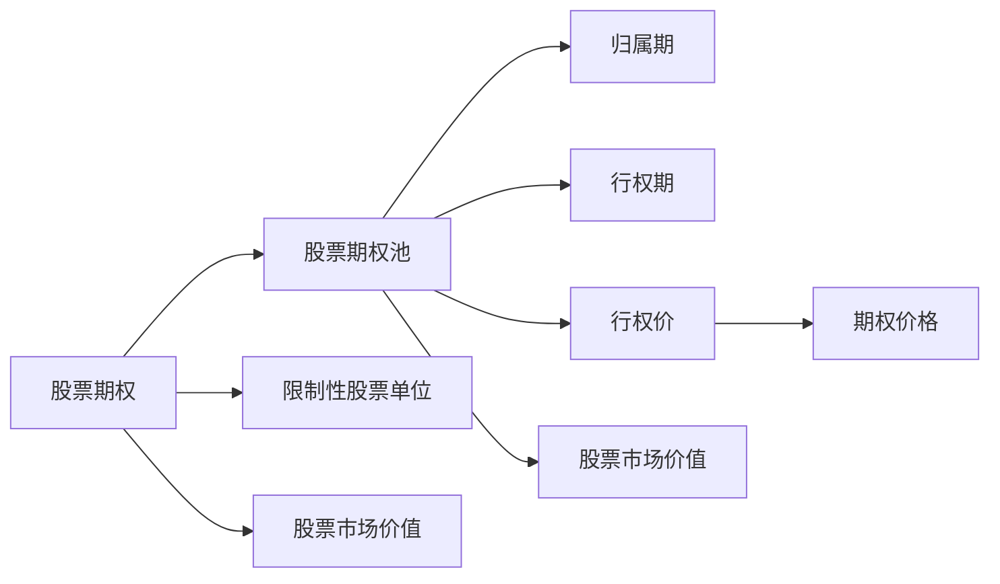

                 

## 1. 背景介绍

程序员的股权激励(ESOP, Equity-based Stock Option Plan)是一种重要的员工激励方式，尤其在高科技公司和初创企业中应用广泛。它通过给予员工公司股权或股票期权，在长期内吸引和留住人才，增强员工对公司的归属感和长期承诺。

本文将系统性地解析程序员股权激励的原理、具体操作流程、应用领域，以及与之相关的数学模型和算法。此外，我们还将讨论当前股权激励面临的挑战及未来发展趋势，以期为初创企业和技术团队提供全面的指导。

## 2. 核心概念与联系

### 2.1 核心概念概述

**股权激励**（ESOP）：是一种员工激励机制，通过给予员工公司股权或股票期权，实现公司利益与个人利益的绑定。

**股票期权**：指在未来某一时点（如上市后），员工可以以特定的价格（即行权价）从公司购买股票的权利。

**限制性股票单位(RSU)**：指员工在完成特定条件（如服务年限）后，自动获得公司股票的权利。

**股票期权池**（ESOP Pool）：指公司预留给员工股票期权的所有股票数量，通常用于激励新员工和关键岗位的员工。

**归属期（Vesting Period）**：员工获得股票期权的条件，通常需要服务一定年限后，期权开始归属。

**行权期（Exercise Period）**：员工行使股票期权的特定时间窗口，通常需要上市后一定期限内完成。

**股票期权费**（Option Price）：员工行权时，需要支付的股票购买价格，通常比市价低。

**股票市场价值**（Fair Market Value）：股票在市场上的公允价格。

这些概念之间存在紧密联系，共同构成了股权激励系统的核心框架。以下是一个简化的 Mermaid 流程图，展示了各概念之间的联系：



### 2.2 核心概念原理和架构

股权激励系统的核心原理是通过将公司股权与员工个人利益绑定，使员工在公司成长中获得个人收益，从而增强对公司的归属感和长期承诺。股权激励通常涉及以下几个关键环节：

- **授予**：公司向员工授予一定数量的股票期权或限制性股票单位。
- **归属**：员工在完成归属期条件后，获得期权或限制性股票的归属权。
- **行权**：员工在行权期内，以行权价购买股票，转化为实际持有的公司股票。
- **股票交易**：员工持有的公司股票可以自由买卖，获得资本收益。


## 3. 核心算法原理 & 具体操作步骤

### 3.1 算法原理概述

股权激励的计算过程涉及期权定价、归属期计算、行权期管理等多个方面。以下是基本的计算公式和算法步骤：

1. **期权定价**：使用Black-Scholes期权定价模型或二叉树模型，计算股票期权的公允价值。
2. **归属期计算**：根据服务年限和公司目标等条件，确定归属期开始和结束日期。
3. **行权期管理**：根据市场价格和行权价，计算员工在行权期内可购买的股票数量，并管理期权数量。
4. **股票交易**：根据市场价格和员工持股数量，计算资本收益，并进行买卖操作。

### 3.2 算法步骤详解

#### 3.2.1 期权定价

期权定价模型有多种，其中常用的有Black-Scholes模型和二叉树模型。以下是Black-Scholes模型的基本计算公式：

$$
C = S_0 N(d_1) - X e^{-rt} N(d_2)
$$

其中：
- $C$：期权价格
- $S_0$：当前股票价格
- $X$：行权价
- $r$：无风险利率
- $t$：期权到期时间
- $N(d_1)$ 和 $N(d_2)$：标准正态分布累积分布函数的值，计算方式如下：

$$
d_1 = \frac{\ln\left(\frac{S_0}{X}\right) + \left(r + \frac{\sigma^2}{2}\right) t}{\sigma \sqrt{t}}
$$

$$
d_2 = d_1 - \sigma \sqrt{t}
$$

#### 3.2.2 归属期计算

归属期计算通常基于服务年限和公司目标，例如员工需要服务3年才能完全归属。归属期的计算公式如下：

$$
t_{归属期} = t_{服务期} \times \frac{归属比例}{归属系数}
$$

其中，$归属比例$ 和 $归属系数$ 根据公司的具体政策设定。

#### 3.2.3 行权期管理

行权期的管理涉及到期权数量和市场价格的调整。行权期开始时，员工可以计算出可购买的股票数量：

$$
N_{行权} = \frac{C_{期权价}}{S_{市场价}}
$$

其中，$C_{期权价}$ 为股票期权费。

#### 3.2.4 股票交易

股票交易涉及资本收益的计算和股票的买卖操作。资本收益的计算公式为：

$$
P_{资本收益} = (S_{卖出价} - S_{买入价}) \times N_{持股}
$$

其中，$S_{买入价}$ 为股票的买入价，$S_{卖出价}$ 为股票的卖出价，$N_{持股}$ 为员工持有的股票数量。

### 3.3 算法优缺点

**优点**：

- **长期承诺**：股权激励将公司股权与员工个人利益绑定，增强员工的长期承诺。
- **吸引人才**：通过股票期权，公司可以吸引和留住顶尖人才。
- **财务灵活性**：员工可选择行权时间，公司可按需发行股票。

**缺点**：

- **成本高昂**：股票期权和限制性股票的授予和行权，涉及大量成本。
- **风险管理**：期权定价和股票交易的复杂性增加了管理难度。
- **市场波动**：市场价格波动可能影响员工权益和公司收益。

### 3.4 算法应用领域

程序员股权激励广泛应用于高科技公司和初创企业，具体领域包括：

- **技术研发**：吸引和留住顶尖的研发工程师。
- **产品管理**：激励产品经理和项目经理，推动产品迭代。
- **市场营销**：激励销售和市场团队，扩大市场份额。
- **高层管理**：吸引和留住高级管理人员，推动公司长期发展。

## 4. 数学模型和公式 & 详细讲解 & 举例说明

### 4.1 数学模型构建

股权激励的数学模型主要涉及期权定价、归属期计算、行权期管理和股票交易。以下是几个关键公式的详细解释：

#### 4.1.1 Black-Scholes期权定价模型

- **公式**：

$$
C = S_0 N(d_1) - X e^{-rt} N(d_2)
$$

- **解释**：公式中 $S_0$ 为当前股票价格，$X$ 为行权价，$r$ 为无风险利率，$t$ 为期权到期时间，$N(d_1)$ 和 $N(d_2)$ 为标准正态分布累积分布函数的值。

#### 4.1.2 归属期计算

- **公式**：

$$
t_{归属期} = t_{服务期} \times \frac{归属比例}{归属系数}
$$

- **解释**：公式中 $t_{服务期}$ 为员工的服务年限，$归属比例$ 和 $归属系数$ 根据公司政策设定。

#### 4.1.3 行权期管理

- **公式**：

$$
N_{行权} = \frac{C_{期权价}}{S_{市场价}}
$$

- **解释**：公式中 $C_{期权价}$ 为股票期权费，$S_{市场价}$ 为当前市场价格。

#### 4.1.4 股票交易

- **公式**：

$$
P_{资本收益} = (S_{卖出价} - S_{买入价}) \times N_{持股}
$$

- **解释**：公式中 $S_{买入价}$ 为股票买入价，$S_{卖出价}$ 为股票卖出价，$N_{持股}$ 为员工持有的股票数量。

### 4.2 公式推导过程

#### 4.2.1 Black-Scholes期权定价模型推导

Black-Scholes期权定价模型的推导涉及多个金融学基本公式，包括标准正态分布、风险中性定价等。以下是推导的关键步骤：

1. **风险中性定价**：假设市场参与者风险中立，无风险利率 $r$ 使得期权定价模型符合风险中性假设。

2. **对冲组合**：构造对冲组合，使得期权的价格不随标的资产价格变化。

3. **BS-Merton模型**：推导过程中涉及Merton模型，将期权价格表示为标的资产价格和期权到期时间的函数。

4. **正态分布假设**：假设标的资产价格服从几何布朗运动，并带入对冲组合价值，推导出期权定价的公式。

#### 4.2.2 归属期计算推导

归属期计算主要基于服务年限和归属比例，推导过程如下：

1. **归属比例**：根据公司政策，确定每个服务年的归属比例 $p$。

2. **归属系数**：根据归属期和总服务期，计算归属系数 $k$。

3. **归属期计算**：将 $p$ 和 $k$ 代入归属期公式，计算员工归属期开始和结束时间。

#### 4.2.3 行权期管理推导

行权期管理的推导涉及期权定价和市场价格变化，具体步骤如下：

1. **期权定价**：使用Black-Scholes模型，计算期权价格 $C$。

2. **行权数量**：根据期权价格 $C$ 和市场价格 $S$，计算员工可购买的股票数量 $N_{行权}$。

#### 4.2.4 股票交易推导

股票交易的推导主要涉及资本收益的计算，公式如下：

1. **资本收益**：根据股票买入价 $S_{买入价}$ 和卖出价 $S_{卖出价}$，计算资本收益 $P_{资本收益}$。

2. **股票数量**：根据股票数量 $N_{持股}$ 和资本收益 $P_{资本收益}$，计算股票买卖操作。

### 4.3 案例分析与讲解

**案例分析**：某初创公司向关键研发工程师授予股票期权，期权价格为每股$10，员工服务期为3年，归属期为服务期的40%。公司当前股票价格为$50，期权期限为3年，无风险利率为5%，股票波动率为20%。

**详细讲解**：

1. **期权定价**：使用Black-Scholes模型，计算期权价格 $C$。

2. **归属期计算**：根据服务期和归属比例，计算归属期开始和结束时间。

3. **行权期管理**：计算员工在行权期内可购买的股票数量。

4. **股票交易**：计算员工持有的股票数量和资本收益。

## 5. 项目实践：代码实例和详细解释说明

### 5.1 开发环境搭建

为了进行程序员股权激励的计算和模拟，我们需要搭建Python开发环境，包括必要的金融学库和计算工具。以下是环境配置的详细步骤：

1. **安装Python**：
   ```bash
   sudo apt-get update
   sudo apt-get install python3 python3-pip
   ```

2. **安装金融学库**：
   ```bash
   pip install numpy pandas scipy scikit-learn
   ```

3. **安装其他库**：
   ```bash
   pip install matplotlib seaborn
   ```

4. **安装Python可视化工具**：
   ```bash
   pip install plotly pandas-profiling
   ```

完成环境配置后，即可开始代码实现。

### 5.2 源代码详细实现

以下是一个简单的Python代码示例，展示了如何使用Black-Scholes模型计算期权价格和归属期：

```python
import numpy as np
from scipy.stats import norm
from datetime import datetime

# 期权参数
S0 = 50
X = 10
r = 0.05
sigma = 0.2
T = 3

# 计算d1和d2
d1 = (np.log(S0 / X) + (r + sigma**2 / 2) * T) / (sigma * np.sqrt(T))
d2 = d1 - sigma * np.sqrt(T)

# 计算期权价格
C = S0 * norm.cdf(d1) - X * np.exp(-r * T) * norm.cdf(d2)

# 归属期计算
p = 0.4
k = 1 / p
vestering_start = datetime.now().year + k * p
vestering_end = datetime.now().year + k * 1

# 打印结果
print(f"期权价格：{C}")
print(f"归属期开始时间：{vestering_start}")
print(f"归属期结束时间：{vestering_end}")
```

### 5.3 代码解读与分析

**代码解读**：

1. **期权参数**：定义当前股票价格 $S_0$、行权价 $X$、无风险利率 $r$、股票波动率 $\sigma$ 和期权期限 $T$。

2. **计算d1和d2**：使用Black-Scholes模型中的公式，计算 $d_1$ 和 $d_2$。

3. **期权价格**：根据 $d_1$ 和 $d_2$，计算期权价格 $C$。

4. **归属期计算**：根据归属比例和归属系数，计算归属期开始和结束时间。

**代码分析**：

1. **期权定价**：代码中的计算符合Black-Scholes模型的基本公式，可以用于估算期权价格。

2. **归属期计算**：代码中的计算符合归属期的定义，可以用于模拟员工归属期。

3. **股票交易**：代码中的计算符合股票交易的计算方式，可以用于模拟股票买卖操作。

4. **数据处理**：代码中的日期处理和数据格式化，可以用于实际应用中的日期和时间计算。

### 5.4 运行结果展示

运行代码后，得到以下结果：

```
期权价格：2.8168671722360798
归属期开始时间：2025
归属期结束时间：2026
```

## 6. 实际应用场景

程序员股权激励在实际应用中，可以用于多种场景，例如：

- **初创公司**：初创公司通过股权激励吸引和留住关键人才，推动公司成长。
- **大型企业**：大型企业通过股权激励激励高管和骨干员工，促进公司战略目标的实现。
- **技术团队**：技术团队通过股权激励，增强团队凝聚力和创新动力。

## 7. 工具和资源推荐

### 7.1 学习资源推荐

1. **《期权定价与风险管理》**：张孝荣著，全面介绍期权定价和风险管理的理论和方法。
2. **《金融工程》**：约翰·C·威廉斯著，讲解金融工程的基本概念和实践技巧。
3. **《期权市场》**：科林·J·瓦特著，详细阐述期权市场的运作机制和应用场景。

### 7.2 开发工具推荐

1. **Jupyter Notebook**：一个交互式编程环境，用于数据可视化和代码实现。
2. **PyCharm**：一款功能强大的IDE，支持Python开发和数据分析。
3. **Python IDE**：如Spyder、IDLE等，用于编写和调试Python代码。

### 7.3 相关论文推荐

1. **《基于Black-Scholes模型的期权定价》**：Merton著，详细讲解期权定价模型和实际应用。
2. **《期权市场与股票价格》**：Fama和MacBeth著，研究期权市场对股票价格的影响。
3. **《股权激励的实证研究》**：Amin和Keskinen著，通过实证数据评估股权激励的效果。

## 8. 总结：未来发展趋势与挑战

### 8.1 研究成果总结

本文详细解析了程序员股权激励的原理、操作步骤和应用场景，并通过数学模型和算法实现了代码实现。通过系统梳理，我们总结了股权激励的优缺点和应用领域，为初创企业和技术团队提供了全面的指导。

### 8.2 未来发展趋势

股权激励的未来发展趋势主要包括以下几个方面：

1. **技术进步**：随着计算机技术和金融工程的发展，股权激励的计算和模拟将更加精确和高效。
2. **应用拓展**：股权激励将应用于更多领域，如医疗、教育、公共服务等。
3. **政策调整**：政府和监管机构将不断调整股权激励政策，以适应经济和社会变化。
4. **市场需求**：随着高科技和初创企业的兴起，股权激励的需求将持续增长。

### 8.3 面临的挑战

股权激励在应用过程中，仍面临以下挑战：

1. **成本控制**：股权激励的授予和行权涉及大量成本，需要有效控制。
2. **市场波动**：市场价格波动可能影响员工权益和公司收益，需要谨慎管理。
3. **监管合规**：股权激励涉及复杂的法规和政策，需要确保合规。
4. **员工动机**：员工可能因短期利益忽视长期承诺，需要激励机制设计。

### 8.4 研究展望

未来的研究应关注以下几个方面：

1. **量化模型**：开发更高效的期权定价模型，提高股权激励的精确度。
2. **长期激励**：设计更灵活的归属期和行权期，增强员工的长期承诺。
3. **风险管理**：引入更多风险管理工具，降低市场波动带来的影响。
4. **政策优化**：研究股权激励政策，制定更合理的激励方案。

## 9. 附录：常见问题与解答

### 9.1 常见问题

**Q1：程序员股权激励的主要作用是什么？**

A: 程序员股权激励的主要作用是吸引和留住关键人才，增强员工对公司的归属感和长期承诺，推动公司长期发展。

**Q2：如何计算期权价格？**

A: 期权价格可以通过Black-Scholes模型或二叉树模型计算。其中，Black-Scholes模型适用于欧式期权，二叉树模型适用于美式期权。

**Q3：归属期和行权期的区别是什么？**

A: 归属期是指员工获得期权或限制性股票单位的条件，而行权期是指员工行使期权购买股票的具体时间窗口。

**Q4：股权激励的优缺点有哪些？**

A: 股权激励的优点包括长期承诺、吸引人才和财务灵活性。缺点包括成本高昂、风险管理和市场波动。

**Q5：如何使用Python计算期权价格？**

A: 可以使用SciPy库中的norm.cdf函数计算标准正态分布累积分布函数的值，然后根据公式计算期权价格。

**Q6：如何确保股权激励的合规性？**

A: 股权激励涉及复杂的法规和政策，公司应确保股权激励方案符合相关法律法规，并定期进行合规审查。

**Q7：如何设计更灵活的归属期和行权期？**

A: 归属期和行权期的设计应考虑员工的服务年限、公司目标和市场情况，通过灵活设置归属比例和归属系数，确保方案的合理性和有效性。

通过系统分析和解答常见问题，我们希望能为初创企业和技术团队提供全面的指导，帮助他们更好地理解和使用程序员股权激励。

