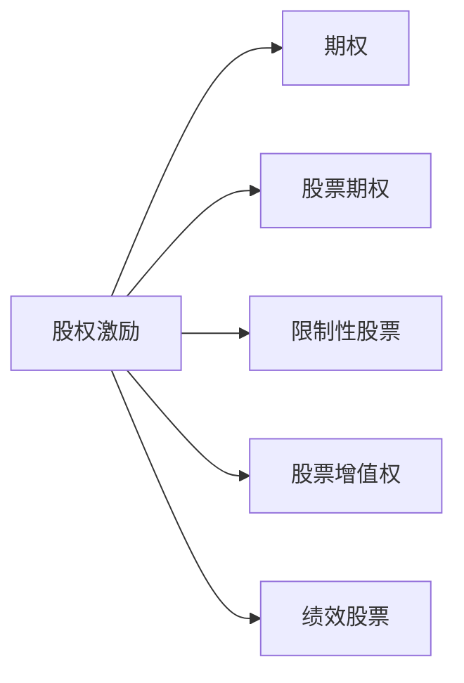

                 

## 1. 背景介绍

### 1.1 问题由来

近年来，随着互联网和科技行业的高速发展，程序员在企业中扮演的角色越来越重要。程序员不仅需要掌握多项核心技能，还要具备优秀的团队协作能力和创新精神。然而，过高的工作压力和加班文化，让许多程序员感到疲惫不堪。

如何激励程序员，使其在享受劳动成果的同时，还能保持旺盛的工作热情，成为企业面临的一大挑战。传统的工资、奖金等物质激励方式，难以满足程序员的长期需求。因此，股权激励作为一种更具长期价值和激励效果的方案，逐渐成为各大高科技企业首选。

### 1.2 问题核心关键点

股权激励的核心在于，通过给予员工一定比例的公司股权，使其在企业发展中分享利益，从而激发其工作热情和创造力。通过合理的股权激励计划，可以在不增加成本的前提下，提升程序员的归属感和满意度，推动企业持续发展。

股权激励的关键要素包括：激励比例、激励条件、授予时机、退出机制等。这些要素的设计需平衡公司利益和员工利益，确保激励机制的公平性、透明性和可持续性。

### 1.3 问题研究意义

股权激励对于程序员的长期激励效果显著。它能够满足程序员对于成长、认可和归属感的深层次需求，使程序员与企业目标紧密结合，共同推动企业持续创新和成长。

股权激励对企业也有着重要意义。通过长期激励，留住关键人才，可以增强企业核心竞争力。同时，股权激励还可以吸引优秀的新人才加入，为企业的长期发展注入活力。

## 2. 核心概念与联系

### 2.1 核心概念概述

为了更好地理解股权激励机制的原理，本节将介绍几个关键概念：

- **股权激励**：指企业给予员工一定比例的公司股权，使其在企业发展中分享利益，激励员工积极工作，推动企业成长。
- **期权**：指员工在未来某一时间，按照预设价格，购买公司一定比例的股权的权利。期权常常与绩效考核和解锁条件绑定。
- **股票期权**：指员工以预设价格购买公司股票的权利，通常用于激励高级管理人员和核心技术团队。
- **限制性股票**：指员工获得的公司股票，在一定期限内不能自由买卖，解锁后才可流通。
- **股票增值权**：指员工按照公司股票增值情况获得奖金，但并不拥有股权。
- **绩效股票**：指员工根据公司业绩和个人绩效获得一定比例的股票。

这些概念之间的逻辑关系可以通过以下Mermaid流程图来展示：



该流程图展示了股权激励的多种实现方式及其相互联系：

1. 股权激励包括期权、股票期权、限制性股票、股票增值权、绩效股票等多种形式。
2. 各类型股权激励的设计，需结合公司战略和员工需求，进行灵活组合。
3. 通过多种激励手段，可以最大程度满足员工多样化的需求，形成全面激励体系。

## 3. 核心算法原理 & 具体操作步骤
### 3.1 算法原理概述

股权激励的设计和实施，本质上是一个动态优化过程。企业需要根据自身战略目标和人才需求，设计出既公平又具吸引力的股权激励方案。同时，需根据市场环境、员工表现等变化，适时调整激励政策。

股权激励的核心算法包括：

- **成本评估**：计算股权授予的财务成本，包括激励成本和潜在损失。
- **收益评估**：评估股权激励对员工的长期激励效果，包括留任率、工作满意度等。
- **绩效考核**：结合公司业绩和个人表现，制定考核标准，确保股权激励与绩效挂钩。
- **市场估值**：定期评估公司股票的市场价值，确保激励方案的公平性和透明度。

### 3.2 算法步骤详解

基于以上算法原理，设计一个基本的股权激励计划包含以下步骤：

**Step 1: 设定股权激励目标**
- 确定公司战略目标和人才需求，设定股权激励的总规模和分配比例。
- 制定具体的激励目标，如公司上市、特定业绩指标等。

**Step 2: 选择合适的激励形式**
- 根据公司战略和员工特点，选择合适的激励形式，如股票期权、限制性股票等。
- 设计激励条件的解锁方式，如分阶段解锁、绩效考核解锁等。

**Step 3: 确定激励数量和价格**
- 根据激励目标和员工贡献，确定授予的股权数量。
- 设定期权行权价格，通常为授予时的市场价或预设价。

**Step 4: 设定行权期限**
- 确定期权行权的有效期限，一般为3-5年，以便于员工逐步行权。
- 设定行权前锁定条件，如在职状态、重大成就等。

**Step 5: 进行股权授予**
- 向符合条件的员工授予期权或股票，进行授权和登记。
- 设立激励系统，记录员工激励情况和行权情况。

**Step 6: 监控和评估**
- 定期评估激励效果，收集员工反馈和满意度数据。
- 根据市场变化和业绩情况，适时调整激励政策。

### 3.3 算法优缺点

股权激励的设计和实施具有以下优点：

- **长期激励**：股权激励通过给予员工公司股份，使其分享公司成长的红利，激励效果更加持久。
- **分享公司价值**：股权激励将公司与员工利益绑定，增强员工的归属感和责任感。
- **灵活多样**：不同类型的股权激励形式，可以满足不同员工的需求，形成多层次的激励体系。
- **留任关键人才**：通过股权激励，可以留住关键技术和管理人才，增强企业核心竞争力。

然而，股权激励也存在一些局限性：

- **成本高昂**：股权激励涉及股份的授予和行权，财务成本较高。
- **操作复杂**：股权激励的设计、实施和监控需专业的团队和系统支持，操作复杂。
- **风险较大**：股权激励受市场波动影响，可能面临潜在的财务风险。
- **管理难度大**：员工可能对股权激励有较高的预期，管理不当可能导致激励效果不足。

在实践中，企业需要综合考虑股权激励的利弊，设计出既符合公司战略，又能激发员工积极性的激励方案。

### 3.4 算法应用领域

股权激励在各类高科技企业和创业公司中应用广泛，以下是几个典型案例：

- **谷歌**：谷歌为员工提供股票期权，激励员工在创新和市场拓展方面积极贡献。
- **Facebook**：Facebook为员工提供限制性股票，激励员工与公司共同成长。
- **阿里巴巴**：阿里巴巴通过股票期权和限制性股票，吸引和留住核心人才，推动企业持续发展。

此外，股权激励还被应用于更多场景中，如高科技初创公司、大学科研团队、非营利组织等，为不同领域的创新人才提供长期激励。

## 4. 数学模型和公式 & 详细讲解 & 举例说明

### 4.1 数学模型构建

假设公司股票的当前市价为 $P_0$，员工被授予 $N$ 股股票期权，行权价格为 $P_{\text{strike}}$，期权期限为 $T$ 年。设年复利率为 $r$。则员工的期权现值（Present Value）为：

$$
PV = N \cdot P_{\text{strike}} \cdot (1 + r)^T
$$

员工的预期收益为期权现值与期权市场价值的差额，即：

$$
EV = PV - PV_T
$$

其中，$PV_T$ 为 $T$ 年后的期权市场价值。

### 4.2 公式推导过程

根据期权定价模型（如Black-Scholes模型），$T$ 年后的期权市场价值为：

$$
PV_T = N \cdot P_{\text{strike}} \cdot e^{-\sigma^2 \cdot T/2 - (r + \sigma^2 / 2) \cdot T}
$$

其中，$\sigma$ 为股票价格波动率。

将 $PV_T$ 代入预期收益公式，得：

$$
EV = N \cdot P_{\text{strike}} \cdot (1 + r)^T - N \cdot P_{\text{strike}} \cdot e^{-\sigma^2 \cdot T/2 - (r + \sigma^2 / 2) \cdot T}
$$

化简得：

$$
EV = N \cdot P_{\text{strike}} \cdot e^{r \cdot T} \cdot (1 - e^{-\sigma^2 \cdot T/2})
$$

### 4.3 案例分析与讲解

假设谷歌公司授予员工100万股期权，行权价格为每股100美元，期权期限为5年，年复利率为5%，股票价格波动率为20%。根据上述公式计算员工预期收益：

$$
EV = 1000000 \cdot 100 \cdot (1 + 0.05)^5 \cdot (1 - e^{-0.2^2 \cdot 5/2}) = 1000000 \cdot 100 \cdot 1.276 \cdot (1 - e^{-0.2^2 \cdot 2.5}) \approx 1000000 \cdot 100 \cdot 1.276 \cdot (1 - e^{-1}) \approx 1000000 \cdot 100 \cdot 1.276 \cdot 0.864 \approx 925280
$$

这意味着，如果期权在5年后市场价值为100美元，员工预期收益为92.53万美元。

## 5. 项目实践：代码实例和详细解释说明
### 5.1 开发环境搭建

在进行股权激励模型的开发和应用前，我们需要准备好开发环境。以下是使用Python进行代码实现的环境配置流程：

1. 安装Anaconda：从官网下载并安装Anaconda，用于创建独立的Python环境。

2. 创建并激活虚拟环境：
```bash
conda create -n stock-option-env python=3.8 
conda activate stock-option-env
```

3. 安装相关库：
```bash
conda install sympy sympy scipy scipy sympy
```

完成上述步骤后，即可在`stock-option-env`环境中开始股权激励模型的开发。

### 5.2 源代码详细实现

以下是一个基本的股权激励模型实现，用于计算员工期权或限制性股票的预期收益。

```python
from sympy import symbols, exp, solve, Rational

def calculate_ev(strike_price, shares, r, volatility, T):
    PV = shares * strike_price * (1 + r)**T
    PV_T = shares * strike_price * exp(-volatility**2 * T / 2 - (r + volatility**2 / 2) * T)
    EV = PV - PV_T
    return EV

# 输入参数
strike_price = 100  # 行权价格
shares = 1000000  # 股票数量
r = Rational(5, 100)  # 年复利率
volatility = Rational(20, 100)  # 股票价格波动率
T = Rational(5, 1)  # 期权期限（年）

# 计算预期收益
EV = calculate_ev(strike_price, shares, r, volatility, T)
print(f"员工期权预期收益：{EV}")
```

以上代码使用Sympy库进行符号计算，可以方便地进行财务计算和模型推导。

### 5.3 代码解读与分析

让我们再详细解读一下关键代码的实现细节：

**calculate_ev函数**：
- `PV`和`PV_T`变量分别表示期权和期权市场价值的现值。
- `EV`变量表示员工的预期收益。
- 函数返回员工的预期收益。

**输入参数**：
- `strike_price`：期权行权价格。
- `shares`：授予的股票数量。
- `r`：年复利率。
- `volatility`：股票价格波动率。
- `T`：期权期限（年）。

**预期收益计算**：
- 根据期权定价模型，计算期权和期权市场价值的现值。
- 根据现值计算员工的预期收益。

**输出结果**：
- 输出员工期权预期收益。

可以看到，通过上述代码，我们能够快速计算员工期权的预期收益，为股权激励方案的设计提供数据支持。

## 6. 实际应用场景
### 6.1 谷歌股权激励方案

谷歌公司的股权激励方案是股权激励的典型代表。谷歌为员工提供股票期权，激励员工在创新和市场拓展方面积极贡献。谷歌的期权计划包括：

- **期权授予**：新员工在加入谷歌时，可以立即获得一定数量的期权。
- **行权条件**：期权授予后，员工需在职状态3年，然后分阶段解锁。
- **行权价格**：期权行权价格为授予时的市场价。
- **激励范围**：谷歌期权计划覆盖公司全部员工，包括核心管理团队和技术团队。

谷歌的期权计划通过灵活的授予和行权机制，将员工与公司成长紧密绑定，使其在创新和市场拓展方面表现出色。

### 6.2 阿里巴巴股权激励方案

阿里巴巴的股权激励方案注重长期激励，主要通过限制性股票和股票期权两种形式实现。阿里巴巴的股权激励计划包括：

- **限制性股票**：授予的股票解锁后，员工需在职状态3年，解锁后股票可以自由买卖。
- **股票期权**：授予的期权行权价格为授予时的市场价，员工需在职状态3年，然后分阶段解锁。
- **绩效考核**：员工期权解锁需与公司业绩和个人绩效挂钩。
- **激励对象**：阿里巴巴股权激励方案覆盖公司核心管理人员和技术团队。

阿里巴巴的股权激励方案通过多样化的激励手段，增强了员工的归属感和责任感，推动了公司的持续发展。

### 6.3 未来应用展望

股权激励在高科技企业和创业公司中应用广泛，未来还将有更广泛的应用场景：

- **初创企业**：初创企业面临资金短缺的问题，股权激励可以帮助企业留住关键人才，推动企业快速成长。
- **大学科研团队**：大学科研团队可以通过股权激励吸引优秀人才，提升科研水平和影响力。
- **非营利组织**：非营利组织可以通过股权激励，吸引志愿者和捐赠者，推动组织发展。

股权激励的应用前景广阔，将会在更多领域发挥其长期激励和分享价值的作用。

## 7. 工具和资源推荐
### 7.1 学习资源推荐

为了帮助开发者系统掌握股权激励的理论基础和实践技巧，这里推荐一些优质的学习资源：

1. **《股权激励：原理、策略与实践》**：深入浅出地介绍了股权激励的原理、策略和实际应用案例。
2. **CSO股权激励课程**：提供股权激励的全面课程，涵盖激励设计、实施和监控等环节。
3. **《股票期权与股权激励》**：介绍股票期权和股权激励的基本概念、定价和应用。
4. **HRS股权激励网站**：提供股权激励的最新资讯、案例分析和工具支持。

通过对这些资源的学习实践，相信你一定能够快速掌握股权激励的精髓，并用于解决实际的激励问题。

### 7.2 开发工具推荐

高效的开发离不开优秀的工具支持。以下是几款用于股权激励开发的常用工具：

1. **Excel**：强大的电子表格工具，适合进行财务计算和数据可视化。
2. **Google Sheets**：基于云端的电子表格工具，便于团队协作和数据共享。
3. **Python**：灵活的编程语言，适合进行符号计算和模型推导。
4. **MATLAB**：专业的数学软件，适合进行复杂的财务分析和模拟。
5. **Tableau**：数据可视化工具，便于进行数据探索和报告生成。

合理利用这些工具，可以显著提升股权激励模型的开发效率，加快创新迭代的步伐。

### 7.3 相关论文推荐

股权激励的发展离不开学界的持续研究。以下是几篇奠基性的相关论文，推荐阅读：

1. **《企业股权激励机制设计研究》**：详细介绍了股权激励的设计原则和实施步骤。
2. **《期权定价模型研究》**：深入探讨了期权定价模型的理论基础和实际应用。
3. **《股票期权与股权激励的市场反应》**：研究了股权激励对公司业绩和市场反应的影响。
4. **《企业股权激励的博弈分析》**：运用博弈论思想，分析了股权激励的激励效果和公平性。

这些论文代表了大股权激励的研究方向，通过学习这些前沿成果，可以帮助研究者把握学科前进方向，激发更多的创新灵感。

## 8. 总结：未来发展趋势与挑战
### 8.1 研究成果总结

股权激励作为一种长期激励机制，在企业中广泛应用。它能够有效激励员工，推动企业持续发展。股权激励的设计和实施，需要平衡公司利益和员工利益，确保激励机制的公平性和透明性。

股权激励在技术实现上，主要依赖于期权定价模型、财务计算和激励监控系统。通过合理设计激励形式和条件，可以实现高效、公平的股权激励。

### 8.2 未来发展趋势

股权激励的未来发展趋势包括：

1. **多样化激励形式**：股权激励形式将更加多样化，结合期权、限制性股票、绩效股票等多种手段，满足员工多样化的需求。
2. **动态调整机制**：股权激励计划将更具灵活性，根据市场变化和员工表现，进行动态调整。
3. **数字化管理**：股权激励将更多地依赖于数字化工具和系统，提高激励管理效率和透明度。
4. **全球化扩展**：股权激励将更多地应用于跨国企业和全球化组织，推动国际化发展。

### 8.3 面临的挑战

股权激励在实施过程中，也面临一些挑战：

1. **成本控制**：股权激励涉及股份的授予和行权，财务成本较高，需要控制成本以确保公司可持续发展。
2. **公平性问题**：股权激励的设计需公平透明，防止内部不平衡和腐败现象。
3. **管理复杂性**：股权激励的实施和监控需要专业团队支持，管理复杂性较高。
4. **法律合规性**：股权激励需符合相关法律法规，避免法律风险。

### 8.4 研究展望

未来的股权激励研究需要在以下几个方面寻求新的突破：

1. **量化评估模型**：开发更加精确的量化模型，评估股权激励对员工激励效果的影响。
2. **激励设计优化**：结合企业战略和员工需求，设计更具灵活性和公平性的激励方案。
3. **模型优化与改进**：优化期权定价模型，提升模型预测准确性。
4. **员工反馈机制**：建立员工反馈机制，及时调整激励政策，提升激励效果。

这些研究方向将推动股权激励技术的发展，为各类企业提供更加科学、高效、公平的激励机制。

## 9. 附录：常见问题与解答

**Q1：股权激励是否适用于所有公司？**

A: 股权激励主要适用于高科技企业、创业公司等创新型企业。对于传统制造业、服务业等企业，股权激励可能不适用。需结合企业特点，综合考虑是否采用股权激励。

**Q2：股权激励的成本如何计算？**

A: 股权激励的成本主要包括股票授予时的市场价和行权时的差价。一般需要结合公司的财务状况和激励规模，进行详细评估。

**Q3：股权激励的解锁条件如何设置？**

A: 股权激励的解锁条件需结合公司战略和员工需求，一般分为在职状态、业绩指标等。解锁条件的设置需具有挑战性，但不宜过于苛刻。

**Q4：股权激励的管理有哪些建议？**

A: 股权激励的管理需具备专业性和透明度。建议设立专门的激励管理部门，制定详细的激励方案和实施细则，确保激励公平透明。

**Q5：如何设计股权激励方案？**

A: 设计股权激励方案需综合考虑公司战略和员工需求，平衡公司利益和员工利益。建议采用多种激励形式，结合绩效考核和解锁条件，制定灵活的激励方案。

---

作者：禅与计算机程序设计艺术 / Zen and the Art of Computer Programming

