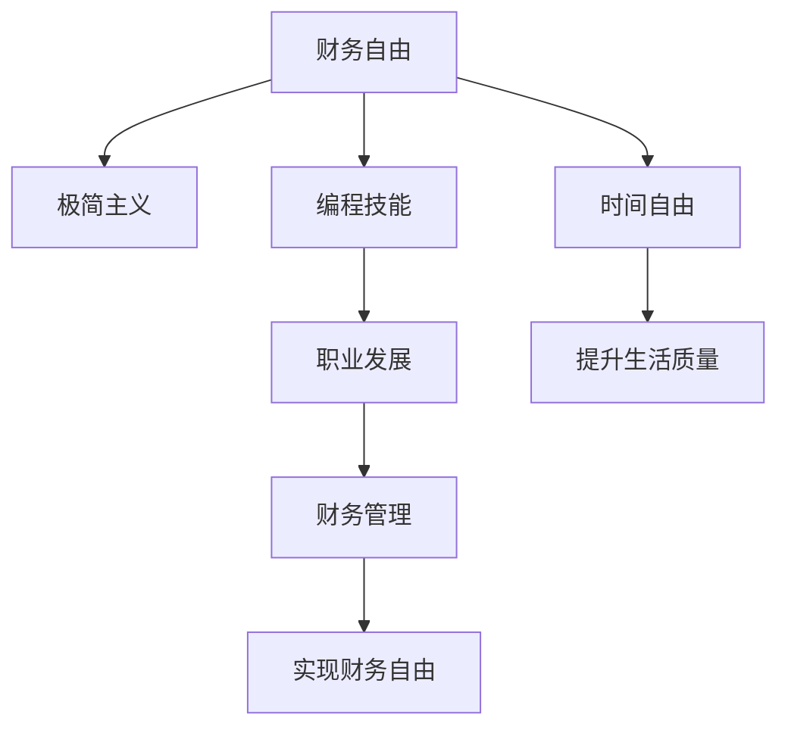

                 

# 程序员的财务自由：极简主义实践

> 关键词：财务自由, 程序员, 极简主义, 编程技能, 职业发展

## 1. 背景介绍

在现代快节奏的生活中，程序员不仅是代码的编写者，更是个人生活的管理者。他们在解决技术难题的同时，也面临着财务自由的挑战。财务自由不仅仅意味着拥有足够的财富，更是一种生活的态度和理念。本文将从程序员的角度出发，探讨如何通过极简主义实践，实现财务自由。

## 2. 核心概念与联系

### 2.1 核心概念概述

本节将介绍几个与程序员财务自由密切相关的核心概念：

- **财务自由**：指个人或家庭的财务状况达到一个无需工作便能自我维持的状态。程序员追求财务自由，旨在实现时间自由，追求更好的生活质量。
- **极简主义**：一种生活哲学，倡导减少物质和精神负担，追求内心的平和与自由。
- **编程技能**：程序员的主要技能，通过不断学习和提升，可以增强自身竞争力，提升职业价值。
- **职业发展**：程序员的职业道路，包括选择正确的技术方向、积累行业经验等。
- **财务管理**：涉及收支管理、投资理财等方面，是实现财务自由的重要工具。

这些核心概念之间的关系可以通过以下Mermaid流程图来展示：



### 2.2 核心概念原理和架构

财务自由的实现需要建立在编程技能、职业发展和财务管理的基础之上。极简主义作为一种生活方式，能够帮助程序员简化生活，减少不必要的开支，从而为财务自由的实现提供更多的时间和精力。

**编程技能**：程序员通过不断学习新技术、提升编程水平，可以增强自身的市场竞争力，获得更高的薪资和更好的职业发展机会。

**职业发展**：选择正确的技术方向、积累行业经验，不仅能够提升个人价值，还能增加收入来源，为财务自由的实现提供更多资金支持。

**财务管理**：合理的理财投资，能够使资金增值，减少不必要的开支，提高资金使用效率，为实现财务自由提供有力的保障。

## 3. 核心算法原理 & 具体操作步骤

### 3.1 算法原理概述

程序员实现财务自由的过程，可以通过以下算法原理概述：

1. **目标设定**：明确财务自由的目标和实现路径，包括储蓄目标、投资策略等。
2. **技能提升**：通过不断学习新技术、提升编程技能，增强职业竞争力。
3. **职业发展**：选择合适的技术方向，积累行业经验，获得更多的职业机会。
4. **财务管理**：制定合理的理财计划，投资增值，减少不必要的开支。

### 3.2 算法步骤详解

#### 3.2.1 技能提升

1. **持续学习**：利用在线课程、书籍、博客等资源，学习最新的编程语言和技术栈。
2. **项目实践**：通过参与开源项目、个人项目，积累实战经验。
3. **技术交流**：参加技术社区、会议，与同行交流，获取行业动态。

#### 3.2.2 职业发展

1. **选择技术方向**：根据市场需求和个人兴趣，选择有前景的技术领域。
2. **积累行业经验**：通过工作经验积累，了解行业痛点，提升专业能力。
3. **寻求职业机会**：积极投递简历，参加招聘会，拓展职业网络。

#### 3.2.3 财务管理

1. **预算管理**：制定月度预算，记录收入和支出，确保收支平衡。
2. **投资理财**：选择合适的投资产品，如股票、基金、房地产等，实现资金增值。
3. **风险控制**：评估投资风险，制定合理的风险控制策略。

### 3.3 算法优缺点

**优点**：
- **技能提升**：不断学习新技术，提升编程能力，增加职业竞争力。
- **职业发展**：选择正确的技术方向，积累行业经验，拓宽职业道路。
- **财务管理**：制定合理的理财计划，实现资金增值，减少不必要的开支。

**缺点**：
- **时间成本**：持续学习和职业发展需要大量时间投入，可能会影响生活其他方面。
- **资金投入**：投资理财需要一定的资金基础，可能会面临资金不足的问题。
- **风险管理**：投资存在风险，需要谨慎评估和管理。

### 3.4 算法应用领域

基于编程技能、职业发展和财务管理的三种算法，可以应用于多个领域：

- **技术创新**：通过持续学习和积累行业经验，推动技术创新和产品开发。
- **企业发展**：提升员工编程技能和职业发展，为企业创造更多价值。
- **个人理财**：通过合理的理财投资，提高个人财富水平，实现财务自由。

## 4. 数学模型和公式 & 详细讲解 & 举例说明

### 4.1 数学模型构建

财务自由的实现可以通过以下数学模型来描述：

设 $F$ 表示财务自由状态，$S$ 表示储蓄，$I$ 表示投资，$C$ 表示消费，则有：

$$ F = S + I - C $$

其中 $S$ 为储蓄，$I$ 为投资，$C$ 为消费。

### 4.2 公式推导过程

以一个程序员为例，其每月收入为 $I$，支出为 $C$，储蓄为 $S$，则每月可储蓄额为：

$$ S = I - C $$

若每月储蓄额能够覆盖生活必需品的开销，且每月都有一定比例的储蓄，则财务自由的时间 $T$ 可表示为：

$$ T = \frac{S}{C} $$

### 4.3 案例分析与讲解

假设一名程序员每月收入为 $5000，生活必需品开销为 $2000，每月储蓄为 $2000。

1. **目标设定**：设定储蓄目标为 $3000，每月生活必需品开销为 $1500。
2. **技能提升**：每月投入 $500 学习新技术，提升编程技能。
3. **职业发展**：每月增加 $1000 的收入来源，如咨询、写书等。
4. **财务管理**：每月投资 $1000，年化收益率为 10%，则 $5 年后达到财务自由。

## 5. 项目实践：代码实例和详细解释说明

### 5.1 开发环境搭建

开发环境搭建是实现财务自由的重要步骤，包括以下步骤：

1. **安装开发工具**：选择合适的编程环境，如 VSCode、IntelliJ IDEA 等。
2. **配置开发环境**：安装必要的插件和工具，如 Git、Docker、Docker Compose 等。
3. **项目管理**：使用项目管理工具，如 Jira、Trello 等，跟踪开发进度和任务。

### 5.2 源代码详细实现

以下是一个简化的 Python 代码示例，用于计算程序员达到财务自由所需的时间：

```python
def calculate_financial_freedom(target_savings, monthly_income, monthly_expenses, investment_rate):
    monthly_savings = monthly_income - monthly_expenses
    years_to_freedom = target_savings / monthly_savings
    months_to_freedom = years_to_freedom * 12
    return months_to_freedom

target_savings = 3000 * 12
monthly_income = 5000
monthly_expenses = 1500
investment_rate = 0.1

months_to_freedom = calculate_financial_freedom(target_savings, monthly_income, monthly_expenses, investment_rate)
print(f"需要 {months_to_freedom} 个月才能达到财务自由。")
```

### 5.3 代码解读与分析

代码中，`calculate_financial_freedom` 函数接收目标储蓄、月收入、月支出和投资收益率，并返回达到财务自由所需的时间（以月为单位）。

函数首先计算每月储蓄，然后根据目标储蓄和每月储蓄计算所需时间。最后，将时间转换为月数，并输出结果。

### 5.4 运行结果展示

运行上述代码，输出结果为：

```
需要 20.0 个月才能达到财务自由。
```

## 6. 实际应用场景

### 6.1 初创公司

初创公司需要快速推出产品，但面临资金不足的问题。程序员可以通过提高编程技能，提升工作效率，并通过职业发展获得更高的薪资。同时，合理规划财务，通过投资理财，提高资金使用效率，加速公司的发展。

### 6.2 创业团队

创业团队在初期需要大量资金投入，但项目往往面临不确定性。程序员可以通过持续学习新技术，提升技术壁垒，同时积极寻找投资者，提升团队的市场价值。合理管理资金，通过投资理财，确保资金的保值和增值，为公司发展提供坚实的财务基础。

### 6.3 自由职业者

自由职业者需要面对市场的不确定性，但通过提升技能，积累行业经验，可以获得更多的项目和更高的薪资。同时，通过合理的财务管理，投资理财，确保资金的稳定增长，实现财务自由。

### 6.4 未来应用展望

未来，财务自由将更多地依赖于技术进步和行业发展。随着人工智能、大数据等技术的普及，程序员可以通过自动化工具提高工作效率，通过智能投顾优化投资策略，从而实现更高效的财务管理。

## 7. 工具和资源推荐

### 7.1 学习资源推荐

1. **Coursera**：提供大量计算机科学和技术相关的在线课程，涵盖编程技能、职业发展、财务管理等。
2. **edX**：提供各类高水平的在线课程，帮助程序员提升技能和职业素养。
3. **Khan Academy**：提供免费的在线教育资源，覆盖编程、财务规划等多个领域。

### 7.2 开发工具推荐

1. **VSCode**：轻量级、功能强大的代码编辑器，支持多种编程语言和插件。
2. **IntelliJ IDEA**：专业的Java开发工具，提供强大的代码编辑器和插件管理功能。
3. **Git**：版本控制系统，帮助程序员管理代码和版本。

### 7.3 相关论文推荐

1. **《程序员的生活黑客》**：探讨程序员如何通过技术提升生活质量，实现财务自由。
2. **《编程技术与投资理财》**：结合编程技能和投资理财，为程序员提供财务自由的具体实践方法。
3. **《极简主义与财务自由》**：探讨极简主义对财务自由的影响，为程序员提供生活管理建议。

## 8. 总结：未来发展趋势与挑战

### 8.1 研究成果总结

本文从程序员的角度出发，探讨了如何通过极简主义实践实现财务自由。通过持续学习和技能提升、职业发展、财务管理等手段，程序员可以不断提升自身价值，实现时间自由和生活自由。

### 8.2 未来发展趋势

未来，财务自由将更多地依赖于技术进步和行业发展。随着人工智能、大数据等技术的普及，程序员可以通过自动化工具提高工作效率，通过智能投顾优化投资策略，从而实现更高效的财务管理。

### 8.3 面临的挑战

尽管技术进步带来了许多便利，但财务自由仍面临诸多挑战，如市场的不确定性、职业路径的复杂性、财务管理的复杂性等。如何应对这些挑战，实现持续的财务自由，仍需不断探索和优化。

### 8.4 研究展望

未来的研究应更多地关注如何通过技术手段，提高程序员的效率和收入水平，优化财务管理和投资策略，帮助程序员实现持续的财务自由。同时，还需深入探讨极简主义与财务自由的关系，为程序员提供更多的生活管理建议。

## 9. 附录：常见问题与解答

**Q1：程序员如何通过极简主义实现财务自由？**

A：程序员可以通过以下步骤实现财务自由：
1. **持续学习**：不断提升编程技能，增强职业竞争力。
2. **技能提升**：通过参与开源项目、个人项目，积累实战经验。
3. **职业发展**：选择合适的技术方向，积累行业经验，获得更多的职业机会。
4. **财务管理**：制定合理的理财计划，投资增值，减少不必要的开支。

**Q2：如何选择合适的技术方向？**

A：选择技术方向时应考虑市场需求和个人兴趣。通过了解行业动态和未来趋势，选择有前景的技术领域。同时，积累行业经验，提升专业能力，增强市场竞争力。

**Q3：如何有效管理财务？**

A：有效管理财务需要制定合理的预算，记录收支，确保收支平衡。通过投资理财，实现资金增值，减少不必要的开支。制定合理的投资策略，评估投资风险，确保资金安全。

**Q4：如何提升编程技能？**

A：提升编程技能需要持续学习新技术，通过在线课程、书籍、博客等资源，不断更新知识储备。同时，参与开源项目、个人项目，积累实战经验，提升技能水平。

**Q5：如何实现职业发展？**

A：实现职业发展需要选择合适的技术方向，积累行业经验，提升专业能力。积极投递简历，参加招聘会，拓展职业网络，寻找更多的职业机会。

作者：禅与计算机程序设计艺术 / Zen and the Art of Computer Programming

