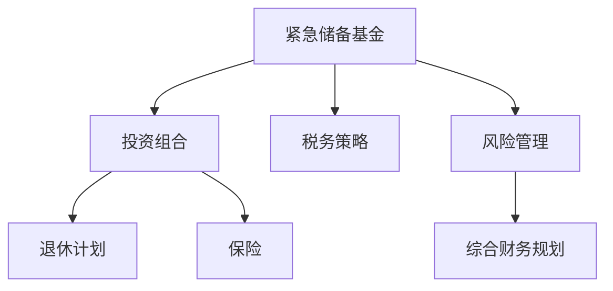

                 

# 程序员的财务规划：从入门到精通

> 关键词：财务规划, 程序员, 投资, 退休计划, 税务策略, 保险

## 1. 背景介绍

### 1.1 问题由来
程序员作为高技能人才，虽然通常具有较高的收入水平，但面对生活成本的上升和未来的不确定性，如何进行有效的财务规划变得尤为重要。很多程序员由于缺乏专业的财务知识，往往陷入盲目消费、理财不足的困境。本文将深入探讨程序员的财务规划，帮助读者从入门到精通，实现财富自由。

### 1.2 问题核心关键点
程序员的财务规划主要关注以下几个方面：

- 如何建立紧急储备基金，以应对突发事件。
- 如何选择适合的投资组合，实现财富增值。
- 如何进行有效的退休计划，保证未来的生活品质。
- 如何制定税务策略，最大程度地减少税费支出。
- 如何配置保险，保障家庭和自身的安全。

## 2. 核心概念与联系

### 2.1 核心概念概述

为了更好地理解程序员的财务规划，本节将介绍几个核心概念及其相互关系：

- **紧急储备基金**：指用于应对突发事件的储备资金，一般建议维持3-6个月的生活开支。
- **投资组合**：指由多种不同风险和收益的投资产品组成的资产组合，包括股票、债券、基金等。
- **退休计划**：指为未来的退休生活预先进行的财务规划和储蓄计划，常见的有401(k)、IRA等。
- **税务策略**：指通过合法的方式规避或减少税费支出，提升财务净值。
- **保险**：指通过购买保险产品，转移风险，保障家庭和自身安全。

这些概念之间的关系可以通过以下Mermaid流程图来展示：



该流程图展示了几大财务规划概念之间的逻辑关系：紧急储备基金是财务规划的基础，投资组合用于财富增值，退休计划保障未来的生活品质，税务策略和保险是提升财务净值和风险管理的重要手段，最终形成一个综合的财务规划体系。

## 3. 核心算法原理 & 具体操作步骤
### 3.1 算法原理概述

程序员的财务规划，本质上是一个优化问题。通过对紧急储备基金、投资组合、退休计划、税务策略和保险等要素的合理配置，最大化财务净值和风险控制，最终实现财务自由。其核心算法原理包括：

- **效用函数**：将各项财务指标映射为效用值，用于衡量整体财务状况。
- **风险偏好度量**：通过问卷调查或心理测试，评估个人的风险偏好程度。
- **优化目标**：最大化财务净值，同时控制风险。
- **约束条件**：包括紧急储备基金规模、投资组合分散度、税务合规性等。

### 3.2 算法步骤详解

基于上述原理，程序员的财务规划可以分解为以下关键步骤：

**Step 1: 评估财务现状**

1. 编制资产负债表，明确当前财务状况。
2. 统计月度开支，评估应急储备需求。
3. 评估风险偏好，确定投资和保险的配置比例。

**Step 2: 设定财务目标**

1. 短期目标：包括紧急储备基金建设、债务偿还等。
2. 中期目标：包括投资组合配置、教育费用规划等。
3. 长期目标：包括退休规划、房产购置等。

**Step 3: 制定财务策略**

1. **紧急储备基金**：设定目标规模，按月存入，保证应急需求。
2. **投资组合**：根据风险偏好，选择股票、债券、基金等产品，合理分散风险。
3. **退休计划**：计算退休所需资金，选择合适的退休账户，定期投资。
4. **税务策略**：优化收入结构，合理配置资产，规避高税负。
5. **保险配置**：购买合适的寿险、重疾险、意外险等，转移风险。

**Step 4: 定期监控和调整**

1. 每月审视财务状况，评估投资回报和风险控制情况。
2. 根据市场变化和个人生活状态调整策略。
3. 定期进行税务规划，确保税务合规。

### 3.3 算法优缺点

程序员财务规划的优点：

1. 整体性：通过综合考虑紧急储备基金、投资组合、退休计划等要素，形成全面财务规划。
2. 动态性：定期监控和调整策略，适应市场和个人生活变化。
3. 可操作性强：各步骤操作详细，便于执行和实施。

缺点：

1. 复杂性：涉及多个要素和策略，需要较高的时间和经济成本。
2. 专业性要求高：需要具备一定的财务知识，否则容易陷入盲目决策。
3. 调整难度大：市场和政策变化迅速，策略调整需要灵活应对。

### 3.4 算法应用领域

程序员的财务规划可以应用于各种个人和家庭场景，如：

- **职业发展**：选择收入稳定、增长潜力大的职业路径，提升财务状况。
- **房产购置**：规划购房时间、贷款比例，确保财务健康。
- **子女教育**：规划教育费用，建立专项基金，保障子女教育。
- **养老规划**：提前进行退休规划，确保生活质量不因退休而下降。
- **税务筹划**：合理规划收入和资产配置，减少税费支出。

## 4. 数学模型和公式 & 详细讲解 & 举例说明

### 4.1 数学模型构建

本节将使用数学语言对程序员财务规划进行更加严格的刻画。

假设程序员的月收入为 $I$，月开支为 $C$，紧急储备基金目标为 $E$，年投资回报率为 $r$，退休目标金额为 $T$，年通货膨胀率为 $\pi$。

**紧急储备基金模型**：
$$
E = \frac{C}{r} \left(\frac{1 - (1 + r)^{-\frac{t}{12}}}{1 - (1 + r)^{-1}}
$$
其中 $t$ 为紧急储备基金建设周期（月数）。

**投资组合模型**：
$$
V = E \left(\frac{1 - (1 + r)^{-\frac{t}{12}}}{1 - (1 + r)^{-1}}
$$
$$
r = \frac{1 + R_1 - (1 + R_2)}{1 + R_2}
$$
其中 $R_1$ 为投资组合中风险资产的回报率，$R_2$ 为无风险资产的回报率。

**退休计划模型**：
$$
T = \frac{V}{(1 + r)^{\frac{t}{12}}}
$$
$$
S = \frac{T}{\frac{Y}{1 + \pi}}
$$
其中 $Y$ 为退休后的年开支，$\pi$ 为年通货膨胀率。

**税务策略模型**：
$$
T_{\text{tax}} = \frac{I - C}{1 - t}
$$
其中 $t$ 为边际税率。

**保险配置模型**：
$$
P = \frac{E}{p}
$$
其中 $p$ 为保险产品的年保费。

### 4.2 公式推导过程

以下我们以紧急储备基金和投资组合为例，推导相关公式。

**紧急储备基金**：

假设紧急储备基金建设周期为 $t$ 个月，月收入为 $I$，月开支为 $C$，投资回报率为 $r$。根据资金流向，有：

$$
\text{紧急储备基金总成本} = C \times t
$$

每月从收入中存储 $x$ 元，则 $t$ 个月后，紧急储备基金总额为：

$$
E = x \times \frac{1 - (1 + r)^{-t}}{r}
$$

**投资组合**：

假设投资组合中风险资产占比为 $\alpha$，无风险资产占比为 $1-\alpha$。则组合的预期回报率 $r$ 为：

$$
r = \alpha \times R_1 + (1 - \alpha) \times R_2
$$

其中 $R_1$ 为风险资产的平均回报率，$R_2$ 为无风险资产的回报率。

假设初始投资额为 $V_0$，则 $t$ 个月后的投资组合价值 $V$ 为：

$$
V = V_0 \times (1 + r)^t
$$

将 $r$ 代入上式，得：

$$
r = \frac{1 + R_1 - (1 + R_2)}{1 + R_2}
$$

### 4.3 案例分析与讲解

**案例分析**：

假设某程序员月收入 $I=10000$ 元，月开支 $C=5000$ 元，紧急储备基金目标 $E=30000$ 元，年投资回报率 $r=8\%$，投资组合中风险资产占比 $\alpha=0.7$。

1. **紧急储备基金计算**：
   $$
   E = \frac{5000 \times 36}{0.08} \times \left(\frac{1 - (1 + 0.08)^{-36}}{1 - (1 + 0.08)^{-1}}\right) \approx 29999
   $$

2. **投资组合计算**：
   $$
   r = \frac{1 + 0.1 - (1 + 0.02)}{1 + 0.02} \approx 0.096
   $$
   假设初始投资额 $V_0=100000$ 元，则 $t=12$ 个月后的投资组合价值为：
   $$
   V = 100000 \times (1 + 0.096)^12 \approx 180921
   $$

通过以上计算，可以评估紧急储备基金和投资组合的配置情况，进一步优化财务策略。

## 5. 项目实践：代码实例和详细解释说明

### 5.1 开发环境搭建

在进行财务规划实践前，我们需要准备好开发环境。以下是使用Python进行财务规划的环境配置流程：

1. 安装Anaconda：从官网下载并安装Anaconda，用于创建独立的Python环境。

2. 创建并激活虚拟环境：
```bash
conda create -n fin-env python=3.8 
conda activate fin-env
```

3. 安装必要的Python库：
```bash
conda install pandas numpy sympy matplotlib
```

4. 安装相关的财务规划库：
```bash
pip install financial-py ninja-py
```

完成上述步骤后，即可在`fin-env`环境中开始财务规划实践。

### 5.2 源代码详细实现

**紧急储备基金计算函数**：
```python
from sympy import symbols, Rational

def emergency_fund(cost, target, growth_rate, months):
    r = growth_rate
    target_cost = cost * months
    emergency_fund = target_cost * (1 - (1 + r)**(-months)) / r
    return emergency_fund
```

**投资组合价值计算函数**：
```python
def investment_value(initial_value, risk_rate, risk_weight, safe_rate):
    risk_rate = risk_rate + safe_rate
    safe_rate = safe_rate * (1 - risk_weight)
    return initial_value * (1 + (risk_rate * risk_weight + safe_rate * (1 - risk_weight))**months)
```

**投资组合回报率计算函数**：
```python
def portfolio_return(risk_rate, safe_rate, risk_weight):
    return (1 + risk_rate - (1 + safe_rate)) / (1 + safe_rate)
```

**测试函数**：
```python
months = 12
cost = 5000
target = 30000
growth_rate = Rational(8, 100)
risk_weight = Rational(7, 10)
initial_value = 100000
risk_rate = Rational(10, 100)
safe_rate = Rational(2, 100)

emergency_fund_amount = emergency_fund(cost, target, growth_rate, months)
portfolio_value = investment_value(initial_value, risk_rate, risk_weight, safe_rate)
portfolio_return_rate = portfolio_return(risk_rate, safe_rate, risk_weight)

print(f"紧急储备基金目标金额: {emergency_fund_amount}")
print(f"投资组合价值: {portfolio_value}")
print(f"投资组合回报率: {portfolio_return_rate}")
```

### 5.3 代码解读与分析

**紧急储备基金计算函数**：
- 接收参数包括月度开支、目标金额、投资回报率和建设周期。
- 计算目标成本，然后根据紧急储备基金的目标规模，求解每月需要存储的金额。

**投资组合价值计算函数**：
- 接收参数包括初始投资额、风险资产的回报率、风险资产的权重和无风险资产的回报率。
- 先计算组合的预期回报率，再根据初始投资额和预期回报率，求解投资组合价值。

**投资组合回报率计算函数**：
- 接收参数包括风险资产的回报率、无风险资产的回报率和风险资产的权重。
- 计算组合的预期回报率。

**测试函数**：
- 定义了月度开支、目标金额、投资回报率、风险资产权重、无风险资产回报率和初始投资额等参数。
- 计算紧急储备基金的目标金额和投资组合的价值和回报率，并打印输出。

以上代码实现了简单的紧急储备基金和投资组合计算，体现了财务规划的核心思想。实际应用中，可以结合更复杂的模型和更多的要素，进行全面的财务规划。

## 6. 实际应用场景
### 6.1 应急储备基金建立

应急储备基金是程序员财务规划的基础。面对不可预测的突发事件，如失业、医疗危机等，应急储备基金可以提供必要的经济保障。建立应急储备基金的步骤如下：

1. **评估当前开支**：统计月度开支，确保能覆盖3-6个月的生活费用。
2. **设定目标金额**：根据开支水平，设定应急储备基金的目标金额。
3. **定期存储**：每月固定比例的收入存入应急储备基金，确保目标金额的逐步积累。

### 6.2 投资组合配置

投资组合是程序员实现财富增值的重要手段。通过合理配置风险资产和无风险资产，可以实现收益与风险的平衡。配置投资组合的步骤如下：

1. **评估风险偏好**：通过问卷或心理测试，评估个人的风险偏好程度。
2. **选择投资产品**：根据风险偏好，选择合适的股票、债券、基金等产品。
3. **分散风险**：通过分散投资，降低单一资产的风险。
4. **定期调整**：根据市场变化和个人需求，定期调整投资组合，优化配置比例。

### 6.3 退休计划规划

退休计划是程序员财务规划的长期目标。通过提前规划，确保退休后的生活品质。规划退休计划的步骤如下：

1. **评估未来开支**：估算退休后的年开支，包括生活费、医疗费等。
2. **计算退休目标金额**：根据退休后的年开支和预期寿命，计算退休目标金额。
3. **选择退休账户**：选择合适的退休账户，如401(k)、IRA等。
4. **定期投资**：根据退休计划的目标金额，计算每月需要投资的金额，确保退休目标的实现。

### 6.4 税务策略优化

税务策略是程序员财务规划的重要组成部分。通过合理规划，可以最大程度地减少税费支出，提升财务净值。优化税务策略的步骤如下：

1. **评估税费情况**：评估当前收入、开支和税费情况，找出高税负的环节。
2. **选择税务优化方案**：根据税法规定，选择合理的税务优化方案，如合法避税、延迟纳税等。
3. **定期调整**：根据个人和家庭的财务状况变化，定期调整税务策略，确保最优税负。

### 6.5 保险配置

保险是程序员财务规划的重要保障。通过购买合适的保险产品，可以转移风险，保障家庭和自身的安全。配置保险的步骤如下：

1. **评估保险需求**：评估家庭和自身面临的风险类型和保险需求。
2. **选择保险产品**：根据保险需求，选择合适的寿险、重疾险、意外险等产品。
3. **定期评估**：根据家庭和自身的变化，定期评估保险需求，调整保险配置。

## 7. 工具和资源推荐
### 7.1 学习资源推荐

为了帮助程序员系统掌握财务规划的知识，这里推荐一些优质的学习资源：

1. **《财务自由之路》**：讲解了财务规划的基础知识、投资策略、税务筹划等，适合初学者。
2. **《聪明的投资者》**：提供了经典的投资理念和方法，适合进阶学习。
3. **Coursera《金融市场》课程**：由耶鲁大学教授讲解，涵盖金融市场基础知识和投资策略，适合线上学习。
4. **Khan Academy《经济学》课程**：提供免费的经济学知识，帮助理解财务规划的经济学背景。
5. **《富爸爸穷爸爸》**：提供了财务管理的基本原则和实践建议，适合快速入门。

通过这些资源的学习实践，相信程序员可以系统掌握财务规划的理论基础和实际操作技巧，提升财务管理能力。

### 7.2 开发工具推荐

高效的财务规划离不开优秀的工具支持。以下是几款用于财务规划开发的常用工具：

1. **Python**：功能强大的编程语言，适合进行复杂的财务模型和算法开发。
2. **Excel**：简单易用的表格工具，适合进行基本财务分析和规划。
3. **Google Sheets**：基于云的表格工具，适合多人协作和数据共享。
4. **Quicken**：家庭财务管理软件，适合全面的家庭财务管理。
5. **Personal Capital**：在线财务管理工具，提供资产管理、预算规划等功能。

合理利用这些工具，可以显著提升程序员财务规划的效率和效果，更好地进行财务规划和管理。

### 7.3 相关论文推荐

程序员的财务规划涉及多学科知识，以下是几篇经典的相关论文，推荐阅读：

1. **《财务规划与投资策略》**：介绍财务规划的基本框架和方法，涵盖紧急储备基金、投资组合、退休计划、税务策略等。
2. **《金融市场与投资组合理论》**：提供现代投资组合理论的基础知识和方法，适合深入理解投资组合的优化策略。
3. **《税务规划与合规》**：讲解税务规划的原理和实践，涵盖避税、延迟纳税等策略。
4. **《保险数学》**：提供保险产品和风险管理的数学模型和方法，适合理解保险产品的定价和配置。

这些论文代表了大模型微调技术的发展脉络。通过学习这些前沿成果，可以帮助程序员把握学科前进方向，激发更多的创新灵感。

## 8. 总结：未来发展趋势与挑战

### 8.1 总结

本文对程序员的财务规划进行了全面系统的介绍。首先阐述了财务规划的背景和意义，明确了财务规划在提升程序员财富自由道路上的重要价值。其次，从原理到实践，详细讲解了紧急储备基金、投资组合、退休计划、税务策略和保险等核心要素，给出了财务规划任务开发的完整代码实例。同时，本文还广泛探讨了财务规划在职业发展、房产购置、子女教育、养老规划等诸多场景中的应用前景，展示了财务规划范式的巨大潜力。最后，精选了财务规划技术的各类学习资源，力求为程序员提供全方位的技术指引。

通过本文的系统梳理，可以看到，程序员的财务规划不仅关系到个人财富的积累，更是职业发展、家庭幸福的重要保障。掌握财务规划的精髓，让程序员在职业道路上更加稳健和自信，迎接未来的挑战。

### 8.2 未来发展趋势

展望未来，程序员的财务规划将呈现以下几个发展趋势：

1. **智能化管理**：结合人工智能和大数据分析技术，提供个性化的财务规划建议，提高规划效率和准确性。
2. **自动化操作**：通过机器人财务顾问(RoBo-Advisors)等工具，自动执行财务规划策略，提升管理效率。
3. **透明化**：利用区块链等技术，提升财务数据的透明度和安全性，保障用户隐私和数据安全。
4. **全球化**：结合全球金融市场，提供多元化的投资和理财方案，提升全球资产配置能力。
5. **可持续发展**：关注环境、社会和治理(ESG)因素，选择绿色投资和可持续理财方案，支持可持续发展。

以上趋势凸显了程序员财务规划技术的发展方向，这些方向的探索发展，必将进一步提升程序员财务管理的智能化和自动化水平，实现财务规划的全面升级。

### 8.3 面临的挑战

尽管程序员财务规划技术已经取得了显著进展，但在迈向更加智能化、普适化应用的过程中，仍面临诸多挑战：

1. **数据获取与处理**：财务规划需要大量历史数据和实时数据，数据获取和处理成本较高。
2. **模型复杂性**：随着规划要素的增加，模型的复杂度也随之增加，计算量和工作量巨大。
3. **个性化需求**：程序员个体差异较大，难以实现完全个性化的财务规划。
4. **市场波动**：金融市场变化迅速，财务规划模型需要及时更新和调整。
5. **伦理与隐私**：财务规划涉及大量敏感数据，如何保护用户隐私和数据安全，是一个重要挑战。

正视财务规划面临的这些挑战，积极应对并寻求突破，将有助于程序员财务规划技术的进一步成熟和完善。相信随着技术的不断进步，程序员的财务规划将变得更加智能化、自动化和普适化，为程序员的职业发展和家庭幸福提供更加坚实的保障。

### 8.4 未来突破

面对程序员财务规划面临的种种挑战，未来的研究需要在以下几个方面寻求新的突破：

1. **数据驱动与机器学习**：利用大数据和机器学习技术，从海量数据中提取有价值的信息，提供个性化的财务规划建议。
2. **分布式计算与云计算**：利用分布式计算和云计算技术，提高数据处理和模型训练的效率，降低计算成本。
3. **跨学科融合**：结合金融学、经济学、管理学等学科知识，提供全面的财务规划解决方案。
4. **隐私保护技术**：利用区块链、加密技术等手段，保护用户隐私和数据安全，提升财务规划的可信度。
5. **可持续发展模型**：引入可持续发展理念，构建绿色、可持续的财务规划模型，支持全球经济可持续发展。

这些研究方向的探索，必将引领程序员财务规划技术迈向更高的台阶，为程序员的职业发展和家庭幸福提供更加坚实的保障。面向未来，程序员财务规划技术还需要与其他人工智能技术进行更深入的融合，如知识表示、因果推理、强化学习等，多路径协同发力，共同推动程序员财务规划技术的进步。只有勇于创新、敢于突破，才能不断拓展程序员财务规划的边界，让程序员在职业道路上更加稳健和自信，迎接未来的挑战。

## 9. 附录：常见问题与解答

**Q1：什么是紧急储备基金？**

A: 紧急储备基金指用于应对突发事件的储备资金，一般建议维持3-6个月的生活开支。

**Q2：如何进行有效的税务规划？**

A: 税务规划的关键在于合法避税和延迟纳税。通过优化收入结构，合理配置资产，利用税收优惠政策，最大程度地减少税费支出。

**Q3：如何选择适合的保险产品？**

A: 选择合适的保险产品需评估家庭和自身的风险需求，选择覆盖面广、保障性强的保险产品，如寿险、重疾险、意外险等。

**Q4：程序员的退休计划如何制定？**

A: 制定退休计划需评估未来的生活开支，计算退休目标金额，选择合适的退休账户，定期投资，确保退休生活的财务保障。

**Q5：如何评估财务规划的效果？**

A: 评估财务规划的效果主要通过财务指标，如紧急储备基金规模、投资回报率、退休目标实现度等。定期进行财务评估和调整，确保财务规划目标的实现。

---

作者：禅与计算机程序设计艺术 / Zen and the Art of Computer Programming

