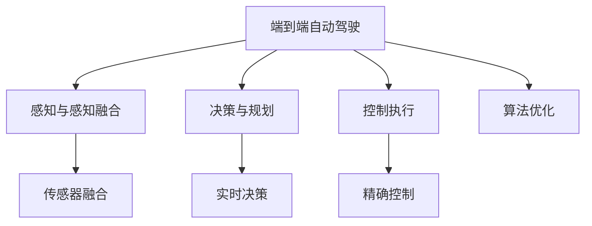

                 

# 端到端自动驾驶的赛道格局分析

## 1. 背景介绍

### 1.1 问题由来
随着科技的不断进步，自动驾驶技术逐渐从科幻走向现实，成为了全球汽车、科技公司和初创企业的热门赛道。自动驾驶不仅能提升交通安全，还能解放驾驶者的时间，具有巨大的商业价值。然而，自动驾驶技术复杂度高，涉及感知、决策、执行等多个子系统，目前仍面临诸多技术挑战和法律法规限制。本文旨在从技术、应用、法规等多个角度，对端到端自动驾驶的赛道格局进行详细分析。

### 1.2 问题核心关键点
端到端自动驾驶是指从传感器数据采集、环境感知、路径规划到车辆控制的完整闭环系统，最终实现无人驾驶。其核心关键点包括：

- 传感器融合：将多种传感器数据进行综合处理，提升感知能力。
- 环境感知：对动态和静态环境进行精确理解和建模。
- 决策与规划：根据感知结果，进行目标识别和路径规划。
- 控制执行：实现车辆精确控制，保证系统安全稳定。
- 算法优化：不断提升各个子系统的性能和效率。

本文将重点探讨这些关键点的技术现状和未来趋势，并分析不同企业、研发方向在赛道中的竞争格局。

## 2. 核心概念与联系

### 2.1 核心概念概述

为更好地理解端到端自动驾驶的赛道格局，本节将介绍几个密切相关的核心概念：

- 端到端自动驾驶(End-to-End Autonomous Driving)：指从数据采集到最终控制执行的闭环系统，能够实现无人驾驶。
- 感知与感知融合(Sensing and Perception Fusion)：通过融合摄像头、激光雷达、雷达等多种传感器数据，实现对环境的全面理解。
- 决策与规划(Decision and Path Planning)：对环境动态变化进行实时决策，生成最优行驶路径。
- 控制执行(Control Execution)：通过高精度控制算法，实现车辆准确无误的行驶。
- 算法优化(Algorithm Optimization)：持续改进和优化各个子系统的算法和模型，提升系统性能。

这些概念之间的逻辑关系可以通过以下Mermaid流程图来展示：



这个流程图展示了一个端到端自动驾驶系统的核心组件及其关联关系：

1. 感知与感知融合模块对多种传感器数据进行整合，构建高精度的环境模型。
2. 决策与规划模块根据环境模型进行实时决策和路径规划，生成最优路径。
3. 控制执行模块通过控制算法实现车辆精确控制，保证行驶安全。
4. 算法优化模块持续改进模型和算法，提升系统性能。

## 3. 核心算法原理 & 具体操作步骤
### 3.1 算法原理概述

端到端自动驾驶的实现依赖于多种先进算法和技术，主要包括：

- 深度学习：用于图像处理、目标检测、语义分割等感知任务。
- 强化学习：用于决策和路径规划，通过试错训练生成最优策略。
- 控制理论：用于车辆控制和稳定性分析，确保驾驶安全。
- 多传感器融合：将不同传感器数据进行整合，提升感知能力。

这些算法和技术相互配合，构成一个复杂的自动化系统。

### 3.2 算法步骤详解

端到端自动驾驶的实现一般包括以下几个关键步骤：

**Step 1: 传感器数据采集**
- 收集车辆周围环境的各类传感器数据，包括摄像头、雷达、激光雷达等。
- 对传感器数据进行同步和预处理，去除噪声和异常值。

**Step 2: 环境感知与感知融合**
- 使用深度学习模型对传感器数据进行处理，识别出环境中的目标、道路、交通标志等。
- 对不同传感器的数据进行融合，提高感知精度和鲁棒性。
- 构建高精度的环境地图和语义分割图。

**Step 3: 决策与路径规划**
- 使用强化学习模型进行实时决策，包括目标跟踪、避障、路径规划等。
- 根据当前环境和目标，生成最优行驶路径。
- 考虑交通法规、动态变化和风险评估，优化决策策略。

**Step 4: 控制执行**
- 使用控制算法对车辆进行精确控制，包括转向、加速、刹车等操作。
- 确保车辆在规定时间内到达目标位置，保持安全距离和速度。
- 采用高精度导航和传感器校正技术，保证控制精度。

**Step 5: 算法优化与迭代改进**
- 定期进行系统测试和评估，收集数据并分析性能瓶颈。
- 改进和优化各个子系统的算法和模型，提升系统性能和稳定性。
- 引入新的传感器和计算硬件，提高感知能力和计算速度。

以上是端到端自动驾驶实现的一般流程。在实际应用中，还需要根据具体场景进行优化和定制，确保系统可靠性和鲁棒性。

### 3.3 算法优缺点

端到端自动驾驶的算法具有以下优点：
1. 高度集成化：从感知到控制的完整闭环系统，减少了信息传递环节，提高了效率。
2. 适应性强：能够处理各种复杂环境，提高驾驶安全性和鲁棒性。
3. 实时性强：通过优化算法和硬件，能够实现快速决策和精确控制。
4. 数据驱动：通过大量数据训练模型，能够不断提升系统性能。

同时，该算法也存在以下缺点：
1. 数据需求高：需要大量的传感器数据和标注数据，数据采集成本较高。
2. 技术难度大：涉及深度学习、强化学习、控制理论等多个领域，技术门槛较高。
3. 系统复杂：子系统数量多，交互复杂，容易出现故障和问题。
4. 法规限制多：需要符合各国交通法规，增加了系统实现的难度。

尽管存在这些局限性，但端到端自动驾驶的算法已经在诸多应用中取得了显著成效，成为无人驾驶技术的重要发展方向。

### 3.4 算法应用领域

端到端自动驾驶的算法已经广泛应用于多种场景，如：

- 城市道路驾驶：在城市复杂交通环境中，实现无人驾驶车辆的安全行驶。
- 高速公路驾驶：在高速公路上，实现高速行驶和高精度控制。
- 自动泊车：通过环境感知和路径规划，实现车辆的自主泊车。
- 物流配送：在封闭的物流园区内，实现无人驾驶车辆的货物配送。
- 城市公交系统：在固定线路上，实现无人驾驶公交车的运行。
- 特种车辆：如无人消防车、无人安防车等，实现特殊环境下的自动驾驶。

除了这些传统应用场景，端到端自动驾驶的算法还在不断拓展，应用于更多新兴领域，如智能停车场、无人船只、无人机等领域，推动智能交通的全面发展。

## 4. 数学模型和公式 & 详细讲解 & 举例说明

### 4.1 数学模型构建

在端到端自动驾驶中，感知与感知融合、决策与路径规划等模块通常使用数学模型进行描述。以基于深度学习的感知任务为例，其数学模型可以表示为：

$$
f(x;\theta) = M(x;\theta)
$$

其中，$x$为输入的传感器数据，$\theta$为模型参数，$M$为深度学习模型（如卷积神经网络CNN、循环神经网络RNN等）。

### 4.2 公式推导过程

以目标检测任务为例，其数学模型可以通过监督学习方法进行推导。假设输入为图像$x$，输出为检测到的目标位置和类别。目标检测的数学模型可以表示为：

$$
\hat{y} = f(x;\theta) = \max\limits_{i}(z_i(x;\theta))
$$

其中，$z_i(x;\theta)$表示模型在位置$i$处的置信度，$y$为真实目标位置和类别。

通过最小化损失函数$\mathcal{L}(y,\hat{y})$，可以训练出最优的模型参数$\theta$：

$$
\theta^* = \mathop{\arg\min}_{\theta} \mathcal{L}(y,\hat{y})
$$

常见的目标检测损失函数包括交叉熵损失和Smooth L1损失。这些损失函数可以通过反向传播算法计算梯度，实现参数的更新和优化。

### 4.3 案例分析与讲解

假设我们有一个基于深度学习的目标检测模型，用于检测道路上的行人。模型输入为一张车辆摄像头拍摄的图像$x$，输出为检测到的行人位置和类别。具体推导过程如下：

1. 数据集准备：收集包含行人图像的数据集$D=\{(x_i,y_i)\}_{i=1}^N$，其中$x_i$为图像，$y_i$为行人位置和类别。

2. 模型构建：使用深度学习框架（如TensorFlow、PyTorch）搭建CNN模型，包含卷积层、池化层、全连接层等。

3. 损失函数定义：定义目标检测任务的损失函数，如交叉熵损失：

$$
\mathcal{L}(y,\hat{y}) = -\sum_i y_i\log \hat{y}_i
$$

4. 模型训练：通过反向传播算法计算梯度，最小化损失函数，更新模型参数$\theta$。

5. 模型评估：在测试集上评估模型性能，计算准确率、召回率、F1-score等指标。

通过上述步骤，我们可以训练出一个高性能的目标检测模型，实现对道路行人的实时检测。

## 5. 项目实践：代码实例和详细解释说明

### 5.1 开发环境搭建

在进行端到端自动驾驶项目实践前，我们需要准备好开发环境。以下是使用Python进行TensorFlow开发的环境配置流程：

1. 安装Anaconda：从官网下载并安装Anaconda，用于创建独立的Python环境。

2. 创建并激活虚拟环境：
```bash
conda create -n tensorflow-env python=3.8 
conda activate tensorflow-env
```

3. 安装TensorFlow：根据CUDA版本，从官网获取对应的安装命令。例如：
```bash
conda install tensorflow tensorflow-gpu -c conda-forge -c pypi
```

4. 安装PIL和numpy等依赖库：
```bash
pip install Pillow numpy
```

5. 安装TensorFlow Model Zoo：
```bash
git clone https://github.com/tensorflow/models.git
cd models/research/object_detection
pip install .
```

完成上述步骤后，即可在`tensorflow-env`环境中开始项目实践。

### 5.2 源代码详细实现

下面以目标检测任务为例，给出使用TensorFlow实现目标检测的代码实现。

```python
import tensorflow as tf
import cv2
import numpy as np
import tensorflow.keras as keras
from object_detection.utils import label_map_util
from object_detection.utils import visualization_utils as vis_util

# 加载模型和标签映射
model = tf.keras.models.load_model('path_to_model.h5')
label_map = label_map_util.load_labelmap('path_to_labelmap.pbtxt')
categories = label_map_util.convert_label_map_to_categories(label_map, max_num_classes=90, use_display_name=True)
category_index = label_map_util.create_category_index(categories)

# 加载图像并进行预处理
image = cv2.imread('path_to_image.jpg')
image_np = cv2.cvtColor(image, cv2.COLOR_BGR2RGB)
image_np_expanded = np.expand_dims(image_np, axis=0)

# 使用模型进行目标检测
detections = model.predict(image_np_expanded)
detections = np.squeeze(detections, axis=0)
detection_classes = detections[:, 0].astype(np.int32)

# 可视化检测结果
vis_util.visualize_boxes_and_labels_on_image_array(
    image_np,
    detections,
    category_index,
    use_normalized_coordinates=True,
    line_thickness=8)
```

### 5.3 代码解读与分析

让我们再详细解读一下关键代码的实现细节：

1. 加载模型和标签映射：
   - 使用TensorFlow的`load_model`函数加载预训练的深度学习模型。
   - 加载标签映射文件，生成类别索引。

2. 加载图像并预处理：
   - 使用OpenCV库加载图像，并进行颜色空间转换。
   - 使用`expand_dims`函数将图像转换为符合模型输入格式的张量。

3. 进行目标检测：
   - 使用`predict`函数对图像进行目标检测，输出检测结果。
   - 从检测结果中提取类别标签，并进行可视化。

4. 可视化检测结果：
   - 使用`visualize_boxes_and_labels_on_image_array`函数在图像上绘制检测框和标签。

### 5.4 运行结果展示

运行上述代码，即可在图像上绘制出目标检测结果，显示检测到的目标位置和类别。

## 6. 实际应用场景

### 6.1 智能交通管理

端到端自动驾驶技术在智能交通管理中具有广阔应用前景。通过在交通路口部署无人驾驶车辆，可以实现交通流量监控、异常行为检测和交通流预测等功能。在实际应用中，无人驾驶车辆配备多种传感器和计算机视觉系统，能够实时获取交通数据，并通过决策与规划模块生成最优行驶路径，确保交通流畅有序。此外，系统还能与交通管理中心进行通信，实现智能调度，提高城市交通管理效率。

### 6.2 智慧物流

在智慧物流领域，端到端自动驾驶技术可以用于货物运输和仓储管理。无人驾驶货车能够自主规划路线，避开交通拥堵，提升运输效率。无人驾驶叉车能够灵活操作，提高仓储自动化水平。通过这些技术，物流企业可以大幅降低人力成本，提升运输和仓储效率，实现绿色环保。

### 6.3 紧急救援

在紧急救援场景中，端到端自动驾驶技术能够快速响应自然灾害等突发事件。无人驾驶车辆和无人机可以自主搜索和救援，将救援物资和人员迅速送达。此外，系统还能够实时监测环境变化，及时调整救援策略，确保救援行动的安全性和有效性。

### 6.4 未来应用展望

随着端到端自动驾驶技术的不断发展，其在多个领域的应用前景将更加广阔。未来，端到端自动驾驶技术有望在以下方向取得突破：

1. 多模态感知：结合视觉、激光雷达、雷达等多种传感器数据，实现更全面、更精确的环境感知。

2. 实时动态决策：引入强化学习算法，实时优化决策策略，提升系统响应速度和鲁棒性。

3. 模型轻量化：通过模型压缩和优化，降低模型计算量和存储需求，提高系统实时性。

4. 大规模部署：利用云计算和边缘计算技术，实现大规模无人驾驶车辆的统一管理和调度。

5. 伦理道德：引入伦理道德框架，确保无人驾驶系统的安全性、公正性和透明性。

6. 跨领域应用：将无人驾驶技术应用于更多领域，如无人船只、无人飞机等，推动智能化交通的发展。

7. 用户交互：实现更自然的用户交互界面，提升用户体验和系统可用性。

## 7. 工具和资源推荐

### 7.1 学习资源推荐

为了帮助开发者系统掌握端到端自动驾驶的技术基础和实践技巧，这里推荐一些优质的学习资源：

1. Udacity《自动驾驶纳米学位》课程：由谷歌和Udacity联合推出，涵盖自动驾驶的各个核心模块，包括感知、决策和控制等。

2. NVIDIA《自动驾驶深度学习》课程：NVIDIA推出的深度学习课程，介绍了自动驾驶技术的深度学习实现和应用。

3. ArXiv预印本库：包含大量自动驾驶领域的最新研究成果，阅读并理解这些论文，可以帮助你了解前沿技术和趋势。

4. OpenAI《自动驾驶指南》：OpenAI的自动驾驶系列文章，详细介绍了自动驾驶技术的基本概念和实现方法。

5. Google《自动驾驶技术白皮书》：谷歌的自动驾驶技术白皮书，介绍了谷歌在自动驾驶领域的技术积累和未来规划。

通过对这些资源的学习实践，相信你一定能够快速掌握端到端自动驾驶的核心技术，并用于解决实际的自动驾驶问题。

### 7.2 开发工具推荐

高效的开发离不开优秀的工具支持。以下是几款用于端到端自动驾驶开发的常用工具：

1. TensorFlow：由Google主导开发的开源深度学习框架，灵活且功能强大，适用于自动驾驶模型的开发和训练。

2. PyTorch：Facebook开源的深度学习框架，易于使用，支持动态计算图，适用于研究和实验。

3. ROS（Robot Operating System）：一个开源的机器人操作框架，提供了多种传感器和计算机视觉库，方便自动驾驶系统的开发和测试。

4. UGV ROS：基于ROS的无人车平台，提供了多种无人车硬件和传感器，方便自动驾驶系统的集成和调试。

5. OpenCV：开源计算机视觉库，提供了多种图像处理和目标检测算法，方便自动驾驶系统的感知模块开发。

6. Ubuntu：开源Linux发行版，提供了广泛的开发工具和环境支持，适合自动驾驶系统的系统部署。

合理利用这些工具，可以显著提升端到端自动驾驶开发的效率，加快创新迭代的步伐。

### 7.3 相关论文推荐

端到端自动驾驶技术的发展源于学界的持续研究。以下是几篇奠基性的相关论文，推荐阅读：

1. End-to-End Learning for Self-Driving Cars《自驾驶汽车端到端学习》：提出了一种基于深度学习的自动驾驶系统，通过端到端学习实现车辆控制和路径规划。

2. Towards End-to-End Training for Deep Neural Networks with Target-Propagated Losses《目标传播损失的深度神经网络端到端训练》：提出了一种目标传播损失函数，用于训练端到端自动驾驶系统。

3. Multi-Task Learning in Robotics《机器人多任务学习》：提出了一种多任务学习方法，用于训练端到端自动驾驶系统中的感知和决策模块。

4. Deep Learning for Decision Making in Multi-Agent Reinforcement Learning《深度学习在多智能体强化学习中的决策制定》：提出了一种基于深度学习的决策制定方法，用于端到端自动驾驶系统的实时决策。

5. Robotic Reinforcement Learning《机器人强化学习》：提出了一种基于强化学习的机器人控制方法，用于端到端自动驾驶系统的控制执行。

这些论文代表了大规模语言模型微调技术的发展脉络。通过学习这些前沿成果，可以帮助研究者把握学科前进方向，激发更多的创新灵感。

## 8. 总结：未来发展趋势与挑战

### 8.1 总结

本文对端到端自动驾驶的赛道格局进行了全面系统的介绍。首先阐述了端到端自动驾驶的基本概念和技术框架，明确了其在多个场景中的重要价值。其次，从感知、决策、执行等多个角度，详细讲解了端到端自动驾驶的核心算法和实现步骤。最后，分析了端到端自动驾驶在智能交通、物流、紧急救援等领域的实际应用前景，以及未来发展趋势和面临的挑战。

通过本文的系统梳理，可以看到，端到端自动驾驶技术已经在诸多领域展现了巨大的潜力，成为自动驾驶技术的重要发展方向。未来，伴随技术的不断进步和市场的不断扩大，端到端自动驾驶必将在更多的领域大放异彩，深刻影响人类社会的生产生活方式。

### 8.2 未来发展趋势

展望未来，端到端自动驾驶技术将呈现以下几个发展趋势：

1. 技术水平不断提升：随着深度学习、强化学习等技术的发展，端到端自动驾驶系统的性能将不断提升，实现更加复杂、精确的驾驶任务。

2. 应用场景日益丰富：端到端自动驾驶技术将拓展到更多领域，如无人船只、无人飞机等，推动智能化交通的发展。

3. 多模态感知与决策：结合视觉、激光雷达、雷达等多种传感器数据，实现更全面、更精确的环境感知和决策。

4. 模型轻量化与高效化：通过模型压缩和优化，降低模型计算量和存储需求，提高系统实时性。

5. 伦理道德与法律合规：引入伦理道德框架，确保无人驾驶系统的安全性、公正性和透明性，符合各国法律法规要求。

6. 大规模部署与实时性：利用云计算和边缘计算技术，实现大规模无人驾驶车辆的统一管理和调度，确保系统的实时性和可靠性。

以上趋势凸显了端到端自动驾驶技术的广阔前景。这些方向的探索发展，必将进一步提升无人驾驶系统的性能和应用范围，为人类社会的数字化、智能化转型提供新的动力。

### 8.3 面临的挑战

尽管端到端自动驾驶技术已经取得了瞩目成就，但在迈向更加智能化、普适化应用的过程中，它仍面临着诸多挑战：

1. 技术复杂度高：涉及感知、决策、控制等多个子系统，技术门槛较高。

2. 数据需求高：需要大量的传感器数据和标注数据，数据采集成本较高。

3. 系统复杂度高：子系统数量多，交互复杂，容易出现故障和问题。

4. 法规限制多：需要符合各国交通法规，增加了系统实现的难度。

5. 安全性问题：无人驾驶车辆在行驶过程中存在安全隐患，如何确保系统的安全性是一个重要问题。

6. 伦理道德问题：无人驾驶系统的决策过程难以解释，可能引发伦理道德争议。

7. 资源需求高：需要高性能的计算硬件和存储设备，资源成本较高。

尽管存在这些挑战，但端到端自动驾驶技术的不断发展和进步，将逐步解决这些问题，实现更加可靠、高效的无人驾驶系统。

### 8.4 研究展望

面对端到端自动驾驶技术面临的诸多挑战，未来的研究需要在以下几个方面寻求新的突破：

1. 多传感器融合：研究如何高效融合多种传感器数据，提升感知能力。

2. 实时动态决策：研究如何通过强化学习等方法，实现实时动态决策。

3. 模型压缩与优化：研究如何优化模型结构和算法，降低计算量和存储需求。

4. 伦理道德框架：研究如何引入伦理道德框架，确保系统的安全性、公正性和透明性。

5. 跨领域应用：研究如何将无人驾驶技术应用于更多领域，推动智能化交通的发展。

6. 用户交互与界面：研究如何设计更自然的用户交互界面，提升用户体验和系统可用性。

通过这些研究方向的探索，相信端到端自动驾驶技术将实现更加智能、可靠、高效的系统，为人类社会的数字化、智能化转型带来新的机遇。

## 9. 附录：常见问题与解答

**Q1：端到端自动驾驶与传统自动驾驶有何不同？**

A: 端到端自动驾驶是指从感知到控制的全过程闭环系统，不需要人工干预，能够实现完全自主驾驶。相比传统的自动驾驶系统，端到端自动驾驶技术更加复杂和高级，具备更高的自主性和智能化水平。

**Q2：端到端自动驾驶技术面临哪些技术挑战？**

A: 端到端自动驾驶技术面临的主要技术挑战包括：数据需求高、系统复杂度高、法规限制多、安全性问题、伦理道德问题、资源需求高等。这些问题需要技术、法规、伦理等多方面的协同解决。

**Q3：如何提高端到端自动驾驶系统的鲁棒性？**

A: 提高端到端自动驾驶系统的鲁棒性，可以采取以下措施：
1. 多传感器融合：通过融合多种传感器数据，提高感知能力和鲁棒性。
2. 实时动态决策：引入强化学习算法，实现实时动态决策。
3. 模型压缩与优化：通过模型压缩和优化，降低计算量和存储需求，提高系统实时性。
4. 伦理道德框架：引入伦理道德框架，确保系统的安全性、公正性和透明性。
5. 用户交互与界面：设计更自然的用户交互界面，提升用户体验和系统可用性。

这些措施能够有效提高系统的鲁棒性和可靠性，确保其在各种复杂环境下的稳定运行。

**Q4：端到端自动驾驶技术在实际应用中需要注意哪些问题？**

A: 端到端自动驾驶技术在实际应用中需要注意以下问题：
1. 数据采集与标注：确保数据的准确性和多样性，避免数据偏见和过拟合。
2. 模型训练与优化：选择合适的模型和算法，优化模型参数，提高系统性能。
3. 系统测试与评估：进行全面的系统测试，评估模型在各种场景下的表现，确保系统可靠性。
4. 法规与伦理：遵守各国交通法规，引入伦理道德框架，确保系统的安全性、公正性和透明性。
5. 用户体验：设计用户友好的交互界面，提升用户体验和系统可用性。

通过这些措施，可以确保端到端自动驾驶技术在实际应用中达到预期效果，提升系统的性能和用户满意度。

**Q5：端到端自动驾驶技术的未来发展方向是什么？**

A: 端到端自动驾驶技术的未来发展方向包括：
1. 技术水平不断提升：随着深度学习、强化学习等技术的发展，端到端自动驾驶系统的性能将不断提升，实现更加复杂、精确的驾驶任务。
2. 应用场景日益丰富：端到端自动驾驶技术将拓展到更多领域，如无人船只、无人飞机等，推动智能化交通的发展。
3. 多模态感知与决策：结合视觉、激光雷达、雷达等多种传感器数据，实现更全面、更精确的环境感知和决策。
4. 模型轻量化与高效化：通过模型压缩和优化，降低模型计算量和存储需求，提高系统实时性。
5. 伦理道德与法律合规：引入伦理道德框架，确保无人驾驶系统的安全性、公正性和透明性，符合各国法律法规要求。
6. 大规模部署与实时性：利用云计算和边缘计算技术，实现大规模无人驾驶车辆的统一管理和调度，确保系统的实时性和可靠性。

这些发展方向将推动端到端自动驾驶技术的不断进步，为人类社会的数字化、智能化转型提供新的动力。

---

作者：禅与计算机程序设计艺术 / Zen and the Art of Computer Programming

