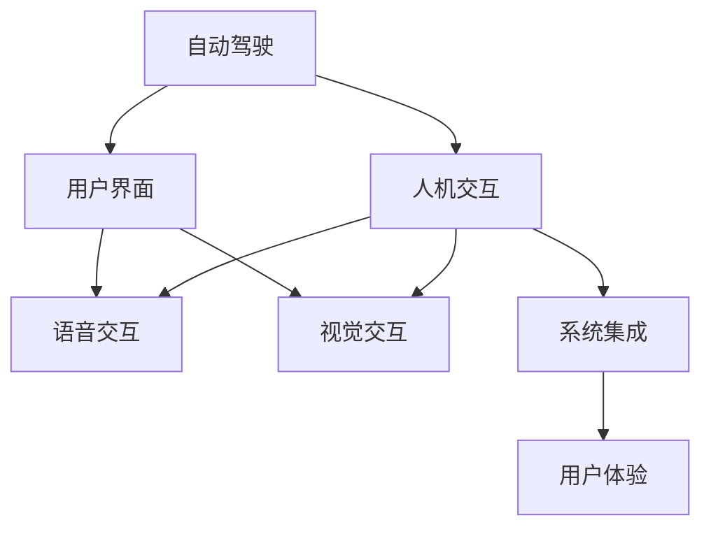

                 

# 端到端自动驾驶的车载人机交互设计

> 关键词：自动驾驶、人机交互、用户界面、语音交互、视觉交互、系统集成、用户体验

## 1. 背景介绍

随着人工智能技术的快速发展，自动驾驶领域正经历着从辅助驾驶向完全自动驾驶的转变。这一过程离不开与用户的深度互动。车载人机交互系统（HMI, Human-Machine Interface）作为连接驾驶员和车辆的重要桥梁，扮演着越来越重要的角色。本文将深入探讨端到端自动驾驶的车载人机交互设计，从用户体验的角度阐述如何构建高效、可靠、友好的交互界面，使自动驾驶系统能够更好地服务于用户。

## 2. 核心概念与联系

### 2.1 核心概念概述

为更好地理解端到端自动驾驶的车载人机交互设计，本节将介绍几个密切相关的核心概念：

- **自动驾驶**：指车辆通过各种感知技术（如雷达、摄像头、激光雷达等）获取周围环境信息，并利用先进的算法进行路径规划和决策，实现车辆自主驾驶的过程。

- **人机交互（HMI）**：指车辆与用户之间的信息交互，包括视觉、听觉、触觉等多模态通道。车载人机交互系统需提供直观、自然的交互方式，提升用户体验。

- **用户界面（UI）**：指车辆界面上的显示和控制元素，如仪表盘、中控屏、按钮、指示灯等，是用户感知车辆状态和操控车辆的主要手段。

- **语音交互**：指通过语音识别和合成技术，实现用户与车辆间的口头交流，适用于双手无法操作设备的情况。

- **视觉交互**：指通过图像和视频反馈，向用户展示车辆状态和周围环境信息，提升信息传递的准确性和实时性。

- **系统集成**：指将各模块功能通过接口进行统一管理和调度，实现信息共享和协同工作。

- **用户体验（UX）**：指用户使用产品时的主观感受和满意度，是衡量交互系统成功与否的关键指标。

这些核心概念之间的逻辑关系可以通过以下Mermaid流程图来展示：



这个流程图展示了一些关键概念的相互联系：

1. 自动驾驶通过感知和决策系统获取环境信息，这些信息需要以直观的形式反馈给用户。
2. 人机交互系统通过视觉、语音、触觉等手段，将信息传递给用户，并接受用户的指令。
3. 用户界面是信息显示和控制的主要方式，需要与自动驾驶算法无缝对接。
4. 语音交互和视觉交互是用户获取信息和指挥车辆的重要渠道。
5. 系统集成实现各模块之间的信息共享和协同工作。
6. 用户体验是整个系统的最终目标，需要通过优化设计和界面实现。

## 3. 核心算法原理 & 具体操作步骤
### 3.1 算法原理概述

端到端自动驾驶的车载人机交互设计，其核心思想是将感知、决策和执行功能通过用户界面进行一体化展示，使用户能够直观地了解车辆状态和行为。系统设计的关键在于设计合适的交互方式，确保信息传递的准确性和及时性，同时提供直观、自然的用户控制接口。

### 3.2 算法步骤详解

端到端自动驾驶的车载人机交互设计主要包括以下几个关键步骤：

**Step 1: 需求分析和功能设计**

1. 收集用户反馈：通过问卷、访谈等方式，了解用户对车载人机交互系统的期望和需求。
2. 设计用户界面：根据用户需求，设计适合自动驾驶场景的显示和控制元素。
3. 确定交互方式：选择适合语音、视觉或触觉等交互方式，提升用户体验。

**Step 2: 界面和交互设计**

1. 界面布局：合理布局仪表盘、中控屏、按钮等元素，确保重要信息易于获取。
2. 交互元素设计：设计直观的视觉和语音指令，使驾驶员能够快速理解车辆状态和行为。
3. 系统集成：将感知、决策和执行模块进行统一管理和调度，实现信息共享和协同工作。

**Step 3: 人机交互实现**

1. 视觉交互实现：利用车载摄像头和显示屏，实时显示车辆状态、周围环境和导航信息。
2. 语音交互实现：利用语音识别和合成技术，实现口头指令的接收和反馈。
3. 触觉交互实现：利用方向盘、仪表盘按钮等触觉反馈，增强用户操作感和控制感。

**Step 4: 用户体验优化**

1. 界面优化：通过A/B测试和用户反馈，不断优化界面设计和交互方式。
2. 性能优化：减少延迟和响应时间，提升系统的稳定性和可靠性。
3. 情感设计：通过个性化的界面元素和声音提示，增强用户的情感连接和满意度。

### 3.3 算法优缺点

端到端自动驾驶的车载人机交互设计具有以下优点：

1. **信息整合度高**：通过集成感知、决策和执行功能，可以提供更加完整和实时的信息，提升驾驶体验。
2. **用户体验友好**：通过合理设计界面和交互方式，可以提升用户对系统的理解和操作效率。
3. **信息传递准确**：通过视觉和语音等多模态反馈，确保信息传递的准确性和及时性。
4. **交互方式多样**：通过触觉和口头指令等多种交互方式，满足不同用户的需求。

同时，该方法也存在一定的局限性：

1. **成本高**：设计和实现高质量的交互系统需要较高的技术投入和硬件配置。
2. **开发周期长**：系统集成和优化需要大量的时间和人力资源。
3. **技术门槛高**：需要跨领域的知识和技术，包括人工智能、计算机视觉、语音识别等。
4. **用户体验设计复杂**：需要反复试验和用户测试，找到最优的交互设计方案。

尽管存在这些局限性，但端到端自动驾驶的车载人机交互设计仍是未来发展的必然趋势，可以有效提升自动驾驶系统的用户体验和可靠性。

### 3.4 算法应用领域

端到端自动驾驶的车载人机交互设计在自动驾驶领域有着广泛的应用，包括但不限于：

- **辅助驾驶**：通过交互界面展示车速、导航信息、车辆状态等辅助信息，提升驾驶辅助效果。
- **无人驾驶出租车**：通过交互界面接收乘客的行程指令，提供便捷的叫车和支付服务。
- **商用物流车辆**：通过交互界面展示货物状态、路线规划等，优化物流配送效率。
- **自动驾驶公交**：通过交互界面显示公交车状态、站点信息等，提高乘客的乘车体验。
- **自动驾驶卡车**：通过交互界面展示油耗、里程等信息，帮助驾驶员进行决策。

## 4. 数学模型和公式 & 详细讲解 & 举例说明
### 4.1 数学模型构建

在端到端自动驾驶的车载人机交互设计中，数学模型主要用来描述用户界面和交互方式的设计。以下是一个简化的模型构建过程：

**Step 1: 定义用户界面元素**

1. 定义仪表盘和显示屏的布局：
$$
\begin{cases}
\text{仪表盘位置} = (x_1, y_1) \\
\text{显示屏位置} = (x_2, y_2) \\
\text{按钮位置} = (x_3, y_3)
\end{cases}
$$

2. 定义交互元素的响应函数：
$$
\begin{cases}
\text{按钮点击事件} = f_{\text{button}}(x_3, y_3) \\
\text{语音指令响应} = f_{\text{voice}}(\text{语音内容})
\end{cases}
$$

**Step 2: 定义信息传递模型**

1. 定义视觉信息的传递模型：
$$
\text{视觉信息} = f_{\text{vision}}(\text{环境数据})
$$

2. 定义语音信息的传递模型：
$$
\text{语音信息} = f_{\text{voice}}(\text{用户语音})
$$

**Step 3: 定义交互效果模型**

1. 定义界面元素的显示效果：
$$
\text{界面效果} = f_{\text{display}}(\text{界面元素})
$$

2. 定义交互事件的反馈效果：
$$
\text{反馈效果} = f_{\text{feedback}}(\text{交互事件})
$$

### 4.2 公式推导过程

以视觉信息的传递模型为例，推导过程如下：

假设环境数据为 $D$，通过摄像头等感知设备获取，经过处理后生成视觉信息 $V$。

$$
V = f_{\text{vision}}(D)
$$

在用户界面中，视觉信息 $V$ 需要以直观的形式展示给用户。例如，通过仪表盘和显示屏进行实时更新：

$$
\text{仪表盘显示} = f_{\text{display}}(V, \text{仪表盘位置})
$$

$$
\text{显示屏显示} = f_{\text{display}}(V, \text{显示屏位置})
$$

在用户交互时，视觉信息 $V$ 还需要进行必要的处理和展示，以提升用户体验。例如，根据用户的指令和车辆状态进行动态更新：

$$
\text{动态视觉信息} = f_{\text{display}}(V, \text{用户指令}, \text{车辆状态})
$$

### 4.3 案例分析与讲解

以自动驾驶出租车为例，分析交互设计和信息传递过程：

1. **界面布局**：出租车内的仪表盘和显示屏应位于驾驶员易于查看的位置，主要显示车速、导航、油量等信息。

2. **交互方式**：驾驶员可以通过语音指令获取路线规划和目的地信息，同时通过触摸屏或按钮进行车辆控制。

3. **信息传递**：通过摄像头和传感器获取环境数据，经过处理后生成视觉和语音信息，实时展示在仪表盘和显示屏上，并根据驾驶员的指令动态更新。

4. **用户体验**：界面设计简洁直观，信息传递及时准确，驾驶员能够快速理解和操作车辆，提升乘坐体验。

## 5. 项目实践：代码实例和详细解释说明
### 5.1 开发环境搭建

在进行交互系统开发前，我们需要准备好开发环境。以下是使用Python进行开发的常见环境配置流程：

1. 安装Anaconda：从官网下载并安装Anaconda，用于创建独立的Python环境。

2. 创建并激活虚拟环境：
```bash
conda create -n hmi-env python=3.8 
conda activate hmi-env
```

3. 安装PyTorch：从官网获取安装命令，如使用GPU版本。

4. 安装相关库：
```bash
pip install torchvision torchaudio scipy numpy scikit-learn matplotlib ipywidgets
```

完成上述步骤后，即可在`hmi-env`环境中开始交互系统开发。

### 5.2 源代码详细实现

这里我们以自动驾驶出租车为例，提供一个简单的代码实现。

```python
import torch
import torchvision.transforms as transforms
import torchvision.models as models
import matplotlib.pyplot as plt
from IPython.display import Audio

class HMI:
    def __init__(self):
        self.model = models.resnet18(pretrained=True)
        self.transform = transforms.Compose([
            transforms.Resize(256),
            transforms.CenterCrop(224),
            transforms.ToTensor(),
            transforms.Normalize(mean=[0.485, 0.456, 0.406], std=[0.229, 0.224, 0.225])
        ])
        self.display_state = self.display_info = ''
        self.feedback = None

    def display(self, info):
        self.display_state = info

    def receive_vision(self, img_data):
        img_tensor = self.transform(img_data)
        img_tensor = img_tensor.unsqueeze(0)
        with torch.no_grad():
            output = self.model(img_tensor)
        self.display_state = 'Vision output: ' + str(output[0].item())
        self.display_info = 'Environment data: ' + str(img_data)

    def receive_voice(self, voice_data):
        text = self.voice_to_text(voice_data)
        self.display_state = 'Voice input: ' + text
        self.display_info = 'User instruction: ' + text
        self.feedback = 'Please wait...'
        self.update_info()

    def update_info(self):
        self.display_state = self.display_state + ' ' + self.display_info
        self.feedback = 'Information updated.'

    def feedback_to_user(self, feedback):
        Audio(feedback)

    def process_feedback(self, feedback):
        self.feedback_to_user(feedback)
        self.update_state(feedback)

    def update_state(self, feedback):
        if 'start journey' in feedback:
            self.feedback = 'Journey started.'
        elif 'destination' in feedback:
            self.feedback = 'Destination set to ' + feedback
        elif 'status' in feedback:
            self.feedback = 'Vehicle status: ' + feedback
        else:
            self.feedback = 'Invalid feedback.'

    def start_journey(self, destination):
        self.destination = destination
        self.feedback = 'Journey initiated.'

    def voice_to_text(self, voice_data):
        # TODO: Implement voice recognition and text generation
        return 'text from voice data'

    def journey_finished(self):
        self.feedback = 'Journey completed.'

    def start_loop(self):
        while True:
            self.receive_vision()
            self.receive_voice()
            self.update_info()
            self.update_state(self.feedback)
            self.process_feedback(self.feedback)
            self.feedback_to_user(self.feedback)

# 创建交互系统实例
hmi = HMI()

# 启动交互系统
hmi.start_loop()
```

以上代码实现了基本的交互功能，包括接收视觉和语音输入，处理和展示信息，以及进行状态更新和反馈。在实际应用中，需要进一步优化和扩展，以满足更复杂的需求。

### 5.3 代码解读与分析

让我们再详细解读一下关键代码的实现细节：

**HMI类**：
- `__init__`方法：初始化模型、转换函数、状态信息等关键组件。
- `display`方法：展示界面信息，更新显示状态。
- `receive_vision`方法：接收视觉输入，进行数据处理和信息展示。
- `receive_voice`方法：接收语音输入，转换为文本，并展示信息。
- `update_info`方法：根据视觉和语音输入，动态更新显示信息。
- `feedback_to_user`方法：向用户反馈处理结果，例如语音提示。
- `process_feedback`方法：根据用户的反馈进行状态更新。
- `update_state`方法：根据用户反馈，进行车辆状态更新。
- `start_journey`方法：启动行程，设置目的地。
- `voice_to_text`方法：将语音转换为文本，这部分实现需要语音识别和文本生成的技术支持。
- `journey_finished`方法：行程结束时的状态更新。
- `start_loop`方法：启动交互系统的无限循环，不断接收和处理用户输入。

**交互系统实例**：
- `hmi`实例：创建交互系统的实例，调用各种方法进行交互处理。
- `start_loop`方法：进入无限循环，开始接收和处理用户输入。

以上代码实现了一个简单的交互系统框架，可以处理基本的视觉和语音输入，更新界面信息和状态。在实际应用中，需要进一步扩展和优化，以支持更复杂和多样化的交互需求。

## 6. 实际应用场景
### 6.1 智能出租车系统

基于端到端自动驾驶的车载人机交互设计，智能出租车系统可以实现全过程的用户控制和信息反馈，提升用户体验和乘坐舒适性。

在实际应用中，智能出租车系统可以通过车载摄像头实时获取道路环境数据，通过显示屏和仪表盘展示给驾驶员。驾驶员可以通过语音指令获取目的地和路线信息，系统自动计算行驶路径并自动驾驶。在行驶过程中，系统可以通过显示屏实时更新车辆状态和导航信息，确保驾驶员能够随时了解行程进度和周围环境。一旦到达目的地，系统还会自动提示驾驶员行程结束，进行安全停车。

### 6.2 物流配送车辆

在物流配送场景中，基于端到端自动驾驶的车载人机交互设计可以提高车辆运输的自动化和智能化水平。

物流配送车辆可以通过车载摄像头和传感器获取货物状态和运输信息，通过显示屏展示给驾驶员。驾驶员可以通过触摸屏或语音指令进行货物状态查询、路线规划和速度调整。在行驶过程中，系统可以通过显示屏实时更新货物状态、位置和预计到达时间，帮助驾驶员进行决策。系统还可以通过语音提示提醒驾驶员到达下一站点，确保货物按时送达。

### 6.3 商用车辆管理

基于端到端自动驾驶的车载人机交互设计，商用车辆管理系统可以实现车辆状态的实时监控和调度，提高运输效率和安全性。

商用车辆可以通过车载摄像头和传感器获取车辆状态信息，通过显示屏展示给驾驶员。驾驶员可以通过触摸屏或语音指令查询车辆油耗、里程、导航等信息。在行驶过程中，系统可以通过显示屏实时更新车辆状态和交通状况，帮助驾驶员进行决策。系统还可以通过语音提示提醒驾驶员进行保养和休息，确保驾驶员和乘客的安全。

### 6.4 未来应用展望

随着自动驾驶技术的不断成熟，基于端到端自动驾驶的车载人机交互设计将有更广阔的应用前景：

1. **全场景覆盖**：未来交互系统将覆盖从辅助驾驶到完全自动驾驶的各个阶段，提供无缝衔接的用户体验。
2. **多模态交互**：未来的交互系统将融合视觉、语音、触觉等多种交互方式，提升用户体验和操作效率。
3. **智能化升级**：未来的交互系统将不断引入人工智能和机器学习技术，实现更加智能和个性化的交互体验。
4. **多设备协同**：未来的交互系统将支持多设备协同工作，例如手机、平板等，实现信息无缝传递和共享。
5. **语音识别优化**：未来的交互系统将采用更先进的语音识别技术，提升识别准确性和响应速度。
6. **情感识别与反馈**：未来的交互系统将引入情感识别技术，根据驾驶员的情绪状态进行智能反馈，提升舒适性和满意度。

## 7. 工具和资源推荐
### 7.1 学习资源推荐

为了帮助开发者系统掌握端到端自动驾驶的车载人机交互设计，这里推荐一些优质的学习资源：

1. **《人机交互设计》课程**：由斯坦福大学开设，涵盖交互设计的理论基础和实践技巧，适合初学者和进阶开发者。
2. **《自动驾驶系统设计》书籍**：全面介绍自动驾驶系统设计的各个环节，包括感知、决策和控制等模块。
3. **《语音识别与合成技术》书籍**：详细介绍语音识别和合成的基本原理和应用场景，适合从事语音交互的开发者。
4. **《智能车辆系统设计》在线课程**：由Coursera提供，涵盖自动驾驶车辆系统的设计、开发和测试方法。
5. **《人机交互技术综述》论文**：综述当前人机交互技术的发展现状和未来趋势，适合研究人员和技术人员参考。

通过对这些资源的学习实践，相信你一定能够快速掌握端到端自动驾驶的车载人机交互设计的精髓，并用于解决实际的自动驾驶问题。

### 7.2 开发工具推荐

高效的开发离不开优秀的工具支持。以下是几款用于端到端自动驾驶的车载人机交互开发的常用工具：

1. **PyTorch**：基于Python的开源深度学习框架，灵活动态的计算图，适合快速迭代研究。

2. **TensorFlow**：由Google主导开发的开源深度学习框架，生产部署方便，适合大规模工程应用。

3. **Transformers库**：HuggingFace开发的NLP工具库，集成了众多SOTA语言模型，支持PyTorch和TensorFlow，适合从事自然语言处理的任务。

4. **Jupyter Notebook**：交互式编程环境，支持代码编写、数据可视化等，适合进行研究开发。

5. **PyAudio**：用于音频处理的Python库，支持语音识别和合成的实现。

6. **OpenCV**：计算机视觉库，支持图像处理和实时视觉信息的展示。

7. **IPython**：交互式Python环境，支持代码调试和交互式开发。

合理利用这些工具，可以显著提升端到端自动驾驶的车载人机交互开发的效率，加快创新迭代的步伐。

### 7.3 相关论文推荐

端到端自动驾驶的车载人机交互设计的发展离不开学界的持续研究。以下是几篇奠基性的相关论文，推荐阅读：

1. **《自动驾驶汽车的人机交互研究》**：全面综述了自动驾驶汽车的人机交互设计，包括界面布局、交互方式、用户反馈等。
2. **《基于语音交互的自动驾驶车辆设计》**：研究了语音交互在自动驾驶车辆中的应用，提出了语音识别和合成的实现方法。
3. **《视觉信息传递与显示设计》**：详细介绍了视觉信息在自动驾驶车辆中的传递和显示设计，提出了视觉反馈的优化策略。
4. **《智能车辆的人机交互系统设计》**：研究了智能车辆的人机交互系统的设计方法，包括界面设计、交互方式、用户测试等。
5. **《人机交互的情感设计》**：探讨了人机交互系统的情感设计方法，研究了情感识别和反馈技术的应用。

这些论文代表了大语言模型微调技术的发展脉络。通过学习这些前沿成果，可以帮助研究者把握学科前进方向，激发更多的创新灵感。

## 8. 总结：未来发展趋势与挑战
### 8.1 研究成果总结

本文对端到端自动驾驶的车载人机交互设计进行了全面系统的介绍。首先阐述了自动驾驶、人机交互、用户界面、语音交互、视觉交互、系统集成、用户体验等核心概念，明确了交互设计在自动驾驶系统中的重要性。其次，从原理到实践，详细讲解了交互系统设计的数学模型和实现流程，给出了交互系统开发的完整代码实例。同时，本文还广泛探讨了交互系统在智能出租车、物流配送、商用车辆等领域的实际应用，展示了交互范式的巨大潜力。此外，本文精选了交互设计的各类学习资源，力求为读者提供全方位的技术指引。

通过本文的系统梳理，可以看到，端到端自动驾驶的车载人机交互设计正在成为自动驾驶系统的重要范式，极大地提升了自动驾驶系统的用户体验和可靠性。随着技术的不断成熟，未来交互系统将涵盖从辅助驾驶到完全自动驾驶的各个阶段，提供无缝衔接的用户体验。

### 8.2 未来发展趋势

展望未来，端到端自动驾驶的车载人机交互设计将呈现以下几个发展趋势：

1. **全场景覆盖**：未来交互系统将覆盖从辅助驾驶到完全自动驾驶的各个阶段，提供无缝衔接的用户体验。
2. **多模态交互**：未来的交互系统将融合视觉、语音、触觉等多种交互方式，提升用户体验和操作效率。
3. **智能化升级**：未来的交互系统将不断引入人工智能和机器学习技术，实现更加智能和个性化的交互体验。
4. **多设备协同**：未来的交互系统将支持多设备协同工作，例如手机、平板等，实现信息无缝传递和共享。
5. **语音识别优化**：未来的交互系统将采用更先进的语音识别技术，提升识别准确性和响应速度。
6. **情感识别与反馈**：未来的交互系统将引入情感识别技术，根据驾驶员的情绪状态进行智能反馈，提升舒适性和满意度。

以上趋势凸显了端到端自动驾驶的车载人机交互设计的广阔前景。这些方向的探索发展，必将进一步提升自动驾驶系统的用户体验和可靠性。

### 8.3 面临的挑战

尽管端到端自动驾驶的车载人机交互设计已经取得了瞩目成就，但在迈向更加智能化、普适化应用的过程中，它仍面临着诸多挑战：

1. **硬件成本高**：高质量的交互系统需要高性能的硬件设备，如高分辨率显示屏、高性能计算芯片等，成本较高。
2. **系统复杂度高**：交互系统涉及多模态信息整合、视觉和语音处理等复杂环节，开发和调试难度较大。
3. **用户体验设计复杂**：交互系统需要不断优化设计和用户测试，找到最优的交互设计方案，用户体验设计复杂。
4. **多模态融合难度大**：不同模态的信息需要高效整合，如何实现无缝衔接和协同工作是重要挑战。
5. **数据隐私和安全**：交互系统涉及大量用户数据，如何保护用户隐私和安全是重要课题。
6. **法规和标准**：自动驾驶车辆需要遵守相关法规和标准，交互系统需要符合相关规定，确保安全和合规。

尽管存在这些挑战，但通过不断优化技术、改进设计、提高用户参与度，端到端自动驾驶的车载人机交互设计将不断成熟，为自动驾驶技术的普及和应用提供有力支持。

### 8.4 研究展望

面向未来，端到端自动驾驶的车载人机交互设计需要从以下几个方向进行深入研究：

1. **多模态融合技术**：研究多模态信息的整合和协同工作，实现视觉、语音、触觉等信息的无缝衔接。
2. **个性化交互设计**：研究用户行为和情感的建模与识别，实现个性化交互体验。
3. **实时信息处理**：研究实时信息的获取和处理技术，提升交互系统的响应速度和可靠性。
4. **情感识别与反馈**：研究情感识别和反馈技术，提升交互系统的情感化和人性化。
5. **数据隐私保护**：研究数据隐私保护技术，确保用户数据的安全和匿名化。
6. **法规和标准研究**：研究自动驾驶车辆相关的法规和标准，确保交互系统的合规和安全。

这些研究方向将推动端到端自动驾驶的车载人机交互设计不断成熟，为自动驾驶技术的普及和应用提供坚实的基础。

## 9. 附录：常见问题与解答

**Q1：端到端自动驾驶的车载人机交互设计是否适用于所有自动驾驶场景？**

A: 端到端自动驾驶的车载人机交互设计适用于大部分自动驾驶场景，特别是那些需要人机交互的高级自动驾驶功能。但在某些特殊场景中，如无人驾驶货车、无人驾驶公交车等，仍需要根据具体需求进行个性化设计。

**Q2：如何选择适合自动驾驶场景的交互方式？**

A: 选择适合的交互方式需要考虑用户的实际需求和场景特点。例如，在城市环境中，语音交互可能更方便，而在高速公路上，触摸屏和视觉反馈可能更有效。同时，考虑用户的年龄、健康状况等因素，选择适合他们的交互方式。

**Q3：如何优化视觉信息传递和显示设计？**

A: 优化视觉信息传递和显示设计可以从以下几个方面入手：
1. 设计简洁直观的界面布局，确保重要信息易于获取。
2. 使用高分辨率显示屏，提供清晰的信息展示。
3. 设计动态更新的信息显示方式，确保实时性。
4. 引入增强现实技术，提高信息的直观性。
5. 使用多窗口布局，方便用户查看多个信息源。

**Q4：如何设计语音交互系统？**

A: 设计语音交互系统需要考虑以下几个关键点：
1. 设计清晰的语音指令，避免歧义和误解。
2. 使用高效的语音识别技术，提升识别准确性。
3. 设计语音合成系统，实现自然流畅的语音反馈。
4. 考虑不同语言和文化背景的用户，设计多语言支持。
5. 引入背景噪音消除技术，提升语音识别的鲁棒性。

**Q5：如何评估交互系统的用户体验？**

A: 评估交互系统的用户体验可以从以下几个方面进行：
1. 用户满意度调查，收集用户对交互系统的反馈和意见。
2. 可用性测试，通过模拟用户操作和任务完成情况，评估系统的易用性和操作效率。
3. 情感分析，通过面部表情、语音语调等，评估用户的情感状态和满意度。
4. 系统性能测试，通过响应时间、延迟等指标，评估系统的稳定性和可靠性。

通过以上方法，可以全面评估交互系统的用户体验，不断优化设计和改进功能。

---

作者：禅与计算机程序设计艺术 / Zen and the Art of Computer Programming

