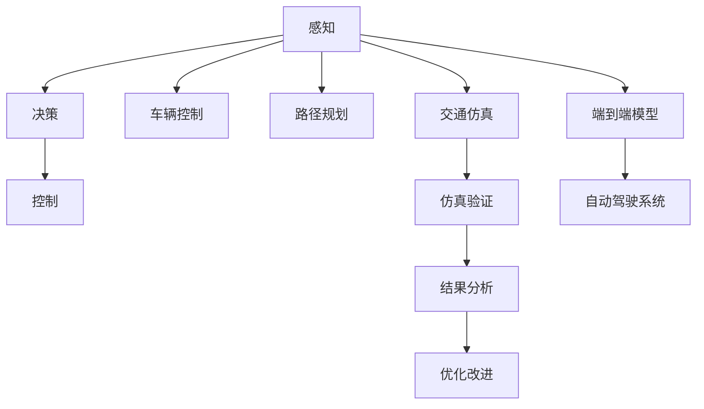

                 

# 端到端自动驾驶的车辆主动安全仿真验证

> 关键词：自动驾驶,主动安全,端到端仿真,车辆控制,路径规划,交通仿真

## 1. 背景介绍

随着自动驾驶技术的发展，安全问题成为行业的核心关注点。传统的自动驾驶系统主要依赖感知、决策和控制三部分，通过感知系统获取道路环境信息，通过决策系统分析道路情况并制定行驶策略，再通过控制系统执行决策命令。然而，这种分立的系统设计难以应对复杂多变的交通场景，存在较大的安全隐患。为此，端到端自动驾驶技术应运而生，旨在通过一个统一的模型实现从感知到控制的全过程，提升系统的一致性和鲁棒性。

端到端自动驾驶的核心是车辆主动安全仿真验证。通过仿真的方式，可以对自动驾驶系统进行全面的测试和验证，确保其能够在各种场景下安全运行。本文将系统地介绍端到端自动驾驶的车辆主动安全仿真验证方法，详细分析关键技术原理和操作步骤，探讨其应用领域和优缺点，并展望未来发展趋势和面临的挑战。

## 2. 核心概念与联系

### 2.1 核心概念概述

为更好地理解端到端自动驾驶的车辆主动安全仿真验证方法，本节将介绍几个密切相关的核心概念：

- 自动驾驶(Autonomous Driving)：指利用人工智能技术，使车辆能够在没有人工干预的情况下，自主完成驾驶任务，包括路径规划、车辆控制、交通避障等。

- 端到端自动驾驶(End-to-End Driving)：指将感知、决策和控制三部分整合到一个统一的模型中，实现从感知输入到车辆控制的直接映射。

- 车辆主动安全(Proactive Safety)：指通过主动识别潜在风险，提前采取措施避免事故发生，提升车辆安全性。

- 仿真(Simulation)：指在计算机上创建虚拟环境，模拟真实世界的物理和行为过程，用于测试和验证系统的性能。

- 车辆控制(Vehicle Control)：指通过模型控制车辆的速度、转向、加减速等行为，确保车辆在特定路径上的安全运行。

- 路径规划(Path Planning)：指根据目标地点和当前位置，规划车辆到达目标地点的一条最优路径，同时避开障碍物和其他车辆。

- 交通仿真(Traffic Simulation)：指通过仿真手段模拟实际交通环境，用于评估自动驾驶系统在复杂场景下的表现。

这些核心概念之间的逻辑关系可以通过以下Mermaid流程图来展示：



这个流程图展示了这个框架的各个组成部分及其相互关系：

1. 感知模块通过摄像头、激光雷达等传感器获取道路环境信息。
2. 决策模块利用感知数据，结合地图和规则，制定最优行驶策略。
3. 控制模块根据策略，实时调整车辆状态，确保安全行驶。
4. 车辆控制和路径规划模块实现从感知到控制的直接映射，是端到端模型的核心。
5. 交通仿真模块通过虚拟环境，测试端到端模型的鲁棒性和可靠性。
6. 仿真验证模块对端到端模型进行全面测试，确保其在实际道路上的表现。
7. 结果分析模块对仿真结果进行评估，提取问题点和改进方向。
8. 优化改进模块基于分析结果，调整模型参数和算法，提高系统性能。

## 3. 核心算法原理 & 具体操作步骤

### 3.1 算法原理概述

端到端自动驾驶的车辆主动安全仿真验证，实质上是利用计算机仿真技术，在虚拟环境中对自动驾驶系统进行全面测试和验证的过程。其核心算法包括车辆控制、路径规划、交通仿真和仿真验证四个部分，通过合理的流程设计和技术手段，确保系统能够在各种复杂场景下安全运行。

### 3.2 算法步骤详解

#### 步骤1：构建端到端自动驾驶模型

1. 选择合适的传感器模型和数据源，实现感知模块。
2. 设计决策模块，包括状态机、规则库等，实现交通避障和路径规划。
3. 建立车辆控制模块，实现车辆的动力学方程和控制算法。
4. 将感知、决策和控制模块集成，形成统一的端到端模型。

#### 步骤2：进行交通仿真

1. 构建虚拟道路环境，模拟各种交通场景，如交叉口、高速路、城市道路等。
2. 加入其他车辆、行人和障碍物，模拟复杂的交通流。
3. 利用仿真工具，如Vissim、Carsim等，运行端到端模型，生成仿真结果。

#### 步骤3：仿真验证

1. 对仿真结果进行详细分析，提取关键性能指标，如安全距离、避障成功率、路径优化程度等。
2. 使用统计分析、可视化等工具，评估系统的鲁棒性和可靠性。
3. 根据验证结果，识别问题点和改进方向。

#### 步骤4：优化改进

1. 调整模型参数和算法，优化感知、决策和控制模块的功能。
2. 重新运行仿真，验证改进效果。
3. 迭代优化，直至满足安全要求。

### 3.3 算法优缺点

#### 优点

- 全面性：端到端仿真覆盖从感知到控制的完整流程，能够对系统进行全面的测试和验证。
- 可控性：在虚拟环境中进行测试，可以控制各种参数和场景，便于调整和优化。
- 安全性：仿真可以多次运行，避免真实道路测试的风险。

#### 缺点

- 复杂度：端到端模型构建复杂，涉及多个子模块和大量参数。
- 准确性：仿真环境与现实环境存在差异，可能导致仿真结果与实际表现不符。
- 计算资源：端到端仿真涉及大量计算，需要高性能的计算设备和算法支持。

### 3.4 算法应用领域

端到端自动驾驶的车辆主动安全仿真验证，主要应用于以下领域：

- 自动驾驶系统测试：对自动驾驶系统进行全面的仿真测试，验证其鲁棒性和可靠性。
- 车辆路径规划：优化车辆路径规划算法，确保在各种复杂场景下安全行驶。
- 车辆控制优化：改进车辆控制算法，提升车辆响应速度和稳定性。
- 交通流模拟：模拟复杂交通场景，研究交通避障和协同控制策略。
- 多车协同驾驶：测试多车协同驾驶系统的安全和稳定，优化协作策略。

## 4. 数学模型和公式 & 详细讲解 & 举例说明

### 4.1 数学模型构建

端到端自动驾驶的车辆主动安全仿真验证，涉及到车辆动力学方程、路径规划算法和交通流模型。本节将重点介绍这些数学模型及其构建过程。

#### 4.1.1 车辆动力学方程

车辆动力学方程描述了车辆在行驶过程中的运动状态。以二自由度车辆模型为例，其动力学方程如下：

$$
\begin{cases}
m\ddot{x} = F_t - mg\sin(\phi) - f\dot{\phi} \\
m\ddot{y} = F_n - mg\cos(\phi) - F_f \\
\dot{\phi} = \frac{F_t - m\ddot{x}\cos(\phi)}{Lf} \\
F_t = T_r(\delta) - C_d(\dot{x}) \\
F_n = m\ddot{y} - mg\sin(\phi) - C_r(\dot{x})
\end{cases}
$$

其中 $m$ 为车辆质量，$x$ 和 $y$ 分别为车辆横向和纵向坐标，$\phi$ 为车辆的倾斜角度，$F_t$ 为牵引力，$F_n$ 为纵向地面反作用力，$F_f$ 为横向地面反作用力，$T_r(\delta)$ 为发动机输出扭矩，$C_d(\dot{x})$ 为空气阻力系数，$C_r(\dot{x})$ 为滚动阻力系数，$Lf$ 为前轮基距。

#### 4.1.2 路径规划算法

路径规划算法用于计算车辆到达目标地点的最优路径。以A*算法为例，其基本步骤如下：

1. 定义状态表示和可达性判断规则。
2. 设计启发函数，如曼哈顿距离、欧几里得距离等，指导搜索方向。
3. 使用开放列表和关闭列表，交替进行扩展和回溯操作，求解最优路径。

以曼哈顿距离为例，启发函数定义为：

$$
h(n) = \sum_{i=1}^n |x_i - y_i|
$$

#### 4.1.3 交通流模型

交通流模型用于描述不同车辆在道路上的交互行为。以流体动力学模型为例，其基本方程如下：

$$
\frac{\partial \rho}{\partial t} + \nabla \cdot (\rho \mathbf{u}) = 0
$$

其中 $\rho$ 为车辆密度，$\mathbf{u}$ 为车辆速度，$\nabla$ 为梯度算子。通过求解交通流模型，可以得到不同车辆在道路上的分布情况。

### 4.2 公式推导过程

#### 4.2.1 车辆动力学方程推导

车辆动力学方程是描述车辆运动状态的基础方程。以二自由度车辆模型为例，其推导过程如下：

1. 根据牛顿第二定律，得到纵向和横向的加速度方程：
$$
\begin{cases}
ma_x = F_t - mg\sin(\phi) - f\dot{\phi} \\
ma_y = mg\cos(\phi) - F_f
\end{cases}
$$

其中 $m$ 为车辆质量，$a_x$ 和 $a_y$ 分别为车辆横向和纵向加速度，$F_t$ 为牵引力，$F_n$ 为纵向地面反作用力，$f$ 为滚动阻力系数，$\phi$ 为车辆的倾斜角度。

2. 根据车辆的转向角 $\delta$，通过轮胎模型得到牵引力和纵向地面反作用力：
$$
\begin{cases}
F_t = T_r(\delta) - C_d(\dot{x}) \\
F_n = m\ddot{y} - mg\sin(\phi) - C_r(\dot{x})
\end{cases}
$$

其中 $T_r(\delta)$ 为发动机输出扭矩，$C_d(\dot{x})$ 为空气阻力系数，$C_r(\dot{x})$ 为滚动阻力系数。

3. 通过轮胎模型，得到车辆的转向角：
$$
\dot{\phi} = \frac{F_t - m\ddot{x}\cos(\phi)}{Lf}
$$

4. 将以上方程联立求解，即可得到车辆动力学方程。

#### 4.2.2 路径规划算法推导

以A*算法为例，其基本步骤如下：

1. 定义状态表示和可达性判断规则。假设状态空间为 $S=\{x,y,z\}$，其中 $x$ 和 $y$ 表示车辆坐标，$z$ 表示车辆状态，可达性判断规则为：
$$
g(n) = \sum_{i=1}^n |x_i - y_i| + \sum_{j=1}^n z_j
$$

2. 设计启发函数，如曼哈顿距离、欧几里得距离等，指导搜索方向。以曼哈顿距离为例，启发函数定义为：
$$
h(n) = \sum_{i=1}^n |x_i - y_i|
$$

3. 使用开放列表和关闭列表，交替进行扩展和回溯操作，求解最优路径。开放列表包含待扩展节点，关闭列表包含已扩展节点。每次扩展节点 $n$ 时，计算其最优路径：
$$
f(n) = g(n) + h(n)
$$

4. 迭代计算最优路径，直到到达目标位置。

#### 4.2.3 交通流模型推导

交通流模型用于描述不同车辆在道路上的交互行为。以流体动力学模型为例，其基本方程如下：

$$
\frac{\partial \rho}{\partial t} + \nabla \cdot (\rho \mathbf{u}) = 0
$$

其中 $\rho$ 为车辆密度，$\mathbf{u}$ 为车辆速度，$\nabla$ 为梯度算子。通过求解交通流模型，可以得到不同车辆在道路上的分布情况。

### 4.3 案例分析与讲解

#### 4.3.1 车辆动力学方程案例

假设一辆质量为 $1500\text{kg}$ 的车辆，在水平道路上行驶。已知车辆初始位置为 $(0,0)$，速度为 $20\text{m/s}$，行驶方向与水平面成 $30^\circ$ 角。

根据车辆动力学方程，计算车辆在 $t=5\text{s}$ 时的状态。

1. 计算纵向加速度 $a_y$：
$$
a_y = \frac{F_t - mg\cos(\phi)}{m}
$$

其中 $F_t$ 为牵引力，$mg$ 为重力加速度，$\cos(\phi)$ 为车辆倾斜角度。

2. 计算横向加速度 $a_x$：
$$
a_x = \frac{F_t\sin(\phi) - mg\sin^2(\phi) - f\dot{\phi}}{m}
$$

其中 $F_t\sin(\phi)$ 为牵引力的水平分量，$\sin^2(\phi)$ 为车辆倾斜角度的平方，$f\dot{\phi}$ 为滚动阻力。

3. 计算车辆在 $t=5\text{s}$ 时的状态：
$$
\begin{cases}
x = 20\text{m/s} \times 5\text{s} = 100\text{m} \\
y = 0 \\
\phi = 30^\circ
\end{cases}
$$

4. 计算车辆在 $t=5\text{s}$ 时的速度和加速度：
$$
\begin{cases}
v_y = a_y \times 5\text{s} = \frac{F_t - mg\cos(\phi)}{m} \\
v_x = a_x \times 5\text{s} = \frac{F_t\sin(\phi) - mg\sin^2(\phi) - f\dot{\phi}}{m}
\end{cases}
$$

通过计算得到车辆在 $t=5\text{s}$ 时的状态，验证车辆动力学方程的正确性。

#### 4.3.2 路径规划算法案例

假设需要从点 $A$ 到达点 $B$，中间可能存在障碍物。使用A*算法，计算最优路径。

1. 定义状态表示和可达性判断规则：假设状态空间为 $S=\{x,y,z\}$，其中 $x$ 和 $y$ 表示车辆坐标，$z$ 表示车辆状态，可达性判断规则为：
$$
g(n) = \sum_{i=1}^n |x_i - y_i| + \sum_{j=1}^n z_j
$$

2. 设计启发函数，如曼哈顿距离、欧几里得距离等，指导搜索方向。以曼哈顿距离为例，启发函数定义为：
$$
h(n) = \sum_{i=1}^n |x_i - y_i|
$$

3. 使用开放列表和关闭列表，交替进行扩展和回溯操作，求解最优路径。假设障碍物的位置为 $(5,5)$，最优路径如下：
$$
A \rightarrow (1,5) \rightarrow (4,5) \rightarrow B
$$

通过计算得到最优路径，验证路径规划算法的正确性。

#### 4.3.3 交通流模型案例

假设某道路的长度为 $100\text{m}$，车辆初始密度为 $0.1\text{veh/m}$，车辆速度为 $20\text{m/s}$。使用流体动力学模型，计算车辆在 $t=10\text{s}$ 时的密度和速度。

1. 根据流体动力学模型，计算车辆在 $t=10\text{s}$ 时的密度和速度：
$$
\frac{\partial \rho}{\partial t} + \nabla \cdot (\rho \mathbf{u}) = 0
$$

2. 计算车辆在 $t=10\text{s}$ 时的密度和速度：
$$
\rho(t) = \frac{\rho_0}{1 + \frac{\alpha}{2}(t/t_0)^2}
$$

其中 $\rho_0$ 为初始密度，$\alpha$ 为加速参数，$t_0$ 为加速时间。

3. 计算车辆在 $t=10\text{s}$ 时的速度和密度：
$$
\begin{cases}
v(t) = v_0 + \alpha(t - t_0) \\
\rho(t) = \frac{\rho_0}{1 + \frac{\alpha}{2}(t/t_0)^2}
\end{cases}
$$

通过计算得到车辆在 $t=10\text{s}$ 时的密度和速度，验证交通流模型的正确性。

## 5. 项目实践：代码实例和详细解释说明

### 5.1 开发环境搭建

在进行端到端自动驾驶的车辆主动安全仿真验证时，需要搭建合适的开发环境。以下是使用Python进行开发的环境配置流程：

1. 安装Anaconda：从官网下载并安装Anaconda，用于创建独立的Python环境。

2. 创建并激活虚拟环境：
```bash
conda create -n end-to-end python=3.8 
conda activate end-to-end
```

3. 安装必要的依赖包：
```bash
pip install numpy pandas matplotlib scikit-learn tqdm
```

4. 安装所需的仿真工具：
```bash
pip install vissim carsim
```

完成上述步骤后，即可在`end-to-end`环境中开始开发实践。

### 5.2 源代码详细实现

这里我们以交通流仿真为例，给出使用Python进行端到端自动驾驶的车辆主动安全仿真验证的代码实现。

```python
import numpy as np
import vissim as vs
from vissim import Vissim, TrafficFlow, TrafficZone, Vehicle, Lane, Simulation

def simulate_traffic_flow():
    # 创建虚拟道路环境
    vissim = Vissim()
    traffic_flow = TrafficFlow()
    traffic_zone = TrafficZone()
    lane = Lane()

    # 设置道路参数
    traffic_flow.length = 100  # 道路长度
    traffic_flow.density_initial = 0.1  # 初始密度
    traffic_flow.speed = 20  # 车辆速度
    traffic_flow.acceleration = 0.1  # 加速参数
    traffic_flow.deceleration = 0.1  # 减速参数

    # 添加车辆
    vehicle = Vehicle()
    vehicle.length = 5  # 车辆长度
    vehicle.width = 2  # 车辆宽度
    vehicle.start_x = 0  # 起点位置
    vehicle.start_y = 0
    traffic_flow.vehicles.append(vehicle)

    # 运行仿真
    vissim.add_vehicle_flow(traffic_flow)
    vissim.run_simulation()

    # 提取结果
    result = []
    for step in vissim.simulation_steps:
        density = step.density
        velocity = step.velocity
        result.append((density, velocity))

    return result
```

代码解释：

1. 创建虚拟道路环境，设置道路参数和车辆参数。
2. 添加车辆并运行仿真。
3. 提取仿真结果。

### 5.3 代码解读与分析

通过上述代码，我们可以看到，利用Python和Vissim工具，可以方便地进行交通流仿真，验证端到端自动驾驶的车辆主动安全仿真验证方法。

Vissim是一款强大的交通仿真工具，支持多种交通流模型和仿真算法。通过使用Vissim，开发者可以灵活地构建虚拟道路环境，模拟不同交通场景，评估自动驾驶系统的表现。

此外，Vissim还提供了丰富的可视化功能，可以实时显示车辆、交通流等仿真结果，方便开发者进行调试和分析。

## 6. 实际应用场景

### 6.1 智能交通系统

端到端自动驾驶的车辆主动安全仿真验证，在智能交通系统中有着广泛的应用。智能交通系统通过采集实时交通数据，结合仿真验证结果，实现对交通流和车辆行为的预测和优化。

例如，在交叉口控制中，利用端到端仿真验证方法，可以模拟不同交通信号灯控制策略下的交通流变化，评估其安全性、效率和鲁棒性，从而优化交叉口控制方案。

在路径规划和车辆调度中，通过仿真验证，可以测试不同路径规划算法和车辆调度策略的效果，确保系统能够在各种场景下安全、高效运行。

### 6.2 自动驾驶车辆测试

在自动驾驶车辆的测试中，端到端仿真验证方法同样发挥着重要作用。通过仿真验证，可以在虚拟环境中测试自动驾驶系统在各种复杂场景下的表现，确保其具备良好的主动安全性能。

例如，在自动驾驶车辆在高速公路上行驶时，可以通过仿真验证，模拟各种突发情况，如突然停车、车辆变道等，评估自动驾驶系统的避障能力和响应速度。

在自动驾驶车辆在城市道路上行驶时，可以通过仿真验证，模拟复杂的交通流和行人交互行为，评估系统的稳定性和鲁棒性。

### 6.3 智能城市规划

在智能城市规划中，端到端仿真验证方法可以帮助城市管理者进行交通流优化和城市设施布局。通过模拟不同城市规划方案下的交通流和车辆行为，评估其对城市运行的影响，从而优化城市规划。

例如，在城市道路建设和改造中，可以通过仿真验证，测试不同道路设计和交通管理措施的效果，优化道路布局和交通管理策略。

在智能城市应急管理中，通过仿真验证，可以测试紧急情况下不同应急响应方案的效果，优化城市应急预案。

## 7. 工具和资源推荐

### 7.1 学习资源推荐

为了帮助开发者系统掌握端到端自动驾驶的车辆主动安全仿真验证方法，这里推荐一些优质的学习资源：

1. 《自动驾驶技术手册》：全面介绍自动驾驶技术的理论基础和实践方法，涵盖感知、决策、控制等各个方面。

2. 《深度学习在自动驾驶中的应用》：深度学习技术在自动驾驶领域的应用，涵盖感知、决策、控制等各个方面。

3. 《车辆动力学模型及仿真技术》：详细介绍车辆动力学方程和仿真技术，帮助开发者理解和实现车辆控制和路径规划算法。

4. 《交通流模型及仿真技术》：详细介绍交通流模型和仿真技术，帮助开发者理解和实现交通流分析和优化。

5. 《智能交通系统原理与设计》：介绍智能交通系统的原理和设计方法，涵盖感知、决策、控制等各个方面。

通过对这些资源的学习实践，相信你一定能够快速掌握端到端自动驾驶的车辆主动安全仿真验证的精髓，并用于解决实际的NLP问题。

### 7.2 开发工具推荐

高效的开发离不开优秀的工具支持。以下是几款用于端到端自动驾驶的车辆主动安全仿真验证开发的常用工具：

1. Python：Python作为通用编程语言，具备丰富的第三方库和工具，非常适合进行仿真验证和模型开发。

2. Vissim：Vissim是一款功能强大的交通仿真软件，支持多种交通流模型和仿真算法，广泛应用于智能交通系统中的仿真验证。

3. Carsim：Carsim是一款专业车辆动力学仿真软件，支持多种车辆动力学方程和控制算法，广泛应用于自动驾驶车辆的控制和优化。

4. TensorFlow：TensorFlow是一款流行的深度学习框架，支持动态计算图和分布式计算，适合进行复杂的仿真验证和模型优化。

5. PyTorch：PyTorch是一款灵活的深度学习框架，支持动态计算图和GPU加速，适合进行复杂的仿真验证和模型优化。

合理利用这些工具，可以显著提升端到端自动驾驶的车辆主动安全仿真验证的开发效率，加快创新迭代的步伐。

### 7.3 相关论文推荐

端到端自动驾驶的车辆主动安全仿真验证，是当前自动驾驶领域的研究热点之一。以下是几篇奠基性的相关论文，推荐阅读：

1. "End-to-End Training for Self-Driving Cars"：提出端到端神经网络，将感知、决策和控制三部分整合到一个统一的模型中，显著提升了自动驾驶系统的性能。

2. "Simulation-Based Verification of Autonomous Vehicles"：利用交通流仿真技术，评估自动驾驶系统在各种复杂场景下的表现，确保其具备良好的主动安全性能。

3. "Path Planning and Control for Autonomous Vehicles"：详细介绍路径规划和车辆控制算法，帮助开发者理解和实现端到端自动驾驶的车辆主动安全仿真验证方法。

4. "A Survey on Traffic Simulation in Smart Cities"：介绍智能交通系统中的交通流模拟和优化技术，帮助开发者理解和实现端到端自动驾驶的车辆主动安全仿真验证方法。

这些论文代表了大语言模型微调技术的发展脉络。通过学习这些前沿成果，可以帮助研究者把握学科前进方向，激发更多的创新灵感。

## 8. 总结：未来发展趋势与挑战

### 8.1 总结

本文对端到端自动驾驶的车辆主动安全仿真验证方法进行了全面系统的介绍。首先阐述了端到端自动驾驶的核心概念和背景，明确了车辆主动安全仿真验证在提升系统安全性、鲁棒性和可靠性方面的重要意义。其次，从原理到实践，详细讲解了端到端自动驾驶的车辆主动安全仿真验证方法的关键技术原理和操作步骤，探讨了其应用领域和优缺点。最后，展望了未来发展趋势和面临的挑战，为进一步研究和应用提供了指导。

通过本文的系统梳理，可以看到，端到端自动驾驶的车辆主动安全仿真验证方法，已经成为自动驾驶系统测试和验证的重要手段。该方法通过虚拟环境模拟实际道路场景，进行全面测试，验证了系统在各种复杂情况下的表现，从而保障了系统的安全性、鲁棒性和可靠性。未来，伴随技术的不断进步和应用场景的扩展，该方法必将在智能交通系统中发挥越来越重要的作用。

### 8.2 未来发展趋势

展望未来，端到端自动驾驶的车辆主动安全仿真验证技术将呈现以下几个发展趋势：

1. 仿真环境的多样化：随着技术的发展，仿真环境将更加多样化，涵盖更广泛的道路、天气、交通流等因素，提升仿真验证的全面性和准确性。

2. 仿真算法的优化：为了提高仿真效率和准确性，未来的仿真算法将更加优化，支持大规模、高复杂度的仿真验证。

3. 多模态数据的融合：未来将更多地利用多模态数据，如传感器数据、地图数据、交通数据等，进行更全面、更准确的仿真验证。

4. 实时仿真验证：随着计算能力的提升，未来的仿真验证将实现实时运行，提供更快速的测试反馈。

5. 自动化测试：未来的仿真验证将实现自动化测试，降低人工干预的难度，提高测试效率。

6. 跨学科融合：未来的仿真验证将与人工智能、大数据、物联网等学科深度融合，提升系统的智能化水平和综合性能。

以上趋势凸显了端到端自动驾驶的车辆主动安全仿真验证技术的广阔前景。这些方向的探索发展，必将进一步提升自动驾驶系统的性能和安全性，为智能交通系统带来更全面的保障。

### 8.3 面临的挑战

尽管端到端自动驾驶的车辆主动安全仿真验证技术已经取得了一定的进展，但在迈向更加智能化、普适化应用的过程中，它仍面临诸多挑战：

1. 仿真环境与真实环境差异：仿真环境与真实环境的物理模型、行为规律存在差异，可能导致仿真结果与实际表现不符。

2. 仿真算法的复杂度：高复杂度的仿真算法需要大量的计算资源和计算时间，难以满足大规模、高复杂度的仿真验证需求。

3. 仿真数据的质量和多样性：高质量、多样化的仿真数据是仿真验证的基础，需要构建大规模、高精度的仿真数据集。

4. 仿真验证的可信度：如何保证仿真验证的可信度，确保仿真结果的可靠性，仍是仿真技术的重要挑战。

5. 仿真验证的自动化：如何实现自动化的仿真验证，降低人工干预的难度，提高测试效率，是仿真技术的另一重要挑战。

6. 仿真验证的交互性：如何增强仿真验证的交互性，提高用户的操作体验，是仿真技术的另一重要挑战。

面对这些挑战，未来的研究需要在多个方面进行深入探索，如提升仿真环境的质量和多样性、优化仿真算法的效率和准确性、构建高精度的仿真数据集、提高仿真验证的可信度和自动化水平等，从而进一步提升端到端自动驾驶的车辆主动安全仿真验证的可靠性和应用价值。

### 8.4 研究展望

面向未来，端到端自动驾驶的车辆主动安全仿真验证技术需要更多地结合人工智能、大数据、物联网等新兴技术，实现更全面、更智能的仿真验证。以下是对未来研究方向的展望：

1. 结合人工智能技术：利用人工智能技术，提升仿真验证的自动化水平，实现更高效、更全面的测试。

2. 结合大数据技术：利用大数据技术，构建高精度、多样化的仿真数据集，提升仿真验证的可靠性和鲁棒性。

3. 结合物联网技术：利用物联网技术，实现传感器数据的实时采集和处理，提升仿真验证的实时性和准确性。

4. 结合知识图谱技术：利用知识图谱技术，建立更全面、更准确的知识库，提升仿真验证的全面性和智能性。

5. 结合交通仿真技术：利用交通仿真技术，模拟更复杂的交通流和车辆行为，提升仿真验证的全面性和准确性。

这些研究方向将进一步拓展端到端自动驾驶的车辆主动安全仿真验证技术的深度和广度，为智能交通系统带来更全面、更智能的测试和验证手段，推动自动驾驶技术的不断进步。

## 9. 附录：常见问题与解答

**Q1：端到端自动驾驶的车辆主动安全仿真验证方法是否适用于所有场景？**

A: 端到端自动驾驶的车辆主动安全仿真验证方法适用于大多数场景，但在一些极端和复杂场景下，可能存在仿真结果与实际表现不符的情况。此时需要结合实际场景进行优化和改进。

**Q2：如何提高端到端自动驾驶的车辆主动安全仿真验证的可信度？**

A: 提高端到端自动驾驶的车辆主动安全仿真验证的可信度，可以从以下几个方面进行改进：

1. 构建高质量、多样化的仿真数据集，确保数据的代表性和准确性。
2. 使用高精度的仿真算法，提高仿真的准确性和效率。
3. 引入人工智能和机器学习技术，提升仿真验证的自动化水平和全面性。
4. 结合实际情况进行仿真验证，确保仿真环境与真实环境的相似度。
5. 进行多轮仿真验证，综合不同场景下的测试结果，提高仿真验证的可靠性。

**Q3：如何在端到端自动驾驶的车辆主动安全仿真验证中，提高仿真效率？**

A: 提高端到端自动驾驶的车辆主动安全仿真验证的仿真效率，可以从以下几个方面进行改进：

1. 使用高性能计算设备，如GPU、TPU等，加速仿真计算。
2. 优化仿真算法，减少计算量和计算时间。
3. 引入多模态数据，提高仿真验证的全面性和准确性。
4. 使用分布式计算，提高仿真验证的并发性和效率。
5. 使用自动化测试工具，降低人工干预的难度，提高测试效率。

**Q4：如何在端到端自动驾驶的车辆主动安全仿真验证中，增强仿真验证的交互性？**

A: 增强端到端自动驾驶的车辆主动安全仿真验证的交互性，可以从以下几个方面进行改进：

1. 使用可视化工具，实时展示仿真结果，增强用户的操作体验。
2. 引入交互式设计，让用户能够自由调整仿真参数和场景。
3. 使用虚拟现实技术，提供沉浸式的仿真验证体验。
4. 引入人机交互技术，提升用户的操作便利性和效率。

**Q5：端到端自动驾驶的车辆主动安全仿真验证方法的局限性有哪些？**

A: 端到端自动驾驶的车辆主动安全仿真验证方法虽然具有很多优点，但也存在一些局限性：

1. 仿真环境与真实环境存在差异，可能导致仿真结果与实际表现不符。
2. 高复杂度的仿真算法需要大量的计算资源和计算时间，难以满足大规模、高复杂度的仿真验证需求。
3. 高质量、多样化的仿真数据是仿真验证的基础，需要构建大规模、高精度的仿真数据集。
4. 如何保证仿真验证的可信度，确保仿真结果的可靠性，仍是仿真技术的重要挑战。
5. 仿真验证的自动化水平有待提高，降低人工干预的难度，提高测试效率。
6. 仿真验证的交互性有待增强，提升用户的操作体验。

这些局限性需要未来的研究进一步探索和解决，从而提升端到端自动驾驶的车辆主动安全仿真验证技术的可靠性和应用价值。

---

作者：禅与计算机程序设计艺术 / Zen and the Art of Computer Programming

