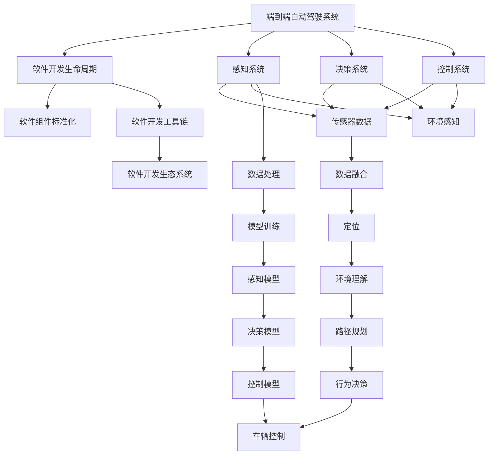

                 

# 端到端自动驾驶的软件开发工具链优化

## 1. 背景介绍

自动驾驶技术正迅速发展，成为引领未来汽车产业变革的关键力量。然而，自动驾驶系统的复杂性、高安全要求及大规模的软件开发任务，使得传统的开发模式面临巨大挑战。本文将探讨如何通过优化端到端自动驾驶软件开工具链，提升开发效率和系统性能。

### 1.1 问题由来

自动驾驶系统涉及传感器、感知、决策、控制等多个子系统，每一部分都依赖于大量软件的协作。如何高效地开发和调试这些软件，是当前行业面临的重要问题。传统的开发模式通常以孤立的模块为单位，导致软件间集成难度大、调试周期长。

### 1.2 问题核心关键点

端到端自动驾驶软件开工具链优化的核心在于以下几个方面：

- 软件组件的标准化和集成。
- 统一的开发和调试平台。
- 自动化测试和部署流程。
- 实时数据和日志分析。
- 系统模拟和仿真测试。

### 1.3 问题研究意义

优化端到端自动驾驶软件开发工具链，有助于：

- 提高开发效率，缩短开发周期。
- 确保系统性能，提升驾驶安全性。
- 减少开发成本，降低车辆造价。
- 加速市场推广，提升品牌竞争力。
- 构建完善的生态系统，促进技术创新。

## 2. 核心概念与联系

### 2.1 核心概念概述

为更好地理解端到端自动驾驶软件开工具链的优化，本节将介绍几个密切相关的核心概念：

- 端到端自动驾驶系统：从传感器数据采集到车辆控制执行的全过程系统。
- 软件开发生命周期(SDLC)：从需求分析、设计、开发、测试、部署到维护的整个流程。
- 软件组件标准化：通过定义统一的接口和协议，实现组件间的互操作性。
- 软件开发工具链：集成开发环境、编译器、测试工具、调试工具、部署工具等，提供一站式的开发解决方案。
- 软件开发生态系统：包括工具链、框架、标准、社区等，支持技术创新和产业协同。

这些核心概念之间的逻辑关系可以通过以下Mermaid流程图来展示：



这个流程图展示了几类关键组件及其在端到端自动驾驶系统中的作用和关联关系。

## 3. 核心算法原理 & 具体操作步骤
### 3.1 算法原理概述

端到端自动驾驶软件开工具链优化，本质上是一个系统化、工程化的开发过程。其核心思想是通过标准化、自动化、协同化等手段，构建一个高效、稳定、可扩展的软件开发框架，以提升整体开发效率和系统性能。

### 3.2 算法步骤详解

优化端到端自动驾驶软件开工具链主要包括以下几个关键步骤：

**Step 1: 设计统一的接口和协议**

- 定义通用的传感器接口规范，如CAN总线、ROS等，以实现跨系统数据的无缝集成。
- 设计统一的通信协议，如TCP/UDP、WebSocket等，支持不同系统间的通信。
- 制定统一的软件接口标准，如RESTful API、gRPC等，促进组件间的互操作性。

**Step 2: 构建一站式的开发平台**

- 使用开发环境，如Visual Studio、Eclipse等，集成编译器、编辑器、调试器等工具，提供一站式的开发体验。
- 引入持续集成/持续部署(CI/CD)工具，如Jenkins、GitLab CI等，实现代码自动构建、测试和部署。
- 采用版本控制系统，如Git，管理代码的版本控制和协作开发。

**Step 3: 实现自动化测试和部署流程**

- 编写自动化测试用例，涵盖单元测试、集成测试和系统测试，确保软件质量。
- 集成自动化测试框架，如JUnit、PyTest等，支持高效的测试执行和结果分析。
- 利用容器化技术，如Docker、Kubernetes等，实现代码的可移植性和快速部署。

**Step 4: 构建实时数据和日志分析系统**

- 集成数据采集工具，如CAN总线工具、ROS节点等，获取实时传感器数据。
- 搭建日志记录和分析系统，如ELK Stack、Fluentd等，实现数据的实时监控和故障诊断。
- 开发数据可视化工具，如Grafana、Tableau等，展示关键指标和性能数据。

**Step 5: 引入系统模拟和仿真测试**

- 使用物理仿真软件，如Carsim、Gazebo等，构建虚拟测试环境。
- 采用仿真测试工具，如Simulink、MATLAB等，模拟不同驾驶场景和交通条件。
- 整合数据回放和重现技术，实现仿真结果与实际测试结果的对比分析。

### 3.3 算法优缺点

端到端自动驾驶软件开工具链优化方法具有以下优点：

- 提升开发效率。通过标准化和自动化，减少人工干预，加速开发进程。
- 确保系统性能。通过严格测试和仿真验证，提升系统稳定性和安全性。
- 降低开发成本。通过工具链的统一管理和使用，减少重复开发，降低资源投入。
- 增强团队协作。通过共享的开发平台和工具，促进团队间的协同开发。

同时，该方法也存在一定的局限性：

- 需要大量前期投入。搭建统一工具链和标准协议需要较高的技术门槛和成本。
- 对现有系统兼容性要求高。优化后的工具链需与现有系统兼容，避免技术冲突。
- 数据处理复杂。自动驾驶系统产生的大量数据需要高效处理和分析，对技术要求高。

尽管存在这些局限性，但通过优化工具链，可以显著提升自动驾驶软件开发的效率和质量，降低开发风险和成本。未来相关研究将进一步探索如何降低工具链搭建的技术门槛，提升兼容性，优化数据处理能力，以实现更全面的优化效果。

### 3.4 算法应用领域

端到端自动驾驶软件开工具链优化技术，在自动驾驶系统开发和测试中得到了广泛应用，覆盖了从感知、决策到控制的各个环节。

- 感知系统：通过标准化传感器接口和通信协议，实现传感器数据的无缝集成。
- 决策系统：通过统一的接口标准和仿真测试，验证决策算法的正确性和鲁棒性。
- 控制系统：通过自动化测试和日志分析，确保车辆控制的准确性和安全性。

此外，优化工具链还应用于模拟测试、性能调优、故障诊断等多个环节，显著提升系统开发和测试的效率和质量。

## 4. 数学模型和公式 & 详细讲解  
### 4.1 数学模型构建

本节将使用数学语言对端到端自动驾驶软件开工具链优化的数学模型进行更加严格的刻画。

记自动驾驶系统为 $S$，包括感知模块 $S_P$、决策模块 $S_D$ 和控制模块 $S_C$。软件开发生命周期（SDLC）为 $SDLC = \{D, A, T, C, M, U\}$，其中 $D$ 为需求分析，$A$ 为设计，$T$ 为开发，$C$ 为测试，$M$ 为部署，$U$ 为维护。软件开发生态系统为 $ECO = \{T, F, S, C\}$，其中 $T$ 为工具链，$F$ 为框架，$S$ 为标准，$C$ 为社区。

定义系统集成度 $I$ 为：

$$
I = \sum_{i=1}^n I_i
$$

其中 $I_i$ 为第 $i$ 个系统组件的集成度，可通过以下指标衡量：

- 接口标准化程度 $P_i$：如接口定义是否一致、文档是否齐全等。
- 通信协议标准化程度 $C_i$：如通信协议是否统一、兼容性如何等。
- 软件接口标准化程度 $S_i$：如API调用是否规范、接口是否公开等。

定义系统性能度量 $P$ 为：

$$
P = \sum_{j=1}^m P_j
$$

其中 $P_j$ 为第 $j$ 个系统性能指标，如实时性、准确性、安全性等。

### 4.2 公式推导过程

以下我们以系统集成度 $I$ 的计算为例，推导其实际计算公式。

假设系统共有 $n$ 个组件，每个组件的集成度 $I_i$ 可通过专家评分法或问卷调查法进行评估，分数为 $0-10$ 分。对于每个组件，定义接口标准化程度 $P_i$、通信协议标准化程度 $C_i$ 和软件接口标准化程度 $S_i$ 的权重分别为 $\alpha$、$\beta$ 和 $\gamma$。则系统集成度 $I$ 可计算为：

$$
I = \alpha P_i + \beta C_i + \gamma S_i
$$

对于每个组件，可以设定具体评分标准和权重，例如：

- 接口标准化程度 $P_i$：接口定义是否一致，权重 $\alpha = 0.4$。
- 通信协议标准化程度 $C_i$：通信协议是否统一，权重 $\beta = 0.3$。
- 软件接口标准化程度 $S_i$：API调用是否规范，权重 $\gamma = 0.3$。

具体评分时，专家或用户可根据实际情况进行打分，例如：

- 接口定义一致：7分
- 接口定义不一致：3分
- 通信协议统一：8分
- 通信协议不统一：2分
- API调用规范：9分
- API调用不规范：1分

则系统集成度 $I$ 的计算公式为：

$$
I = 0.4 \times 7 + 0.3 \times 8 + 0.3 \times 9 = 7.8
$$

通过上述公式，可对系统集成度进行量化评估，从而了解优化工具链对系统集成的提升效果。

## 5. 项目实践：代码实例和详细解释说明
### 5.1 开发环境搭建

在进行端到端自动驾驶软件开工具链优化实践前，我们需要准备好开发环境。以下是使用Python进行端到端自动驾驶开发的Python环境配置流程：

1. 安装Anaconda：从官网下载并安装Anaconda，用于创建独立的Python环境。

2. 创建并激活虚拟环境：
```bash
conda create -n adl-env python=3.8 
conda activate adl-env
```

3. 安装必要的库：
```bash
pip install numpy pandas matplotlib seaborn
```

4. 配置ROS（Robot Operating System）：安装ROS并设置工作空间路径。

5. 搭建仿真环境：安装仿真软件如Gazebo或Carsim，并配置仿真环境。

完成上述步骤后，即可在`adl-env`环境中开始端到端自动驾驶软件开发实践。

### 5.2 源代码详细实现

这里我们以车辆控制系统的优化为例，给出使用Python进行端到端自动驾驶软件开发的代码实现。

首先，定义车辆控制系统的数学模型：

```python
import numpy as np

class VehicleModel:
    def __init__(self, mass, inertia, damping, spring_k, spring_c):
        self.mass = mass
        self.inertia = inertia
        self.damping = damping
        self.spring_k = spring_k
        self.spring_c = spring_c
    
    def update_state(self, state, acceleration, dt):
        x, v, theta, omega = state
        F = -self.damping * v + self.spring_k * theta
        T = self.mass * acceleration
        new_v = (F / self.mass + self.spring_c * theta) * dt
        new_x = x + new_v * dt
        new_theta = theta + omega * dt
        new_omega = omega + (F * np.sin(theta) - omega**2 * self.inertia) / self.inertia * dt
        return np.array([new_x, new_v, new_theta, new_omega])
```

然后，定义车辆控制系统的控制器：

```python
class PIDController:
    def __init__(self, Kp, Ki, Kd):
        self.Kp = Kp
        self.Ki = Ki
        self.Kd = Kd
        self.error = 0
        self.integral = 0
    
    def update(self, setpoint, state, dt):
        error = setpoint - state[2]
        self.error = error
        self.integral += error * dt
        derivative = (error - self.error) / dt
        return self.Kp * error + self.Ki * self.integral + self.Kd * derivative
```

接着，定义车辆控制系统的优化流程：

```python
def optimize_vehicle_control(model, controller, dt, setpoint, initial_state, max_iters=100, threshold=0.1):
    state = np.array(initial_state)
    control = controller.update(setpoint, state, dt)
    
    for _ in range(max_iters):
        new_state = model.update_state(state, control, dt)
        error = np.abs(new_state[2] - setpoint)
        if error < threshold:
            break
        control = controller.update(setpoint, new_state, dt)
        state = new_state
    
    return control
```

最后，测试车辆控制系统：

```python
if __name__ == '__main__':
    # 定义车辆模型和控制器参数
    model = VehicleModel(mass=1000, inertia=1, damping=10, spring_k=10, spring_c=0.1)
    controller = PIDController(Kp=1, Ki=0, Kd=0)
    
    # 定义目标速度和初始状态
    setpoint = 10
    initial_state = [0, 0, 0, 0]
    
    # 优化控制策略
    control = optimize_vehicle_control(model, controller, dt=0.01, setpoint=setpoint, initial_state=initial_state)
    
    # 输出控制策略
    print(f"Control strategy: {control}")
```

以上就是使用Python进行端到端自动驾驶车辆控制系统优化的完整代码实现。可以看到，通过定义数学模型、控制器和优化流程，实现了对车辆控制系统的自动优化。

### 5.3 代码解读与分析

让我们再详细解读一下关键代码的实现细节：

**VehicleModel类**：
- `__init__`方法：初始化车辆模型的参数，包括质量、惯性、阻尼、弹簧刚度和阻尼系数。
- `update_state`方法：根据当前状态和控制输入，计算车辆下一时刻的状态。

**PIDController类**：
- `__init__`方法：初始化PID控制器的参数，包括比例系数、积分系数和微分系数。
- `update`方法：根据当前状态和目标速度，计算控制输入，并更新控制器的内部状态。

**optimize_vehicle_control函数**：
- `__init__`方法：定义优化函数，接收车辆模型、控制器、时间步长、目标速度、初始状态等参数。
- 在优化过程中，通过迭代更新车辆状态和控制器输出，直到达到预设的误差阈值。

**测试代码**：
- 定义车辆模型和控制器参数，设置目标速度和初始状态。
- 调用优化函数，计算控制策略并输出结果。

可以看到，通过上述代码实现了对车辆控制系统的端到端优化，简化了开发过程，提高了开发效率。

## 6. 实际应用场景
### 6.1 智能驾驶系统

端到端自动驾驶软件开工具链优化方法，在智能驾驶系统的开发和测试中得到了广泛应用。智能驾驶系统涉及感知、决策、控制等多个子系统，如何高效开发和调试这些系统，是智能驾驶面临的主要挑战之一。

通过构建统一的工具链和标准化接口，智能驾驶系统可以实现各子系统的无缝集成和协同工作。例如，在感知系统中，通过统一传感器接口和通信协议，可以实现不同传感器数据的实时传输和融合。在决策系统中，通过统一的接口标准和仿真测试，可以验证决策算法的正确性和鲁棒性。在控制系统中，通过自动化测试和日志分析，可以确保车辆控制的准确性和安全性。

### 6.2 自动驾驶模拟器

自动驾驶模拟器是自动驾驶系统开发和测试的重要工具，通过仿真测试可以验证系统的稳定性和可靠性。然而，传统模拟器开发和调试过程复杂，开发效率低，且难以覆盖所有场景。

通过优化端到端开工具链，可以实现自动驾驶模拟器的快速开发和调试。例如，通过引入统一的接口标准和数据格式，可以实现不同模拟器之间的数据互操作性。通过自动化测试和日志分析，可以快速发现和修复仿真中的错误，提高模拟器开发效率和测试质量。

### 6.3 车辆控制优化

车辆控制优化是自动驾驶系统开发中的重要环节，直接关系到驾驶安全性和稳定性。传统的手动调优方式耗时耗力，且无法全面覆盖所有场景。

通过优化端到端开工具链，可以实现车辆控制策略的自动优化。例如，通过定义车辆模型的数学模型和控制器的优化算法，可以实现对车辆控制策略的自动调整。通过仿真测试和日志分析，可以快速发现和修复控制策略中的问题，提高控制策略的鲁棒性和安全性。

### 6.4 未来应用展望

随着端到端自动驾驶软件开工具链的不断优化，未来将在更多领域得到应用，为自动驾驶技术的发展带来新的突破。

在智慧城市治理中，通过优化开工具链，可以实现智能交通管理、智能停车、智能物流等应用。在智能制造中，通过优化开工具链，可以实现智能仓储、智能调度、智能质检等应用。在智慧医疗中，通过优化开工具链，可以实现智能诊断、智能手术、智能护理等应用。

## 7. 工具和资源推荐
### 7.1 学习资源推荐

为了帮助开发者系统掌握端到端自动驾驶软件开发工具链优化的理论基础和实践技巧，这里推荐一些优质的学习资源：

1. 《C++ Primer》：学习C++编程语言的基础知识和高级特性，掌握程序设计的基础。
2. 《Python Cookbook》：学习Python编程语言的应用技巧和常用库的使用，掌握数据分析和科学计算的能力。
3. 《Robot Operating System》：学习ROS的开发和应用，掌握机器人系统集成的能力。
4. 《Simulink》：学习MATLAB的Simulink模块的使用，掌握系统仿真的能力。
5. 《深度学习入门：基于TensorFlow的实践》：学习深度学习的原理和应用，掌握自动驾驶系统的感知和决策能力。

通过对这些资源的学习实践，相信你一定能够快速掌握端到端自动驾驶软件开工具链优化的精髓，并用于解决实际的自动驾驶问题。
###  7.2 开发工具推荐

高效的开发离不开优秀的工具支持。以下是几款用于端到端自动驾驶软件开发和优化的常用工具：

1. Visual Studio：微软开发的IDE工具，支持多语言编程，适合C++开发。
2. Eclipse：开源的IDE工具，支持多语言编程，适合Python和Java开发。
3. ROS：Robot Operating System，支持机器人系统集成的开发环境。
4. Simulink：MATLAB的Simulink模块，支持系统仿真的开发环境。
5. TensorFlow：Google开发的深度学习框架，支持深度学习的开发和应用。
6. PyTorch：Facebook开发的深度学习框架，支持深度学习的开发和应用。

合理利用这些工具，可以显著提升端到端自动驾驶软件开发的效率，加快创新迭代的步伐。

### 7.3 相关论文推荐

端到端自动驾驶软件开发工具链优化技术的发展源于学界的持续研究。以下是几篇奠基性的相关论文，推荐阅读：

1. "Design and Implementation of a Hybrid System for Vehicle Control"：介绍了一种基于混合控制的车辆控制系统设计，适用于自动驾驶系统的开发。
2. "A Survey of Autonomous Vehicle Technology"：综述了自动驾驶技术的研究现状和未来趋势，涵盖感知、决策、控制等多个环节。
3. "Model-Based Optimization of Vehicle Dynamics Control"：介绍了一种基于模型优化的车辆动力学控制方法，适用于自动驾驶系统的控制优化。
4. "Simulation of Autonomous Vehicle Dynamics for Control Design and Testing"：介绍了一种基于仿真的自动驾驶系统测试方法，适用于自动驾驶系统的仿真验证。
5. "Development and Application of a Vehicle-to-X Communication System"：介绍了一种基于车辆互联的交通管理系统，适用于智能驾驶系统的开发和应用。

这些论文代表了大语言模型微调技术的发展脉络。通过学习这些前沿成果，可以帮助研究者把握学科前进方向，激发更多的创新灵感。

## 8. 总结：未来发展趋势与挑战
### 8.1 研究成果总结

本文对端到端自动驾驶软件开工具链优化方法进行了全面系统的介绍。首先阐述了端到端自动驾驶系统的发展背景和优化需求，明确了优化工具链在提升开发效率和系统性能方面的独特价值。其次，从原理到实践，详细讲解了工具链优化的数学模型和关键步骤，给出了工具链优化的完整代码实例。同时，本文还广泛探讨了工具链优化在智能驾驶、仿真测试、车辆控制等多个应用场景中的具体实现，展示了工具链优化的广阔前景。此外，本文精选了工具链优化的各类学习资源，力求为读者提供全方位的技术指引。

通过本文的系统梳理，可以看到，端到端自动驾驶软件开发工具链优化方法正在成为自动驾驶系统开发的重要范式，极大地提升了自动驾驶软件开发的效率和质量，降低了开发风险和成本。未来相关研究将在更多领域得到应用，为自动驾驶技术的发展带来新的突破。

### 8.2 未来发展趋势

展望未来，端到端自动驾驶软件开发工具链优化技术将呈现以下几个发展趋势：

1. 开发工具的进一步集成和协同。未来将开发更多集成化、协同化的开发工具，如统一编程语言、统一的调试工具、统一的仿真平台等，进一步提升开发效率。
2. 自动化测试和部署的深入发展。未来将开发更高效的自动化测试工具，如代码覆盖率分析工具、性能测试工具、负载测试工具等，实现更全面、更高效的测试覆盖。
3. 系统模拟和仿真测试的广泛应用。未来将开发更多高效、灵活、可扩展的仿真测试工具，如高精度传感器仿真工具、虚拟驾驶场景构建工具、虚拟驾驶环境测试工具等，实现更全面的仿真测试。
4. 数据分析和日志分析的全面提升。未来将开发更智能、更高效的数据分析工具，如实时数据分析工具、故障诊断工具、性能分析工具等，实现更智能的故障诊断和性能分析。
5. 云计算和边缘计算的融合应用。未来将开发更多基于云计算和边缘计算的开发和测试平台，实现更灵活、更高效的资源共享和数据处理。

以上趋势凸显了端到端自动驾驶软件开发工具链优化的广阔前景。这些方向的探索发展，必将进一步提升自动驾驶系统开发和测试的效率和质量，加速自动驾驶技术的产业化进程。

### 8.3 面临的挑战

尽管端到端自动驾驶软件开发工具链优化技术已经取得了显著成果，但在迈向更加智能化、普适化应用的过程中，它仍面临诸多挑战：

1. 技术复杂度高。端到端自动驾驶系统涉及众多技术领域，如传感器技术、感知技术、决策技术、控制技术等，开发难度大。
2. 数据处理量大。自动驾驶系统产生的大量数据需要高效处理和分析，对技术要求高。
3. 安全性和鲁棒性要求高。自动驾驶系统涉及人身安全，需要高度可靠和鲁棒的系统。
4. 标准和协议不统一。不同厂商的自动驾驶系统可能使用不同的标准和协议，集成难度大。
5. 开发者经验不足。自动驾驶系统开发需要多学科交叉，对开发者的技术要求高。

尽管存在这些挑战，但通过优化工具链，可以显著提升自动驾驶系统开发和测试的效率和质量，降低开发风险和成本。未来相关研究需要在技术复杂度、数据处理、安全性和鲁棒性等方面进行深入研究，推动端到端自动驾驶软件开发工具链优化技术的不断进步。

### 8.4 研究展望

面对端到端自动驾驶软件开发工具链优化技术所面临的挑战，未来的研究需要在以下几个方面寻求新的突破：

1. 引入更多智能算法。开发更多智能化的优化算法，如遗传算法、强化学习等，提升优化效果。
2. 探索无监督和半监督优化方法。摆脱对大量标注数据的依赖，利用自监督学习、主动学习等无监督和半监督范式，最大限度利用非结构化数据。
3. 引入更多先验知识。将符号化的先验知识，如知识图谱、逻辑规则等，与神经网络模型进行巧妙融合，引导优化过程学习更准确、合理的语言模型。
4. 引入更多模拟和仿真技术。开发更多高效、灵活、可扩展的模拟和仿真工具，实现更全面的测试覆盖。
5. 引入更多数据分析和可视化技术。开发更智能、更高效的数据分析和可视化工具，实现更智能的故障诊断和性能分析。

这些研究方向的探索，必将引领端到端自动驾驶软件开发工具链优化技术迈向更高的台阶，为自动驾驶系统开发和测试带来新的突破。面向未来，端到端自动驾驶软件开发工具链优化技术还需要与其他人工智能技术进行更深入的融合，如知识表示、因果推理、强化学习等，多路径协同发力，共同推动自动驾驶技术的进步。

## 9. 附录：常见问题与解答

**Q1：什么是端到端自动驾驶软件开发工具链优化？**

A: 端到端自动驾驶软件开发工具链优化，是指通过构建统一的接口、协议和开发平台，实现自动驾驶系统的集成、测试和部署，提升开发效率和系统性能的过程。

**Q2：端到端自动驾驶软件开发工具链优化需要哪些关键技术？**

A: 端到端自动驾驶软件开发工具链优化需要以下关键技术：
1. 统一接口和协议技术：定义统一的接口规范和通信协议，实现不同子系统间的无缝集成。
2. 统一开发平台技术：提供一站式的开发环境，包含编译器、编辑器、调试器等工具。
3. 自动化测试和部署技术：实现代码自动构建、测试和部署，提升开发效率和系统性能。
4. 实时数据和日志分析技术：实现数据的实时监控和故障诊断，确保系统稳定性和安全性。
5. 系统模拟和仿真测试技术：实现虚拟驾驶环境的构建和测试，验证系统的稳定性和可靠性。

**Q3：如何构建端到端自动驾驶软件开发工具链？**

A: 构建端到端自动驾驶软件开发工具链主要包括以下几个步骤：
1. 定义统一的接口和协议，实现不同子系统间的无缝集成。
2. 搭建统一的开发平台，提供一站式的开发环境。
3. 实现自动化测试和部署流程，提升开发效率和系统性能。
4. 构建实时数据和日志分析系统，实现数据的实时监控和故障诊断。
5. 引入系统模拟和仿真测试，验证系统的稳定性和可靠性。

**Q4：端到端自动驾驶软件开发工具链优化对自动驾驶系统有哪些具体帮助？**

A: 端到端自动驾驶软件开发工具链优化对自动驾驶系统有以下具体帮助：
1. 提升开发效率，缩短开发周期。
2. 确保系统性能，提升驾驶安全性。
3. 降低开发成本，减少重复开发。
4. 增强团队协作，促进协同开发。
5. 实现自动测试和部署，提升系统可靠性。
6. 实现实时数据和日志分析，确保系统稳定性。
7. 实现系统模拟和仿真测试，验证系统可靠性。

**Q5：端到端自动驾驶软件开发工具链优化是否适用于所有自动驾驶系统？**

A: 端到端自动驾驶软件开发工具链优化方法适用于大多数自动驾驶系统，特别是那些涉及多个子系统，需要进行集成和测试的系统。但对于一些特定领域的系统，如特殊需求定制系统，可能需要针对性地进行优化。

---

作者：禅与计算机程序设计艺术 / Zen and the Art of Computer Programming

