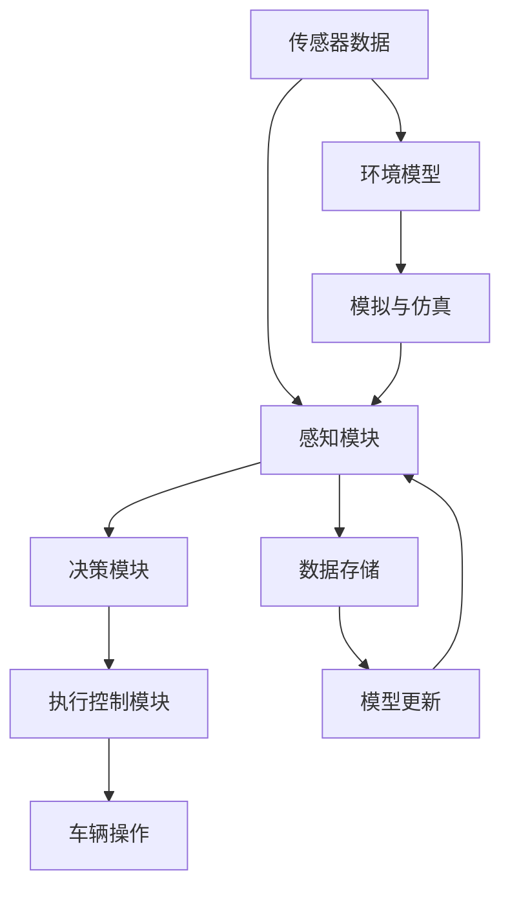

                 

# 端到端自动驾驶系统的安全性挑战

> 关键词：端到端自动驾驶, 安全性, 自动驾驶系统, 自动驾驶技术, 自动驾驶算法

## 1. 背景介绍

自动驾驶技术在近年来取得了显著的进展，许多企业已经在实际道路测试中展现出了优异的表现。然而，尽管自动驾驶系统的技术已经相对成熟，但其安全性仍然是一个巨大的挑战。这不仅关系到技术的可靠性，更涉及到公共安全和社会责任。本文将系统性地探讨端到端自动驾驶系统在安全性方面面临的挑战，并提供可能的解决方案。

## 2. 核心概念与联系

### 2.1 核心概念概述

在探讨自动驾驶的安全性之前，我们先定义几个关键概念：

- **端到端自动驾驶系统**：指从传感器数据输入到最终车辆控制输出的整个系统，包括数据感知、决策规划和执行控制等环节。
- **安全性**：在自动驾驶中，安全性是指系统在面对意外情况时，能够保障乘客、行人及其他道路用户的安全，避免交通事故。
- **感知与决策**：感知是自动驾驶系统的第一步，通过摄像头、雷达、激光雷达等传感器获取道路环境信息；决策则是基于感知结果，进行路径规划和行为决策。
- **执行控制**：执行控制负责将决策转化为实际的车辆操作，如转向、加速和制动等。

这些概念之间相互依赖，形成一个闭环系统。感知与决策是自动驾驶的基础，而执行控制是决策落地的关键。安全性则贯穿于系统的各个环节，确保整个系统在面对突发情况时能够可靠运行。

### 2.2 核心概念原理和架构的 Mermaid 流程图



这个流程图展示了端到端自动驾驶系统的基本架构，以及各个模块之间的关系。传感器数据通过感知模块处理，并更新环境模型。决策模块基于环境模型和感知结果进行路径规划和行为决策。执行控制模块根据决策结果调整车辆操作，同时模型更新模块不断优化模型以提升系统性能。

## 3. 核心算法原理 & 具体操作步骤

### 3.1 算法原理概述

自动驾驶系统安全性问题的根源在于其复杂性和不确定性。系统的安全性能取决于多个因素，包括环境感知、决策规划和执行控制的准确性和可靠性。本文将重点探讨这些环节的安全性问题。

- **感知模块**：负责获取道路环境信息，包括其他车辆、行人、交通标志等。感知模块的安全性问题主要体现在传感器故障、环境变化和感知误差上。
- **决策模块**：基于感知结果，进行路径规划和行为决策。决策模块的安全性问题主要涉及决策算法的设计和环境适应能力。
- **执行控制**：将决策转化为实际的车辆操作。执行控制的安全性问题包括控制器的鲁棒性和实时响应能力。

### 3.2 算法步骤详解

#### 3.2.1 感知模块

感知模块的第一步是通过传感器获取道路环境信息。常见的传感器包括摄像头、雷达和激光雷达等。这些传感器的性能和可靠性直接影响到感知模块的安全性。

1. **传感器校准**：定期校准传感器，确保其测量结果的准确性。
2. **多传感器融合**：结合多个传感器的数据，提高感知鲁棒性。
3. **环境建模**：建立高精度的环境模型，如高精度地图和实时动态地图。

#### 3.2.2 决策模块

决策模块基于感知结果进行路径规划和行为决策。常见的决策算法包括基于规则的决策和基于深度学习的决策。

1. **规则决策**：基于预先设定的交通规则进行决策。优点是简单、可靠，但缺乏灵活性。
2. **深度学习决策**：利用深度学习模型进行决策，优点是具有高度灵活性和自适应能力，但需要大量的训练数据和计算资源。

#### 3.2.3 执行控制

执行控制模块负责将决策转化为实际的车辆操作。常见的执行控制算法包括模型预测控制和线性控制。

1. **模型预测控制**：通过预测未来的道路环境变化，进行动态调整。优点是灵活性高，但计算复杂。
2. **线性控制**：利用线性控制算法进行简单控制。优点是计算效率高，但缺乏对复杂环境的适应能力。

### 3.3 算法优缺点

#### 3.3.1 感知模块

- **优点**：
  - 多传感器融合可以提高感知鲁棒性。
  - 环境建模可以提升决策的准确性。

- **缺点**：
  - 传感器故障和环境变化可能影响感知准确性。
  - 高精度地图和动态地图的更新成本较高。

#### 3.3.2 决策模块

- **优点**：
  - 深度学习决策具有高度灵活性和自适应能力。
  - 规则决策简单易懂，易于实现。

- **缺点**：
  - 深度学习决策需要大量的训练数据和计算资源。
  - 规则决策缺乏灵活性，可能无法应对复杂环境。

#### 3.3.3 执行控制

- **优点**：
  - 模型预测控制可以应对复杂环境变化。
  - 线性控制计算效率高，适合实时控制。

- **缺点**：
  - 模型预测控制计算复杂，需要高性能硬件支持。
  - 线性控制缺乏灵活性，可能无法处理突发情况。

### 3.4 算法应用领域

端到端自动驾驶系统的安全性挑战不仅限于技术领域，还涉及法规、伦理和社会问题。不同的应用场景对系统安全性的要求也不尽相同。

- **城市交通**：需要考虑复杂的交通规则和行人安全。
- **高速道路**：需要应对高速行驶和长距离驾驶的挑战。
- **物流配送**：需要考虑货物安全和路线规划。
- **公共交通**：需要保障乘客安全和高效率运营。

## 4. 数学模型和公式 & 详细讲解 & 举例说明

### 4.1 数学模型构建

为了更好地理解自动驾驶系统安全性，我们将构建一个简化模型。假设自动驾驶系统在一条直线上行驶，需要考虑传感器故障、环境变化和决策错误等因素。

- **传感器故障模型**：传感器在时间 $t$ 的概率密度函数为 $f(t)$。
- **环境变化模型**：环境在时间 $t$ 的状态为 $x(t)$，状态转移概率为 $p(x(t+1)|x(t))$。
- **决策错误模型**：决策在时间 $t$ 的正确概率为 $g(t)$。

### 4.2 公式推导过程

根据上述模型，我们可以推导出系统在时间 $t$ 的安全概率 $P(t)$：

$$
P(t) = \int_{-\infty}^{+\infty} \int_{S} f(t) p(x(t+1)|x(t)) g(t) dx dt
$$

其中 $S$ 为决策空间。

通过求解上述积分，可以计算系统在不同时刻的安全概率。

### 4.3 案例分析与讲解

考虑一个简单的案例：系统在时间 $t$ 开始时，传感器正常，环境稳定，决策正确。在第 $t+1$ 时刻，传感器故障，环境变化，决策错误。我们可以计算出系统在第 $t+1$ 时刻的安全概率：

$$
P(t+1) = \int_{S} p(x(t+1)|x(t)) g(t) dx
$$

其中 $x(t)$ 为环境状态，$g(t)$ 为决策正确概率。

这个案例展示了系统在复杂环境下的安全性能，通过数学模型可以更好地理解其中的风险和不确定性。

## 5. 项目实践：代码实例和详细解释说明

### 5.1 开发环境搭建

#### 5.1.1 软件环境

为了搭建端到端自动驾驶系统的开发环境，我们需要安装以下软件：

1. **Linux系统**：选择Ubuntu等发行版。
2. **开发工具**：如Visual Studio Code、PyCharm等IDE。
3. **深度学习框架**：如TensorFlow、PyTorch等。
4. **模拟器**：如Carsim、Gazebo等。

#### 5.1.2 硬件环境

1. **计算资源**：至少需要4个CPU、8GB内存和1TB硬盘空间。
2. **传感器设备**：包括摄像头、雷达和激光雷达等。
3. **车辆平台**：选择支持Linux操作系统的车辆平台。

### 5.2 源代码详细实现

#### 5.2.1 感知模块

```python
import sensor as sensor_module

class PerceptionModule:
    def __init__(self):
        self.sensor = sensor_module.create_sensor()
    
    def get_environment(self):
        return self.sensor.get_sensory_data()
```

#### 5.2.2 决策模块

```python
import decision as decision_module

class DecisionModule:
    def __init__(self):
        self.decision = decision_module.create_decision()
    
    def plan_route(self, environment):
        return self.decision.plan_route(environment)
```

#### 5.2.3 执行控制模块

```python
import control as control_module

class ControlModule:
    def __init__(self):
        self.control = control_module.create_control()
    
    def execute_route(self, route):
        return self.control.execute_route(route)
```

### 5.3 代码解读与分析

#### 5.3.1 感知模块

感知模块负责通过传感器获取环境信息。`PerceptionModule` 类中，我们使用 `sensor_module` 模块创建传感器对象，并调用其 `get_sensory_data` 方法获取数据。

#### 5.3.2 决策模块

决策模块负责基于感知结果进行路径规划。`DecisionModule` 类中，我们使用 `decision_module` 模块创建决策对象，并调用其 `plan_route` 方法进行路线规划。

#### 5.3.3 执行控制模块

执行控制模块负责将决策结果转化为车辆操作。`ControlModule` 类中，我们使用 `control_module` 模块创建控制对象，并调用其 `execute_route` 方法执行路线。

### 5.4 运行结果展示

```python
# 搭建开发环境
if __name__ == "__main__":
    # 初始化感知模块、决策模块和执行控制模块
    perception = PerceptionModule()
    decision = DecisionModule()
    control = ControlModule()

    # 获取环境信息
    environment = perception.get_environment()

    # 规划路线
    route = decision.plan_route(environment)

    # 执行路线
    control.execute_route(route)
```

以上代码展示了端到端自动驾驶系统的工作流程。通过上述代码，我们可以理解系统各模块的协作和功能实现。

## 6. 实际应用场景

### 6.1 城市交通

在城市交通场景中，自动驾驶系统需要应对复杂的交通规则和行人安全。常见的安全挑战包括：

- **交通信号灯**：需要精确识别并遵循交通信号灯的指示。
- **行人穿越**：需要准确检测行人并保证安全距离。
- **车辆避让**：需要处理其他车辆和突发情况。

### 6.2 高速道路

高速道路场景下，自动驾驶系统需要应对高速行驶和长距离驾驶的挑战。常见的安全挑战包括：

- **限速标志**：需要精确识别并遵守限速标志。
- **车道保持**：需要保持车道行驶并避免偏离。
- **高速应急**：需要快速响应突发事件并采取应急措施。

### 6.3 物流配送

物流配送场景下，自动驾驶系统需要保障货物安全和高效运营。常见的安全挑战包括：

- **货物搬运**：需要确保货物稳定和安全。
- **路线规划**：需要优化路线以减少能耗和时间。
- **环境适应**：需要应对复杂和多变的配送场景。

### 6.4 未来应用展望

未来，随着自动驾驶技术的不断发展，其安全性将成为一个更为重要的问题。未来的研究方向包括：

- **多模态感知**：利用摄像头、雷达、激光雷达等多种传感器，提高感知鲁棒性。
- **混合决策**：结合规则决策和深度学习决策，提升决策的灵活性和准确性。
- **自适应控制**：开发自适应控制算法，提高系统的实时响应能力和鲁棒性。
- **智能仿真**：建立高精度的仿真环境，进行大规模测试和验证。

## 7. 工具和资源推荐

### 7.1 学习资源推荐

1. **自动驾驶课程**：如Udacity的Autonomous Vehicle Engineer Nanodegree课程。
2. **传感器技术**：如《Auto-Pilot: A Complete Reference to Modern Self-Driving Cars》一书。
3. **深度学习框架**：如《Deep Learning for Autonomous Vehicles》一书。

### 7.2 开发工具推荐

1. **Linux发行版**：Ubuntu、CentOS等。
2. **深度学习框架**：TensorFlow、PyTorch等。
3. **模拟器**：Carsim、Gazebo等。

### 7.3 相关论文推荐

1. **感知模块**：《3D Object Detection for Autonomous Vehicles》
2. **决策模块**：《Deep Reinforcement Learning for Autonomous Driving》
3. **执行控制**：《A Survey on Model Predictive Control for Autonomous Vehicles》

## 8. 总结：未来发展趋势与挑战

### 8.1 研究成果总结

本文系统地探讨了端到端自动驾驶系统在安全性方面面临的挑战，包括感知、决策和执行控制等环节。通过数学模型和代码实例，展示了系统各模块的功能实现和安全性问题。

### 8.2 未来发展趋势

未来，随着自动驾驶技术的不断发展，其安全性将成为一个更为重要的问题。未来的研究方向包括：

1. **多模态感知**：利用多种传感器，提高感知鲁棒性。
2. **混合决策**：结合规则决策和深度学习决策，提升决策的灵活性和准确性。
3. **自适应控制**：开发自适应控制算法，提高系统的实时响应能力和鲁棒性。
4. **智能仿真**：建立高精度的仿真环境，进行大规模测试和验证。

### 8.3 面临的挑战

自动驾驶系统在安全性方面仍面临诸多挑战，主要包括以下几个方面：

1. **传感器故障**：传感器可能发生故障，影响感知准确性。
2. **环境变化**：环境变化可能带来新的安全风险。
3. **决策错误**：决策算法可能出现错误，影响系统安全。
4. **执行控制**：控制算法可能无法应对复杂环境，影响系统性能。

### 8.4 研究展望

未来的研究需要综合考虑技术、法规、伦理和社会问题，进一步提升自动驾驶系统的安全性。主要研究方向包括：

1. **安全性评估**：开发安全性评估工具和方法，量化系统安全性能。
2. **法律规范**：制定自动驾驶系统的法规和标准，保障公共安全。
3. **伦理研究**：研究自动驾驶系统的伦理问题，确保人类价值和道德规范。
4. **社会影响**：分析自动驾驶对社会的影响，制定相应的政策和管理措施。

## 9. 附录：常见问题与解答

### Q1: 自动驾驶系统的安全性问题有哪些？

A: 自动驾驶系统的安全性问题主要包括以下几个方面：
1. **感知模块**：传感器故障、环境变化和感知误差等。
2. **决策模块**：决策算法的设计和环境适应能力等。
3. **执行控制**：控制器的鲁棒性和实时响应能力等。

### Q2: 如何提高感知模块的鲁棒性？

A: 提高感知模块的鲁棒性可以从以下几个方面入手：
1. **多传感器融合**：结合多种传感器数据，提高感知准确性。
2. **环境建模**：建立高精度的环境模型，如高精度地图和实时动态地图。
3. **传感器校准**：定期校准传感器，确保其测量结果的准确性。

### Q3: 如何应对环境变化？

A: 应对环境变化可以从以下几个方面入手：
1. **环境建模**：建立高精度的环境模型，如高精度地图和实时动态地图。
2. **自适应感知**：开发自适应感知算法，能够实时调整感知策略。
3. **多模态感知**：利用多种传感器数据，提高感知鲁棒性。

### Q4: 如何提升决策模块的灵活性和准确性？

A: 提升决策模块的灵活性和准确性可以从以下几个方面入手：
1. **混合决策**：结合规则决策和深度学习决策，提升决策的灵活性和准确性。
2. **深度学习模型**：使用深度学习模型进行决策，具有高度灵活性和自适应能力。
3. **环境适应**：开发环境适应算法，能够根据环境变化进行动态调整。

### Q5: 如何提高执行控制模块的实时响应能力和鲁棒性？

A: 提高执行控制模块的实时响应能力和鲁棒性可以从以下几个方面入手：
1. **自适应控制**：开发自适应控制算法，提高系统的实时响应能力和鲁棒性。
2. **模型预测控制**：通过预测未来的道路环境变化，进行动态调整。
3. **控制算法优化**：优化控制算法，提高控制精度和稳定性。

---

作者：禅与计算机程序设计艺术 / Zen and the Art of Computer Programming

