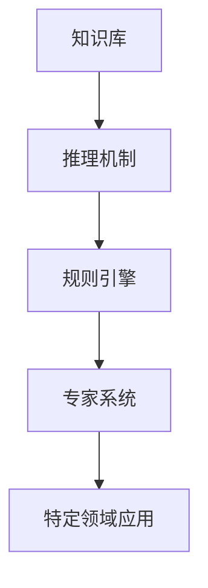

                 

## 1. 背景介绍

### 1.1 问题由来

人工智能（AI）是20世纪末期诞生的新型科技，通过模仿人类的思维过程，实现机器对环境的感知、理解和决策。第一代人工智能（First-Generation AI）主要基于知识驱动（Knowledge-driven）的方法，通过逻辑推理和规则引擎，完成特定的任务。这些方法在90年代中期之前取得了显著的进展，为后来的智能系统打下了坚实的基础。

在第一代人工智能中，专家系统（Expert Systems）是最为代表性的技术，通过对领域专家的知识进行形式化表示和推理，实现问题求解和决策支持。专家系统在医疗、法律、金融等多个领域都有广泛应用，如Mycin、Dendrel等医疗专家系统，已大大提高了诊断的准确性和效率。

然而，随着大数据和机器学习（Machine Learning）技术的兴起，第一代人工智能逐渐被新一代基于数据驱动（Data-driven）的机器学习所取代。机器学习通过训练模型，从大量数据中学习规律，从而实现预测、分类、聚类等任务，对人类智能的模拟更加接近。

尽管如此，第一代人工智能的知识驱动方法，仍具有独特的优势和应用场景，值得深入研究。本文将重点探讨第一代人工智能的知识驱动方法，分析其原理和优势，探讨其在当前及未来的应用前景。

### 1.2 问题核心关键点

第一代人工智能的知识驱动方法，基于人类的知识和经验，利用逻辑推理和规则引擎，完成特定任务。其核心在于：

1. **领域知识的获取和表示**：通过专家和领域专家的知识，形成知识库和规则库，为智能系统提供事实和推理规则。

2. **逻辑推理和推理机制**：利用推理算法，如前向链推理（Forward Chaining）、后向链推理（Backward Chaining）、双向链推理（Bi-directional Chaining）等，完成逻辑推理和问题求解。

3. **规则引擎的实现和应用**：基于知识库和推理机制，实现专家系统，完成特定领域的智能决策和问题解决。

4. **模型的评估和优化**：通过案例分析和反复迭代，不断优化知识库和规则库，提升专家系统的性能和适用性。

5. **应用的广泛性**：专家系统在医疗、法律、金融、制造业等多个领域都有广泛应用，取得了显著的成果。

## 2. 核心概念与联系

### 2.1 核心概念概述

为更好地理解第一代人工智能的知识驱动方法，本节将介绍几个密切相关的核心概念：

- **知识库（Knowledge Base）**：存储领域专家的知识，包括事实（Facts）和规则（Rules）。事实表示具体的信息，如"苹果是水果"；规则表示推理关系，如"如果病人有发热症状，则可能感染流感"。

- **推理机制（Inference Mechanism）**：利用知识库中的事实和规则，完成逻辑推理。常见的推理算法包括前向链推理、后向链推理、双向链推理等。

- **规则引擎（Rule Engine）**：实现推理机制，完成特定任务的智能决策和问题求解。规则引擎将用户输入与知识库进行匹配，通过推理得出结果。

- **专家系统（Expert System）**：基于知识库和规则引擎，实现特定领域的智能决策支持。专家系统通过模拟领域专家的知识，完成特定任务的求解。

这些核心概念之间的逻辑关系可以通过以下Mermaid流程图来展示：



这个流程图展示出知识库、推理机制、规则引擎和专家系统之间的关系：

1. 知识库存储领域专家的知识。
2. 推理机制利用知识库进行逻辑推理。
3. 规则引擎实现推理机制，完成智能决策。
4. 专家系统基于规则引擎，实现特定领域的智能决策支持。
5. 专家系统在具体领域中得到应用。

## 3. 核心算法原理 & 具体操作步骤
### 3.1 算法原理概述

第一代人工智能的知识驱动方法，本质上是通过模拟领域专家的知识，完成特定任务。其核心在于：

1. **知识获取与表示**：从领域专家处获取知识，将其形式化存储为知识库。
2. **推理机制设计**：设计推理算法，利用知识库中的事实和规则，完成逻辑推理。
3. **规则引擎实现**：将推理算法转化为代码，实现规则引擎，完成智能决策。
4. **专家系统集成**：将规则引擎集成到专家系统中，实现特定领域的智能决策支持。

### 3.2 算法步骤详解

第一代人工智能的知识驱动方法，通常包括以下几个关键步骤：

**Step 1: 知识库构建**

1. **知识获取**：通过访谈、文献查阅、专家咨询等方式，获取领域专家的知识，形成知识库。
2. **知识表示**：将知识库中的知识形式化表示，形成事实和规则。事实通常表示为三元组（对象、属性、值），如"苹果是水果"。规则表示为前提条件和结论，如"如果病人有发热症状，则可能感染流感"。

**Step 2: 推理机制设计**

1. **推理算法选择**：选择合适的推理算法，如前向链推理、后向链推理、双向链推理等。前向链推理从知识库的事实开始，逐步推导结论；后向链推理从结论开始，逐步查找事实；双向链推理同时从前向和后向两个方向进行推理。
2. **推理引擎实现**：将推理算法转化为代码，实现推理引擎。推理引擎接收用户输入，与知识库中的事实和规则进行匹配，完成推理。

**Step 3: 规则引擎实现**

1. **规则引擎设计**：将推理引擎集成到规则引擎中，实现智能决策。规则引擎接收用户输入，与知识库中的事实和规则进行匹配，得出结论。
2. **规则引擎优化**：通过案例分析和反复迭代，不断优化规则引擎，提升其推理性能和适用性。

**Step 4: 专家系统集成**

1. **专家系统设计**：将规则引擎集成到专家系统中，实现特定领域的智能决策支持。专家系统接收用户输入，通过规则引擎进行推理，得出结论。
2. **专家系统优化**：通过案例分析和反复迭代，不断优化专家系统，提升其性能和适用性。

### 3.3 算法优缺点

第一代人工智能的知识驱动方法，具有以下优点：

1. **可解释性强**：知识库和推理机制的实现都是基于人类逻辑和规则，推理过程可解释性强，易于理解和调试。
2. **适用性强**：适用于领域知识明确、逻辑关系清晰的特定领域，如医疗、法律、金融等。
3. **稳定性好**：由于知识库和推理机制的固定性，专家系统在特定领域内具有较好的稳定性和可靠性。

但同时，该方法也存在以下缺点：

1. **知识获取困难**：领域知识的获取和表示需要大量时间和人力，且质量难以保证。
2. **规则设计复杂**：规则的设计和实现较为复杂，容易出错。
3. **泛化能力有限**：专家系统在特定领域内表现优异，但在其他领域或特定情况下的泛化能力较弱。
4. **知识库维护困难**：知识库和规则库的维护需要大量时间和资源，难以持续更新。

尽管存在这些局限性，但第一代人工智能的知识驱动方法，在特定领域内依然具有不可替代的地位和应用前景。

### 3.4 算法应用领域

第一代人工智能的知识驱动方法，在以下领域具有广泛应用：

- **医疗领域**：用于诊断和治疗决策支持。如Mycin等医疗专家系统，已大大提高了诊断的准确性和效率。
- **法律领域**：用于案件分析、合同审核等。如Gemini、Loder等法律专家系统，提升了法律工作的效率和准确性。
- **金融领域**：用于风险评估、投资决策等。如Finpro等金融专家系统，帮助金融机构进行风险控制和决策。
- **制造业**：用于工艺优化、设备维护等。如Sigma、Medusa等工业专家系统，提高了生产效率和产品质量。

除了上述这些经典领域外，知识驱动方法在教育、交通、安全等众多领域也有广泛应用，为各行业带来了显著的效率提升和成本节约。

## 4. 数学模型和公式 & 详细讲解 & 举例说明

### 4.1 数学模型构建

本节将使用数学语言对知识驱动方法进行更加严格的刻画。

记知识库为 $\mathcal{K} = (\mathcal{F}, \mathcal{R})$，其中 $\mathcal{F}$ 为事实集合，$\mathcal{R}$ 为规则集合。事实表示为三元组 $f = (o, a, v)$，表示对象 $o$ 具有属性 $a$ 的值 $v$。规则表示为 $r = (\mathcal{P}, \mathcal{C})$，其中 $\mathcal{P}$ 为前提条件集合，$\mathcal{C}$ 为结论集合。推理过程可以表示为函数 $I: \mathcal{K} \times X \rightarrow Y$，其中 $X$ 为输入集，$Y$ 为输出集。推理过程将输入集 $X$ 与知识库 $\mathcal{K}$ 进行匹配，得到输出集 $Y$。

### 4.2 公式推导过程

以医疗诊断为例，假设知识库 $\mathcal{K}$ 包含以下事实和规则：

1. 事实：苹果是水果
2. 规则：如果病人有发热症状，则可能感染流感

推理过程可以表示为如下形式：

1. 输入：病人有发热症状
2. 推理引擎将输入与知识库进行匹配，得到中间结论：病人可能感染流感
3. 输出：病人可能感染流感

推理引擎的设计需要选择合适的推理算法，如前向链推理、后向链推理、双向链推理等。这里以前向链推理为例，推导推理过程：

设推理引擎的输入为 $x_0$，输出为 $x_n$，推理过程如下：

1. 输入：病人有发热症状，即 $x_0 = \text{病人有发热症状}$
2. 事实推理：病人有发热症状 → 可能感染流感，即 $f_1 = (\text{病人}, \text{发热症状}, \text{true})$
3. 结论推理：病人 → 可能感染流感，即 $r_1 = (\{\text{病人}\}, \{\text{可能感染流感}\})$
4. 输出：病人可能感染流感，即 $x_n = \text{病人可能感染流感}$

推理过程可以用数学公式表示为：

$$
x_n = I(x_0, \mathcal{K})
$$

其中 $I$ 为推理函数，$\mathcal{K}$ 为知识库，$x_0$ 为输入，$x_n$ 为输出。

### 4.3 案例分析与讲解

以医疗诊断为例，假设知识库 $\mathcal{K}$ 包含以下事实和规则：

1. 事实：苹果是水果
2. 规则：如果病人有发热症状，则可能感染流感
3. 规则：如果病人有咳嗽症状，则可能感染肺炎

推理过程可以表示为如下形式：

1. 输入：病人有发热和咳嗽症状，即 $x_0 = \text{病人有发热症状}, x_0 = \text{病人有咳嗽症状}$
2. 推理引擎将输入与知识库进行匹配，得到中间结论：病人可能感染流感和肺炎
3. 输出：病人可能感染流感和肺炎，即 $x_n = \text{病人可能感染流感}, x_n = \text{病人可能感染肺炎}$

推理引擎的设计需要选择合适的推理算法，如前向链推理、后向链推理、双向链推理等。这里以前向链推理为例，推导推理过程：

设推理引擎的输入为 $x_0$，输出为 $x_n$，推理过程如下：

1. 输入：病人有发热症状，即 $x_0 = \text{病人有发热症状}$
2. 事实推理：病人有发热症状 → 可能感染流感，即 $f_1 = (\text{病人}, \text{发热症状}, \text{true})$
3. 结论推理：病人 → 可能感染流感，即 $r_1 = (\{\text{病人}\}, \{\text{可能感染流感}\})$
4. 输入：病人有咳嗽症状，即 $x_0 = \text{病人有咳嗽症状}$
5. 事实推理：病人有咳嗽症状 → 可能感染肺炎，即 $f_2 = (\text{病人}, \text{咳嗽症状}, \text{true})$
6. 结论推理：病人 → 可能感染肺炎，即 $r_2 = (\{\text{病人}\}, \{\text{可能感染肺炎}\})$
7. 输出：病人可能感染流感和肺炎，即 $x_n = \text{病人可能感染流感}, x_n = \text{病人可能感染肺炎}$

推理过程可以用数学公式表示为：

$$
x_n = I(x_0, \mathcal{K})
$$

其中 $I$ 为推理函数，$\mathcal{K}$ 为知识库，$x_0$ 为输入，$x_n$ 为输出。

## 5. 项目实践：代码实例和详细解释说明
### 5.1 开发环境搭建

在进行知识驱动方法的实践前，我们需要准备好开发环境。以下是使用Python进行DICOM-17开发的环境配置流程：

1. 安装Anaconda：从官网下载并安装Anaconda，用于创建独立的Python环境。

2. 创建并激活虚拟环境：
```bash
conda create -n dicom-env python=3.8 
conda activate dicom-env
```

3. 安装PyTorch：根据CUDA版本，从官网获取对应的安装命令。例如：
```bash
conda install pytorch torchvision torchaudio cudatoolkit=11.1 -c pytorch -c conda-forge
```

4. 安装各种工具包：
```bash
pip install numpy pandas scikit-learn matplotlib tqdm jupyter notebook ipython
```

完成上述步骤后，即可在`dicom-env`环境中开始知识驱动方法的实践。

### 5.2 源代码详细实现

这里以医疗诊断为例，使用知识库和规则引擎实现专家系统。首先，定义事实和规则：

```python
class Fact:
    def __init__(self, subject, attribute, value):
        self.subject = subject
        self.attribute = attribute
        self.value = value
        
class Rule:
    def __init__(self, preconditions, conclusion):
        self.preconditions = preconditions
        self.conclusion = conclusion
        
# 定义事实和规则
fact1 = Fact("病人", "发热症状", True)
fact2 = Fact("病人", "咳嗽症状", True)
rule1 = Rule(["病人"], ["可能感染流感"])
rule2 = Rule(["病人"], ["可能感染肺炎"])
```

接着，定义推理引擎：

```python
class InferenceEngine:
    def __init__(self, knowledge_base):
        self.knowledge_base = knowledge_base
        
    def forward_chaining(self, input_facts):
        conclusion_facts = []
        for fact in input_facts:
            for rule in self.knowledge_base.rules:
                if all(map(lambda x: self.contains_fact(x, fact), rule.preconditions)):
                    conclusion_facts.append(Rule(rule.preconditions, rule.conclusion))
        return conclusion_facts
        
    def contains_fact(self, fact_pattern, target_fact):
        if fact_pattern == target_fact:
            return True
        elif fact_pattern.subject == target_fact.subject and fact_pattern.attribute == target_fact.attribute and fact_pattern.value == target_fact.value:
            return True
        else:
            return False
        
# 定义推理引擎
engine = InferenceEngine([fact1, rule1, fact2, rule2])
```

最后，定义推理过程：

```python
def infer(engine, input_facts):
    conclusion_facts = engine.forward_chaining(input_facts)
    return [fact.conclusion for fact in conclusion_facts]
```

推理过程如下：

```python
# 输入：病人有发热症状和咳嗽症状
input_facts = [fact1, fact2]
# 推理引擎推理
conclusion_facts = infer(engine, input_facts)
# 输出：病人可能感染流感和肺炎
print("病人可能感染", ", ".join(conclusion_facts))
```

以上就是使用Python实现知识驱动方法的医疗诊断专家系统的完整代码实现。可以看到，知识驱动方法的实现相对简单，通过定义事实和规则，设计推理引擎，即可实现特定领域的智能决策支持。

### 5.3 代码解读与分析

让我们再详细解读一下关键代码的实现细节：

**Fact和Rule类**：
- 定义了事实和规则的基本结构，事实包含对象、属性和值，规则包含前提条件和结论。

**InferenceEngine类**：
- 推理引擎的实现，包含知识库和推理函数。推理函数采用前向链推理，遍历知识库中的规则，查找符合条件的事实，得出结论。

**contains_fact方法**：
- 判断事实是否符合目标事实，用于事实匹配。

**infer方法**：
- 推理函数，接收输入事实，调用推理引擎进行推理，得出结论。

**代码示例**：
- 定义事实和规则，创建推理引擎，输入事实，调用推理函数，输出结论。

## 6. 实际应用场景
### 6.1 医疗领域

知识驱动方法在医疗领域有广泛应用，用于诊断和治疗决策支持。如Mycin等医疗专家系统，已大大提高了诊断的准确性和效率。

在实践中，可以收集医生在日常诊疗中的经验，将其形式化存储为知识库和规则库，利用推理引擎实现智能诊断。例如，针对特定症状和体征，推理引擎可以自动匹配相关的事实和规则，得出可能的诊断结果。医生可以参考推理结果，进一步进行诊断确认和治疗方案制定。

知识驱动方法在医疗领域的应用，可以减少医生的诊断错误，提高诊断的效率和准确性，显著提升医疗服务的质量。

### 6.2 金融领域

知识驱动方法在金融领域也有广泛应用，用于风险评估和投资决策支持。如Finpro等金融专家系统，帮助金融机构进行风险控制和决策。

在实践中，可以收集金融专家的经验和规则，将其形式化存储为知识库和规则库，利用推理引擎实现智能决策。例如，针对用户的投资行为和市场数据，推理引擎可以自动匹配相关的事实和规则，得出可能的投资建议。金融机构可以参考推理结果，进一步进行风险评估和决策确认。

知识驱动方法在金融领域的应用，可以降低投资风险，提高投资收益，显著提升金融服务的质量。

### 6.3 制造业

知识驱动方法在制造业也有广泛应用，用于工艺优化和设备维护支持。如Sigma、Medusa等工业专家系统，提高了生产效率和产品质量。

在实践中，可以收集制造专家的经验和规则，将其形式化存储为知识库和规则库，利用推理引擎实现智能决策。例如，针对设备的运行状态和故障历史，推理引擎可以自动匹配相关的事实和规则，得出可能的维护建议。制造企业可以参考推理结果，进一步进行设备维护和生产优化。

知识驱动方法在制造业的应用，可以降低生产成本，提高产品质量，显著提升制造服务的质量。

### 6.4 未来应用展望

随着知识驱动方法的不断发展，其应用场景将更加广泛，前景也将更加广阔。

在智慧城市领域，知识驱动方法可以用于交通管理、城市规划、环境监测等。例如，通过收集交通专家的经验和规则，利用推理引擎实现智能交通调度和管理，提高交通效率和安全性。

在教育领域，知识驱动方法可以用于教学辅助、学生评估等。例如，通过收集教师和教育专家的经验和规则，利用推理引擎实现智能教学辅助和学生评估，提高教学质量和效果。

在智能家居领域，知识驱动方法可以用于家庭自动化、设备互联等。例如，通过收集智能家居专家的经验和规则，利用推理引擎实现智能家居控制和管理，提高生活质量和便捷性。

未来，知识驱动方法将与其他人工智能技术进行更深入的融合，如知识图谱、逻辑推理、强化学习等，多路径协同发力，共同推动智能系统的进步。

## 7. 工具和资源推荐
### 7.1 学习资源推荐

为了帮助开发者系统掌握知识驱动方法的理论基础和实践技巧，这里推荐一些优质的学习资源：

1. 《Prolog用户手册》（Prolog User's Manual）：Prolog是知识驱动方法的典型语言，该书详细介绍了Prolog的基本语法和编程技巧，适合入门学习。

2. 《Expert Systems: The Wiki-WWW-KnowMeAll Model》（Expert Systems: The Wiki-WWW-KnowMeAll Model）：该书介绍了知识驱动方法的基本框架和应用场景，适合系统学习。

3. 《Knowledge-Based Systems: An Introduction》（Knowledge-Based Systems: An Introduction）：该书介绍了知识库和规则库的设计和管理方法，适合深入学习。

4. 《Reasoning with Knowledge Base Systems》（Reasoning with Knowledge Base Systems）：该书详细介绍了知识驱动方法的推理机制和算法，适合进阶学习。

5. 《AI Magazine》（AI Magazine）：该杂志是人工智能领域的权威期刊，发表了大量关于知识驱动方法的研究论文和应用案例，适合研究参考。

通过对这些资源的学习实践，相信你一定能够快速掌握知识驱动方法的精髓，并用于解决实际的NLP问题。

### 7.2 开发工具推荐

高效的开发离不开优秀的工具支持。以下是几款用于知识驱动方法开发的常用工具：

1. Prolog：Prolog是一种声明式编程语言，特别适合知识驱动方法的实现。Prolog有丰富的知识库和推理引擎实现，适合专家系统的开发。

2. IBM Watson：IBM Watson是一个基于知识驱动的智能决策平台，支持多领域专家系统的开发，并提供丰富的API接口，方便集成调用。

3. Google Cloud AI：Google Cloud AI是一个云端的AI开发平台，支持知识库和规则库的管理和推理引擎的部署，适合大规模知识驱动方法的开发。

4. Neo4j：Neo4j是一个图形数据库，特别适合知识图谱的管理和查询，适合知识驱动方法的实现。

5. Microsoft Azure Cognitive Services：Microsoft Azure Cognitive Services是一个云端的AI服务，支持多领域专家系统的开发和部署，适合知识驱动方法的实践。

合理利用这些工具，可以显著提升知识驱动方法的开发效率，加快创新迭代的步伐。

### 7.3 相关论文推荐

知识驱动方法的发展源于学界的持续研究。以下是几篇奠基性的相关论文，推荐阅读：

1. "KR"：Knowledge Representation and Reasoning in Prolog，介绍了Prolog的基本语法和推理机制。

2. "Expert Systems and Knowledge-Based Methods for Artificial Intelligence"（专家系统和知识驱动方法在人工智能中的应用），介绍了知识驱动方法的基本框架和应用场景。

3. "Knowledge Representation in a Knowledge-Based System"（知识库和规则库在知识驱动方法中的应用），介绍了知识库和规则库的设计和管理方法。

4. "The Problem of Matching Semantic Theories to Empirical Data"（语义理论匹配到实证数据的挑战），介绍了知识驱动方法的匹配机制和优化方法。

5. "Expert Systems"（专家系统），介绍了专家系统的基本原理和实现方法。

这些论文代表了大语言模型微调技术的发展脉络。通过学习这些前沿成果，可以帮助研究者把握学科前进方向，激发更多的创新灵感。

## 8. 总结：未来发展趋势与挑战

### 8.1 总结

本文对知识驱动方法进行了全面系统的介绍。首先阐述了知识驱动方法的原理和应用背景，明确了知识驱动方法在特定领域内的独特优势。其次，从原理到实践，详细讲解了知识驱动方法的数学模型和关键步骤，给出了知识驱动方法的具体代码实现。同时，本文还广泛探讨了知识驱动方法在医疗、金融、制造业等众多领域的应用前景，展示了其广阔的应用前景。最后，本文精选了知识驱动方法的学习资源、开发工具和相关论文，力求为读者提供全方位的技术指引。

通过本文的系统梳理，可以看到，知识驱动方法在特定领域内依然具有不可替代的地位和应用前景。尽管存在知识获取困难、规则设计复杂等挑战，但其可解释性强、适用性强的特点，使得其在特定领域内依然具有广泛的应用。

### 8.2 未来发展趋势

展望未来，知识驱动方法的发展将呈现以下几个趋势：

1. **知识库的自动化构建**：利用自然语言处理和人工智能技术，自动从文献、网页、专家咨询等途径获取知识，构建知识库。这样可以大大缩短知识获取和表示的时间，提高知识驱动方法的效率。

2. **推理机制的自动化优化**：利用机器学习和人工智能技术，自动优化推理机制，提高推理性能和推理准确性。例如，利用强化学习优化推理策略，提高推理引擎的推理能力。

3. **多模态知识融合**：将知识驱动方法与其他人工智能技术进行融合，如知识图谱、逻辑推理、自然语言处理等，实现多模态知识的融合，提升推理引擎的决策能力和适应性。

4. **跨领域知识的迁移**：利用知识驱动方法，实现跨领域知识的迁移，提升专家系统的通用性和可适应性。例如，利用医疗领域的经验，迁移应用于金融领域，提升金融专家的决策能力。

5. **知识驱动方法的智能化**：利用人工智能技术，自动从知识库中学习和发现新的规则和事实，提升推理引擎的自我学习和自我优化的能力。例如，利用深度学习技术，自动发现知识库中的隐性知识，提升推理引擎的推理能力。

这些趋势将使知识驱动方法在未来的应用中更加灵活、高效和智能化，为智能系统的构建提供更加可靠的技术支持。

### 8.3 面临的挑战

尽管知识驱动方法具有独特的优势和应用前景，但在迈向更加智能化、普适化应用的过程中，其面临的挑战仍然存在：

1. **知识获取困难**：领域知识的获取和表示需要大量时间和人力，且质量难以保证。如何自动获取高质量的知识，是一个重要的问题。

2. **规则设计复杂**：规则的设计和实现较为复杂，容易出错。如何自动化设计规则，减少出错率，是另一个重要的问题。

3. **知识库维护困难**：知识库和规则库的维护需要大量时间和资源，难以持续更新。如何构建自适应的知识库，提高知识库的维护效率，是另一个重要的问题。

4. **泛化能力有限**：知识驱动方法在特定领域内表现优异，但在其他领域或特定情况下的泛化能力较弱。如何提升知识驱动方法的泛化能力，是另一个重要的问题。

5. **推理性能受限**：推理引擎的性能受限于知识库的大小和复杂度。如何优化推理引擎，提高推理性能，是另一个重要的问题。

尽管存在这些挑战，但知识驱动方法在特定领域内依然具有不可替代的地位和应用前景。

### 8.4 研究展望

面向未来，知识驱动方法的研究需要在以下几个方面寻求新的突破：

1. **知识获取的自动化**：利用自然语言处理和人工智能技术，自动从文献、网页、专家咨询等途径获取知识，构建知识库。这样可以大大缩短知识获取和表示的时间，提高知识驱动方法的效率。

2. **推理机制的自动化优化**：利用机器学习和人工智能技术，自动优化推理机制，提高推理性能和推理准确性。例如，利用强化学习优化推理策略，提高推理引擎的推理能力。

3. **多模态知识的融合**：将知识驱动方法与其他人工智能技术进行融合，如知识图谱、逻辑推理、自然语言处理等，实现多模态知识的融合，提升推理引擎的决策能力和适应性。

4. **跨领域知识的迁移**：利用知识驱动方法，实现跨领域知识的迁移，提升专家系统的通用性和可适应性。例如，利用医疗领域的经验，迁移应用于金融领域，提升金融专家的决策能力。

5. **知识驱动方法的智能化**：利用人工智能技术，自动从知识库中学习和发现新的规则和事实，提升推理引擎的自我学习和自我优化的能力。例如，利用深度学习技术，自动发现知识库中的隐性知识，提升推理引擎的推理能力。

这些研究方向的探索，必将引领知识驱动方法迈向更高的台阶，为构建安全、可靠、可解释、可控的智能系统铺平道路。面向未来，知识驱动方法还需要与其他人工智能技术进行更深入的融合，如知识表示、因果推理、强化学习等，多路径协同发力，共同推动智能系统的进步。只有勇于创新、敢于突破，才能不断拓展知识驱动方法的边界，让智能技术更好地造福人类社会。

## 9. 附录：常见问题与解答

**Q1：知识驱动方法和机器学习方法的区别是什么？**

A: 知识驱动方法和机器学习方法在原理和应用场景上有显著区别。知识驱动方法基于领域专家的知识和规则，通过逻辑推理完成特定任务。机器学习方法基于数据和统计规律，通过模型训练完成特定任务。

1. **原理不同**：知识驱动方法利用领域知识进行推理，机器学习方法利用数据进行统计学习。
2. **适用场景不同**：知识驱动方法适用于领域知识明确、逻辑关系清晰的特定领域，如医疗、法律、金融等。机器学习方法适用于数据量较大、特征丰富的任务，如图像识别、自然语言处理等。
3. **应用方式不同**：知识驱动方法通常需要手动构建知识库和规则库，机器学习方法通常需要手动选择模型和特征。

尽管存在这些区别，知识驱动方法和机器学习方法在实际应用中也有一定程度的融合。例如，知识驱动方法可以利用机器学习技术自动优化推理机制，机器学习方法可以利用领域知识进行数据标注和特征选择。

**Q2：知识驱动方法在医疗诊断中的应用效果如何？**

A: 知识驱动方法在医疗诊断中有广泛应用，如Mycin等医疗专家系统，已大大提高了诊断的准确性和效率。具体而言，知识驱动方法可以用于诊断决策支持、治疗方案制定等。

1. **诊断决策支持**：通过收集医生在日常诊疗中的经验，将其形式化存储为知识库和规则库，利用推理引擎实现智能诊断。例如，针对特定症状和体征，推理引擎可以自动匹配相关的事实和规则，得出可能的诊断结果。医生可以参考推理结果，进一步进行诊断确认和治疗方案制定。
2. **治疗方案制定**：通过推理引擎自动匹配相关的事实和规则，得出可能的诊断结果和治疗方案。医生可以参考推理结果，进一步进行治疗方案的制定和优化。

知识驱动方法在医疗诊断中的应用，可以减少医生的诊断错误，提高诊断的效率和准确性，显著提升医疗服务的质量。

**Q3：知识驱动方法在金融领域的应用效果如何？**

A: 知识驱动方法在金融领域也有广泛应用，如Finpro等金融专家系统，帮助金融机构进行风险控制和决策。具体而言，知识驱动方法可以用于风险评估、投资决策等。

1. **风险评估**：通过收集金融专家的经验和规则，将其形式化存储为知识库和规则库，利用推理引擎实现智能决策。例如，针对用户的投资行为和市场数据，推理引擎可以自动匹配相关的事实和规则，得出可能的投资建议。金融机构可以参考推理结果，进一步进行风险评估和决策确认。
2. **投资决策**：通过推理引擎自动匹配相关的事实和规则，得出可能的投资建议。金融机构可以参考推理结果，进一步进行投资决策的制定和优化。

知识驱动方法在金融领域的应用，可以降低投资风险，提高投资收益，显著提升金融服务的质量。

**Q4：知识驱动方法在制造业的应用效果如何？**

A: 知识驱动方法在制造业也有广泛应用，如Sigma、Medusa等工业专家系统，提高了生产效率和产品质量。具体而言，知识驱动方法可以用于工艺优化、设备维护等。

1. **工艺优化**：通过收集制造专家的经验和规则，将其形式化存储为知识库和规则库，利用推理引擎实现智能决策。例如，针对设备的运行状态和故障历史，推理引擎可以自动匹配相关的事实和规则，得出可能的维护建议。制造企业可以参考推理结果，进一步进行设备维护和生产优化。
2. **设备维护**：通过推理引擎自动匹配相关的事实和规则，得出可能的维护建议。制造企业可以参考推理结果，进一步进行设备维护的制定和优化。

知识驱动方法在制造业的应用，可以降低生产成本，提高产品质量，显著提升制造服务的质量。

**Q5：知识驱动方法在医疗诊断中的应用难点是什么？**

A: 知识驱动方法在医疗诊断中的应用难点主要集中在以下几个方面：

1. **知识获取困难**：领域知识的获取和表示需要大量时间和人力，且质量难以保证。需要手动构建知识库和规则库，工作量较大。
2. **规则设计复杂**：规则的设计和实现较为复杂，容易出错。需要手工设计规则，工作量较大，且需要专业知识。
3. **知识库维护困难**：知识库和规则库的维护需要大量时间和资源，难以持续更新。需要手动维护知识库，工作量较大。

尽管存在这些难点，但知识驱动方法在医疗诊断中的应用效果显著，提升了诊断的准确性和效率。

**Q6：知识驱动方法在金融领域的应用难点是什么？**

A: 知识驱动方法在金融领域的应用难点主要集中在以下几个方面：

1. **知识获取困难**：金融领域的知识获取和表示需要大量时间和人力，且质量难以保证。需要手动构建知识库和规则库，工作量较大。
2. **规则设计复杂**：规则的设计和实现较为复杂，容易出错。需要手工设计规则，工作量较大，且需要专业知识。
3. **知识库维护困难**：知识库和规则库的维护需要大量时间和资源，难以持续更新。需要手动维护知识库，工作量较大。

尽管存在这些难点，但知识驱动方法在金融领域的应用效果显著，提升了金融服务的质量。

**Q7：知识驱动方法在制造业的应用难点是什么？**

A: 知识驱动方法在制造业的应用难点主要集中在以下几个方面：

1. **知识获取困难**：制造领域的知识获取和表示需要大量时间和人力，且质量难以保证。需要手动构建知识库和规则库，工作量较大。
2. **规则设计复杂**：规则的设计和实现较为复杂，容易出错。需要手工设计规则，工作量较大，且需要专业知识。
3. **知识库维护困难**：知识库和规则库的维护需要大量时间和资源，难以持续更新。需要手动维护知识库，工作量较大。

尽管存在这些难点，但知识驱动方法在制造业的应用效果显著，提升了制造服务的质量。

**Q8：知识驱动方法在智慧城市领域的应用前景是什么？**

A: 知识驱动方法在智慧城市领域有广泛应用，用于交通管理、城市规划、环境监测等。例如，通过收集交通专家的经验和规则，利用推理引擎实现智能交通调度和管理，提高交通效率和安全性。

1. **交通管理**：通过收集交通专家的经验和规则，利用推理引擎实现智能交通调度和管理，提高交通效率和安全性。
2. **城市规划**：通过收集城市规划专家的经验和规则，利用推理引擎实现智能城市规划，提高城市规划的科学性和合理性。
3. **环境监测**：通过收集环境监测专家的经验和规则，利用推理引擎实现智能环境监测，提高环境监测的准确性和及时性。

知识驱动方法在智慧城市领域的应用前景广阔，将大大提升城市管理的自动化和智能化水平，构建更安全、高效的未来城市。

---

作者：禅与计算机程序设计艺术 / Zen and the Art of Computer Programming

