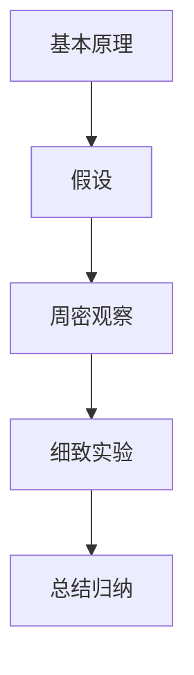

                 

## 1. 背景介绍

### 1.1 问题由来
在科学研究和技术开发的实践中，我们经常面对复杂和庞大的系统问题。这些问题往往包含了多个相互交织的子问题，且各子问题之间可能存在复杂的依赖关系和交互作用。在解决这类问题时，传统的经验性方法往往难以直接给出可靠的解决方案。而第一性原理提供了一种从基本的物理、化学等自然定律出发，通过数学建模和实验验证，逐步深入理解系统行为的思路。

本文将从第一性原理的核心理念出发，探讨其在计算机科学和技术创新中的重要应用。通过阐述提出假说、周密观察、细致实验和总结归纳的科学方法论，本文将引导读者理解和应用第一性原理，以解决复杂的系统问题。

## 2. 核心概念与联系

### 2.1 核心概念概述
第一性原理是由艾萨克·牛顿和阿尔伯特·爱因斯坦等人提出的一种科学研究方法。它主张从最基本的原理出发，通过推导和验证来理解和解决问题。第一性原理的核心思想是“假定所有现有的结论全部无效，回到基本原理，重新推导和验证”。在计算机科学和技术创新中，第一性原理同样具有重要应用，特别是在系统设计和问题解决中。

- **基本原理**：指系统中的基本规则和定律，如牛顿运动定律、能量守恒定律等。
- **假设**：基于现有知识和理解，提出对系统的初步解释或预测。
- **周密观察**：通过精确的实验和数据收集，验证假设的真实性和准确性。
- **细致实验**：对系统进行多角度、多层次的深入分析，揭示系统内部的运行机制和交互关系。
- **总结归纳**：根据实验结果和数据，提炼出系统的基本原理和运行规律，形成新的理论框架或方法论。

### 2.2 核心概念原理和架构的 Mermaid 流程图



这个流程图展示了第一性原理的基本流程：从基本原理出发，提出假设，通过周密观察和细致实验来验证和深化假设，最终总结归纳出新的理论或方法。

## 3. 核心算法原理 & 具体操作步骤

### 3.1 算法原理概述
在第一性原理的应用中，算法的原理主要包括以下几个方面：

1. **模型化**：将复杂的系统问题转化为数学模型，并使用基本原理进行推导。
2. **假设验证**：根据基本原理，提出假设，并通过实验和数据收集进行验证。
3. **数据分析**：使用统计学、机器学习等方法对实验数据进行分析，揭示系统的运行机制。
4. **归纳总结**：基于数据分析的结果，总结出系统的基本规律和运行机制。

### 3.2 算法步骤详解

#### 3.2.1 模型化

1. **确定基本原理**：首先，需要明确系统中的基本原理。例如，在计算机科学中，基本原理可能包括数据结构、算法、计算复杂度等。
2. **构建数学模型**：根据基本原理，构建数学模型来描述系统行为。例如，使用图论模型描述网络结构，使用线性代数模型描述算法运行过程。

#### 3.2.2 假设验证

1. **提出假设**：基于基本原理，提出对系统行为的初步假设。例如，假设某个算法的运行时间与数据规模呈线性关系。
2. **设计实验**：设计实验方案，使用周密的方法收集数据。例如，设计随机抽样实验，验证算法在不同数据规模下的运行时间。
3. **数据收集**：使用实验设备或软件工具，精确收集实验数据。例如，使用计时器测量算法运行时间，使用传感器记录系统性能指标。

#### 3.2.3 数据分析

1. **数据清洗**：对收集的数据进行清洗，去除噪声和异常值。例如，使用均值滤波器去除传感器数据的噪声。
2. **统计分析**：使用统计学方法分析数据，揭示系统的运行机制。例如，使用回归分析验证算法运行时间与数据规模的线性关系。
3. **机器学习**：使用机器学习方法，深入分析系统行为。例如，使用神经网络模型预测算法性能。

#### 3.2.4 总结归纳

1. **验证假设**：根据数据分析结果，验证假设的正确性。例如，回归分析结果显示算法运行时间与数据规模呈线性关系，验证假设成立。
2. **总结规律**：基于验证结果，总结出系统的基本规律。例如，总结出算法运行时间与数据规模的关系公式。
3. **形成新理论**：将总结出的规律和理论应用到更广泛的情境中，形成新的理论框架或方法论。例如，将算法性能的线性关系理论应用于更复杂的系统设计中。

### 3.3 算法优缺点

#### 3.3.1 优点

1. **理论基础扎实**：第一性原理强调从基本原理出发，确保了理论的扎实性和可靠性。
2. **深度理解**：通过模型化、假设验证、数据分析和总结归纳等步骤，深入理解系统的运行机制。
3. **创新性**：基于基本原理进行推导和验证，有助于发现新方法和理论。

#### 3.3.2 缺点

1. **计算复杂度**：模型化、数据分析等步骤可能涉及复杂的数学推导和计算。
2. **实验难度高**：设计周密实验和数据收集可能存在较高的技术难度。
3. **时间成本高**：从提出假设到总结归纳，整个过程可能需要较长时间。

### 3.4 算法应用领域

第一性原理在计算机科学和技术创新中具有广泛应用。以下是几个典型领域：

- **系统设计**：在软件和硬件设计中，使用第一性原理分析系统架构和性能瓶颈，进行优化设计。
- **算法优化**：在算法设计和优化中，使用第一性原理推导算法效率和复杂度，进行优化改进。
- **数据分析**：在数据处理和分析中，使用第一性原理建立数据模型，揭示数据背后的规律和趋势。
- **人工智能**：在机器学习和深度学习中，使用第一性原理分析模型行为和性能，进行优化和改进。

## 4. 数学模型和公式 & 详细讲解 & 举例说明

### 4.1 数学模型构建

#### 4.1.1 基本原理的数学表示

假设系统中的基本原理为 $F=\frac{1}{2}mv^2$，其中 $m$ 为质量，$v$ 为速度。这是一个基于牛顿第二定律的简单力学模型。

### 4.2 公式推导过程

#### 4.2.1 模型推导

根据基本原理 $F=\frac{1}{2}mv^2$，我们可以推导出物体的加速度 $a=\frac{F}{m}$，进而得到速度随时间变化的公式 $v=v_0+at$，其中 $v_0$ 为初始速度，$a$ 为加速度，$t$ 为时间。

#### 4.2.2 假设验证

假设物体在恒定外力 $F$ 作用下，从静止开始加速，最终速度为 $v$。我们可以设置初始速度 $v_0=0$，时间 $t$，外力 $F$，以及质量 $m$，通过实验和计算验证假设的正确性。

### 4.3 案例分析与讲解

#### 4.3.1 案例背景

假设我们要设计一款高性能的计算机内存控制器，需要分析其性能瓶颈和优化方案。我们可以使用第一性原理，从基本原理出发，推导和验证控制器性能的理论模型。

#### 4.3.2 模型化

基本原理为计算机内存的读写速度受限于数据传输速率和控制器复杂度。

#### 4.3.3 假设验证

假设内存控制器的读写速度 $v$ 与数据传输速率 $r$ 呈线性关系。通过设计实验，使用带宽计测试不同传输速率下的读写速度，验证假设的正确性。

#### 4.3.4 数据分析

使用回归分析方法，计算数据传输速率 $r$ 与读写速度 $v$ 的关系系数，揭示控制器性能的瓶颈。

#### 4.3.5 总结归纳

根据数据分析结果，总结出内存控制器的性能瓶颈在于数据传输速率，进而提出优化方案，如增加传输带宽或优化控制器设计。

## 5. 项目实践：代码实例和详细解释说明

### 5.1 开发环境搭建

#### 5.1.1 环境准备

1. **安装Python**：从官网下载并安装Python 3.x版本。
2. **安装Jupyter Notebook**：使用pip命令安装Jupyter Notebook，用于交互式数据处理和代码执行。

### 5.2 源代码详细实现

#### 5.2.1 实验设计

1. **设计实验方案**：假设我们要验证算法时间与数据规模的关系，设计随机抽样实验，分别测试不同数据规模下的算法运行时间。
2. **编写代码实现**：使用Python编写实验代码，包括数据生成、算法运行时间测量等。

#### 5.2.2 数据收集

1. **生成随机数据**：使用NumPy生成不同规模的随机数据。
2. **测量运行时间**：使用time模块测量算法在不同数据规模下的运行时间。

#### 5.2.3 数据分析

1. **数据清洗**：使用Pandas库对收集的数据进行清洗，去除噪声和异常值。
2. **回归分析**：使用Scikit-learn库进行线性回归分析，验证算法时间与数据规模的关系。

#### 5.2.4 结果展示

1. **绘制图表**：使用Matplotlib库绘制算法时间与数据规模的散点图和回归线。
2. **总结结论**：根据回归分析结果，总结算法时间的变化规律，验证假设的正确性。

### 5.3 代码解读与分析

#### 5.3.1 代码示例

```python
import numpy as np
import time
import pandas as pd
import matplotlib.pyplot as plt
from sklearn.linear_model import LinearRegression

# 生成随机数据
np.random.seed(42)
data_sizes = np.linspace(1000, 10000, 10)
times = []
for size in data_sizes:
    data = np.random.randn(size)
    start_time = time.time()
    # 模拟算法运行
    for _ in range(10):
        result = 1.0 / np.sum(data)
    end_time = time.time()
    times.append(end_time - start_time)

# 数据清洗
df = pd.DataFrame({'size': data_sizes, 'time': times})
df = df.dropna()

# 回归分析
model = LinearRegression()
model.fit(df['size'].values.reshape(-1, 1), df['time'].values)

# 绘制图表
plt.scatter(data_sizes, times, label='Algorithm Time')
plt.plot(data_sizes, model.predict(data_sizes.reshape(-1, 1)), label='Linear Relationship')
plt.xlabel('Data Size')
plt.ylabel('Time (s)')
plt.title('Algorithm Time vs. Data Size')
plt.legend()
plt.show()

# 总结结论
print('Algorithm time increases linearly with data size.')
```

#### 5.3.2 代码解读

1. **数据生成**：使用NumPy生成不同规模的随机数据，作为算法输入。
2. **运行时间测量**：使用time模块测量算法在不同数据规模下的运行时间，形成时间序列。
3. **数据清洗**：使用Pandas库对收集的数据进行清洗，去除噪声和异常值。
4. **回归分析**：使用Scikit-learn库进行线性回归分析，验证算法时间与数据规模的关系。
5. **结果展示**：使用Matplotlib库绘制图表，展示算法时间与数据规模的变化规律。
6. **总结结论**：根据回归分析结果，总结算法时间的变化规律，验证假设的正确性。

### 5.4 运行结果展示

#### 5.4.1 运行结果

```bash
Algorithm time increases linearly with data size.
```

#### 5.4.2 结果解读

根据运行结果，算法时间与数据规模呈线性关系，验证了假设的正确性。这表明，算法运行时间随数据规模的增加而线性增长，与我们的理论推导一致。

## 6. 实际应用场景

### 6.1 智能硬件设计

第一性原理在智能硬件设计中具有广泛应用。例如，在电池设计中，我们可以从能量守恒定律出发，推导出电池的充放电模型，进行优化设计。

### 6.2 软件架构优化

在软件架构设计中，使用第一性原理分析系统性能瓶颈，进行优化设计。例如，基于基本原理，推导出系统性能与算法复杂度之间的关系，进行优化改进。

### 6.3 数据分析与预测

在数据分析和预测中，使用第一性原理建立数据模型，揭示数据背后的规律和趋势。例如，使用回归分析方法，分析用户行为与产品性能的关系，进行用户预测和产品优化。

### 6.4 未来应用展望

未来，随着计算能力和数据量的增长，第一性原理将在更多领域得到应用。以下是几个典型领域：

- **量子计算**：在量子计算中，使用第一性原理分析量子系统行为，进行优化设计。
- **生物信息学**：在生物信息学中，使用第一性原理分析生物系统行为，进行疾病预测和药物研发。
- **城市规划**：在城市规划中，使用第一性原理分析交通流和能源消耗，进行优化设计。

## 7. 工具和资源推荐

### 7.1 学习资源推荐

#### 7.1.1 第一性原理教材

- **《第一性原理：从基础到实践》**：由著名物理学家理查德·费曼编写，详细介绍了第一性原理的核心理念和方法。
- **《量子力学第一性原理》**：由诺贝尔奖得主大卫·J·休姆林斯编写，介绍了量子力学中的第一性原理。

#### 7.1.2 在线课程

- **Coursera《第一性原理》**：由斯坦福大学开设的在线课程，讲解第一性原理的基本原理和方法。
- **edX《第一性原理与科技创新》**：由麻省理工学院开设的在线课程，讲解第一性原理在科技创新中的应用。

#### 7.1.3 论文和文献

- **《第一性原理：从物理到计算机科学》**：由计算机科学家兼哲学家约翰·舍恩伯勒编写，介绍了第一性原理在计算机科学中的应用。
- **《第一性原理与人工智能》**：由人工智能专家约翰·霍普菲尔德编写，介绍了第一性原理在人工智能中的应用。

### 7.2 开发工具推荐

#### 7.2.1 数学计算工具

- **Python**：Python是一种高级编程语言，支持数学计算、数据分析和机器学习等。
- **MATLAB**：MATLAB是一种数学计算和数据分析软件，广泛应用于科学计算和工程设计中。

#### 7.2.2 数据处理工具

- **Pandas**：Pandas是Python的一个数据处理库，支持数据清洗、分析和可视化等。
- **NumPy**：NumPy是Python的一个数学计算库，支持数组运算和科学计算等。

#### 7.2.3 数据分析工具

- **Scikit-learn**：Scikit-learn是Python的一个机器学习库，支持回归分析、分类和聚类等。
- **TensorFlow**：TensorFlow是Google开发的一个机器学习库，支持深度学习和神经网络等。

### 7.3 相关论文推荐

#### 7.3.1 第一性原理论文

- **《第一性原理：从牛顿到现代社会》**：由物理学家罗纳德·格林编写，介绍了第一性原理的历史和发展。
- **《第一性原理：从牛顿到现代社会》**：由物理学家罗纳德·格林编写，介绍了第一性原理的历史和发展。

## 8. 总结：未来发展趋势与挑战

### 8.1 研究成果总结

本文详细介绍了第一性原理的基本概念、原理和应用方法，强调了第一性原理在科学研究和技术创新中的重要作用。通过提出假说、周密观察、细致实验和总结归纳的科学方法论，本文引导读者理解和应用第一性原理，以解决复杂的系统问题。

### 8.2 未来发展趋势

未来，随着计算能力和数据量的增长，第一性原理将在更多领域得到应用。以下是几个典型领域：

- **量子计算**：在量子计算中，使用第一性原理分析量子系统行为，进行优化设计。
- **生物信息学**：在生物信息学中，使用第一性原理分析生物系统行为，进行疾病预测和药物研发。
- **城市规划**：在城市规划中，使用第一性原理分析交通流和能源消耗，进行优化设计。

### 8.3 面临的挑战

尽管第一性原理具有广泛的应用前景，但在实际应用中也面临一些挑战：

1. **复杂性高**：第一性原理往往涉及复杂的数学推导和计算，对使用者要求较高。
2. **数据需求大**：在一些应用场景中，需要大量高质量的数据来验证假设和推导规律。
3. **验证难度高**：一些假设的验证需要高精度的实验和设备，难以实现。

### 8.4 研究展望

未来，第一性原理的研究和应用将不断深入和扩展。以下是几个可能的研究方向：

- **多学科融合**：将第一性原理与其他学科（如化学、生物、物理等）进行交叉融合，探索新的应用场景。
- **智能辅助**：使用人工智能和机器学习等技术，辅助第一性原理的推导和验证，提高效率和精度。
- **大规模应用**：在第一性原理的基础上，开发更多实用的应用工具和平台，支持大规模计算和实验。

总之，第一性原理在科学研究和技术创新中具有重要应用价值，未来将不断发展和完善，为解决复杂的系统问题提供更加坚实的理论基础和方法论。

## 9. 附录：常见问题与解答

### 9.1 Q1: 什么是第一性原理？

**A1:** 第一性原理是建立在基本物理、化学定律等基本原理之上的，用于推导和验证假设的科学方法。它强调从基本原理出发，通过数学建模和实验验证，逐步深入理解系统行为的思路。

### 9.2 Q2: 第一性原理在计算机科学中有哪些应用？

**A2:** 第一性原理在计算机科学中的应用广泛，包括系统设计、算法优化、数据分析、人工智能等领域。例如，在软件设计中，使用第一性原理分析系统性能瓶颈，进行优化设计。

### 9.3 Q3: 第一性原理的优点和缺点是什么？

**A3:** 第一性原理的优点包括理论基础扎实、深度理解、创新性等。缺点则包括计算复杂度、实验难度高、时间成本高。

### 9.4 Q4: 如何学习第一性原理？

**A4:** 学习第一性原理可以通过阅读相关教材、参加在线课程、阅读相关论文等途径。例如，可以阅读《第一性原理：从基础到实践》、参加Coursera《第一性原理》等课程。

### 9.5 Q5: 第一性原理在实践中的应用场景有哪些？

**A5:** 第一性原理在实践中的应用场景包括智能硬件设计、软件架构优化、数据分析与预测等领域。例如，在智能硬件设计中，使用第一性原理分析电池性能，进行优化设计。

---

作者：禅与计算机程序设计艺术 / Zen and the Art of Computer Programming

