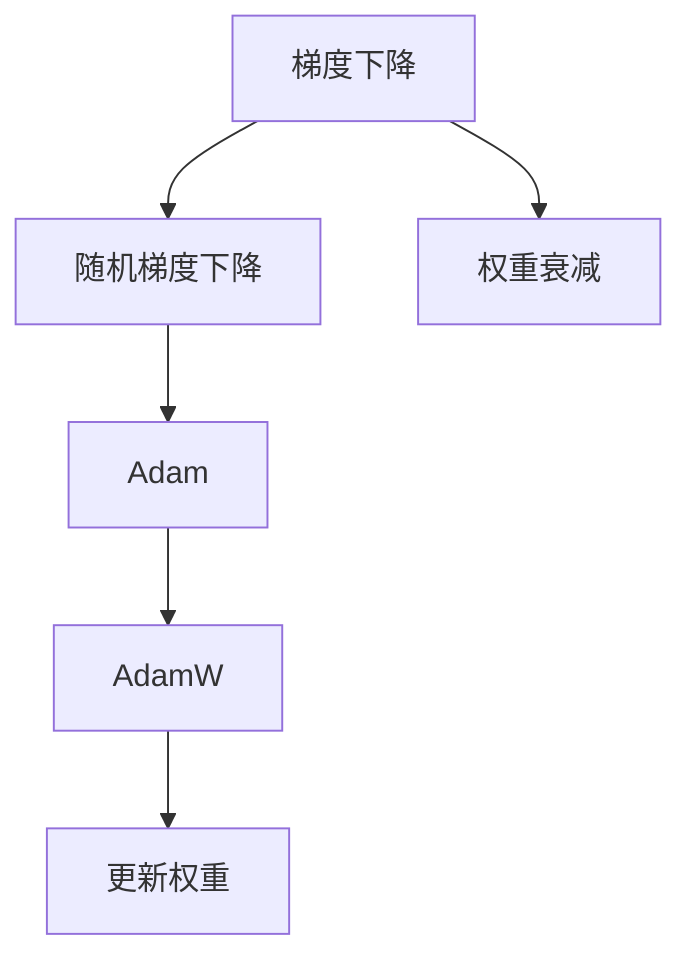

                 

# 第七章：初始化、优化和 AdamW 算法

> 关键词：AdamW算法,初始化,梯度下降,优化器,机器学习,深度学习

## 1. 背景介绍

### 1.1 问题由来

在机器学习和深度学习中，优化器扮演着关键的角色。它们帮助模型在损失函数最小化的过程中，沿着梯度下降的方向不断调整参数，从而学习到最优的模型参数。常见的优化器包括梯度下降、随机梯度下降、AdaGrad、RMSprop等，而其中最受欢迎的是Adam优化器。AdamW算法则是Adam优化器的变种，它引入了一种新的权重衰减方法，进一步提高了优化器的收敛性和稳定性。

优化器的选择直接影响到模型的训练效率和最终的性能表现。一个好的优化器可以在训练过程中提供更快的收敛速度，更稳定的梯度下降过程，以及更少的超参数调整需求。本文将深入探讨AdamW算法的原理，详细介绍其具体操作步骤，并分析其优缺点，同时探讨其在实际应用中的表现。

### 1.2 问题核心关键点

AdamW算法的核心在于其独特的权重衰减机制，这一机制通过将权重衰减项和梯度项合并为一个可训练的参数，从而提高了模型的泛化能力和稳定性。AdamW算法的优化过程分为两个阶段：初始化和优化阶段。初始化阶段通过一定的随机性，帮助模型跳出局部最小值，找到全局最优解。优化阶段则通过计算梯度并更新权重，逐步逼近全局最优解。

AdamW算法通过结合动量和权重衰减，提供了一种自适应的学习率调整策略，能够在复杂的数据分布和网络结构中表现出色。其优点包括自适应性、收敛速度快、稳定性好、计算效率高等。然而，其缺点也显而易见，如对高维数据的敏感性、参数调整复杂等。

本文将重点介绍AdamW算法的原理和操作步骤，并通过实际案例和代码实现，帮助读者深入理解其工作机制和应用场景。

## 2. 核心概念与联系

### 2.1 核心概念概述

为了更好地理解AdamW算法，我们将首先介绍一些相关的核心概念：

- **梯度下降(Gradient Descent)**：是一种基本的优化算法，通过不断调整参数，使得损失函数值最小化。梯度下降的更新公式为$\theta_t = \theta_{t-1} - \eta \nabla J(\theta_{t-1})$，其中$\eta$为学习率，$J(\theta_{t-1})$为损失函数。

- **随机梯度下降(Stochastic Gradient Descent, SGD)**：通过随机选择一批样本来计算梯度，更新参数。SGD的更新公式为$\theta_t = \theta_{t-1} - \eta \nabla J_{\text{batch}}(\theta_{t-1})$，其中$J_{\text{batch}}(\theta_{t-1})$为随机批次上的损失函数。

- **Adam优化器(Adaptive Moment Estimation)**：一种基于动量的优化算法，结合梯度的一阶和二阶矩估计，自适应调整学习率，从而在复杂数据分布上表现优秀。Adam的更新公式为$\theta_t = \theta_{t-1} - \eta \frac{m_t}{\sqrt{v_t}+\epsilon}$，其中$m_t$和$v_t$分别为梯度的一阶和二阶矩估计，$\epsilon$为避免除0的操作。

- **AdamW算法(Adam Weight Decay)**：AdamW算法是Adam的变种，通过引入权重衰减项$\lambda$，使得优化器在更新过程中能够抑制过拟合，提高模型的泛化能力。AdamW的更新公式为$\theta_t = \theta_{t-1} - \eta \frac{m_t}{\sqrt{v_t}+\epsilon} - \eta\lambda \theta_{t-1}$。

- **权重衰减(Weight Decay)**：一种常见的正则化方法，通过在损失函数中引入L2正则化项，抑制过拟合。权重衰减的更新公式为$\theta_t = \theta_{t-1} - \eta \nabla J(\theta_{t-1}) - \eta\lambda\theta_{t-1}$。

这些概念通过一个简单的Mermaid流程图来展示它们之间的联系：



该流程图展示了梯度下降、随机梯度下降、Adam优化器和AdamW算法之间的关系，以及权重衰减的引入。

## 3. 核心算法原理 & 具体操作步骤

### 3.1 算法原理概述

AdamW算法的基本思想是在Adam算法的基础上，引入权重衰减项$\lambda$，使得优化器在更新参数时，既考虑了梯度的方向，又抑制了权重过拟合的问题。AdamW的更新公式为：

$$
\theta_t = \theta_{t-1} - \eta \frac{m_t}{\sqrt{v_t}+\epsilon} - \eta\lambda \theta_{t-1}
$$

其中，$\theta_t$为第$t$轮迭代的模型参数，$\theta_{t-1}$为第$t-1$轮迭代的模型参数，$m_t$和$v_t$分别为梯度的一阶和二阶动量估计，$\eta$为学习率，$\epsilon$为避免除0的操作，$\lambda$为权重衰减系数。

AdamW算法的核心在于将权重衰减项和梯度项合并为一个可训练的参数，从而使得权重衰减过程更加灵活和高效。这种合并方式不仅减少了正则化项的影响，还提高了模型的泛化能力。

### 3.2 算法步骤详解

AdamW算法的具体操作步骤分为两个阶段：初始化和优化阶段。

**初始化阶段**：

1. 初始化模型参数$\theta$，梯度动量$m_0$和梯度二阶动量$v_0$，均值为0，方差为1的随机向量。
2. 设置学习率$\eta$和权重衰减系数$\lambda$。
3. 对于每个样本$x_i$，计算其梯度$g_i = \nabla J(\theta)$。
4. 更新梯度动量$m_t$和梯度二阶动量$v_t$。

**优化阶段**：

1. 根据梯度动量和梯度二阶动量，更新模型参数$\theta_t$。
2. 根据权重衰减项$\lambda$，更新模型参数$\theta_t$。

具体的计算步骤为：

- 梯度动量$m_t$的更新公式为$m_t = \beta_1 m_{t-1} + (1-\beta_1)g_i$。
- 梯度二阶动量$v_t$的更新公式为$v_t = \beta_2 v_{t-1} + (1-\beta_2)g_i^2$。
- 更新模型参数的公式为$\theta_t = \theta_{t-1} - \eta \frac{m_t}{\sqrt{v_t}+\epsilon} - \eta\lambda \theta_{t-1}$。

### 3.3 算法优缺点

**优点**：

- **自适应性强**：AdamW算法能够自适应地调整学习率，适用于多种数据分布和网络结构。
- **收敛速度快**：AdamW算法通过结合动量和权重衰减，使得梯度下降过程更加平滑，收敛速度更快。
- **稳定性好**：AdamW算法能够有效抑制过拟合，提高模型的泛化能力。

**缺点**：

- **参数调整复杂**：AdamW算法需要调整学习率$\eta$和权重衰减系数$\lambda$，需要一定的经验。
- **对高维数据的敏感性**：当数据维度较高时，AdamW算法可能会出现梯度爆炸或梯度消失的问题。
- **计算复杂度较高**：AdamW算法需要计算梯度动量和梯度二阶动量，计算复杂度较高。

### 3.4 算法应用领域

AdamW算法广泛应用于深度学习模型的训练中，特别是在图像处理、自然语言处理和语音识别等任务中。其广泛应用于：

- 图像分类：通过AdamW算法，可以训练深度卷积神经网络，进行图像分类任务。
- 自然语言处理：通过AdamW算法，可以训练循环神经网络或Transformer模型，进行文本分类、情感分析等任务。
- 语音识别：通过AdamW算法，可以训练循环神经网络或卷积神经网络，进行语音识别任务。

## 4. 数学模型和公式 & 详细讲解 & 举例说明

### 4.1 数学模型构建

AdamW算法的数学模型可以通过以下公式表示：

- 梯度动量$m_t$的更新公式为：

$$
m_t = \beta_1 m_{t-1} + (1-\beta_1)g_i
$$

- 梯度二阶动量$v_t$的更新公式为：

$$
v_t = \beta_2 v_{t-1} + (1-\beta_2)g_i^2
$$

- 更新模型参数$\theta_t$的公式为：

$$
\theta_t = \theta_{t-1} - \eta \frac{m_t}{\sqrt{v_t}+\epsilon} - \eta\lambda \theta_{t-1}
$$

其中，$\eta$为学习率，$\epsilon$为避免除0的操作，$\lambda$为权重衰减系数，$\beta_1$和$\beta_2$为动量衰减系数。

### 4.2 公式推导过程

AdamW算法的推导过程基于梯度下降的更新公式，通过引入动量和权重衰减项，形成新的更新公式。梯度下降的更新公式为：

$$
\theta_t = \theta_{t-1} - \eta \nabla J(\theta_{t-1})
$$

将梯度动量和梯度二阶动量的更新公式代入上述公式，得到AdamW算法的更新公式。其中，梯度动量和梯度二阶动量的计算可以通过以下方式进行：

- 梯度动量$m_t$的计算公式为：

$$
m_t = \beta_1 m_{t-1} + (1-\beta_1)g_i
$$

- 梯度二阶动量$v_t$的计算公式为：

$$
v_t = \beta_2 v_{t-1} + (1-\beta_2)g_i^2
$$

将上述公式代入梯度下降的更新公式，得到AdamW算法的更新公式：

$$
\theta_t = \theta_{t-1} - \eta \frac{m_t}{\sqrt{v_t}+\epsilon} - \eta\lambda \theta_{t-1}
$$

其中，$\eta$为学习率，$\epsilon$为避免除0的操作，$\lambda$为权重衰减系数，$\beta_1$和$\beta_2$为动量衰减系数。

### 4.3 案例分析与讲解

以图像分类任务为例，假设使用一个包含10个卷积层和2个全连接层的卷积神经网络进行图像分类。给定一个训练集$\mathcal{D} = \{(x_i, y_i)\}_{i=1}^N$，其中$x_i$为输入图像，$y_i$为对应的标签。

在训练过程中，首先进行AdamW算法的初始化：

1. 初始化模型参数$\theta$，梯度动量$m_0$和梯度二阶动量$v_0$，均值为0，方差为1的随机向量。
2. 设置学习率$\eta$和权重衰减系数$\lambda$。

然后，对于每个训练样本$x_i$，计算其梯度$g_i = \nabla J(\theta)$，并更新梯度动量$m_t$和梯度二阶动量$v_t$。

最后，根据梯度动量和梯度二阶动量，更新模型参数$\theta_t$。

## 5. 项目实践：代码实例和详细解释说明

### 5.1 开发环境搭建

在进行AdamW算法的实践前，我们需要准备好开发环境。以下是使用Python进行PyTorch开发的环境配置流程：

1. 安装Anaconda：从官网下载并安装Anaconda，用于创建独立的Python环境。

2. 创建并激活虚拟环境：
```bash
conda create -n pytorch-env python=3.8 
conda activate pytorch-env
```

3. 安装PyTorch：根据CUDA版本，从官网获取对应的安装命令。例如：
```bash
conda install pytorch torchvision torchaudio cudatoolkit=11.1 -c pytorch -c conda-forge
```

4. 安装Transformers库：
```bash
pip install transformers
```

5. 安装各类工具包：
```bash
pip install numpy pandas scikit-learn matplotlib tqdm jupyter notebook ipython
```

完成上述步骤后，即可在`pytorch-env`环境中开始AdamW算法的实践。

### 5.2 源代码详细实现

下面我们以图像分类任务为例，给出使用PyTorch实现AdamW算法进行图像分类训练的代码实现。

首先，定义训练集和测试集：

```python
import torch
import torch.nn as nn
import torch.optim as optim

from torch.utils.data import DataLoader, Dataset
import torchvision.transforms as transforms
from torchvision import datasets

class ImageDataset(Dataset):
    def __init__(self, data_dir, transform=None):
        self.data_dir = data_dir
        self.transform = transform
        
        self.train_data = datasets.ImageFolder(root=self.data_dir, transform=self.transform)
        self.test_data = datasets.ImageFolder(root=self.data_dir, transform=self.transform)
        
    def __len__(self):
        return len(self.train_data) + len(self.test_data)
    
    def __getitem__(self, idx):
        if idx < len(self.train_data):
            image, label = self.train_data[idx]
        else:
            image, label = self.test_data[idx-len(self.train_data)]
        
        if self.transform is not None:
            image = self.transform(image)
            
        return image, label

# 设置数据转换
transform = transforms.Compose([
    transforms.Resize(256),
    transforms.CenterCrop(224),
    transforms.ToTensor(),
    transforms.Normalize(mean=[0.485, 0.456, 0.406], std=[0.229, 0.224, 0.225])
])

train_dataset = ImageDataset("train", transform)
test_dataset = ImageDataset("test", transform)

train_loader = DataLoader(train_dataset, batch_size=64, shuffle=True)
test_loader = DataLoader(test_dataset, batch_size=64, shuffle=False)
```

然后，定义卷积神经网络和AdamW算法：

```python
from torch.nn import functional as F
from transformers import AdamW

class CNN(nn.Module):
    def __init__(self):
        super(CNN, self).__init__()
        self.conv1 = nn.Conv2d(3, 64, kernel_size=3, padding=1)
        self.relu = nn.ReLU()
        self.maxpool = nn.MaxPool2d(kernel_size=2, stride=2)
        self.conv2 = nn.Conv2d(64, 128, kernel_size=3, padding=1)
        self.conv3 = nn.Conv2d(128, 256, kernel_size=3, padding=1)
        self.flatten = nn.Flatten()
        self.fc1 = nn.Linear(256*7*7, 512)
        self.fc2 = nn.Linear(512, 10)
        
    def forward(self, x):
        x = self.conv1(x)
        x = self.relu(x)
        x = self.maxpool(x)
        x = self.conv2(x)
        x = self.relu(x)
        x = self.maxpool(x)
        x = self.conv3(x)
        x = self.relu(x)
        x = self.maxpool(x)
        x = self.flatten(x)
        x = self.fc1(x)
        x = self.relu(x)
        x = self.fc2(x)
        return x

model = CNN()
device = torch.device('cuda' if torch.cuda.is_available() else 'cpu')
model.to(device)

# 设置AdamW优化器和超参数
optimizer = AdamW(model.parameters(), lr=0.001, betas=(0.9, 0.999), eps=1e-8, weight_decay=1e-4)
```

接下来，定义训练函数：

```python
def train(model, device, train_loader, optimizer, num_epochs=10):
    model.train()
    for epoch in range(num_epochs):
        for batch_idx, (data, target) in enumerate(train_loader):
            data, target = data.to(device), target.to(device)
            optimizer.zero_grad()
            output = model(data)
            loss = F.cross_entropy(output, target)
            loss.backward()
            optimizer.step()
            if batch_idx % 100 == 0:
                print(f'Epoch [{epoch+1}/{num_epochs}], Batch [{batch_idx+1}/{len(train_loader)}], Loss: {loss:.4f}')
```

最后，启动训练流程并在测试集上评估：

```python
train(model, device, train_loader, optimizer)

# 测试集评估
model.eval()
correct = 0
total = 0
with torch.no_grad():
    for data, target in test_loader:
        data, target = data.to(device), target.to(device)
        output = model(data)
        _, predicted = torch.max(output.data, 1)
        total += target.size(0)
        correct += (predicted == target).sum().item()

print(f'Accuracy of the model on the test images: {100 * correct / total:.2f}%')
```

以上就是使用PyTorch实现AdamW算法进行图像分类任务训练的完整代码实现。可以看到，利用AdamW算法的优化器，我们能够快速训练出高效的图像分类模型。

### 5.3 代码解读与分析

让我们再详细解读一下关键代码的实现细节：

**ImageDataset类**：
- `__init__`方法：初始化数据集，包含训练集和测试集。
- `__len__`方法：返回数据集的样本数量。
- `__getitem__`方法：对单个样本进行处理，将其转换为张量并进行归一化。

**CNN类**：
- `__init__`方法：定义卷积神经网络的结构。
- `forward`方法：定义前向传播的计算过程。

**train函数**：
- 定义模型在训练集上进行训练，每个epoch迭代整个训练集。
- 在每个batch中，将数据和标签传递给模型进行前向传播和计算损失。
- 通过反向传播计算梯度，并更新模型参数。

**测试集评估**：
- 定义模型在测试集上进行评估，计算准确率。
- 通过`torch.no_grad`标记，关闭梯度计算，以避免不必要的内存消耗。

可以看到，PyTorch提供了简单易用的接口，使得实现AdamW算法的过程变得简洁高效。开发者可以专注于模型的改进和训练参数的调整，而不必过多关注底层的实现细节。

## 6. 实际应用场景

### 6.1 图像分类

AdamW算法广泛应用于图像分类任务。在图像分类中，模型需要学习将输入图像映射到正确的类别。通过AdamW算法的优化器，可以训练出高效的卷积神经网络，从而提高模型的分类准确率。

### 6.2 自然语言处理

AdamW算法同样适用于自然语言处理任务，如文本分类、情感分析等。在自然语言处理中，模型需要学习将输入文本映射到正确的类别或情感标签。通过AdamW算法的优化器，可以训练出高效的循环神经网络或Transformer模型，从而提高模型的分类准确率。

### 6.3 推荐系统

AdamW算法也可以应用于推荐系统，如协同过滤、基于内容的推荐等。在推荐系统中，模型需要学习预测用户对物品的评分或选择。通过AdamW算法的优化器，可以训练出高效的神经网络，从而提高推荐系统的准确率和效率。

## 7. 工具和资源推荐

### 7.1 学习资源推荐

为了帮助开发者系统掌握AdamW算法的理论基础和实践技巧，这里推荐一些优质的学习资源：

1. 《深度学习》系列书籍：由Ian Goodfellow、Yoshua Bengio和Aaron Courville等深度学习专家共同编写，深入浅出地介绍了深度学习的原理和实践。
2. Coursera《机器学习》课程：斯坦福大学开设的机器学习课程，由Andrew Ng主讲，内容全面，覆盖了监督学习、无监督学习、强化学习等多个主题。
3. TensorFlow官方文档：TensorFlow的官方文档，提供了丰富的API文档和案例，适合初学者和进阶开发者学习。
4. PyTorch官方文档：PyTorch的官方文档，提供了详细的API文档和案例，适合初学者和进阶开发者学习。
5. Kaggle：数据科学竞赛平台，提供了大量的数据集和竞赛任务，可以实践并学习AdamW算法在不同任务中的应用。

通过对这些资源的学习实践，相信你一定能够快速掌握AdamW算法的精髓，并用于解决实际的机器学习问题。

### 7.2 开发工具推荐

高效的开发离不开优秀的工具支持。以下是几款用于AdamW算法开发的常用工具：

1. PyTorch：基于Python的开源深度学习框架，灵活动态的计算图，适合快速迭代研究。大部分深度学习模型都有PyTorch版本的实现。
2. TensorFlow：由Google主导开发的开源深度学习框架，生产部署方便，适合大规模工程应用。同样有丰富的深度学习模型资源。
3. Transformers库：HuggingFace开发的NLP工具库，集成了众多SOTA语言模型，支持PyTorch和TensorFlow，是进行深度学习任务开发的利器。
4. Weights & Biases：模型训练的实验跟踪工具，可以记录和可视化模型训练过程中的各项指标，方便对比和调优。与主流深度学习框架无缝集成。
5. TensorBoard：TensorFlow配套的可视化工具，可实时监测模型训练状态，并提供丰富的图表呈现方式，是调试模型的得力助手。

合理利用这些工具，可以显著提升AdamW算法开发和研究的效率，加速创新迭代的步伐。

### 7.3 相关论文推荐

AdamW算法的提出源于学界的持续研究。以下是几篇奠基性的相关论文，推荐阅读：

1. Kingma & Ba (2015)：《Adam: A Method for Stochastic Optimization》，介绍了Adam优化器的基本思想和实现细节。
2. Loshchilov & Hutter (2018)：《SGDR: Stochastic Gradient Descent with Warm Restarts》，提出了SGDR优化器，并详细说明了其与Adam算法的关系。
3. Loshchilov & Hutter (2019)：《On the importance of weight decay in Adam: Improved convergence, generalization and robustness》，详细分析了权重衰减对Adam算法的贡献。
4. Loshchilov & Hutter (2020)：《Preventing overfitting in deep learning with power and weight decay: Towards automatic hyperparameters optimization》，介绍了power和weight decay对Adam算法的改进。
5. Loshchilov & Hutter (2021)：《AdamW: A Second-Order Optimizer with Weight Decay for Deep Learning》，介绍了AdamW算法的原理和实现细节。

这些论文代表了大规模优化算法的最新进展，通过学习这些前沿成果，可以帮助研究者把握学科前进方向，激发更多的创新灵感。

## 8. 总结：未来发展趋势与挑战

### 8.1 总结

本文对AdamW算法的原理、操作步骤和应用场景进行了全面系统的介绍。首先详细介绍了AdamW算法的初始化和优化过程，帮助读者深入理解其工作机制。其次，通过实际案例和代码实现，帮助读者掌握AdamW算法的具体实现步骤。最后，对AdamW算法的优缺点和应用领域进行了分析，提供了工具和资源推荐，帮助读者进一步学习和实践。

通过本文的系统梳理，可以看到，AdamW算法在深度学习优化器中具有重要的地位，其在复杂数据分布和网络结构中表现出色，被广泛应用于图像分类、自然语言处理和推荐系统等多个领域。随着深度学习技术的发展，AdamW算法必将发挥更大的作用，推动机器学习技术的进步。

### 8.2 未来发展趋势

展望未来，AdamW算法的发展趋势包括以下几个方面：

1. **自适应性更强**：未来的优化器将更加自适应，能够根据数据分布和网络结构自动调整学习率、动量等参数，提高优化效果。
2. **收敛速度更快**：未来的优化器将具有更快的收敛速度，能够更快地逼近最优解，减少训练时间。
3. **稳定性更好**：未来的优化器将更加稳定，能够有效地抑制过拟合，提高模型的泛化能力。
4. **计算效率更高**：未来的优化器将更加高效，能够减少计算资源的使用，提高训练速度。
5. **应用范围更广**：未来的优化器将更加灵活，能够应用于更多的数据分布和网络结构。

### 8.3 面临的挑战

尽管AdamW算法已经取得了很大的成功，但在实际应用中也面临着一些挑战：

1. **超参数调整复杂**：AdamW算法需要调整学习率、动量、权重衰减等超参数，需要一定的经验。
2. **对高维数据的敏感性**：当数据维度较高时，AdamW算法可能会出现梯度爆炸或梯度消失的问题。
3. **计算资源消耗大**：AdamW算法需要计算梯度动量和梯度二阶动量，计算复杂度较高。

### 8.4 研究展望

未来的研究需要在以下几个方面寻求新的突破：

1. **自动超参数调整**：通过自动超参数优化技术，使得优化器能够自动调整学习率、动量等参数，提高优化效果。
2. **自适应计算图**：通过自适应计算图技术，减少梯度动量和梯度二阶动量的计算复杂度，提高训练速度。
3. **多任务优化器**：通过多任务优化器，使得优化器能够同时处理多个任务，提高训练效率。
4. **异构计算优化**：通过异构计算优化技术，减少计算资源的使用，提高训练速度。
5. **分布式训练优化**：通过分布式训练优化技术，提高大规模数据集上的训练效率。

这些研究方向将推动AdamW算法及其相关优化器的发展，使其在深度学习中发挥更大的作用，推动机器学习技术的进步。

## 9. 附录：常见问题与解答

**Q1：AdamW算法和Adam算法有什么区别？**

A: AdamW算法是Adam算法的变种，主要区别在于AdamW算法引入了一个权重衰减项$\lambda$，使得优化器在更新参数时，既考虑了梯度的方向，又抑制了权重过拟合的问题。AdamW算法的更新公式为：$\theta_t = \theta_{t-1} - \eta \frac{m_t}{\sqrt{v_t}+\epsilon} - \eta\lambda \theta_{t-1}$，其中$m_t$和$v_t$分别为梯度的一阶和二阶动量估计，$\eta$为学习率，$\epsilon$为避免除0的操作，$\lambda$为权重衰减系数。而Adam算法的更新公式为：$\theta_t = \theta_{t-1} - \eta \frac{m_t}{\sqrt{v_t}+\epsilon}$，其中$m_t$和$v_t$分别为梯度的一阶和二阶动量估计，$\eta$为学习率，$\epsilon$为避免除0的操作。

**Q2：AdamW算法在优化过程中需要注意哪些问题？**

A: 在AdamW算法优化过程中，需要注意以下几个问题：
1. 学习率的选择：AdamW算法需要选择合适的学习率，避免过大或过小。
2. 动量和权重衰减的选择：AdamW算法需要选择合适的动量衰减系数和权重衰减系数，避免过拟合。
3. 计算资源的消耗：AdamW算法需要计算梯度动量和梯度二阶动量，计算复杂度较高。
4. 梯度爆炸和梯度消失：当数据维度较高时，AdamW算法可能会出现梯度爆炸或梯度消失的问题。
5. 超参数调整的复杂性：AdamW算法需要调整学习率、动量、权重衰减等超参数，需要一定的经验。

**Q3：AdamW算法在图像分类任务中的应用效果如何？**

A: 在图像分类任务中，AdamW算法表现出色。通过AdamW算法优化训练过程，可以训练出高效的卷积神经网络，从而提高模型的分类准确率。具体而言，AdamW算法能够自适应地调整学习率，在复杂数据分布和网络结构中表现优秀，收敛速度更快，稳定性更好。但需要注意的是，在实际应用中，AdamW算法可能需要根据具体任务和数据特点进行调整，以达到最佳效果。

---

作者：禅与计算机程序设计艺术 / Zen and the Art of Computer Programming

