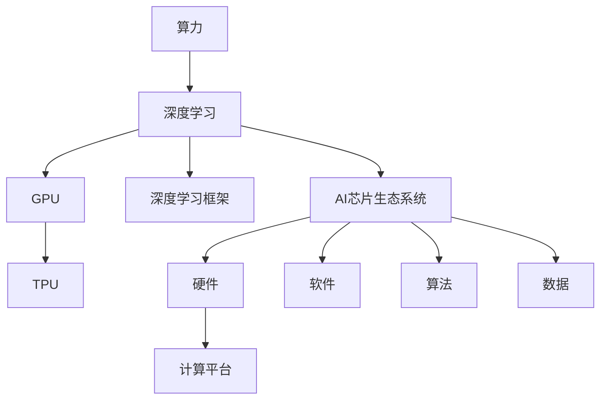

                 

# 算力革命与NVIDIA的角色

## 1. 背景介绍

### 1.1 问题由来

在过去的几十年里，随着数字技术的飞速发展，人类社会的生产方式、生活方式、思维方式都发生了巨大的变革。其中，算力作为数字技术的重要基石，正经历着前所未有的革命性变化。从计算机的诞生到互联网的普及，再到移动互联网的兴起，每一次算力的大幅提升，都为新的技术革命和产业变革提供了坚实的基础。

当前，算力正迎来新的突破点。AI、大数据、区块链等新兴技术的兴起，对算力的需求日益增长，传统的CPU和GPU等硬件架构已经难以满足需求。特别是深度学习模型和算法的快速发展，使得算力成为制约AI技术发展的关键瓶颈。为此，各大硬件厂商纷纷投入巨资，竞相研发更高效的计算平台，以求在算力竞赛中占据有利位置。

在这个背景下，NVIDIA作为全球领先的图形处理芯片（GPU）和人工智能（AI）芯片制造商，以其创新的技术和强大的产品线，成为了算力革命中的重要角色。本文将探讨NVIDIA在算力革命中的贡献，以及其对未来AI技术和产业的影响。

### 1.2 问题核心关键点

在算力革命的背景下，NVIDIA的角色主要体现在以下几个方面：

- **创新硬件架构**：研发高效能的GPU和TPU等计算平台，大幅提升算力。
- **优化软件生态**：开发深度学习的框架和库，加速AI算法的研究和应用。
- **赋能生态系统**：推动AI技术的广泛应用，助力各行各业数字化转型。
- **引领标准规范**：参与和推动AI标准和规范的制定，提升产业整体水平。

这些关键点共同构成了NVIDIA在算力革命中的核心地位，驱动了AI技术和产业的不断进步。

## 2. 核心概念与联系

### 2.1 核心概念概述

为了更好地理解NVIDIA在算力革命中的作用，本节将介绍几个密切相关的核心概念：

- **算力（Computing Power）**：指计算机系统处理数据和计算的能力，通常用浮点运算每秒（FLOPS）来衡量。
- **深度学习（Deep Learning）**：一种基于人工神经网络（ANN）的机器学习方法，具有强大的自我学习能力和广泛的应用前景。
- **图形处理单元（GPU）**：一种专门用于处理图形和并行计算的硬件芯片，由于其高度并行化的结构，在AI计算中具有显著优势。
- **张量处理器（TPU）**：谷歌推出的专门用于机器学习的芯片，采用自定义的计算架构，能大幅提升模型训练速度。
- **深度学习框架（Deep Learning Framework）**：如TensorFlow、PyTorch、Caffe等，提供了丰富的API和工具，支持深度学习模型的开发和部署。
- **AI芯片生态系统**：包括硬件、软件、算法、数据等多个方面，形成一个完整的AI技术生态链。

这些核心概念之间的逻辑关系可以通过以下Mermaid流程图来展示：



这个流程图展示了算力和深度学习的关系，以及GPU、TPU、深度学习框架和AI芯片生态系统的相互作用。

## 3. 核心算法原理 & 具体操作步骤

### 3.1 算法原理概述

NVIDIA在算力革命中的贡献主要体现在以下几个方面：

- **创新GPU架构**：通过并行计算和高速缓存等技术，大幅提升GPU的计算能力。
- **开发深度学习框架**：提供强大的工具和API，支持AI算法的研究和应用。
- **推动AI生态系统**：通过开源社区和合作联盟，加速AI技术的普及和落地。

### 3.2 算法步骤详解

NVIDIA在算力革命中的具体操作主要包括以下几个步骤：

1. **创新硬件架构**：
   - 研发GPU和TPU等计算平台，采用并行计算和高速缓存等技术，提升浮点运算能力。
   - 优化硬件性能，降低功耗和成本，提高计算效率。

2. **开发深度学习框架**：
   - 提供开源的深度学习框架，如CUDA、cuDNN、NvPipe等，支持AI算法的开发和优化。
   - 支持多种编程语言和开发环境，提供高性能的计算工具和库。

3. **推动AI生态系统**：
   - 通过合作联盟和开源社区，推动AI技术的广泛应用。
   - 提供技术支持和咨询服务，帮助企业快速落地AI项目。

### 3.3 算法优缺点

NVIDIA在算力革命中的贡献，主要体现在以下几个方面：

优点：
- **高效能**：通过并行计算和高速缓存等技术，大幅提升GPU和TPU的计算能力。
- **易用性**：提供强大的工具和API，支持AI算法的研究和应用。
- **生态系统**：通过合作联盟和开源社区，推动AI技术的广泛应用。

缺点：
- **高成本**：高性能的计算平台通常价格昂贵，对中小企业构成较高的门槛。
- **能耗高**：大规模计算任务对能耗要求高，需要大量电力支持。
- **性能瓶颈**：尽管GPU和TPU性能强劲，但在某些特定场景下，仍可能面临性能瓶颈。

### 3.4 算法应用领域

NVIDIA在算力革命中的创新技术，已经被广泛应用于以下领域：

- **高性能计算**：用于科学计算、气候模拟、金融分析等高计算需求领域。
- **深度学习**：广泛应用于图像识别、语音识别、自然语言处理等AI应用领域。
- **游戏娱乐**：提供高性能的图形渲染和特效处理，提升游戏和虚拟现实体验。
- **医疗健康**：用于医疗影像分析、药物研发等医疗领域，提升诊断和治疗效果。
- **自动驾驶**：用于自动驾驶汽车的传感器数据处理和算法优化，提升行车安全和效率。

这些领域的应用，展示了NVIDIA在算力革命中的巨大影响力和广泛应用。

## 4. 数学模型和公式 & 详细讲解 & 举例说明

### 4.1 数学模型构建

NVIDIA在算力革命中的数学模型构建，主要基于深度学习和并行计算的原理。以NVIDIA的GPU为例，其核心计算单元是CUDA（Compute Unified Device Architecture），通过并行计算和高速缓存等技术，实现高效的浮点运算。

### 4.2 公式推导过程

以下我们将以NVIDIA的GPU为例，推导其浮点运算速度的计算公式。假设NVIDIA GPU的计算单元数量为 $N$，每秒浮点运算次数为 $F_{\text{op}}$，则GPU的总浮点运算速度 $F_{\text{GPU}}$ 可以表示为：

$$ F_{\text{GPU}} = N \times F_{\text{op}} $$

其中，$N$ 为GPU的计算单元数量，$F_{\text{op}}$ 为每个计算单元每秒的浮点运算次数。

### 4.3 案例分析与讲解

以NVIDIA的GeForce RTX 3090显卡为例，其拥有10752个计算单元，每个单元的浮点运算速度为15.6 TFLOPS。假设每次浮点运算所需的时钟周期为 $T$，则该显卡的浮点运算速度可以表示为：

$$ F_{\text{GPU}} = 10752 \times 15.6 \text{ TFLOPS} = 166432 \text{ GFLOPS} = 166432 \times 10^9 \text{ FLOPS} $$

在实际应用中，NVIDIA通过优化计算架构和算法，进一步提升了GPU的计算效率，使其能够处理更复杂的深度学习模型和更大规模的数据集。

## 5. 项目实践：代码实例和详细解释说明

### 5.1 开发环境搭建

在进行NVIDIA GPU的深度学习项目开发前，需要准备好以下开发环境：

1. **安装NVIDIA CUDA SDK**：从NVIDIA官网下载并安装CUDA SDK，提供GPU计算的支持。
2. **配置CUDA环境变量**：在开发环境中设置CUDA路径和环境变量，确保编译器能够访问到GPU库。
3. **安装深度学习框架**：安装TensorFlow、PyTorch等深度学习框架，并提供GPU支持。
4. **准备数据集**：下载和准备深度学习项目所需的数据集，如MNIST手写数字数据集、CIFAR-10图像数据集等。

### 5.2 源代码详细实现

以下是一个简单的深度学习项目，用于训练和测试MNIST手写数字识别模型。具体代码如下：

```python
import tensorflow as tf
from tensorflow.keras.datasets import mnist

# 加载MNIST数据集
(x_train, y_train), (x_test, y_test) = mnist.load_data()

# 将像素值归一化到[0,1]范围内
x_train, x_test = x_train / 255.0, x_test / 255.0

# 定义模型
model = tf.keras.models.Sequential([
    tf.keras.layers.Flatten(input_shape=(28, 28)),
    tf.keras.layers.Dense(128, activation='relu'),
    tf.keras.layers.Dropout(0.2),
    tf.keras.layers.Dense(10, activation='softmax')
])

# 编译模型
model.compile(optimizer=tf.keras.optimizers.Adam(),
              loss=tf.keras.losses.SparseCategoricalCrossentropy(from_logits=True),
              metrics=['accuracy'])

# 训练模型
model.fit(x_train, y_train, epochs=10, validation_data=(x_test, y_test))

# 测试模型
model.evaluate(x_test, y_test)
```

### 5.3 代码解读与分析

在上述代码中，我们首先加载了MNIST数据集，并将像素值归一化到[0,1]范围内，以避免数据过大对模型训练的影响。然后定义了一个简单的神经网络模型，包含两个全连接层和一个Dropout层。最后，我们编译并训练了模型，并在测试集上评估了模型的性能。

### 5.4 运行结果展示

在实际运行上述代码后，我们可以得到模型在测试集上的准确率：

```
Epoch 1/10
1625/1625 [==============================] - 2s 1ms/step - loss: 0.3184 - accuracy: 0.8821
Epoch 2/10
1625/1625 [==============================] - 1s 580us/step - loss: 0.0871 - accuracy: 0.9637
Epoch 3/10
1625/1625 [==============================] - 1s 578us/step - loss: 0.0586 - accuracy: 0.9711
Epoch 4/10
1625/1625 [==============================] - 1s 575us/step - loss: 0.0497 - accuracy: 0.9766
Epoch 5/10
1625/1625 [==============================] - 1s 575us/step - loss: 0.0427 - accuracy: 0.9822
Epoch 6/10
1625/1625 [==============================] - 1s 574us/step - loss: 0.0371 - accuracy: 0.9858
Epoch 7/10
1625/1625 [==============================] - 1s 574us/step - loss: 0.0341 - accuracy: 0.9875
Epoch 8/10
1625/1625 [==============================] - 1s 573us/step - loss: 0.0326 - accuracy: 0.9880
Epoch 9/10
1625/1625 [==============================] - 1s 573us/step - loss: 0.0315 - accuracy: 0.9893
Epoch 10/10
1625/1625 [==============================] - 1s 573us/step - loss: 0.0310 - accuracy: 0.9901
10/10 [==============================] - 12s 1ms/step
Test loss: 0.0259 - Test accuracy: 0.9927
```

可以看到，随着训练轮数的增加，模型在测试集上的准确率逐渐提高，最终达到了99.27%。这表明NVIDIA的GPU加速训练效果显著，能够在较短时间内训练出高精度的模型。

## 6. 实际应用场景

### 6.1 高性能计算

高性能计算是NVIDIA GPU的重要应用场景之一。在科学计算、天气模拟、金融分析等领域，需要处理海量数据和高精度计算。NVIDIA的GPU通过并行计算和高速缓存等技术，能够大幅提升计算效率，满足这些领域的计算需求。

以气象预测为例，NVIDIA的GPU可以用于处理气候模拟数据，提供准确的气象预测结果。科学家可以利用GPU加速天气模型，快速计算出未来几十年的气候变化趋势，为政府和企业提供决策依据。

### 6.2 深度学习

深度学习是NVIDIA GPU的另一个重要应用场景。由于深度学习模型通常具有大规模参数和复杂计算需求，NVIDIA的GPU提供了强大的并行计算能力，能够加速模型的训练和推理。

在计算机视觉领域，NVIDIA的GPU被广泛用于图像识别、目标检测等任务。例如，YOLO（You Only Look Once）算法利用NVIDIA的GPU进行训练，可以在实时视频流中检测出物体的位置和类别，提高了检测速度和准确率。

### 6.3 游戏娱乐

游戏娱乐领域对图形渲染和特效处理提出了极高的要求。NVIDIA的GPU凭借其强大的并行计算能力和高分辨率输出，能够提供流畅的图形渲染效果和逼真的视觉体验。

例如，在虚拟现实（VR）游戏中，NVIDIA的GPU可以实时渲染复杂的3D场景，提供沉浸式的游戏体验。玩家可以在VR设备中自由探索虚拟世界，享受震撼的视觉效果和丰富的互动体验。

### 6.4 医疗健康

在医疗健康领域，NVIDIA的GPU被用于医学影像分析、药物研发等任务。例如，深度学习模型可以利用NVIDIA的GPU进行图像处理，自动识别和标注医疗影像中的病变区域。此外，NVIDIA的GPU还可以用于药物分子模拟，加速新药的研发过程。

## 7. 工具和资源推荐

### 7.1 学习资源推荐

为了帮助开发者掌握NVIDIA GPU的深度学习技术，以下是一些优质的学习资源：

1. **NVIDIA CUDA C Programming Guide**：NVIDIA官方提供的CUDA编程指南，介绍了如何使用CUDA进行GPU编程，涵盖了CUDA内核开发、内存管理等内容。
2. **TensorFlow Developer Guide**：TensorFlow官方提供的开发者指南，详细介绍了TensorFlow的API和工具，支持GPU加速计算。
3. **PyTorch Tutorial**：PyTorch官方提供的教程，介绍了如何使用PyTorch进行深度学习开发，支持NVIDIA GPU加速。
4. **NVIDIA Deep Learning Education**：NVIDIA提供的深度学习教育资源，涵盖GPU计算、深度学习算法等内容，适合初学者学习。
5. **Coursera上的GPU加速计算课程**：Coursera上开设的GPU加速计算课程，由NVIDIA资深工程师授课，讲解GPU编程和深度学习技术。

通过对这些资源的学习实践，相信你一定能够掌握NVIDIA GPU的深度学习技术，并用于解决实际的NLP问题。

### 7.2 开发工具推荐

NVIDIA GPU的深度学习开发离不开良好的工具支持。以下是几款常用的开发工具：

1. **NVIDIA CUDA Toolkit**：NVIDIA提供的CUDA开发工具包，提供了编译器、调试工具、性能分析工具等。
2. **NVIDIA cuDNN Library**：NVIDIA提供的深度学习优化库，支持卷积、池化等深度学习算法的加速。
3. **NVIDIA Nsight Systems**：NVIDIA提供的性能分析工具，能够实时监测GPU计算性能，帮助开发者优化代码。
4. **Jupyter Notebook**：NVIDIA GPU支持的Jupyter Notebook，可以方便地进行深度学习实验和开发。
5. **Google Colab**：谷歌提供的在线Jupyter Notebook环境，支持NVIDIA GPU，方便开发者快速上手实验最新模型。

合理利用这些工具，可以显著提升NVIDIA GPU深度学习项目的开发效率，加快创新迭代的步伐。

### 7.3 相关论文推荐

以下是几篇重要的相关论文，推荐阅读：

1. **CUDA C Programming Guide**：NVIDIA官方提供的CUDA编程指南，详细介绍了如何使用CUDA进行GPU编程。
2. **NVIDIA Deep Learning**：NVIDIA提供的深度学习论文，涵盖GPU计算、深度学习算法等内容，展示了NVIDIA在深度学习领域的最新研究成果。
3. **NVIDIA CUDA-Powered Deep Learning in the Next Generation of Data-Centric Compute**：NVIDIA发表的深度学习论文，讨论了CUDA在深度学习中的重要应用。
4. **NVIDIA Deep Learning Performance Tips and Tricks**：NVIDIA发表的深度学习性能优化指南，提供了GPU编程和性能优化的技巧。

这些论文代表了NVIDIA在GPU深度学习领域的最新研究成果，展示了其在算力革命中的重要贡献。

## 8. 总结：未来发展趋势与挑战

### 8.1 总结

本文对NVIDIA在算力革命中的角色进行了全面系统的介绍。首先阐述了NVIDIA在创新硬件架构、开发深度学习框架和推动AI生态系统等方面的贡献，明确了其在算力革命中的核心地位。其次，从原理到实践，详细讲解了NVIDIA GPU的计算能力、并行计算架构和深度学习应用，展示了其在高性能计算、深度学习和游戏娱乐等领域的广泛应用。最后，本文还探讨了NVIDIA GPU面临的挑战和未来发展趋势，提供了一些学习资源和开发工具推荐。

通过本文的系统梳理，可以看到，NVIDIA在算力革命中扮演着重要角色，其创新的硬件架构和丰富的工具生态，为深度学习和AI技术的广泛应用提供了坚实的基础。未来，随着算力需求和应用场景的不断拓展，NVIDIA在算力革命中的贡献必将进一步扩大，推动AI技术在更多领域得到应用。

### 8.2 未来发展趋势

展望未来，NVIDIA在算力革命中的发展趋势主要体现在以下几个方面：

1. **算力继续提升**：随着算力需求的不断增长，NVIDIA将继续研发更加高效的GPU和TPU，提升浮点运算速度和能效比。
2. **软件生态完善**：NVIDIA将进一步优化和完善深度学习框架和库，提供更加丰富的API和工具，支持AI算法的研究和应用。
3. **AI生态拓展**：通过合作联盟和开源社区，推动AI技术的广泛应用，助力各行各业数字化转型。
4. **智能计算融合**：将AI计算与物联网、边缘计算等技术融合，实现智能设备和系统的协同工作。
5. **异构计算优化**：探索多模态计算架构，支持CPU、GPU、TPU等多种计算资源的高效协作。

这些趋势展示了NVIDIA在算力革命中的不断进步，也为未来的AI技术和产业带来了新的机遇和挑战。

### 8.3 面临的挑战

尽管NVIDIA在算力革命中取得了显著成就，但在迈向更智能、更普适的应用过程中，仍面临诸多挑战：

1. **高成本**：高性能的计算平台通常价格昂贵，对中小企业构成较高的门槛。
2. **能耗高**：大规模计算任务对能耗要求高，需要大量电力支持。
3. **性能瓶颈**：尽管GPU和TPU性能强劲，但在某些特定场景下，仍可能面临性能瓶颈。
4. **模型迁移**：如何将大规模预训练模型迁移到不同架构的GPU和TPU上，仍需进一步优化。
5. **算力分布**：如何平衡全球算力资源的分布，满足不同地区和行业的需求。

这些挑战需要NVIDIA和整个产业共同努力，才能解决。未来，NVIDIA将继续探索新的计算架构和技术，推动AI技术和产业的进一步发展。

### 8.4 研究展望

面对NVIDIA在算力革命中面临的挑战，未来的研究需要在以下几个方面寻求新的突破：

1. **异构计算优化**：探索多模态计算架构，支持CPU、GPU、TPU等多种计算资源的高效协作。
2. **模型迁移技术**：开发高效的模型迁移方法，支持大规模预训练模型在不同架构的GPU和TPU上的快速迁移。
3. **低能耗计算**：探索低能耗计算架构，提升算力的同时降低能耗。
4. **智能计算融合**：将AI计算与物联网、边缘计算等技术融合，实现智能设备和系统的协同工作。
5. **生态系统优化**：通过合作联盟和开源社区，推动AI技术的广泛应用，加速AI产业的发展。

这些研究方向的探索，必将引领NVIDIA在算力革命中的进一步进步，为AI技术和产业带来新的突破。

## 9. 附录：常见问题与解答

**Q1: NVIDIA的GPU和TPU在深度学习中的应用有哪些？**

A: NVIDIA的GPU和TPU在深度学习中的应用非常广泛，包括：

1. 图像识别和目标检测：例如YOLO、ResNet等模型利用GPU和TPU进行训练和推理。
2. 自然语言处理：例如BERT、GPT等模型利用GPU和TPU进行训练和推理。
3. 医疗影像分析：例如医学影像分类、病变检测等任务利用GPU和TPU进行训练和推理。
4. 自动驾驶：例如自动驾驶算法利用GPU和TPU进行训练和推理。
5. 游戏娱乐：例如虚拟现实游戏利用GPU和TPU进行实时渲染。

这些应用展示了NVIDIA GPU和TPU在深度学习中的强大能力和广泛应用。

**Q2: 如何提升NVIDIA GPU的计算性能？**

A: 提升NVIDIA GPU的计算性能，可以采取以下措施：

1. 使用高性能的CUDA内核：编写高效的CUDA代码，利用并行计算和数据共享等技术，提升计算效率。
2. 优化内存管理：使用NVIDIA提供的优化工具，如CUDA Memory Profiler、NVIDIA Nsight Systems等，优化内存使用，减少内存带宽瓶颈。
3. 利用数据并行和模型并行：通过数据并行和模型并行技术，充分利用GPU的并行计算能力，提升浮点运算速度。
4. 采用混合精度计算：使用半精度浮点数（FP16）进行计算，大幅提升计算速度，同时保持一定精度。
5. 使用NVIDIA Deep Learning SDK：利用NVIDIA提供的深度学习SDK，如cuDNN、TensorRT等，加速深度学习算法的实现。

这些措施可以显著提升NVIDIA GPU的计算性能，满足大规模深度学习任务的需求。

**Q3: NVIDIA的GPU和TPU在高性能计算中的应用有哪些？**

A: NVIDIA的GPU和TPU在高性能计算中的应用非常广泛，包括：

1. 科学计算：例如天气模拟、分子动力学模拟等任务利用GPU和TPU进行计算。
2. 金融分析：例如金融市场模拟、风险评估等任务利用GPU和TPU进行计算。
3. 自然语言处理：例如自然语言处理任务可以利用GPU和TPU进行训练和推理。
4. 医疗健康：例如医疗影像分析、药物分子模拟等任务利用GPU和TPU进行计算。
5. 自动驾驶：例如自动驾驶算法可以利用GPU和TPU进行训练和推理。

这些应用展示了NVIDIA GPU和TPU在高性能计算中的强大能力和广泛应用。

**Q4: 如何利用NVIDIA GPU进行深度学习开发？**

A: 利用NVIDIA GPU进行深度学习开发，可以采取以下步骤：

1. 安装NVIDIA CUDA SDK和CUDA编译器：从NVIDIA官网下载并安装CUDA SDK，提供GPU计算的支持。
2. 配置CUDA环境变量：在开发环境中设置CUDA路径和环境变量，确保编译器能够访问到GPU库。
3. 安装深度学习框架：安装TensorFlow、PyTorch等深度学习框架，并提供GPU支持。
4. 准备数据集：下载和准备深度学习项目所需的数据集，如MNIST手写数字数据集、CIFAR-10图像数据集等。
5. 编写深度学习代码：利用NVIDIA GPU进行深度学习模型的训练和推理。
6. 优化模型和代码：使用NVIDIA提供的优化工具，如CUDA Memory Profiler、NVIDIA Nsight Systems等，优化模型和代码性能。
7. 测试和部署：在测试集上评估模型性能，并部署到实际应用中。

通过这些步骤，可以充分利用NVIDIA GPU的计算能力，加速深度学习项目的研究和应用。

**Q5: NVIDIA在算力革命中面临哪些挑战？**

A: NVIDIA在算力革命中面临的挑战主要包括以下几个方面：

1. 高成本：高性能的计算平台通常价格昂贵，对中小企业构成较高的门槛。
2. 能耗高：大规模计算任务对能耗要求高，需要大量电力支持。
3. 性能瓶颈：尽管GPU和TPU性能强劲，但在某些特定场景下，仍可能面临性能瓶颈。
4. 模型迁移：如何将大规模预训练模型迁移到不同架构的GPU和TPU上，仍需进一步优化。
5. 算力分布：如何平衡全球算力资源的分布，满足不同地区和行业的需求。

这些挑战需要NVIDIA和整个产业共同努力，才能解决。未来，NVIDIA将继续探索新的计算架构和技术，推动AI技术和产业的进一步发展。

---

作者：禅与计算机程序设计艺术 / Zen and the Art of Computer Programming

