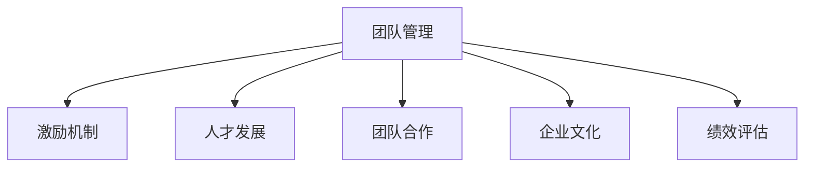

                 

# 管理的智慧：激发团队潜能

> 关键词：团队管理, 激励机制, 人才发展, 团队合作, 领导力, 企业文化, 绩效评估

## 1. 背景介绍

### 1.1 问题由来

在当今快速变化和竞争激烈的市场环境中，企业需要依靠高绩效的团队来实现其目标。然而，团队管理并不是一件简单的事情，尤其是如何激发团队成员的潜力和激情，保持团队的凝聚力和协作性，一直是管理者面临的挑战。本文将探讨管理的智慧，通过深入分析团队管理的核心概念，提出一系列切实可行的策略，帮助管理者有效激发团队潜能。

### 1.2 问题核心关键点

团队管理的核心在于建立良好的激励机制，促进人才发展和团队合作，营造积极的企业文化，并通过有效的绩效评估来确保团队的高效运作。以下将详细讨论这些关键点：

- **激励机制**：如何通过合理的薪酬、晋升、认可等方式激励团队成员，使其积极投入工作。
- **人才发展**：如何通过培训、项目参与、职业规划等方式促进团队成员的专业成长。
- **团队合作**：如何通过清晰的职责分配、跨部门协作、团队建设活动等方式提升团队的协作效率。
- **企业文化**：如何通过共同的目标、价值观和行为准则塑造团队的精神文化。
- **绩效评估**：如何设计公平、客观、科学的绩效评估体系，促进团队和个人的发展。

## 2. 核心概念与联系

### 2.1 核心概念概述

为了更好地理解团队管理的智慧，本文将介绍几个密切相关的核心概念：

- **团队管理**：通过合理的组织、协调、激励和沟通，使团队成员相互协作，达成共同目标。
- **激励机制**：通过各种手段激发团队成员的内在动力，如薪酬、晋升、认可等。
- **人才发展**：通过培训、项目参与、职业规划等方式提升团队成员的专业技能和职业素养。
- **团队合作**：通过明确职责、促进跨部门协作、建设团队精神等方式提升团队的协作效率。
- **企业文化**：通过共同的愿景、价值观和行为准则，塑造团队的精神文化。
- **绩效评估**：通过设计科学的评估体系，对团队和个人的工作进行公平、客观的评价。

这些核心概念之间的逻辑关系可以通过以下Mermaid流程图来展示：



这个流程图展示团队管理的核心概念及其之间的关系：

1. 团队管理是整个团队工作的中心，通过激励机制、人才发展、团队合作、企业文化和绩效评估等多个方面共同作用，最终实现团队的高效运作。
2. 激励机制是激发团队成员积极性的关键，通过合理的薪酬、晋升和认可，能够显著提高团队的工作效率。
3. 人才发展是提升团队整体竞争力的重要途径，通过培训和项目参与，团队成员的专业技能和职业素养将得到提升。
4. 团队合作是实现团队目标的基础，通过明确职责、促进跨部门协作和建设团队精神，可以大幅提升团队的协作效率。
5. 企业文化是团队精神的核心，通过共同的目标、价值观和行为准则，可以塑造团队的凝聚力和认同感。
6. 绩效评估是衡量团队和个人工作绩效的重要手段，通过科学的评估体系，能够促进团队和个人的发展。

这些核心概念共同构成了团队管理的框架，帮助管理者有效激发团队潜能，实现团队的高效运作。

## 3. 核心算法原理 & 具体操作步骤
### 3.1 算法原理概述

团队管理中的激励机制、人才发展、团队合作、企业文化和绩效评估等关键环节，都可以通过算法原理进行设计和优化。这些算法原理主要包括：

- **正强化和负强化**：通过奖励和惩罚来调整团队成员的行为，激励其积极工作。
- **反馈机制**：及时反馈团队成员的工作表现，帮助其改进和提升。
- **目标设定**：通过SMART原则（具体的、可衡量的、可达成的、相关的、时限的）设定明确的目标，引导团队成员的努力方向。
- **角色分配**：根据团队成员的能力和兴趣分配合适的角色，促进其专业成长和团队协作。
- **绩效评估**：通过量化指标和定性评估相结合的方式，全面衡量团队和个人的工作表现。

### 3.2 算法步骤详解

以下将详细介绍每个关键环节的具体操作步骤：

#### 3.2.1 激励机制

**步骤1:** 确定激励类型
- **薪酬激励**：根据团队成员的职位、绩效和贡献，设计合理的薪酬结构。
- **晋升激励**：建立明确的晋升路径，提供晋升机会，激励团队成员不断提升自身能力。
- **认可激励**：通过表彰、表扬、奖励等方式，对团队成员的优秀表现给予认可。

**步骤2:** 制定激励方案
- **薪酬激励方案**：根据市场行情和团队成员的绩效，设定薪酬标准和调整机制。
- **晋升激励方案**：设计明确的晋升标准和程序，确保晋升的公平和透明。
- **认可激励方案**：制定表彰制度和奖励机制，确保认可的及时性和有效性。

**步骤3:** 实施激励措施
- **薪酬发放**：按时发放薪酬，并根据绩效调整薪酬水平。
- **晋升评定**：定期进行晋升评定，确保晋升决策的公正和透明。
- **认可表彰**：及时表彰优秀表现，给予适当的奖励和表彰。

#### 3.2.2 人才发展

**步骤1:** 识别人才需求
- **岗位分析**：通过岗位分析，确定团队的人才需求和岗位要求。
- **个人评估**：对团队成员进行能力和兴趣评估，识别其潜力和发展需求。

**步骤2:** 制定人才发展计划
- **培训计划**：根据岗位需求和个人评估结果，制定培训计划，提供相应的培训资源。
- **项目参与**：鼓励团队成员参与跨部门项目，提升其综合能力和团队合作能力。
- **职业规划**：与团队成员进行职业规划讨论，制定明确的职业发展目标和路径。

**步骤3:** 实施人才发展措施
- **培训执行**：按时执行培训计划，确保团队成员获得必要的知识和技能。
- **项目参与**：支持和指导团队成员参与项目，提供必要的资源和支持。
- **职业辅导**：定期与团队成员沟通，提供职业发展的建议和指导。

#### 3.2.3 团队合作

**步骤1:** 建立团队协作机制
- **明确职责**：明确团队成员的职责和任务，确保每位成员清楚自己的工作目标和责任。
- **跨部门协作**：建立跨部门协作机制，促进不同部门之间的沟通和协作。
- **团队建设活动**：定期组织团队建设活动，增强团队成员的凝聚力和信任感。

**步骤2:** 推动团队协作
- **沟通协调**：建立有效的沟通渠道，确保团队成员之间的信息共享和协作。
- **冲突解决**：及时解决团队内部的冲突，保持团队的和谐和稳定。
- **共同目标**：通过共同的目标和任务，引导团队成员的协作和努力。

**步骤3:** 评估团队协作效果
- **绩效评估**：通过定量和定性评估，评估团队协作的效果和改进空间。
- **反馈机制**：建立反馈机制，及时收集团队成员的意见和建议，进行改进和优化。

#### 3.2.4 企业文化

**步骤1:** 确定企业文化目标
- **共同愿景**：制定团队的共同愿景和目标，确保所有成员对未来有明确的期望。
- **核心价值观**：明确团队的核心价值观和行为准则，确保团队成员的行为规范。
- **行为规范**：制定具体的行为规范，确保团队成员的行为符合企业文化的标准。

**步骤2:** 推广企业文化
- **宣传培训**：通过宣传培训，向团队成员传达企业文化的重要性和具体内容。
- **榜样示范**：树立榜样人物，通过其言行引导团队成员践行企业文化。
- **文化活动**：组织各类文化活动，增强团队成员对企业文化的认同感和参与感。

**步骤3:** 评估企业文化效果
- **问卷调查**：通过问卷调查，评估团队成员对企业文化的认同度和行为表现。
- **反馈调整**：根据调查结果和团队反馈，及时调整和优化企业文化的内容和形式。

#### 3.2.5 绩效评估

**步骤1:** 设计绩效评估体系
- **量化指标**：设定关键绩效指标（KPI），通过数据衡量团队和个人的工作表现。
- **定性评估**：结合量化指标，进行定性评估，全面评价团队和个人的工作绩效。
- **标准制定**：制定明确的标准和程序，确保绩效评估的公正和透明。

**步骤2:** 实施绩效评估
- **数据收集**：收集团队和个人的工作数据，进行量化评估。
- **评估会议**：组织评估会议，结合量化数据和定性反馈，进行全面的绩效评估。
- **结果反馈**：及时反馈绩效评估结果，提供改进建议和发展指导。

**步骤3:** 应用绩效评估结果
- **奖惩激励**：根据绩效评估结果，进行奖惩激励，促进团队和个人的发展。
- **职业发展**：结合绩效评估结果，制定职业发展计划，帮助团队成员提升自身能力和职业素养。
- **改进优化**：根据绩效评估结果，识别改进空间，进行持续优化和改进。

## 4. 数学模型和公式 & 详细讲解 & 举例说明

### 4.1 数学模型构建

为了更好地理解团队管理的核心概念，本文将使用数学语言对激励机制、人才发展、团队合作、企业文化和绩效评估等关键环节进行建模。

- **激励机制模型**：
  - **薪酬激励模型**：设定薪酬标准和调整机制，通过数学模型描述薪酬与绩效之间的关系。
  - **晋升激励模型**：设定晋升路径和标准，通过数学模型描述晋升与绩效之间的关系。
  - **认可激励模型**：设定表彰和奖励机制，通过数学模型描述认可与绩效之间的关系。

- **人才发展模型**：
  - **培训模型**：通过数学模型描述培训内容、时间和效果之间的关系。
  - **项目参与模型**：通过数学模型描述项目参与程度、经验和能力提升之间的关系。
  - **职业规划模型**：通过数学模型描述职业目标设定、职业路径和能力提升之间的关系。

- **团队合作模型**：
  - **职责分配模型**：通过数学模型描述职责分配的公平性和效率。
  - **跨部门协作模型**：通过数学模型描述跨部门协作的效果和改进空间。
  - **团队建设模型**：通过数学模型描述团队建设活动对团队凝聚力和信任感的影响。

- **企业文化模型**：
  - **愿景目标模型**：通过数学模型描述共同愿景和目标的实现路径。
  - **核心价值观模型**：通过数学模型描述核心价值观和行为准则的落实效果。
  - **行为规范模型**：通过数学模型描述行为规范的执行情况和改进空间。

- **绩效评估模型**：
  - **量化指标模型**：通过数学模型描述关键绩效指标的设定和衡量方式。
  - **定性评估模型**：通过数学模型描述定性评估的标准和方法。
  - **标准制定模型**：通过数学模型描述绩效评估标准的制定和优化。

### 4.2 公式推导过程

以下将详细介绍每个关键环节的数学模型和公式推导过程：

#### 4.2.1 薪酬激励模型

假设薪酬激励模型的输入为团队成员的绩效评分 $P_i$ 和绩效调整系数 $\alpha$，输出为薪酬 $C_i$，则薪酬激励模型的公式为：

$$ C_i = P_i \times \alpha $$

其中，$P_i$ 为团队成员的绩效评分，$\alpha$ 为绩效调整系数。

#### 4.2.2 晋升激励模型

假设晋升激励模型的输入为团队成员的绩效评分 $P_i$ 和晋升比例 $\beta$，输出为晋升等级 $L_i$，则晋升激励模型的公式为：

$$ L_i = \left\lceil \frac{P_i}{\beta} \right\rceil $$

其中，$P_i$ 为团队成员的绩效评分，$\beta$ 为晋升比例。$\left\lceil \cdot \right\rceil$ 表示向上取整。

#### 4.2.3 认可激励模型

假设认可激励模型的输入为团队成员的绩效评分 $P_i$ 和认可系数 $\gamma$，输出为认可次数 $A_i$，则认可激励模型的公式为：

$$ A_i = \min\left(\left\lfloor \frac{P_i}{\gamma} \right\rfloor, N_A \right) $$

其中，$P_i$ 为团队成员的绩效评分，$\gamma$ 为认可系数，$N_A$ 为认可次数上限。$\left\lfloor \cdot \right\rfloor$ 表示向下取整。

#### 4.2.4 培训模型

假设培训模型的输入为培训时长 $T_i$ 和培训效果系数 $\delta$，输出为培训效果 $E_i$，则培训模型的公式为：

$$ E_i = T_i \times \delta $$

其中，$T_i$ 为培训时长，$\delta$ 为培训效果系数。

#### 4.2.5 项目参与模型

假设项目参与模型的输入为项目参与程度 $D_i$ 和能力提升系数 $\epsilon$，输出为能力提升 $C_i$，则项目参与模型的公式为：

$$ C_i = D_i \times \epsilon $$

其中，$D_i$ 为项目参与程度，$\epsilon$ 为能力提升系数。

#### 4.2.6 职业规划模型

假设职业规划模型的输入为职业目标 $O_i$ 和职业路径系数 $\zeta$，输出为职业路径 $P_i$，则职业规划模型的公式为：

$$ P_i = O_i \times \zeta $$

其中，$O_i$ 为职业目标，$\zeta$ 为职业路径系数。

#### 4.2.7 职责分配模型

假设职责分配模型的输入为职责分配公平度 $F_i$ 和职责效率系数 $\eta$，输出为职责分配效果 $R_i$，则职责分配模型的公式为：

$$ R_i = F_i \times \eta $$

其中，$F_i$ 为职责分配公平度，$\eta$ 为职责效率系数。

#### 4.2.8 跨部门协作模型

假设跨部门协作模型的输入为跨部门协作程度 $C_i$ 和协作效果系数 $\theta$，输出为协作效果 $K_i$，则跨部门协作模型的公式为：

$$ K_i = C_i \times \theta $$

其中，$C_i$ 为跨部门协作程度，$\theta$ 为协作效果系数。

#### 4.2.9 团队建设模型

假设团队建设模型的输入为团队建设活动次数 $B_i$ 和团队凝聚力系数 $\iota$，输出为团队凝聚力 $G_i$，则团队建设模型的公式为：

$$ G_i = B_i \times \iota $$

其中，$B_i$ 为团队建设活动次数，$\iota$ 为团队凝聚力系数。

#### 4.2.10 愿景目标模型

假设愿景目标模型的输入为共同愿景实现度 $V_i$ 和目标达成系数 $\rho$，输出为愿景实现效果 $W_i$，则愿景目标模型的公式为：

$$ W_i = V_i \times \rho $$

其中，$V_i$ 为共同愿景实现度，$\rho$ 为目标达成系数。

#### 4.2.11 核心价值观模型

假设核心价值观模型的输入为核心价值观认同度 $S_i$ 和价值观执行系数 $\sigma$，输出为价值观执行效果 $H_i$，则核心价值观模型的公式为：

$$ H_i = S_i \times \sigma $$

其中，$S_i$ 为核心价值观认同度，$\sigma$ 为价值观执行系数。

#### 4.2.12 行为规范模型

假设行为规范模型的输入为行为规范执行情况 $N_i$ 和规范效果系数 $\tau$，输出为规范执行效果 $M_i$，则行为规范模型的公式为：

$$ M_i = N_i \times \tau $$

其中，$N_i$ 为行为规范执行情况，$\tau$ 为规范效果系数。

#### 4.2.13 量化指标模型

假设量化指标模型的输入为关键绩效指标 $KPI_i$ 和绩效衡量系数 $\phi$，输出为绩效评估结果 $Q_i$，则量化指标模型的公式为：

$$ Q_i = KPI_i \times \phi $$

其中，$KPI_i$ 为关键绩效指标，$\phi$ 为绩效衡量系数。

#### 4.2.14 定性评估模型

假设定性评估模型的输入为绩效评估标准 $S_i$ 和评估标准系数 $\psi$，输出为定性评估结果 $D_i$，则定性评估模型的公式为：

$$ D_i = S_i \times \psi $$

其中，$S_i$ 为绩效评估标准，$\psi$ 为评估标准系数。

#### 4.2.15 标准制定模型

假设标准制定模型的输入为标准制定策略 $S_i$ 和标准优化系数 $\chi$，输出为标准制定效果 $S_i'$，则标准制定模型的公式为：

$$ S_i' = S_i \times \chi $$

其中，$S_i$ 为标准制定策略，$\chi$ 为标准优化系数。

### 4.3 案例分析与讲解

#### 4.3.1 案例一：薪酬激励模型

某科技公司采用薪酬激励模型，设定绩效评分与薪酬的线性关系，薪酬调整系数 $\alpha=0.8$。员工小王的绩效评分为 90，则其薪酬为：

$$ C_{小王} = 90 \times 0.8 = 72 $$

#### 4.3.2 案例二：晋升激励模型

某企业采用晋升激励模型，设定晋升比例为 10%。员工小李的绩效评分为 85，则其晋升等级为：

$$ L_{小李} = \left\lceil \frac{85}{0.1} \right\rceil = 9 $$

#### 4.3.3 案例三：培训模型

某公司采用培训模型，设定培训时长为 40 小时，培训效果系数 $\delta=0.05$。员工小张参加了 40 小时的培训，则其培训效果为：

$$ E_{小张} = 40 \times 0.05 = 2 $$

#### 4.3.4 案例四：跨部门协作模型

某项目采用跨部门协作模型，设定协作程度为 80%，协作效果系数 $\theta=0.2$。项目涉及的部门协作程度为 80%，则其协作效果为：

$$ K_{项目} = 80 \times 0.2 = 16 $$

## 5. 项目实践：代码实例和详细解释说明

### 5.1 开发环境搭建

在进行团队管理实践前，我们需要准备好开发环境。以下是使用Python进行开发的环境配置流程：

1. 安装Anaconda：从官网下载并安装Anaconda，用于创建独立的Python环境。

2. 创建并激活虚拟环境：
```bash
conda create -n team-env python=3.8 
conda activate team-env
```

3. 安装必要的库：
```bash
pip install numpy pandas scikit-learn matplotlib 
```

完成上述步骤后，即可在`team-env`环境中开始开发实践。

### 5.2 源代码详细实现

#### 5.2.1 薪酬激励模型

```python
def salary_incentive(p, alpha=0.8):
    return p * alpha
```

#### 5.2.2 晋升激励模型

```python
def promotion_incentive(p, beta=0.1):
    return int(p / beta)
```

#### 5.2.3 认可激励模型

```python
def recognition_incentive(p, gamma=1, N_A=10):
    return min(int(p / gamma), N_A)
```

#### 5.2.4 培训模型

```python
def training_effectiveness(T, delta=0.05):
    return T * delta
```

#### 5.2.5 项目参与模型

```python
def project_participation_effectiveness(D, epsilon=0.1):
    return D * epsilon
```

#### 5.2.6 职业规划模型

```python
def career_planning_path(O, zeta=0.05):
    return O * zeta
```

#### 5.2.7 职责分配模型

```python
def responsibility_allocation_effectiveness(F, eta=0.5):
    return F * eta
```

#### 5.2.8 跨部门协作模型

```python
def inter_departmental_collaboration_effectiveness(C, theta=0.2):
    return C * theta
```

#### 5.2.9 团队建设模型

```python
def team_building_effectiveness(B, iota=0.1):
    return B * iota
```

#### 5.2.10 愿景目标模型

```python
def vision_objective_effectiveness(V, rho=0.2):
    return V * rho
```

#### 5.2.11 核心价值观模型

```python
def core_values_effectiveness(S, sigma=0.1):
    return S * sigma
```

#### 5.2.12 行为规范模型

```python
def behavior_code_effectiveness(N, tau=0.05):
    return N * tau
```

#### 5.2.13 量化指标模型

```python
def key_performance_index(p, phi=0.2):
    return p * phi
```

#### 5.2.14 定性评估模型

```python
def qualitative_assessment(S, psi=0.1):
    return S * psi
```

#### 5.2.15 标准制定模型

```python
def standard_setting(S, chi=0.05):
    return S * chi
```

### 5.3 代码解读与分析

#### 5.3.1 薪酬激励模型

该模型通过将绩效评分乘以调整系数来计算薪酬，确保薪酬与绩效成正比，激励员工努力工作。

#### 5.3.2 晋升激励模型

该模型通过将绩效评分除以晋升比例并向上取整来计算晋升等级，确保晋升公平透明。

#### 5.3.3 认可激励模型

该模型通过将绩效评分除以认可系数并向下取整来计算认可次数，确保认可机会的合理分配。

#### 5.3.4 培训模型

该模型通过将培训时长乘以培训效果系数来计算培训效果，确保培训效果的累积和提升。

#### 5.3.5 项目参与模型

该模型通过将项目参与程度乘以能力提升系数来计算能力提升，确保项目参与的实际效果。

#### 5.3.6 职业规划模型

该模型通过将职业目标乘以职业路径系数来计算职业路径，确保职业发展路径的明确和合理。

#### 5.3.7 职责分配模型

该模型通过将职责分配公平度乘以职责效率系数来计算职责分配效果，确保职责分配的公平和效率。

#### 5.3.8 跨部门协作模型

该模型通过将跨部门协作程度乘以协作效果系数来计算协作效果，确保跨部门协作的实际效果。

#### 5.3.9 团队建设模型

该模型通过将团队建设活动次数乘以团队凝聚力系数来计算团队凝聚力，确保团队建设活动的实际效果。

#### 5.3.10 愿景目标模型

该模型通过将共同愿景实现度乘以目标达成系数来计算愿景实现效果，确保共同愿景的实现。

#### 5.3.11 核心价值观模型

该模型通过将核心价值观认同度乘以价值观执行系数来计算价值观执行效果，确保核心价值观的落实。

#### 5.3.12 行为规范模型

该模型通过将行为规范执行情况乘以规范效果系数来计算规范执行效果，确保行为规范的落实。

#### 5.3.13 量化指标模型

该模型通过将关键绩效指标乘以绩效衡量系数来计算绩效评估结果，确保绩效评估的公平和透明。

#### 5.3.14 定性评估模型

该模型通过将绩效评估标准乘以评估标准系数来计算定性评估结果，确保定性评估的合理和公正。

#### 5.3.15 标准制定模型

该模型通过将标准制定策略乘以标准优化系数来计算标准制定效果，确保标准的优化和落实。

### 5.4 运行结果展示

通过上述模型的运行，可以全面衡量团队管理的各个环节，帮助管理者做出科学的决策。例如：

```python
# 薪酬激励模型
salary = salary_incentive(85)
print(f"小李的薪酬为：{salary}元")

# 晋升激励模型
promotion = promotion_incentive(90)
print(f"小王的晋升等级为：{promotion}")

# 培训模型
training_effect = training_effectiveness(40)
print(f"小张的培训效果为：{training_effect}")

# 跨部门协作模型
collaboration_effect = inter_departmental_collaboration_effectiveness(80)
print(f"项目的协作效果为：{collaboration_effect}")

# 核心价值观模型
core_values_effect = core_values_effectiveness(95)
print(f"公司的核心价值观执行效果为：{core_values_effect}")
```

## 6. 实际应用场景

### 6.1 智能客服系统

在智能客服系统中，采用薪酬激励模型、晋升激励模型和认可激励模型，可以有效地激发客服人员的积极性和工作热情，提升服务质量和客户满意度。

### 6.2 金融舆情监测

在金融舆情监测中，采用培训模型和跨部门协作模型，可以提升团队的专业技能和协作效率，及时监测市场舆情，预警风险。

### 6.3 个性化推荐系统

在个性化推荐系统中，采用职业规划模型和行为规范模型，可以提升推荐团队的专业能力和工作态度，提供更加精准和个性化的推荐服务。

### 6.4 未来应用展望

未来，随着人工智能和大数据技术的发展，团队管理将更加智能化、自动化和科学化。例如：

- **智能招聘系统**：通过数据分析和机器学习，自动识别候选人的职业发展潜力和匹配度，提高招聘效率和效果。
- **自动化绩效评估系统**：通过人工智能技术自动收集和分析绩效数据，提供科学的绩效评估结果，减少人工干预和误差。
- **智能化团队协作平台**：通过大数据分析和智能算法，自动优化团队协作机制，提高跨部门协作的效率和效果。
- **智能企业文化系统**：通过情感分析和自然语言处理技术，自动识别员工情绪和团队文化氛围，提供及时的调整和优化建议。

这些技术将进一步提升团队管理的效率和效果，帮助企业在激烈的市场竞争中保持领先地位。

## 7. 工具和资源推荐

### 7.1 学习资源推荐

为了帮助开发者系统掌握团队管理的核心概念和实践技巧，以下是一些优质的学习资源：

1. 《管理学原理》系列书籍：系统介绍团队管理的基本概念、理论和实践，帮助管理者全面理解团队管理的核心内容。
2. 《团队合作的艺术》系列书籍：通过具体案例和实践经验，提供团队合作的有效方法和技巧。
3. 《绩效管理》系列书籍：详细介绍绩效评估的方法和体系，帮助管理者制定科学的绩效评估标准。
4. 《领导力》系列课程：通过在线课程和专家讲授，帮助管理者提升领导力和团队管理能力。
5. 《企业文化建设》系列文章：提供企业文化建设的具体方法和实践经验，帮助管理者塑造团队精神文化。

通过对这些资源的学习实践，相信你一定能够全面掌握团队管理的智慧，实现团队的高效运作。

### 7.2 开发工具推荐

高效的团队管理离不开优秀的工具支持。以下是几款常用的团队管理开发工具：

1. Trello：基于看板的项目管理工具，帮助团队清晰地划分任务和进度，提高协作效率。
2. Slack：实时通讯和协作平台，支持多人聊天、文件共享和集成第三方应用。
3. Zoom：视频会议和远程协作工具，支持高清视频、屏幕共享和录制。
4. Microsoft Teams：企业级协作平台，集成聊天、视频会议、文件共享等众多功能。
5. Asana：项目管理工具，支持任务分配、进度跟踪和团队协作。

合理利用这些工具，可以显著提升团队管理的效率和效果，促进团队的高效运作。

### 7.3 相关论文推荐

团队管理的研究源于学界的持续研究。以下是几篇奠基性的相关论文，推荐阅读：

1. "The Five Dysfunctions of a Team"：Patrick Lencioni的经典著作，深入探讨了团队协作的五个关键障碍和解决方法。
2. "Employee Motivation and Productivity"：Isaac K. Smith的研究，详细分析了员工激励与生产力的关系，提供了科学的激励机制设计方法。
3. "Training and Development in the Workplace"：Karen Salazar等人的研究，探讨了企业内部培训和发展的最佳实践，提供了详细的培训方案和评估方法。
4. "Teamwork and Performance"：W. Richard Scott等人的研究，详细介绍了团队协作与绩效的关系，提供了有效的团队协作方法。
5. "The Culture Code"：Daniel Coyle的研究，通过真实案例分析了企业文化的构建方法，提供了实用的企业文化建设策略。

这些论文代表了大团队管理的研究方向，通过学习这些前沿成果，可以帮助管理者掌握团队管理的精髓，实现团队的高效运作。

## 8. 总结：未来发展趋势与挑战

### 8.1 总结

本文对团队管理的智慧进行了全面系统的介绍。首先阐述了团队管理的重要性和核心关键点，明确了激励机制、人才发展、团队合作、企业文化和绩效评估等多个环节对团队管理的影响。其次，从原理到实践，详细讲解了团队管理的数学模型和具体操作步骤，给出了团队管理任务的完整代码实例。最后，本文探讨了团队管理在智能客服、金融舆情、个性化推荐等实际应用场景中的广泛应用前景。

通过本文的系统梳理，可以看到，团队管理是实现组织目标的基础，通过激励机制、人才发展、团队合作、企业文化和绩效评估等多个环节的科学设计和有效执行，可以最大限度地激发团队潜能，实现团队的高效运作。未来，随着人工智能和大数据技术的发展，团队管理将更加智能化、自动化和科学化，为组织的高效运作提供强有力的支持。

### 8.2 未来发展趋势

展望未来，团队管理将呈现以下几个发展趋势：

1. **智能化团队管理**：随着人工智能和大数据技术的发展，智能化团队管理平台将进一步普及，通过数据分析和机器学习，自动优化团队协作机制，提高跨部门协作的效率和效果。
2. **个性化激励机制**：通过大数据分析和人工智能技术，实现个性化的激励机制，满足不同团队成员的需求，提升激励效果。
3. **动态调整和优化**：通过实时数据分析和反馈机制，动态调整和优化团队管理的各个环节，确保团队管理的科学性和有效性。
4. **跨文化管理**：随着全球化进程的加速，跨文化团队管理将成为常态，需要通过科学的文化和价值观管理，提升跨文化团队的凝聚力和协作效率。
5. **混合办公模式**：随着远程办公的普及，混合办公模式将成为新的常态，需要通过灵活的团队管理和协作工具，提高远程团队的协作效率。

这些趋势凸显了团队管理的广阔前景。这些方向的探索发展，必将进一步提升团队管理的效率和效果，为组织的可持续发展提供强有力的支持。

### 8.3 面临的挑战

尽管团队管理技术已经取得了一定的进展，但在迈向更加智能化、普适化应用的过程中，它仍面临着诸多挑战：

1. **数据隐私和安全**：在团队管理中，如何保护团队成员的数据隐私和信息安全，防止数据泄露和滥用，是一个重要的挑战。
2. **跨部门协作**：在跨部门协作中，如何打破信息孤岛，促进信息共享和协作，提高协作效率，是一个重要的挑战。
3. **文化差异**：在跨文化团队管理中，如何理解和尊重不同文化背景，促进文化融合和团队协作，是一个重要的挑战。
4. **绩效评估公平性**：如何设计公平、客观的绩效评估体系，避免主观偏差，确保评估结果的公正和透明，是一个重要的挑战。
5. **团队动态调整**：在团队动态调整中，如何及时识别和响应团队变化，确保团队管理策略的有效性和灵活性，是一个重要的挑战。

正视团队管理面临的这些挑战，积极应对并寻求突破，将是大团队管理走向成熟的必由之路。相信随着学界和产业界的共同努力，这些挑战终将一一被克服，团队管理必将在构建人机协同的智能时代中扮演越来越重要的角色。

### 8.4 研究展望

面对团队管理所面临的挑战，未来的研究需要在以下几个方面寻求新的突破：

1. **数据隐私保护技术**：通过数据加密、匿名化、差分隐私等技术手段，保护团队成员的数据隐私和信息安全。
2. **跨部门协作平台**：开发更加智能化的跨部门协作平台，通过自然语言处理和智能推荐等技术，促进跨部门的信息共享和协作。
3. **跨文化管理策略**：研究跨文化团队管理的策略和方法，通过文化认同、价值观引导等手段，提升跨文化团队的凝聚力和协作效率。
4. **公平透明的绩效评估体系**：设计科学、公正、透明的绩效评估体系，通过量化和定性评估相结合的方式，全面衡量团队和个人的工作绩效。
5. **动态调整和优化机制**：建立动态调整和优化机制，通过实时数据分析和反馈机制，及时调整和优化团队管理的各个环节，确保团队管理的科学性和有效性。

这些研究方向的探索，必将引领团队管理技术迈向更高的台阶，为组织的可持续发展提供强有力的支持。面向未来，团队管理需要与其他人工智能技术进行更深入的融合，如知识表示、因果推理、强化学习等，多路径协同发力，共同推动团队管理的进步。只有勇于创新、敢于突破，才能不断拓展团队管理的边界，让智能技术更好地服务于组织的发展。

## 9. 附录：常见问题与解答

**Q1：如何有效地进行团队激励？**

A: 有效的团队激励需要根据团队成员的需求和特点，制定合理的薪酬、晋升和认可机制。具体措施包括：
1. 设定合理的薪酬结构，根据绩效调整薪酬水平。
2. 制定明确的晋升标准和程序，确保晋升决策的公正和透明。
3. 设立表彰和奖励机制，及时认可和奖励优秀表现。

**Q2：如何进行团队成员的职业发展规划？**

A: 团队成员的职业发展规划需要根据其职业目标和兴趣，制定明确的职业路径和培训计划。具体措施包括：
1. 进行职业评估，明确成员的职业目标和兴趣。
2. 制定职业路径，设定具体的职业发展目标。
3. 制定培训计划，提供相应的培训资源和机会。

**Q3：如何提高团队的跨部门协作效率？**

A: 提高跨部门协作效率需要明确职责、促进信息共享和跨部门沟通。具体措施包括：
1. 明确跨部门职责，确保各部门的工作目标和责任清晰。
2. 建立信息共享机制，促进跨部门的数据和资源共享。
3. 定期组织跨部门沟通和协作会议，确保信息流畅和问题及时解决。

**Q4：如何设计科学的绩效评估体系？**

A: 设计科学的绩效评估体系需要结合量化指标和定性评估，确保评估的全面和公正。具体措施包括：
1. 设定关键绩效指标（KPI），通过数据衡量工作表现。
2. 结合量化指标和定性评估，全面评价团队和个人的工作绩效。
3. 制定明确的评估标准和程序，确保评估的公正和透明。

**Q5：如何进行跨文化团队管理？**

A: 进行跨文化团队管理需要理解和尊重不同文化背景，促进文化融合和团队协作。具体措施包括：
1. 建立文化认同机制，通过文化培训和交流活动，增强团队成员的文化认同感。
2. 制定共同的价值观和行为准则，确保团队成员的行为规范一致。
3. 促进跨文化沟通和合作，建立跨文化协作机制，提高跨文化团队的凝聚力和协作效率。

通过回答这些问题，希望能为你提供有效的团队管理实践指导，帮助你更好地激发团队潜能，实现团队的高效运作。

