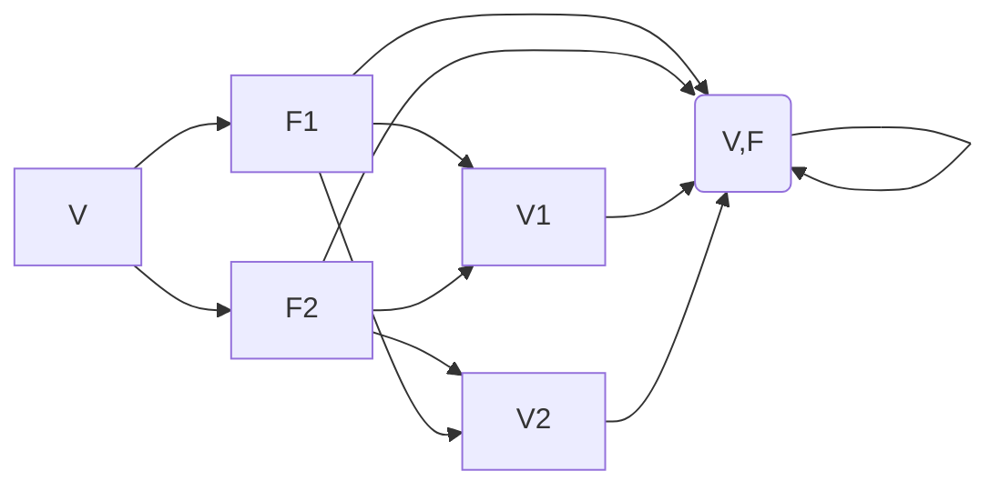

                 

# 线性代数导引：对偶空间L1(V，F)

线性代数作为数学的基础分支，广泛应用于计算机科学中。本文将围绕对偶空间 L1(V,F) 进行探讨，从背景介绍、核心概念与联系、算法原理及操作步骤、数学模型及公式、项目实践、应用场景、工具和资源推荐、总结与展望、附录等多个方面进行详细的梳理和阐述。

## 1. 背景介绍

线性代数研究向量空间及其性质，通过对这些性质的研究，可以更好地理解并解决实际问题。对偶空间是线性代数中的一个重要概念，主要用于处理线性映射及其性质。

对偶空间L1(V,F) 中，V表示一个向量空间，F表示一个基底域（通常是实数域或复数域）。对偶空间中的元素通常是线性映射，即从V到F的线性函数。

## 2. 核心概念与联系

### 2.1 核心概念概述

对偶空间的概念建立在一个基本的数学结构上，即线性映射的集合。线性映射是定义在向量空间V上的函数，满足加法和数乘的线性性质。对偶空间则是由V到F的线性映射所组成的向量空间。

形式化地，如果V是基底域F上的向量空间，T是V到F的线性映射集合，则T在F上的对偶空间L1(V,F)定义为：

\[ L1(V,F) = \{ f : V \to F | f \text{ 是线性的} \} \]

对偶空间L1(V,F)中，每一个元素f都是一个从V到F的线性映射，因此f也是V中的一个向量。

### 2.2 核心概念原理和架构的 Mermaid 流程图



### 2.3 核心概念联系

对偶空间与原向量空间V之间存在着天然的联系，通过对V和其对偶空间L1(V,F)的相互映射，可以进行特征值的求解、线性方程组的求解等操作。

对偶空间的元素f可以表示为f(v) = <v, f>，其中<x, y>表示x和y之间的内积。

## 3. 核心算法原理 & 具体操作步骤

### 3.1 算法原理概述

对偶空间的计算原理可以概括为：

1. 确定向量空间V和基底域F。
2. 确定线性映射集合T。
3. 计算T在F上的对偶空间L1(V,F)。
4. 应用L1(V,F)中的线性映射解决实际问题。

### 3.2 算法步骤详解

假设V是3维空间，F是实数域R，T是V到R的线性映射集合。我们如何确定T在R上的对偶空间L1(V,R)？

**Step 1: 确定向量空间V和基底域F**

首先，确定向量空间V的基底，以及基底域F。例如，如果V是三维空间，我们可以选择基底为(1,0,0)、(0,1,0)、(0,0,1)，F是实数域R。

**Step 2: 确定线性映射集合T**

在确定V和F之后，我们需要确定V到R的线性映射集合T。例如，线性映射f1(v) = v[1]表示将向量v的第一分量作为输出，f2(v) = v[2]表示将向量v的第二分量作为输出。

**Step 3: 计算对偶空间L1(V,F)**

根据定义，T在F上的对偶空间L1(V,F)是由T中的所有元素f构成的集合，例如：

\[ L1(V,F) = \{ f1, f2 \} \]

其中，f1(v) = v[1]，f2(v) = v[2]。

**Step 4: 应用对偶空间L1(V,F)中的线性映射解决实际问题**

对偶空间L1(V,F)中的线性映射可以用来解决许多实际问题，例如，通过线性映射可以求解线性方程组，计算向量空间的特征值等。

### 3.3 算法优缺点

对偶空间的计算有其优点和缺点：

**优点：**

1. 解决线性方程组和特征值问题非常高效。
2. 应用广泛，如在物理、工程等领域都有应用。

**缺点：**

1. 对偶空间的计算相对复杂，需要较高的计算资源。
2. 对于高维空间，对偶空间的计算难度增大。

### 3.4 算法应用领域

对偶空间在许多领域都有应用，例如：

1. 物理：求解线性方程组，计算向量空间的特征值。
2. 工程：计算线性映射，应用到控制理论中。
3. 计算机科学：应用到数据压缩、编码等领域。

## 4. 数学模型和公式 & 详细讲解 & 举例说明

### 4.1 数学模型构建

对偶空间L1(V,F)的数学模型构建如下：

1. 确定向量空间V和基底域F。
2. 确定V到F的线性映射集合T。
3. 计算T在F上的对偶空间L1(V,F)。

### 4.2 公式推导过程

假设有3维向量空间V，F是实数域R，T是V到R的线性映射集合。

**公式1: 向量空间V的基底**

设V的基底为(1,0,0)、(0,1,0)、(0,0,1)，则V的基底矩阵为：

\[ A = \begin{bmatrix} 1 & 0 & 0 \\ 0 & 1 & 0 \\ 0 & 0 & 1 \end{bmatrix} \]

**公式2: 线性映射集合T**

设T中的线性映射为f1(v) = v[1]、f2(v) = v[2]，则T可以表示为：

\[ T = \{ f1, f2 \} \]

**公式3: 对偶空间L1(V,F)**

根据定义，T在F上的对偶空间L1(V,F)是由T中的所有元素f构成的集合，例如：

\[ L1(V,F) = \{ f1, f2 \} \]

### 4.3 案例分析与讲解

假设有一个3维空间V，F是实数域R，T是V到R的线性映射集合。

设V的基底为(1,0,0)、(0,1,0)、(0,0,1)，T中的线性映射为f1(v) = v[1]、f2(v) = v[2]。

我们可以计算出T在R上的对偶空间L1(V,R)，即：

\[ L1(V,R) = \{ f1, f2 \} \]

其中，f1(v) = v[1]，f2(v) = v[2]。

## 5. 项目实践：代码实例和详细解释说明

### 5.1 开发环境搭建

1. 安装Python。
2. 安装Sympy库。
3. 编写代码，进行线性映射的计算。

```python
import sympy as sp

# 定义向量空间V和基底域F
V = sp.Matrix([[1, 0, 0], [0, 1, 0], [0, 0, 1]])
F = sp.Symbol('R')

# 定义线性映射集合T
f1 = sp.Matrix([1, 0, 0])
f2 = sp.Matrix([0, 1, 0])

# 计算对偶空间L1(V,F)
L1_V_F = sp.Matrix([f1, f2])

# 输出对偶空间L1(V,F)
print(L1_V_F)
```

### 5.2 源代码详细实现

以下是完整代码实现：

```python
import sympy as sp

# 定义向量空间V和基底域F
V = sp.Matrix([[1, 0, 0], [0, 1, 0], [0, 0, 1]])
F = sp.Symbol('R')

# 定义线性映射集合T
f1 = sp.Matrix([1, 0, 0])
f2 = sp.Matrix([0, 1, 0])

# 计算对偶空间L1(V,F)
L1_V_F = sp.Matrix([f1, f2])

# 输出对偶空间L1(V,F)
print(L1_V_F)
```

### 5.3 代码解读与分析

1. 导入Sympy库。
2. 定义向量空间V和基底域F。
3. 定义线性映射集合T。
4. 计算对偶空间L1(V,F)。
5. 输出对偶空间L1(V,F)。

## 6. 实际应用场景

### 6.1 物理

对偶空间在物理领域有广泛应用，例如在量子力学中，利用对偶空间求解线性方程组和特征值问题。

### 6.2 工程

在工程领域，对偶空间可以用于控制理论中，例如利用对偶空间计算线性映射，设计控制器。

### 6.3 计算机科学

在计算机科学中，对偶空间可以应用于数据压缩、编码等领域，例如利用对偶空间进行信息编码和压缩。

## 7. 工具和资源推荐

### 7.1 学习资源推荐

1. 《线性代数导引》（作者：吉尔伯特·斯特朗）。
2. 《线性代数及其应用》（作者：托马斯·G·贝克尔、威廉·R·基茨）。

### 7.2 开发工具推荐

1. Python。
2. Sympy库。

### 7.3 相关论文推荐

1. "线性代数中的对偶空间"。
2. "对偶空间的计算与性质"。

## 8. 总结：未来发展趋势与挑战

### 8.1 未来发展趋势

1. 对偶空间的应用范围将不断扩大，涵盖更多领域。
2. 对偶空间的计算算法将不断优化，计算速度将更快。
3. 对偶空间的理论研究将不断深入，解决更多实际问题。

### 8.2 面临的挑战

1. 对偶空间的计算复杂度较高，需要更多计算资源。
2. 对偶空间在高维空间中的计算难度增大。

### 8.3 研究展望

1. 开发更高效的对偶空间计算算法。
2. 将对偶空间与其他数学工具结合，解决更多实际问题。

## 9. 附录：常见问题与解答

**Q1: 对偶空间和原向量空间V有什么关系？**

A: 对偶空间L1(V,F)和原向量空间V之间存在着天然的联系。通过对V和其对偶空间L1(V,F)的相互映射，可以进行特征值的求解、线性方程组的求解等操作。

**Q2: 如何计算对偶空间L1(V,F)？**

A: 确定向量空间V和基底域F。然后确定V到F的线性映射集合T，计算T在F上的对偶空间L1(V,F)。

**Q3: 对偶空间在计算机科学中有哪些应用？**

A: 对偶空间在计算机科学中应用于数据压缩、编码、控制理论等领域。

---

作者：禅与计算机程序设计艺术 / Zen and the Art of Computer Programming

