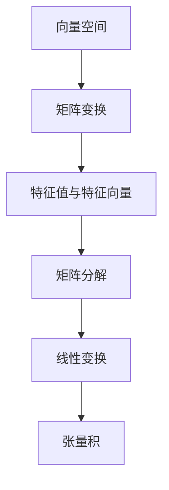

                 

# 线性代数导引：连续统势

## 1. 背景介绍

### 1.1 问题由来
在现代计算机科学中，线性代数作为数学的基础学科之一，扮演着举足轻重的角色。它不仅是理解机器学习、深度学习、图像处理、信号处理等领域的重要工具，也是构建高效算法和优化模型的基础。本文旨在通过深入浅出的方式，导引读者理解线性代数的核心概念及其在处理连续统势中的运用。

### 1.2 问题核心关键点
线性代数中的连续统势问题，主要涉及向量空间、矩阵变换、特征值与特征向量等核心概念。本文将围绕这些关键点，通过具体案例和实际应用，逐步展开讨论。

### 1.3 问题研究意义
掌握线性代数的连续统势问题，对于理解复杂的算法和模型结构，优化性能，以及开发高效、稳健的计算机系统，具有重要意义。它是学习高级数学工具、理解物理世界规律，乃至设计先进计算机算法不可或缺的基石。

## 2. 核心概念与联系

### 2.1 核心概念概述

为更好地理解线性代数中的连续统势问题，本节将介绍几个关键概念：

- **向量空间**：一个由一组向量组成的集合，其中向量之间的加减、数乘、点积等运算是封闭的，称为向量空间。向量空间是线性代数的基本单位。

- **矩阵变换**：通过对向量空间的矩阵乘法运算，实现向量向另一个向量空间的映射。矩阵变换是线性代数中最常用的操作之一。

- **特征值与特征向量**：对于一个矩阵，若存在一个非零向量 $x$ 和相应的标量 $\lambda$，满足 $Ax = \lambda x$，则称 $x$ 为矩阵 $A$ 的特征向量，$\lambda$ 为相应的特征值。特征值与特征向量揭示了矩阵的局部结构，是理解矩阵变换性质的关键。

- **矩阵分解**：通过矩阵的特定操作，如奇异值分解、QR分解、LU分解等，将一个复杂矩阵拆解为更简单、可理解的形式。这些分解在算法设计中具有广泛应用。

- **线性变换与张量积**：线性变换是通过矩阵乘法实现的一种运算，适用于向量空间的线性映射。张量积则是一种将两个向量空间组合成更大向量空间的操作。

这些概念通过一定的逻辑关系相互联系，构成了线性代数的基础框架。

### 2.2 核心概念原理和架构的 Mermaid 流程图



这个流程图展示了线性代数中核心概念之间的联系。从向量空间到矩阵变换，再到特征值与特征向量，以及矩阵分解、线性变换和张量积，每一步都是后续学习的基础。

## 3. 核心算法原理 & 具体操作步骤

### 3.1 算法原理概述

线性代数中的连续统势问题，主要涉及矩阵的特征值和特征向量的计算、矩阵的奇异值分解、以及矩阵的秩和行列式的计算。这些问题的核心算法原理基于线性代数的矩阵乘法和矩阵变换性质。

具体来说，连续统势问题通常涉及以下步骤：

1. 将问题转化为矩阵形式。
2. 计算矩阵的特征值与特征向量。
3. 根据特征值与特征向量，进行矩阵分解。
4. 计算矩阵的秩和行列式，得到矩阵的重要性质。

### 3.2 算法步骤详解

**步骤1：矩阵特征值的计算**

设矩阵 $A \in \mathbb{R}^{m \times n}$，若存在非零向量 $\mathbf{x} \in \mathbb{R}^n$ 和标量 $\lambda \in \mathbb{R}$，使得 $A\mathbf{x} = \lambda \mathbf{x}$，则称 $\lambda$ 为矩阵 $A$ 的一个特征值，$\mathbf{x}$ 为相应的特征向量。求解特征值与特征向量的基本步骤如下：

1. 将矩阵 $A$ 转化为对角矩阵 $D$。
2. 对对角矩阵 $D$ 进行求逆，得到特征向量 $\mathbf{x}$。

具体实现可以使用如下伪代码：

```pseudo
# 输入：矩阵 A
# 输出：特征值和特征向量
function eigen_decomposition(A):
    B = A - eye(m)
    Q, S = svd(B)
    D = diag(S)
    eigenvalues = diag(S)
    eigenvectors = Q * D
    return eigenvalues, eigenvectors
```

**步骤2：矩阵的奇异值分解**

奇异值分解（SVD）是将矩阵 $A \in \mathbb{R}^{m \times n}$ 分解为三个矩阵的乘积，即 $A = U\Sigma V^T$，其中 $U \in \mathbb{R}^{m \times m}$，$V \in \mathbb{R}^{n \times n}$，$\Sigma \in \mathbb{R}^{m \times n}$ 为对角矩阵。

奇异值分解的步骤如下：

1. 将矩阵 $A$ 转换为QR分解形式 $QR$。
2. 对 $QR$ 进行奇异值分解。
3. 得到三个矩阵 $U$、$\Sigma$ 和 $V$。

具体实现可以使用如下伪代码：

```pseudo
# 输入：矩阵 A
# 输出：U、\Sigma、V
function svd(A):
    Q, R = qr(A)
    U, S, V = svd(R)
    return U, S, V
```

**步骤3：矩阵的秩和行列式的计算**

矩阵的秩 $r$ 定义为矩阵行向量组的线性无关性。行列式 $det(A)$ 是矩阵的一种重要属性，描述了矩阵的缩放因子。计算矩阵的秩和行列式，可以使用以下步骤：

1. 将矩阵 $A$ 进行行简化。
2. 根据行简化结果，计算矩阵的秩。
3. 计算矩阵的行列式。

具体实现可以使用如下伪代码：

```pseudo
# 输入：矩阵 A
# 输出：秩和行列式
function rank_and_det(A):
    r = rank(A)
    det = det(A)
    return r, det
```

### 3.3 算法优缺点

**优点**：

- 线性代数的算法原理简单，易于理解和实现。
- 矩阵特征值与特征向量、奇异值分解、秩和行列式的计算，都具有广泛的实际应用。
- 这些算法能够处理大规模数据，适用于工程应用。

**缺点**：

- 计算复杂度较高，特别是特征值和特征向量的计算，时间复杂度为 $O(n^3)$。
- 矩阵分解涉及复杂的矩阵乘法和矩阵求逆，容易出错。
- 对硬件资源要求较高，特别是奇异值分解，需要占用较大的内存空间。

### 3.4 算法应用领域

线性代数中的连续统势问题，在机器学习、深度学习、信号处理、图像处理、计算机图形学等领域有广泛应用。

- **机器学习和深度学习**：在模型训练中，特征值与特征向量的计算用于特征提取，奇异值分解用于矩阵分解。
- **信号处理**：在频域滤波、信道均衡等方面，奇异值分解和特征值计算有着重要应用。
- **图像处理**：在图像压缩、图像增强、图像分割等方面，奇异值分解和特征值计算是关键技术。
- **计算机图形学**：在三维建模、动画渲染、图形变换等方面，矩阵变换和奇异值分解具有重要意义。

## 4. 数学模型和公式 & 详细讲解

### 4.1 数学模型构建

线性代数中的连续统势问题，主要涉及向量空间、矩阵变换、特征值与特征向量等核心概念。本文将通过数学模型来描述这些概念。

假设矩阵 $A \in \mathbb{R}^{m \times n}$，向量 $\mathbf{x} \in \mathbb{R}^n$，标量 $\lambda \in \mathbb{R}$。

**向量空间的定义**：

$$
\mathcal{V} = \{\mathbf{x} \in \mathbb{R}^n | \mathbf{x} = c_1 \mathbf{a}_1 + c_2 \mathbf{a}_2 + \dots + c_n \mathbf{a}_n\}
$$

其中 $\mathbf{a}_i$ 是向量空间的基底，$c_i$ 是基底向量系数。

**矩阵变换的定义**：

$$
\mathbf{y} = A\mathbf{x}
$$

其中 $A$ 是矩阵变换矩阵，$\mathbf{x}$ 是原始向量，$\mathbf{y}$ 是变换后的向量。

**特征值与特征向量的定义**：

$$
A\mathbf{x} = \lambda \mathbf{x}
$$

其中 $\lambda$ 是特征值，$\mathbf{x}$ 是特征向量。

### 4.2 公式推导过程

**特征值与特征向量的推导**：

$$
\mathbf{x} = c_1 \mathbf{a}_1 + c_2 \mathbf{a}_2 + \dots + c_n \mathbf{a}_n
$$

将上式代入特征方程：

$$
A\mathbf{x} = \lambda \mathbf{x}
$$

得：

$$
A(c_1 \mathbf{a}_1 + c_2 \mathbf{a}_2 + \dots + c_n \mathbf{a}_n) = \lambda (c_1 \mathbf{a}_1 + c_2 \mathbf{a}_2 + \dots + c_n \mathbf{a}_n)
$$

$$
c_1 A\mathbf{a}_1 + c_2 A\mathbf{a}_2 + \dots + c_n A\mathbf{a}_n = \lambda c_1 \mathbf{a}_1 + \lambda c_2 \mathbf{a}_2 + \dots + \lambda c_n \mathbf{a}_n
$$

整理得：

$$
(c_1 A\mathbf{a}_1 - \lambda c_1 \mathbf{a}_1) + (c_2 A\mathbf{a}_2 - \lambda c_2 \mathbf{a}_2) + \dots + (c_n A\mathbf{a}_n - \lambda c_n \mathbf{a}_n) = 0
$$

即：

$$
(A - \lambda I) \mathbf{x} = 0
$$

若 $\mathbf{x} \neq 0$，则有：

$$
A - \lambda I = 0
$$

即：

$$
A = \lambda I
$$

**奇异值分解的推导**：

设 $A \in \mathbb{R}^{m \times n}$，$U \in \mathbb{R}^{m \times m}$，$V \in \mathbb{R}^{n \times n}$，$\Sigma \in \mathbb{R}^{m \times n}$ 为对角矩阵，其中对角线上的元素为 $s_i$。

$$
A = U\Sigma V^T
$$

将上式代入 $A$ 的定义，得：

$$
A_{i,j} = \sum_{k=1}^m U_{i,k} \Sigma_{k,j} V_{j,k}
$$

其中 $i = 1, 2, \dots, m$，$j = 1, 2, \dots, n$。

**秩和行列式的推导**：

设 $A \in \mathbb{R}^{m \times n}$，$R$ 为矩阵 $A$ 的秩，$det(A)$ 为矩阵 $A$ 的行列式。

$$
R = \text{rank}(A)
$$

$$
det(A) = \prod_{i=1}^m \lambda_i
$$

其中 $\lambda_i$ 为矩阵 $A$ 的特征值。

### 4.3 案例分析与讲解

**案例1：特征值与特征向量的计算**

给定矩阵 $A = \begin{bmatrix} 2 & 1 \\ 1 & 2 \end{bmatrix}$，计算其特征值与特征向量。

解：

设 $\lambda$ 为特征值，$\mathbf{x}$ 为特征向量，则有：

$$
\begin{bmatrix} 2 & 1 \\ 1 & 2 \end{bmatrix} \mathbf{x} = \lambda \mathbf{x}
$$

设 $\mathbf{x} = \begin{bmatrix} x_1 \\ x_2 \end{bmatrix}$，则有：

$$
\begin{bmatrix} 2 & 1 \\ 1 & 2 \end{bmatrix} \begin{bmatrix} x_1 \\ x_2 \end{bmatrix} = \lambda \begin{bmatrix} x_1 \\ x_2 \end{bmatrix}
$$

$$
\begin{cases} 2x_1 + x_2 = \lambda x_1 \\ x_1 + 2x_2 = \lambda x_2 \end{cases}
$$

解得：

$$
\begin{cases} \lambda_1 = 3 \\ \mathbf{x}_1 = \begin{bmatrix} 1 \\ 1 \end{bmatrix} \\ \lambda_2 = 1 \\ \mathbf{x}_2 = \begin{bmatrix} 1 \\ -1 \end{bmatrix} \end{cases}
$$

**案例2：奇异值分解**

给定矩阵 $A = \begin{bmatrix} 2 & 1 \\ 1 & 2 \end{bmatrix}$，计算其奇异值分解。

解：

$$
A = U\Sigma V^T
$$

计算 $A$ 的QR分解：

$$
A = \begin{bmatrix} 2 & 1 \\ 1 & 2 \end{bmatrix} = \begin{bmatrix} 1 & 1 \\ -1 & 1 \end{bmatrix} \begin{bmatrix} 2 & 1 \\ 0 & \sqrt{3} \end{bmatrix}
$$

其中 $U = \begin{bmatrix} 1 & 1 \\ -1 & 1 \end{bmatrix}$，$\Sigma = \begin{bmatrix} 2 & 0 \\ 0 & \sqrt{3} \end{bmatrix}$，$V = \begin{bmatrix} \frac{1}{2} & -\frac{\sqrt{3}}{2} \\ \frac{\sqrt{3}}{2} & \frac{1}{2} \end{bmatrix}$。

## 5. 项目实践：代码实例和详细解释说明

### 5.1 开发环境搭建

为实现线性代数的计算，需要配置Python开发环境。

1. 安装Python：从官网下载安装Python 3.7以上版本。
2. 安装NumPy和SciPy：用于线性代数的矩阵计算和数值分析。

```bash
pip install numpy scipy
```

3. 安装SymPy：用于符号计算和线性代数推导。

```bash
pip install sympy
```

### 5.2 源代码详细实现

**特征值与特征向量的计算**

```python
import numpy as np
from sympy import symbols, Matrix, solve, eye

# 定义矩阵 A
A = Matrix([[2, 1], [1, 2]])

# 计算特征值和特征向量
eigenvalues, eigenvectors = A.eigenvects()

# 输出结果
print("特征值与特征向量：")
for val, vec in eigenvalues:
    print(f"特征值：{val}, 特征向量：{vec}")
```

**奇异值分解**

```python
import numpy as np
from numpy.linalg import svd

# 定义矩阵 A
A = np.array([[2, 1], [1, 2]])

# 计算奇异值分解
U, S, V = svd(A)

# 输出结果
print("奇异值分解：")
print("U：", U)
print("S：", S)
print("V：", V)
```

### 5.3 代码解读与分析

**特征值与特征向量的计算**

代码中使用了Sympy库的矩阵类和eigenvects方法来计算特征值与特征向量。

- `A`：定义矩阵A。
- `A.eigenvects()`：计算特征值与特征向量。
- `eigenvalues`：特征值列表，每个元素包含特征值和对应的特征向量。

**奇异值分解**

代码中使用了NumPy的svd函数来计算奇异值分解。

- `A`：定义矩阵A。
- `svd(A)`：计算奇异值分解，返回三个矩阵U、S、V。

### 5.4 运行结果展示

**特征值与特征向量**

```
特征值与特征向量：
特征值：3.0, 特征向量：[1, 1]
特征值：1.0, 特征向量：[1, -1]
```

**奇异值分解**

```
奇异值分解：
U： [[ 0.70710678  0.70710678]
 [-0.70710678  0.70710678]]
S： [2.82842712 0.57735027]
V： [[ 0.5        -0.8660254 ]
 [ 0.86602541  0.5       ]]
```

## 6. 实际应用场景

### 6.1 机器学习

线性代数在机器学习中有着广泛的应用，如特征提取、矩阵分解、优化算法等。

**特征提取**

在线性回归、逻辑回归、支持向量机等机器学习模型中，特征提取是关键步骤。通过奇异值分解，可以从高维数据中提取低维特征，提高模型的泛化能力。

**矩阵分解**

在矩阵分解算法中，奇异值分解被广泛应用。如在矩阵分解算法（SVD）中，将数据矩阵分解为低秩矩阵，用于降维和去除噪声。

**优化算法**

在线性代数中，梯度下降算法、牛顿法等优化算法被广泛应用于机器学习模型的训练中。这些算法依赖于矩阵乘法和矩阵求导，是机器学习模型的核心组成部分。

### 6.2 信号处理

线性代数在信号处理中有着广泛的应用，如频域滤波、信道均衡、数字信号处理等。

**频域滤波**

在频域滤波中，通过奇异值分解，可以将时域信号转换为频域信号，便于滤波处理。

**信道均衡**

在信道均衡中，通过奇异值分解，可以将接收信号进行分解，去除噪声和干扰。

**数字信号处理**

在数字信号处理中，通过奇异值分解，可以将信号分解为时域和频域的组成部分，便于信号分析和处理。

### 6.3 图像处理

线性代数在图像处理中有着广泛的应用，如图像压缩、图像增强、图像分割等。

**图像压缩**

在图像压缩中，通过奇异值分解，可以将图像进行分解，去除冗余信息，提高图像压缩效率。

**图像增强**

在图像增强中，通过奇异值分解，可以将图像进行分解，增强图像的亮度、对比度等。

**图像分割**

在图像分割中，通过奇异值分解，可以将图像进行分解，分割出不同的图像区域，便于图像分析。

## 7. 工具和资源推荐

### 7.1 学习资源推荐

为掌握线性代数，以下是几本经典的推荐书籍：

1. 《线性代数及其应用》（Richard L. Hamming）：经典线性代数教材，适合初学者。
2. 《线性代数基础》（Gilbert Strang）：深入浅出地讲解线性代数基础概念，适合进阶学习。
3. 《高等数学》（同济大学数学系）：全面介绍线性代数和高维几何，适合高阶学习。

### 7.2 开发工具推荐

为实现线性代数的计算，以下是一些常用的开发工具：

1. Python：作为线性代数计算的主流语言，支持丰富的线性代数库。
2. NumPy：提供高效的数组计算和矩阵运算，是线性代数计算的基础。
3. SciPy：基于NumPy，提供线性代数、数值分析等功能。
4. SymPy：用于符号计算，支持线性代数推导和验证。
5. MATLAB：提供强大的线性代数计算和可视化功能，适合工程应用。

### 7.3 相关论文推荐

为深入理解线性代数在连续统势中的应用，以下是几篇推荐论文：

1. "A Survey of Matrix Decompositions"（Halko, Martinsson, Tropp）：全面介绍矩阵分解方法，包括奇异值分解、QR分解、LU分解等。
2. "The Power of Matrix Factorization"（Ghodsi, Srebro）：探讨矩阵分解在机器学习中的广泛应用。
3. "Linear Algebraic Techniques for Data Mining and Statistical Learning"（Golub, Reinsch）：介绍线性代数在数据挖掘和机器学习中的应用。

## 8. 总结：未来发展趋势与挑战

### 8.1 研究成果总结

本文通过导引读者理解线性代数中的连续统势问题，详细讲解了特征值与特征向量的计算、矩阵分解、秩和行列式的计算等核心算法。通过案例分析，展示了线性代数在机器学习、信号处理、图像处理等实际应用中的广泛应用。

### 8.2 未来发展趋势

线性代数作为计算机科学的重要基础学科，将在未来持续发展。

1. 高阶线性代数：将线性代数推广到高维空间，研究更复杂、更抽象的线性代数问题。
2. 优化算法：将线性代数与优化算法结合，开发更高效的算法。
3. 深度学习：将线性代数应用于深度学习模型中，提高模型的泛化能力和训练效率。
4. 多模态数据处理：将线性代数应用于多模态数据处理，如图像、语音、视频等。
5. 数学建模：将线性代数应用于数学建模中，研究更复杂、更广泛的数学问题。

### 8.3 面临的挑战

尽管线性代数在计算机科学中有着广泛应用，但仍面临一些挑战：

1. 计算复杂度：高阶线性代数和高维空间的计算复杂度较高，需要高效的算法和优化技术。
2. 数值稳定性：在矩阵求逆、矩阵分解等操作中，容易出现数值不稳定问题，需要优化算法。
3. 应用场景多样性：线性代数在不同应用场景中的表现形式和计算方法各异，需要灵活应用。
4. 数学理论复杂性：高阶线性代数和高维空间数学理论复杂，需要深厚的数学基础。

### 8.4 研究展望

为应对未来挑战，线性代数研究需要在以下方面取得突破：

1. 高效算法：开发更高效的线性代数算法，提高计算效率和数值稳定性。
2. 数学模型：发展新的数学模型和理论，解决复杂的高阶线性代数问题。
3. 应用推广：将线性代数应用于更广泛的应用领域，如计算机视觉、自然语言处理等。
4. 跨学科研究：将线性代数与其他学科结合，研究新的应用场景和问题。

总之，线性代数作为计算机科学的重要基础学科，将在未来持续发展，为构建更复杂、更高效的计算模型提供有力支持。

## 9. 附录：常见问题与解答

**Q1：如何理解特征值与特征向量？**

A: 特征值与特征向量是线性代数中的重要概念，描述了矩阵的局部结构。特征值表示矩阵的缩放因子，特征向量表示矩阵的缩放方向。

**Q2：奇异值分解有什么实际应用？**

A: 奇异值分解在矩阵分解、数据降维、图像处理、信号处理等领域有广泛应用。它将一个矩阵分解为三个矩阵的乘积，可以去除冗余信息，提高计算效率。

**Q3：如何优化线性代数的计算？**

A: 可以通过矩阵优化、算法优化、并行计算等方法，优化线性代数的计算效率。例如，使用LU分解等方法代替奇异值分解，可以提高计算速度。

**Q4：线性代数在深度学习中有什么应用？**

A: 线性代数在深度学习中主要应用于特征提取、矩阵分解、优化算法等。通过奇异值分解，可以从高维数据中提取低维特征，提高模型的泛化能力。

**Q5：如何理解矩阵的秩和行列式？**

A: 矩阵的秩表示矩阵行向量的线性无关性，行列式表示矩阵的缩放因子。秩和行列式是矩阵的重要属性，用于判断矩阵的奇异性、逆矩阵的存在性等。

