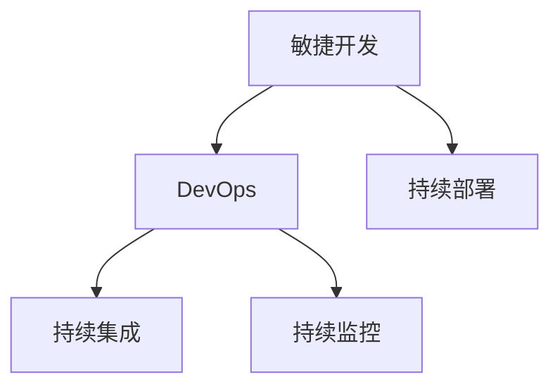
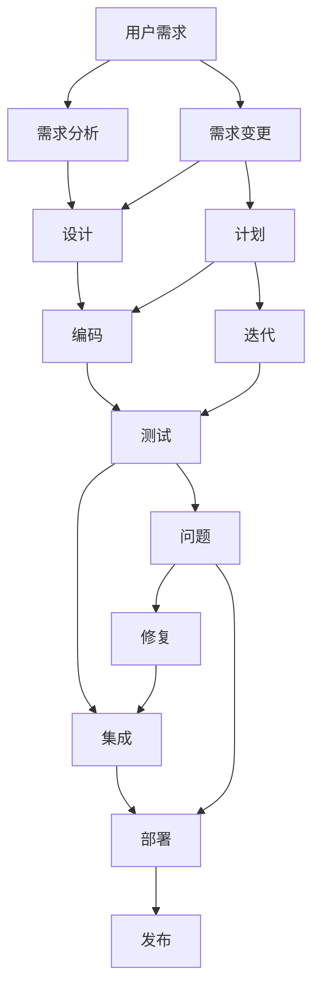

                 

# 组织和指导项目的开发、测试、维护、升级、更新，解决开发中的技术问题

## 1. 背景介绍

在当今信息时代，软件开发已经成为一个跨学科的复杂工程。无论是初创企业，还是大型公司，都需要面对项目的组织和开发、测试、维护、升级和更新的过程。这其中，开发中的技术问题常常成为项目的瓶颈，解决这些问题需要深入的理论基础和实际经验。本文将从理论基础出发，深入探讨如何系统地组织和指导项目的各个阶段，并解决开发中的常见技术问题。

## 2. 核心概念与联系

### 2.1 核心概念概述

在软件开发过程中，有许多核心概念和技术，这些概念相互联系，共同构成了软件开发的框架。以下是几个关键概念：

- **敏捷开发(Agile Development)**：一种迭代、增量的软件开发方法，强调快速响应变化，持续交付价值。
- **DevOps(Development and Operations)**：通过自动化和协作，实现开发和运维的紧密结合，提升交付效率和系统可靠性。
- **持续集成(Continuous Integration, CI)**：定期集成代码，快速发现和修复问题，提升代码质量和交付速度。
- **持续部署(Continuous Deployment, CD)**：自动将代码部署到生产环境，快速发布新功能，提升用户满意度。
- **持续监控(Continuous Monitoring, CM)**：实时监控系统运行状况，及时发现和解决问题，保障系统稳定性。

这些概念之间的联系如下：



敏捷开发是基础，DevOps和CI/CD是工具和流程，CM是保障，它们共同作用于整个软件开发生命周期。

### 2.2 核心概念原理和架构的 Mermaid 流程图

下图展示了敏捷开发、DevOps和CI/CD的核心流程和工作内容。



## 3. 核心算法原理 & 具体操作步骤

### 3.1 算法原理概述

软件开发中的技术问题往往涉及系统架构、代码实现、性能优化、安全防护等多个方面。解决这些问题需要综合运用各种算法和工具。以下是一些常见的算法原理：

- **静态分析(Static Analysis)**：在代码编写完成后，使用工具自动检查代码质量，包括语法错误、代码风格、潜在的运行时错误等。
- **动态分析(Dynamic Analysis)**：在程序运行时，使用工具监测系统行为，包括性能瓶颈、内存泄漏、异常等。
- **代码覆盖率测试(Coverage Testing)**：通过执行测试用例，衡量代码覆盖率，确保每个路径都被测试到。
- **回归测试(Regression Testing)**：在软件升级或新增功能后，自动执行原有测试用例，确保功能不变。

### 3.2 算法步骤详解

解决开发中的技术问题通常分为以下几个步骤：

1. **问题定位**：通过日志、监控工具等手段，确定问题的具体位置和原因。
2. **分析问题**：对问题进行深入分析，找出根本原因。
3. **解决问题**：根据分析结果，采取相应的技术手段，修复问题。
4. **验证问题**：在修复后，重新测试，确保问题已解决。
5. **知识积累**：将解决问题的经验和教训记录下来，供未来参考。

### 3.3 算法优缺点

- **优点**：
  - 通过系统化的流程和方法，能够快速定位和解决问题，避免问题进一步恶化。
  - 提高代码质量和系统稳定性，提升交付效率和用户满意度。

- **缺点**：
  - 解决复杂问题需要较高的技术和经验，容易陷入困境。
  - 某些问题可能需要跨学科知识，例如安全性问题，需要同时掌握安全技术和开发流程。

### 3.4 算法应用领域

这些算法和步骤广泛适用于各种类型的软件开发项目，包括Web应用、移动应用、企业管理系统等。

## 4. 数学模型和公式 & 详细讲解 & 举例说明

### 4.1 数学模型构建

软件开发中的技术问题可以通过数学模型来描述。例如，可以将系统运行时间建模，来分析性能瓶颈。数学模型通常由以下元素组成：

- **输入**：系统参数、用户输入等。
- **状态**：系统当前的状态，如运行时间、内存使用等。
- **输出**：系统的输出结果，如页面加载时间、响应时间等。
- **约束**：系统的限制条件，如资源限制、性能指标等。

### 4.2 公式推导过程

以性能优化为例，假设系统运行时间为 $t$，CPU 使用率为 $u$，内存使用量为 $m$，则可以建立如下数学模型：

$$
t = f(u, m)
$$

其中 $f$ 为性能函数，具体形式取决于系统架构和实现细节。

### 4.3 案例分析与讲解

假设系统运行时间为 $t$，CPU 使用率为 $u$，内存使用量为 $m$，则可以根据实际测试数据，使用线性回归等方法，推导出性能函数的表达式：

$$
t = k_1 u + k_2 m + b
$$

其中 $k_1, k_2, b$ 为模型参数。通过最小二乘法等方法，可以求解模型参数，进而分析不同参数下的性能表现。

## 5. 项目实践：代码实例和详细解释说明

### 5.1 开发环境搭建

在进行项目实践前，我们需要准备好开发环境。以下是使用Python进行开发的环境配置流程：

1. 安装Anaconda：从官网下载并安装Anaconda，用于创建独立的Python环境。

2. 创建并激活虚拟环境：
```bash
conda create -n pyenv python=3.8 
conda activate pyenv
```

3. 安装PyTorch：根据CUDA版本，从官网获取对应的安装命令。例如：
```bash
conda install pytorch torchvision torchaudio cudatoolkit=11.1 -c pytorch -c conda-forge
```

4. 安装各类工具包：
```bash
pip install numpy pandas scikit-learn matplotlib tqdm jupyter notebook ipython
```

完成上述步骤后，即可在`pyenv`环境中开始项目实践。

### 5.2 源代码详细实现

以下是一个使用PyTorch进行机器学习项目开发的完整代码示例：

```python
import torch
import torch.nn as nn
import torch.optim as optim

# 定义模型
class Net(nn.Module):
    def __init__(self):
        super(Net, self).__init__()
        self.fc1 = nn.Linear(784, 256)
        self.fc2 = nn.Linear(256, 128)
        self.fc3 = nn.Linear(128, 10)

    def forward(self, x):
        x = torch.relu(self.fc1(x))
        x = torch.relu(self.fc2(x))
        x = self.fc3(x)
        return x

# 定义损失函数和优化器
net = Net()
criterion = nn.CrossEntropyLoss()
optimizer = optim.SGD(net.parameters(), lr=0.01, momentum=0.9)

# 定义训练和测试函数
def train(model, device, train_loader, optimizer, epoch):
    model.train()
    for batch_idx, (data, target) in enumerate(train_loader):
        data, target = data.to(device), target.to(device)
        optimizer.zero_grad()
        output = model(data)
        loss = criterion(output, target)
        loss.backward()
        optimizer.step()

def test(model, device, test_loader):
    model.eval()
    test_loss = 0
    correct = 0
    with torch.no_grad():
        for data, target in test_loader:
            data, target = data.to(device), target.to(device)
            output = model(data)
            test_loss += criterion(output, target).item()
            pred = output.argmax(dim=1, keepdim=True)
            correct += pred.eq(target.view_as(pred)).sum().item()
    print('Test Loss: %.3f' % (test_loss / len(test_loader)),
          'Test Accuracy: %.3f' % (correct / len(test_loader)))

# 准备数据
train_loader = torch.utils.data.DataLoader(
    torchvision.datasets.MNIST(root='./data', train=True, download=True,
                               transform=torchvision.transforms.ToTensor()),
    batch_size=64, shuffle=True)

test_loader = torch.utils.data.DataLoader(
    torchvision.datasets.MNIST(root='./data', train=False, download=True,
                               transform=torchvision.transforms.ToTensor()),
    batch_size=64, shuffle=False)

# 训练和测试模型
device = torch.device("cuda" if torch.cuda.is_available() else "cpu")
train(net, device, train_loader, optimizer, 10)
test(net, device, test_loader)
```

### 5.3 代码解读与分析

以上代码实现了一个简单的神经网络，用于手写数字识别任务。以下是关键代码的解读：

- **定义模型**：使用PyTorch定义一个简单的多层感知机网络，包括两个隐藏层和一个输出层。
- **定义损失函数和优化器**：使用交叉熵损失函数和随机梯度下降优化器。
- **定义训练和测试函数**：使用DataLoader加载数据，并在训练集上训练模型，在测试集上测试模型。
- **准备数据**：使用PyTorch自带的MNIST数据集，进行预处理和加载。
- **训练和测试模型**：在GPU上训练和测试模型。

## 6. 实际应用场景

### 6.1 软件开发项目管理

在软件开发中，项目管理是至关重要的。以下是一个典型的软件开发项目的管理流程：

1. **需求分析**：确定项目的用户需求和功能需求。
2. **设计**：设计系统架构和模块结构。
3. **编码**：编写代码，实现需求。
4. **测试**：进行单元测试、集成测试和系统测试。
5. **部署**：将代码部署到生产环境，发布产品。
6. **维护**：修复漏洞，优化性能，更新功能。

### 6.2 系统架构设计和优化

在系统架构设计中，需要考虑系统的可扩展性、可维护性和性能。以下是一个典型的系统架构设计：

1. **模块化设计**：将系统分解为多个模块，每个模块负责特定的功能。
2. **接口设计**：定义模块之间的接口，确保模块之间的协同工作。
3. **数据流设计**：设计数据流的流动路径，确保数据的一致性和正确性。
4. **监控设计**：设计监控系统，实时监控系统运行状况。

## 7. 工具和资源推荐

### 7.1 学习资源推荐

为了帮助开发者掌握软件开发和项目管理的相关知识和技能，这里推荐一些优质的学习资源：

1. 《敏捷开发实践指南》：介绍了敏捷开发的基本概念、实践方法和工具，适合初学者入门。
2. 《DevOps 实战指南》：详细介绍了DevOps的基本概念、实践方法和工具，适合开发和运维人员参考。
3. 《持续集成和持续部署实践》：介绍了持续集成和持续部署的基本概念、实践方法和工具，适合软件工程师参考。
4. 《系统监控和运维实战》：介绍了系统监控和运维的基本概念、实践方法和工具，适合运维工程师参考。

### 7.2 开发工具推荐

高效的开发离不开优秀的工具支持。以下是几款用于软件开发和项目管理的常用工具：

1. JIRA：项目管理工具，支持敏捷开发和DevOps实践，提供任务跟踪、缺陷管理等功能。
2. GitHub：代码托管平台，支持版本控制、代码审查、自动化构建等功能。
3. Jenkins：持续集成工具，支持自动化构建、测试和部署。
4. Ansible：自动化运维工具，支持自动化配置、部署和管理。
5. Prometheus：监控工具，支持系统监控、告警和分析。

### 7.3 相关论文推荐

软件开发和项目管理的研究涉及多个领域，以下是几篇奠基性的相关论文，推荐阅读：

1. Agile Software Development: Principles, Patterns, and Practices：介绍了敏捷开发的基本概念和实践方法。
2. Continuous Integration: An Overview：介绍了持续集成的基本概念和实践方法。
3. Continuous Deployment: Challenges and Opportunities：介绍了持续部署的基本概念和实践方法。
4. DevOps: The Culture and Practices that Enable Continuous Delivery：介绍了DevOps的基本概念和实践方法。
5. Monitoring for Software Quality: A Comprehensive Review：介绍了系统监控的基本概念和实践方法。

## 8. 总结：未来发展趋势与挑战

### 8.1 研究成果总结

本文对软件开发和项目管理的各个阶段进行了详细的介绍，涵盖了敏捷开发、DevOps、持续集成和持续部署、系统架构设计和优化等方面的内容。通过系统的理论基础和实际案例，帮助开发者更好地理解和应用这些概念和工具。

### 8.2 未来发展趋势

展望未来，软件开发和项目管理将呈现以下几个发展趋势：

1. **自动化和智能化**：更多的自动化工具和智能化技术将引入软件开发和项目管理中，提升开发效率和系统可靠性。
2. **持续学习和持续改进**：通过持续学习和持续改进，不断提高团队的开发能力和项目管理水平。
3. **多学科融合**：软件开发和项目管理将与其他学科（如心理学、社会学等）进行更多的融合，提升系统的用户体验和社会影响。
4. **生态系统建设**：建立开源社区和产业生态，促进软件开发和项目管理的标准化和规范化。

### 8.3 面临的挑战

尽管软件开发和项目管理已经取得了一定的进展，但在迈向更加智能化、普适化应用的过程中，它仍面临着诸多挑战：

1. **技术复杂度**：软件开发和项目管理涉及多个学科和多个领域，技术复杂度较高。
2. **人才短缺**：优秀软件开发和项目管理人才的培养需要较长时间，短期内可能面临人才短缺的问题。
3. **资源限制**：软件开发和项目管理需要大量的资源投入，包括人力、物力和财力。
4. **沟通障碍**：跨团队、跨部门的项目管理需要良好的沟通和协作能力，可能面临沟通障碍的问题。

### 8.4 研究展望

未来，软件开发和项目管理的研究需要在以下几个方面寻求新的突破：

1. **自动化技术**：开发更多的自动化工具和智能化技术，提高开发效率和系统可靠性。
2. **智能化技术**：引入智能化技术，如机器学习、人工智能等，提高系统的智能化水平。
3. **持续学习**：建立持续学习的机制，提高团队的学习能力和创新能力。
4. **多学科融合**：与其他学科进行更多融合，提升系统的用户体验和社会影响。

## 9. 附录：常见问题与解答

**Q1：如何提高软件开发团队的协作能力？**

A: 提高团队协作能力，可以通过以下方法：
- **明确角色和责任**：定义每个成员的角色和责任，避免职责不清和重复劳动。
- **建立沟通机制**：建立定期的会议和沟通渠道，确保信息透明和及时传达。
- **使用协作工具**：使用协作工具，如JIRA、GitHub等，提高协作效率和项目管理水平。

**Q2：如何快速定位和解决技术问题？**

A: 快速定位和解决技术问题，可以通过以下方法：
- **日志分析**：通过日志分析，定位问题的具体位置和原因。
- **代码审查**：通过代码审查，发现潜在的问题和改进点。
- **单元测试**：通过单元测试，确保代码的正确性和稳定性。
- **监控工具**：通过监控工具，实时监测系统运行状况，及时发现和解决问题。

**Q3：如何进行系统架构设计和优化？**

A: 进行系统架构设计和优化，可以通过以下方法：
- **模块化设计**：将系统分解为多个模块，每个模块负责特定的功能。
- **接口设计**：定义模块之间的接口，确保模块之间的协同工作。
- **数据流设计**：设计数据流的流动路径，确保数据的一致性和正确性。
- **监控设计**：设计监控系统，实时监测系统运行状况。

---

作者：禅与计算机程序设计艺术 / Zen and the Art of Computer Programming

