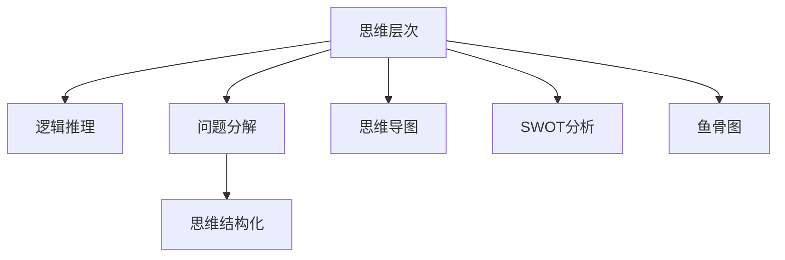

                 

## 1. 背景介绍

### 1.1 问题由来
结构化思维（Structured Thinking）是一种系统化、逻辑化的思考方式，旨在通过结构化的方法提升思维的深度和广度，减少决策过程中的模糊性和不确定性。随着信息技术的发展，结构化思维在各个行业中的应用越来越广泛，尤其是在软件开发、项目管理、数据分析等领域。

然而，结构化思维并非适用于所有人，尤其在技术领域，许多程序员和开发者往往更加侧重于技术细节的实现，而忽视了结构化思维的运用。这种局限性不仅影响了项目进展，还限制了技术人员的全面成长。因此，本文旨在通过系统化的阐述，帮助开发者了解结构化思维的原理与应用，提升其在软件开发和项目管理中的运用能力。

### 1.2 问题核心关键点
结构化思维的核心关键点包括以下几个方面：

- 结构化思维的三个基本原则：
  1. **层次性**：将复杂问题分解为多个层次，从局部到整体，从具体到抽象，分步解决问题。
  2. **逻辑性**：在分析问题时，采用逻辑推理、归纳、演绎等方法，确保思维的严谨性和准确性。
  3. **条理性**：在解决问题时，按照一定的顺序或步骤，确保思维的条理性和有序性。

- 结构化思维的工具和方法：
  1. **思维导图（Mind Mapping）**：通过图形化的方式展示思维结构，帮助理解和记忆复杂信息。
  2. **SWOT分析**：对项目或任务的优势、劣势、机会、威胁进行系统分析，制定应对策略。
  3. **鱼骨图（Ishikawa Diagram）**：用于分析问题的根本原因，找出问题的关键因素。

## 2. 核心概念与联系

### 2.1 核心概念概述
结构化思维的核心概念包括思维层次、逻辑推理、问题分解、思维结构化等多个方面。这些概念通过逻辑和实践的结合，形成了一套系统化的思考和解决问题的方法论。

### 2.2 核心概念原理和架构的 Mermaid 流程图



这个流程图展示了结构化思维的基本架构：

1. **思维层次**：通过层次化分解问题，从局部到整体，逐步解决问题。
2. **逻辑推理**：运用逻辑方法，确保分析的准确性和严谨性。
3. **问题分解**：将复杂问题拆分成多个小问题，逐个解决。
4. **思维结构化**：通过结构化的方式组织思维，使问题分析更加系统化。
5. **思维导图**：图形化展示思维结构，帮助理解和记忆。
6. **SWOT分析**：分析项目或任务的优势、劣势、机会、威胁，制定应对策略。
7. **鱼骨图**：分析问题的根本原因，找出关键因素。

## 3. 核心算法原理 & 具体操作步骤
### 3.1 算法原理概述
结构化思维的算法原理主要基于问题的分解和逻辑推理，通过系统化的思维方法，逐步解决复杂问题。其核心在于将问题分层、分段、分步骤地进行分析和解决，确保每一步都有清晰的逻辑支撑和明确的目标。

### 3.2 算法步骤详解
#### 3.2.1 问题定义与分解
1. **明确问题**：首先需要明确问题是什么，问题的定义越清晰，后续分析的准确性越高。
2. **层次化分解**：将问题分解为多个层次，从大到小，从宏观到微观，逐步深入。
3. **子问题定义**：在每个层次上，定义具体的子问题，确保问题具有可操作性。

#### 3.2.2 逻辑推理与分析
1. **建立假设**：根据问题定义，建立初步的假设，形成问题的初步理解。
2. **逻辑推导**：运用逻辑推理方法，验证假设的正确性，找出其中的逻辑矛盾和冲突。
3. **假设修正**：根据逻辑推导结果，对初步假设进行修正，形成更准确的解决方案。

#### 3.2.3 解决方案设计
1. **方案选择**：根据问题的复杂度和重要性，选择适合的解决方案，设计具体的执行步骤。
2. **资源配置**：评估解决方案所需的资源，包括人力、时间、技术等，进行合理的资源配置。
3. **实施计划**：制定详细的实施计划，包括时间节点、责任分工、进度跟踪等。

#### 3.2.4 结果评估与反馈
1. **结果评估**：实施解决方案后，进行结果评估，检查是否达到了预期目标。
2. **反馈调整**：根据评估结果，对解决方案进行调整和优化，形成闭环反馈机制。
3. **持续改进**：不断总结经验，持续改进解决方案，提升问题解决能力。

### 3.3 算法优缺点
#### 3.3.1 优点
1. **系统化**：结构化思维能够将复杂问题系统化地分解和分析，确保思维的条理性和逻辑性。
2. **可操作性强**：每个步骤都有明确的目标和任务，便于执行和跟踪。
3. **提高效率**：通过系统化的分析，可以减少问题的复杂性，提高问题解决的效率。

#### 3.3.2 缺点
1. **过程复杂**：结构化思维需要经过多个步骤和层次的分解与分析，过程较为复杂。
2. **灵活性不足**：固定的步骤和框架可能导致思维的僵化，难以应对突发情况。
3. **依赖逻辑推理**：如果逻辑推理不严谨，可能导致分析结果不准确。

### 3.4 算法应用领域
结构化思维在软件开发、项目管理、数据分析等多个领域都有广泛应用：

1. **软件开发**：需求分析、架构设计、代码实现、测试等各个阶段，都可以运用结构化思维进行系统化的分析。
2. **项目管理**：项目规划、进度跟踪、风险管理、质量控制等，通过结构化思维提升项目管理效率。
3. **数据分析**：数据清洗、特征工程、模型训练、结果验证等，确保数据分析的准确性和可靠性。

## 4. 数学模型和公式 & 详细讲解 & 举例说明
### 4.1 数学模型构建
结构化思维的数学模型通常以树形结构或流程图的形式展示，如决策树、PERT图等。

### 4.2 公式推导过程
以决策树为例，推导其计算过程：

1. **问题分解**：将问题分解为多个子问题，每个子问题对应决策树的一个分支。
2. **条件判断**：对于每个子问题，根据其条件建立判断节点，分支根据条件的不同进行扩展。
3. **结果计算**：在每个叶子节点上，计算问题解决的结果，形成最终的决策树。

### 4.3 案例分析与讲解
假设我们要设计一个简单的股票交易系统，通过结构化思维来解决问题：

1. **问题定义**：设计一个股票交易系统，实现股票买卖自动化。
2. **层次化分解**：
   1. 数据采集：获取实时股票行情和交易数据。
   2. 数据分析：分析历史数据，找出交易规律。
   3. 策略设计：设计交易策略，确定买卖条件。
   4. 系统实现：开发交易系统，实现自动化交易。
3. **逻辑推理与分析**：
   1. 数据采集模块：根据实时行情，更新股票数据。
   2. 数据分析模块：采用时间序列分析，找出交易规律。
   3. 策略设计模块：根据交易规律，设计买卖策略。
   4. 系统实现模块：将交易策略实现为代码，实现自动化交易。
4. **解决方案设计**：
   1. 选择适合的算法，如K线图、移动平均线等。
   2. 设计交易规则，如止损点、止盈点等。
   3. 实现系统，采用Python等语言进行开发。
5. **结果评估与反馈**：
   1. 评估交易系统的收益和风险，根据结果调整策略。
   2. 持续改进，提升交易系统的性能。

## 5. 项目实践：代码实例和详细解释说明
### 5.1 开发环境搭建
1. **安装Python环境**：选择Python 3.6及以上版本，安装Anaconda或Miniconda。
2. **安装相关库**：安装Pandas、NumPy、Matplotlib等常用库。
3. **配置IDE**：选择Visual Studio Code、PyCharm等IDE，配置环境变量。

### 5.2 源代码详细实现
以设计一个简单的股票交易系统为例，展示结构化思维的应用：

```python
import pandas as pd
import numpy as np
import matplotlib.pyplot as plt

def load_data(file_path):
    data = pd.read_csv(file_path)
    return data

def preprocess_data(data):
    # 数据清洗
    data = data.dropna()
    data = data.drop_duplicates()
    # 特征工程
    data['close_pct_change'] = data['close'].pct_change()
    return data

def analyze_data(data):
    # 数据分析
    data['mean_close_pct_change'] = data['close_pct_change'].mean()
    data['std_close_pct_change'] = data['close_pct_change'].std()
    return data

def design_strategy(data):
    # 策略设计
    strategy = {
        'buy_condition': data['close_pct_change'] > 0.01,
        'sell_condition': data['close_pct_change'] < -0.01
    }
    return strategy

def simulate_trading(data, strategy):
    # 模拟交易
    buy_points = data[data['close_pct_change'] > 0.01].index
    sell_points = data[data['close_pct_change'] < -0.01].index
    return buy_points, sell_points

def evaluate_strategy(data, buy_points, sell_points):
    # 结果评估
    buy_condition = data.iloc[buy_points].index
    sell_condition = data.iloc[sell_points].index
    return buy_condition, sell_condition

def visualize_strategy(data, buy_condition, sell_condition):
    # 可视化
    plt.plot(data['date'], data['close'], label='Close Price')
    plt.plot(data['date'].iloc[buy_condition], data['close'].iloc[buy_condition], marker='o', color='r', label='Buy Points')
    plt.plot(data['date'].iloc[sell_condition], data['close'].iloc[sell_condition], marker='x', color='b', label='Sell Points')
    plt.legend()
    plt.show()

if __name__ == "__main__":
    # 加载数据
    data = load_data('stock_data.csv')
    # 预处理数据
    data = preprocess_data(data)
    # 分析数据
    data = analyze_data(data)
    # 设计策略
    strategy = design_strategy(data)
    # 模拟交易
    buy_points, sell_points = simulate_trading(data, strategy)
    # 评估策略
    buy_condition, sell_condition = evaluate_strategy(data, buy_points, sell_points)
    # 可视化策略
    visualize_strategy(data, buy_condition, sell_condition)
```

### 5.3 代码解读与分析
1. **数据加载**：使用Pandas库加载股票数据，并进行清洗和去重处理。
2. **特征工程**：计算股票价格的百分比变化，作为交易策略的输入。
3. **数据分析**：计算价格的平均变化率和标准差，作为策略的参考。
4. **策略设计**：根据历史数据设计买入和卖出策略，设定买入和卖出条件。
5. **模拟交易**：根据策略模拟交易，找出买入和卖出点。
6. **结果评估**：评估交易策略的收益和风险，找出交易点。
7. **可视化**：使用Matplotlib库绘制股票价格变化图，显示买入和卖出点。

## 6. 实际应用场景
### 6.1 软件开发
在软件开发过程中，结构化思维可以用于需求分析、架构设计、代码实现和测试等各个阶段：

1. **需求分析**：通过结构化思维，明确问题的定义和需求，确保需求文档的清晰性和完整性。
2. **架构设计**：采用模块化和分层设计的思想，将系统架构系统化地分解和设计，提升系统的可维护性和可扩展性。
3. **代码实现**：通过结构化编程思想，编写清晰、可读性强的代码，提升开发效率和代码质量。
4. **测试**：通过单元测试、集成测试等，确保代码的正确性和可靠性。

### 6.2 项目管理
在项目管理过程中，结构化思维可以用于项目规划、进度跟踪、风险管理和质量控制等：

1. **项目规划**：通过SWOT分析，明确项目的优势、劣势、机会和威胁，制定项目计划。
2. **进度跟踪**：使用PERT图、甘特图等工具，跟踪项目的进度和任务完成情况，确保项目按时交付。
3. **风险管理**：采用鱼骨图分析项目的潜在风险，制定应对策略，降低风险对项目的影响。
4. **质量控制**：通过系统化的质量控制流程，确保项目交付的质量和标准。

### 6.3 数据分析
在数据分析过程中，结构化思维可以用于数据清洗、特征工程、模型训练和结果验证等：

1. **数据清洗**：通过结构化思维，逐步清洗和处理数据，确保数据的准确性和完整性。
2. **特征工程**：采用逻辑推理和分析方法，设计合适的特征，提升模型的预测能力。
3. **模型训练**：通过系统化的模型选择和训练，确保模型的可靠性和准确性。
4. **结果验证**：通过系统化的评估和验证方法，确保模型的性能和泛化能力。

## 7. 工具和资源推荐
### 7.1 学习资源推荐
1. **《结构化思考的艺术》**：介绍结构化思维的基本原理和应用方法。
2. **Coursera《结构化思维》课程**：通过视频和作业，系统学习结构化思维的各个方面。
3. **Udemy《结构化思考与问题解决》课程**：结合实际案例，讲解结构化思维的实践技巧。
4. **Khan Academy《逻辑与推理》课程**：系统学习逻辑推理和分析方法。

### 7.2 开发工具推荐
1. **Visual Studio Code**：轻量级、功能强大的IDE，支持Python和其他编程语言。
2. **PyCharm**：专业级Python IDE，提供丰富的功能和插件支持。
3. **Jupyter Notebook**：基于Web的交互式编程环境，适合数据处理和分析。
4. **Git**：版本控制系统，用于代码管理和协作开发。

### 7.3 相关论文推荐
1. **《结构化思维在软件开发中的应用》**：介绍结构化思维在软件开发中的应用案例和实践经验。
2. **《基于结构化思维的项目管理》**：介绍结构化思维在项目管理中的应用方法和工具。
3. **《数据科学中的结构化思维》**：介绍结构化思维在数据科学中的应用和挑战。

## 8. 总结：未来发展趋势与挑战
### 8.1 总结
本文系统地介绍了结构化思维的原理与应用，通过理论分析和实践案例，展示了结构化思维在软件开发、项目管理、数据分析等领域的应用价值。结构化思维能够系统化地分析和解决问题，提升思维的深度和广度，助力技术人员的全面成长。

### 8.2 未来发展趋势
1. **应用场景更广泛**：随着技术的不断发展，结构化思维将在更多领域得到应用，如智能制造、智能医疗、智能交通等。
2. **工具和平台更丰富**：未来将有更多结构化思维的工具和平台出现，如智能思维导图、结构化项目管理工具等。
3. **人工智能与结构化思维结合**：结构化思维与人工智能技术的结合，将提升问题解决的智能化水平。

### 8.3 面临的挑战
1. **复杂性增加**：随着问题的复杂性增加，结构化思维的应用将更加复杂。
2. **灵活性不足**：固定的步骤和框架可能导致思维的僵化，难以应对突发情况。
3. **依赖工具和技术**：结构化思维需要依赖于工具和技术，工具的局限性可能影响其应用效果。

### 8.4 研究展望
未来结构化思维的研究方向包括：
1. **自动化工具的开发**：开发自动化工具，提升结构化思维的应用效率和效果。
2. **跨学科应用**：结构化思维在跨学科领域的应用，如教育、金融、法律等，提升各领域的问题解决能力。
3. **理论和方法的创新**：结合人工智能、认知科学等新兴领域，探索结构化思维的新方法和新理论。

## 9. 附录：常见问题与解答
**Q1：结构化思维适用于所有技术团队吗？**
A: 结构化思维并不适用于所有技术团队，尤其对于那些依赖直觉和创意的工作，如艺术设计、创意写作等。但对于需要系统化分析和解决复杂问题的技术团队，结构化思维非常适用。

**Q2：结构化思维与敏捷开发是否冲突？**
A: 结构化思维与敏捷开发并不冲突，敏捷开发注重快速响应和迭代改进，而结构化思维注重系统化分析和问题解决。两者可以结合使用，提升项目的成功率和效率。

**Q3：结构化思维需要经过培训才能掌握吗？**
A: 结构化思维并不是一项特定的技能，而是一种思考方式。通过阅读相关书籍、参加课程和实践练习，任何人都可以掌握结构化思维的基本原理和应用方法。

**Q4：结构化思维在团队协作中有什么优势？**
A: 结构化思维在团队协作中可以提高沟通效率，确保信息的清晰传递和理解。同时，通过系统化的分析，团队可以更高效地解决问题，提升项目的整体质量。

**Q5：结构化思维与批判性思维有何区别？**
A: 结构化思维和批判性思维都是提升思维能力的重要方法，但结构化思维更注重问题的分解和分析，而批判性思维更注重对信息的评估和判断。两者可以结合使用，提升思维的全面性和深度。

