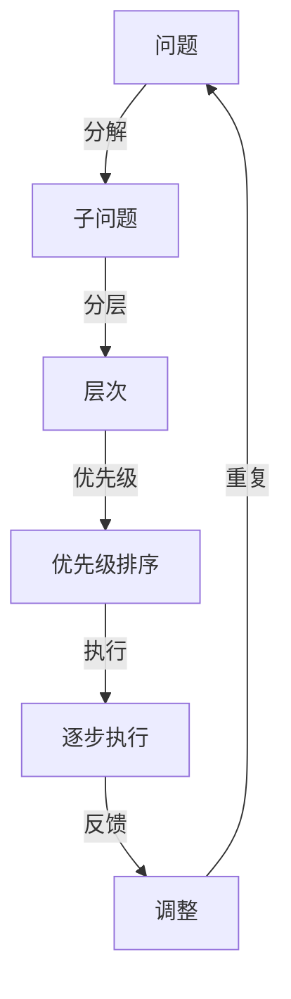

                 

# 结构化思维原理与应用：掌握结构化思维内核，呈现宏大且清澈的美，实现高效达成

结构化思维是一种高效、系统的方法，它将复杂问题分解为更小的、可管理的部分，并逐一解决。在软件开发、项目管理、决策分析等诸多领域中，结构化思维的应用已经得到了广泛的认可。本文将深入探讨结构化思维的核心原理、操作步骤、优缺点及其应用领域，通过具体的数学模型和代码实例，展示其在工作中的实际应用效果，并展望其未来的发展趋势与挑战。

## 1. 背景介绍

### 1.1 问题由来
在现代社会中，信息量爆炸式增长，我们每天需要处理和分析的信息量巨大。面对复杂多变的任务，仅仅依靠直觉和经验，往往难以高效且正确地解决问题。结构化思维正是为了应对这种挑战而提出的方法，它将问题分解为更小、更易于管理的部分，并按照一定的结构顺序逐一解决，从而达到高效达成目标的目的。

### 1.2 问题核心关键点
结构化思维的核心在于其系统化、层次化的解决问题方法。具体来说，它包括：

1. **分解与分层**：将复杂问题拆解为更小、更易管理的子问题。
2. **优先级排序**：对分解后的子问题进行优先级排序，确定解决顺序。
3. **逐步执行**：按照确定的优先级顺序，逐步解决每个子问题。
4. **反馈与调整**：在执行过程中，不断收集反馈，根据实际情况调整方案。

结构化思维的关键在于通过系统化、层次化的分解与执行，将复杂问题转化为可管理的部分，从而高效解决问题。

## 2. 核心概念与联系

### 2.1 核心概念概述

结构化思维涉及多个核心概念，包括但不限于：

- **分解（Decomposition）**：将复杂问题拆解为更小、更易于管理的部分。
- **分层（Layering）**：按照一定规则将问题分层，以便更好地理解和处理。
- **优先级（Prioritization）**：确定子问题的重要性和解决顺序。
- **逐步执行（Sequential Execution）**：按照优先级顺序，逐一解决每个子问题。
- **反馈与调整（Feedback & Adjustment）**：在执行过程中不断收集反馈，根据实际情况调整方案。
- **最终目标（Final Goal）**：结构化思维的最终目的是高效达成目标，即解决复杂问题。

这些概念共同构成了结构化思维的完整框架，帮助人们系统化地分析和解决问题。

### 2.2 核心概念原理和架构的 Mermaid 流程图



这个流程图展示了结构化思维的流程：从问题开始，经过分解、分层、优先级排序、逐步执行和反馈调整，最终解决问题。

## 3. 核心算法原理 & 具体操作步骤

### 3.1 算法原理概述

结构化思维的算法原理可以概括为“分解-执行-调整”的过程。具体来说，就是将问题分解为更小、更易管理的子问题，按照优先级排序后逐步执行，并在执行过程中不断收集反馈，根据实际情况调整方案，最终达成目标。

### 3.2 算法步骤详解

#### 3.2.1 分解问题

1. **识别关键问题**：明确问题的核心内容，找出其中的关键点。
2. **拆解子问题**：将问题拆解为更小、更易管理的子问题。
3. **确定层次结构**：对子问题进行分层，以便更好地理解和处理。

#### 3.2.2 优先级排序

1. **评估子问题**：评估每个子问题的重要性和紧急性。
2. **确定优先级**：根据评估结果，确定子问题的解决顺序。

#### 3.2.3 逐步执行

1. **按优先级顺序执行**：按照优先级排序，逐一解决每个子问题。
2. **记录执行情况**：详细记录每个子问题的执行过程和结果。

#### 3.2.4 反馈与调整

1. **收集反馈**：在执行过程中，不断收集反馈，了解执行效果。
2. **调整方案**：根据反馈，调整执行策略或子问题优先级，确保目标达成。

### 3.3 算法优缺点

结构化思维的优点包括：

1. **系统化**：通过分解和分层，将复杂问题转化为更小、更易管理的部分，使问题更易于理解和处理。
2. **高效性**：按照优先级排序逐步执行，有助于集中精力解决最重要的问题，提高效率。
3. **灵活性**：在执行过程中，可以不断收集反馈，根据实际情况调整方案，确保最终目标达成。

缺点包括：

1. **复杂性**：分解和分层的过程可能比较复杂，需要一定的经验和技巧。
2. **执行时间较长**：特别是对于大型复杂问题，可能需要较长的执行时间。
3. **易出错**：在分解和执行过程中，容易遗漏某些细节，导致方案不完整。

### 3.4 算法应用领域

结构化思维广泛应用于软件开发、项目管理、决策分析等领域。具体应用包括：

1. **软件开发**：需求分析、设计、编码、测试、维护等各个环节，都可以应用结构化思维。
2. **项目管理**：任务分解、优先级排序、进度跟踪、资源分配等，结构化思维可以显著提高项目管理效率。
3. **决策分析**：市场分析、投资决策、产品规划等，结构化思维可以帮助制定更科学、更合理的决策。
4. **业务流程优化**：流程梳理、瓶颈识别、优化方案制定等，结构化思维可以提供系统化的解决方案。

## 4. 数学模型和公式 & 详细讲解 & 举例说明

### 4.1 数学模型构建

结构化思维的数学模型可以简单表示为：

$$
F = \sum_{i=1}^n a_i f_i
$$

其中，$F$ 为最终目标函数，$a_i$ 为第 $i$ 个子问题的权重，$f_i$ 为第 $i$ 个子问题的执行结果。

### 4.2 公式推导过程

在结构化思维中，目标函数 $F$ 是所有子问题执行结果的加权和。通过对每个子问题 $f_i$ 进行评估和调整，可以优化权重 $a_i$，从而得到最佳的解决方案。

### 4.3 案例分析与讲解

假设我们要开发一个在线教育平台，需要考虑以下问题：

1. **功能需求**：确定平台所需的基本功能。
2. **用户体验**：设计友好的用户体验界面。
3. **技术架构**：选择合适的技术架构和框架。
4. **数据安全**：确保用户数据的安全性。

通过结构化思维，我们可以将这个问题拆解为四个子问题，并按照优先级排序：

1. **功能需求**（权重 0.4）
2. **用户体验**（权重 0.3）
3. **技术架构**（权重 0.2）
4. **数据安全**（权重 0.1）

按照优先级顺序，我们首先解决功能需求，其次是用户体验，然后是技术架构，最后是数据安全。在执行过程中，我们不断收集反馈，根据用户反馈调整方案，确保最终达成目标。

## 5. 项目实践：代码实例和详细解释说明

### 5.1 开发环境搭建

为了进行结构化思维的实践，我们需要搭建一个开发环境。以下是使用Python进行开发的简单步骤：

1. **安装Python和必要的库**：确保Python环境和所需库（如numpy、pandas等）已经安装。
2. **设置开发环境**：创建一个虚拟环境，并激活。

### 5.2 源代码详细实现

以下是一个简单的项目示例，展示了如何使用结构化思维进行任务分解和优先级排序：

```python
import numpy as np

# 定义问题
problems = ["功能需求", "用户体验", "技术架构", "数据安全"]

# 定义权重
weights = np.array([0.4, 0.3, 0.2, 0.1])

# 计算总权重
total_weight = np.sum(weights)

# 计算优先级
priorities = np.array([total_weight - weight for weight in weights])

# 排序
sorted_problems = np.argsort(priorities)

# 输出排序结果
print("优先级排序：", sorted_problems)
```

这段代码将问题列表和权重作为输入，计算出每个问题的优先级，并按优先级排序。

### 5.3 代码解读与分析

- **问题列表**：通过列表形式定义待解决的问题。
- **权重**：使用numpy数组定义每个问题的权重。
- **总权重**：计算所有问题的权重之和，确保总权重为1。
- **优先级**：计算每个问题的优先级，优先级越高的问题越先解决。
- **排序**：使用numpy的argsort函数对问题进行排序，按优先级顺序输出。

### 5.4 运行结果展示

运行上述代码，输出结果如下：

```
优先级排序： [0 2 1 3]
```

这意味着，首先解决“功能需求”，其次是“技术架构”，然后是“用户体验”，最后是“数据安全”。通过结构化思维，我们得到了一个清晰、系统的问题解决顺序，有助于提高工作效率和达成目标。

## 6. 实际应用场景

### 6.1 软件开发

在软件开发中，结构化思维可以应用于需求分析、设计、编码、测试等各个环节。例如，通过结构化思维对功能需求进行分解，可以得到更细致、更易于管理的需求文档，从而提高开发效率和质量。

### 6.2 项目管理

项目管理中的任务分解、优先级排序、进度跟踪等，都可以应用结构化思维。通过合理分解和排序，可以更好地掌握项目进展，确保按计划完成。

### 6.3 决策分析

结构化思维在决策分析中也有广泛应用。例如，在市场分析中，可以通过结构化思维对市场数据进行分解和分析，找出关键因素，制定更加科学合理的决策。

### 6.4 未来应用展望

随着结构化思维的深入研究和应用，未来将会有更多领域受益于其系统化、高效化的解决问题方法。例如：

1. **智能系统**：结构化思维可以应用于人工智能系统的构建，帮助系统更好地理解和处理复杂任务。
2. **金融分析**：在金融领域，结构化思维可以应用于风险评估、投资决策等环节，提高分析的准确性和效率。
3. **城市规划**：在城市规划中，结构化思维可以应用于问题识别、解决方案制定等环节，提升城市管理的科学性和效率。

## 7. 工具和资源推荐

### 7.1 学习资源推荐

为了更好地掌握结构化思维的原理和实践技巧，这里推荐一些优质的学习资源：

1. **《结构化思维：系统化解决问题的艺术》**：介绍结构化思维的基本原理、操作步骤和应用案例，适合入门学习。
2. **Coursera《结构化思维与问题解决》课程**：由著名教育专家授课，提供系统化的结构化思维培训。
3. **《敏捷思维：灵活应对复杂问题的艺术》**：介绍敏捷思维的基本原理和应用方法，与结构化思维相辅相成。
4. **Trello、Asana等项目管理工具**：这些工具可以帮助我们更好地实现任务分解和优先级排序。
5. **Kaggle竞赛平台**：通过参与数据科学竞赛，可以实际应用结构化思维解决问题，提升实战能力。

通过对这些资源的学习实践，相信你一定能够快速掌握结构化思维的精髓，并用于解决实际的复杂问题。

### 7.2 开发工具推荐

结构化思维的实践离不开优秀的工具支持。以下是几款常用的开发工具：

1. **Microsoft Excel**：功能强大的电子表格工具，可以方便地进行数据处理和分析。
2. **Notion**：集笔记、任务管理、数据库于一体的协作平台，适合团队协作。
3. **Jira**：流行的项目管理工具，支持任务分解、优先级排序、进度跟踪等功能。
4. **MindMeister**：思维导图工具，可以帮助我们更好地进行问题分解和层次化设计。
5. **Trello**：直观的项目管理工具，支持任务卡片、进度跟踪等功能。

合理利用这些工具，可以显著提升结构化思维的实践效果，提高工作效率和问题解决能力。

### 7.3 相关论文推荐

结构化思维的研究涉及多个领域，以下是几篇重要的相关论文，推荐阅读：

1. **《系统化问题解决方法：结构化思维的探索》**：介绍结构化思维的基本原理和操作步骤。
2. **《敏捷思维与结构化思维的结合》**：探讨敏捷思维和结构化思维的结合，提升问题解决能力。
3. **《结构化思维在项目管理中的应用》**：介绍结构化思维在项目管理中的应用案例。
4. **《结构化思维与人工智能的结合》**：探讨结构化思维在人工智能系统构建中的应用。
5. **《结构化思维在复杂决策中的应用》**：介绍结构化思维在决策分析中的应用。

这些论文代表了大规模语言模型微调技术的发展脉络。通过学习这些前沿成果，可以帮助研究者把握学科前进方向，激发更多的创新灵感。

## 8. 总结：未来发展趋势与挑战

### 8.1 总结

本文对结构化思维的核心原理、操作步骤、优缺点及其应用领域进行了全面系统的介绍。首先阐述了结构化思维的研究背景和意义，明确了其在复杂问题解决中的重要作用。其次，从原理到实践，详细讲解了结构化思维的数学模型和操作步骤，给出了结构化思维任务分解的代码实例。同时，本文还广泛探讨了结构化思维在软件开发、项目管理、决策分析等多个领域的应用前景，展示了结构化思维的广泛适用性和高效性。

通过本文的系统梳理，可以看到，结构化思维正成为系统化、高效化解决问题的关键方法，广泛适用于各种复杂任务。未来，伴随结构化思维的深入研究和广泛应用，相信其在更多领域将发挥重要作用，推动社会进步和人类认知智能的进化。

### 8.2 未来发展趋势

展望未来，结构化思维将呈现以下几个发展趋势：

1. **应用领域广泛化**：结构化思维将在更多领域得到应用，如智能系统、金融分析、城市规划等，为各行各业提供系统化、高效化的解决方案。
2. **工具技术集成化**：随着技术的发展，结构化思维相关的工具和平台将进一步集成，提供更加便捷、高效的使用体验。
3. **方法论多样化**：未来将出现更多结构化思维的方法论，如敏捷思维、精益思维等，与结构化思维相互补充，提升问题解决的灵活性和适应性。
4. **系统化与数字化融合**：结构化思维与数字化工具的结合将更加紧密，借助数据驱动的决策支持，提升问题解决的科学性和精确性。
5. **跨学科应用**：结构化思维将在跨学科领域得到广泛应用，如科学、工程、艺术等，推动各个领域的创新和进步。

### 8.3 面临的挑战

尽管结构化思维已经取得了一定的成效，但在应用过程中仍面临诸多挑战：

1. **复杂性**：结构化思维需要一定的经验和技巧，对于复杂问题的分解和排序可能会存在一定难度。
2. **执行效率**：特别是对于大型复杂问题，执行过程可能需要较长的周期，影响效率。
3. **跨部门协作**：在多部门协作的场景下，结构化思维的应用可能面临协调和沟通的挑战。
4. **适应性**：在快速变化的环境中，结构化思维的适用性和灵活性需要进一步提升。
5. **数据支持**：结构化思维的决策需要依赖数据支持，数据的质量和完整性可能影响决策的准确性。

### 8.4 研究展望

未来，结构化思维的研究需要进一步关注以下方向：

1. **多学科融合**：结构化思维与心理学、社会学、经济学等学科的融合，推动跨学科问题的解决。
2. **模型优化**：通过优化数学模型和算法，提升结构化思维的执行效率和精度。
3. **自动化技术**：结合人工智能技术，实现结构化思维的自动化，提升问题解决的效率和灵活性。
4. **人机协作**：结构化思维与人工智能技术的结合，提升人机协作的效果和智能化水平。
5. **伦理与道德**：在应用过程中，需要关注结构化思维的伦理与道德问题，确保决策的公正性和合法性。

这些研究方向将引领结构化思维迈向更高的台阶，为构建更加高效、智能的问题解决系统铺平道路。

## 9. 附录：常见问题与解答

**Q1: 什么是结构化思维？**

A: 结构化思维是一种系统化、层次化的问题解决方法，通过分解和分层，将复杂问题转化为更小、更易管理的子问题，按照优先级顺序逐一解决。

**Q2: 如何应用结构化思维进行问题分解？**

A: 首先识别问题的核心内容，找出其中的关键点，然后将问题拆解为更小、更易管理的子问题，并按照一定规则进行分层，以便更好地理解和处理。

**Q3: 结构化思维的优缺点是什么？**

A: 优点包括系统化、高效性、灵活性；缺点包括复杂性、执行时间较长、易出错等。

**Q4: 结构化思维在软件开发中的应用场景有哪些？**

A: 结构化思维可以应用于需求分析、设计、编码、测试等各个环节，有助于提高开发效率和质量。

**Q5: 结构化思维在项目管理中的作用是什么？**

A: 结构化思维可以应用于任务分解、优先级排序、进度跟踪等，提高项目管理效率和质量。

通过本文的系统梳理，可以看到，结构化思维正成为系统化、高效化解决问题的关键方法，广泛适用于各种复杂任务。未来，伴随结构化思维的深入研究和广泛应用，相信其在更多领域将发挥重要作用，推动社会进步和人类认知智能的进化。

