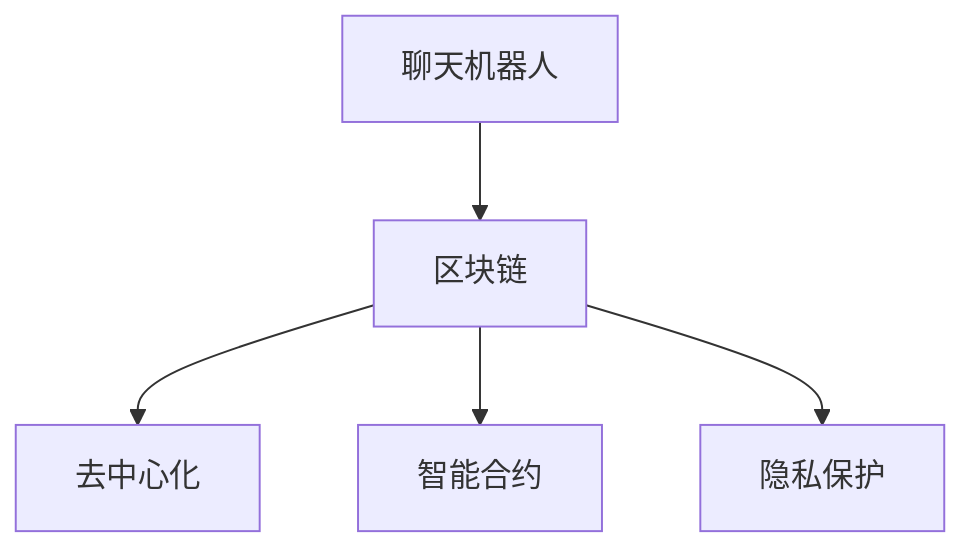
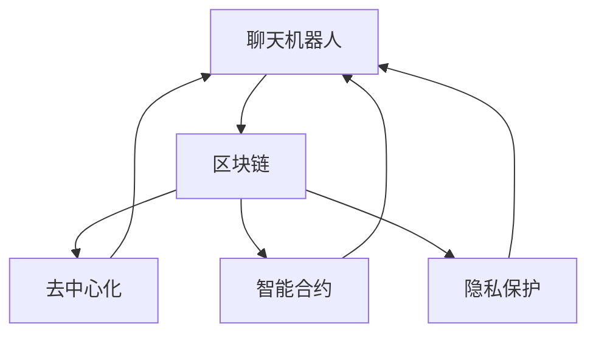

                 

## 1. 背景介绍

### 1.1 问题由来

随着互联网技术的发展，聊天机器人（Chatbots）作为智能客服、智能助手等应用形式，已经深入到人们日常生活的各个方面。然而，传统的聊天机器人依赖于中心化的服务器架构，数据存储和处理集中在单一的数据中心，存在安全隐患和隐私泄露的风险。区块链技术的出现，为去中心化的应用场景提供了新的解决方案。

区块链是一种分布式账本技术，通过共识机制保证数据的安全、透明和不可篡改。结合区块链的聊天机器人，可以实现去中心化的数据存储和交互，降低系统被攻击的风险，同时保护用户隐私。因此，本文将探讨聊天机器人与区块链技术的结合，提出一种基于区块链的聊天机器人架构，以提升其安全性和去中心化特性。

### 1.2 问题核心关键点

本文旨在介绍基于区块链的聊天机器人架构，涵盖以下核心概念：

- 聊天机器人：一种基于自然语言处理的智能应用，能够与用户进行自然对话，解决用户问题。
- 区块链：一种分布式账本技术，通过共识机制实现数据的安全、透明和不可篡改。
- 去中心化：一种分布式网络结构，数据和计算资源分散在网络节点中，避免了单点故障和信息泄露。
- 智能合约：一种自动执行的合约，通过代码实现合约条款，减少人工干预和提高执行效率。
- 隐私保护：一种保护用户隐私的技术手段，防止用户信息被未经授权的第三方获取。

这些概念之间的逻辑关系可以通过以下Mermaid流程图来展示：



## 2. 核心概念与联系

### 2.1 核心概念概述

为了更好地理解基于区块链的聊天机器人架构，本节将介绍几个密切相关的核心概念：

- **聊天机器人**：一种基于自然语言处理的智能应用，能够与用户进行自然对话，解决用户问题。常见的聊天机器人包括智能客服、虚拟助手、智能答疑系统等。
- **区块链**：一种分布式账本技术，通过共识机制实现数据的安全、透明和不可篡改。区块链的核心是分布式网络结构、共识算法和加密技术。
- **去中心化**：一种分布式网络结构，数据和计算资源分散在网络节点中，避免了单点故障和信息泄露。去中心化应用可以提供更高的安全性和抗攻击能力。
- **智能合约**：一种自动执行的合约，通过代码实现合约条款，减少人工干预和提高执行效率。智能合约是区块链技术的核心应用之一。
- **隐私保护**：一种保护用户隐私的技术手段，防止用户信息被未经授权的第三方获取。隐私保护技术包括数据加密、匿名化、差分隐私等。

这些核心概念之间的逻辑关系可以通过以下Mermaid流程图来展示：



这个流程图展示了大语言模型的核心概念及其之间的关系：

1. 聊天机器人通过区块链获取去中心化的分布式存储和处理能力，从而增强系统的安全性和抗攻击能力。
2. 聊天机器人通过智能合约实现自动执行的合约条款，减少人工干预和提高执行效率。
3. 聊天机器人通过隐私保护技术，保护用户隐私，防止信息泄露。

这些概念共同构成了基于区块链的聊天机器人架构，使其能够在各种场景下发挥智能客服和智能助手的功能。通过理解这些核心概念，我们可以更好地把握聊天机器人与区块链技术的融合路径。

### 2.2 核心算法原理

基于区块链的聊天机器人架构的核心算法原理包括区块链共识机制、智能合约自动执行和隐私保护技术。以下对这三个核心算法进行详细讲解。

**区块链共识机制**：区块链通过共识机制保证数据的安全、透明和不可篡改。常见的共识机制包括PoW、PoS、DPoS等。在聊天机器人中，通过共识机制确保聊天记录的安全存储和传输，防止数据篡改和信息泄露。

**智能合约自动执行**：智能合约通过代码实现合约条款，减少人工干预和提高执行效率。在聊天机器人中，智能合约可以自动执行用户指令，如查询数据、发送消息等，从而提高系统的响应速度和执行效率。

**隐私保护技术**：隐私保护技术包括数据加密、匿名化、差分隐私等。在聊天机器人中，隐私保护技术可以保护用户对话内容的私密性，防止第三方获取用户信息。

## 3. 核心算法原理 & 具体操作步骤

### 3.1 算法原理概述

基于区块链的聊天机器人架构通过区块链技术实现去中心化，通过智能合约技术实现自动执行，通过隐私保护技术保护用户隐私。具体实现步骤如下：

1. 构建去中心化的聊天机器人网络，通过区块链技术实现分布式存储和处理。
2. 设计智能合约，定义聊天机器人中的任务和用户指令，通过智能合约自动执行任务。
3. 采用隐私保护技术，保护用户对话内容的私密性，防止第三方获取用户信息。

### 3.2 算法步骤详解

以下是基于区块链的聊天机器人架构的具体实现步骤：

**Step 1: 构建去中心化的聊天机器人网络**

1. 设计分布式节点架构，每个节点保存部分聊天记录。
2. 使用区块链共识机制（如PoW、PoS），确保数据的一致性和不可篡改性。
3. 设计分布式共识协议，保证节点间的通信和数据同步。

**Step 2: 设计智能合约**

1. 定义聊天机器人中的任务和用户指令，如查询数据、发送消息等。
2. 编写智能合约代码，通过代码实现任务和指令的自动执行。
3. 部署智能合约到区块链网络，确保合约的可执行性和可验证性。

**Step 3: 采用隐私保护技术**

1. 对用户对话内容进行加密处理，防止第三方获取。
2. 采用匿名化技术，确保用户身份的私密性。
3. 设计差分隐私算法，减少对用户数据的具体信息的泄露。

### 3.3 算法优缺点

基于区块链的聊天机器人架构具有以下优点：

1. 高度安全性：去中心化的分布式存储和处理机制，避免了单点故障和信息泄露的风险。
2. 高效自动执行：通过智能合约技术，自动执行任务和用户指令，减少人工干预和提高执行效率。
3. 良好的隐私保护：通过隐私保护技术，保护用户对话内容的私密性，防止信息泄露。

同时，该架构也存在以下缺点：

1. 高延时：去中心化的分布式网络结构可能导致通信延迟较大。
2. 高成本：区块链的共识机制和智能合约的执行需要较高的计算和存储资源，成本较高。
3. 复杂性：系统的设计和实现较为复杂，需要跨学科的技术支持。

### 3.4 算法应用领域

基于区块链的聊天机器人架构可以在以下领域得到广泛应用：

1. **金融行业**：通过智能合约自动执行金融交易，确保交易的安全性和透明性。同时，采用隐私保护技术，保护用户交易信息。
2. **医疗行业**：通过智能合约自动执行医疗咨询和预约，确保医疗信息的私密性和安全性。采用隐私保护技术，保护患者隐私。
3. **供应链管理**：通过智能合约自动执行供应链中的任务和指令，确保供应链的透明性和可追溯性。采用隐私保护技术，保护参与方信息。
4. **智能城市**：通过智能合约自动执行城市管理任务，如交通控制、环境监测等。采用隐私保护技术，保护城市数据的安全性和隐私性。
5. **社交媒体**：通过智能合约自动执行用户操作和互动，确保用户数据的私密性和安全性。采用隐私保护技术，保护用户社交信息。

## 4. 数学模型和公式 & 详细讲解 & 举例说明

### 4.1 数学模型构建

本节将使用数学语言对基于区块链的聊天机器人架构进行更加严格的刻画。

假设聊天机器人网络中有 $N$ 个节点，每个节点保存 $T$ 条聊天记录。使用区块链共识机制 $C$ 确保数据的一致性和不可篡改性，使用智能合约 $M$ 自动执行任务和指令。

### 4.2 公式推导过程

以下是基于区块链的聊天机器人架构的数学模型推导：

1. 聊天记录的分布式存储模型：

$$
R = \{r_1, r_2, ..., r_N\}, r_i \in \{0, 1\}^T
$$

其中 $r_i$ 表示第 $i$ 个节点的聊天记录，每个节点保存 $T$ 条记录。

2. 区块链共识机制的数学模型：

$$
C = \{c_1, c_2, ..., c_N\}, c_i \in \{0, 1\}
$$

其中 $c_i$ 表示第 $i$ 个节点对聊天记录的共识结果。

3. 智能合约的数学模型：

$$
M = \{m_1, m_2, ..., m_N\}, m_i \in \{0, 1\}
$$

其中 $m_i$ 表示第 $i$ 个节点对任务和指令的执行结果。

### 4.3 案例分析与讲解

以金融行业为例，假设用户通过聊天机器人查询某股票的历史交易记录。具体步骤如下：

1. 用户发送查询请求，聊天机器人将请求发送到智能合约 $M$。
2. 智能合约 $M$ 接收请求，执行相应的查询任务，并生成查询结果。
3. 查询结果通过区块链共识机制 $C$ 验证，确保结果的正确性和一致性。
4. 查询结果发送到各个节点，并保存到分布式存储中。
5. 用户获取查询结果，对话结束。

在上述过程中，智能合约 $M$ 自动执行查询任务，减少了人工干预，提高了执行效率。区块链共识机制 $C$ 确保数据的一致性和不可篡改性，提高了系统的安全性。采用隐私保护技术，保护用户查询信息的私密性。

## 5. 项目实践：代码实例和详细解释说明

### 5.1 开发环境搭建

在进行基于区块链的聊天机器人项目实践前，我们需要准备好开发环境。以下是使用Python进行Hyperledger Fabric开发的开发环境配置流程：

1. 安装Docker：从官网下载并安装Docker，用于创建和管理容器环境。
2. 安装Hyperledger Fabric：从官网下载并安装Hyperledger Fabric，配置节点和通道。
3. 安装Node.js：从官网下载并安装Node.js，用于编写智能合约和通信代码。
4. 安装Hyperledger Composer：从官网下载并安装Hyperledger Composer，用于设计和部署智能合约。
5. 配置开发工具：如Visual Studio Code、Git等，用于开发和版本控制。

完成上述步骤后，即可在Hyperledger Fabric环境中开始项目实践。

### 5.2 源代码详细实现

下面以金融行业为例，给出使用Hyperledger Fabric进行智能合约设计和部署的Python代码实现。

**第一步：设计智能合约**

首先，定义智能合约的API接口和任务逻辑：

```python
# 定义智能合约接口
def queryHistoricalData(user, stock):
    # 执行查询任务，生成查询结果
    result = getHistoricalData(stock)
    # 将查询结果保存到分布式存储中
    saveDataToBlockchain(result)
    # 返回查询结果
    return result

# 执行查询任务
def getHistoricalData(stock):
    # 执行查询任务，获取查询结果
    # ...
    return result
```

然后，编写智能合约的代码：

```python
# 加载智能合约
contract = SmartContract.load('myContract')

# 调用查询接口
result = contract.queryHistoricalData('user', '股票')

# 打印查询结果
print(result)
```

**第二步：部署智能合约**

使用Hyperledger Composer编译和部署智能合约：

```python
# 编译智能合约
compiler = Composer.getCompiler()
artifacts = compiler.compile([contract])

# 打包智能合约
composerArchive = Composer.newArchive('myContract', artifacts)
Composer.registerArchive(composerArchive)

# 部署智能合约
Composer.registerSmartContract('myContract')
```

### 5.3 代码解读与分析

让我们再详细解读一下关键代码的实现细节：

**智能合约定义**：
- 定义了智能合约的API接口和任务逻辑，包括用户身份验证、数据查询、结果保存等。
- 采用函数封装的方式，将查询任务和结果保存等操作封装成独立的函数，提高了代码的可复用性和可维护性。

**智能合约实现**：
- 加载智能合约对象，调用API接口执行查询任务。
- 查询任务的具体实现通过调用预定义的函数 `getHistoricalData` 完成，该函数根据输入参数执行相应的数据查询操作。
- 查询结果保存到分布式存储中，采用Hyperledger Fabric的链码（Chaincode）实现。

**智能合约部署**：
- 使用Hyperledger Composer编译智能合约，生成Composer档案文件。
- 注册Composer档案文件，并将智能合约部署到Hyperledger Fabric网络中。
- 通过调用Composer API，自动创建和管理智能合约实例。

## 6. 实际应用场景

### 6.1 智能客服系统

基于区块链的聊天机器人架构可以应用于智能客服系统，通过分布式存储和处理机制，提高系统的安全性和抗攻击能力。具体而言，可以通过以下步骤实现：

1. 构建去中心化的聊天机器人网络，每个节点保存部分聊天记录。
2. 使用区块链共识机制，确保数据的一致性和不可篡改性。
3. 设计智能合约，自动执行用户指令，提高系统的响应速度和执行效率。
4. 采用隐私保护技术，保护用户对话内容的私密性，防止信息泄露。

通过上述步骤，可以构建一个高效、安全、隐私保护的智能客服系统，为用户提供优质的服务体验。

### 6.2 金融交易平台

金融行业对聊天机器人架构的需求尤为迫切。传统的金融交易平台依赖于中心化的服务器架构，存在安全隐患和隐私泄露的风险。基于区块链的聊天机器人架构可以通过以下步骤实现：

1. 构建去中心化的金融交易平台，每个节点保存部分交易记录。
2. 使用区块链共识机制，确保交易数据的一致性和不可篡改性。
3. 设计智能合约，自动执行金融交易，提高系统的执行效率和安全性。
4. 采用隐私保护技术，保护用户交易信息的私密性，防止信息泄露。

通过上述步骤，可以构建一个高效、安全、隐私保护的金融交易平台，提升用户体验和交易安全性。

### 6.3 医疗健康平台

医疗健康平台对聊天机器人架构的需求同样显著。传统的医疗平台依赖于中心化的服务器架构，存在安全隐患和隐私泄露的风险。基于区块链的聊天机器人架构可以通过以下步骤实现：

1. 构建去中心化的医疗健康平台，每个节点保存部分医疗记录。
2. 使用区块链共识机制，确保医疗数据的一致性和不可篡改性。
3. 设计智能合约，自动执行医疗咨询和预约，提高系统的执行效率和安全性。
4. 采用隐私保护技术，保护患者医疗信息的私密性，防止信息泄露。

通过上述步骤，可以构建一个高效、安全、隐私保护的医疗健康平台，提升医疗服务的智能化和安全性。

### 6.4 未来应用展望

随着区块链技术的不断发展，基于区块链的聊天机器人架构将在更多领域得到应用，为传统行业带来变革性影响。

在智慧城市领域，基于区块链的聊天机器人架构可以应用于城市管理、环境监测、交通控制等环节，提高城市管理的自动化和智能化水平，构建更安全、高效的城市治理体系。

在智能制造领域，基于区块链的聊天机器人架构可以应用于生产管理、供应链协同、设备维护等环节，提高制造业的智能化和协作效率，推动制造业的数字化转型。

在智能物流领域，基于区块链的聊天机器人架构可以应用于物流管理、仓储管理、配送调度等环节，提高物流效率和安全性，提升用户体验。

此外，在教育、旅游、零售、娱乐等多个领域，基于区块链的聊天机器人架构也将不断涌现，为各行各业带来新的变革。

## 7. 工具和资源推荐

### 7.1 学习资源推荐

为了帮助开发者系统掌握区块链聊天机器人架构的理论基础和实践技巧，这里推荐一些优质的学习资源：

1. 《Hyperledger Fabric官方文档》：官方文档提供了详细的Hyperledger Fabric技术文档和示例代码，是初学者快速上手的必备资料。

2. 《Blockchain Basics》课程：Coursera开设的区块链基础课程，讲解区块链技术的原理和应用，适合初学者入门。

3. 《Smart Contracts: Programming and Security in Blockchain》书籍：深入讲解智能合约的编程和安全性问题，是智能合约开发者的必读书籍。

4. 《Hyperledger Fabric实战》书籍：实际案例和代码实现，介绍了Hyperledger Fabric的架构设计和应用实践，适合中高级开发者。

5. GitHub上的开源项目：如Hyperledger Fabric、Blockchain Game等，提供了丰富的代码示例和实际应用场景，供开发者学习和借鉴。

通过对这些资源的学习实践，相信你一定能够快速掌握区块链聊天机器人架构的精髓，并用于解决实际的业务问题。

### 7.2 开发工具推荐

高效的开发离不开优秀的工具支持。以下是几款用于区块链聊天机器人开发的常用工具：

1. Hyperledger Fabric：Hyperledger Fabric是Hyperledger项目下的一款区块链框架，提供了智能合约和分布式账本的开发支持，是构建区块链聊天机器人架构的首选工具。

2. Composer IDE：Composer IDE是Hyperledger Composer的集成开发环境，提供了智能合约的可视化设计和编译功能，便于开发者进行代码开发和测试。

3. Node.js：Node.js是一款高效、轻量级的JavaScript运行环境，适合开发智能合约和区块链应用，是区块链开发的必备工具。

4. Visual Studio Code：Visual Studio Code是一款流行的代码编辑器，支持多种编程语言和插件扩展，适合区块链应用开发。

5. Docker：Docker是一款容器化管理工具，可以将区块链应用打包成容器，方便部署和管理，是区块链开发和测试的好帮手。

合理利用这些工具，可以显著提升区块链聊天机器人架构的开发效率，加快创新迭代的步伐。

### 7.3 相关论文推荐

区块链聊天机器人架构的研究始于学界的持续研究。以下是几篇奠基性的相关论文，推荐阅读：

1. 《Blockchain Technology and Its Applications》：探讨了区块链技术的原理和应用场景，为区块链聊天机器人架构提供了理论基础。

2. 《Smart Contract: Opportunities, Challenges and Directions》：深入分析了智能合约的编程和安全性问题，为智能合约的设计和实现提供了指导。

3. 《Blockchain Based Chatbot Architecture》：提出了一种基于区块链的聊天机器人架构，展示了区块链技术在智能客服中的应用前景。

4. 《Securing Chatbots with Blockchain Technology》：探讨了聊天机器人中的安全性和隐私保护问题，为区块链聊天机器人架构提供了参考。

这些论文代表了大语言模型微调技术的发展脉络。通过学习这些前沿成果，可以帮助研究者把握学科前进方向，激发更多的创新灵感。

## 8. 总结：未来发展趋势与挑战

### 8.1 研究成果总结

本文对基于区块链的聊天机器人架构进行了全面系统的介绍。首先阐述了区块链技术和聊天机器人架构的研究背景和意义，明确了区块链技术在提升聊天机器人安全性、去中心化特性方面的独特价值。其次，从原理到实践，详细讲解了区块链共识机制、智能合约自动执行和隐私保护技术的核心算法，给出了区块链聊天机器人架构的完整代码实例。同时，本文还广泛探讨了区块链聊天机器人架构在智能客服、金融交易、医疗健康等多个行业领域的应用前景，展示了区块链技术的广泛应用潜力。此外，本文精选了区块链聊天机器人架构的学习资源、开发工具和相关论文，力求为读者提供全方位的技术指引。

通过本文的系统梳理，可以看到，基于区块链的聊天机器人架构正在成为区块链应用的重要范式，极大地提升了聊天机器人的安全性和去中心化特性。受益于区块链技术的低成本、高可靠性和可扩展性，基于区块链的聊天机器人架构必将在更多行业得到应用，为传统行业带来新的变革。

### 8.2 未来发展趋势

展望未来，区块链聊天机器人架构将呈现以下几个发展趋势：

1. **去中心化程度更高**：未来区块链聊天机器人架构将进一步增强去中心化特性，通过分布式存储和处理机制，实现更加灵活、高效和可靠的应用。

2. **智能合约更灵活**：未来智能合约将更加灵活和可定制，支持更多的业务场景和应用需求。智能合约的执行效率和安全性也将进一步提升。

3. **隐私保护更完善**：未来隐私保护技术将更加完善，支持更多的隐私保护策略和隐私计算技术，确保用户对话内容的私密性和安全性。

4. **区块链网络更健壮**：未来区块链网络将更加健壮和可扩展，支持更多的节点和分布式应用，实现更高的安全性和鲁棒性。

5. **跨链技术更成熟**：未来跨链技术将更加成熟，实现不同区块链之间的互操作和数据共享，提升系统的可扩展性和互操作性。

6. **应用场景更广泛**：未来区块链聊天机器人架构将拓展到更多的应用场景，如智能合约、去中心化应用、数字身份验证等，为各行各业带来新的变革。

以上趋势凸显了区块链聊天机器人架构的广阔前景。这些方向的探索发展，必将进一步提升区块链聊天机器人架构的安全性和去中心化特性，为构建安全、可靠、可控的智能系统铺平道路。

### 8.3 面临的挑战

尽管区块链聊天机器人架构已经取得了瞩目成就，但在迈向更加智能化、普适化应用的过程中，它仍面临着诸多挑战：

1. **高成本**：区块链共识机制和智能合约的执行需要较高的计算和存储资源，成本较高。如何降低区块链应用的部署成本，是未来需要解决的重要问题。

2. **高延时**：去中心化的分布式网络结构可能导致通信延迟较大。如何优化网络架构，提高系统的响应速度和效率，是未来需要解决的关键问题。

3. **复杂性**：系统的设计和实现较为复杂，需要跨学科的技术支持。如何简化区块链应用的设计和实现，降低开发门槛，是未来需要解决的重要问题。

4. **隐私保护难度大**：隐私保护技术虽然可以保护用户对话内容的私密性，但难以完全消除用户数据泄露的风险。如何进一步提升隐私保护水平，是未来需要解决的重要问题。

5. **跨链互操作性差**：不同的区块链系统之间互操作性较差，难以实现数据的共享和协同。如何实现跨链互操作，是未来需要解决的重要问题。

6. **安全性问题**：区块链聊天机器人架构虽然具备较高的安全性，但仍然存在一定的安全隐患。如何进一步提升系统的安全性，是未来需要解决的重要问题。

### 8.4 研究展望

面对区块链聊天机器人架构所面临的挑战，未来的研究需要在以下几个方面寻求新的突破：

1. **优化共识机制**：设计更加高效、低成本的共识机制，降低区块链应用的部署成本。

2. **提高智能合约执行效率**：优化智能合约的代码实现，提高执行效率和安全性。

3. **增强隐私保护能力**：引入更多的隐私保护技术，如差分隐私、同态加密等，确保用户数据的安全性和隐私性。

4. **简化区块链应用设计**：引入模块化和组件化的设计思想，简化区块链应用的设计和实现，降低开发门槛。

5. **实现跨链互操作**：引入跨链技术，实现不同区块链系统之间的互操作和数据共享。

6. **增强系统安全性**：引入安全防护机制，如访问控制、数据脱敏等，增强系统的安全性。

这些研究方向的探索，必将引领区块链聊天机器人架构迈向更高的台阶，为构建安全、可靠、可控的智能系统铺平道路。面向未来，区块链聊天机器人架构还需要与其他人工智能技术进行更深入的融合，如自然语言处理、计算机视觉等，多路径协同发力，共同推动人工智能技术的发展。

## 9. 附录：常见问题与解答

**Q1：区块链聊天机器人架构的优势是什么？**

A: 区块链聊天机器人架构具有以下优势：

1. 高度安全性：去中心化的分布式存储和处理机制，避免了单点故障和信息泄露的风险。
2. 高效自动执行：通过智能合约技术，自动执行任务和指令，减少人工干预和提高执行效率。
3. 良好的隐私保护：通过隐私保护技术，保护用户对话内容的私密性，防止信息泄露。

**Q2：区块链聊天机器人架构在实际应用中需要注意哪些问题？**

A: 区块链聊天机器人架构在实际应用中需要注意以下问题：

1. 高成本：区块链共识机制和智能合约的执行需要较高的计算和存储资源，成本较高。
2. 高延时：去中心化的分布式网络结构可能导致通信延迟较大。
3. 复杂性：系统的设计和实现较为复杂，需要跨学科的技术支持。
4. 隐私保护难度大：隐私保护技术虽然可以保护用户对话内容的私密性，但难以完全消除用户数据泄露的风险。
5. 跨链互操作性差：不同的区块链系统之间互操作性较差，难以实现数据的共享和协同。
6. 安全性问题：区块链聊天机器人架构虽然具备较高的安全性，但仍然存在一定的安全隐患。

**Q3：如何提高区块链聊天机器人架构的执行效率？**

A: 提高区块链聊天机器人架构的执行效率可以从以下几个方面入手：

1. 优化智能合约的代码实现，减少代码复杂度和资源消耗。
2. 引入缓存机制，减少重复计算和数据传输。
3. 优化共识机制，提高数据一致性和通信效率。
4. 引入负载均衡和分布式计算，提高系统的并发处理能力。

**Q4：区块链聊天机器人架构有哪些应用场景？**

A: 区块链聊天机器人架构可以在以下领域得到广泛应用：

1. 金融行业：通过智能合约自动执行金融交易，确保交易的安全性和透明性。同时，采用隐私保护技术，保护用户交易信息。
2. 医疗行业：通过智能合约自动执行医疗咨询和预约，确保医疗信息的私密性和安全性。采用隐私保护技术，保护患者隐私。
3. 供应链管理：通过智能合约自动执行供应链中的任务和指令，确保供应链的透明性和可追溯性。采用隐私保护技术，保护参与方信息。
4. 智能城市：通过智能合约自动执行城市管理任务，如交通控制、环境监测等。采用隐私保护技术，保护城市数据的安全性和隐私性。
5. 社交媒体：通过智能合约自动执行用户操作和互动，确保用户数据的私密性和安全性。采用隐私保护技术，保护用户社交信息。

通过上述步骤，可以构建一个高效、安全、隐私保护的智能客服系统，为用户提供优质的服务体验。

**Q5：区块链聊天机器人架构的隐私保护技术有哪些？**

A: 区块链聊天机器人架构的隐私保护技术包括：

1. 数据加密：对用户对话内容进行加密处理，防止第三方获取。
2. 匿名化：确保用户身份的私密性，防止用户信息被追踪和识别。
3. 差分隐私：减少对用户数据的具体信息的泄露，保护用户隐私。

这些隐私保护技术可以结合使用，进一步提升区块链聊天机器人架构的隐私保护能力。

作者：禅与计算机程序设计艺术 / Zen and the Art of Computer Programming

