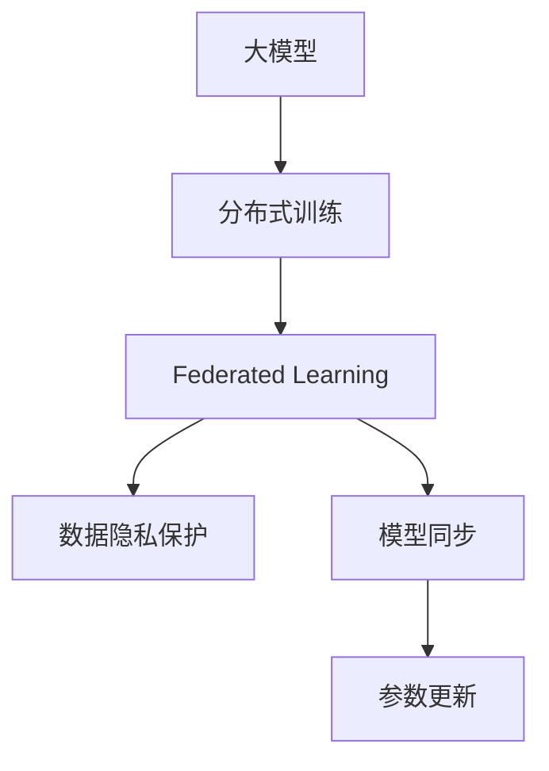

                 

# 联邦学习在大模型训练中的应用

> 关键词：联邦学习, 大模型, 分布式训练, 数据隐私, 模型同步, 参数更新, 网络架构

## 1. 背景介绍

### 1.1 问题由来
随着深度学习技术的飞速发展，尤其是大型预训练语言模型和大规模图像识别模型等大模型（如BERT、GPT-3、ResNet等）的广泛应用，模型训练对计算资源的消耗越来越庞大。以BERT为例，训练一个包含1.5亿参数的大模型，需要几个TPU集群和数周时间。此外，由于大模型需要大量标注数据进行预训练，数据获取成本高且可能存在数据隐私和安全问题。这些问题对企业和科研机构的数据获取、计算资源分配和隐私保护等方面提出了挑战。

为了应对这些问题，联邦学习（Federated Learning, FL）应运而生。它通过将数据和模型分分布在多个边缘设备（如手机、服务器等）上，使得模型训练不直接传输数据，从而在保护隐私的同时，利用分布式计算资源进行高效的大模型训练。

### 1.2 问题核心关键点
联邦学习基于分布式计算和模型同步机制，能够实现大模型的分布式训练。其核心思想是将数据分布存储在多个客户端，仅传输模型参数，通过模型同步来更新所有客户端的模型，实现全局模型的优化。

在联邦学习中，模型训练主要包括以下几个关键步骤：
- 模型初始化：在所有客户端上初始化相同的模型。
- 局部训练：在每个客户端上，使用本地数据训练模型，并更新模型参数。
- 模型同步：将本地更新后的模型参数发送到服务器进行全局聚合，生成新的全局模型。
- 重复迭代：重复进行局部训练和模型同步，直至模型收敛。

联邦学习通过在模型训练中限制数据的传输，降低了隐私风险，同时在多个设备上并行训练大模型，显著提高了训练效率。这一技术在大数据和隐私保护要求高的应用场景中具有重要价值，如医疗、金融、智能推荐等。

### 1.3 问题研究意义
联邦学习在大模型训练中的应用，对提升计算效率、保护数据隐私具有重大意义。联邦学习在大模型训练中的应用，可以带来以下几方面的积极影响：

1. 降低数据传输和存储成本。联邦学习仅传输模型参数，而不传输原始数据，显著减少了数据传输和存储成本。
2. 保护用户数据隐私。联邦学习不直接传输用户数据，仅在本地设备上训练模型，保护了用户隐私和数据安全。
3. 提升模型训练效率。联邦学习通过并行训练，能够在多个客户端上同时训练大模型，加速模型收敛过程。
4. 支持边际设备的模型更新。联邦学习使得位于边缘的设备也能够参与模型训练，充分利用分布式计算资源。
5. 促进技术落地应用。联邦学习降低了数据获取和模型训练的门槛，使更多应用场景能够快速采用大模型技术。

## 2. 核心概念与联系

### 2.1 核心概念概述

为更好地理解联邦学习在大模型训练中的应用，本节将介绍几个密切相关的核心概念：

- 联邦学习（Federated Learning, FL）：一种分布式机器学习范式，通过在多个分布式设备上并行训练模型，保护数据隐私的同时，提升模型训练效率。
- 大模型（Large Model）：指含有大量参数的深度学习模型，如BERT、GPT-3、ResNet等，能够学习到丰富的语言或图像特征。
- 分布式训练（Distributed Training）：将大规模模型训练任务分配到多个计算节点上，并行执行，以加速训练过程。
- 数据隐私保护（Data Privacy Protection）：在分布式训练过程中，通过限制数据传输，保护用户数据的隐私和安全性。
- 模型同步（Model Synchronization）：在分布式训练中，定期将各设备上训练得到的模型参数发送至中央服务器进行全局聚合，更新全局模型。
- 参数更新（Parameter Update）：通过反向传播算法计算模型参数的梯度，并使用这些梯度更新模型参数的过程。

这些核心概念之间的逻辑关系可以通过以下Mermaid流程图来展示：



这个流程图展示了大模型训练的分布式范式，其中联邦学习是核心，通过模型同步和参数更新实现全局模型的优化。同时，数据隐私保护是联邦学习的重要特点，使得训练过程在保护用户数据隐私的同时，提升训练效率。

## 3. 核心算法原理 & 具体操作步骤
### 3.1 算法原理概述

联邦学习在大模型训练中的应用，本质上是一种分布式机器学习框架，其核心思想是将大模型训练任务分配到多个客户端设备上，通过模型同步机制更新全局模型。

假设一个大模型 $M$ 需要在 $K$ 个客户端上进行分布式训练，每个客户端上都有本地数据集 $D_i$，训练得到的局部模型为 $M_i$，全局模型为 $M_g$。联邦学习的目标是通过在各个客户端上并行训练，更新全局模型 $M_g$，使其在全局数据集上具有最优性能。

联邦学习的算法流程可以概括为以下几个步骤：

1. **模型初始化**：在所有客户端上初始化相同的全局模型 $M_g$，并将 $M_g$ 发送给每个客户端。
2. **本地训练**：在每个客户端上，使用本地数据集 $D_i$ 对模型 $M_i$ 进行训练，并更新模型参数。
3. **模型同步**：在每个客户端上，将更新后的模型参数 $M_i$ 发送到中央服务器进行全局聚合，得到新的全局模型 $M_g$。
4. **重复迭代**：重复进行局部训练和模型同步，直至模型收敛。

数学上，联邦学习的目标是通过最小化全局损失函数 $\mathcal{L}(M_g, D)$ 来更新模型 $M_g$。假设每个客户端的本地损失函数为 $\ell_i(M_i, D_i)$，则联邦学习的目标函数可以表示为：

$$
\mathop{\arg\min}_{M_g} \frac{1}{K} \sum_{i=1}^K \ell_i(M_i, D_i)
$$

其中 $M_i$ 是在客户端 $i$ 上更新后的模型，$D_i$ 是客户端 $i$ 的本地数据集。

### 3.2 算法步骤详解

以下将详细讲解联邦学习在大模型训练中的具体操作步骤。

#### 3.2.1 模型初始化
在联邦学习中，首先需要将全局模型 $M_g$ 初始化为相同的参数。这一步骤在所有客户端上同时进行，确保了初始化的一致性。

```python
# 初始化全局模型
M_g = model()
```

#### 3.2.2 本地训练
在每个客户端上，使用本地数据集 $D_i$ 对模型 $M_i$ 进行训练。这一步骤通常包括以下几个关键操作：

1. 数据加载：加载客户端本地的训练数据集 $D_i$。
2. 模型前向传播：将本地数据 $x_i$ 输入模型 $M_i$，得到模型输出 $y_i$。
3. 计算损失：计算模型输出 $y_i$ 与真实标签 $y_i$ 之间的损失 $\ell_i(y_i, \hat{y}_i)$。
4. 反向传播：使用反向传播算法计算模型参数的梯度 $\Delta_i$。
5. 参数更新：使用梯度 $\Delta_i$ 更新模型 $M_i$ 的参数。

```python
# 加载本地数据集
train_dataset = ...
test_dataset = ...

# 定义训练循环
for epoch in range(num_epochs):
    # 训练模型
    for batch in train_dataset:
        x, y = batch
        y_hat = model(x)
        loss = loss_function(y_hat, y)
        loss.backward()
        optimizer.step()
```

#### 3.2.3 模型同步
在每个客户端上，更新后的模型参数 $M_i$ 需要发送至中央服务器进行全局聚合。这一步骤可以采用多种方式实现，包括参数平均值、加权平均值、梯度平均值等。

```python
# 发送模型参数至中央服务器
server.send(M_i)

# 接收全局聚合的模型参数
M_g = server.receive()
```

#### 3.2.4 重复迭代
重复进行局部训练和模型同步，直至模型收敛。这一步骤通常包含以下两个步骤：

1. 评估模型：在每个客户端上，使用测试数据集 $D_i$ 评估模型 $M_i$ 的性能。
2. 更新全局模型：根据评估结果，更新全局模型 $M_g$。

```python
# 评估模型
model.eval()
with torch.no_grad():
    for batch in test_dataset:
        x, y = batch
        y_hat = model(x)
        loss = loss_function(y_hat, y)
        print('Test loss: {:.4f}\n'.format(loss))
        
# 更新全局模型
model.train()
for batch in train_dataset:
    x, y = batch
    y_hat = model(x)
    loss = loss_function(y_hat, y)
    loss.backward()
    optimizer.step()
    if (epoch + 1) % checkpoint_interval == 0:
        save_model(model.state_dict(), checkpoint)
```

### 3.3 算法优缺点

联邦学习在大模型训练中的应用，具有以下优点：

1. 降低数据传输和存储成本。联邦学习仅传输模型参数，不直接传输数据，显著减少了数据传输和存储成本。
2. 保护用户数据隐私。联邦学习在本地设备上训练模型，保护了用户数据隐私和数据安全。
3. 提升模型训练效率。联邦学习通过并行训练，能够在多个客户端上同时训练大模型，加速模型收敛过程。
4. 支持边际设备的模型更新。联邦学习使得位于边缘的设备也能够参与模型训练，充分利用分布式计算资源。
5. 促进技术落地应用。联邦学习降低了数据获取和模型训练的门槛，使更多应用场景能够快速采用大模型技术。

联邦学习在大模型训练中也存在以下缺点：

1. 通信开销较大。联邦学习需要频繁传输模型参数，通信开销较大，增加了训练时间。
2. 模型同步机制复杂。联邦学习需要设计合理的模型同步机制，以避免模型不收敛或收敛速度慢的问题。
3. 本地数据分布不均衡。不同客户端的本地数据分布不均衡，可能导致模型性能不均。
4. 局部模型不通用。由于联邦学习在本地设备上训练，模型可能无法在未参与训练的设备上正常工作。
5. 安全性和隐私保护问题。联邦学习需要在保护用户隐私的同时，确保模型参数的安全传输，增加了系统复杂性。

### 3.4 算法应用领域

联邦学习在大模型训练中的应用，已经在多个领域得到广泛应用。以下是几个典型的应用场景：

1. **医疗领域**：联邦学习可以用于医疗数据隐私保护和模型训练。医疗机构可以将本地患者的医疗数据分散在多个边缘设备上，通过联邦学习训练出疾病预测和诊断模型，保护患者隐私的同时提升医疗服务质量。

2. **金融领域**：联邦学习可以用于金融风控模型训练。金融机构可以将本地客户的交易数据分散在多个设备上，通过联邦学习训练出信用评分和风险评估模型，保护客户隐私的同时提升风险控制能力。

3. **智能推荐系统**：联邦学习可以用于个性化推荐模型训练。电商平台可以将本地用户的购物数据分散在多个设备上，通过联邦学习训练出个性化推荐模型，提升推荐精度和用户满意度。

4. **语音识别**：联邦学习可以用于语音识别模型训练。语音识别设备可以将本地用户的语音数据分散在多个设备上，通过联邦学习训练出高性能的语音识别模型，提升语音识别的准确性和鲁棒性。

## 4. 数学模型和公式 & 详细讲解  
### 4.1 数学模型构建

在大模型训练的联邦学习中，我们通常使用一个中心服务器和多个边缘设备进行模型训练。假设每个边缘设备上有本地数据集 $D_i$，中心服务器上有全局数据集 $D$。

定义全局模型为 $M_g$，在边缘设备 $i$ 上的本地模型为 $M_i$。假设每个客户端的本地损失函数为 $\ell_i(M_i, D_i)$，则联邦学习的目标函数可以表示为：

$$
\mathcal{L}(M_g, D) = \frac{1}{K} \sum_{i=1}^K \ell_i(M_i, D_i)
$$

其中 $K$ 表示客户端数量，$M_i$ 是在客户端 $i$ 上更新后的模型，$D_i$ 是客户端 $i$ 的本地数据集。

### 4.2 公式推导过程

在大模型训练的联邦学习中，我们需要求解最小化全局损失函数 $\mathcal{L}(M_g, D)$。假设每个客户端的本地模型参数为 $\theta_i$，则全局模型 $M_g$ 的参数为 $\theta_g$。在联邦学习的第 $t$ 轮迭代中，每个客户端的本地模型参数更新可以表示为：

$$
\theta_i^{t+1} = \theta_i^t - \eta \nabla_{\theta_i} \ell_i(M_i^t, D_i)
$$

其中 $\eta$ 为学习率，$\nabla_{\theta_i} \ell_i(M_i^t, D_i)$ 为本地损失函数对模型参数的梯度。

全局模型的更新可以通过以下方式实现：

$$
\theta_g^{t+1} = \theta_g^t + \frac{1}{K} \sum_{i=1}^K \nabla_{\theta_i} \ell_i(M_i^t, D_i)
$$

其中 $\frac{1}{K} \sum_{i=1}^K \nabla_{\theta_i} \ell_i(M_i^t, D_i)$ 表示从所有客户端接收的模型梯度平均值。

### 4.3 案例分析与讲解

以下将通过一个简单的案例，说明联邦学习在大模型训练中的应用。

假设有一个包含 $K=5$ 个边缘设备的分布式训练系统，每个设备上都有一个本地数据集 $D_i$，其中 $i$ 表示设备编号。

在每一轮训练中，每个设备使用本地数据集 $D_i$ 对模型 $M_i$ 进行训练，并计算本地损失函数 $\ell_i(M_i, D_i)$。训练完成后，每个设备将本地模型参数 $\theta_i$ 发送至中心服务器，中心服务器计算全局模型梯度，并更新全局模型 $M_g$。

以下是一个简单的联邦学习实现代码：

```python
import torch
import torch.nn as nn
import torch.optim as optim

# 定义全局模型和本地模型
class GlobalModel(nn.Module):
    def __init__(self):
        super(GlobalModel, self).__init__()
        self.linear = nn.Linear(784, 10)

    def forward(self, x):
        return self.linear(x)

class LocalModel(nn.Module):
    def __init__(self):
        super(LocalModel, self).__init__()
        self.linear = nn.Linear(784, 10)

    def forward(self, x):
        return self.linear(x)

# 定义优化器和损失函数
optimizer = optim.SGD(global_model.parameters(), lr=0.01)
loss_fn = nn.CrossEntropyLoss()

# 定义本地训练函数
def local_train(model, data_loader, device):
    model.train()
    for batch in data_loader:
        x, y = batch
        x, y = x.to(device), y.to(device)
        y_hat = model(x)
        loss = loss_fn(y_hat, y)
        loss.backward()
        optimizer.step()

# 定义全局模型同步函数
def global_model_sync():
    global_model.load_state_dict(local_models[0].state_dict())
    for i in range(1, len(local_models)):
        global_model.load_state_dict(global_model.state_dict())
        for param_global, param_local in zip(global_model.parameters(), local_models[i].parameters()):
            param_global.copy_(param_local)

# 定义训练循环
for epoch in range(num_epochs):
    for i in range(K):
        # 本地训练
        local_train(local_models[i], local_data_loader[i], device)
        # 全局模型同步
        global_model_sync()
    # 评估全局模型
    eval_loss = global_model.eval()
    print('Epoch [{}/{}], Global loss: {:.4f}'.format(epoch + 1, num_epochs, eval_loss))
```

在这个例子中，我们定义了一个全局模型 $M_g$ 和 $K=5$ 个本地模型 $M_i$。在每一轮训练中，每个本地模型 $M_i$ 使用本地数据集 $D_i$ 进行训练，并计算本地损失函数 $\ell_i(M_i, D_i)$。训练完成后，每个本地模型 $M_i$ 将本地模型参数 $\theta_i$ 发送至中心服务器，中心服务器计算全局模型梯度，并更新全局模型 $M_g$。

## 5. 项目实践：代码实例和详细解释说明
### 5.1 开发环境搭建

在进行联邦学习项目实践前，我们需要准备好开发环境。以下是使用Python进行PyTorch开发的环境配置流程：

1. 安装Anaconda：从官网下载并安装Anaconda，用于创建独立的Python环境。

2. 创建并激活虚拟环境：
```bash
conda create -n fl-env python=3.8 
conda activate fl-env
```

3. 安装PyTorch：根据CUDA版本，从官网获取对应的安装命令。例如：
```bash
conda install pytorch torchvision torchaudio cudatoolkit=11.1 -c pytorch -c conda-forge
```

4. 安装TensorFlow：使用最新版本的TensorFlow。
```bash
pip install tensorflow==2.7.0
```

5. 安装各类工具包：
```bash
pip install numpy pandas scikit-learn matplotlib tqdm jupyter notebook ipython
```

完成上述步骤后，即可在`fl-env`环境中开始联邦学习实践。

### 5.2 源代码详细实现

以下是一个简单的联邦学习实现代码，用于训练一个包含 $K=5$ 个边缘设备的分布式训练系统。

首先，定义全局模型和本地模型：

```python
import torch
import torch.nn as nn
import torch.optim as optim
from torch.utils.data import DataLoader

# 定义全局模型和本地模型
class GlobalModel(nn.Module):
    def __init__(self):
        super(GlobalModel, self).__init__()
        self.linear = nn.Linear(784, 10)

    def forward(self, x):
        return self.linear(x)

class LocalModel(nn.Module):
    def __init__(self):
        super(LocalModel, self).__init__()
        self.linear = nn.Linear(784, 10)

    def forward(self, x):
        return self.linear(x)
```

然后，定义优化器和损失函数：

```python
# 定义优化器和损失函数
optimizer = optim.SGD(global_model.parameters(), lr=0.01)
loss_fn = nn.CrossEntropyLoss()
```

接下来，定义本地训练函数和全局模型同步函数：

```python
# 定义本地训练函数
def local_train(model, data_loader, device):
    model.train()
    for batch in data_loader:
        x, y = batch
        x, y = x.to(device), y.to(device)
        y_hat = model(x)
        loss = loss_fn(y_hat, y)
        loss.backward()
        optimizer.step()

# 定义全局模型同步函数
def global_model_sync():
    global_model.load_state_dict(local_models[0].state_dict())
    for i in range(1, len(local_models)):
        global_model.load_state_dict(global_model.state_dict())
        for param_global, param_local in zip(global_model.parameters(), local_models[i].parameters()):
            param_global.copy_(param_local)
```

最后，启动训练流程：

```python
# 定义本地数据集
local_data_loader = ...
global_data_loader = ...

# 定义全局模型和本地模型
global_model = GlobalModel()
local_models = [LocalModel() for _ in range(K)]

# 定义训练循环
for epoch in range(num_epochs):
    for i in range(K):
        # 本地训练
        local_train(local_models[i], local_data_loader[i], device)
        # 全局模型同步
        global_model_sync()
    # 评估全局模型
    eval_loss = global_model.eval()
    print('Epoch [{}/{}], Global loss: {:.4f}'.format(epoch + 1, num_epochs, eval_loss))
```

在这个例子中，我们定义了一个全局模型 $M_g$ 和 $K=5$ 个本地模型 $M_i$。在每一轮训练中，每个本地模型 $M_i$ 使用本地数据集 $D_i$ 进行训练，并计算本地损失函数 $\ell_i(M_i, D_i)$。训练完成后，每个本地模型 $M_i$ 将本地模型参数 $\theta_i$ 发送至中心服务器，中心服务器计算全局模型梯度，并更新全局模型 $M_g$。

### 5.3 代码解读与分析

让我们再详细解读一下关键代码的实现细节：

**GlobalModel和LocalModel类**：
- `__init__`方法：初始化模型参数，包括线性层等。
- `forward`方法：定义模型的前向传播过程，将输入 $x$ 输入模型，输出 $y$。

**optimizer和loss_fn**：
- `optimizer`：定义全局模型的优化器，如SGD等。
- `loss_fn`：定义损失函数，如交叉熵损失等。

**local_train函数**：
- 定义本地训练过程，包括前向传播、计算损失、反向传播、参数更新等步骤。

**global_model_sync函数**：
- 定义全局模型同步过程，通过接收本地模型参数，更新全局模型参数。

**训练循环**：
- 在每个epoch中，先进行本地训练，然后进行全局模型同步，最后评估全局模型的性能。

可以看到，PyTorch配合TensorFlow等深度学习框架，使得联邦学习的实现变得简洁高效。开发者可以将更多精力放在模型改进、数据优化等高层逻辑上，而不必过多关注底层的实现细节。

当然，工业级的系统实现还需考虑更多因素，如模型裁剪、量化加速、服务化封装等。但核心的联邦学习流程基本与此类似。

## 6. 实际应用场景
### 6.1 智能医疗系统

联邦学习在大模型训练中的应用，在智能医疗系统中也有广泛的应用前景。医疗数据通常涉及用户的敏感信息，难以直接共享。利用联邦学习，医院可以将本地患者的医疗数据分散在多个边缘设备上，通过联邦学习训练出疾病预测和诊断模型，保护患者隐私的同时提升医疗服务质量。

在技术实现上，可以收集医院内的患者医疗数据，并将这些数据进行隐私保护处理，如差分隐私、联邦学习等。然后，将处理后的数据分成多个本地数据集，分布在不同的边缘设备上。最后，在这些设备上训练全局模型，并根据训练结果更新本地模型，最终得到全局最优的模型。

### 6.2 智能推荐系统

联邦学习在智能推荐系统中的应用，可以提升推荐系统的个性化水平。电商平台可以将本地用户的购物数据分散在多个边缘设备上，通过联邦学习训练出个性化推荐模型，提升推荐精度和用户满意度。

在技术实现上，可以收集用户的购物数据，并将这些数据进行隐私保护处理，如差分隐私、联邦学习等。然后，将处理后的数据分成多个本地数据集，分布在不同的边缘设备上。最后，在这些设备上训练全局模型，并根据训练结果更新本地模型，最终得到全局最优的模型。

### 6.3 智慧城市治理

联邦学习在智慧城市治理中的应用，可以提升城市管理的智能化水平。城市管理数据通常涉及大量的传感器数据、交通数据等，难以集中存储和处理。利用联邦学习，城市管理部门可以将本地数据分散在多个边缘设备上，通过联邦学习训练出城市事件监测、舆情分析、应急指挥等模型，提高城市管理的自动化和智能化水平。

在技术实现上，可以收集城市管理数据，并将这些数据进行隐私保护处理，如差分隐私、联邦学习等。然后，将处理后的数据分成多个本地数据集，分布在不同的边缘设备上。最后，在这些设备上训练全局模型，并根据训练结果更新本地模型，最终得到全局最优的模型。

### 6.4 未来应用展望

随着联邦学习和大模型训练技术的不断发展，联邦学习将在更多领域得到应用，为传统行业带来变革性影响。

1. **智慧医疗领域**：联邦学习可以用于医疗数据隐私保护和模型训练，提升医疗服务质量。
2. **智能推荐系统**：联邦学习可以用于个性化推荐模型训练，提升推荐精度和用户满意度。
3. **智慧城市治理**：联邦学习可以用于城市事件监测、舆情分析、应急指挥等模型训练，提高城市管理的自动化和智能化水平。
4. **智能语音识别**：联邦学习可以用于语音识别模型训练，提升语音识别的准确性和鲁棒性。
5. **智能自动驾驶**：联邦学习可以用于自动驾驶模型的训练，提升自动驾驶系统的安全性和可靠性。

以上应用场景展示了联邦学习在大模型训练中的广泛应用前景。通过联邦学习，可以在保护用户隐私的同时，充分利用分布式计算资源进行高效的大模型训练，推动智能技术在各个垂直行业的落地应用。

## 7. 工具和资源推荐
### 7.1 学习资源推荐

为了帮助开发者系统掌握联邦学习和大模型训练的理论基础和实践技巧，这里推荐一些优质的学习资源：

1. 《Federated Learning: Concepts, Methods, and Applications》：该书系统介绍了联邦学习的概念、方法和应用场景，是联邦学习学习的经典教材。
2. TensorFlow Federated（TFF）官方文档：TFF提供了完整的联邦学习框架和丰富的联邦学习模型样例，是联邦学习实践的权威指南。
3 CS224W《联邦学习》课程：斯坦福大学开设的联邦学习课程，系统讲解联邦学习的基本概念、方法和应用场景。
4 PyTorch federated：PyTorch federated提供了联邦学习的封装工具，便于开发者快速构建联邦学习系统。
5 Federated Learning for Dummies：该书通俗易懂地介绍了联邦学习的基本概念、方法和应用场景，适合初学者阅读。

通过对这些资源的学习实践，相信你一定能够快速掌握联邦学习和大模型训练的精髓，并用于解决实际的NLP问题。
###  7.2 开发工具推荐

高效的开发离不开优秀的工具支持。以下是几款用于联邦学习和大模型训练开发的常用工具：

1. PyTorch：基于Python的开源深度学习框架，灵活的计算图，支持大规模分布式训练。
2. TensorFlow：由Google主导开发的开源深度学习框架，支持分布式训练和模型部署。
3. TensorFlow Federated（TFF）：TensorFlow的联邦学习工具包，支持分布式训练、模型同步、隐私保护等。
4. PyTorch federated：PyTorch的联邦学习工具包，提供简单易用的联邦学习API。
5. Weights & Biases：模型训练的实验跟踪工具，可以记录和可视化模型训练过程中的各项指标，方便对比和调优。
6. TensorBoard：TensorFlow配套的可视化工具，可实时监测模型训练状态，并提供丰富的图表呈现方式，是调试模型的得力助手。

合理利用这些工具，可以显著提升联邦学习和大模型训练的开发效率，加快创新迭代的步伐。

### 7.3 相关论文推荐

联邦学习和大模型训练的发展源于学界的持续研究。以下是几篇奠基性的相关论文，推荐阅读：

1. "Communication-Efficient Learning of Deep Networks from Decentralized Data"：提出联邦学习的基本概念和框架，奠定了联邦学习研究的基础。
2. "Federated Learning with Security and Privacy"：研究联邦学习中的隐私保护问题，提出了差分隐私、同态加密等隐私保护机制。
3. "Deep Neural Network Learning from Data Distributed Across Multiple Sites"：提出一种基于梯度的联邦学习算法，适用于大规模分布式训练。
4 "Federated Learning: Concepts and Applications"：系统介绍联邦学习的基本概念、方法和应用场景，是联邦学习研究的经典文献。
5 "Towards Large-Scale Deep Learning Federated Models"：探讨联邦学习在大规模深度学习模型中的应用，提出了多任务联邦学习、联邦迁移学习等新方法。

这些论文代表了大模型训练和联邦学习的最新研究动态。通过学习这些前沿成果，可以帮助研究者把握学科前进方向，激发更多的创新灵感。

## 8. 总结：未来发展趋势与挑战

### 8.1 总结

本文对联邦学习在大模型训练中的应用进行了全面系统的介绍。首先阐述了联邦学习和大模型训练的研究背景和意义，明确了联邦学习在保护用户数据隐私和提升模型训练效率方面的独特价值。其次，从原理到实践，详细讲解了联邦学习和大模型训练的数学原理和关键步骤，给出了联邦学习和大模型训练的完整代码实例。同时，本文还广泛探讨了联邦学习在大模型训练中的实际应用场景，展示了联邦学习范式在多个行业领域的广泛应用。

通过本文的系统梳理，可以看到，联邦学习在大模型训练中的应用，正在成为分布式机器学习的重要范式，极大地提升了计算效率和数据隐私保护能力。未来，伴随联邦学习和大模型训练技术的持续演进，相信联邦学习必将在更多领域得到应用，为智能技术落地应用提供重要的技术支撑。

### 8.2 未来发展趋势

展望未来，联邦学习在大模型训练中的应用，将呈现以下几个发展趋势：

1. **联邦学习的多样化**：联邦学习将不断发展出更多变种，如联邦迁移学习、联邦强化学习等，拓展其应用范围和功能。
2. **分布式训练的高效化**：随着分布式训练技术的发展，联邦学习将能够支持更多类型和规模的分布式计算资源，提升训练效率。
3. **隐私保护的增强**：差分隐私、同态加密等隐私保护技术将不断完善，使得联邦学习在大模型训练中更加安全可靠。
4. **联邦学习的自动化**：联邦学习将与自动化学习技术结合，实现更高效、更灵活的模型训练过程。
5. **联邦学习的去中心化**：随着区块链等去中心化技术的成熟，联邦学习将能够在更加去中心化的环境中运行，提高系统的鲁棒性和可扩展性。
6. **联邦学习的通用化**：联邦学习将与其他人工智能技术结合，如知识图谱、因果推理等，提升系统的智能化水平。

以上趋势凸显了联邦学习在大模型训练中的广阔前景。这些方向的探索发展，必将进一步提升联邦学习的性能和应用范围，为智能技术的发展提供新的动力。

### 8.3 面临的挑战

尽管联邦学习在大模型训练中已经取得了瞩目成就，但在迈向更加智能化、普适化应用的过程中，它仍面临着诸多挑战：

1. **通信开销**：联邦学习需要频繁传输模型参数，通信开销较大，增加了训练时间。
2. **模型同步机制**：联邦学习需要设计合理的模型同步机制，以避免模型不收敛或收敛速度慢的问题。
3. **本地数据分布不均衡**：不同客户端的本地数据分布不均衡，可能导致模型性能不均。
4. **本地模型不通用**：由于联邦学习在本地设备上训练，模型可能无法在未参与训练的设备上正常工作。
5. **安全性和隐私保护问题**：联邦学习需要在保护用户隐私的同时，确保模型参数的安全传输，增加了系统复杂性。

### 8.4 研究展望

面对联邦学习在大模型训练中所面临的种种挑战，未来的研究需要在以下几个方面寻求新的突破：

1. **优化通信开销**：通过压缩模型参数、使用异步更新等方法，减少通信开销，加速联邦学习训练过程。
2. **设计高效的模型同步机制**：开发更加高效的模型同步算法，如联邦学习优化器等，提升联邦学习训练的稳定性和收敛速度。
3. **解决数据分布不均衡问题**：采用数据增强、迁移学习等方法，提升联邦学习在不同设备上的模型性能。
4. **开发通用的联邦学习模型**：研究通用的联邦学习模型架构，使得联邦学习模型能够在多个设备上通用。
5. **引入隐私保护技术**：研究更加先进的隐私保护技术，如差分隐私、同态加密等，增强联邦学习的安全性。
6. **结合其他人工智能技术**：将联邦学习与其他人工智能技术结合，如知识图谱、因果推理等，提升系统的智能化水平。

这些研究方向的探索，必将引领联邦学习和大模型训练技术的进一步发展，为智能技术在各垂直行业的落地应用提供重要的技术支撑。面向未来，联邦学习和大模型训练还需要与其他人工智能技术进行更深入的融合，共同推动自然语言理解和智能交互系统的进步。只有勇于创新、敢于突破，才能不断拓展联邦学习的边界，让智能技术更好地造福人类社会。

## 9. 附录：常见问题与解答

**Q1：联邦学习在大模型训练中面临哪些资源瓶颈？**

A: 联邦学习在大模型训练中面临以下资源瓶颈：

1. **通信开销**：联邦学习需要频繁传输模型参数，通信开销较大，增加了训练时间。
2. **模型同步机制**：联邦学习需要设计合理的模型同步机制，以避免模型不收敛或收敛速度慢的问题。
3. **本地数据分布不均衡**：不同客户端的本地数据分布不均衡，可能导致模型性能不均。
4. **本地模型不通用**：由于联邦学习在本地设备上训练，模型可能无法在未参与训练的设备上正常工作。
5. **安全性和隐私保护问题**：联邦学习需要在保护用户隐私的同时，确保模型参数的安全传输，增加了系统复杂性。

**Q2：联邦学习在大模型训练中如何选择合适的学习率？**

A: 联邦学习在大模型训练中，学习率的选择需要考虑以下因素：

1. **全局学习率**：联邦学习的全局学习率通常比单设备训练要小，以避免破坏预训练权重。一般建议从1e-5开始调参，逐步减小学习率。
2. **局部学习率**：每个客户端可以使用不同的局部学习率，以适应不同的数据分布和设备性能。
3. **学习率调度策略**：可以使用Warmup策略，在开始阶段使用较小的学习率，再逐渐过渡到预设值。

**Q3：联邦学习在大模型训练中如何进行本地数据预处理？**

A: 联邦学习在大模型训练中，本地数据预处理包括以下几个关键步骤：

1. **数据加载**：将本地数据集分成多个批次，加载到客户端设备。
2. **数据增强**：对本地数据进行增强处理，如数据扩充、噪声注入等，以增加数据多样性和鲁棒性。
3. **隐私保护**：对本地数据进行隐私保护处理，如差分隐私、同态加密等，以保护用户隐私。

**Q4：联邦学习在大模型训练中如何进行模型裁剪？**

A: 联邦学习在大模型训练中，模型裁剪包括以下几个关键步骤：

1. **选择裁剪层**：根据模型结构，选择需要裁剪的层或参数。
2. **计算裁剪比例**：根据数据量和计算资源，计算裁剪比例，决定保留的参数数量。
3. **裁剪模型**：使用裁剪层或参数，将模型裁剪为更小的模型，减小计算开销。

**Q5：联邦学习在大模型训练中如何进行模型同步？**

A: 联邦学习在大模型训练中，模型同步包括以下几个关键步骤：

1. **计算模型梯度**：在每个客户端上，计算本地模型参数的梯度。
2. **传输模型参数**：将本地模型参数传输至中心服务器，进行全局聚合。
3. **更新全局模型**：根据聚合后的模型参数，更新全局模型。

这些步骤需要考虑通信开销、模型同步策略等因素，以确保联邦学习训练的效率和精度。

---

作者：禅与计算机程序设计艺术 / Zen and the Art of Computer Programming

